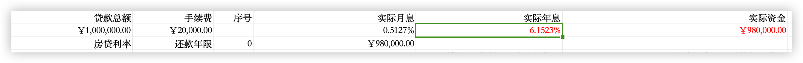

# 万成长房子：消费贷→房贷

买的 70万，现值 50 万；惠州50 万，每月 2700 元

买的 200万，现值180 万；广州 100 万，25 年6 月份，利息4000/月， 3年消费贷利率：4.8%，过桥贷手续费 2 万

老婆 30 万，27 年月份，等额本息每月 5000 月，5 年 1.8%利率

存款 60 万,   

1. 保住工作，现金流。
2. 不能保住，20 万，2024 年7月到期。

4万（生活费）+ 3万（老大）+3万（老二）+ 6 万（消费贷）+ 3万（惠州房贷）+ 6 万（广州房贷）=  25 万

收入9500元

支出12000元

 11万，房屋消费贷款，约定还款12月份

张利顺20万，家里支持

张利顺11万，其他方式

抵押贷款80万，首付+60万贷款

房贷60

惠州房贷40万

- [ ]  租房学位的问题
- [ ]  借款合同

目前最新房贷利率为：
住宅首套：LPR3.6%-60BP=3.0%
住宅二套：LPR3.6%-50BP=3.1%
公积金首套：2.85%，二套：3.325%
公寓类商贷：LPR3.6%+60BP=4.2%

张利顺20万，家里支持

张利顺11万，老婆公积金

抵押贷款80万，首付+60万贷款

第二次

贷款60万，第二次首付，我的首付，贷剩余本金

房贷60

惠州房贷40万

## 双方协议

甲方

姓名：张利顺

乙方

姓名：万成长

目标：甲方获取50万房贷，乙方置换成80万房贷。

## 执行计划

房产总价S=130万，首付D=20万，房贷L=110万

张利顺使用贷款：L1=50万

万成长使用贷款：L2=60万

### 张利顺买房，万成长卖房

- 执行流程
    1. 支付购房首付-张利顺
    2. 清空信贷，为申请房贷做准备-张利顺
    3. 向家里借款20万，偿还张利顺名下20万信贷-万成长
    4. 使用首付+向其他银行申请60万信贷，用于解押房产-万成长
    5. 向银行申请房屋抵押贷款-张利顺
    6. 房管局过户，支付契税1%，个人所得税1%-张利顺
    7. 收到总房款S元-万成长
    8. 偿还信贷60万-万成长
    9. 借给张利顺L1元房贷-万成长
    10. 还剩下首付D元，前面用了-万成长
    11. 出借款手续给万成长-张利顺
- 执行结果
    
    法律结果：
    
    1. 得到广州低价房产-张利顺
    2. 欠银行L元房贷-张利顺
    3. 得到总房款S元-万成长
    4. 张利顺向万成长出借L1元房贷
    5. 张利顺还L1元房贷月供
    
    私下结果：
    
    1. 还清银行消费抵押贷款-万成长
    2. 万成长欠张利顺D元首付
    3. 万成长还L2元房贷月供

### 万成长买房，张利顺卖房

- 背景
    
    房产总价S=130万，首付D=20万，房贷L=110万
    
    张利顺使用贷款：L1=50万
    
    万成长使用贷款：L2=60万
    
- 执行流程
    1. 准备购房首付-万成长
    2. 和银行协商，贷押过户-万成长
    3. 房管局过户，支付契税1%，个人所得税1%-万成长
    4. 收到到首付-张利顺
    5. 结算首付D2减去D1-张利顺
    6. 配合租房协议-张利顺
- 执行结果
    
    法律结果：
    
    1. 申请房贷L元-万成长
    2. 张利顺欠万成长L1元房贷

- 借条