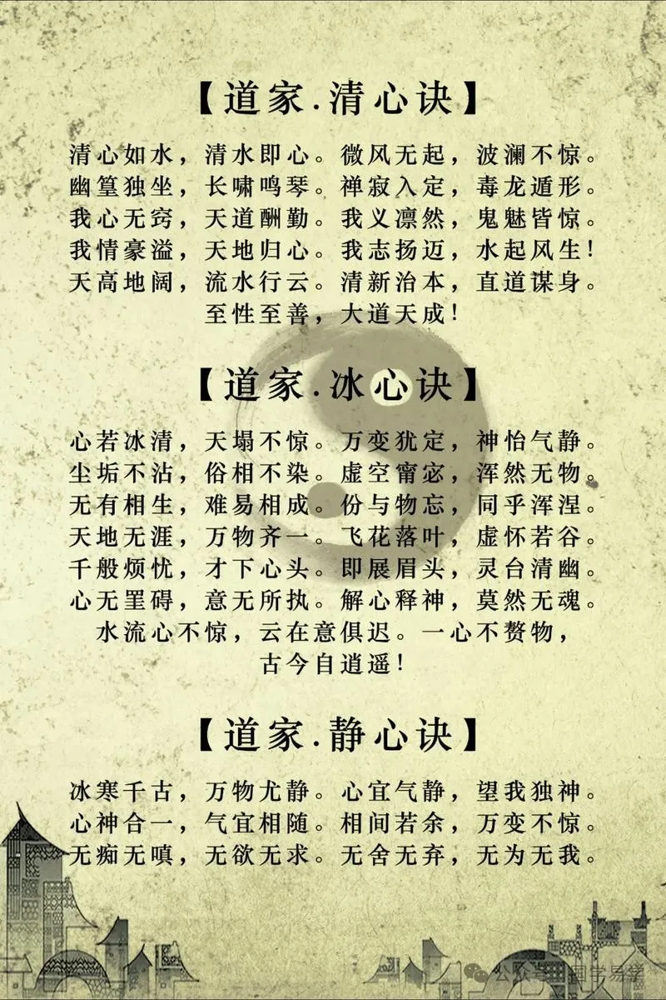
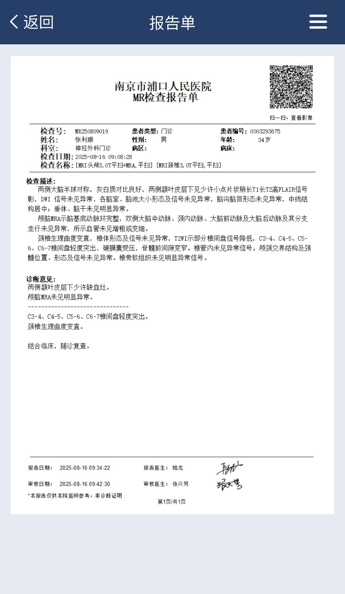
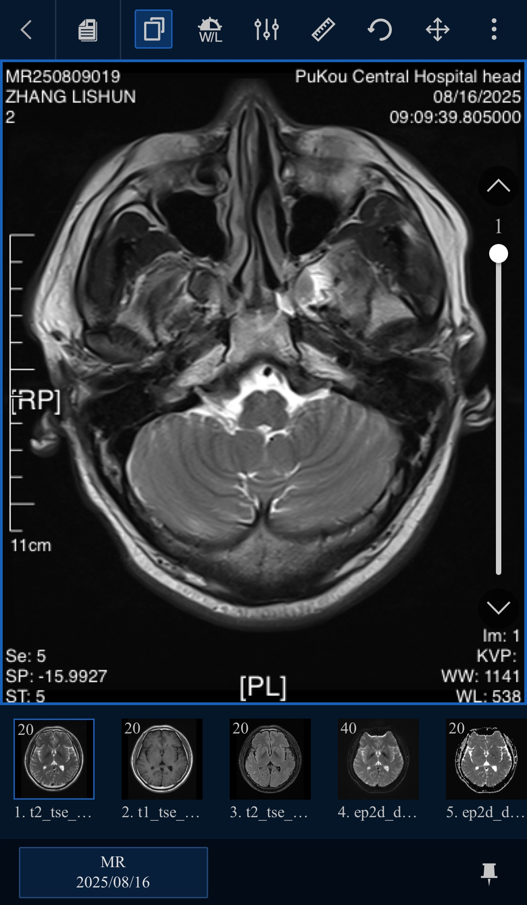
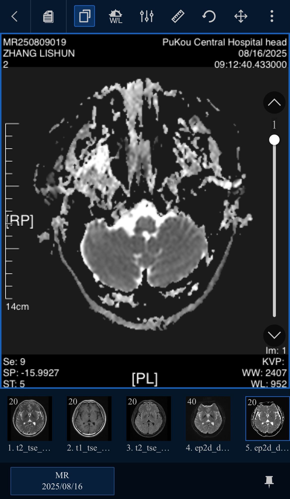
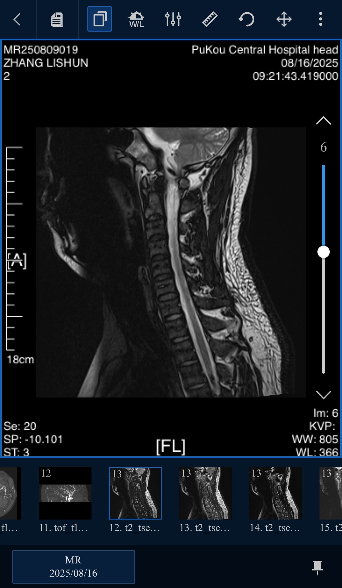
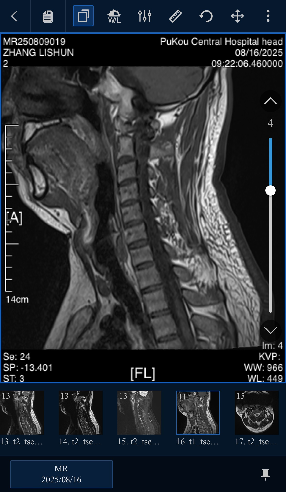
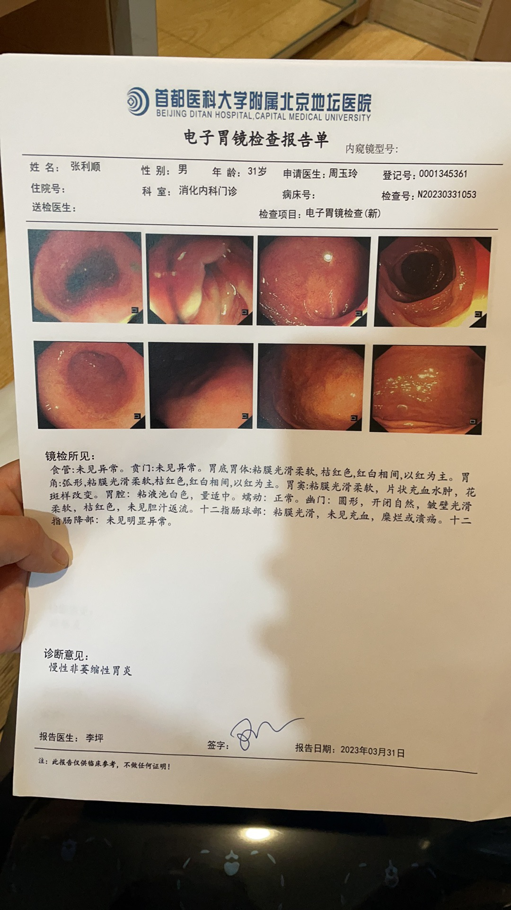
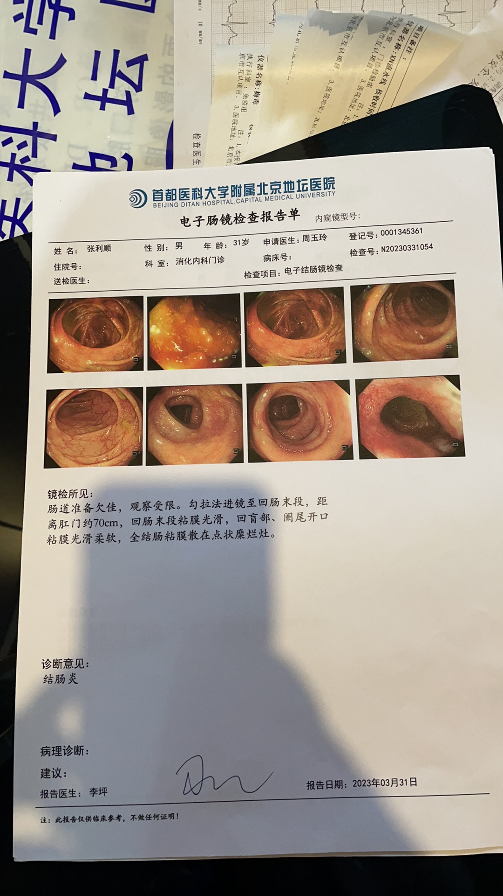
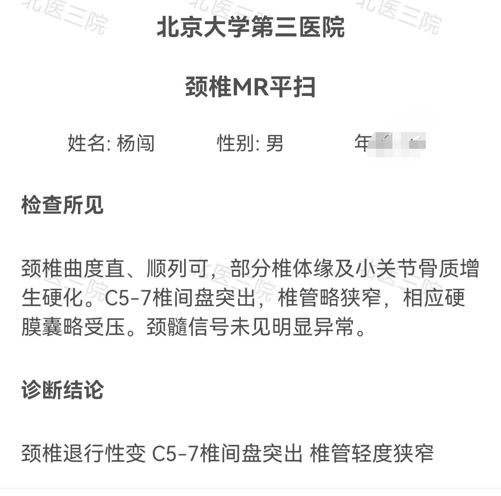
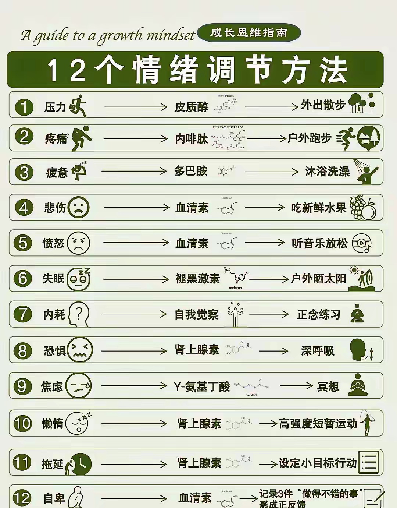

# 当下：健康管理

膳食纤维：

- 道家口诀，图片
    
    
    

**■ 如何预防脊柱损伤？**专家建议——
• 要强化脊柱的正常结构，锻炼肩背部、胸腰部甚至是腹部的肌肉群，让肌肉群给脊柱提供更好的稳定。
• 改良办公环境，最简单的办法就是在椅子后面放一个靠垫、靠枕，维持腰椎的前突。
• 使用电脑时，让电脑超过眼睛水平线10厘米。
• 每工作40～60分钟之后，起来活动10分钟左右。
• 多做卷腹、平板支撑等运动，对颈椎、腰椎的健康能起到很好的保护作用。

- 年龄34周岁，性别男，当前身高170CM，当前体重78kg，目前体重65kg，
健康状况良好
生活习惯：程序员，久坐，上下班骑10分钟的电动车，每周在家做一两次的轻度运动
    
    看到你的具体信息了！34岁、身高170cm、当前体重78kg（BMI=27，属于超重范围）、目标体重65kg（BMI=22.5，健康范围），健康状况良好，工作性质久坐（程序员），日常活动量很低（仅10分钟电动车通勤和每周1-2次轻度运动）。这个目标（减13kg）非常明确且合理，完全在健康减重范围内。
    
    **核心策略：** 针对你的久坐工作性质和当前较低的活动量，计划的核心是 **“温和热量缺口 + 饮食结构优化 + 显著增加日常活动与规律运动”**。重点在于可持续性，避免过于严苛导致难以坚持。
    
    **以下是为你量身定制的全面减肥计划：**
    
    ## 一、 目标设定与节奏（安全可持续）
    
    - **总体目标：** 78kg → 65kg (减重13kg)
    - **健康减重速度：** 每周0.5 - 1kg。
    - **预计达成时间：** 大约4-6个月（26周左右）。**不要追求快速！** 稳定减重更利于长期维持。
    - **短期里程碑：**
        - 第1个月：减重2-4kg (重点在习惯建立)
        - 第2个月：再减2-4kg
        - 第3-6个月：持续减重并巩固习惯，最终达到目标。
    
    ## 二、 饮食调整计划 (核心！占比70%)
    
    原则：**控制总热量，优化结构，保证蛋白质，充足纤维，减少空热量。**
    
    1. **每日热量目标：**
        - 估算你的基础代谢率(BMR)约为 1650-1700 大卡。
        - 考虑久坐活动系数，当前每日总消耗(TDEE)约为 2000-2100 大卡。
        - **安全热量缺口：** 设定每日摄入 **1600-1800 大卡**。这是温和缺口，更容易坚持且不易触发身体“节能模式”。
        - **分配建议：** 蛋白质 25-30% (100-135g)， 脂肪 25-30% (45-60g)， 碳水化合物 40-50% (160-225g)。**重点：优先保证蛋白质和蔬菜！**
    2. **具体饮食结构优化 (重中之重！)：**
        - **【大量蔬菜】**：每餐都要有！目标每天500g以上。选择绿叶菜(菠菜、生菜、油麦菜)、西兰花、菜花、番茄、黄瓜、蘑菇、芹菜、芦笋等。烹饪方式：凉拌、清炒(少油)、白灼、蒸、炖汤。
        - **【充足优质蛋白】**：每餐都要有！这是饱腹感和维持肌肉的关键。
            - 早餐：鸡蛋(1-2个全蛋+蛋白)、无糖/低糖酸奶、牛奶、少量瘦肉。
            - 午/晚餐：**重点！** 鸡胸肉、鱼虾、瘦牛肉(里脊)、瘦猪肉(里脊)、豆腐、豆干。每餐掌心大小份量(约100-150g生重)。
        - **【选择健康碳水】**：控制精米白面，替换为复合碳水。
            - 早餐：燕麦片(原味！40-50g干重)、全麦面包(1-2片)。
            - 午/晚餐：糙米、藜麦、燕麦米、红薯、紫薯、玉米、山药。每餐控制在 **半拳到一拳** 熟重（约100-150g熟重）。如果午餐有碳水，晚餐可以酌情再减少或不吃主食，用大量蔬菜和蛋白质代替。
        - **【健康脂肪】**：适量摄入，不可或缺。来源：烹饪用油(橄榄油、山茶油，每天15-20ml)、牛油果(1/4-1/2个/天)、坚果(原味杏仁/核桃，10-15g/天，作为加餐)。
        - **【严格限制】**：
            - **添加糖：** 戒掉含糖饮料(可乐、果汁、奶茶)、甜点、糖果、高糖零食。学会看配料表，白砂糖、果葡糖浆等排在前三位的尽量不吃。
            - **不健康脂肪：** 减少油炸食品、肥肉、动物皮、加工肉制品(香肠、培根)、高油外卖/快餐。少吃或不吃沙拉酱、蛋黄酱等高脂酱料。
            - **精制碳水：** 白米饭、白面条、白馒头、包子、饺子皮、蛋糕、饼干等要大幅减少，用健康碳水替代。
        - **【足量饮水】**：目标 **2-2.5升/天**。早起一杯温水，餐前一杯水，随身带水杯。喝白水、淡茶(绿茶/乌龙茶)、黑咖啡(无糖无奶或少量奶)。拒绝任何含糖饮料。
        - **【规律三餐，控制加餐】**：
            - 尽量固定三餐时间：早餐7：30-8：30， 午餐12：00-13：00， 晚餐18：30-19：30。避免长时间饥饿。
            - 如果两餐之间饿了，优先选择：一个水果(苹果、梨、柚子、草莓、蓝莓等低糖水果)、一杯无糖酸奶、少量坚果(10g)、黄瓜/番茄、1-2个水煮蛋。
            - **晚餐后禁食：** 晚餐后除了喝水，不再吃任何食物。这点对程序员尤其重要！
    3. **针对程序员久坐场景的饮食贴士：**
        - **自带健康午餐：** 提前准备是控制饮食最有效的方法。周末可集中备餐(煮好糙米/红薯，分装鸡胸肉、蔬菜)。
        - **点外卖技巧：** 优先选择清蒸、白灼、炖煮、凉拌的菜品。点“轻食沙拉”(注意酱料单独放，少加或不加，选择油醋汁)，或点广式/江浙菜系的蒸鱼、白切鸡、上汤蔬菜等。避免盖浇饭、炒饭、面条、油炸食品。米饭要求减半或换成粗粮。
        - **零食陷阱：** 清理工位上的高糖高脂零食(薯片、饼干、巧克力)。准备健康加餐如上所述。
        - **饮料陷阱：** 告别可乐、奶茶、含糖咖啡饮料。用无糖茶、黑咖啡、白水替代。提神可选黑咖啡(不加糖奶或少量纯牛奶)。
    
    ## 三、 运动与活动计划 (至关重要！占比30%)
    
    目标：**显著增加日常消耗，提高代谢，改善心肺，塑造体型。** 从低强度开始，循序渐进，重在坚持！
    
    1. **【首要任务：打破久坐！】** (最容易执行，效果累积显著)
        - **设置闹钟：** 每坐45-60分钟，站起来活动5-10分钟。起来接水、上厕所、原地踏步、做几个深蹲或拉伸。
        - **通勤改造：** 10分钟电动车通勤太短，消耗极低。如果条件允许且安全：
            - **强烈建议改为快走或骑行（自行车）！** 单程10分钟电动车，换成快走可能需要30-40分钟，骑行可能需要15-20分钟。**这是巨大的活动量提升！** 即使只改单程（比如下班走回家），也很有价值。
            - 如果无法全程替换，考虑提前下车，走完最后1-2公里。
        - **利用碎片时间：** 午休散步15-20分钟；打电话时站起来走动；能走楼梯绝不坐电梯。
    2. **【建立规律运动习惯】** (每周3-5次，每次30-60分钟)
        - **有氧运动 (燃脂主力)：** 每周3-4次，每次30-45分钟。
            - **入门推荐：快走！** 对关节压力小，容易上手。保持能说话但不能唱歌的强度。
            - **进阶选择：** 慢跑、游泳、骑自行车（健身车/动感单车）、椭圆机、跳绳（注意保护膝盖）。
            - **HIIT (可选)：** 时间效率高。例如：开合跳30秒 + 休息15秒；高抬腿30秒 + 休息15秒；深蹲30秒 + 休息15秒；俯卧撑(可跪姿)30秒 + 休息15秒。循环4-6轮，总计15-20分钟。**注意：** HIIT强度大，确保基础体能跟上，每周1-2次即可，放在有氧日或单独一天。
        - **力量训练 (增肌塑形，提高代谢)：** **强烈建议加入！** 每周2-3次（与有氧隔开或同天先力量后有氧），每次20-40分钟。
            - **重要性：** 增加肌肉量能显著提高基础代谢率（躺着也消耗更多），改善体型（瘦下来更紧致），对久坐人群预防腰背痛尤为重要。
            - **居家入门方案 (无需器械)：**
                - 深蹲 (练腿臀)：3组 x 12-15次
                - 俯卧撑 (练胸肩臂)：跪姿或标准，3组 x 力竭次数 (能做几个做几个)
                - 弓步蹲 (练腿臀平衡)：3组 x 每边10-12次
                - 平板支撑 (练核心)：3组 x 30-60秒
                - 臀桥 (练臀)：3组 x 15-20次
                - 鸟狗式 (练核心稳定)：3组 x 每边10-12次
            - **进阶：** 可购买一对可调节哑铃或弹力带，增加负重。关注主要肌群：胸、背、肩、手臂、腹部、腿部。
    3. **【执行建议】**
        - **固定时间：** 像安排会议一样安排运动时间。早晨、午休后、下班后都可以。找到最适合你的时段。
        - **循序渐进：** 不要一开始就追求高强度长时间。第一周可能只快走20分钟，做1组基础动作。慢慢增加时长、频率和强度。
        - **兴趣优先：** 选择你相对不那么排斥的运动。喜欢听音乐/播客？边听边快走/骑车。喜欢看剧？在跑步机/椭圆机上边看边练。
        - **记录追踪：** 使用运动APP或手写记录完成情况，看到累积效果会很有成就感。
    
    ## 四、 生活习惯与行为管理 (成功的基石)
    
    1. **【保证充足睡眠】：** 目标 **7-8小时** 高质量睡眠。规律作息，尽量11：30前睡觉。睡眠不足会严重影响饥饿激素，增加对高热量食物的渴望。
    2. **【管理压力与情绪】：** 程序员工作压力大，警惕“压力肥”和“情绪性进食”。学习替代方法：运动本身是解压良方、深呼吸/冥想、短暂离开工位走走、听音乐、与朋友聊天。
    3. **【记录与追踪】：**
        - **初期强烈建议记录饮食：** 使用MyFitnessPal、薄荷健康等APP记录3-7天，了解自己实际吃了什么，热量和营养结构如何。不用长期记，但初期是校准认知的好方法。
        - **定期称重：** 每周固定一天清晨（如周日），空腹、排便后、穿相似衣物称重并记录。**关注趋势，不纠结单日波动。**
        - **测量围度：** 每月测量一次腰围（肚脐水平）、臀围。有时体重不变，围度在减，说明体脂在降，肌肉在增。
    4. **【允许灵活性与“计划内放纵”】：** 完全禁止喜欢的食物不现实。可以每周安排1次“计划内放纵餐”，吃一份你很想吃的东西（控制份量！），或者喝一小杯无糖饮料解馋。关键是吃完后立刻回归健康计划，不因此内疚或破罐破摔。
    5. **【寻求支持】：** 告知家人你的计划，争取理解（比如晚餐配合做清淡些）。找志同道合的同事一起运动或分享健康餐。
    
    ## 五、 一周示例计划 (供参考，请根据自身情况调整)
    
    - **周一：** 力量训练 (居家基础动作) 30分钟 + 快走30分钟
    - **周二：** 中等强度有氧 (如游泳/骑行/椭圆机) 40分钟
    - **周三：** 休息日 或 低强度活动 (散步30分钟 + 充分拉伸)
    - **周四：** 力量训练 (居家基础动作) 30分钟 + HIIT 15分钟 (可选)
    - **周五：** 中等强度有氧 (快走/慢跑) 40分钟
    - **周六：** 较长时间有氧 (如户外骑行/爬山/快走60分钟) 或 喜欢的球类运动
    - **周日：** 休息日 或 轻度活动 (散步、瑜伽拉伸) + 称重记录
    - **每天：** 保证饮食结构 + 喝足水 + 打破久坐 (每小时活动5分钟)
    
    ## 六、 重要提醒
    
    1. **倾听身体：** 如果感到过度疲劳、头晕、疼痛，休息或降低强度。运动前后的热身和拉伸不可少。
    2. **平台期：** 减重过程中体重几周不变是正常的！检查饮食是否松懈？运动是否适应了需要增加强度/时长？睡眠压力如何？坚持执行，平台期会突破。可以尝试调整饮食结构（如碳水循环）或改变运动模式。
    3. **耐心与坚持：** 改变习惯需要时间。不要因为一两天的失误放弃整个计划。**持续的努力比追求完美更重要！**
    4. **健康第一：** 虽然你健康状况良好，但如果计划执行中感到任何严重不适，请暂停并咨询医生。达到目标体重后，进入维持期，仍需保持健康的饮食和运动习惯。
    
    **这份计划为你提供了一个清晰的框架和方向，但真正的成功在于你的执行和根据自身感受的微调。** 记住，你的目标不仅是减掉13kg，更是养成一种更健康、更有活力的生活方式，这对你的程序员生涯和长期健康都至关重要！
    
    **准备好了吗？现在就可以开始：**
    
    1. 从今天开始，记录你接下来3天的饮食（用APP）。
    2. 明天开始，尝试每坐1小时就站起来活动5分钟。
    3. 计划本周哪两天开始进行第一次快走和第一次力量训练（哪怕只有15分钟）？
    4. 清理掉手边的含糖饮料和不健康零食。
    
    **迈出第一步是最重要的！我在这里支持你，随时可以反馈你的进展、遇到的困难或疑问，我们可以一起调整优化计划。祝你开启这段成功的健康之旅！**
    

phq9心理测验

- 酒石酸唑吡坦片介绍
    
    酒石酸唑吡坦片是一种用于治疗失眠的短效镇静催眠药，以下是其详细介绍：
    
    ---
    
    ### **1. 药品名称**
    
    - **通用名**：酒石酸唑吡坦片
    - **商品名**（举例）：思诺思（Stilnox）、Ambien（国外常见）等。
    - **英文名**：Zolpidem Tartrate Tablets
    
    ---
    
    ### **2. 药理作用**
    
    - **机制**：选择性作用于大脑γ-氨基丁酸（GABA-A）受体的ω1亚型，增强GABA的抑制作用，从而产生镇静催眠效果。
    - **特点**：
        - **短效**：起效快（15-30分钟），半衰期约2-3小时，适合入睡困难者。
        - **较少影响睡眠结构**：对深睡眠和REM睡眠干扰较小，次日残留效应较低。
    
    ---
    
    ### **3. 适应症**
    
    - **短期治疗**成人失眠（通常不超过2-4周），尤其适用于：
        - 入睡困难
        - 夜间频繁觉醒
    
    ---
    
    ### **4. 用法用量**
    
    - **成人**：通常10mg，睡前立即服用（老年人或肝功能不全者减半至5mg）。
    - **用药时间**：需确保服药后至少有7-8小时睡眠时间，避免次日嗜睡。
    - **禁忌**：
        - 对成分过敏者
        - 严重呼吸功能不全、重症肌无力、睡眠呼吸暂停综合征患者
        - 18岁以下儿童及哺乳期妇女
    
    ---
    
    ### **5. 不良反应**
    
    - **常见**：头晕、嗜睡、头痛、胃肠道不适。
    - **罕见但严重**：
        - 复杂睡眠行为（如梦游、驾车/进食时无意识）。
        - 记忆障碍、幻觉、依赖性（长期使用）。
    
    ---
    
    ### **6. 注意事项**
    
    - **依赖风险**：长期使用可能导致耐受性或心理依赖，需严格遵医嘱。
    - **避免饮酒**：加重中枢抑制，增加呼吸风险。
    - **特殊人群**：孕妇（慎用）、老年人（易跌倒）、抑郁症患者（可能加重症状）。
    
    ---
    
    ### **7. 药物相互作用**
    
    - **增强作用**：与其他中枢抑制剂（如苯二氮䓬类、阿片类、酒精）联用会加重嗜睡。
    - **影响代谢**：CYP3A4抑制剂（如酮康唑）可能延长药效。
    
    ---
    
    ### **8. 制剂规格**
    
    - 常见规格：5mg/片、10mg/片（以唑吡坦计）。
    
    ---
    
    ### **9. 过量处理**
    
    - 症状：严重嗜睡、昏迷、呼吸抑制。
    - 措施：立即就医，对症支持治疗（如洗胃、呼吸支持）。
    
    ---
    
    ### **温馨提示**
    
    - 仅作为短期治疗使用，长期失眠需排查病因。
    - 服药后避免驾驶或操作机械。
    
    具体用药请严格遵循医生或药师指导。
    
- 奥沙西拌片介绍
    
    ### **奥沙西泮片（Oxazepam Tablets）详细说明**
    
    ### **1. 药品基本信息**
    
    - **通用名**：奥沙西泮片
    - **英文名**：Oxazepam Tablets
    - **商品名**（举例）：舒宁（Serax，国外常见）、优菲（部分国内商品名）
    - **化学分类**：苯二氮䓬类（BZD）镇静催眠药
    
    ---
    
    ### **2. 药理作用**
    
    - **作用机制**：
        - 增强中枢神经系统γ-氨基丁酸（GABA）的抑制性作用，降低神经元兴奋性。
        - 选择性作用于边缘系统（抗焦虑）和大脑皮层（镇静）。
    - **药效特点**：
        - **中效药物**：半衰期约5~15小时，作用温和，成瘾性相对较低。
        - **无活性代谢产物**：经肝脏直接代谢为无活性物质，安全性较高，适合老年或肝功能不全者。
    
    ---
    
    ### **3. 适应症**
    
    - **焦虑障碍**：短期缓解焦虑症状（如广泛性焦虑症）。
    - **失眠**：伴焦虑的失眠（尤其适合夜间易醒患者）。
    - **酒精戒断综合征**：缓解震颤、激越等症状。
    - **辅助治疗**：某些躯体疾病（如消化性溃疡）伴发的焦虑。
    
    ---
    
    ### **4. 用法用量**
    
    - **成人**：
        - **焦虑**：15~30mg/次，3~4次/日。
        - **失眠**：15~30mg，睡前服用。
        - **酒精戒断**：初始30mg，3~4次/日，逐渐减量。
    - **老年人/肝损患者**：从10mg起始，谨慎调整剂量。
    - **禁忌症**：
        - 对苯二氮䓬类过敏、重症肌无力、急性闭角型青光眼、严重呼吸功能不全。
        - 妊娠期（尤其孕晚期）、哺乳期妇女禁用。
    
    ---
    
    ### **5. 不良反应**
    
    - **常见**：嗜睡、头晕、乏力、步态不稳（老年人易跌倒）。
    - **少见但严重**：
        - 记忆障碍、 paradoxical反应（如兴奋、攻击行为）。
        - 长期使用可能导致依赖性、戒断症状（突然停药易反弹焦虑或抽搐）。
    
    ---
    
    ### **6. 注意事项**
    
    - **依赖风险**：连续使用超过4周需评估依赖性，避免突然停药（需逐渐减量）。
    - **特殊人群**：
        - 老年人：更敏感，需减少剂量。
        - 抑郁症患者：可能加重自杀倾向。
    - **相互作用**：
        - **禁止联用**：酒精、阿片类药物（增加呼吸抑制风险）。
        - **谨慎联用**：CYP3A4抑制剂（如红霉素）可能增强药效。
    
    ---
    
    ### **7. 制剂规格**
    
    - 常见规格：10mg/片、15mg/片。
    
    ---
    
    ### **8. 过量处理**
    
    - **症状**：过度镇静、昏迷、呼吸抑制。
    - **治疗**：立即就医，氟马西尼（BZD拮抗剂）可逆转中毒症状。
    
    ---
    
    ### **9. 与其他苯二氮䓬类的区别**
    
    | **特性** | **奥沙西泮** | **地西泮（安定）** |
    | --- | --- | --- |
    | **半衰期** | 中效（5~15h） | 长效（20~50h） |
    | **代谢途径** | 直接葡萄糖醛酸化 | 转化为活性代谢产物 |
    | **适用人群** | 老年/肝损患者更安全 | 易蓄积，需谨慎 |
    
    ---
    
    ### **温馨提示**
    
    - 服药期间避免驾驶或操作机械。
    - 长期治疗需定期复诊，避免自行调整剂量。
    
    **注**：具体用药需严格遵循医生或药师指导。
    
- 草酸艾司西酞普兰片介绍
    
    ### **草酸艾司西酞普兰片（Escitalopram Oxalate Tablets）使用指南**
    
    ### **1. 药品基本信息**
    
    - **通用名称**：草酸艾司西酞普兰片
    - **英文名称**：Escitalopram Oxalate Tablets
    - **商品名称**：来士普（Lexapro）、百适可（国产）
    - **药物分类**：选择性5-羟色胺再摄取抑制剂（SSRIs）
    
    ### **2. 药理作用**
    
    - **作用机制**：高选择性抑制5-HT转运体，增强中枢神经系统突触间隙5-HT浓度
    - **药效特点**：
        - 抗抑郁效果显著
        - 抗焦虑作用突出
        - 药物相互作用较少
        - 不良反应相对较轻
    
    ### **3. 适应症**
    
    - 抑郁症（包括伴有焦虑的抑郁症）
    - 广泛性焦虑障碍
    - 惊恐障碍
    - 强迫症（OCD）
    
    ### **4. 用法用量**
    
    - **初始剂量**：5-10mg/日
    - **治疗剂量**：10-20mg/日
    - **最大剂量**：不超过20mg/日
    - **服药时间**：建议早晨服用
    - **疗程**：急性期治疗6-8周，维持治疗4-6个月
    
    ### **5. 不良反应**
    
    - **常见不良反应**：
        - 恶心、口干
        - 头痛、失眠
        - 多汗、乏力
    - **严重不良反应**（罕见）：
        - 5-HT综合征
        - QT间期延长
        - 自杀观念（尤其青少年）
    
    ### **6. 禁忌症**
    
    - 对西酞普兰或艾司西酞普兰过敏者
    - 正在使用MAOIs的患者
    - 严重肝功能不全者
    - 先天性QT间期延长综合征患者
    
    ### **7. 注意事项**
    
    - 需缓慢调整剂量
    - 停药时应逐渐减量
    - 监测自杀风险（尤其治疗初期）
    - 注意药物相互作用
    - 妊娠期慎用（FDA妊娠分级C级）
    
    ### **8. 药物相互作用**
    
    - 禁止与MAOIs合用
    - 慎与其他5-HT能药物联用
    - 可能增强华法林的抗凝作用
    - CYP2C19抑制剂可能升高其血药浓度
    
    ### **9. 特殊人群用药**
    
    - **老年人**：建议从5mg起始
    - **肝功能不全**：剂量减半
    - **肾功能不全**：轻中度无需调整
    - **儿童青少年**：需密切监测行为变化
    
    ### **10. 药物过量处理**
    
    - 症状：嗜睡、震颤、恶心
    - 处理：对症支持治疗
    - 特效解毒剂：无
    
    ### **11. 制剂规格**
    
    - 5mg/片
    - 10mg/片
    - 20mg/片
    
    ### **12. 储存条件**
    
    - 避光，密封保存
    - 温度不超过30℃
    
    **重要提示**：
    
    1. 需坚持规律服药，疗效通常在2-4周显现
    2. 不可擅自停药
    3. 出现异常反应及时就医
    4. 治疗期间避免饮酒
    
    *注：具体用药方案请遵医嘱，本资料仅供参考。*
    
- 盐酸曲唑酮缓释片介绍
    
    ### **一、 核心概要**
    
    盐酸曲唑酮缓释片是一种用于治疗**抑郁症**的处方药。它属于**5-羟色胺拮抗和再摄取抑制剂（SARI）** 类的抗抑郁药。与普通片剂相比，**缓释片**的特点是药物在体内缓慢、持续地释放，从而能**维持更平稳的血药浓度**，通常一天只需服用一次，有助于减少血药浓度的波动所带来的副作用（如头晕、嗜睡），并提高患者的用药依从性。
    
    ### **二、 作用机制**
    
    它的作用机制与其他常见抗抑郁药（如SSRI）有所不同，主要通过双重途径起效：
    
    1. **抑制5-羟色胺再摄取**：像SSRI一样，它能阻止大脑神经细胞对神经递质“5-羟色胺”（又称血清素，与情绪、睡眠、食欲密切相关）的再吸收，从而增加大脑中5-羟色胺的浓度，改善情绪。
    2. **阻断5-羟色胺2A受体**：这是它独特的一点。通过阻断这个受体，它可以：
        - 减轻其他抗抑郁药常见的副作用（如性功能障碍、焦虑、失眠）。
        - 促进睡眠，因为它对组胺H1受体也有一定的阻断作用，具有显著的镇静效果。
    
    ### **三、 主要适应症**
    
    1. **治疗抑郁症（Depression）**：这是其主要适应症。用于缓解抑郁情绪、兴趣减退、食欲改变、睡眠障碍、疲劳、自责自卑、注意力不集中等症状。
    2. **改善睡眠**：由于其强力的镇静催眠效果，即使在较低剂量下，它也常被医生**超说明书（Off-label）** 用于治疗失眠，特别是与抑郁症共病的失眠。它能有效缩短入睡时间，减少夜间觉醒。
    
    ### **四、 用法用量**
    
    - **必须遵医嘱**。医生会根据您的病情、身体反应和耐受性来决定剂量。
    - **通常起始剂量较低**，例如每晚50-100mg，随餐或餐后立即服用，以减少胃肠道不适和头晕的风险。
    - **剂量会逐渐增加**。维持剂量通常在150mg到300mg之间，最大剂量一般不超过300mg。
    - **每日一次，睡前服用**。利用其镇静副作用来帮助睡眠是最常见的用法。
    - **缓释片应整片吞服**，不可掰开、压碎或咀嚼，否则会破坏缓释结构，导致药物突然大量释放，增加副作用风险。
    
    ### **五、 常见副作用**
    
    大多数副作用在治疗初期出现，随着身体适应会逐渐减轻。
    
    1. **非常常见**：
        - **嗜睡、 drowsiness**：这是最常见的副作用，也是为什么建议睡前服用的原因。
        - **头晕、头昏**。
    2. **常见**：
        - 口干、恶心。
        - 便秘、视力模糊。
        - 低血压（特别是体位性低血压，即蹲下或躺下后突然站起时头晕）。
    3. **需要警惕的罕见但严重的副作用**：
        - **阴茎异常勃起（Priapism）**：这是曲唑酮一种**罕见但非常严重**的副作用。表现为疼痛性的、长时间的勃起（超过4小时）。**如果发生这种情况，必须立即停止服药并紧急就医**，否则可能导致永久性勃起功能损伤。虽然罕见，但所有男性患者都应知晓这一风险。
        - 血清素综合征（Serotonin Syndrome）：当与其他升高5-羟色胺的药物合用时可能发生，表现为激动、幻觉、心跳过速、血压变化、高热、肌肉僵硬等。
        - 心律失常。
    
    ### **六、 重要注意事项与禁忌**
    
    - **禁忌**：
        - 对曲唑酮或任何成分过敏者禁用。
        - 严重的心脏病、肝功能严重受损的患者禁用。
        - 近期有心肌梗死病史的患者禁用。
    - **注意事项**：
        - **不能与单胺氧化酶抑制剂（MAOI）** 类抗抑郁药同时使用，或在停用MAOI14天内使用，否则可能引发致命的5-羟色胺综合征。
        - 告知医生您正在使用的所有药物，包括非处方药和草药补充剂（特别是其他抗抑郁药、镇静剂、抗真菌药、抗生素等），以避免药物相互作用。
        - **服药期间避免饮酒**，酒精会加重中枢神经抑制（嗜睡、头晕），增加危险。
        - 服药后可能会感到困倦，**在明确药物对您的影响前，应避免驾驶、操作机械或进行需要高度警觉的活动**。
        - 老年人对药物更敏感，起始剂量通常更低。
        - 孕妇、哺乳期妇女使用前需与医生充分权衡利弊。
    
    ### **七、 优点与缺点总结**
    
    - **优点**：
        - 抗抑郁效果确切。
        - 对改善睡眠，特别是抑郁伴发的失眠，效果非常显著。
        - 性功能障碍的发生率远低于SSRI类药物（如氟西汀、帕罗西汀）。
        - 缓释剂型一天一次，方便且血药浓度平稳。
    - **缺点**：
        - 镇静、嗜睡、头晕的副作用比较常见。
        - 存在罕见但严重的阴茎异常勃起风险（男性患者）。
        - 起效时间与其他抗抑郁药类似，通常需要2-4周才能显现出全面的抗抑郁效果。
    
    ---
    
    **最后再次强调**：盐酸曲唑酮缓释片是一种有效的处方抗抑郁药，但必须在精神科或内科医生的指导下使用。医生会为您评估是否适合此药，并制定个性化的治疗方案。请勿自行购药或调整剂量。
    
- 乌灵胶囊介绍
    
    ### **一、 核心概要**
    
    乌灵胶囊是一种**纯中药制剂**的国家一类新药，属于**中成药**。它并非化学合成的西药，其核心成分是从我国珍稀药用真菌——**乌灵菌**中分离获得的菌丝体，通过发酵工艺精制而成。在临床上，它被广泛用于**心身疾病**的辅助治疗，以其**安全性高、副作用少**而著称，常单独或与西药联合使用。
    
    ### **二、 成分与来源**
    
    - **主要成分**：**乌灵菌粉**。
    - **来源故事**：乌灵参是一种生长在地下废弃黑翅土白蚁巢穴中的珍稀药用真菌，非常罕见。现代科研成功实现了**乌灵菌的工业化发酵培养**，从而能够大规模生产乌灵胶囊，避免了破坏自然资源和生态，也保证了药品质量的稳定性。
    
    ### **三、 功能主治（中医理论）**
    
    根据国家药品说明书，其功能主治用中医术语表述为：
    
    - **功能**：**补肾健脑，养心安神**。
    - **主治**：用于**心肾不交证** 所导致的失眠、健忘、神疲乏力、腰膝酸软、头晕耳鸣、少气懒言、脉细或沉无力等症。
        - **“心肾不交”** 是中医的一个证型，简单理解就是“心火”与“肾水”的平衡失调，导致心神得不到滋养，从而出现一系列神经、精神方面的症状。
    
    ### **四、 现代医学应用（西医理解与临床应用）**
    
    在现代医学领域，乌灵胶囊主要通过调节神经系统发挥作用，常用于治疗：
    
    1. **失眠症**：这是其最核心的应用。尤其适用于**轻中度失眠**，或作为重度失眠的辅助用药。它能改善睡眠质量，延长睡眠时间，且不像传统安眠药那样容易产生依赖和戒断反应。
    2. **焦虑、抑郁状态**：可用于缓解轻中度的焦虑和抑郁情绪，常与抗焦虑、抗抑郁的西药联合使用，能起到协同增效、减少西药用量的作用。
    3. **神经衰弱**：改善由于长期紧张、疲劳引起的疲劳感、情绪不稳、头痛、记忆力下降等症状。
    4. **心身疾病**：如**更年期综合征**（缓解潮热、心悸、情绪波动）、**肠易激综合征**（与情绪相关的肠胃不适）、**紧张性头痛**等。
    5. **改善认知功能**：对脑力劳动者、学生或老年人出现的**健忘、注意力不集中**等有一定改善作用。
    
    ### **五、 作用机制（现代药理学研究）**
    
    研究表明，乌灵胶囊的作用并非单一靶点，而是多方面的：
    
    - **调节神经递质**：能增加大脑中**γ-氨基丁酸（GABA）** 的含量。GABA是中枢神经系统最重要的抑制性神经递质，可以降低神经元兴奋性，从而产生镇静、抗焦虑、抗惊厥的作用。
    - **改善脑能量代谢**：提高大脑对能量物质（如ATP）的利用，为大脑功能活动提供能量保障。
    - **营养神经**：含有丰富的氨基酸、多糖、微量元素等，对神经细胞有营养和保护作用。
    - **调节免疫功能**：具有一定的免疫调节作用，这可能与其改善由 stress 导致的免疫功能紊乱有关。
    
    ### **六、 用法用量**
    
    - **口服**。
    - **通常剂量**：一次3粒，一日3次。
    - **疗程**：一般**建议疗程为2-4周**，或遵医嘱。具体疗程长短需根据病情决定。
    - **特色**：相对于西药，其起效通常更**温和**，需要一定时间的积累。
    
    ### **七、 优点与特点**
    
    1. **天然药物，安全性高**：不良反应罕见且轻微，总体安全性良好。
    2. **无依赖性和成瘾性**：不会像苯二氮䓬类安眠药（如安定）那样产生依赖和戒断反应，适合长期调理。
    3. **不影响白天精神状态**：在改善夜间睡眠的同时，通常不会导致次日昏昏沉沉的“宿醉效应”。
    4. **兼具安神与健脑**：不仅治疗失眠，对记忆力、注意力等认知功能也有改善。
    5. **联合用药优势**：与西药（如抗抑郁药、安眠药）联用时，可以增强疗效，并可能减少西药的用量和副作用。
    
    ### **八、 注意事项**
    
    - **禁忌**：对本品过敏者禁用。
    - **孕妇、哺乳期妇女**：使用前应咨询医生，权衡利弊。虽然安全性较高，但仍需谨慎。
    - **驾驶员及高空作业者**：虽然罕见，但个别患者服药后仍可能有嗜睡反应，用药期间需观察自身反应，必要时谨慎从事相关危险工作。
    - **疾病诊断**：失眠和情绪问题可能是其他躯体疾病的症状，使用前应明确诊断。
    - **疗效**：对于**重度抑郁症、焦虑症**等，乌灵胶囊通常作为**辅助治疗**手段，不能完全替代主流西药。是否需要联合用药或单独使用，必须由医生判断。
    
    ---
    
    ### **总结对比（与盐酸曲唑酮缓释片相比）**
    
    | 特性 | **乌灵胶囊** | **盐酸曲唑酮缓释片** |
    | --- | --- | --- |
    | **性质** | 中成药（天然发酵制剂） | 化学合成西药 |
    | **分类** | 安神补脑类 | SARI类抗抑郁药 |
    | **核心作用** | 补肾健脑，养心安神（调节整体功能） | 抑制5-HT再摄取及拮抗其受体（靶向调节神经递质） |
    | **起效速度** | 相对较慢，温和调理 | 相对较快（但仍需2-4周抗抑郁起效） |
    | **主要优势** | 安全性高，无依赖性，改善认知，适合长期调理 | 抗抑郁作用明确，改善睡眠效果强，对性功能影响小 |
    | **主要应用** | 轻中度失眠、焦虑状态、神经衰弱、更年期综合征 | 抑郁症（尤其伴失眠、焦虑者）、失眠症 |
    | **副作用** | 罕见且轻微（偶有腹胀、口干） | 较常见（嗜睡、头晕），有罕见但严重的风险（阴茎异常勃起） |
    
    **最终建议**：选择哪种药物，或者是否需要联合使用，是一个专业的医疗决策。请务必在医生指导下，根据您的具体病情、身体状况和个人需求来选择最合适的治疗方案。
    

[每天5分钟远离颈椎病-挂图.pdf](%E5%BD%93%E4%B8%8B%EF%BC%9A%E5%81%A5%E5%BA%B7%E7%AE%A1%E7%90%86/%E6%AF%8F%E5%A4%A95%E5%88%86%E9%92%9F%E8%BF%9C%E7%A6%BB%E9%A2%88%E6%A4%8E%E7%97%85-%E6%8C%82%E5%9B%BE.pdf)

[八段锦——经典古代健身操.pdf](%E5%BD%93%E4%B8%8B%EF%BC%9A%E5%81%A5%E5%BA%B7%E7%AE%A1%E7%90%86/%E5%85%AB%E6%AE%B5%E9%94%A6%E7%BB%8F%E5%85%B8%E5%8F%A4%E4%BB%A3%E5%81%A5%E8%BA%AB%E6%93%8D.pdf)

- 25年8月16号头颈核磁
    - MR检查报告单
        
        
        
    - 头部核磁
        
        
        
        
        
    - 颈部核磁
        
        
        
        
        

- 怎样才能帮助抑郁症患者进入心流状态？
    
    帮助抑郁症患者进入心流状态需要结合其心理特点（如低动机、注意力涣散、自我效能感低下等），通过**循序渐进的引导、适配的活动设计**和**支持性环境构建**，降低进入心流的门槛。以下是具体可操作的策略：
    
    ### 一、从“降低阻力”开始：为心流创造基础条件
    
    抑郁症患者的核心困境是“启动难”“坚持难”，因此第一步需减少活动的“心理负担”，而非直接追求“心流体验”。
    
    1. **选择“低门槛、高熟悉度”的活动**
        
        心流需要“能力与挑战的平衡”，对抑郁症患者而言，“平衡”的关键是**从“几乎能完成”的任务起步**，避免因难度过高引发挫败感。
        
        - 优先选择患者**过去擅长或喜欢**的活动（如曾爱画画的人从涂色开始，曾爱运动的人从散步5分钟开始），利用熟悉感降低心理阻力。
        - 若患者暂无明确兴趣，可尝试“无目的的简单活动”（如整理桌面、拼一块拼图、浇花），这类活动目标清晰、反馈即时（完成后能看到变化），易产生“掌控感”。
    2. **拆解任务，设定“微小目标”**
        
        抑郁症患者对“宏大目标”易产生无力感，需将活动拆解为**“一步就能完成”的最小单元**，通过“高频小成功”积累信心。
        
        - 例如：想让患者读书，不要求“读1小时”，而是“读1页”；想让其做手工，不要求“完成一个作品”，而是“剪一刀彩纸”。
        - 完成后，主动提醒其“你做到了”（强化积极反馈），避免其因“觉得太简单而否定意义”。
    3. **减少干扰，创造“无压力空间”**
        
        抑郁症患者的注意力易被负面思维或外界刺激打断，需为活动创造**“低干扰、低评价”的环境**：
        
        - 物理环境：选择安静、整洁的空间（如关闭手机通知、减少他人打扰），避免杂乱环境加剧焦虑。
        - 心理环境：强调“活动本身没有对错”（如“画画不需要好看，涂满颜色就好”），减少“必须做好”的压力——对抑郁症患者而言，“完成”比“完美”更重要。
    
    ### 二、在活动中“引导专注”：搭建进入心流的桥梁
    
    心流的核心是“高度专注”，而抑郁症患者常被反刍思维困扰，需通过**主动引导注意力聚焦**，帮助其从“分心”转向“沉浸”。
    
    1. **用“感官锚定”拉回当下**
        
        抑郁症患者的注意力容易飘向过去或未来的负面想法，可通过**激活感官体验**（视觉、听觉、触觉等），将其拉回“此刻的活动”：
        
        - 例如：做园艺时，引导其关注“泥土的湿润感”“叶子的纹路”“浇水时的声音”；拼图时，让其触摸拼图边缘的凹凸感，观察图案的颜色衔接。
        - 感官细节的关注能阻断反刍思维，逐渐形成“专注于当下动作”的惯性。
    2. **强化“即时反馈”，放大“微小进步”**
        
        心流需要对“进展”的感知，而抑郁症患者对积极反馈的敏感度较低，需**主动创造并强调反馈**：
        
        - 活动中，及时指出“具体的变化”（如“你刚拼好的这一块，让图案的角落完整了”“这朵花被你浇过水后，花瓣更舒展了”），用具体细节替代笼统的“你真棒”。
        - 鼓励患者“自我观察”（如“你看，这页书已经读完了，手指划过的地方就是进度”），帮助其建立“自己与任务进展”的连接感。
    3. **用“节奏化”降低注意力消耗**
        
        重复性、有节奏的活动（如散步、编织、临摹、听着固定节奏的音乐做事）能**减少“需要做选择”的心理耗能**，让注意力更易集中：
        
        - 例如：散步时，引导其跟随“呼吸节奏”迈步（吸气走2步，呼气走2步）；画画时，用同一支笔重复画简单的线条，感受笔尖在纸上的摩擦感。
        - 节奏性活动能像“心理锚”一样，稳定情绪并逐渐深化专注。
    
    ### 三、用“支持性互动”维持动力：避免中途放弃
    
    抑郁症患者的动机易波动，可能因微小挫折（如“没做好”）放弃活动，需通过**非强迫的陪伴与鼓励**，帮助其持续投入。
    
    1. **“共同参与”而非“旁观督促”**
        
        独自活动对抑郁症患者而言易产生孤独感和压力，若有家人或朋友**以“平等参与者”的身份加入**（而非“监督者”），能提升安全感：
        
        - 例如：患者拼图时，陪伴者也拼另一块；患者做饭时，陪伴者帮忙洗一个菜（不指挥、不催促）。
        - 互动中保持“适度沉默”，避免过度对话打断其专注，仅在其分心时用“我们接下来拼这一块吧”等温和提示拉回注意力。
    2. **接纳“中断”，允许“灵活调整”**
        
        抑郁症患者可能中途因情绪低落或疲劳放弃，此时需**避免指责“你又没坚持”**，而是接纳“中断是正常的”：
        
        - 例如：“今天做到这里已经很好了，明天我们可以从这一步继续”；若患者彻底不想做，可提议“那我们换个更简单的（如只看5分钟拼图图案）”。
        - 关键是让患者感受到“活动是可以掌控的”，而非“必须完成的任务”，避免因压力而彻底排斥。
    3. **用“非评价性语言”强化内在动机**
        
        心流的动力是“活动本身的乐趣”，需帮助患者从“为了别人的认可而做”转向“为了自己的体验而做”：
        
        - 避免说“你做这个是为了好起来”（隐含压力），而是说“你刚才涂颜色的时候，好像比刚才放松了一点”（描述其当下的状态）。
        - 当患者主动提及“有点意思”时，及时回应“看来你刚才投入进去了”，强化其对“自身感受”的关注。
    
    ### 四、特殊注意：结合抑郁程度调整策略
    
    - **重度抑郁期**：优先以“完成微小动作”为目标（如每天拿起画笔1次），不追求专注或愉悦，仅为“打破完全静止的状态”；此时心流并非核心目标，需配合药物和专业治疗。
    - **轻度抑郁或恢复期**：可逐步提升活动难度（如从涂色到简单素描，从散步5分钟到10分钟），通过“能力提升”与“挑战增加”的同步推进，逐渐接近心流所需的“平衡阈值”。
    
    ### 总结：帮助抑郁症患者进入心流的核心，是“降低门槛、接纳局限、陪伴体验”。
    
    心流的本质是“自主的投入”，而非“被要求的状态”。对抑郁症患者而言，哪怕只是“专注了1分钟”“感受到一点微小的掌控感”，都是有意义的——这些碎片式的体验会像水滴一样，慢慢渗透“绝望的坚硬外壳”，最终让他们重新感受到“自己仍有能力与世界建立连接”。
    

- 身体湿气和寒气重的话，夏天还可以吃雪糕吗
    
    从中医角度看，**湿气和寒气重的人在夏天应尽量避免吃雪糕**。虽然夏季炎热，但雪糕的寒凉属性会加重体内湿寒，可能引发或加重不适。以下是具体分析和建议：
    
    ---
    
    ### **为什么不建议吃？**
    
    1. **损伤脾阳，加重湿气**
        - 脾主运化水湿，但寒凉食物会直接损伤脾胃阳气。
        - 脾阳不足会导致湿气无法代谢，堆积在体内，出现乏力、腹胀、大便黏腻等症状。
    2. **寒气内侵，加重体寒**
        - 雪糕的低温会刺激脏腑，导致寒气直中脾胃（中医称为"中寒"）。
        - 可能引发腹痛、腹泻、女性痛经，或长期手脚冰凉。
    3. **"外热内寒"的夏季体质**
        - 夏季人体毛孔张开，阳气浮于体表，内脏反而相对虚寒。
        - 此时吃雪糕如同"趁虚而入"，更易伤及根本。
    
    ---
    
    ### **替代方案：健康解暑选择**
    
    1. **温和祛湿饮品**
        - 生姜红枣茶（生姜3片+红枣5颗煮水）
        - 红豆薏米水（炒熟的薏米+赤小豆，体质偏寒加几片生姜）
        - 陈皮山楂茶（理气化湿）
    2. **常温解暑食物**
        - 绿豆汤（放温后饮用）
        - 新鲜瓜果：西瓜、哈密瓜（适量，避免冰镇）
        - 酸梅汤（常温饮用，生津止渴）
    3. **局部物理降温**
        - 用湿毛巾擦手腕、颈部
        - 饮用凉白开（非冰水）
    
    ---
    
    ### **如果实在想吃怎么办？（补救措施）**
    
    1. **严格限制频率与量**：每月不超过1-2次，每次不超过半根。
    2. **选择午后食用**：避开早晨（阳气初升）和晚上（阳气内收）。
    3. **缓慢含化不吞**：减少对胃肠的低温刺激。
    4. **搭配温热食物**：如吃完后喝一小杯姜茶暖胃。
    5. **观察身体反应**：若出现舌苔变厚、大便稀溏、腹胀等，立即停止。
    
    ---
    
    ### **重点调理建议**
    
    | **方向** | **具体方法** |
    | --- | --- |
    | **饮食温中** | 多吃山药、南瓜、小米、生姜 |
    | **避免湿冷** | 戒冷饮、甜腻食物（蛋糕、奶茶） |
    | **运动升阳** | 每天快走30分钟或八段锦 |
    | **外治辅助** | 艾灸足三里、中脘穴；睡前泡脚（水温40℃） |
    
    > 📌 关键提醒：夏季其实是祛湿寒的黄金期！
    > 
    > 
    > 利用自然阳气旺盛的特点，通过运动、艾灸、温饮等方式"冬病夏治"，反而能显著改善体质。
    > 
    
    ---
    
    **总结**：湿寒体质者吃雪糕如同"雪上加霜"，短暂愉悦可能换来长期不适。**身体需要的不是冰凉的放纵，而是温暖的滋养**。坚持一夏的忌口与调理，入秋后你会感受到身体的轻盈与活力。健康是耐心的艺术，每一口克制都在为未来储蓄能量。
    
- 身体湿寒过重，可以调理好吗，需要多久
    
    **湿寒体质完全可以调理好，但需要系统性地坚持3-6个月以上**（具体时长因人而异）。中医认为“湿性黏滞，寒性收引”，二者结合后顽固难除，但通过正确方法完全能逆转体质。以下是关键调理逻辑和时间框架：
    
    ---
    
    ### **一、湿寒调理的3个阶段**
    
    | **阶段** | **目标** | **所需时间** | **身体信号** |
    | --- | --- | --- | --- |
    | **1. 驱寒排湿（急救期）** | 停止寒湿入侵，缓解明显症状 | 2-4周 | 腹泻/腹胀减少，手脚回暖，晨起不困倦 |
    | **2. 健脾温阳（重建期）** | 恢复脾胃运化功能 | 3-6个月 | 舌苔变薄，大便成形，怕冷减轻 |
    | **3. 巩固根基（防复发）** | 提升阳气储备，适应季节变化 | 6个月-1年 | 冬季不易感冒，耐寒力增强 |
    
    > 📌 关键点：90%的人卡在第2阶段中途放弃！
    > 
    > 
    > 症状缓解≠体质改变，必须坚持到舌象持续正常（舌淡红、苔薄白）、四季手足温暖才算根治。
    > 
    
    ---
    
    ### **二、4大核心调理方案（必须多管齐下）**
    
    ### **1. 饮食改造——切断湿寒来源**
    
    - **绝对禁忌**：冰品/冷饮、生鱼片、西瓜、火龙果、奶茶（糖助湿）
    - **每日必吃**：
    ▶ 早餐：小米姜枣粥（小米50g+生姜3片+红枣5颗）
    ▶ 午餐/晚餐：1份黄色健脾菜（南瓜/山药/胡萝卜）
    ▶ 饮品：肉桂红茶（红茶3g+肉桂粉1g，上午喝）
    
    ### **2. 运动升阳——激活自身能量**
    
    - **黄金时间**：早晨7-9点（脾胃经当令）
    - **最佳选择**：
    ▶ 快走40分钟（微出汗）→ 加速水湿代谢
    ▶ 八段锦「调理脾胃须单举」每天9次 → 增强脾运化
    
    ### **3. 外治透寒——借自然之力**
    
    | **方法** | **操作要点** | **频率** |
    | --- | --- | --- |
    | **艾灸** | 神阙穴（肚脐）+足三里，每穴15分钟 | 每周3次 |
    | **药浴泡脚** | 生姜5片+艾叶30g煮水，水温40℃泡20分钟 | 每晚1次 |
    | **背晒太阳** | 上午9-10点晒膀胱经（后背）30分钟 | 夏季每天 |
    
    ### **4. 睡眠修复——补阳气根本**
    
    - **关键时段**：亥时（21-23点）入睡，避免熬夜耗阳
    - **加强效果**：睡时穿袜子保护三阴交，防止寒从脚入
    
    ---
    
    ### **三、见效时间与体质关系**
    
    | **体质类型** | 调理见效时间 | 难点 | 加强方案 |
    | --- | --- | --- | --- |
    | **年轻（<30岁）** | 3-4个月 | 常因社交破戒 | 随身携带姜糖应急 |
    | **多年湿寒（>5年）** | 6-12个月 | 脾肾双虚 | 加灸关元穴，吃芡实粥 |
    | **产后/术后虚寒** | 8-12个月 | 气血极度不足 | 当归生姜羊肉汤每周1次 |
    
    > ⚠️ 加速技巧：每年三伏天（7-8月）做铺灸，效力是平时的3倍！
    > 
    
    ---
    
    ### **四、判断湿寒排出的标志**
    
    当身体出现这些反应，说明调理起效：
    
    1. **排寒反应**：打喷嚏、短暂怕冷（寒气外透）
    2. **排湿通路**：小便变清长、汗出通畅不黏腻
    3. **阳气复苏**：晨起精神饱满、午后不困倦
    
    ---
    
    ### **五、防复发关键点**
    
    湿寒体质逆转后，要守住3条底线：
    
    1. **四季戒冷饮**：哪怕夏季也只喝常温水
    2. **下肢保暖**：尤其脚踝（三阴交穴）不露风
    3. **雨天防护**：淋雨后立刻喝红糖姜茶驱寒
    
    ---
    
    **总结**：
    
    > 🌟 湿寒非宿命，而是习惯的积累。
    > 
    > 
    > 严格坚持3个月，你会感受到身体从“沉重阴雨天”转向“晴朗微风天”的蜕变。调理的本质是教会身体重新发热——当你成为自己的太阳，便不再畏惧世间寒凉。**第一个月的克制，第三个月的惊喜，第六个月的蜕变**——时间会犒赏每一份耐心。
    > 
- 后背发凉，是血液不流通，湿气太重导致的吗
    
    后背发凉是典型的阳气不足、湿寒内阻的表现，但**不能简单归为血液不流通或湿气太重**，需结合具体特征判断根源。以下是中医角度的解析与应对方案：
    
    ---
    
    ### **一、后背发凉的3大核心病因**
    
    | **类型** | **关键特征** | 身体信号 | 病理本质 |
    | --- | --- | --- | --- |
    | **1. 阳气虚弱** | 全身怕冷，腰膝酸软 | 疲劳乏力、面色苍白、小便清长 | 肾阳不足，膀胱经失温 |
    | **2. 寒湿痹阻** | 后背如裹湿布，阴雨天加重 | 头身困重、舌苔白腻、大便黏 | 湿气停滞，困阻阳气 |
    | **3. 血瘀经络** | 局部刺痛，夜间加重 | 唇色暗紫、皮肤干燥脱屑 | 久病入络，气血不通 |
    
    > 📌 自我鉴别：
    > 
    > - 按揉后背缓解 → **阳虚**（喜温喜按）
    > - 活动后减轻 → **寒湿**（气血得动则散）
    > - 保暖无改善 → **血瘀**（需活血通络）
    
    ---
    
    ### **二、针对性调理方案**
    
    ### ▶ **阳气虚弱型——温补命门之火**
    
    - **食疗**：羊肉当归汤（羊肉200g+当归10g+肉桂3g）每周2次
    - **艾灸**：命门穴（后腰）+ 大椎穴（颈后）各20分钟，每周3次
    - **禁忌**：避免夜间洗头，21点后不洗澡
    
    ### ▶ **寒湿痹阻型——发汗透邪**
    
    - **药浴**：干姜30g+苍术20g煮水泡澡（水位过肩，15分钟）
    - **刮痧**：沿膀胱经（脊柱旁2指）从上向下刮，出痧即停
    - **茶饮**：藿香正气水（无酒精版）5ml+温水冲服，每日1次
    
    ### ▶ **血瘀经络型——破瘀通阳**
    
    - **外敷**：红花油揉搓八髎穴（骶骨区域）至发热，每日睡前
    - **运动**：太极拳「云手式」疏通手三阳经，带动后背气血
    - **药膳**：三七粉3g冲鸡蛋羹，隔日1次
    
    ---
    
    ### **三、加速缓解的物理疗法**
    
    1. **电吹风温灸法**
        - 用热风档吹大椎穴10分钟（距离15cm），立即缓解表层寒凝
    2. **粗盐热敷包**
        - 粗盐+花椒粒炒热装布袋，敷贴至阳穴（肩胛骨下角连线）
    3. **日光浴背**
        - 上午9-10点裸背晒太阳，重点晒心俞穴（第5胸椎旁开1.5寸）
    
    ---
    
    ### **四、预警信号：需立即就医的情况**
    
    若后背发凉伴随以下症状，提示严重病变可能：
    
    ⚠️ 持续冷汗+心前区压迫感 → 警惕心阳暴脱（急性心梗前兆）
    
    ⚠️ 下肢麻木+大小便失禁 → 督脉损伤（排查脊髓病变）
    
    ⚠️ 夜间盗汗+低热消瘦 → 阴虚阳浮（结核病信号）
    
    ---
    
    ### **五、生活习惯调整关键点**
    
    | **时间段** | **保护措施** |
    | --- | --- |
    | **早晨** | 喝温水后拍打督脉（脊柱）200下 |
    | **午间** | 穿背心遮挡空调直吹 |
    | **睡前** | 双手搓热捂肾俞穴（后腰）3分钟 |
    
    **核心原则**：
    
    > 后背是人体"阳气之镜"，养护关键在于——
    > 
    > 
    > **白天动以升阳（运动晒背），夜间静以藏阳（早睡保暖）**。
    > 
    > 坚持21天，你会感受到督脉如注入暖流，从"脊背生寒"到"命门火暖"的蜕变。
    > 
    
    （附经络示意图：后背重点穴位标注）
    
    ```
            ▲ 大椎穴
            │
            ● 至阳穴
            │
            ● 命门穴
            │
            ▼ 八髎穴
    
    ```
    
- 如何系统性调理体内湿寒之气
    
    系统性调理体内湿寒之气需要从**饮食、运动、作息、外治、情绪**五大维度协同干预，结合中医“祛湿先健脾，驱寒必温阳”的核心原则，分阶段恢复身体平衡。以下为详细执行方案：
    
    ---
    
    ### **一、饮食调理：切断湿寒来源，重建脾胃功能**
    
    ### 1. **绝对禁忌清单**
    
    - ❌ 冰镇食品/冷饮（直接损伤脾阳）
    - ❌ 高糖食物（蛋糕、奶茶，糖助湿）
    - ❌ 生冷海鲜（生鱼片、螃蟹）
    - ❌ 寒性水果（西瓜、火龙果、香蕉）
    
    ### 2. **每日必吃健脾温阳食物**
    
    | **时段** | **推荐食谱** | 功效靶点 |
    | --- | --- | --- |
    | **早餐** | 姜枣小米粥（生姜3片+红枣5颗+小米50g） | 唤醒脾胃阳气 |
    | **午餐** | 茴香炒羊肉（羊肉100g+小茴香10g） | 温中散寒 |
    | **晚餐** | 茯苓山药排骨汤（茯苓15g+鲜山药200g） | 健脾渗湿 |
    
    ### 3. **黄金饮品组合**
    
    - **上午**：肉桂红茶（红茶3g+肉桂粉1g）→ 助心阳布散
    - **下午**：五指毛桃茯苓饮（五指毛桃15g+茯苓10g煮水）→ 补气化湿
    - **睡前2小时**：桂圆干3颗含服 → 补血安神
    
    ---
    
    ### **二、运动升阳：激活气血循环**
    
    ### 1. **运动类型选择**
    
    - **阳虚明显**：八段锦（重点练「双手托天理三焦」「背后七颠百病消」）
    - **湿重困倦**：快走40分钟/日（微出汗即停）
    - **兼有血瘀**：太极拳「云手式」疏通经络
    
    ### 2. **关键细节**
    
    - ⏰ 最佳时间：早晨7-9点（胃经当令时）
    - 🌡️ 环境要求：避免空调房运动，运动后及时擦干汗
    - 🔥 增效技巧：运动后艾灸足三里10分钟
    
    ---
    
    ### **三、外治疗法：借自然之力透邪外出**
    
    ### 1. **艾灸重点穴位**
    
    | **穴位** | 定位 | 灸法 | 频次 |
    | --- | --- | --- | --- |
    | **神阙** | 肚脐中央 | 隔姜灸15分钟 | 隔日1次 |
    | **足三里** | 膝盖下3寸 | 悬灸10分钟 | 每日 |
    | **命门** | 第二腰椎棘突下 | 盒灸20分钟 | 每周3次 |
    
    ### 2. **药浴泡脚方**
    
    - **基础方**：艾叶30g + 干姜20g + 花椒10g
    - **用法**：煮沸后兑温水至40℃，泡20分钟（水位过三阴交）
    - **禁忌**：饭后1小时内、血压过高者禁用
    
    ---
    
    ### **四、作息调整：修复阳气根本**
    
    ### 1. **睡眠核心要求**
    
    - 🌙 必睡时段：21:00-23:00（三焦经排毒）
    - 🛌 睡姿建议：右侧卧（减轻心脏压力）
    - 🧦 保暖重点：穿棉袜睡觉（保护三阴交穴）
    
    ### 2. **晨起唤醒程序**
    
    1. 搓热双手干洗脸36次
    2. 叩齿100下（固肾气）
    3. 拍打胆经（大腿外侧）50下
    
    ---
    
    ### **五、情绪管理：疏肝防湿郁**
    
    ### 1. **压力释放法**
    
    - 每天10分钟「嘘」字诀呼吸（肝郁克脾土）
    - 黄昏时散步疏解郁气（中医「申时气降」）
    
    ### 2. **禁忌情绪**
    
    - 过度思虑（伤脾）
    - 长期压抑（肝郁生湿）
    
    ---
    
    ### **六、阶段目标与效果预期**
    
    | **阶段** | 时间 | 达标标志 | 进阶措施 |
    | --- | --- | --- | --- |
    | **急救期** | 第1-2周 | 大便成形、晨起不粘腻 | 增加运动强度 |
    | **攻坚期** | 第1-3个月 | 舌苔变薄、手脚回暖 | 加入活血药膳（三七粉） |
    | **巩固期** | 第4-6个月 | 冬季耐寒力增强、不易感冒 | 逐步尝试少量寒凉食物测试 |
    
    ---
    
    ### **七、关键注意事项**
    
    1. **戒断反应**：前2周可能出现排寒反应（喷嚏、痰多），属正常现象
    2. **平台期突破**：每月连续3天进行轻断食（喝米油粥）
    3. **体质反弹预警**：舌边重现齿痕需立即加强健脾
    
    > 🌟 终极要诀：
    > 
    > 
    > **早晨的一杯姜茶，胜过病发时的十剂良药**。
    > 
    > 湿寒体质调理的本质，是让身体重新学会「自我发热」。坚持3个月后，你会从「怕冷畏寒」蜕变为「手脚温暖」，从「舌苔厚腻」转化为「舌淡红薄白」——这不仅是症状的消失，更是生命能量的升级。
    > 
- 上班坐在，为什么腰酸背痛，怎么改善，椅子？

“Peace of mind” 是一个常用的英语短语，字面可理解为“心灵的平静”，通常用来描述一种**内心安宁、没有焦虑、担忧或压力的状态**。

具体来说，它强调的是一种情绪上的安稳感——当人处于“peace of mind”时，会觉得事情在掌控之中，无需为不确定的问题过度操心，内心没有纠结或烦躁，能保持平和、放松的状态。

在你提到的语境里，用“Peace of mind”形容 Claude 的体验，意思是使用它时能让人感到省心、顺畅，不需要为操作复杂、结果不可靠等问题焦虑，从而带来一种踏实、安心的感受。

在冥想中，我们开始减少外界的娱乐和刺激。而开始培养内在的精细感受，这就会逐渐把我们的快乐预值降低，或者说提高我们产生快乐的能力。

第一个是忙碌，第二个是太多的信息输入，它们会导致一心二用和注意力残留。今天我们讲到第三个原因，就是我们觉得现实生活太无聊啦。

第一个是能够帮助你保存和恢复注意力和精力，第二个是冥想能重新把满足的预值给降低下来。

- 抑郁的时候想一些开心的事情
    - 想想抓抓

6月26：早上起来起来，神清气爽，耳清目明，睡一个好觉很重要，晚上有点疲惫打哈切

- 肠胃镜
    - 电子胃镜检查报告单23年3月图片
        
        
        
    - 胃镜检查报告解读
        
        **患者信息**：31岁男性
        
        **诊断结论**：**慢性非萎缩性胃炎（轻度）**
        
        ---
        
        ### **一、检查主要发现**
        
        ### **1. 胃窦部炎症**
        
        - **镜下表现**：
            - 片状充血水肿，花斑样改变（黏膜发红、肿胀）。
        - **临床意义**：
            - 属于慢性胃炎的典型表现，提示局部黏膜存在炎症反应。
            - 常见诱因：幽门螺杆菌感染、饮食刺激、压力或药物（如阿司匹林）等。
        
        ### **2. 其他部位检查结果**
        
        - **食管、贲门、胃底/胃体、幽门、十二指肠**：
            - 均未见糜烂、溃疡或明显病变。
        - **说明**：炎症仅局限在胃窦部，范围较小，程度较轻。
        
        ---
        
        ### **二、关于慢性非萎缩性胃炎**
        
        - **疾病特点**：
            - 胃黏膜炎症**未进展至萎缩**（无腺体减少或癌前病变）。
            - 预后良好，通过治疗可有效控制。
        - **可能症状**（因人而异）：
        ✅ 上腹隐痛或灼热感
        ✅ 餐后饱胀、嗳气
        ✅ 偶发反酸
        ❗ 部分患者可能无症状（仅胃镜发现）。
        
        ---
        
        ### **三、下一步建议**
        
        ### **1. 明确病因检测**
        
        - **幽门螺杆菌检测**（首选）：
            - **C13/C14呼气试验**或**粪便抗原检测**。
            - *若阳性，需根除治疗（抗生素联合方案）。*
        
        ### **2. 药物治疗（需医生处方）**
        
        - **抑酸药物**：如奥美拉唑（减少胃酸刺激）。
        - **黏膜保护剂**：如铝碳酸镁（覆盖炎症部位）。
        
        ### **3. 生活方式调整**
        
        - **饮食原则**：
            - 避免辛辣、酒精、浓茶咖啡、过甜/过酸食物。
            - 少食多餐，避免空腹超过3小时。
        - **生活习惯**：
            - 戒烟，避免熬夜。
            - 餐后1小时内避免平卧（防反流）。
        
        ---
        
        ### **四、注意事项与复诊**
        
        - **定期随访**：
            - 若症状反复（如持续腹痛、体重下降），需复查胃镜。
        - **预警症状**（立即就医）：
        ❗ 呕血、黑便（柏油样便）
        ❗ 吞咽困难或贫血（乏力、头晕）
        
        ---
        
        ### **报告医生**
        
        - **检查医师**：李坪
        - **门诊咨询**：周玉玲医生（消化内科）
        
        **注**：当前病情可控，无需焦虑，但需规范治疗以防进展。
        
    - 电子肠镜检查报告单23年3月，图片
        
        
        
    - 肠镜检查报告解读
        
        ### **电子肠镜检查报告解读**
        
        **患者信息**：张利顺（男，31岁）
        
        **诊断结论**：**结肠炎（非特异性）**
        
        ---
        
        ### **一、检查基本情况**
        
        1. **检查范围**：
            - 全结肠及回肠末段（进镜深度约70cm）
        2. **肠道准备**：
            - **欠佳**（可能影响微小病变观察）
        3. **影像记录**：
            - 拍摄8张黏膜照片，图像清晰度尚可
        
        ---
        
        ### **二、镜下主要发现**
        
        | **检查部位** | **镜下表现** | **临床意义** |
        | --- | --- | --- |
        | 回肠末段 | 黏膜光滑，未见异常 | 排除回肠末端病变（如克罗恩病） |
        | 回盲部及阑尾开口 | 黏膜柔软，无溃疡/肿物 | 正常表现 |
        | **全结肠** | **散在点状糜烂灶** | 提示黏膜炎症（需结合症状判断） |
        
        ---
        
        ### **三、诊断分析与需关注问题**
        
        ### **1. 结肠炎性质**
        
        - **可能病因**：
        ✅ 感染（细菌/寄生虫）
        ✅ 饮食刺激或药物损伤
        ✅ 免疫因素（如溃疡性结肠炎早期）
        - **需排除**：
        ❗ 溃疡性结肠炎（需病理支持）
        ❗ 克罗恩病（需结合小肠检查）
        
        ### **2. 报告局限性**
        
        - **未取活检**：无法明确炎症性质（建议咨询医生是否需补检）
        - **肠道准备欠佳**：微小病变可能漏诊，症状持续需复查
        
        ---
        
        ### **四、下一步建议**
        
        ### **1. 临床评估与检查**
        
        - **症状关联分析**：
            - 若存在腹泻、便血，需查粪便常规+潜血、钙卫蛋白
            - 血常规+CRP评估全身炎症
        - **感染筛查**：
            - 粪便培养（排除细菌性肠炎）
            - 寄生虫检测（如近期有疫区旅居史）
        
        ### **2. 治疗方向**
        
        - **轻度炎症**：
            - 黏膜保护剂（如谷氨酰胺颗粒）
            - 调整饮食（低渣、避免乳糖/辛辣）
        - **疑似免疫性**：
            - 美沙拉嗪（需医生评估后使用）
        
        ### **3. 复查建议**
        
        - **严格肠道准备**：
            - 复查前按标准服用聚乙二醇电解质散
        - **内镜复查指征**：
        ❗ 症状持续2周以上
        ❗ 出现报警症状（体重下降、夜间腹痛）
        
        ---
        
        ### **五、重要注意事项**
        
        - **报告注明**："仅供临床参考"，最终诊断需结合：
            - 主治医生判断（周玉玲/李坪）
            - 其他检查结果（病理、实验室指标）
        - **紧急就医信号**：
        🔴 大量便血或黑便
        🔴 持续高热（＞38.5℃）
        
        ---
        
        ### **医生信息**
        
        - **检查医师**：李坪
        - **门诊随访**：周玉玲医生（消化内科）
        
        **注**：当前病变较轻，但需明确病因以防进展，建议1个月内复诊。
        
- 杨闯
    
    
    

- 午间冥想身体抽搐了一下，是什么原因
    - **神经系统调整**：冥想时身体进入放松状态，神经系统从活跃模式切换到休息模式，过程中可能出现短暂的信号"冲突"，导致肌肉不自主收缩。
    - **疲劳积累**：白天身体积累的疲劳或压力，在放松时通过肌肉抽动释放（类似入睡前的抽动）。
    - **姿势影响**：长时间保持同一姿势（如盘坐）可能导致局部血液循环减少，引发肌肉轻微痉挛。

- 血液循环不良导致的后背发凉
    
    针对血液循环不良导致的后背发凉，按照见效速度、效果强度和长期改善程度综合排序如下（从最有效到辅助改善）：
    🌟 效果最佳（快速缓解 + 长期改善）
    1. 保暖 + 局部热敷
    ✅ 见效最快（几分钟~1小时）
    ✅ 直接解决体表温度低的问题，适合急性缓解。
    🔹 操作：穿保暖衣物、使用暖贴或40℃热毛巾敷背部15分钟。
    2. 规律运动（尤其有氧+背部针对性锻炼）
    ✅ 1周内改善循环，长期效果最佳。
    ✅ 增强心肺功能，促进全身血流，减少久坐导致的淤血。
    🔹 推荐：快走/游泳30分钟/日 + 猫牛式、肩胛收缩（每天2组）。
    💪 中等效果（需坚持数天~数周）
    3. 按摩/推拿（专业或自我按摩）
    ✅ 即时放松肌肉，1-3次后循环改善明显。
    ✅ 缓解肌肉紧张导致的血管压迫。
    🔹 最佳频率：每周2次专业按摩 + 每日自我揉搓背部。
    4. 饮食调整（温补+抗炎食物）
    ✅ 3~7天见效，长期调节体质。
    ✅ 生姜、肉桂等可短期扩张血管；补铁食物改善贫血相关循环问题。
    🔹 关键点：避免冷饮、咖啡因过量，增加深海鱼、坚果摄入。
    ⚕️ 辅助改善（需结合其他措施）
    5. 药物/补充剂（需医生指导）
    ⏳ 1~2周起效，适合顽固性循环问题。
    ⚠️ 如尼莫地平（血管扩张）、维生素E（抗氧化）等，需个体化用药。
    6. 中医调理（如当归四逆汤、三七粉）
    ⏳ 1~2周见效，适合体质虚寒者。
    🔹 需中医辨证，避免自行滥用。
    7. 干刷疗法/泡脚
    ⏳ 辅助作用，需长期坚持。
    🔹 刺激皮肤微循环，适合日常保养。
    📌 综合建议：按优先级执行
    1️⃣ 立即做：保暖 + 热敷（快速缓解）。
    2️⃣ 每天做：运动 + 饮食调整（根本改善）。
    3️⃣ 每周做：按摩 + 泡脚（巩固效果）。
    4️⃣ 顽固情况：就医排查（如贫血、甲减） + 药物/中医辅助。
    ⚠️ 注意：若2~4周无改善，或伴随疼痛/麻木，需检查血管、神经或代谢问题（如糖尿病、颈椎病）。
    



z`

[https://m.toutiao.com/is/Aro8PhcIM48/](https://m.toutiao.com/is/Aro8PhcIM48/) 李若彤经典演讲:我是如何战胜抑郁症的 献给还在痛苦中的你 - 今日头条

- 如何让身体分泌内啡肽
    
    要让身体分泌内啡肽（一种天然镇痛和愉悦感的物质），可以通过以下科学有效的方式实现：
    
    ---
    
    ### **1. 运动**
    
    - **有氧运动**：持续30分钟以上的中高强度运动（如跑步、游泳、骑自行车）会触发“跑者高潮”（Runner's High），促进内啡肽释放。
    - **高强度间歇训练（HIIT）**：短时间高强度运动也能刺激内啡肽分泌。
    - **团队运动或舞蹈**：结合社交和乐趣的运动效果更明显。
    
    ---
    
    ### **2. 适度疼痛或压力**
    
    - **冷暴露**：冷水浴、冰浴或冬泳等寒冷刺激会激活内啡肽释放。
    - **按摩或针灸**：通过轻微疼痛刺激身体释放内啡肽。
    
    ---
    
    ### **3. 愉悦活动**
    
    - **大笑**：看喜剧、与朋友互动大笑能快速提升内啡肽。
    - **听音乐/唱歌**：尤其是令人振奋的音乐或参与合唱。
    - **冥想与深呼吸**：放松身心，降低压力，间接促进内啡肽分泌。
    
    ---
    
    ### **4. 饮食**
    
    - **黑巧克力**：含可可碱和苯乙胺，可能间接刺激内啡肽。
    - **辛辣食物**：辣椒素会触发轻微疼痛反应，导致内啡肽释放。
    - **适量饮酒**：少量饮酒可能短暂提升内啡肽，但过量会抑制。
    
    ---
    
    ### **5. 社交与亲密关系**
    
    - **拥抱、亲吻或性行为**：身体接触和亲密行为会促进内啡肽和催产素分泌。
    - **助人或志愿服务**：给予他人帮助时的满足感与内啡肽有关。
    
    ---
    
    ### **6. 阳光与自然**
    
    - **晒太阳**：适度阳光照射促进维生素D合成，间接影响内啡肽。
    - **户外活动**：如徒步、园艺等接触自然的活动。
    
    ---
    
    ### **注意事项**
    
    - **适度原则**：过度运动或疼痛反而会增加压力激素（如皮质醇）。
    - **个体差异**：效果因人而异，需找到适合自己的方式。
    - **长期健康**：结合规律作息、均衡饮食和压力管理，效果更持久。
    
    ---
    
    通过以上方法，你可以自然提升内啡肽水平，改善情绪、缓解疼痛并增强幸福感。
    
- 内啡肽和多巴胺的区别
    
    内啡肽（Endorphins）和多巴胺（Dopamine）是两种完全不同的神经化学物质，尽管它们都与愉悦感和奖励机制相关，但在功能、作用机制和生理效应上有显著区别。以下是它们的详细对比：
    
    ---
    
    ### **1. 基本定义**
    
    | **特性** | **内啡肽** | **多巴胺** |
    | --- | --- | --- |
    | **类型** | 内源性阿片肽（类似吗啡的天然物质） | 单胺类神经递质（属于儿茶酚胺家族） |
    | **主要来源** | 垂体、下丘脑、神经系统 | 大脑的腹侧被盖区（VTA）、黑质 |
    | **作用靶点** | 主要作用于μ、δ、κ阿片受体 | 作用于多巴胺受体（D1-D5） |
    
    ---
    
    ### **2. 功能与作用**
    
    ### **内啡肽**
    
    - **镇痛作用**：
    通过结合阿片受体，抑制疼痛信号传递（如运动后或受伤时释放，减轻痛感）。
    - **应激反应**：
    在压力、疼痛或剧烈运动时释放，帮助身体应对不适（“跑步者的愉悦感”即与此相关）。
    - **情绪调节**：
    产生短暂的平静或愉悦感，但效果较温和。
    
    ### **多巴胺**
    
    - **奖励与动机**：
    驱动“追求奖励”的行为（如食物、性、成就），与欲望、期待和学习相关（“想要”而非“喜欢”）。
    - **运动控制**：
    黑质区多巴胺神经元调节运动功能，缺乏会导致帕金森病。
    - **成瘾机制**：
    毒品、赌博等成瘾行为通过过度刺激多巴胺释放，强化重复行为。
    
    ---
    
    ### **3. 释放诱因**
    
    | **触发场景** | **内啡肽** | **多巴胺** |
    | --- | --- | --- |
    | **疼痛/压力** | 剧烈运动、受伤、分娩 | 不直接由疼痛触发 |
    | **愉悦活动** | 运动后放松、冥想、按摩 | 获得奖励（如美食、性、游戏胜利） |
    | **长期效应** | 短期镇痛，缓解压力 | 长期行为强化（习惯形成） |
    
    ---
    
    ### **4. 作用机制差异**
    
    - **内啡肽**：
        - 类似外源性阿片类药物（如吗啡），直接抑制脊髓和脑干的疼痛信号。
        - 通过激活阿片受体，减少GABA能神经元活动，间接增加多巴胺释放（但非主要功能）。
    - **多巴胺**：
        - 通过中脑边缘通路（奖励通路）和中脑皮层通路（决策、动机）传递信号。
        - 不直接镇痛，但通过提升动机和愉悦感间接影响对疼痛的耐受性。
    
    ---
    
    ### **5. 与冥想的关联**
    
    - **内啡肽**：
    冥想可能通过缓解压力、放松身体促进内啡肽释放，从而产生轻度镇痛和舒适感。
    - **多巴胺**：
    冥想可能调节多巴胺系统，改善长期情绪和动机，但与即时快感关系较小。
    
    ---
    
    ### **6. 简单类比**
    
    - **内啡肽**：像身体的“天然止痛药”，帮你熬过痛苦后给予安慰。
    - **多巴胺**：像大脑的“奖赏金币”，激励你重复某些行为。
    
    ---
    
    ### **关键区别总结**
    
    1. **目的不同**：内啡肽主攻“镇痛+应激修复”，多巴胺主攻“动机+奖励”。
    2. **作用时间**：内啡肽效果较短（如运动后几小时），多巴胺影响更持久（如成瘾行为）。
    3. **成瘾性**：多巴胺系统易被滥用（如毒品），内啡肽本身不易成瘾。
    
    理解两者的区别有助于科学解释冥想、运动或成瘾行为背后的生理机制。
    
- 慈悲聚焦想象
    
    “慈悲聚焦想象”是一种心理练习或冥想方法，旨在通过引导个体将注意力集中在慈悲心和同理心上，增强内心的平静、关怀和情绪调节能力。这种方法常用于心理治疗、正念练习或情绪管理中，尤其是在减轻压力、焦虑或改善人际关系方面。
    
    **具体含义**
    
    1. **慈悲**：一种关怀他人或自己的情感，包含理解、同情和愿意帮助的心态。
    2. **聚焦**：有意识地将注意力集中在某个对象或情境上。
    3. **想象**：通过视觉化或心灵的描绘，创造一个内在的画面或场景。
    
    **实践方式**
    
    以下是“慈悲聚焦想象”的典型步骤：
    
    1. **放松身体和心灵**：找一个安静的地方，闭上眼睛，深呼吸几次，让自己进入放松的状态。
    2. **选择一个对象**：
    - 可以是自己、亲近的人、陌生人，甚至是你感到困难的人。
    - 如果是自己，重点是练习“自我慈悲”。
    
    3.	**想象对象的幸福**：
    
    - 想象这个人面带微笑，生活幸福，免受痛苦。
    - 内心默念一些慈悲的祝福语，例如：
    - “愿你平安。”
    - “愿你健康。”
    - “愿你远离痛苦，感受幸福。”
    
    4.	**扩展慈悲的范围**：
    
    - 从一个人逐渐扩展到更多人，甚至整个世界。
    - 想象慈悲的光芒从自己出发，覆盖所有人。
    
    5.	**回归自身**：
    
    - 最后，将注意力回到自己的呼吸和内心，感受慈悲的力量。
    
    **作用和意义**
    
    - **心理疗愈**：帮助个体释放负面情绪，增强积极情感。
    - **改善关系**：通过对他人的理解和关怀，减少冲突，促进和谐。
    - **增强专注力**：通过聚焦练习，提高专注能力。
    - **培养正念**：帮助个体活在当下，减少对过去或未来的焦虑。
    
    这种方法不仅适用于个人成长，还被广泛应用于心理治疗领域，如接纳与承诺疗法（ACT）或正念减压疗法（MBSR）。
    
- 快乐的四种激素介绍
    
    快乐的四种激素通常指与情绪、幸福感和愉悦感相关的四种主要化学物质：**多巴胺、内啡肽、血清素和催产素**。以下是它们的介绍：
    
    1. **多巴胺（Dopamine）**
    
    **作用**：
    
    多巴胺是“奖励激素”，与动机、成就感和愉悦感有关。当你完成一项任务、实现目标或获得表扬时，多巴胺会分泌，让你感到满足和快乐。
    
    **如何提升**：
    
    - 设定小目标并逐步完成。
    - 做自己喜欢的活动（如听音乐、玩游戏）。
    - 适量运动。
    1. **内啡肽（Endorphins）**
    
    **作用**：
    
    内啡肽是身体的“天然止痛药”，可以缓解压力和疼痛，同时带来愉悦感。当你进行高强度运动或大笑时，内啡肽会大量释放，让你感到轻松和幸福。
    
    **如何提升**：
    
    - 进行有氧运动（如跑步、跳舞）。
    - 看喜剧或与朋友大笑。
    - 适当吃些黑巧克力或辛辣食物。
    1. **血清素（Serotonin）**
    
    **作用**：
    
    血清素是“幸福激素”，与情绪稳定和幸福感密切相关。它还能帮助调节睡眠、食欲和消化功能。
    
    **如何提升**：
    
    - 多晒太阳，增加自然光照射。
    - 进行冥想或瑜伽。
    - 吃富含色氨酸的食物（如香蕉、坚果、乳制品）。
    1. **催产素（Oxytocin）**
    
    **作用**：
    
    催产素是“亲密激素”，与信任、亲密关系和归属感有关。拥抱、亲吻或与亲密的人互动时，催产素会分泌，增强人与人之间的联结。
    
    **如何提升**：
    
    - 拥抱、牵手或与他人肢体接触。
    - 与亲密的人交谈或共度时光。
    - 善待他人或做慈善活动。
    
    **总结**
    
    这四种激素共同作用，帮助我们体验快乐、满足和幸福感。通过有意识地调整生活方式（如运动、社交和饮食），可以自然地提升这些激素的水平，让生活更愉快！
    

- 守得云开见月明
    
    [守得云开见月明](https://baike.baidu.com/item/守得云开见月明/3165?fr=ge_ala)
    
- 龙场悟道
    
    [龙场悟道](https://baike.baidu.com/item/龙场悟道?fromModule=lemma_search-box)
    
- 反刍思考
    
    反刍式思考是指经历了负性事件后，个体对事件、自身消极情绪状态及其可能产生的原因和后果进行反复、被动的思考。反刍思维作为一种认知，对情绪也有重要的影响。
    
- 人生如戏
    
    我们要明白，剧场的戏，什么都是假的，只有观众是真的。而人生的戏，什么都是真的只有观众是假的。人生可贵的，从来不是身边的观众，而是惊艳岁月的自己，与其求渡，不如自渡。
    
    **杨绛：人生的戏，什么都是真的，只有观众是假的**
    
    [https://baijiahao.baidu.com/s?id=1752015059507168981&wfr=spider&for=pc](https://baijiahao.baidu.com/s?id=1752015059507168981&wfr=spider&for=pc)
    
- 阳明心学介绍
    
    王阳明（1472-1529）是明代著名的思想家、政治家和军事家，他提出了一种以心为主体的哲学思想，被称为心学。以下是心学的主要内容：
    
    1. 心即理：王阳明认为，人的心灵中本来就具有天赋的道德本能，即心即理。他认为，人的心灵中已经具备了认识真理和追求善行的能力，只需要通过反思和修炼，就能够发现和实现内在的道德原则。
    2. 致良知：王阳明强调人的内心有一种直觉的道德认知能力，称之为良知。他认为，良知是人与生俱来的，是人与天地万物相通的纽带，通过发掘和遵循良知，人可以实现自我完善和道德行为。
    3. 心即行：王阳明强调心与行为的紧密联系。他认为，人的心灵中的道德原则应该通过实际行动来体现和实践，只有通过实际行动，才能真正实现道德的价值。
    4. 知行合一：王阳明主张知行合一，即理论与实践相结合。他认为，只有通过实际行动来验证和实践自己的理论，才能真正理解和掌握道德的真谛。
    5. 存心明志：王阳明强调要保持纯净的心灵和明确的意志。他认为，人应该摒弃私欲和杂念，保持心灵的纯净和意志的坚定，才能实现真正的道德自律和自我完善。
    
    心学对中国传统文化和思想产生了深远的影响，被视为儒家思想的一种重要发展和延伸。它强调个体内心的力量和道德自觉，提倡人们通过修炼自己的心灵，实现个体的完善和社会的和谐。
    
- 父母在人生尚有来处,父母去人生只剩归途什么意思?
    
    释义：自己的父母在人间时，自己还有归处，可以回家，可以看父母。而不在了，就连老家也极少回去了。这句话意指父母在时，要多加孝顺。
    出处：作家毕淑敏的小短文《孝心无价》。
    理解：父母在，我们还有家，每逢节假日我们还能有个心心念念牵挂相聚的地方，可以思念家，父母不在了，我们就成了孤儿，忙忙碌碌无人喝彩，最后只剩下归往人生最后的归宿。虽然我们也会成家但是有一个我们生活从小至成年的家不在了，人大半生生活和思念的家不在了。所以要孝顺父母。
    “父母在人生尚有来处，父母去人生只剩归途”的解读：
    这句话的意思大致是说自己的父母尚在人间的时候自己还有一个避风港，想家了可以回家，想父母了可以看父母，有了委屈可以向父母哭诉。而当父母不在了，我们的身边就再也没有这样可以让我们感到心安的港湾了。这意味着我们从此就是一个人在这世间。有什么苦痛都要自己一个人担着，因为没有人会再听你哭诉你在生活中的不如意。
    “父母在人生尚有来处，父母去人生只剩归途”的启示：
    这句话主要是要告诉我们，当父母在世时，我们要对他们多加孝顺。虽然我们在每个年龄段都有各自的任务，在上学的时候有学习任务，在上班的时候有工作任务，但是不管我们在何方，身为子女想我们都要每年都应该抽出空来回家多陪陪父母，好好与他们过过节假日。
    子欲养而亲不待，这无疑是世间最令人悔恨的事情。或许外面的世界很美好，你刚从学校进入社会会遇到很多繁华景象，这都是你在家在学校所不曾见识过的。这些繁花可能会迷了你的眼睛，让你忘记了回家的道路。而当你在这片繁华景象中迷失的时候，你的父母正在家中苦苦等待你的归来。而当你终于能从繁华景象中顿悟过来，想要回头去看父母的时候，如果发现自己的父母却已不在这人世间，不知你会不会感到十分的悔恨与心痛。
    父母并不要求你大富大贵。他们的心思很简单，只是想要你平平安安的一辈子，这就是他们全部的心愿了。他们为你操劳一生。这也是他们仅有的唯一心愿。
    希望现在的孩子不管是处于上学阶段，还是处于工作阶段。不管多忙，都希望能抽出空来，多陪陪自己的父母。
    
- 沙拉学姐
    
    **人生有意思，精彩的人生（）**
    
    **第一天的热情，**
    
    热情，相信，奇迹
    
- 活在当下的慢生活，是内在安定，从容，不焦虑不恐慌，自然会疗愈人心。
    
    是的，活在当下的慢生活可以带来内在的安定、从容和平静，从而疗愈人心。以下是一些关于慢生活的理解和它对心灵的疗愈作用：
    
    1. 内在安定：慢生活鼓励人们放慢脚步，专注于当前的活动和体验。通过减少外界的干扰和噪音，人们可以更好地与自己的内心对话，找到内在的平静和安定。在慢生活的状态下，人们更容易感受到内心的宁静和平衡，从而减少焦虑和压力。
    2. 从容应对：慢生活强调放慢节奏，不急于追求结果和成就。人们可以更加从容地面对生活中的挑战和压力，不被外界的紧迫感所困扰。慢生活让人们更加注重过程和体验，而不是只关注结果。这种从容的态度可以帮助人们更好地处理问题，减少焦虑和恐慌的情绪。
    3. 自然疗愈：慢生活鼓励人们与自然接触和亲近。在大自然中，人们可以感受到宁静、美丽和生命的力量。与自然的互动可以带来放松和平静的感觉，有助于恢复身心的平衡。慢生活的实践包括户外活动、冥想、观赏自然景观等，这些都是自然疗愈的方式，可以疗愈人心。
    4. 心灵的满足：慢生活注重品味和品质，追求内心的满足和幸福感。人们可以通过品味美食、欣赏艺术、阅读书籍等方式来满足内心的需求。这种追求品质和内心满足的态度可以带来心灵的愉悦和疗愈。
    
    总的来说，活在当下的慢生活可以帮助人们摆脱焦虑和恐慌，找到内心的平静和安宁。它提醒人们珍惜当下的美好，关注内心的需求，与自然和谐相处。通过慢生活的实践，人们可以疗愈心灵，获得更高质量的生活。
    
- 什么是人间烟火
    
    工作能治愈一切，人间烟火离不开工作啊
    
    用心说话，用爱回答，温暖每一个有缘的生命！
    
    所谓[人间烟火气](https://www.zhihu.com/search?q=%E4%BA%BA%E9%97%B4%E7%83%9F%E7%81%AB%E6%B0%94&search_source=Entity&hybrid_search_source=Entity&hybrid_search_extra=%7B%22sourceType%22%3A%22answer%22%2C%22sourceId%22%3A%221812499711%22%7D)指的是活在当下的慢生活，是内在安定，从容，[不焦虑](https://www.zhihu.com/search?q=%E4%B8%8D%E7%84%A6%E8%99%91&search_source=Entity&hybrid_search_source=Entity&hybrid_search_extra=%7B%22sourceType%22%3A%22answer%22%2C%22sourceId%22%3A%221812499711%22%7D)不恐慌，自然会疗愈人心。
    
    如果做着人间烟火的事情，心里还是各种抱怨、各种焦虑不安，恐怕也是没什么用的。
    
    所以不在于做什么，而在于放下内在那些情绪，只是单纯的用眼睛看一朵花，只是单纯的呼吸，而不思考，不加情绪，你就能找到孩子一般单纯的快乐。
    
- 人间烟火
    
    所谓人间烟火气指的是活在当下的慢生活，是内在安定，从容，不焦虑不恐慌，自然会疗愈人心。
    
    如果做着人间烟火的事情，心里还是各种抱怨、各种焦虑不安，恐怕也是没什么用的。
    
    所以不在于做什么，而在于放下内在那些情绪，只是单纯的用眼睛看一朵花，只是单纯的呼吸，而不思考，不加情绪，你就能找到孩子一般单纯的快乐
    
- 电视剧都是假的为什么都愿意看
    
    人们喜欢看电视剧的原因有很多，尽管电视剧是虚构的，但它们仍然能够吸引观众的注意力和情感投入。以下是一些可能的原因：
    
    1. 娱乐和放松：观看电视剧是一种娱乐和放松的方式。人们可以通过观看电视剧来暂时摆脱现实生活的压力和烦恼，享受剧情的发展和角色的故事。
    2. 情感共鸣：电视剧通常涉及到人类的情感和人际关系，观众可以通过角色的经历和情感来产生共鸣。这种情感共鸣可以让观众感到被理解和陪伴，从而满足他们的情感需求。
    3. 角色塑造和故事情节：电视剧通常有各种各样的角色和复杂的故事情节，这使得观众可以投入到剧情中，与角色一起成长和经历各种冲突和挑战。观众可以通过观看电视剧来体验不同的人生故事和情节发展。
    4. 社交讨论和共享：观看电视剧也可以成为社交活动的一部分。人们可以与朋友、家人或同事讨论他们喜欢的电视剧，分享观点和情感。这种共享和讨论可以增强人际关系，并为观众提供与他人交流的机会。
    
    尽管电视剧是虚构的，但它们仍然能够触发观众的情感和想象力，提供娱乐和情感满足。每个人对电视剧的喜好和观看动机可能不同，但总体来说，电视剧作为一种娱乐形式，能够为观众带来乐趣和满足。
    

- 教大家一个解压的方法：
    
    “就是尽量让自己忙起来，忙到筋疲力尽，浑身酸痛，再洗个热水澡，听会歌，玩会手机，真的愜意又舒服，而且一整天都没有多余时间胡思乱想，最后踏实入睡，非常棒”。
    
- 为自己而活
    
    无论你活成什么样子，都有人说三道四。这个世界我们都只来一次，吃想吃的饭，见想见的人，看喜欢的风景，做喜欢的事。少研究别人，多提升自己。每个人都会有一段异常艰难的时光，生活的窘迫和失意，学业的压力，爱的惶惶不可终日，挺过来的，人生会豁然开朗。挺不过来的，时间也会教会你怎么与它握手言和O。
    你现在所经历的寒冬，看似沉寂，实则暗潮涌动，一切生长拔节都在，沉默中进行，你只需要努力生长，时间会带你去你最想要去的地方。
    
- 抖音短视频
    
    1.00 03/04 xSY:/ C@u.FH 复制打开抖音，看看【零北来了的作品】方向不对,努力白费# 情感共鸣 # 人间真实系列 ... [https://v.douyin.com/iLYMmkEA/](https://v.douyin.com/iLYMmkEA/)
    
    4.69 01/23 e@O.xs tre:/ 复制打开抖音，看看【交个朋友-罗胖的作品】罗永浩讲压力大的时候该怎么办？如果能像坐牢一样去完... [https://v.douyin.com/iLYjK1Bq/](https://v.douyin.com/iLYjK1Bq/)
    
    4.89 04/08 o@Q.KW Btr:/ 复制打开抖音，看看【十一漫剪的作品】“欲买桂花同载酒，终不似少年游”# 大鱼海棠 # ... [https://v.douyin.com/iLYjsNbR/](https://v.douyin.com/iLYjsNbR/)
    
    7.48 P@x.FH GvF:/ 01/15 复制打开抖音，看看【财经网科技的作品】俞敏洪：认知是人最大的差距。# 俞敏洪 # 认知 ... [https://v.douyin.com/iLYjEpmV/](https://v.douyin.com/iLYjEpmV/)
    
    8.41 05/21 e@o.dn Ymq:/ 复制打开抖音，看看【AI驯化师-涛哥的作品】宇宙最强GPT：人生什么是最重要的？# 认知 # ... [https://v.douyin.com/iLY6RagK/](https://v.douyin.com/iLY6RagK/)
    
    0.20 w@f.BT FUL:/ 05/09 复制打开抖音，看看【山川观影的作品】你真正的热爱到底是什么 # 影视解说  [https://v.douyin.com/iLY6RUa2/](https://v.douyin.com/iLY6RUa2/)
    
    0.02 h@o.qR 12/06 Iic:/ 复制打开抖音，看看【语文 老师-杨老师的作品】人生不需要太完美# 学习 # 我爱学习学习学习 @... [https://v.douyin.com/iLY6dTsv/](https://v.douyin.com/iLY6dTsv/)
    
    当幸福来敲门
    
    9.74 hoD:/ n@q.Eh 01/29 复制打开抖音，看看【二妮叫小雅的作品】左手带金，右手戴银，父爱则母静，母静则子安，子安则... [https://v.douyin.com/iLY61qWg/](https://v.douyin.com/iLY61qWg/)
    
    5.82 [t@e.Bg](mailto:t@e.Bg) UYm:/ 04/25 复制打开抖音，看看【小岛电影的作品】9.2分！世界电影史经典励志电影，人生必看影片！ ... [https://v.douyin.com/iL2NStYT/](https://v.douyin.com/iL2NStYT/)
    
    6.69 复制打开抖音，看看【小桢要上岸的作品】人生的意义是什么？（完整版）# 考研政治 # 徐涛... [https://v.douyin.com/iLPyTtMn/](https://v.douyin.com/iLPyTtMn/) p@d.aa Btr:/ 02/27
    

哈佛大学推荐的20个快乐的习惯
[https://mp.weixin.qq.com/s?__biz=MzkxOTUwMDg0NA==&mid=2247538402&idx=2&sn=ad8b6927d134dbc1d31d60f04e1c58d0&chksm=c1a337a1f6d4beb779eb0d5683f3a103146145c354b69e2d6f83fcf0526896f2a921bf2b2b55&scene=132&exptype=timeline_recommend_article_extendread_extendread_for_notrec#wechat_redirect](https://mp.weixin.qq.com/s?__biz=MzkxOTUwMDg0NA==&mid=2247538402&idx=2&sn=ad8b6927d134dbc1d31d60f04e1c58d0&chksm=c1a337a1f6d4beb779eb0d5683f3a103146145c354b69e2d6f83fcf0526896f2a921bf2b2b55&scene=132&exptype=timeline_recommend_article_extendread_extendread_for_notrec#wechat_redirect)

华晨宇写给抑郁症的歌《好想爱这个世界啊》官方视频出炉
[https://www.bilibili.com/video/BV1MJ411m7g2/?share_source=copy_web&vd_source=3c8335915a1d653c503494b0c0354c60](https://www.bilibili.com/video/BV1MJ411m7g2/?share_source=copy_web&vd_source=3c8335915a1d653c503494b0c0354c60)

3.84 10/16 qeB:/ [J@i.cA](mailto:J@i.cA) 复制打开抖音，看看【小岛电影的作品】9.2分！世界电影史经典励志电影，人生必看影片！ ... [https://v.douyin.com/iL2T7wgG/](https://v.douyin.com/iL2T7wgG/)

【【中配4K】豆瓣9.6分纪录片《Tiny World》小小世界1-2季 中文字幕【合集】-哔哩哔哩】 [https://b23.tv/8dLqMCa](https://b23.tv/8dLqMCa)

【夜读】情绪管理的6个办法，从现在开始试一试
[https://mp.weixin.qq.com/s/cM6VJjJ1rN-fwy0kMHpKVw](https://mp.weixin.qq.com/s/cM6VJjJ1rN-fwy0kMHpKVw)

【夜读】做好这6件事，让新一年的生活越来越好
[https://mp.weixin.qq.com/s/uzvdgySEpaBw0b9Zv9zo2Q](https://mp.weixin.qq.com/s/uzvdgySEpaBw0b9Zv9zo2Q)

民间俗语“七十三、八十四，阎王不接自己去”是何意？有道理吗？
****[https://baijiahao.baidu.com/s?id=1716383443679707301&wfr=spider&for=pc](https://baijiahao.baidu.com/s?id=1716383443679707301&wfr=spider&for=pc)

弘一法师：人生最好的状态就是求缺不求满，福不可享尽
****[https://baijiahao.baidu.com/s?id=1786938518976628419&wfr=spider&for=pc](https://baijiahao.baidu.com/s?id=1786938518976628419&wfr=spider&for=pc)

勿意、勿必、勿固、勿我
[https://baijiahao.baidu.com/s?id=1722538975909250495&wfr=spider&for=pc](https://baijiahao.baidu.com/s?id=1722538975909250495&wfr=spider&for=pc)

王阳明心学：人的一生是情绪调控的过程
[https://baijiahao.baidu.com/s?id=1779526720491626049&wfr=spider&for=pc](https://baijiahao.baidu.com/s?id=1779526720491626049&wfr=spider&for=pc)

自律与吃苦的心理学解释
[https://baike.baidu.com/tashuo/browse/content?id=feb217783cf436baa353be10](https://baike.baidu.com/tashuo/browse/content?id=feb217783cf436baa353be10)

人生的意义@[**沙木](https://www.zhihu.com/people/sliveysun)**
[https://www.zhihu.com/question/57817439/answer/3218551690](https://www.zhihu.com/question/57817439/answer/3218551690)

获得自信的方法——接纳
[https://mp.weixin.qq.com/s/2fDpLhojncEJA2tq7FnY6Q](https://mp.weixin.qq.com/s/2fDpLhojncEJA2tq7FnY6Q)

生活的真相@鬼脚七
[https://mp.weixin.qq.com/s/qwEJQXKGFtWLwsf5C1NHMw](https://mp.weixin.qq.com/s/qwEJQXKGFtWLwsf5C1NHMw)

在《繁花》中爷叔的一番话点醒了我：“我们只是打个工挣点钱的普通人，在别人眼里，你什么都不是。在家人面前，你就是半边天。”
[https://zhuanlan.zhihu.com/p/677465969](https://zhuanlan.zhihu.com/p/677465969)

减轻内耗，是一种干脆利落的选择（非常简单粗暴）-哔哩哔哩
 [https://b23.tv/yERH1d2](https://b23.tv/yERH1d2)

人生努力的意义，到底是什么？@苏德超
[https://mp.weixin.qq.com/s/y8p_iPxrncXCGvJXMkkVaA](https://mp.weixin.qq.com/s/y8p_iPxrncXCGvJXMkkVaA)

8.41 n@Q.kc 08/16 anq:/ 复制打开抖音，看看【花满楼🎙️的作品】看过西游记后传一定对这首歌记忆深刻！戴好耳机🎧最后... [https://v.douyin.com/iLYjKPft/](https://v.douyin.com/iLYjKPft/)

1.76 LwF:/ 12/06 P@x.Fu 复制打开抖音，看看【土嘎嘎的作品】现在零下五度，街上已空无一人，送完最后一单外卖，看... [https://v.douyin.com/iLYMveLN/](https://v.douyin.com/iLYMveLN/)

9.99 Q@k.CU aNJ:/ 04/18 复制打开抖音，看看【Xiao幸福的作品】中国诗词动漫《相思》# # # 二次元   [https://v.douyin.com/iLYMhc7t/](https://v.douyin.com/iLYMhc7t/)

9.43 04/05 cAT:/ C@u.SL 复制打开抖音，看看【十一漫剪的作品】“我不求活过百岁 只求心欢喜”# 治愈动漫 # 大... [https://v.douyin.com/iLYjtNUh/](https://v.douyin.com/iLYjtNUh/)

7.12 use:/ G@v.SL 05/01 复制打开抖音，看看【Fani的作品】毛阿敏《相思》与国产爱情动漫完美结合，满是思念惆怅... [https://v.douyin.com/iLYjKvky/](https://v.douyin.com/iLYjKvky/)

9.41 10/14 icN:/ j@C.hB 山外有山，骡外有骡。# 剑魂dj # 爱唱歌的骡子 [https://v.douyin.com/iLH8pFyK/](https://v.douyin.com/iLH8pFyK/) 复制此链接，打开Dou音搜索，直接观看视频！

4.61 12/12 tRX:/ [b@A.GI](mailto:b@A.GI) 爱唱歌的骡子音乐纯享-凡人歌 # 网约车司机 # 车内唱歌 # 爱唱歌的骡子 # 凡人歌 # 抖音热歌 [https://v.douyin.com/iLHLN38Y/](https://v.douyin.com/iLHLN38Y/) 复制此链接，打开Dou音搜索，直接观看视频！

2.00 e@b.Nj 01/14 JII:/ 提前祝大家新年快乐# 爱唱歌的骡子 # 北京欢迎你 [https://v.douyin.com/iLQBkjYP/](https://v.douyin.com/iLQBkjYP/) 复制此链接，打开Dou音搜索，直接观看视频！

1.05 C@h.oD 10/23 god:/ 小姐姐一年中最开心的一天# 爱唱歌的骡子 # 西楼儿女 # 在车里唱歌也太chill了 [https://v.douyin.com/iLQUXwfn/](https://v.douyin.com/iLQUXwfn/) 复制此链接，打开Dou音搜索，直接观看视频！

0.76 RxS:/ e@o.DU 02/09 走后门，进公司。# 综艺 # 我在抖音看综艺 [https://v.douyin.com/iLsMmg9u/](https://v.douyin.com/iLsMmg9u/) 复制此链接，打开Dou音搜索，直接观看视频！

带来希望：平凡之路
[https://y.qq.com/n/ryqq/player](https://y.qq.com/n/ryqq/player)

低谷的时候：夜空中最亮的星
[http://www.kuwo.cn/play_detail/184100813](http://www.kuwo.cn/play_detail/184100813?from=baidu)

焦虑的时候：月半小夜曲
[https://music.163.com/#/song?id=115162](https://music.163.com/#/song?id=115162&market=baiduqk)

失眠的时候：萤火虫
[https://music.163.com/#/song?id=317221](https://music.163.com/#/song?id=317221&market=baiduqk)

【【TED演讲推荐】 这14条视频彻底改变了我的人生｜停止内耗｜缓解焦虑 ｜自我疗愈｜清空大脑】 [https://www.bilibili.com/video/BV1vP4y167y9/?share_source=copy_web&vd_source=3c8335915a1d653c503494b0c0354c60](https://www.bilibili.com/video/BV1vP4y167y9/?share_source=copy_web&vd_source=3c8335915a1d653c503494b0c0354c60)

0.00 QKJ:/ B@g.OK 02/16 倩女幽魂，空灵鼓曲谱示范# 空灵鼓曲谱 # 倩女幽魂 # 空灵鼓 # 音乐 # 乐器演奏 # 修行修心 [https://v.douyin.com/iLwDN2b1/](https://v.douyin.com/iLwDN2b1/) 复制此链接，打开Dou音搜索，直接观看视频！

2.84 08/31 [l@P.kP](mailto:l@P.kP) PxF:/ 《冬天里的一把火》(1987年春晚)——费翔 [https://v.douyin.com/iNhH32Hf/](https://v.douyin.com/iNhH32Hf/) 复制此链接，打开Dou音搜索，直接观看视频！