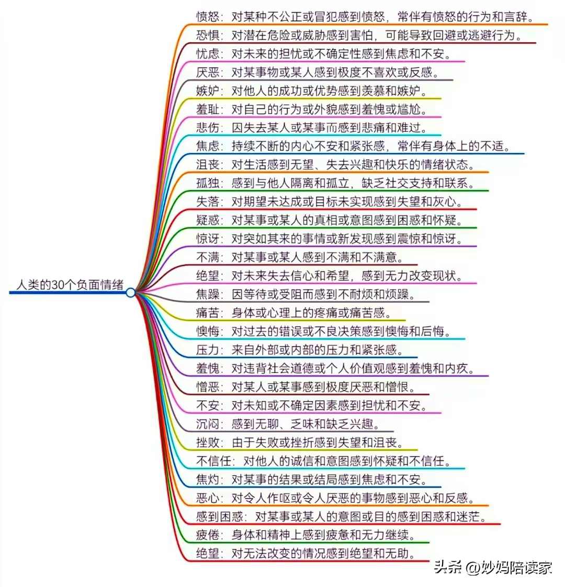
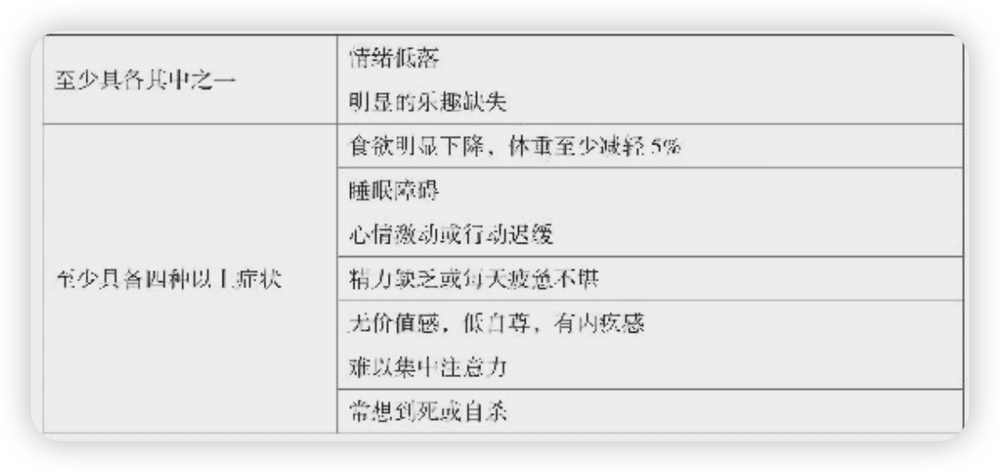

# 心理健康

【【免费】21天系统学习冥想，10年导师带练+理论讲解｜周年典藏版，科学入门正念】 [https://www.bilibili.com/video/BV1NM4y1d7aC/?share_source=copy_web&vd_source=3c8335915a1d653c503494b0c0354c60](https://www.bilibili.com/video/BV1NM4y1d7aC/?share_source=copy_web&vd_source=3c8335915a1d653c503494b0c0354c60)

热爱生活，因为生活里有我爱的人。

[ProcessOn Mindmap](https://www.processon.com/mindmap/65f591b0b4c2a719417983dd)

-浑身难受，怎么办？
-睡觉冥想→放松大脑
-温水洗澡→血液循环
-颈椎活动→锻炼肌肉
-颈椎保暖→血液循环
-出去走走→亲近自然

-怎么样培养积极的心态？

培养积极的心态是一个持续的过程，需要一些实践和技巧。以下是一些方法：

1.**正面思考**：学会意识到消极想法，并努力将其转化为积极的想法。例如，当你感到挫折时，不要只看到问题，而是寻找解决方案和学习经验。
2.**感恩心态**：每天花一点时间感恩自己拥有的一切，包括家人、朋友、健康、工作等。感恩能够培养一种满足感和积极的心态。
3.**设定目标**：给自己明确的、具体的目标，并努力实现它们。实现目标会带来成就感和满足感，增强积极的心态。
4.**寻找乐趣**：培养自己的爱好和兴趣，享受生活中的美好时光。寻找乐趣能够增加生活的乐趣和快乐感，促进积极心态的培养。
5.**保持健康**：注重健康的饮食、充足的睡眠和适度的运动。身体健康与心理健康密切相关，保持健康有助于保持积极的心态。
6.**与积极的人为伍**：与乐观积极的人交往，分享彼此的喜悦和成就。积极的人能够给予你正面的能量和鼓励，有助于培养积极的心态。
7.**学会放松**：通过冥想、深呼吸、瑜伽等方式来放松身心，减轻压力和焦虑，培养内心的平静和积极。
8.**持续学习**：保持求知欲，不断学习新的知识和技能。学习能够激发内在的活力和热情，有助于保持积极的心态。

通过以上方法，你可以逐渐培养积极的心态，更好地应对生活中的挑战和困难，享受更加充实和有意义的生活。

-如果正面思考？

正面思考是一种积极的心态和思维方式，它能够帮助我们更好地面对生活中的挑战和困难，以及更有效地实现目标和愿望。以下是一些正面思考的方法：

1.**意识到消极想法**：学会观察自己的内心，当出现消极、负面的想法时，意识到它们的存在。认识到消极想法是一种重要的第一步。
2.**转化消极想法**：一旦意识到消极想法，就努力将其转化为积极的想法。例如，当你感到挫折时，不要陷入绝望和自怜，而是寻找解决问题的方法和积极的学习经验。
3.**积极寻找解决方案**：正面思考意味着将精力放在解决问题的方法上，而不是陷入问题本身。寻找多种可能的解决方案，并尝试选择最适合的那一个。
4.**培养乐观态度**：相信事情会变得更好，并对未来充满希望和信心。即使面临挑战，也相信自己有能力克服困难。
5.**承认自己的成就**：不要忽视自己的成就和进步，无论多么小的进步都值得被认可。给自己鼓励和肯定，增强信心和自尊心。
6.**学会接受失败**：将失败视为学习的机会，而不是挫折的终点。从失败中学到的教训能够使你更加坚强和成熟。
7.**保持灵活性**：在面对变化和挑战时保持灵活，适应新的情况和环境。灵活性可以帮助我们更好地应对生活中的变化和不确定性。

正面思考并不意味着忽视现实或否认困难，而是要用积极的态度去应对挑战，并相信自己有能力克服困难。通过培养正面思考的习惯，你可以更加积极地面对生活，并更好地实现自己的目标和梦想。

-如何获取内心的宁静？

获得内心宁静是一个个人成长和内在平衡的过程，需要一些实践和技巧。以下是一些方法，可以帮助你寻找内心的宁静：

1.**冥想和呼吸练习**：通过冥想和深呼吸练习，可以帮助你放松身心，平静内心。找一个安静的地方，坐下来，闭上眼睛，专注于呼吸，让自己的思绪逐渐平静下来。
2.**培养感恩心态**：每天花一点时间感恩自己拥有的一切，包括家人、朋友、健康、工作等。感恩能够培养一种满足感和内心的平静。
3.**学会接受和释放**：学会接受过去和未来的不确定性，放下过去的烦恼和未来的焦虑。接受自己的不完美，释放掉负面情绪和压力，让内心更加轻松。
4.**与大自然连接**：花时间与大自然接触，享受户外活动的乐趣。散步、徒步、观赏自然景观，可以帮助你平复内心，感受到自然的美好和宁静。
5.**定期休息和放松**：给自己设定一些定期的休息时间，让自己从忙碌的生活中抽出一些时间来放松身心。可以尝试做一些自己喜欢的事情，如阅读、绘画、听音乐等。
6.**寻找内心的平静点**：在日常生活中，寻找一些能够给你带来平静和放松的事物或地方。这可以是一个安静的角落、一本好书、一首舒缓的音乐，或者一个美丽的风景。
7.**持续学习和成长**：不断学习和成长可以帮助你建立自信和内在平衡。通过学习新的知识和技能，不断提升自己，使自己更加自信和成熟。

通过以上方法，你可以逐渐培养出内心的宁静和平衡，更好地应对生活中的挑战和压力，享受更加美好和充实的生活。

迷茫的时候读书，焦虑的时候冥想，愤怒的时候沉默，痛苦的时候健身，害怕的时候行动，专注的时候工作，不让情绪影响你的行动

-什么是抑郁

抑郁会影响很多方面

-动力：抑郁影响我们做事情的动力。我们会感到自己态度冷漠、无精打采、兴趣丧失，似乎没什么事值得做
-情绪：人们通常认为抑郁仅仅是情绪低落，或者感到厌烦，但这只是抑郁的一部分。事实上，抑郁的核心症状是“兴趣缺失”（anhedonia，源于希腊语），意思是“乐趣缺乏”，也指丧失了体验快乐的能力。
-思维：抑郁通过两种方式干扰思维。首先，它影响注意力和记忆力。我们会发现自己做任何事都难以集中注意力。哪怕只是看本书或看个电视也做不到。而且，记忆力下降，很容易忘事。但是，相对于积极的事，反倒更容易记住消极的事。其次，抑郁影响我们看待自己、未来和世界的方式。很少有人在抑郁的时候自我感觉良好。通常，他们都倾向于认为自己不如别人、浑身缺点、毫无价值。
-意象：抑郁时，我们的内心意象往往也是黑色的。有些人说自己就像被一片乌云所笼罩，有些人觉得像是陷入了一个深洞或深坑里，还有些人觉得像是被关在一个黑屋子里。
-行为：在抑郁时，我们的行为方式也会发生一些变化。我们不大会参加积极的活动，而是回避社交，想把自己藏起来。
-生理：在抑郁状态下，身体和大脑会发生许多变化。这些变化并非有害，但的确会导致大脑工作方式发生显而易见的变化。事实上，任何心理状态，不管是快乐、性冲动、激动、焦虑或抑郁，都与大脑的生理变化密切相关。
-人际关系：尽管我们努力掩饰自己的抑郁状态，但仍然会给他人带来影响。我们失去了和他人相处的乐趣，容易被激怒，而且常常拒绝别人。
-大脑状态：把抑郁视为“大脑状态”的一种变化，对自己是有帮助的。
-专业人士而言怎样诊断抑郁症：如果果一个人符合其中五条以上的症状，并且持续时间至少超过两周，就可以诊断为抑郁症

        
- 晚上如何安稳的放松和入睡，有什么建议？
    
    晚上安稳放松和入睡是很重要的，以下是一些建议：
    
    1、要做：**建立固定的睡眠时间**: 尽量保持每天睡觉和起床的时间一致，这有助于调节你的生物钟，使你的身体更容易入睡和醒来。
    
    2、要做：**创建舒适的睡眠环境**: 保持卧室安静、黑暗和凉爽。使用舒适的床垫和枕头，确保你的床铺舒适。
    
    3、**放松身心**: 在睡觉前尝试一些放松的活动，比如深呼吸、冥想、瑜伽或者阅读轻松的书籍。避免在床上看电视或使用电子设备，因为这些活动可能会刺激你的大脑，使入睡更困难。
    
    4、**放松肌肉**: 尝试一些放松肌肉的技巧，比如温水浸泡、热敷或者简单的伸展运动，这有助于缓解身体的紧张和疲劳。
    
    5、**保持心理舒适**: 尽量不要让担忧和压力困扰你的思绪。你可以尝试将你的担忧写在纸上，或者做一些轻松的冥想来放松你的心灵。
    
    **6、喝牛奶或豆浆**: 牛奶和豆浆中含有色氨酸，这是一种可以帮助人体产生血清素的氨基酸，血清素可以促进睡眠。因此，喝一杯温牛奶或豆浆可能有助于放松身心，准备入睡。
    
    **7、泡脚**: 泡脚是一种放松身心的方法，它有助于促进血液循环和放松肌肉。在睡觉前泡脚可以让你感觉更舒适和放松，有助于准备入睡。
    
    **8、洗澡**: 洗澡可以让身体放松，清洁皮肤，减轻一天中的疲劳和紧张感。热水浴有助于放松肌肉，促进血液循环，但要注意洗澡水温不要太高，以免影响体温调节和睡眠质量。
    
    1、不要做：**避免咖啡因和刺激性饮料**: 在睡觉前几个小时内避免饮用咖啡、茶和含咖啡因的饮料，因为这些物质可能会影响你的睡眠质量。
    
    2、不要做：**避免吃太饱或太饿**: 避免在睡觉前吃太多或者太少的食物。过度饥饿或过度饱食可能会影响你的睡眠质量。
    
    3、睡觉之前，不要玩手机。
    
- 晚上如何睡眠？
    
    小睡眠 App
    
- 白天头疼，疲倦，精力不足，可以冥想
    
    【【速效休息】20分钟躺平冥想，重启大脑提高专注力】 [https://www.bilibili.com/video/BV1nm4y1t7t5/?share_source=copy_web&vd_source=3c8335915a1d653c503494b0c0354c60](https://www.bilibili.com/video/BV1nm4y1t7t5/?share_source=copy_web&vd_source=3c8335915a1d653c503494b0c0354c60)
    
- 心流：快乐的源泉
    
    “2300年前，亚里士多德曾说，世人不分男女，都以追求幸福为人生最高目标。”
    
    “幸福并不是存心去找就能找到的。哲学家密尔说：“自问是否幸福，幸福的感觉就荡然无存了。”
    
- 头疼，不能学习？
    1. 精神内耗
    2. 头脑缺氧，可以打哈气
    3. 精力不足，需要休息
    4. 情绪问题
    5. 身体难受，颈椎问题
- 什么是精神内耗？怎么判断自己有精神内耗？
    
    精神内耗是指由于长期的心理压力、焦虑、紧张等因素导致的精神疲劳和消耗。它通常表现为精力不足、情绪低落、注意力不集中、记忆力减退、身体疲惫等症状。
    
    以下是一些可能表明您正在经历精神内耗的迹象：
    
    1. 持续的疲劳感：无论您是否休息，您仍然感到疲劳和精力不足。
    2. 情绪低落：您可能感到情绪低落、焦虑、易怒或无法享受平常的活动。
    3. 注意力不集中：您可能发现自己难以集中注意力，思维散漫，难以完成任务。
    4. 失眠或睡眠质量下降：您可能难以入睡、睡眠不深或频繁醒来。
    5. 身体不适：精神内耗可能导致身体上的不适，如头痛、肌肉紧张、胃痛等。
    6. 社交退缩：您可能感到对社交活动失去兴趣，更倾向于独自呆着。
    
    如果您经历了上述症状，并且这些症状已经持续了一段时间，那么可能存在精神内耗的问题。重要的是要及时寻求支持和帮助，以便应对和缓解精神内耗。您可以与家人、朋友或专业人士交流，并寻求适当的心理健康支持。
    
- 如何改善自己的心境
    
    要改善自己的心境，可以尝试以下方法：
    
    1. 培养积极的心态：积极的心态可以帮助改善心境。尝试关注和培养积极的思维模式，学会看到事物的积极面和机会，而不是过分关注消极的方面。可以通过感恩、乐观的思考、积极的自我对话等方式来培养积极的心态。
    2. 寻找快乐和满足感：寻找能够带给你快乐和满足感的活动和事物。这可能是你喜欢的爱好、与朋友相聚、运动、阅读等。给自己留出时间，专注于这些活动，让自己感到愉悦和满足。
    3. 建立支持系统：与亲朋好友建立良好的支持系统，可以帮助你在困难时获得支持和理解。与他们分享你的感受和困扰，寻求他们的建议和支持。
    4. 注重身心健康：身心健康对心境的改善至关重要。保持良好的睡眠、饮食和运动习惯，可以提升身体的健康状况，从而改善心境。同时，学会放松和应对压力的技巧，如深呼吸、冥想、瑜伽等，可以帮助缓解压力和焦虑。
    5. 寻求专业帮助：如果你感到心境长时间低落或无法自我调节，可以考虑寻求专业心理咨询师或心理医生的帮助。他们可以提供专业的指导和支持，帮助你改善心境并找到适合自己的应对策略。
    
    改善心境需要时间和努力，每个人的情况和方式都不同。尝试不同的方法，找到适合自己的方式来改善心境，并保持积极的心态和健康的生活方式。
    
    当然可以。首先，每天保持规律的作息时间，尽量保证7-9小时的睡眠。在白天，尽量让自己接触阳光，这有助于调整生物钟。
    
    饮食方面，尽量保持均衡饮食，多摄入水果、蔬菜和蛋白质。减少咖啡因和糖分的摄入，因为它们可能影响睡眠和情绪。
    
    适度的有氧运动，比如散步或慢跑，可以帮助释放身体和心理的紧张感。而深呼吸练习、冥想或渐进性肌肉松弛可以在日常中进行，帮助舒缓紧绷的情绪。
    
    保持社交联系也很重要。尽量与朋友、家人或同事保持联系，分享你的感受。有时候，与他人交流可以缓解心理负担。
    
    记住，这些建议可能需要一些时间才能见效，而且每个人的反应都不同。如果问题持续或加重，及时向专业医生寻求帮助。
    
- 为什么看短视频，会让人心情浮躁?
    
    看短视频可能会让人心情浮躁的原因有以下几点：
    
    1. 快节奏的刺激：短视频通常以快节奏、刺激的方式呈现，内容变换迅速，画面跳跃频繁。这种快速的刺激和变化容易引起人的注意力分散和焦虑感。
    2. 信息碎片化：短视频的时长通常很短，只有几十秒甚至更短，内容也往往是碎片化的，没有完整的故事情节。这种碎片化的信息容易让人感到不满足和不稳定，无法获得深入思考和沉浸式体验的机会。
    3. 社交比较和焦虑：短视频平台上的内容往往是经过筛选和编辑的，呈现的是一些精彩、刺激或有趣的片段。这容易引发人们的社交比较心理，产生焦虑和不满足感，觉得自己的生活不够精彩或有趣。
    4. 时间浪费和沉迷：短视频往往具有很强的吸引力，容易让人沉迷其中，不知不觉地花费大量时间在观看短视频上。长时间的浏览短视频可能会导致时间的浪费和对其他重要事务的忽视，进而引发心情浮躁和内心的不安。
    
    为了避免心情浮躁，建议在观看短视频时要适度控制时间，选择有价值和有意义的内容，保持良好的心态和情绪调节能力，同时也要注意平衡短视频观看与其他活动的时间分配，保持生活的多样性和平衡。
    
- 为什么看看新闻，会让人心情浮躁?
    
    看新闻可能会让人心情浮躁的原因有以下几点：
    
    1. 负面信息过多：新闻报道通常更倾向于报道负面、紧急、冲突和不幸的事件，这些消息容易引起人们的焦虑和担忧。当人们接连看到各种负面消息时，容易产生心情上的不安和浮躁感。
    2. 信息过载：现代社会的新闻信息非常丰富和多样化，人们可以通过各种渠道随时获取新闻。然而，大量的信息涌入可能会导致信息过载，人们难以处理和消化这么多的信息，从而产生心理上的压力和浮躁感。
    3. 不确定性和焦虑：新闻报道通常涉及到各种不确定的因素，如政治动荡、经济不稳定、自然灾害等。这些不确定性因素容易引发人们的焦虑和不安，产生心情上的浮躁感。
    4. 社交比较和焦虑：新闻报道中常常涉及到一些成功、名利和社会地位等方面的内容，这容易引发人们的社交比较心理，产生焦虑和不满足感，觉得自己的生活不够成功或有趣。
    
    为了避免心情浮躁，建议在看新闻时要适度控制时间，选择可靠和有价值的新闻来源，保持客观和理性的态度，同时也要注意平衡新闻观看与其他活动的时间分配，保持生活的多样性和平衡。此外，培养良好的情绪调节能力和心理抗压能力也是重要的。
    
- 大脑皮层疼是什么原因导致的？
    1. **肌肉紧张和颈部问题**：颈部肌肉紧张、颈椎问题或姿势不良可能会导致头部和大脑皮层的疼痛感。
    2. **压力和焦虑**：长期的压力、焦虑和情绪问题可能导致头痛和大脑皮层感觉异常。
    3. **药物副作用**：某些药物可能导致头痛和大脑皮层疼痛，特别是长期使用的药物或滥用止痛药的情况。
    4. **睡眠问题**：睡眠不足、睡眠质量差或睡眠紊乱也可能导致头部不适和大脑皮层的疼痛感。
    5. **神经系统问题**：除了之前提到的神经痛和神经系统疾病外，一些神经性疼痛症状可能会涉及大脑皮层。
    6. **环境因素**：长时间暴露在明亮光线、噪音或其他刺激性环境中可能会引起头部不适和大脑皮层感觉异常。
    
    如果你经常感到大脑皮层疼痛或有其他不适，建议及时就医，进行全面的身体检查和评估，以确定症状的原因，并制定适当的治疗方案。
    

- 快乐和幸福的区别？
    
    快乐和幸福是两种不同但相关的心理状态，它们的区别在于：
    
    1. **快乐：** 快乐通常是一种暂时的情绪体验，源于外部事件、刺激或情境的愉悦和满足。这种情绪可能是短暂的，比如得到好消息、与朋友聚会、完成一项任务等都可以带来快乐的感觉。快乐往往是一种表面的情绪体验，与特定的事件或情境密切相关，持续时间相对较短。
    2. **幸福：** 幸福是一种更加深层次的心理状态，涉及到对生活的整体满意度、内在的满足感和对生命的意义感的体验。幸福是一种长期的心理状态，不依赖于外部事件的变化，而是建立在对生活的整体体验和内在感受上。幸福更多地体现为对生活的满足和对自我实现的感受。
    
    因此，可以说快乐是一种短期的情绪体验，而幸福是一种更加深刻和持久的心理状态。快乐可能是幸福的组成部分之一，但幸福不仅仅是快乐的累积，它还涉及到更广泛、更深层次的生活满足和内在的生命意义感。
    
- 成年人是不是比小孩更难获取快乐？
    
    成年人和小孩获取快乐的方式和难易程度会因个体、环境和生活阅历等因素而有所不同。一般来说，可以在以下几个方面来比较成年人和小孩获取快乐的难易程度：
    
    1. **责任和压力：** 成年人通常面临更多的责任和压力，如工作、家庭、财务等，这些因素可能会增加他们获取快乐的难度。相比之下，小孩一般不需要承担如此多的责任和压力，因此他们更容易在简单的生活中找到快乐。
    2. **期待和满足：** 随着年龄的增长，人们对于快乐的期待和要求可能会提高，因此成年人可能需要更多的刺激和满足才能感受到快乐，而小孩可能会对简单的事物和体验感到满足和快乐。
    3. **心理成熟和调适能力：** 成年人通常具有更强的心理成熟和调适能力，他们可能会更好地应对生活中的挑战和困难，从而更加珍惜和欣赏生活中的快乐。相比之下，小孩可能在面对困难和挫折时更容易感到沮丧和失落。
    4. **生活经验和成就感：** 成年人可能会通过实现个人目标和追求梦想来获得更深层次的快乐和成就感，而小孩可能主要通过简单的游戏和社交活动来获取快乐。
    
    总的来说，并不是成年人比小孩更难获取快乐，而是他们获取快乐的方式和来源可能会有所不同。成年人可能需要更多的内省和自我认知，以及更加深入的体验和感受来获取快乐。而小孩则可能更容易通过简单的生活体验和社交互动来获得快乐。
    
- 什么是内省？
    
    内省是一种自我观察和反思的过程，旨在深入了解自己的思想、情感、价值观和行为。这种过程通常包括对个人内心世界的探索和理解，以及对自己所经历的事件和情境的反思和分析。
    
    内省的过程涉及以下几个方面：
    
    1. **自我观察：** 内省开始于对自己的观察和认识。个体通过倾听自己的内心声音，注意自己的情绪和想法，并意识到自己的行为和反应。
    2. **反思和探索：** 内省还涉及到对自己内在世界的反思和探索。个体会思考自己的信念、价值观、目标和动机等方面，探索自己的内心世界。
    3. **情绪管理：** 内省也可以帮助个体更好地管理自己的情绪。通过深入了解自己的情绪和情感反应，个体可以更有效地应对压力和挑战。
    4. **自我成长：** 内省是个体自我成长和发展的重要手段之一。通过不断地反思和探索，个体可以发现自己的优点和不足之处，并努力改进和提升自己。
    
    内省通常通过独处、沉思、写作、冥想等方式进行。它是一种深度的心理过程，需要个体投入时间和精力，去理解自己的内在世界，以促进个人成长和发展。通过内省，个体可以更加深入地了解自己，提高自我意识和情绪智慧，从而更好地应对生活中的挑战和困境。
    
- 精力消耗和意志力消耗有什么不同
    
    精力消耗和意志力消耗是两个不同的概念，虽然它们之间有一定的关联，但在本质上有着不同的含义和影响：
    
    1. **精力消耗：** 精力消耗指的是个体在日常生活和工作中所投入的心理和体力资源。它涉及到人的注意力、专注力、思考能力等方面。精力消耗与个体的活动强度、情绪状态、环境压力等密切相关。例如，长时间的工作、学习、社交活动等都会消耗个体的精力。
    2. **意志力消耗：** 意志力消耗是指个体在面对诸如抑制冲动、做出决策、克服诱惑等需要自我控制的任务时，所需要耗费的心理资源。意志力消耗与个体的自我控制能力、意志力、决策能力等密切相关。例如，克制不健康的饮食习惯、保持锻炼习惯、完成任务等都需要消耗意志力。
    
    不同之处：
    
    - **内涵不同：** 精力消耗涉及个体的心理和体力资源投入，而意志力消耗则是指在自我控制和决策过程中所需要的心理资源消耗。
    - **应用场景不同：** 精力消耗更广泛地涉及到个体日常生活、工作和活动中的各个方面，而意志力消耗则更侧重于个体在面对需要自我控制和决策的任务时的心理资源消耗。
    - **影响领域不同：** 精力消耗可能涉及到个体的注意力、专注力、思考能力等方面，而意志力消耗更侧重于个体的自我控制能力、决策能力等方面。
    
    总体而言，精力消耗和意志力消耗在个体的心理活动中都起着重要作用，但它们所涉及的范畴和影响因素有所不同。
    
- 精力消耗和意志力消耗，怎么补充?
    
    精力消耗和意志力消耗是个体在日常生活中常常面临的情况，需要适时补充和恢复以维持心理健康和良好的工作状态。以下是一些补充精力和意志力的方法：
    
    **补充精力的方法：**
    
    1. **充足睡眠：** 充足的睡眠是恢复精力和提高工作效率的关键。每晚保持7-9小时的高质量睡眠有助于恢复身体和大脑的精力。
    2. **合理饮食：** 摄取均衡的饮食，包括蔬菜、水果、全谷物、蛋白质和健康脂肪，有助于提供身体所需的营养，维持精力充沛。
    3. **定期运动：** 定期参加适当强度的体育锻炼可以增强体力和耐力，提高心肺功能，有助于提高精力水平。
    4. **放松技巧：** 学习放松技巧，如深呼吸、冥想、瑜伽等，有助于缓解压力，恢复精力。
    5. **规律作息：** 保持规律的作息时间，固定每天的工作和休息时间，有助于调节生物钟，提高精力。
    
    **补充意志力的方法：**
    
    1. **设定明确目标：** 设定明确的长期和短期目标，有助于集中精力，增强意志力。
    2. **分解任务：** 将大型任务分解为小的可管理的任务，逐步完成，可以减轻任务压力，提高意志力。
    3. **规划时间：** 制定详细的计划和时间表，有助于合理安排时间，减少决策和自我控制的负担。
    4. **休息与放松：** 给自己留出足够的休息和放松时间，避免长时间连续工作，有助于恢复意志力和提高工作效率。
    5. **积极心态：** 保持积极乐观的心态，培养对困难和挑战的积极应对态度，有助于增强意志力。
    
    以上方法有助于补充和增强个体的精力和意志力，提高工作效率和生活质量。每个人可以根据自己的需求和情况选择合适的方法进行补充和恢复。
    

在人的一生中最为辉煌的一天，如并不是功成名就的那一天；
而是从悲叹和绝望中，产生对人生挑战的欲望，并且第敢的迈向这种挑战的那一天。

生活永远不可能像你想像得那么好，但是也不会像你想像得那么糟。

我觉得人的脆弱和坚强都超乎自己的想象。

有时，可能脆弱得一句话就泪流满面；有时，也发现自己咬着牙走了很长的路。

弘一法师的这句话，让我走出了抑郁症

[https://mp.weixin.qq.com/s/4IEOtJhzc_NboqO1zYNiZA](https://mp.weixin.qq.com/s/4IEOtJhzc_NboqO1zYNiZA)

抑郁症，不破不立

[https://mp.weixin.qq.com/s/ctACF0XutjDNj2DFQTFmlw](https://mp.weixin.qq.com/s/ctACF0XutjDNj2DFQTFmlw)

如何用10分钟克服心理内耗？

[https://mp.weixin.qq.com/s/YdfYaRMjAk4bhq1CHdKCPQ](https://mp.weixin.qq.com/s/YdfYaRMjAk4bhq1CHdKCPQ)

央视重拳出击抑郁症！6集纪录片《我们如何对抗抑郁》视频，请收藏！

[https://mp.weixin.qq.com/s/4DR0pJNHQcKjC6m5-NTrCA](https://mp.weixin.qq.com/s/4DR0pJNHQcKjC6m5-NTrCA)

99.99%的抑郁焦虑内耗，都是因为“拧巴”

[https://mp.weixin.qq.com/s/HZGDJGlirDFS2TrzN7Cbhw](https://mp.weixin.qq.com/s/HZGDJGlirDFS2TrzN7Cbhw)

容易导致抑郁的三个不健康思维习惯

[https://mp.weixin.qq.com/s/XjLA6XJN1T9OpC9AYM0i3g](https://mp.weixin.qq.com/s/XjLA6XJN1T9OpC9AYM0i3g)

抑郁、焦虑的人一定要练习这个方法

[https://mp.weixin.qq.com/s/Y01maU_s-RV2BCVKif4Cjg](https://mp.weixin.qq.com/s/Y01maU_s-RV2BCVKif4Cjg)

俞敏洪：如何面对人生的焦虑

[https://mp.weixin.qq.com/s/NlavbI4P0SLcreBLlkpqjw](https://mp.weixin.qq.com/s/NlavbI4P0SLcreBLlkpqjw)

后来，她停止内耗，疯狂提升自己

[https://mp.weixin.qq.com/s/1608tprlGE-ETn-oWNggNw](https://mp.weixin.qq.com/s/1608tprlGE-ETn-oWNggNw)

凡事先干起来，能解决90%的焦虑

[https://mp.weixin.qq.com/s/bhveGbES2CneJ7i4xuWc7Q](https://mp.weixin.qq.com/s/bhveGbES2CneJ7i4xuWc7Q)

6.10 J@i.PX 05/12 Gvf:/ 复制打开抖音，看看【赵玉平老师开讲啦的作品】如何才能克服个人的抑郁倾向？如果只学一个人，就学孙... [https://v.douyin.com/iLYM6mYd/](https://v.douyin.com/iLYM6mYd/)

4.61 11/28 UYZ:/ v@F.Ul 复制打开抖音，看看【希哥心理师的作品】总是胡思乱想，精神内耗，问自己“这事和我有什么关系... [https://v.douyin.com/iLYMAy8A/](https://v.douyin.com/iLYMAy8A/)

0.76 A@g.Bg GvF:/ 01/19 复制打开抖音，看看【精神科王玉玲的图文作品】做完这20件事情，焦虑突然就少了。  [https://v.douyin.com/iLYMj8Gj/](https://v.douyin.com/iLYMj8Gj/)

8.41 T@Y.mD 11/09 OKJ:/ 复制打开抖音，看看【《读者》的作品】慌张是因为准备不足，轻浮是因为眼光不远。烦乱是因为... [https://v.douyin.com/iLYMUWGu/](https://v.douyin.com/iLYMUWGu/)

8.99 复制打开抖音，看看【希哥心理师的作品】总是胡思乱想，精神内耗，问自己“这事和我有什么关系... [https://v.douyin.com/iLPytFPM/](https://v.douyin.com/iLPytFPM/) e@B.TY uSl:/ 03/04

作为一名恢复良好的抑郁症患者，我有三点私人的建议给大家-今日头条

[https://www.toutiao.com/video/7307885630610997787/?log_from=6714e950424988_1706360563587](https://www.toutiao.com/video/7307885630610997787/?log_from=6714e950424988_1706360563587)

- 战胜抑郁症
    
    

[https://profile.zjurl.cn/rogue/ugc/profile/?active_tab=dongtai&app_name=news_article&device_id=65&media_id=1626447254583303&request_source=1&share_token=69193393-8C25-442A-93D0-4A838FD9DD92&tt_from=copy_link&user_id=92909970698&utm_campaign=client_share&utm_medium=toutiao_ios&utm_source=copy_link&version_code=9.6.8&version_name=90608](https://profile.zjurl.cn/rogue/ugc/profile/?active_tab=dongtai&app_name=news_article&device_id=65&media_id=1626447254583303&request_source=1&share_token=69193393-8C25-442A-93D0-4A838FD9DD92&tt_from=copy_link&user_id=92909970698&utm_campaign=client_share&utm_medium=toutiao_ios&utm_source=copy_link&version_code=9.6.8&version_name=90608) 推荐《子英画画》的主页 - 今日头条

我如何应对偶尔的失眠？

[https://mp.weixin.qq.com/s/oo3c2rNo19b0Md3-wba-Qw](https://mp.weixin.qq.com/s/oo3c2rNo19b0Md3-wba-Qw)

- 我是一名33岁的软件工程师,当专注工作40分钟左右，大脑就会比较疲惫。这是正常的吗?需要怎么调节呢?
    
    是的，感到大脑疲劳在工作中是很正常的。集中注意力和思考40分钟左右后，大脑可能会感到疲惫，这被称为"注意力疲劳"。
    
    为了调节这种情况，可以尝试以下方法：
    
    1. **休息和放松**：每隔40分钟左右，进行短暂的休息和放松，站起来活动一下，做些眼睛放松操或者简单的伸展动作，让大脑得到缓解。
    2. **分段工作**：将工作划分成短时间段，每段集中工作一段时间后，休息片刻，然后再继续工作。这样可以避免长时间的连续工作造成的疲劳。
    3. **保持充足睡眠**：保证每天充足的睡眠时间，有助于恢复大脑的能量和精力，提高工作效率。
    4. **锻炼身体**：定期进行适量的体育锻炼，可以提高身体素质和心肺功能，同时有助于缓解压力和焦虑，减轻大脑疲劳。
    5. **调整工作环境**：确保工作环境舒适，避免过度的噪音和干扰，保持清新的空气和良好的照明。
    
    通过这些调节，你可以更好地管理大脑疲劳，提高工作效率和专注力。