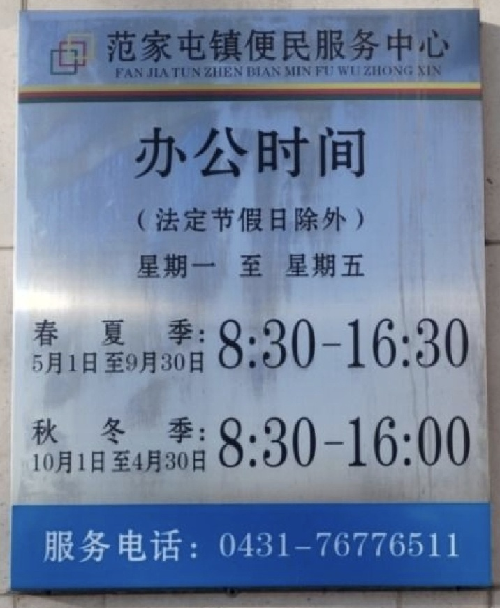
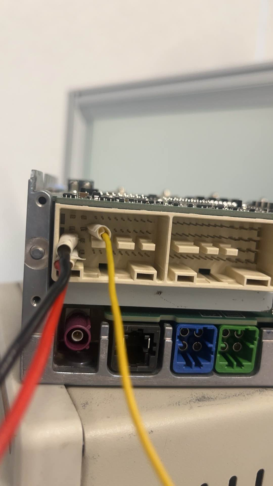
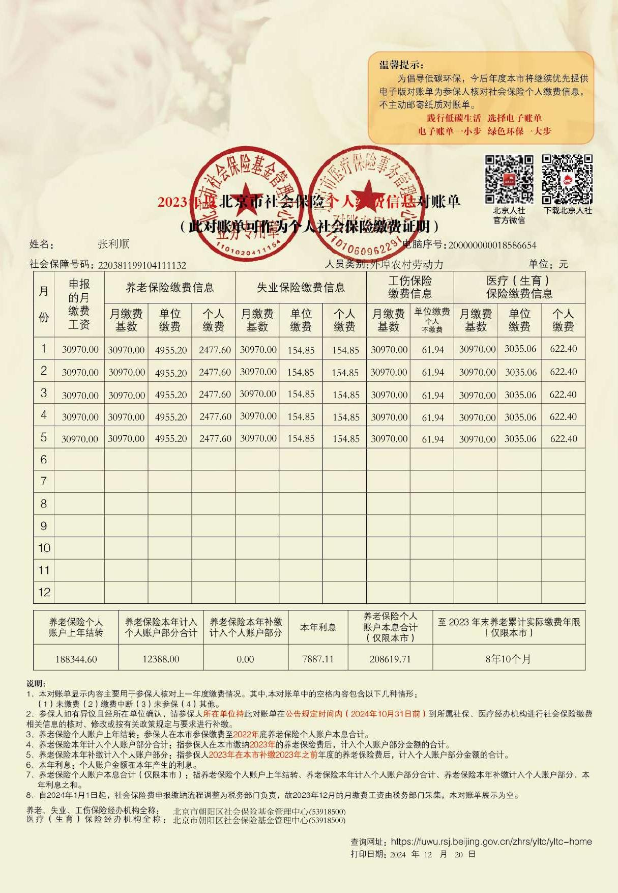
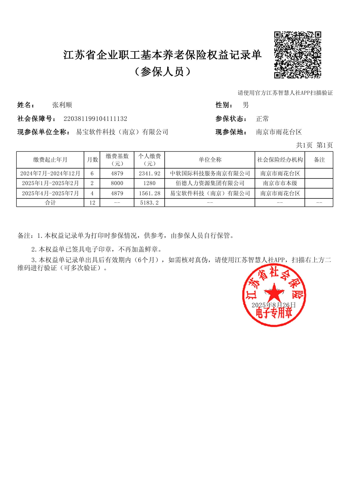
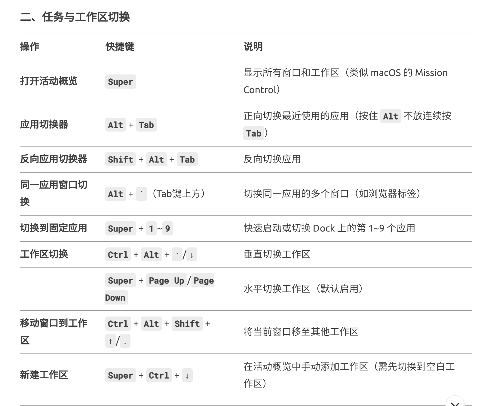
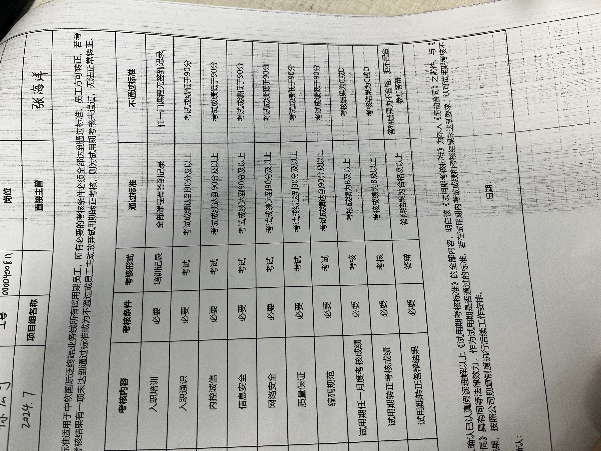
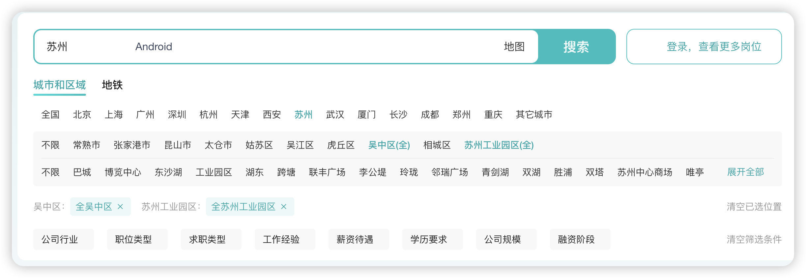
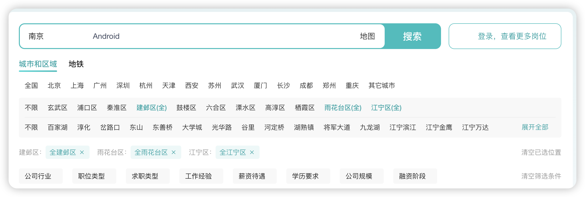
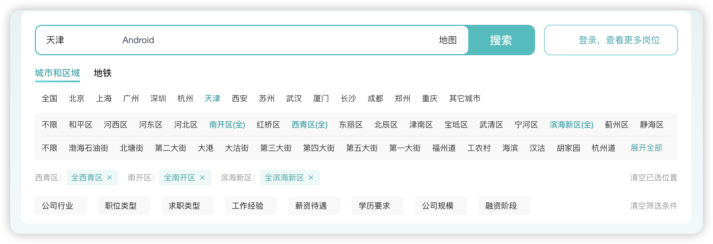

# 南京工作生活

##  南京居住证续期
2026年2月11日，线下办理续期
地址：建设派出所
电话：**`025-58140724`**
时间：周一至周六 9:00-12:00，14:00-17:30
材料：原租房合同，本人居民身份证，原居住证。
[滨江嘉园租房合同.pdf](%E5%8D%97%E4%BA%AC%E5%B7%A5%E4%BD%9C%E7%94%9F%E6%B4%BB/%E6%BB%A8%E6%B1%9F%E5%98%89%E5%9B%AD%E7%A7%9F%E6%88%BF%E5%90%88%E5%90%8C.pdf)
##  张云骁南京医保
国家平台：没有停保
省平台：停保
长春莲花山生态旅游度假区
---
范家屯医保，12月2日办理
政务大厅：0431-76776511
医保业务：0431-76771079
范家屯医保电话
043176820120
---
地点：巩固社区党群服务中心，
联系电话：02558538522
办公时间：周一到周五，上午9-11点，下午2-5点
材料：户口本原件，出生证原件，双方身份证原件，大人及小孩居住证原件
---
公主岭医保电话
043175069918
043175069913
---
地点：范家屯政务中心，
业务：办理医保停保
带上：孩子页户口本复印件，代办人身份证复印件

##  Kiwi日报总结
11月
1. Modifier.clickable也需要跟随LayoutNode，建议放在DrawModifier后面
2. figma mcp 获取的svg格式有问题
3. 

##  拜访王建大哥
第一天(10.16 周四)：上午9点26到武汉火车站，王建来接我们去家里，然后一起吃午饭，下午去湖北省博物馆，晚上在长江边上吹吹风，晚上看看夜景。之后赶回黄石。住宿：**人信·花马湖畔附近的派对美宿酒店。**
第二天(10.17 周五)：
黄石：可以选2到3地方
住宿：**人信·花马湖畔附近的派对美宿酒店**
第三天(10.18 周六)：
住宿：黄石蜂鸟快捷酒店(黄石北站店)
第四天(10.19 周日)：

##  车机连接线(图)

##  社保

##  Ubuntu的任务与工作区切换

##  Chrome 快捷键
在Ubuntu系统下，Google Chrome浏览器的快捷键与Windows/Linux版本基本一致，以下是常用分类整理：
### **一、标签页与窗口操作**

## **新建标签页**：`Ctrl + T`

## **新建窗口**：`Ctrl + N`

## **无痕模式窗口**：`Ctrl + Shift + N`

## **关闭当前标签页**：`Ctrl + W` 或 `Ctrl + F4`

## **重新打开关闭的标签页**：`Ctrl + Shift + T`

## **切换标签页**：
    - 下一个标签页：`Ctrl + Tab` 或 `Ctrl + PgDn`
    - 上一个标签页：`Ctrl + Shift + Tab` 或 `Ctrl + PgUp`
    - 跳转到指定标签页：`Ctrl + 1` 到 `Ctrl + 8`（数字对应标签位置）
    - 最后一个标签页：`Ctrl + 9`
### **二、页面导航**

## **刷新页面**：`F5` 或 `Ctrl + R`

## **强制刷新（忽略缓存）**：`Ctrl + Shift + R` 或 `Shift + F5`

## **停止加载**：`Esc`

## **主页**：`Alt + Home`

## **后退/前进**：`Alt + ←` / `Alt + →`
### **三、地址栏与搜索**

## **聚焦地址栏**：`Ctrl + L` 或 `F6`

## **默认搜索**：输入关键词后按 `Enter`

## **快速添加`www.`和`.com`**：输入域名后按 `Ctrl + Enter`
### **四、开发者工具与功能**

## **开发者工具**：`Ctrl + Shift + J` 或 `F12`

## **清除浏览数据**：`Ctrl + Shift + Delete`

## **任务管理器**：`Shift + Esc`
### **五、其他实用操作**

## **全屏模式**：`F11`

## **放大/缩小页面**：`Ctrl + +` / `Ctrl + -`

## **恢复默认缩放**：`Ctrl + 0`

## **保存为书签**：`Ctrl + D`

## **查找页面内容**：`Ctrl + F`
### **注意事项**
部分快捷键可能因Ubuntu系统快捷键冲突需调整（如`Alt + F4`默认关闭窗口）。若需完整列表，可参考[Chrome官方帮助文档](https://support.google.com/chrome/answer/157179)。

##  南京居住证

## 张云骁白底照片
    

## 滨江嘉园
    业主：周曼娣，13951880809，320122197507170026
    地址：南京市浦口区滨江嘉园12栋1单元1501室

##  给抓抓办理南京医保流程
根据南京市城乡居民医保政策，外地户籍的18个月大儿童在南京参保需满足一定条件，并按要求准备材料及办理流程。以下是具体指南：
---
### **一、参保条件**
1. **父母一方在南京参保或具有南京户籍**
    若父母一方在南京参加职工医保或具有南京户籍，其18周岁以下的未成年子女（包括18个月的幼儿）可参保城乡居民医保。
    - 需提供父母一方的南京职工医保参保证明或南京户籍证明。
2. **持有南京市居住证**
    孩子需持有南京市有效期内的居住证（若未办理，需先通过居住地街道或社区公安部门办理）。
---
### **二、所需材料**

## **基本材料**
    1. 孩子的出生医学证明；
    2. 孩子的有效期内的南京市居住证；
    3. 父母双方的身份证、户口簿（原件及复印件）；
    4. 父母一方的南京职工医保参保证明或南京户籍证明。

## **特殊情况补充材料**
    若父母非南京户籍且未在南京参加职工医保，但孩子符合学籍要求（如幼儿园在读），需提供教育部门或学校出具的学籍证明。
---
### **三、办理流程**
1. **办理居住证**
    如孩子尚未办理南京市居住证，需先到居住地街道或社区公安部门申请办理。
2. **参保登记**
    - **线下办理**：携带上述材料至居住地所在街道（镇）或社区（村）社保经办机构办理参保登记。
    - **线上办理**（仅限南京户籍家庭）：通过“我的南京”APP—“医保服务—居民医保参保”模块办理（需父母与孩子在同一户口簿）。
3. **缴费方式**
    - **线上缴费**：通过“江苏税务社保缴纳”微信小程序、支付宝或“我的南京”APP完成缴费。
    - **线下缴费**：至银行网点（如中国农业银行、南京银行等）柜台办理。
---
### **四、缴费标准及待遇**

## **2024年度缴费标准**
    - **个人缴费**：250元/年（财政补贴1160元/年）。
    - **特殊人群免费**：如低保家庭、特困供养人员等，由财政全额补助。

## **待遇享受时间**
    - 若在集中缴费期（每年11月1日-12月25日）办理，次年1月1日起享受全年医保待遇。
    - 若中途参保（如新生儿超过90天或中途迁入），自缴费到账次月起享受待遇。
---
### **五、注意事项**
1. **时间限制**
    建议在集中缴费期内完成参保，避免影响待遇享受时间。若错过集中缴费期，需及时补缴。
2. **居住证有效期**
    确保孩子的居住证在有效期内，过期需及时续办。
3. **咨询方式**
    可拨打南京市医保服务热线025-12393，或通过“南京本地宝”微信公众号获取最新政策。
---
### **六、办理地点**

## **线下地址**：南京市各街道（镇）社保基层经办机构（可通过“南京本地宝”查询具体地址）。
通过以上步骤，外地户籍的18个月幼儿即可在南京完成城乡居民医保参保及缴费。若有特殊问题，建议提前联系社保经办机构确认材料细节。

##  南京城镇医保和城乡医保，报销比例详细对比
以下是南京**城镇职工医保**和**城乡居民医保**在**门诊、住院、大病保险**等方面的**详细报销比例对比**（根据2023-2024年政策整理，具体以最新调整为准）：
---
### **一、门诊报销比例**
| **项目** | **城镇职工医保** | **城乡居民医保** |
| --- | --- | --- |
| **普通门诊** | 社区医院：70%-90% 三级医院：50%-60% | 社区医院：50%-60% 三级医院：40%-50% |
| **起付线** | 在职：600-1200元/年 退休：300-600元/年 | 无起付线或较低（如100-300元） |
| **年度限额** | 在职：约5000元 退休：约6000元 | 约1000-2000元（学生儿童稍高） |
| **个人账户** | 有（可用于支付自费部分） | 无 |
---
### **二、住院报销比例**
| **医院等级** | **城镇职工医保** | **城乡居民医保** |
| --- | --- | --- |
| **三级医院** | 在职：85%-90% 退休：90%-95% | 60%-75%（学生儿童/老年居民略高） |
| **二级医院** | 在职：90%-95% 退休：95%-98% | 70%-85% |
| **社区医院** | 在职：95% 退休：98% | 80%-90% |
| **起付线** | 首次住院：600-1200元（按医院等级） | 首次住院：500-1000元（学生儿童减半） |
| **年度封顶线** | 约50万元（含大病保险） | 约20万元（含大病保险） |
---
### **三、大病保险待遇**
| **项目** | **城镇职工医保** | **城乡居民医保** |
| --- | --- | --- |
| **起付标准** | 约2万元 | 约1.5万元（困难群体更低） |
| **报销比例** | 2万-10万：60% 10万以上：70% | 1.5万-10万：60% 10万以上：70% |
| **封顶线** | 上不封顶 | 上不封顶 |
---
### **四、生育待遇对比**
| **项目** | **城镇职工医保** | **城乡居民医保** |
| --- | --- | --- |
| **生育医疗费** | 全额报销（含产检、分娩） | 定额报销（如顺产2000元，剖宫产4000元） |
| **生育津贴** | 有（按单位平均工资计算） | 无 |
---
### **五、其他差异**
1. **退休待遇**
    - 职工医保退休后免缴，终身享受医保；
    - 居民医保需终身缴费，否则无法享受待遇。
2. **异地就医**
    - 职工医保异地报销比例更高（与本地差距较小）；
    - 居民医保异地报销比例下降约10%-20%。
---
### **总结建议**

## **优先职工医保**：缴费高但报销比例、额度、退休待遇全面占优（尤其适合长期稳定就业者）。

## **居民医保**：适合无稳定收入人群（如儿童、学生、老年人），年缴费低但保障基础医疗需求。
**注**：具体政策可能调整，建议通过以下方式核实：
① 拨打 **南京医保服务热线 025-12393**；
② 登录 **南京市医疗保障局官网**；
③ 关注 **“南京医保”微信公众号** 查询实时政策。
[医保补充内容：各地医保报销政策](https://chaiknows.feishu.cn/docx/ZocfdzGSwoTUuhxE9Z1cIs74nbn)

##  南京租房

## 电脑(21款 MBP)

## 每天5分钟远离颈椎病+八段锦小册子

## 内裤+袜子

## 小凳子

## 空调被子

## 老爸带来的茶叶

## 身份证+手机+钥匙

## 饮用水：家用京东净水器

## 步梯：买菜，带娃，累

##  南京工作
[**南京职工医保报销比例！**](https://mp.weixin.qq.com/s/_2BFe1tXFKP9v9gyCPBOug)
【中软国际通知】张利顺：您好，以下账号信息请妥善保管！工号：0000400887、E编码：E001102526；邮箱账号：zhanglishun001@chinasoftinc.com、密码：NOihrthk66..；门户账号：0000400887、密码：身份证后四位。登录地址及更多信息请关注：[https://ics.chinasoftinc.com/indexpage/hr](https://ics.chinasoftinc.com/indexpage/hr)
考勤打卡:wework考勤打卡(honor elink--更多---.
wework)
提前下载好honor elink(下载链接
[https://download.e.hihonor.com](https://download.e.hihonor.com/))如果是苹果手
机，使用手机浏览器打开链接
【荣耀】尊敬的张利顺，您的荣耀IT帐号已开通，请打开领取的办公电脑，查看电脑桌面的“新机配置指导”文件夹，打开【00 新机配置指导】文档进行新机首次配置。
以下是IT账号信息：
域账号用户名：zw0114409;
荣耀IT账号用户名：zw0114409;
邮箱地址：zhanglishun@honor.com;
统一密码: NOihrthk66..
[Honor]Dear zhanglishun, your Honor IT account has been opened,  please open the work computer you received, check the "new machine configuration guide" folder on the desktop of the computer, and open [00 new machine configuration guide] doc to configure the new machine for the first time.
The following is the IT account information:
Domain account username: zw0114409;
Honor IT account username: zw0114409;
Email address: [zhanglishun@honor.com](mailto:zhanglishun@honor.com);
Unified password: ^?ut'U$3

