# Binder

- 从应用层角度：看 Binder
    
    从Android 应用层来说，Binder 是客户端和服务端进行通信的媒介，当bindService的时候，服务端会返回一个包含了服务端业务调用的Binder对象，通过这个Binder对象，客户端就可以获取服务端提供的服务或者数据，这里的服务包括普通服务和基于AIDL的服务。
    
    Android 开发中，Binder 主要用在Service 中，包括AIDL 和Messenger，
    
    - 0、准备工作：建立三个模块，sdk接口定义、app客户端和service服务端，app 和 service 服务端依赖于 sdk 模块。
        
        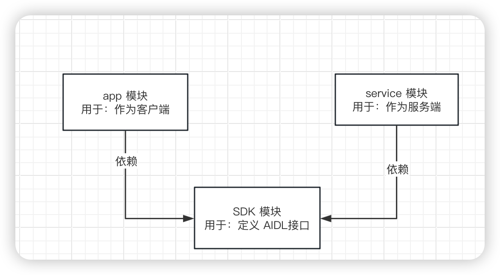
        
    - 1、sdk模块：建立目录结构，并写好代码
        
        [https://github.com/ihrthk/AIDLDemo](https://github.com/ihrthk/AIDLDemo)
        
        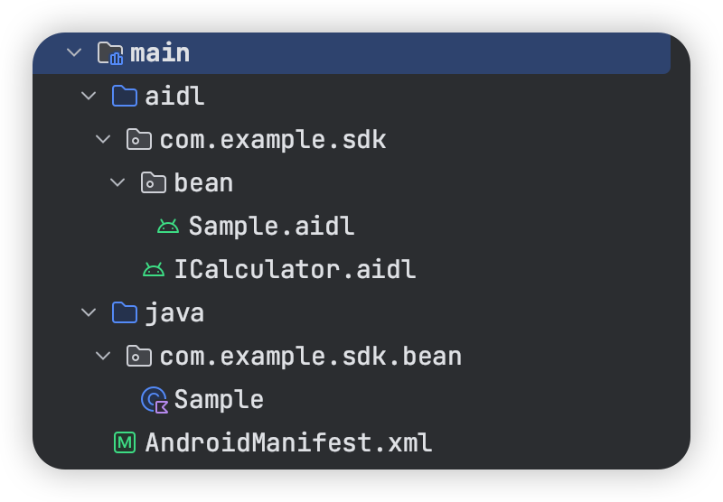
        
        ```kotlin
        package com.example.sdk.bean
        
        import android.os.Parcelable
        import kotlinx.parcelize.Parcelize
        
        @Parcelize
        data class Sample(var num: Int) : Parcelable
        ```
        
        ```kotlin
        package com.example.sdk.bean;
        parcelable Sample;
        ```
        
        ```kotlin
        // ICalculator.aidl
        package com.example.sdk;
        
        import com.example.sdk.bean.Sample;
        
        //计算接口
        interface ICalculator {
            //加
            int add(int a, int b);
            //减
            int subtract(int a, int b);
            //乘
            int multiply(int a, int b);
            //除
            int divide(int a, int b);
            //传递对象
            Sample optionParcel(in Sample sample);
        }
        ```
        
    - 解读：系统生成ICalculator.java的类，来分析 Binder 的原理
        
        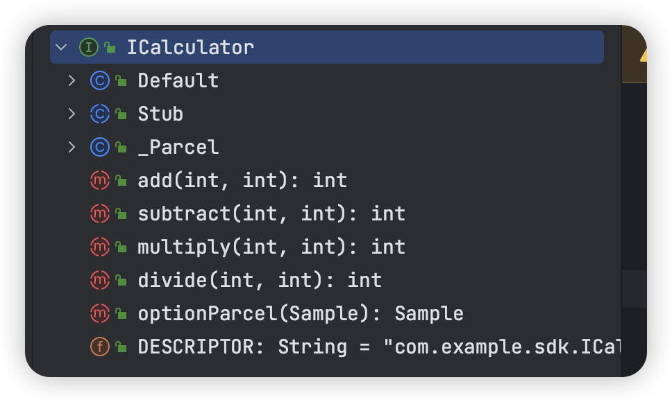
        
        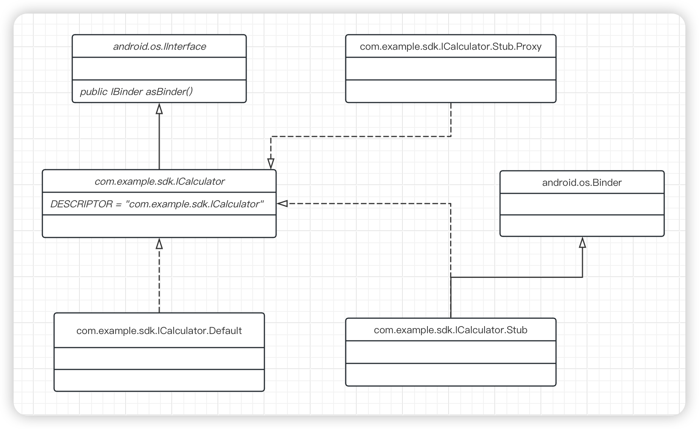
        
        可以看到根据ICalculator.aidl 系统 我们生成了ICalculator.java 这个类，它继承了IInterface这个接口，同时它自己也还是个接口，所有可以在Binder 中传输的接口都需要继承IInterface接口。**同时它还声明了n个整型的id分别用于标识这n个方法，这n个id用于标识在transact过程中客户端所请求的到底是哪个方法**。接着，它声明了一个内部类Stub，这个Stub就是一个Binder类，当客户端和服务端都位于同一个进程时，方法调用不会走跨进程的transact过程，**而当两者位于不同进程时，方法调用需要走transact 过程，这个逻辑由Stub的私有内部代理类Proxy来完成**。这么来看，ICalculator这个接又的确很简单，但是我们也应该认识到 ，这个接口的核心实现就是它的内部类Stub和Stub的内部代理类Proxy，下面详细介绍针对这两个类的每个方法的含义。
        
        ```kotlin
        //Binder的唯一标识，一般用当前Binder的类名表示，比如本例中的"com.example.sdk.ICalculator"
        public static final java.lang.String DESCRIPTOR = "com.example.sdk.ICalculator";
        //用于将服务端的Binder对象转换成客户端所需的AIDL接口类型的对象。
        //这种转换过程是区分进程的，如果客户端和服务端位于同一进程，那么此方法返回的就是服务端的Stub对象本身，
        //否则返回的是系统封装后的Stub.proxy对象。
        public static com.example.sdk.ICalculator asInterface(android.os.IBinder obj){}
        //这个方法运行在服务端中的Binder线程池中，当客户端发起跨进程请求中，远程请求会通过系统底层封装后交由此方法来处理。
        //服务端通过 code 可以确定客户端所请求的目标方法是什么，接着从 data 中取出目标方法所需的参数，然后执行目标方法。
        //当目标方法执行完毕后，就向 reply 中写入返回值(如果目标方法有返回值的话)，onTransact 方法的执行过程就是这样的。
        public boolean onTransact(int code, android.os.Parcel data, android.os.Parcel reply, int flags) throws android.os.RemoteException {}
        //这个方法运行在客户端，当客户端远程调用此方法时，它的内部实现是这样的：
        //首先创建方法所需要的输入型 Parcel 对象_data、输出型 Parcel 对象_reply 和返回值 List；
        //然后把该方法的参数信息写入_data_中(如果有参数的话)；
        //接着调用 transact 方法来发起 RPC(远程过程调用)请求，同时当前线程挂起；
        //然后服务端的 onTransact 方法被调用，直到 RPC 过程返回后，当前线程继续执行，并从 _reply 中取出 RPC 过程的返回结果；
        //最后返回 _reply 中的数据。
        Proxy.xxxxx
        
        //此方法用于返回当前Binder对象。
        public android.os.IBinder asBinder()
        ```
        
        AIDL 和 Binder 的工作过程流程图
        
        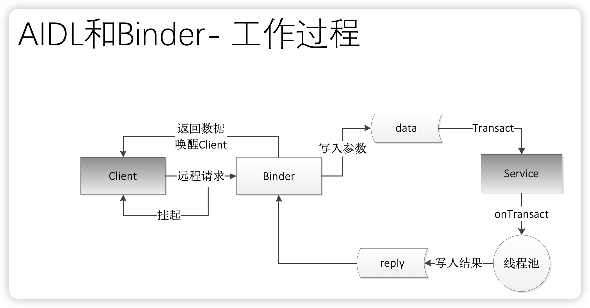
        
        <aside>
        💡 从上述分析过程来看，我们完全可以不提供AIDL 文件即可实现Binder，之所以提供 AIDL 文件，是为了方便系统为我们生成代码
        
        </aside>
        
    - 2、service 模块编写
        
        ```kotlin
        class CalculatorService : Service() {
        
            private val iCalculatorStub: ICalculator.Stub = object : ICalculator.Stub() {
        
                override fun add(a: Int, b: Int): Int = a + b
        
                override fun subtract(a: Int, b: Int): Int {
                    return a - b
                }
        
                override fun multiply(a: Int, b: Int): Int {
                    return a * b
                }
        
                override fun divide(a: Int, b: Int): Int {
                    return a / b
                }
        
                override fun optionParcel(sample: Sample): Sample {
                    return Sample(sample.num + 1)
                }
            }
        
            override fun onBind(intent: Intent?): IBinder {
                return iCalculatorStub
            }
        }
        ```
        
        ```kotlin
        <service
            android:name=".CalculatorService"
            android:enabled="true"
            android:exported="true"
            android:process=":remote">
        
            <intent-filter>
                <action android:name="com.zls.aidl.Calculator" />
            </intent-filter>
        </service>
        ```
        
    - 3、app 模块编写
        
        ```kotlin
        class MainActivity : AppCompatActivity() {
        
            lateinit var calculator: ICalculator
        
            private val serviceConnection = object : ServiceConnection {
                override fun onServiceConnected(name: ComponentName?, service: IBinder?) {
                    calculator = ICalculator.Stub.asInterface(service)
                    Toast.makeText(this@MainActivity, "onServiceConnected", Toast.LENGTH_SHORT).show()
                }
        
                override fun onServiceDisconnected(name: ComponentName?) {
        
                }
            }
        
            private val mainBinding by lazy {
                ActivityMainBinding.inflate(layoutInflater)
            }
        
            override fun onCreate(savedInstanceState: Bundle?) {
                super.onCreate(savedInstanceState)
                bindService()
                setContentView(mainBinding.root)
                mainBinding.tv1.setOnClickListener {
                    val ret = calculator.add(1, 2)
                    Toast.makeText(this, ret.toString(), Toast.LENGTH_SHORT).show()
                }
                mainBinding.tv2.setOnClickListener {
                    val ret = calculator.subtract(2, 1)
                    Toast.makeText(this, ret.toString(), Toast.LENGTH_SHORT).show()
                }
                mainBinding.tv3.setOnClickListener {
                    val ret = calculator.multiply(3, 5)
                    Toast.makeText(this, ret.toString(), Toast.LENGTH_SHORT).show()
                }
                mainBinding.tv4.setOnClickListener {
                    val ret = calculator.divide(6, 2)
                    Toast.makeText(this, ret.toString(), Toast.LENGTH_SHORT).show()
                }
                mainBinding.tv5.setOnClickListener {
                    val ret = calculator.optionParcel(Sample(100))
                    Toast.makeText(this, ret.toString(), Toast.LENGTH_SHORT).show()
                }
            }
        
            private fun bindService() {
                val intent = Intent()
                intent.action = "com.zls.aidl.Calculator"
                intent.component = ComponentName(
                    "com.example.service",
                    "com.example.service.CalculatorService"
                )
                val bindService = bindService(intent, serviceConnection, BIND_AUTO_CREATE)
                //        Toast.makeText(this, "bindService", Toast.LENGTH_SHORT).show()
            }
        
            override fun onDestroy() {
                super.onDestroy()
                unbindService(serviceConnection)
            }
        }
        ```
        
        ```kotlin
        <queries>
            <package android:name="com.example.service" />
        </queries>
        ```
        
    - 服务端进程异常终止，怎么处理？
        
        Binder的两个很重要的方法linkToDeath和unlinkToDeath。我们知道，Binder运行在服务端进程，如果服务端进程由于某种原因异常终止，这个时候我们到服务端的Binder连接断裂(称之Binder死亡)，会导致我们的远程调用失败。更为关键的是，如果我们不知道Binder连接已经断裂，那么客户端的功能就会受到影响。为了解决这个问题，Binder中提供了两个配对的方法linkToDeath和unlinkToDeath，通过 linkToDeath 我们可以给Binder设置一个死亡代理，当Binder死亡时，我们就会收到通知，这个时候我们就可以重新发起连接请求从而恢复连接。那么到底如何给Binder设置死亡代理呢?也很简单。首先，声明一个DeathRecipient对象。DeathRecipient是一个接口， 其内部只有一个方法binderDied，我们需要实现这个方法，当Binder死亡的时候，系统就会回调binderDied方法，然后我们就可以移出之前绑定的binder代理并重新绑定远程服务。
        
- 从Framework角度：看 Binder
    
    从Framework 角度来说，Binder 是ServiceManager 连接各种Manager (ActivityManager、WindowManager，等等)和 相应ManagerService的桥梁。
    
- 从内核角度：看Binder
    
    从IPC角 度来说， Binder 是Android中的一种跨进程通信方式，Binder 还可以理解为一种虚拟的物理设备， 它的设备驱动是/dev/binder，该通信方式在Linux中没有。
    
- Binder 的前置知识点
    
    进程通信简单模型如图：
    
    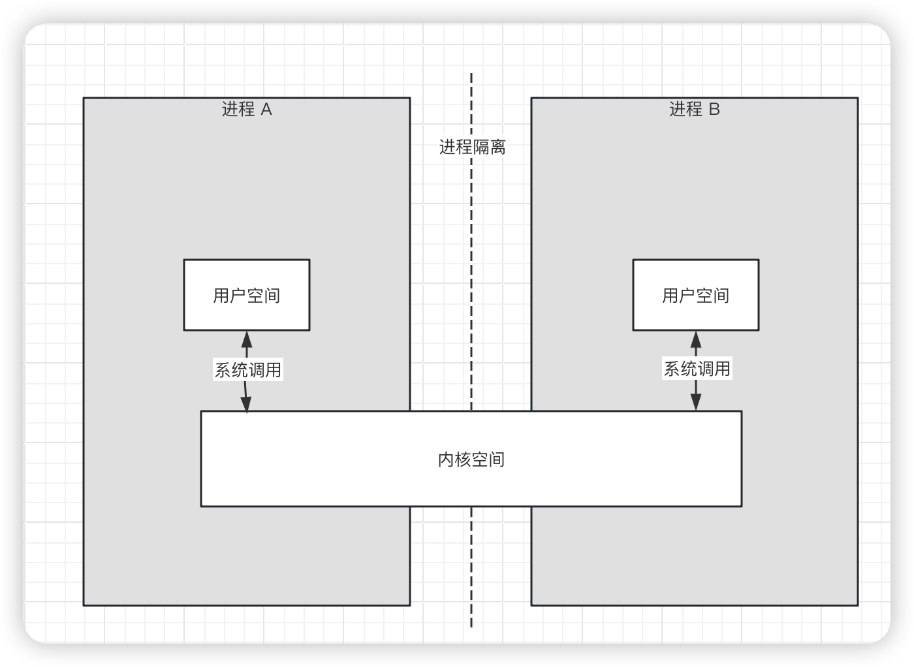
    
    - 内核空间和用户空间：为了保护用户进程，不能直接操作内核，以保证内核的安全，操作系统从逻辑上将虚拟空间划分为用户空间和内核空间。内核空间是 Linux 内核的运行空间，用户空间是用户程序的运行空间。为了保证内核的安全，它们是隔离的，即使用户的程序崩溃了，内核也不会收到影响。内核空间的数据是可以进程共享的，而用户空间的数据则不可以。
    - 进程隔离：进程隔离指的是一个进程不能直接操作或者访问另一个进程，也就是进程 A 不可以直接访问进程 B 的数据。
    - 系统调用：用户空间需要访问内核空间，就需要借助系统调用来实现。**系统调用是用户空间访问内核空间的唯一方式**，保证了所有资源访问都是在内核的控制下进行的，避免了用户程序对系统资源的越权访问，提升了系统的安全性和稳定性。
        
        进程 A和进程 B 的用户空间可以通过如下系统函数和内核空间交互。
        
        copy_from_user：将用户空间的数据复制到内核空间。
        
        copy_to_user：将内核空间的数据复制到用户空间。
        
    - 内存映射：在Linux中，内存映射是一种将文件或设备的内容映射到进程的虚拟内存空间的机制。通过内存映射，可以将文件或设备的内容视为内存中的一部分，从而可以通过内存访问的方式来读取和写入这些内容，而不需要进行显式的文件读写操作。
    内存映射通过使用mmap()系统调用来实现。mmap()函数将文件或设备的内容映射到进程的虚拟内存空间中的一段连续地址范围。这段地址范围可以被进程直接访问，就像访问普通的内存一样。
- Binder 的通信原理
    
    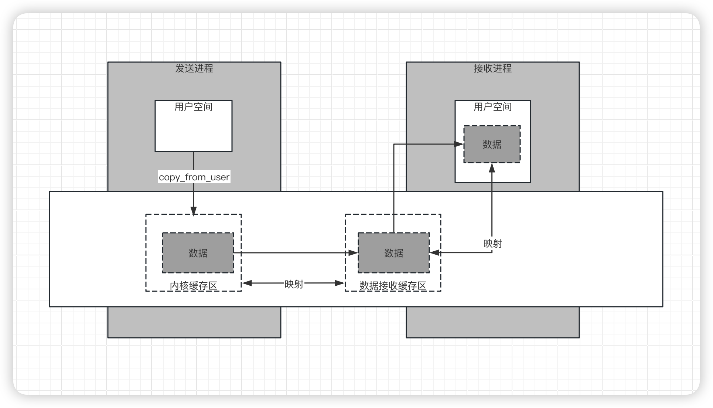
    
    1. Binder 驱动在内核空间创建一个**数据接收缓存区。**
    2. 在内核空间开辟一个内核缓存区，建立**内核缓存区**和**数据接收缓存区**之间的映射关系，以及**数据接收缓存区**和**接收进程用户空间地址**的映射关系。
    3. 发送方进程通过 copy_from_user 函数将数据复制到内核中的**内核缓存区**，由于**内核缓存区**和**接收进程的用户空间**存在内存映射，因此也就相当于把数据发送到了**接收进程的用户空间**，这样便完成了一次进程间的通信。
    
    整个过程只使用了一次复制，不会因为不知道数据的大小而浪费空间或者时间，这样更更高效。
    
- Binder 的优势
    1. 性能方面：数据只复制一次，而管道、消息队列、Socket 都是复制两次。
    2. 安全性方面：传统的 IPC 接收方无法获取对方可靠的UID/PID，无法鉴别对方身份。Android 为每个安装好的 App分配了自己的 UID，通过进程的 UID 来鉴别进程身份。另外 Android 系统中的服务端会判断 UID/PID是否满足访问权限，而对于只暴露客户端，加强了系统的安全性。

[**把玩Android多进程**
](Binder/Untitled.pdf)

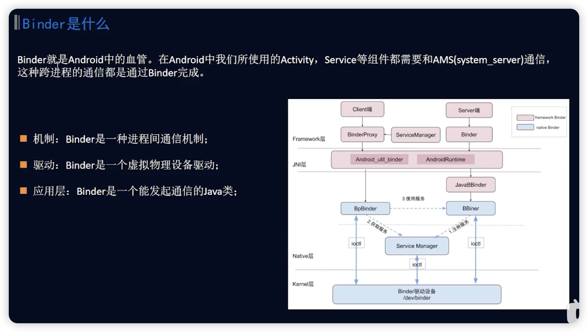

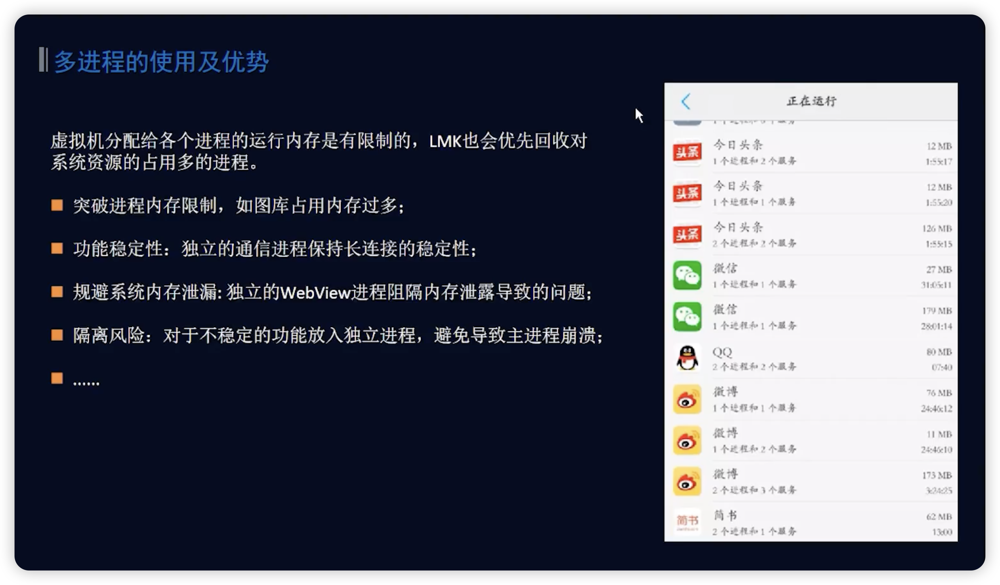

getprop dalvik.vm. heapsize

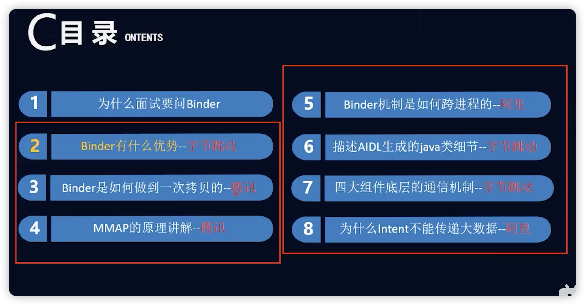

- Binder有什么优势?
    
    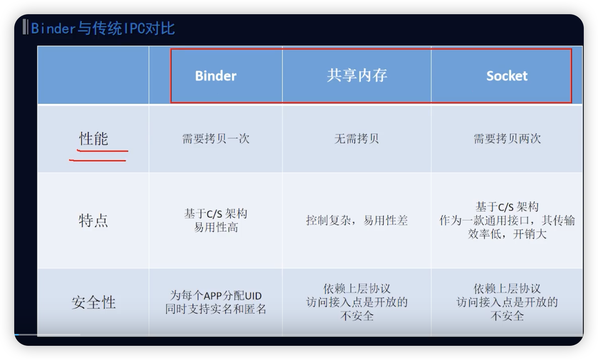
    
    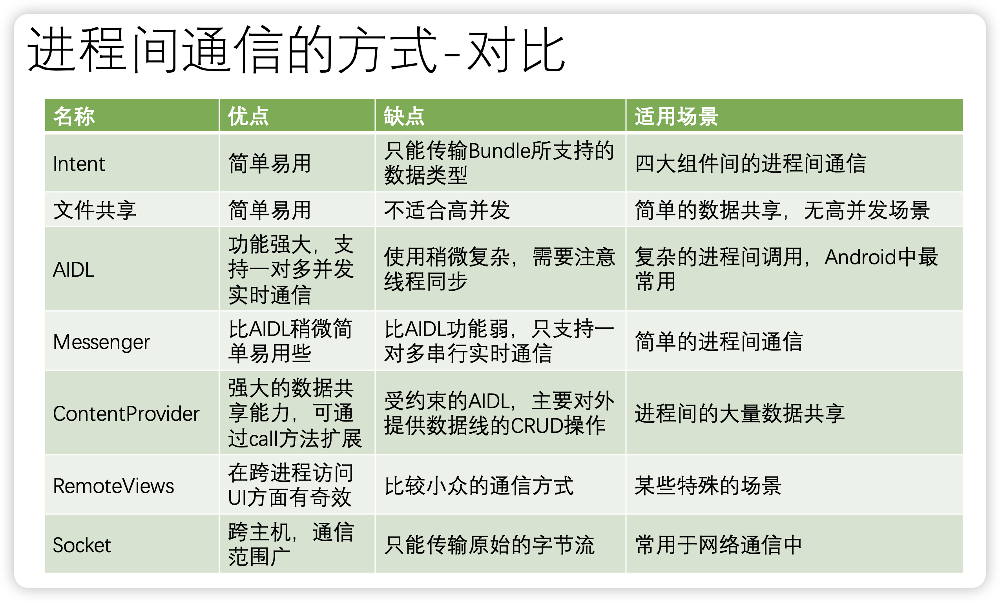
    
    - 为什么要使用Binder 呢？
        
        Android是基于 Lindex 的，在 Linux 中的跨进程通信有Socket、信号量、内存共享、消息队列等，Binder 具体其他通信方式无可比拟的优势，传统的跨进程通信机制，如 Socket，开销大且效率不高，而管道和队列拷贝次数多，更重要的是，对于移动设备来说，安全性相当重要，而传统的通信机制安全性低，大部分情况下接收方无法得到发送方的可信 PID/UID，难以对其身份校验。而 Binder 在设计的时候就考虑到了传输性能的同时有提供了安全性。
        
        直观来说，Binder 是Android中的一个类，它实现了IBinder接口。从IPC角度来说， Binder是Android中的一种跨进程通信方式，Binder 还可以理解为一种虚拟的物理设备， 它的设备驱动是/dev/binder，该通信方式在Linux中没有
        
        Android 开发中，Binder 主要用在Service 中，包括AIDL 和Messenger，
        

[](https://mp.weixin.qq.com/s/DgMXCqRh5sQiIDEUeTPzcw)

- Android技能树 — 多进程相关小结