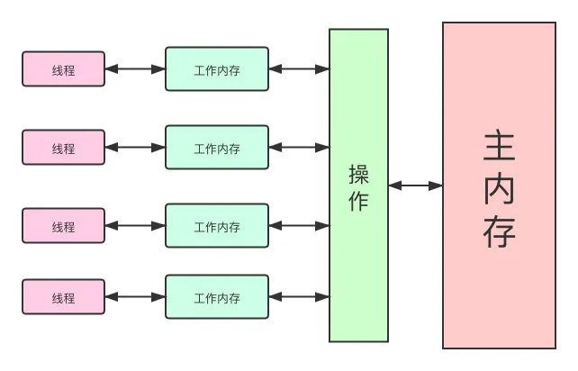
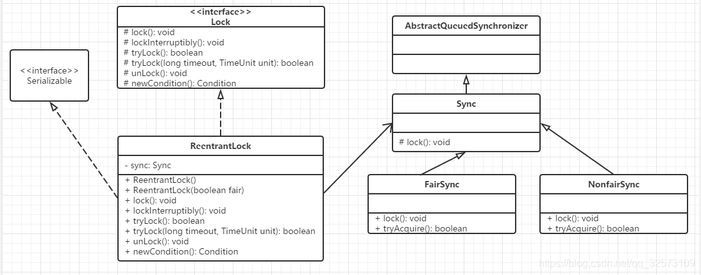
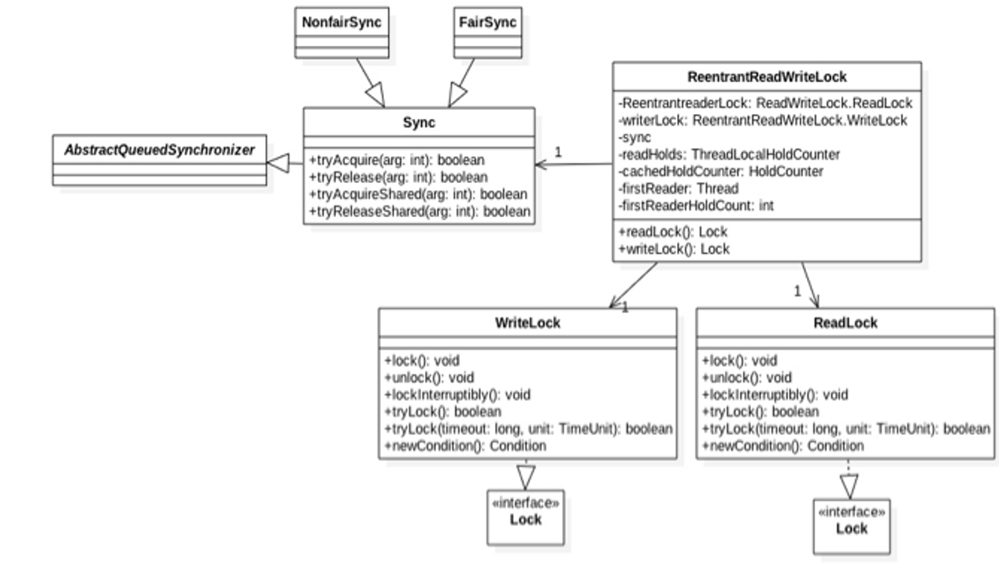
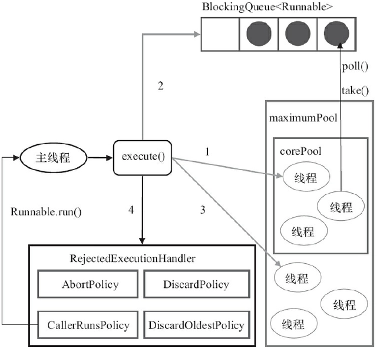

# Java并发编程

**多线程与高并发**

- 线程池的实现原理
    
    在 ThreadPoolExecutor 类中，execute(Runnable command) 方法的核心逻辑如下：
    
    1. **参数检查**：
    - 检查传入的任务是否为 null，如果是，抛出 NullPointerException。
    1. **线程池状态判断**：
    - 如果线程池未关闭且运行中的线程数小于核心线程数，则创建新线程执行任务。
    - 如果线程池运行中的线程数大于等于核心线程数，则将任务加入阻塞队列。
    1. **队列管理**：
    - 如果任务成功加入队列，但所有线程都在忙碌，并且线程池未关闭，则确保线程池中有空闲线程来处理队列中的任务。
    - 如果任务无法加入队列（因为队列已满），则尝试创建新线程。
    - 如果线程池已达到最大线程数且无法创建新线程，则执行拒绝策略（如抛出异常或其他预定义的策略）。
- 线程池里的线程具体是怎么回收?
    
    🧙🏾‍♂️: 在面试中回答线程池里的线程具体是怎么回收时，建议你重点讲解线程池回收线程的机制和源码分析，展示你对这一过程的深入理解。下面是一个结构化的回答：
    
    ### 线程池中的线程回收机制
    
    1. **概述**：
        - Java的`ThreadPoolExecutor`类负责管理和控制线程池中的线程。
        - 线程回收主要依赖于`corePoolSize`、`maximumPoolSize`、`keepAliveTime`等参数的配置。
    2. **关键参数**：
        - `corePoolSize`：核心线程数，线程池中始终保持存活的线程数量。
        - `maximumPoolSize`：最大线程数，线程池中允许的最大线程数量。
        - `keepAliveTime`：线程空闲时间，超过这个时间没有任务执行的线程会被回收。
        - `allowCoreThreadTimeOut`：是否允许核心线程超时。
    3. **线程回收的过程**：
        - 当一个线程完成任务后，会进入空闲状态，此时它会调用`getTask()`方法从任务队列中获取新任务。
        - 如果线程在`keepAliveTime`内没有获取到新任务，并且允许核心线程超时（`allowCoreThreadTimeOut`），该线程会被回收。
    
    ### 具体源码分析
    
    1. **`getTask()`方法**：
        - `getTask()`方法是线程从任务队列中获取任务的核心方法。
        - 如果`allowCoreThreadTimeOut`为`true`，即使是核心线程，在超过`keepAliveTime`后也会被回收。
    
    ```java
    private Runnable getTask() {
        boolean timedOut = false;
    
        for (;;) {
            int c = ctl.get();
            int rs = runStateOf(c);
    
            if (rs >= SHUTDOWN && (rs >= STOP || workQueue.isEmpty())) {
                decrementWorkerCount();
                return null;
            }
    
            int wc = workerCountOf(c);
            boolean timed = allowCoreThreadTimeOut || wc > corePoolSize;
    
            if ((wc > maximumPoolSize || (timed && timedOut))
                && (wc > 1 || workQueue.isEmpty())) {
                if (compareAndDecrementWorkerCount(c))
                    return null;
                continue;
            }
    
            try {
                Runnable r = timed ?
                    workQueue.poll(keepAliveTime, TimeUnit.NANOSECONDS) :
                    workQueue.take();
                if (r != null)
                    return r;
                timedOut = true;
            } catch (InterruptedException retry) {
                timedOut = false;
            }
        }
    }
    
    ```
    
    1. **`runWorker()`方法**：
        - `runWorker()`方法是线程池中线程的执行入口。
        - 它会调用`getTask()`方法获取任务并执行，如果`getTask()`返回`null`，说明没有新任务且线程应被回收。
    
    ```java
    final void runWorker(Worker w) {
        Thread wt = Thread.currentThread();
        Runnable task = w.firstTask;
        w.firstTask = null;
        w.unlock();
        boolean completedAbruptly = true;
    
        try {
            while (task != null || (task = getTask()) != null) {
                w.lock();
                try {
                    beforeExecute(wt, task);
                    task.run();
                    afterExecute(task, null);
                } finally {
                    task = null;
                    w.completedTasks++;
                    w.unlock();
                }
            }
            completedAbruptly = false;
        } finally {
            processWorkerExit(w, completedAbruptly);
        }
    }
    
    ```
    
    1. **`processWorkerExit()`方法**：
        - 当一个线程需要退出时，`processWorkerExit()`方法会被调用。
        - 该方法会减少工作线程数，并检查是否需要补充新的线程。
    
    ```java
    private void processWorkerExit(Worker w, boolean completedAbruptly) {
        if (completedAbruptly)
            decrementWorkerCount();
    
        final ReentrantLock mainLock = this.mainLock;
        mainLock.lock();
        try {
            completedTaskCount += w.completedTasks;
            workers.remove(w);
        } finally {
            mainLock.unlock();
        }
    
        tryTerminate();
    
        int c = ctl.get();
        if (runStateLessThan(c, STOP)) {
            if (!completedAbruptly) {
                int min = allowCoreThreadTimeOut ? 0 : corePoolSize;
                if (min == 0 && !workQueue.isEmpty())
                    min = 1;
                if (workerCountOf(c) >= min)
                    return;
            }
            addWorker(null, false);
        }
    }
    
    ```
    
    ### 总结
    
    线程池中的线程通过`getTask()`方法获取任务，如果线程在`keepAliveTime`内未获取到任务且允许核心线程超时（`allowCoreThreadTimeOut`），则该线程会被回收。线程回收的具体操作在`processWorkerExit()`方法中进行，确保线程池的线程数和资源使用效率保持在合理范围内。
    
    这样回答不仅展示了你对线程池机制的理解，还通过具体的源码解析展示了你的深入掌握程度。如果面试官有进一步的问题，可以基于这些内容展开讨论。
    
- 线程的死锁,如何解决
    
    🧙🏾‍♂️: 线程死锁是指两个或多个线程互相等待对方释放资源，从而导致所有相关线程都无法继续执行。解决线程死锁的问题可以通过以下几种方法：
    
    ### 1. **避免死锁**
    
    ### a. 避免嵌套锁
    
    尽量避免在一个锁的持有期间请求另一个锁。可以通过重新设计代码来减少锁的使用。
    
    ### b. 按顺序获取锁
    
    确保所有线程按相同的顺序获取锁。这样可以避免循环等待条件，从而避免死锁。
    
    ```java
    synchronized (lock1) {
        synchronized (lock2) {
            // 操作
        }
    }
    
    ```
    
    ### 2. **死锁检测和恢复**
    
    ### a. 使用超时锁
    
    使用带超时的锁（如`tryLock`方法），避免线程无限期地等待锁。
    
    ```java
    if (lock.tryLock(1000, TimeUnit.MILLISECONDS)) {
        try {
            // 操作
        } finally {
            lock.unlock();
        }
    } else {
        // 处理无法获得锁的情况
    }
    
    ```
    
    ### b. 定期检测死锁
    
    使用死锁检测工具或定期在程序中进行死锁检测。Java提供了`ThreadMXBean`来检测死锁。
    
    ```java
    import java.lang.management.ManagementFactory;
    import java.lang.management.ThreadMXBean;
    
    public void detectDeadlock() {
        ThreadMXBean bean = ManagementFactory.getThreadMXBean();
        long[] threadIds = bean.findDeadlockedThreads();
        if (threadIds != null) {
            System.out.println("Deadlock detected!");
            // 采取措施
        }
    }
    
    ```
    
    ### 3. **设计上的改善**
    
    ### a. 使用更高层次的锁
    
    通过减少锁的粒度来减少死锁的可能性。使用更高层次的锁或事务来代替细粒度的锁。
    
    ### b. 使用无锁数据结构
    
    使用无锁的数据结构和并发控制机制，如Java的`java.util.concurrent`包下的类，如`ConcurrentHashMap`、`AtomicInteger`等。
    
    ### 4. **分布式锁**
    
    在分布式系统中，使用分布式锁可以避免单点锁带来的死锁问题。可以使用Zookeeper、Redis等实现分布式锁。
    
    ### 具体例子
    
    ### 避免嵌套锁的例子
    
    ```java
    class Resource {
        private final Object lock1 = new Object();
        private final Object lock2 = new Object();
    
        public void method1() {
            synchronized (lock1) {
                synchronized (lock2) {
                    // 操作
                }
            }
        }
    
        public void method2() {
            synchronized (lock1) {
                synchronized (lock2) {
                    // 操作
                }
            }
        }
    }
    
    ```
    
    ### 使用`tryLock`方法的例子
    
    ```java
    import java.util.concurrent.locks.Lock;
    import java.util.concurrent.locks.ReentrantLock;
    
    class Resource {
        private final Lock lock1 = new ReentrantLock();
        private final Lock lock2 = new ReentrantLock();
    
        public void method1() throws InterruptedException {
            if (lock1.tryLock(1000, TimeUnit.MILLISECONDS)) {
                try {
                    if (lock2.tryLock(1000, TimeUnit.MILLISECONDS)) {
                        try {
                            // 操作
                        } finally {
                            lock2.unlock();
                        }
                    }
                } finally {
                    lock1.unlock();
                }
            }
        }
    
        public void method2() throws InterruptedException {
            if (lock2.tryLock(1000, TimeUnit.MILLISECONDS)) {
                try {
                    if (lock1.tryLock(1000, TimeUnit.MILLISECONDS)) {
                        try {
                            // 操作
                        } finally {
                            lock1.unlock();
                        }
                    }
                } finally {
                    lock2.unlock();
                }
            }
        }
    }
    
    ```
    
    通过以上方法，可以有效避免和解决线程死锁问题。如果你有具体的代码需要分析或其他相关问题，请告诉我。
    

- 并发的基础知识
    - 并发是指同一时间段多个任务同时都在执行，并且都没有执行结束；
    而并行是说在单位时间内多个任务同时在执行。
    - 线程的等待与通知：wait()、notify()
    - 让线程睡眠的 sleep 方法
    - 让出cpu执行权的yield 方法
    - 守护线程与用户线程的区别：当最后一个非守护线程结束时，JVM会正常退出；
    也就是守护线程是否结束并不影响JVM退出。
    - 停止线程
        - stop被废弃，由于它不安全。
        - 可以逻辑停止
            - Thread.interrupted(获取中断状态，并清空)
            - **thread.isInterrupted(获取中断状态，不清空)**
            - volatile boolean标志位
    - volatile
        
        **`volatile`**是一个关键字，用于修饰变量，它主要有两个作用：可见性和有序性。
        
        
        
        1. 当一个变量被声明为 volatile关键字时，线程在写入变量时不会把值缓存工作内存，而是会直接刷新回主内存；当其他线程读取该共享变量时，会从主内存重新获取最新值，而不是使用当前线程的工作内存的值。
        2. 另一个重要作用是阻止指令重排序。比如new Singleton时，一般来说有三个步骤：(JVM 内存模型允许编译器和处理器对指令重排序以提供运行性能，并且只会对不存在数据依赖性的指令重排序。)
            
            (1).分配一块内存
            
            (2).在内存上初始化Singleton对象
            
            (3).把这块内存地址赋值给instance
            
    - synchronized
        
        保证内存可见性和原子性操作
        
        进入在 synchronized 块内使用到该变量时就不会中线程的工作内存中获取，而是直接从主内存中获取。
        
        Java内存模型规定，将所有的变量都存在主内存中，当线程使用变量时，会把主内存里面的变量复制到自己的工作内存，线程读写变量时操作的是自己工作内存的变量。(每个核都有自己的一级缓存，在有些架构里面还有一个所有CPU都共享的二级缓存。那么Java 内存模型里面的工作内存，就对应这里的L1 或者L2缓存或者CPU的寄存器。)
        
- ThreadLocal
    - 这个变量的每一个线程都会有这个变量的一个本地副本，实际上操作的是自己本地内存里面的变量，从而避免了线程的安全问题。**线程本地变量，该变量对其他线程而言是隔离的，它最主要的作用就是线程隔离。**
    - 其实每个线程的本地变量不是存放在ThreadLoca实例里面，而是存放在**调用线程的threadLocals变量**里面；
    也就是说，ThreadLocal类型的本地变量存放在具体的线程内存空间中。
    - ThreadLocal 就是一个工具壳，它通过 set 方法把value的值放入**调用线程的 threadLocals 里面**并存放起来，当调用线程调用它的get 方法是，再从**当前线程的 threadLocals变量**里面将其拿出来使用。
    - threadLocals 是一个 HashMap 结构，其中 key 就是当前 ThreadLocal的实例对象引用，value 是通过 set 方法传递的值。
    - 如果当前线程一直不消亡，那么这些本地变量会一直存在，所以可能会造成内存溢出。因此使用完毕要记得调用ThreadLocal 的 remove 方法删除对应线程的 threadLocals中的本地变量。
- CAS操作及 Unsafe
    - CAS即 Compare And Swap，是 JDK 提供的非阻塞原子性操作，它通过硬件保证了比较-更新操作的原子性
    - CAS 有四个操作数，分别为：对象内存位置、对象中的变量的偏移量、变量预期值和新的值。其操作含义是，如果对象 obj 中内存偏移量为 valueObject 的变量值为expect，则使用新的值 update 替换旧的值 expect。这是处理器提供的一个原子性指令。
    - ABA问题：JDK 中的 AtomicStampedReference 类给每个变量的状态都配备了时间戳，从而避免了 ABA问题的产生。
    - JDK的 rt.java 包的 Unsafe 提供了硬件级别的原子操作，UnSafe 类中方法都是native 方法。
- LockSupport工具类
    - JDK中rt.jar 包里面的 LockSupport 是一个工具类，它的主要作用是挂起和唤起线程，该工具类是创建锁和其他同步类的基础。
    - part方法：如果调用 park 方法的线程已经拿到了与 LockSupport 关联的许可证，则调用 LockSupport.part时会马上返回，否则调用线程会被禁止参与线程调度，也就是线程被阻塞挂起。
    - unpart方法：如果 thread 之前因调用 part 方法而挂起，则调用 unpark 后，该线程会被唤醒；
    如果 thread 之前没有调用 park，则调用 unpark 方法后，再调用 park 方法，会立刻返回。
- 抽象同步队列 AQS
    
    AQS的类图结构如下：
    
    
    
    - 从该图可以看到，AQS 是一个 FIFO 的双向队列，其内部通过节点 head 和 tail 记录队首和队尾元素，队列元素的类型为 Node。其中 Node 中的 thread 变量用来存放进入 AQS 队列里面的线程；Node 节点内部的SHARED用来标记该线程是获取公共资源时被阻塞挂起后放入 AQS 队列的，EXCLUSIVE 用来标记标记线程是获取独占资源是被挂起后放入 AQS队列的；waitStatus 记录当前线程等待状态，可以为 CANCELLED、SIGNSL、CONDITION、PROPAGATE；prev 记录当前节点的前驱节点，next 记录当前节点的后继节点。
    - 在AQS中维持了一个单一的状态信息 state，可以通过 getState、setState、compareAndSetState 函数修改其值。**对于 ReentrantLock 的实现来说，state 可以用来表示当时线程获取锁的可重入次数；
    对于读写锁 ReentrantReadWriteLock 来说，state 的高 16 位表示读状态，也就是获取该读锁的次数，低 16 位表示获取到写锁的线程的可重入次数。**
    - AQS有个内部类 ConditionObject，用来结合锁实现线程同步。ConditionObject 可以直接访问 AQS 对象内部的变量，比如 state 状态值和AQS队列。ConditionObject条件变量，每个条件变量对应一个条件队列(单向链表队列)，其用来存放条件变量的 await 方法后被阻塞的线程，入类图所示，这个条件队列的头、尾元素分别为 firstWait 和 lastWait.
    - 对于AQS来说，线程同步的关键是对状态值 state 进行操作。根据 state 是否属于一个线程，操作 state 的方式分为独占方式和共享方式。
    - 独占方式：使用acquire 和 release 方法；独占方式获取资源是与具体线程绑定的，就是说如果一个线程获取到了资源，就会标记是这个线程获取到了，其他线程再尝试操作 state 获取资源时会发现当前该资源不是自己持有的，就会获取失败后被阻塞。
    - 共享方式：使用 acquireShared 和 releaseShared 方法；共享方式的资源与具体线程是不相关的，当多个线程去请求资源时通过 CAS 方式竞争获取资源，当一个线程获取到了资源后，另外一个线程再去获取资源是如果当前资源还能满足它的需要，则当前线程只需要使用 CAS 方式获取即可。
    - 如下代码是基于AQS实现的不可重入的独占锁：
        
        ```java
        public class NonReentrantLock implements Lock, Serializable {
        
            private static class Sync extends AbstractQueuedSynchronizer {
        
                /**
                 * 是否锁已经被持有
                 *
                 * @return
                 */
                @Override
                protected boolean isHeldExclusively() {
                    return getState() == 1;
                }
        
                /**
                 * 如果state为0，则尝试获取锁
                 */
                @Override
                protected boolean tryAcquire(int arg) {
                    assert arg == 1;
                    if (compareAndSetState(0, 1)) {
                        //设置当前线程为独占线程
                        setExclusiveOwnerThread(Thread.currentThread());
                        return true;
                    }
                    return false;
                }
        
                /**
                 * 尝试释放锁，设置state为0
                 */
                @Override
                protected boolean tryRelease(int arg) {
                    assert arg == 1;
                    if (getState() == 0) {
                        throw new IllegalMonitorStateException();
                    }
                    setExclusiveOwnerThread(null);
                    setState(0);
                    return true;
                }
        
                /**
                 * 返回一个Condition，每个condition都包含了一个condition队列
                 */
                Condition newCondition() {
                    return new ConditionObject();
                }
            }
        
            private final Sync sync = new Sync();
        
            @Override
            public void lock() {
                //尝试获取锁，获取不到则加入到队列中
                sync.acquire(1);
            }
        
            @Override
            public void lockInterruptibly() throws InterruptedException {
                //尝试获取锁，获取不到则加入到队列中，如果当前线程被中断，则抛出异常
                sync.acquireInterruptibly(1);
            }
        
            @Override
            public boolean tryLock() {
                //尝试获取锁，获取不到则加入到队列中，如果当前线程被中断，则返回false
                return sync.tryAcquire(1);
            }
        
            @Override
            public boolean tryLock(long time, TimeUnit unit) throws InterruptedException {
                //尝试获取锁，获取不到则加入到队列中，如果当前线程被中断，则抛出异常
                return sync.tryAcquireNanos(1, unit.toNanos(time));
            }
        
            @Override
            public void unlock() {
                //尝试释放锁
                sync.release(1);
            }
        
            @Override
            public Condition newCondition() {
                return sync.newCondition();
            }
        }
        ```
        
    
     
    
- 独占锁ReentrantLock的原理
    
    ReentrantLock 是可重入独占说，同时只能有一个线程可以获取该锁，其他获取该锁的线程会被阻塞而被放入该锁的 AQS 阻塞队列里面。首先看下 ReentrantLock 的类图以便对他的实现有一个大概的了解。
    
    从类图可以看到；ReentraintLock 最终还是使用 AQS 来实现的，并且根据参数来决定其内部是一个公平还是非公平锁，默认是非公平锁。
    
    其中 Sync 类直接继承自 AQS，它的子类NonfairSync和 FairSync 分别实现了获取锁的非公平与公平策略。在这里，AQS 的 state 状态值表示线程获取该锁的可重入次数，**在默认情况下，state 的值为 0 表示锁没有被任何线程持有。当一个线程第一次获取该锁会尝试使用 CAS 设置 state 的值为 1，如果 CAS 成功则当前线程获取了该锁，然后记录该锁的持有则为当前线程。在该线程没有释放锁的情况下第二次获取该锁后，状态值被设置为 2，这就是可重入次数。在该线程释放该锁时，会尝试使用 CAS 让状态值减 1，如果减 1 后状态值为 0，则当前线程释放该锁。**
    
    
    
    - 获取锁 lock 方法；lockInterruptibly 方法它对中断进行相应，就是当前线程在调用该方法时，如果其他线程调用了当前线程的 interrupt 方法，则当前线程会抛出 InterruptedException 异常，然后返回。
    - 释放锁 unlock 方法，如果当前调用该方法会让该线程对该线程持有的 AQS 状态值减 1，如果减 1 后当前状态值为 0，则当前线程会释放该锁，否则仅仅减 1 而已。如果当前线程没有持有该锁而调用了该方法则会抛出 IllegalMonitorStateException 异常。
    - 案例介绍：使用 ReentrantLock 来实现一个简单的线程安全的 list。
        
        ```java
        public class ReentrantLockList {
        
            private ArrayList<String> arrayList = new ArrayList<String>();
            private final ReentrantReadWriteLock lock = new ReentrantReadWriteLock();
        
            private final ReentrantReadWriteLock.ReadLock readLock = lock.readLock();
            private final ReentrantReadWriteLock.WriteLock writeLock = lock.writeLock();
        
            public void add(String e) {
                writeLock.lock();
                try {
                    arrayList.add(e);
                } finally {
                    writeLock.unlock();
                }
            }
        
            public void remove(String e) {
                writeLock.lock();
                try {
                    arrayList.remove(e);
                } finally {
                    writeLock.unlock();
                }
            }
        
            public String get(int index) {
                readLock.lock();
                try {
                    return arrayList.get(index);
                } finally {
                    readLock.unlock();
                }
            }
        }
        ```
        
- 读写锁 ReentrantReadWriteLock 的原理
    
    ReentrantReadWriteLock 采用读写分离策略，允许多个线程可以同时获取读锁；为了了解 ReentrantReadWriteLock 的内部构造，先看看类图：
    
    
    
    读写锁的内部维护一个 ReadLock 和一个 WriteLock，它们依赖 Sync 实现具体功能。而 Sync 继承自 AQS，并且也提供了公平和非公平的实现。AQS 中只维护了一个 state 状态，而 ReentraintReadWriteLock 则需要维护读写两种状态，ReentrantReadWriteLock 巧妙地使用 state 的高 16 位表示读状态，也就是获取读写的次数；使用底 16 位表示获取到写锁的线程的可重入次数。
    
    - 写锁的获取与释放，在 ReentrantReadWriteLock 中写锁使用 WriteLock 来实现。
    - 使用 ReentrantReadWriteLock来实现一个读写版线程安全的 List
        
        ```java
        public class ReentrantLockList {
        
            private ArrayList<String> arrayList = new ArrayList<String>();
            private final ReentrantReadWriteLock lock = new ReentrantReadWriteLock();
        
            private final ReentrantReadWriteLock.ReadLock readLock = lock.readLock();
            private final ReentrantReadWriteLock.WriteLock writeLock = lock.writeLock();
        
            public void add(String e) {
                writeLock.lock();
                try {
                    arrayList.add(e);
                } finally {
                    writeLock.unlock();
                }
            }
        
            public void remove(String e) {
                writeLock.lock();
                try {
                    arrayList.remove(e);
                } finally {
                    writeLock.unlock();
                }
            }
        
            public String get(int index) {
                readLock.lock();
                try {
                    return arrayList.get(index);
                } finally {
                    readLock.unlock();
                }
            }
        }
        ```
        
- JUC中并发队列
    - CopyOnWriteArrayList 是一个线程安全的 ArrayList，对其进行的修改都是在底层复制一个数组上进行的。
    在 CopyOnWriteArrayList 对象里面有一个 array 数组用来存放具体元素，ReentrantLock 独占锁对象用来保证同时只有一个线程对 array 进行修改。
    - Queue和BlockingQueue的区别：Queue有offer和poll是非阻塞的，BlockingQueue有put和take是阻塞的。
    - ConcurrentLinkedQueue是线程安全的无界非阻塞队列，其底层数据结构使用单向链表实现，对于入队和出队操作使用CAS来实现线程安全，它获取的 size 不是精准的，它是通过遍历整个队列来计算元素数量的。在遍历过程中，由于其他线程可能同时对队列进行修改，因此无法保证遍历过程中队列的结构不会发生变化。
    - LinkedBlockingQueue是线程安全的无界阻塞队列，这里的入队和出队时的 count 都是加了锁的，获取size 方法比较准确；LinkedBlockingQueue是线程安全的，size()方法会在获取队列大小的同时保证其他线程不会修改队列的结构。
    - ArrayBlockingQueue是线程安全的有界队列。
    - PriorityBlockingQueue 是带优先级的无界阻塞队列，默认每次出队都是返回优先级数值小的元素(使用Comparable接口，默认从小到大排序)。其内部是使用平衡堆实现的。（任务执行的先后顺序和它们放入队列的先后顺序没有关系，而是和它们的优先级有关系）
- Android中的线程池
    - 线程池的优点可以概括为以下三点:
        1. 重用线程池中的线程，避免因为线程的创建和销毁所带来的性能开销。
        2. 能有效控制线程池的最大并发数 ，避免大量的线程之间因互相抢占系统资源而导致的阻塞现象。
        3. 能够对线程进行简单的管理，并提供定时执行以及指定间隔循环执行等功能。
    - Executor 是一个接口，真正的线程池的实现为ThreadPoolExecutor
        
        ThreadPoolExecutor提供了一系列参数来配置线程池，通过不同的参数可以创建不同的线程池 ，从线程池的功能特性上来说 ， Android的线程池主要分为4 类 ，这4 类线程池可以通过Executors所提供的工厂方法 来得的。
        
    - ThreadPoolExecutor类介绍
        
        ThreadPoolExecutor是线程池的真正实现，它的构造方法提供了一系列参数来配置线程池，下面介绍ThreadPoolExecutor 的构造方法中各个参数的含义，这些参数将会直接影响 到线程池的功能特性，下面是ThreadPoolExecutor 的一个比较常用的构造方法。
        
        ```java
        public ThreadPoolExecutor(int corePoolSize,
                                      int maximumPoolSize,
                                      long keepAliveTime,
                                      TimeUnit unit,
                                      BlockingQueue<Runnable> workQueue,
                                      ThreadFactory threadFactory,
                                      RejectedExecutionHandler handler) {
        }
        ```
        
        - corePoolSize：线程池的核心线程数，默认情况下，核心线程会在线程池中一直存活，即使它们处于闲置状态。如果将ThreadPoolExecutor的allowCoreThreadTimeOut属性设置为true，那么闲置的核心线程在等待新任务到来时会有超时策略，这个时间间隔由keepAliveTime 所指定，当等待时间超过keepAliveTime所指定的时长后，核心线程就会被终止。
        - maximumPoolSize：线程池所能容纳的最大线程数，当活动线程数达到这个数值后，后续的新任务将会被阻塞。
        - keepAliveTime：非核心线程闲置时的超时长，超过这个时长，非核心线程就会被回收。当ThreadPoolExecutor的allowCoreThreadTimeOut属性设置为true时，keepAliveTime同样会作用于核心线程。
        - unit：用于指定keepAliveTime 参数的时间单位，这是一个枚举，常用的有TimeUnit.MILLISECONDS(毫 秒)、TimeUnit.SECONDS(秒)以及TimeUnit.MINUTES(分钟)等。
        - workQueue：线程池中的任务队列，通过线程池的execute方法提交的Runnable对象会存储在这个参数中。
        - threadFactory：线程工厂，为线程池提供创建新线程的功能。ThreadFactory是一个接口，它只有一个 方法：Thread new Thread(Runnable)。
        - handler：当线程池无法执行新任务时，这可能是由于任务队列已满或者是无法成功执行任 务，这个时候ThreadPoolExecutor会调用handler的rejectedExecution方法来通知调用者，默认情况下rejectedExecution方法会直接抛出一 个RejectedExecutionException。ThreadPoolExecutor为RejectedExecutionHandler提供了几个可选值: CallerRunsPolicy、AbortPolicy、DiscardPolicy和DiscardOldestPolicy，其中AbortPolicy是默认值 ，它会直接抛出RejectedExecutionException。
        - ThreadPolExecutor执行任务时大致遵循如下规则：
            1. 如果线程池中的线程数量未达到核心线程的数量，那么会直接启动一个核心线程来执行任务。
            2. 如果线程池中的线程数量已经达到或者超过核心线程的数量，那么任务会被插入到任务队列中排队等待执行。
            3. 如果在步骤2无法将任务插入到任务队列中，这往往是由于任务队列已满，这个时候如果线程数量未达到线程池规定的最大值，那么会立刻启动一个非核心线程来执行任务。
            4. 如果步骤3中线程数量已经达到线程池规定的最大值，那么就拒绝执行此任务， ThreadPoolExecutor会调用RejectedExecutionHandler的rejectedExecution方法来通知调用者。
        - ThreadPoolExecutor执行execute()方法的示意图：
            
            
            
        - Android中最常见的四类具有不同功能特性的线程池，它们都直接或间接地通过配置ThreadPoolExecutor来实现自己的功能特性，这四类线程池分别是SingleThreadExecutor、FixedThreadPool、CachedThreadPool以及ScheduledThreadPool。
            1. 通过Executors的new SingleThreadExecutor方法来创建。这类线程池内部只有一个核心线程，它确保所有的任务都在同一个线程中按顺序执行。SingleThreadExecutor的意义在于统一所有的外界任务到一个线程中，这使得在这些任务之间不需要处理线程同步的问题。
                
                ```java
                public static ExecutorService newSingleThreadExecutor() {
                		return new FinalizableDelegatedExecutorService
                            (new ThreadPoolExecutor(1, 1, 0L, TimeUnit.MILLISECONDS,
                                                    new LinkedBlockingQueue<Runnable>()));
                }
                ```
                
            2. 通过Exccutors的new FixedThreadPool方法来创建。它是一种线程数量固定的线程池，当线程处于空闲状态时，它们并不会被回收，除非线程池被关闭了。当所有的线程都处于活动状态时，新任务都会处于等待状态，直到有线程空闲出来。由于FixedThreadPool只有核心线程并且这些核心线程不被回收 ，这意味着它能够更加快速地响应外界的请求。newFixedThreadPool方法的实现如下，可以发现FixedThreadPool中只有核心线程并且这些核心线程没有超时机制，另外任务队列也是没有大小限制的。
                
                ```java
                public static ExecutorService newFixedThreadPool(int nThreads) {
                    return new ThreadPoolExecutor(nThreads, nThreads, 0L, TimeUnit.MILLISECONDS,
                                                      new LinkedBlockingQueue<Runnable>());
                }
                ```
                
            3. 通过Executors的new CachedThreadPool方法来创建。它是一种线程数量不定的线程池，
            它只有非核心线程，并且其最大线程数为Integer.MAX_VALUE。由于Integer.MAX_VALUE是一个很大的数，实际上就相当于最大线程数可以任意大。当线程池中的线程都处于活动状态时，线程池会建新的线程来处理新任务，否则就会利用空闲的线程来处理新任务。**线程池中的空闲线程都有超时机制，这个超时时长为60秒，超过60秒闲置线程就会被回收。**
                
                ```java
                public static ExecutorService newCachedThreadPool() {
                    return new ThreadPoolExecutor(0, Integer.MAX_VALUE, 60L, TimeUnit.SECONDS,
                                                      new SynchronousQueue<Runnable>());
                }
                ```
                
            4. 通过Executors的new ScheduledThreadPool方法来创建 。它的核心线程数量是固定的 ，而非核心 线程数是没有限制的，并且当非核心线程闲置时会被立即回收；ScheduledThreadPool这类线程池主要用于执行定时任务和具有固定周期的重复任务。
                
                ```java
                public static ScheduledExecutorService newScheduledThreadPool(int corePoolSize) {
                	  return new ScheduledThreadPoolExecutor(corePoolSize);
                }
                ```
                
- ConcurrentHashMap
    - 1.5 分段锁，必要时加锁
        - 问题：集中到一个segment
    - 1.6 优化二次Hash算法
        - segment分布均匀
    - 1.7 分段锁懒加载
        - getObjectVolatile
        - volatile
        - unSafe
    - 1.8 摒弃分段锁
        - getObjectVolatile
        - entry 加锁
- 面试连珠炮
    - 请描述synchronized和reentrantlock的底层实现及重入的底层原理？百度
    阿里
    - 请描述锁的四种状态和升级过程？百度 阿里
    - CAS的ABA问题如何解决？百度
    - 请谈一下AQS，为什么AQS的底层是CAS +volatile？百度
    - 请谈一谈你对volatile的理解？美团 阿里
    - volatile 的可见性和禁止指令重排序是如何实现的？ 美团
    - CAS 是什么？美团
    - 请描述一下对象的创建过程？美团 顺丰
    - 对象在内存中的内存布局？美团 顺风
    - DCL单例为什么要加volatile？美团
    - 解释一下锁的四种状态？顺丰
    - Object o = new Object()在内存中占了多少字节？顺丰
    - 请描述synchronized和ReentrantLock的异同？顺丰
    - 聊聊你对as-if-serial和happens-before语义的理解？京东
    - 你了解ThreadLocal吗？你知道ThreadLocal中如何解决内存泄露问题吗？京东
    阿里
    - 请描述一下锁的分类以及JDK中的应用？阿里
    - 问：自旋锁一定比重量级锁效率高吗？阿里
    - 打开偏向锁是否效率一定回提升？为什么？
    

[**Android 线程死锁场景与优化**](https://

j
uejin.cn/post/7317465809819156489)

