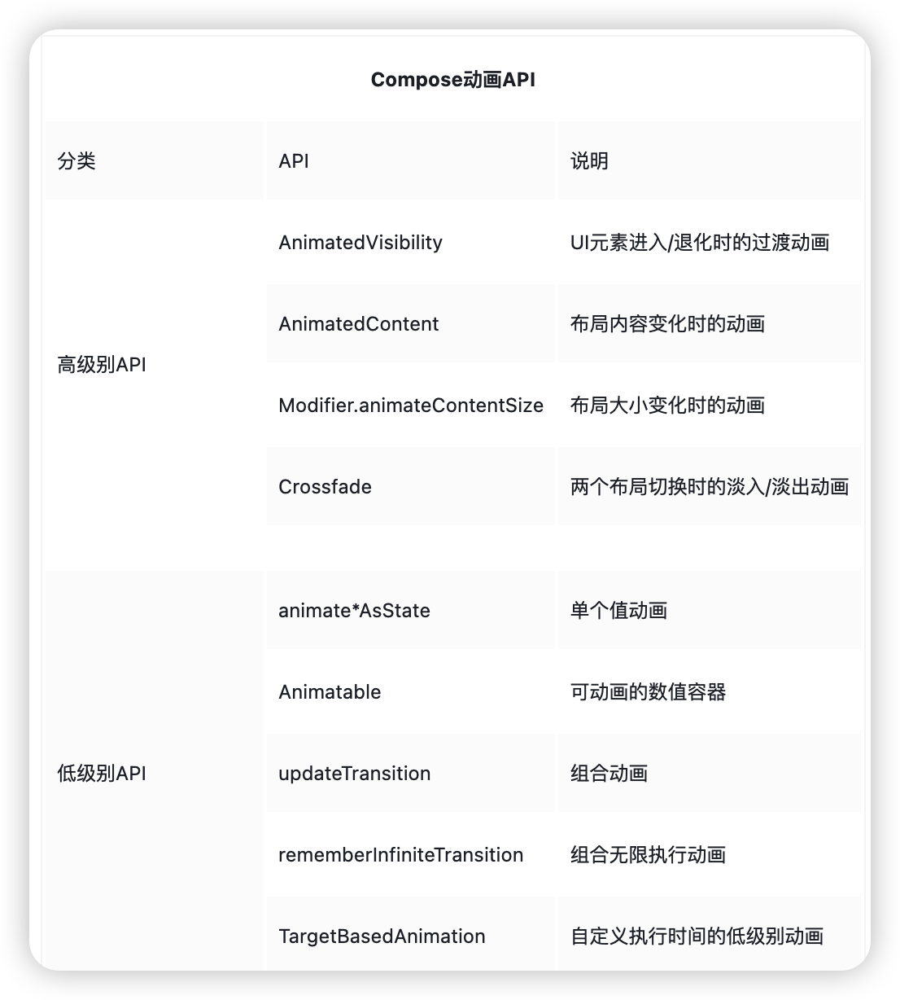
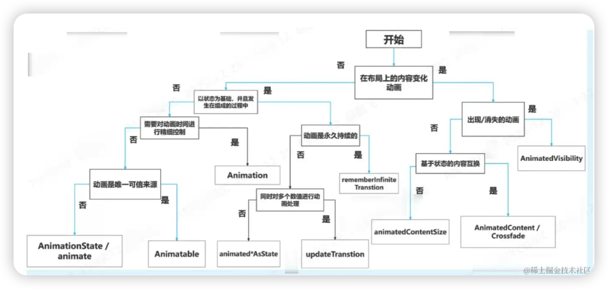
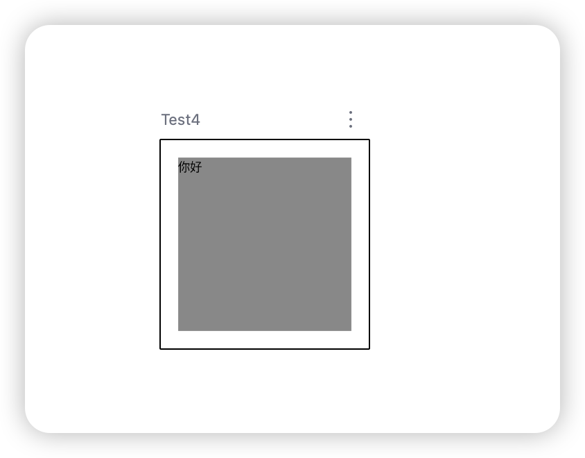
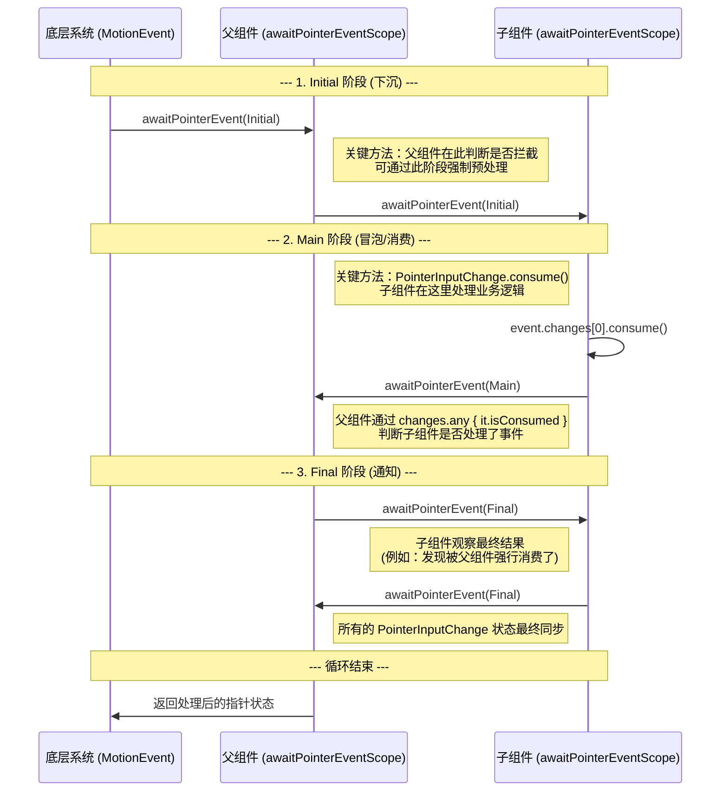

# Jetpack Compose专项

```kotlin
// 简单记忆：
"Dp 是设计师的单位，Float 是程序员的像素"
"Int 是像素的整数，转换需要 Density 帮忙"

// 实用规则：
1. UI 布局用 Dp（确保不同设备一致）
2. 绘制动画用 Float（像素值，支持子像素）
3. 图像处理用 Int（像素精确）
4. 相互转换时，记得 LocalDensity.current
```

Compose订阅原理，智能重组，Modifier，Coding算法

- Compose 如何将布局性能从指数级优化为线性级
    
    传统的 Android View 系统在布局测量上存在严重的性能缺陷，其复杂度随布局深度呈**指数级**增长。而 Jetpack Compose 通过其创新的“固有特性测量”和“单次/多次测量约束”机制，成功地将复杂度降低为**线性级**，这是其高性能的关键原因之一。
    
    ### **对比分析**
    
    | 特性 | 传统 View 系统 | Jetpack Compose |
    | --- | --- | --- |
    | **测量机制** | **父子递归测量**：父节点测量子节点时，会先询问子节点的尺寸，子节点可能又会询问其子节点，这个过程可能发生多次。 | **智能单次/多次测量**：在绝大多数情况下，布局只测量其子级一次。通过“固有特性查询”预先收集信息，避免了递归测量。 |
    | **叶子组件测量次数** | **指数级增长** 
    一个深度为 `d` 的布局树，其叶子节点（最内层的View）在最坏情况下会被测量 **2^(d-1)** 次。 | **恒定 2 次** 
    得益于**固有特性查询** + **正式测量**的两步流程，无论布局多深，叶子组件最多只被测量 **2** 次。 |
    | **算法复杂度** | **指数级 O(n × 2^(d-1))**
    `n`：节点总数
    `d`：布局树深度
    深度增加会导致测量次数爆炸式增长。 | **线性级 O(n)** 
    `n`：节点总数
    测量次数与节点总数成正比，与布局深度无关，性能可预测且稳定。 |
    | **性能影响** | 布局深度过大时，会导致严重的性能瓶颈和UI卡顿。 | 能够高效处理复杂和深层级的UI，保证了流畅的渲染体验。 |
- Compose模块层级结构图：
    
    ```mermaid
    flowchart TD
        Material3[compose.material3<br/>Material Design 3 组件库] --> Foundation
        
        Foundation[compose.foundation<br/>基础组件和设计系统构建块] --> Animation
        
        Animation[compose.animation<br/>完整的动画系统] --> UI
        
        UI[compose.ui<br/>UI核心组件：布局、绘制、输入] --> Runtime[compose.runtime<br/>编程模型和状态管理]
    ```
    
- 使用Android Studio的Layout Inspector查看Compose 的Column，发现它显示的顺序是逆序的(手机界面的显示的顺序相反)
    
    这是一个非常有趣的观察！你发现的是 Android Studio Layout Inspector 在处理 Compose UI 时的一个**显示特性**，并不是实际的布局顺序问题。
    
    ## 为什么会这样？
    
    ### 1. **渲染顺序 vs. 显示顺序**
    
    - **Column 的实际布局顺序**：从顶部到底部依次排列子项
    - **Layout Inspector 中的显示顺序**：可能由于渲染树的遍历方式，子项以**相反的顺序**显示在树状结构中
    
    ### 2. **技术原因**
    
    Compose 的布局系统使用了一个**修改器链（Modifier Chain）**，Layout Inspector 在解析这个链时，可能会以从内到外（从子到父）的方式显示，导致视觉上的逆序。
    
    ## 如何验证实际布局顺序？
    
    ### 方法1：使用 Compose 预览
    
    ```kotlin
    @Preview
    @Composable
    fun TestColumnOrder() {
        Column {
            Text("第一个 - 顶部")
            Text("第二个 - 中部")
            Text("第三个 - 底部")
        }
    }
    
    ```
    
    实际显示效果会是正常的从上到下顺序。
    
    ### 方法2：添加背景色区分
    
    ```kotlin
    @Composable
    fun VisualColumnOrder() {
        Column {
            Box(
                modifier = Modifier
                    .background(Color.Red)
                    .height(50.dp)
                    .fillMaxWidth()
            ) {
                Text("第一项")
            }
    
            Box(
                modifier = Modifier
                    .background(Color.Green)
                    .height(50.dp)
                    .fillMaxWidth()
            ) {
                Text("第二项")
            }
    
            Box(
                modifier = Modifier
                    .background(Color.Blue)
                    .height(50.dp)
                    .fillMaxWidth()
            ) {
                Text("第三项")
            }
        }
    }
    
    ```
    
    ## 在 Layout Inspector 中的工作建议
    
    ### 1. **理解显示特性**
    
    - 知道这是工具显示方式的问题，不是代码问题
    - 实际运行时，Column 的顺序是正确的
    
    ### 2. **使用标识符**
    
    ```kotlin
    Column {
        Text(
            text = "Item 1",
            modifier = Modifier.testTag("column_item_1")
        )
        Text(
            text = "Item 2",
            modifier = Modifier.testTag("column_item_2")
        )
    }
    
    ```
    
    ### 3. **调试布局边界**
    
    启用布局边界查看实际渲染：
    
    ```kotlin
    Column(
        modifier = Modifier.border(2.dp, Color.Red)
    ) {
        // 子项...
    }
    
    ```
    
    ## 验证示例
    
    创建一个简单的测试：
    
    ```kotlin
    @Composable
    fun DebugColumnOrder() {
        Column(
            modifier = Modifier.padding(16.dp)
        ) {
            repeat(3) { index ->
                Text(
                    text = "Item ${index + 1}",
                    modifier = Modifier
                        .padding(vertical = 8.dp)
                        .border(1.dp, Color.Gray)
                        .padding(8.dp)
                )
            }
        }
    }
    
    ```
    
    **实际效果**：界面上会正确显示 Item 1、Item 2、Item 3 从上到下的顺序。
    
    ## 总结
    
    1. **这不是 bug**：只是 Layout Inspector 的显示方式
    2. **不影响实际运行**：Column 的布局逻辑是正确的
    3. **开发时注意**：
        - 如果需要在 Layout Inspector 中查找特定元素，可能需要从底部开始找
        - 使用有意义的测试标签和语义属性
        - 通过预览功能验证布局顺序
    
    这个现象也提醒我们，工具虽然有用，但有时会以非直观的方式展示信息。重要的是理解背后的实际工作原理。
    

**是的，稳定类型确实可能导致"假阳性"重组**（引用不同但内容相同）。

**`mutableStateOf` 依赖编译时的值比较，`mutableStateListOf` 依赖运行时的观察者通知。**

[Compose 智能重组：编译器视角下的黑科技](https://mp.weixin.qq.com/s/yCqkGNPfngHGUx9BlhGFdQ)

- Compose 编译器如何判断 CartItem 的稳定性
    
    让我深入揭示 Compose 编译器内部的稳定性推断机制。这是一个**编译时分析**过程，不是运行时判断。
    
    ## 一、稳定性推断的三个阶段
    
    ### 阶段1：**类型稳定性分析**
    
    ```kotlin
    data class CartItem(
        val id: String,      // ← 编译器检查这个类型
        val name: String,    // ← 检查这个类型
        val quantity: Int,   // ← 检查这个类型
        val price: Double    // ← 检查这个类型
    )
    
    ```
    
    编译器对每个属性类型进行**类型稳定性分类**：
    
    | 类型 | 稳定等级 | 原因 |
    | --- | --- | --- |
    | `String` | ✅ **稳定** | Kotlin 标准库保证不可变 |
    | `Int` | ✅ **稳定** | 基本类型，不可变 |
    | `Double` | ✅ **稳定** | 基本类型，不可变 |
    | `List<T>` | ⚠️ **取决于 T** | 接口是只读的，但实现可能可变 |
    | `MutableList<T>` | ❌ **不稳定** | 明确可变 |
    | `var 属性` | ⚠️ **可能不稳定** | 取决于使用方式 |
    
    ### 阶段2：**属性访问分析**
    
    编译器检查每个属性是如何被访问的：
    
    ```kotlin
    // 编译器看到你的代码：
    class Example {
        val cartItem = CartItem(...)
    
        fun example() {
            // 读取属性 ✅ 稳定
            val name = cartItem.name
    
            // 修改属性 ❌（但这里编译错误，因为是val）
            // cartItem.name = "new"
        }
    }
    
    // 编译器分析：
    // - 所有属性都是 val → 只能读取，不能写入
    // - 读取操作是稳定的
    
    ```
    
    ### 阶段3：**使用上下文分析**
    
    编译器分析 `CartItem` 在 Composable 函数中如何被使用：
    
    ```kotlin
    @Composable
    fun CartItemRow(item: CartItem) {  // ← 参数类型分析
        // 编译器追踪 item 的所有使用
        Text(text = item.name)          // ← 读取 name
        Text(text = "数量: ${item.quantity}") // ← 读取 quantity
        // item.quantity++  // ← 如果有这行，会改变推断结果！
    }
    
    ```
    
    ## 二、编译器的具体推断逻辑
    
    ### 代码示例和编译器视角：
    
    ```kotlin
    // 你写的代码：
    data class CartItem(
        val id: String,
        val name: String,
        val quantity: Int,
        val price: Double
    )
    
    // 编译器内部的推断过程（伪代码）：
    fun inferStability(cartItemClass: ClassMetadata): StabilityResult {
        // 1. 检查类修饰符
        if (cartItemClass.isDataClass) {
            // 数据类 → 可能稳定
        }
    
        // 2. 检查所有属性
        for (property in cartItemClass.properties) {
            when {
                // 规则1：var 属性 → 默认不稳定
                property.isVar -> return Unstable("有 var 属性: ${property.name}")
    
                // 规则2：val + 不可变类型 → 稳定
                property.type.isImmutable -> continue
    
                // 规则3：val + 未知类型 → 需要进一步分析
                else -> {
                    // 递归分析该类型的稳定性
                    val typeStability = inferStability(property.type)
                    if (!typeStability.isStable) {
                        return Unstable("属性 ${property.name} 类型不稳定")
                    }
                }
            }
        }
    
        // 3. 检查 equals/hashCode
        if (cartItemClass.hasCustomEqualsOrHashCode) {
            // 检查是否基于稳定属性
            val equalsProperties = analyzeEqualsHashCode(cartItemClass)
            if (!equalsProperties.all { it.isStable }) {
                return Unstable("equals/hashCode 基于不稳定属性")
            }
        }
    
        return Stable("所有属性都是稳定的不可变类型")
    }
    
    ```
    
    ## 三、编译器如何知道哪些类型是"稳定"的？
    
    ### Compose 编译器的已知稳定类型列表：
    
    ```kotlin
    // 这些是编译器内置知道的稳定类型：
    object KnownStableTypes {
        // 1. 所有基本类型
        val primitives = setOf(
            "Int", "Long", "Float", "Double",
            "Boolean", "Char", "Byte", "Short"
        )
    
        // 2. 标准库不可变类型
        val stdlibImmutable = setOf(
            "String",  // 最重要！
            "Unit", "Nothing"
        )
    
        // 3. 函数类型（如果参数也稳定）
        val functionTypes = setOf(
            "Function0", "Function1", "Function2", // ...
        )
    
        // 4. 其他 Compose 类型
        val composeTypes = setOf(
            "Color", "Dp", "TextUnit", // ...
        )
    }
    
    ```
    
    ### 对于集合类型的特殊处理：
    
    ```kotlin
    // 编译器看到 List<String> 时的分析：
    val items: List<String>
    
    // 分析过程：
    // 1. List 是接口，不是具体类
    // 2. List 的读操作是稳定的
    // 3. 但实际运行时可能是 MutableList
    // 4. 保守推断：如果不确定 → 认为不稳定
    
    // 但如果用不可变集合：
    val items: ImmutableList<String>  // 来自 kotlinx.collections.immutable
    
    // 编译器：
    // 1. 这是明确的不可变集合类型
    // 2. ✅ 推断为稳定
    
    ```
    
    ## 四、实际编译过程：查看编译器报告
    
    ### 1. 启用详细报告：
    
    ```
    // app/build.gradle.kts
    android {
        kotlinOptions {
            freeCompilerArgs += listOf(
                "-P",
                "plugin:androidx.compose.compiler.plugins.kotlin:reportsDestination=${project.buildDir}/compose_reports",
                "-P",
                "plugin:androidx.compose.compiler.plugins.kotlin:metricsDestination=${project.buildDir}/compose_metrics"
            )
        }
    }
    
    ```
    
    ### 2. 编译后查看报告：
    
    ```
    build/compose_reports/
    ├── module.json                # 模块级别报告
    ├── package-name/
    │   ├── ComposableClassName.html
    │   └── ComposableClassName.txt
    
    ```
    
    ### 3. 报告内容示例：
    
    ```
    # CartItem 的稳定性报告
    
    Restartable scheme:
      CartItemRow(item: CartItem) [restartable]
    
      Parameters:
        item: CartItem
          Stable: Yes
          Reason: All properties are stable/immutable
          Properties:
            - id: String (stable)
            - name: String (stable)
            - quantity: Int (stable)
            - price: Double (stable)
    
      Skippable: Yes  # ✅ 重要！可跳过重组
      Arguments:
        item: stable
    
    ```
    
    ## 五、对比：有 var 和 全 val 的不同推断
    
    ### 情况A：全 val（稳定）
    
    ```kotlin
    data class CartItem(
        val id: String,
        val name: String,
        val quantity: Int,  // ← val
        val price: Double
    )
    
    // 编译器生成代码（简化版）：
    @Composable
    fun CartItemRow(item: CartItem, composer: Composer) {
        // 稳定性检查代码：
        if (!composer.changed(item)) {  // ← 引用检查！
            // 跳过重组，因为 item 引用没变
            return
        }
        // 继续执行重组...
    }
    
    ```
    
    ### 情况B：有 var（不稳定）
    
    ```kotlin
    data class CartItem(
        val id: String,
        val name: String,
        var quantity: Int,  // ← var！
        val price: Double
    )
    
    // 编译器生成代码（简化版）：
    @Composable
    fun CartItemRow(item: CartItem, composer: Composer) {
        // 稳定性检查代码：
        if (!composer.changed(item)) {
            // 即使引用没变，但因为 item 可能内部改变了
            // 需要深度比较所有属性！
            if (!composer.changed(item.id) &&
                !composer.changed(item.name) &&
                !composer.changed(item.quantity) &&  // ← 额外检查！
                !composer.changed(item.price)) {
                // 只有所有属性都没变才跳过
                return
            }
        }
        // 继续执行重组...
    }
    
    ```
    
    ## 六、编译器如何知道"var 可能被修改"？
    
    ### 数据流分析：
    
    ```kotlin
    // 编译器追踪 var 的使用
    class Example {
        var counter = 0
    
        fun increment() {
            counter++  // ← 写操作
        }
    
        fun get(): Int {
            return counter  // ← 读操作
        }
    }
    
    // 编译器分析：
    // 1. counter 是 var → 可能被修改
    // 2. 找到所有写操作的位置
    // 3. 分析哪些函数可能调用这些写操作
    // 4. 如果写操作可能从外部调用 → 类型不稳定
    
    ```
    
    ### 对于 `CartItem`：
    
    ```kotlin
    data class CartItem(
        val id: String,
        var quantity: Int  // ← var
    )
    
    // 即使你从不在 CartItem 内部修改 quantity
    // 编译器也无法保证外部不会修改：
    
    fun someFunction(item: CartItem) {
        item.quantity = 999  // ← 完全合法，因为 quantity 是 public var
    }
    
    // 所以编译器必须保守假设：var 可能在任何地方被修改
    
    ```
    
    ## 七、如何让编译器"信任" var 属性？
    
    ### 方法1：使用 `@Stable` 注解（给编译器承诺）
    
    ```kotlin
    @Stable  // ← 告诉编译器："相信我，这个类是稳定的"
    data class CartItem(
        val id: String,
        var quantity: Int  // ← 仍然是 var
    ) {
        // 你的承诺：quantity 变化时会通过正确机制通知 Compose
        // 比如在修改时使用 mutableStateOf 包装
    }
    
    // 编译器："既然你用了 @Stable，我相信你"
    // 生成优化后的代码（引用检查而不是深度检查）
    
    ```
    
    ### 方法2：使用 `mutableStateOf` 包装
    
    ```kotlin
    // 不是用 var，而是用 State
    class CartItemState(
        val id: String,
        quantity: Int
    ) {
        var quantity by mutableStateOf(quantity)
        // 现在编译器知道：quantity 的变化是可观察的
    }
    
    // Compose 能追踪 mutableStateOf 的变化
    
    ```
    
    ## 八、实际调试：查看生成的代码
    
    ### 使用 Kotlin 元编程查看：
    
    ```kotlin
    // 安装 Compose 编译器插件源码，查看内部
    fun debugComposeCompiler() {
        // 实际上编译器会生成类似这样的代码：
    
        // 对于稳定类型：
        // if (!composer.changed(item)) return
    
        // 对于不稳定类型：
        // if (!composer.changed(item) &&
        //     !composer.changed(item.id) &&
        //     !composer.changed(item.name) &&
        //     ... ) return
    }
    
    ```
    
    ## 九、总结：Compose 的判断流程
    
    ```
    Compose 编译器判断 CartItem 稳定性的流程：
    
    开始
      ↓
    检查类是否有 @Stable/@Immutable 注解
      ↓
    检查是否数据类（data class）
      ↓
    遍历所有属性：
      ├─ 是 var 属性？ → ❌ 标记为"可能不稳定"
      ├─ 是 val 属性？ → 继续检查类型
      │   ├─ 类型是已知稳定类型？ → ✅ 稳定
      │   ├─ 类型需要递归分析 → 分析该类型
      │   └─ 类型不确定 → ⚠️ 保守认为不稳定
      └─ 所有属性检查完成
      ↓
    检查 equals/hashCode 实现
      ↓
    综合评估：
      ├─ 所有属性都稳定 → ✅ 稳定
      ├─ 有 var 属性 → ❌ 不稳定（除非有 @Stable）
      └─ 有不稳定类型属性 → ❌ 不稳定
      ↓
    生成相应的优化代码
    
    ```
    
    **关键点**：
    
    1. 编译器**静态分析**代码，不是运行时判断
    2. `var` 属性**默认被认为不稳定**（保守原则）
    3. 基本类型和 `String` **默认稳定**
    4. `@Stable` 注解是**开发者的承诺**，编译器信任这个承诺
    5. 稳定性影响**生成的代码**，决定如何检查变化
    
    所以回到你的问题：**全 `val` 的 `CartItem` 确实会被 Compose 认为是稳定的**，因为编译器可以静态分析出所有属性都是不可变的已知稳定类型。
    
- 不稳定带来的性能问题
    1. 检查成本增加 n倍
    
    ```kotlin
    // 稳定的检查成本：1次引用比较（===操作，纳秒级）
    fun CartItemRow(item: CartItem, composer: Composer, changed: Int) {
        // 关键：只检查 item 的引用是否变化
        if (composer.changed(changed, 0b0001, item)) {
            // item 引用变了 → 执行重组
            Text("数量: ${item.quantity}")
        } else {
            // item 引用没变 → 跳过整个函数！
            // 因为知道 item 不可变，所以内容肯定没变
            return
        }
    }
    
    // 不稳定的检查成本：5次深度比较（4个属性 + 1个对象引用）
    fun CartItemRow(item: CartItem, composer: Composer, changed: Int) {
        // 第一步：先检查引用
        val itemChanged = composer.changed(changed, 0b0001, item)
        
        // 即使引用没变，还需要检查内部属性！
        val idChanged = composer.changed(changed, 0b0010, item.id)
        val nameChanged = composer.changed(changed, 0b0100, item.name)
        val quantityChanged = composer.changed(changed, 0b1000, item.quantity)
        val priceChanged = composer.changed(changed, 0b10000, item.price)
        
        // 只有所有检查都为 false 才能跳过
        if (itemChanged || idChanged || nameChanged || quantityChanged || priceChanged) {
            // 任何一个属性可能变了 → 必须执行重组
            Text("数量: ${item.quantity}")
        } else {
            // 所有属性都没变 → 可以跳过
            return
        }
    }
    ```
    
    1. 无效重组的连锁反应
    
    ```kotlin
    @Composable
    fun CartScreen(items: List<CartItem>) {
        LazyColumn {
            items(items) { item ->
                CartItemRow(item)
            }
        }
    }
    
    // 假设修改第1个商品的 quantity:
    items[0].quantity++
    
    // 编译器不知道哪个 item 变了，它看到的是：
    // 1. items 列表引用没变
    // 2. 但每个 CartItem 都可能内部改变（因为有 var）
    
    // 结果：100 个 CartItemRow 都需要检查！
    // 每个检查 5 次比较 → 500 次比较
    // 即使只有第1个商品实际变了
    ```
    

在 Compose First 的架构中，确实**不推荐**重写 `onConfigurationChanged` 或在 Manifest 中配置 `configChanges`。

- Compose 本身就是为声明式 UI 设计，能够自动响应状态变化
- 配置变更时，Compose 会自动重组，保持 UI 与状态同步

---

- Compose 动画API架构和分类
    - 简易动画API架构图
        
        ```mermaid
        graph TD
            
            L3[高级动画API<br/>animateContentSize AnimatedVisibility AnimatedContent]
            L2[中级动画API<br/>animate*AsState updateTransition]
            L1[低级动画API<br/>Animatable]
            L0[最底层API<br/>TargetBasedAnimation]
            
            L3 --> L2
            L2 --> L1
            L1 --> L0
            
            class L3 layer3
            class L2 layer2
            class L1 layer1
            class L0 layer0
        ```
        
    - 动画API介绍
        
        
        
    - 动画API决策树
        
        
        
- 高级动画API
    - **1. animateContentSize - 最轻量、最简单 ✅**
        
        **最佳场景**：单个元素大小变化的平滑过渡
        
        ```kotlin
        Column {
            var expanded by remember { mutableStateOf(false) }
            Text(
                text = "Hello World",
                modifier = Modifier
                    .animateContentSize()  // 文本变化时平滑过渡
                    .clickable { expanded = !expanded }
            )
        }
        ```
        
        **优点**：
        
        - 性能最好，几乎无开销
        - API最简单，一个modifier搞定
        - 适合布局大小变化的微交互
    - **2. AnimatedVisibility - 显示/隐藏动画专家 🎯**
        
        **最佳场景**：元素的进入/退出动画
        
        ```kotlin
        AnimatedVisibility(
            visible = isVisible,
            enter = fadeIn() + slideInHorizontally(),
            exit = fadeOut() + slideOutVertically()
        ) {
            // 内容
        }
        ```
        
        **深度定制能力**：
        
        ```kotlin
        AnimatedVisibility(
            visible = isExpanded,
            enter = slideInVertically(
                initialOffsetY = { fullHeight -> -fullHeight }
            ) + fadeIn(),
            exit = slideOutVertically(
                targetOffsetY = { fullHeight -> -fullHeight }
            ) + fadeOut(),
            modifier = Modifier.fillMaxWidth()
        ) {
            // 复杂内容
        }
        ```
        
    - **3. AnimatedContent - 状态切换动画大师 🔄**
        
        **最佳场景**：不同内容状态之间的切换
        
        ```kotlin
        var count by remember { mutableStateOf(0) }
        AnimatedContent(
            targetState = count,
            label = "counter animation"
        ) { targetCount ->
            // 根据不同的count值显示不同UI
            when (targetCount % 3) {
                0 -> Text("状态A")
                1 -> Icon(Icons.Default.Favorite, "状态B")
                2 -> Button({}) { Text("状态C") }
            }
        }
        ```
        
    - **📊 选择决策树**
        
        ```mermaid
        graph TD
            A[需要什么动画效果?] --> B{元素大小变化?}
            B -->|是| C[使用 animateContentSize]
            B -->|否| D{显示/隐藏动画?}
            D -->|是| E[使用 AnimatedVisibility]
            D -->|否| F{不同内容切换?}
            F -->|是| G[使用 AnimatedContent]
            F -->|否| H[考虑基础动画API]
        ```
        
    - **🎯 实际应用示例**
        
        ### **场景1：可展开卡片（推荐用 animateContentSize）**
        
        ```kotlin
        @Composable
        fun ExpandableCard() {
            var expanded by remember { mutableStateOf(false) }
        
            Card(
                modifier = Modifier
                    .fillMaxWidth()
                    .animateContentSize()  // 最轻量的解决方案
                    .clickable { expanded = !expanded }
            ) {
                Column {
                    Text("标题")
                    if (expanded) {
                        Text("详细内容...", modifier = Modifier.padding(top = 8.dp))
                    }
                }
            }
        }
        ```
        
        ### **场景2：加载状态切换（推荐用 AnimatedContent）**
        
        ```kotlin
        @Composable
        fun LoadingState(isLoading: Boolean) {
            AnimatedContent(
                targetState = isLoading,
                transitionSpec = {
                    fadeIn() with fadeOut()
                }
            ) { loading ->
                if (loading) {
                    CircularProgressIndicator()
                } else {
                    Text("加载完成")
                }
            }
        }
        ```
        
        ### **场景3：复杂进出动画（推荐用 AnimatedVisibility）**
        
        ```kotlin
        @Composable
        fun ComplexAnimation(isVisible: Boolean) {
            AnimatedVisibility(
                visible = isVisible,
                enter = slideInVertically() + fadeIn(),
                exit = slideOutHorizontally() + fadeOut(),
            ) {
                // 复杂布局
            }
        }
        ```
        
    - animateContentSize()工作原理
        
        **确实 animateContentSize() 函数本身没有直接引用 expend状态。它们之间的联系是通过状态驱动的UI重组机制实现的。**
        
        ```kotlin
        //expend状态 → maxLines参数 → Text组件尺寸 → Box容器尺寸 → animateContentSize                                                           
        Box(                                                                                                         
            Modifier                                                                                                 
                .background(Color.LightGray)                                                                         
                .animateContentSize() // 监听子组件的尺寸变化                                                        
        ) {                                                                                                          
            Text(                                                                                                    
                // 当 expend 变化时，maxLines 改变，导致 Text 尺寸变化                                               
                maxLines = if (expend) Int.MAX_VALUE else 2                                                          
            )                                                                                                        
        }          
        ```
        
        **工作原理：**
        
        1. 状态变化触发重组：当用户点击按钮时，expend 状态从 false 变为 true（或相反）
        2. Compose 重新执行：Compose 会重新执行 @Composable 函数，使用新的状态值
        3. 子组件尺寸改变：由于 expend 状态改变，Text 组件的 maxLines 参数发生变化
        4. animateContentSize 检测变化：animateContentSize 修饰符检测到其子组件（Box）的尺寸发生了变化
        5. 平滑动画过渡：animateContentSize 在尺寸变化时插入动画，使变化过程平滑
    - animateContentSize和AnimatedContent的SizeTransform区别
        - 演示如何使用animateContentSize实现平滑的展开/收起动画
            
            ```kotlin
            
            @Preview
            @Composable
            private fun AnimateContentSize() {
                // 记住展开/收起状态
                var expanded by remember { mutableStateOf(false) }
            
                Column(
                    modifier = Modifier
                        .fillMaxWidth()
                        .background(Color(0xFFF5F5F5))
                        .animateContentSize(
                            animationSpec = spring(
                                dampingRatio = Spring.DampingRatioMediumBouncy,
                                stiffness = Spring.StiffnessLow,
                            )
                        )
                        .clickable { expanded = !expanded }
                        .padding(16.dp)) {
                    Text(
                        text = if (expanded) "▼ 点击收起" else "▶ 点击展开",
                        fontWeight = FontWeight.Bold,
                        color = Color(0xFF333333)
                    )
                    // 展开时显示的详细内容
                    if (expanded) {
                        Text(
                            text = "这是详细内容...", color = Color(0xFF666666)
                        )
                        Text(
                            text = "• 第一项信息",
                            modifier = Modifier.padding(top = 8.dp),
                            color = Color(0xFF666666)
                        )
                        Text(
                            text = "• 第二项信息",
                            modifier = Modifier.padding(top = 4.dp),
                            color = Color(0xFF666666)
                        )
                        Text(
                            text = "• 第三项信息",
                            modifier = Modifier.padding(top = 4.dp),
                            color = Color(0xFF666666)
                        )
                    }
                }
            }
            ```
            
        - 演示如何使用AnimatedContent实现流畅的展开/收起动画
            
            ```kotlin
            @Preview
            @Composable
            private fun AnimatedContentSample() {
                var expanded by remember { mutableStateOf(false) }
                val color = if (expanded) Color(0xFFE3F2FD) else Color(0xFFF5F5F5)
                AnimatedContent(
                    targetState = expanded,
                    modifier = Modifier
                        .fillMaxWidth()
                        .background(
                            color = color, shape = RoundedCornerShape(12.dp)
                        )
                        .clickable { expanded = !expanded }
                        .padding(16.dp),
                    transitionSpec = {
                        fadeIn(
                            animationSpec = tween(300, 150)
                        ).togetherWith(
                            fadeOut(
                                animationSpec = tween(150)
                            )
                        ).using(
                            SizeTransform { initialSize: IntSize, targetSize: IntSize ->
                                // 使用弹簧动画使尺寸变化更自然
                                spring(
                                    dampingRatio = Spring.DampingRatioMediumBouncy,
                                    stiffness = Spring.StiffnessMediumLow
                                )
                            },
                        )
                    },
                    label = "高级动画示例",
                ) { targetExpanded ->
                    Column {
                        Text(
                            text = if (targetExpanded) "Spring 动画" else "点击展开",
                            fontWeight = FontWeight.Bold,
                            color = Color(0xFF333333)
                        )
            
                        if (targetExpanded) {
                            Column(modifier = Modifier.padding(top = 12.dp)) {
                                Text(
                                    text = "• 使用 spring 实现流畅的尺寸变化", color = Color(0xFF666666)
                                )
                                Text(
                                    text = "• MediumBouncy 阻尼比提供适度的弹跳效果",
                                    modifier = Modifier.padding(top = 4.dp),
                                    color = Color(0xFF666666)
                                )
                                Text(
                                    text = "• MediumLow 刚度使动画更柔和自然",
                                    modifier = Modifier.padding(top = 4.dp),
                                    color = Color(0xFF666666)
                                )
                            }
                        }
                    }
                }
            }
            ```
            
    
    Crossfade可以理解为AnimatedContent的一种功能特性，它使用起来更简单，如果只需要淡入淡出效果，可以使用Crossfade替代AnimatedContent。
    
- 中级动画API
    
    `updateTransition`是中级别动画API中的一类。`animate*AsState`是针对单个目标值的动画，而Transition可以面向多个目标值应用动画并保持它们同步结束。Transition的作用更像是传统视图体系动画中的AnimationSet。
    
    - `updateTransition` **-** 状态驱动
        
        ```kotlin
        @Preview
        @Composable
        private fun SwitchBlockPrev() {
            SwitchBlock()
        }
        
        /**
         * 开关状态
         */
        sealed class SwitchState {
            /**
             * 打开状态
             */
            data object OPEN : SwitchState()
        
            /**
             * 关闭状态
             */
            data object CLOSE : SwitchState()
        }
        
        @Composable
        fun SwitchBlock(modifier: Modifier = Modifier) {
            var selectedState: SwitchState by remember { mutableStateOf(SwitchState.CLOSE) }
            val transition = updateTransition(selectedState)
            val selectBarPadding by transition.animateDp(
                transitionSpec = {
                    tween(durationMillis = 1000)
                },
            ) {
                when (it) {
                    SwitchState.CLOSE -> 40.dp
                    SwitchState.OPEN -> 0.dp
                }
            }
            val textAlpha by transition.animateFloat(
                transitionSpec = {
                    tween(1000)
                },
            ) {
                when (it) {
                    SwitchState.CLOSE -> 1f
                    SwitchState.OPEN -> 0f
                }
            }
            Box(
                modifier = Modifier
                    .size(150.dp)
                    .padding(8.dp)
                    .clip(RoundedCornerShape(10.dp))
                    .clickable(
                        {
                            selectedState = if (selectedState == SwitchState.OPEN) {
                                SwitchState.CLOSE
                            } else {
                                SwitchState.OPEN
                            }
                        },
                    ),
            ) {
                Text(
                    text = "点我",
                    fontSize = 32.sp,
                    fontWeight = FontWeight.W900,
                    color = Color.White,
                    modifier = Modifier
                        .align(alignment = Alignment.Center)
                        .alpha(textAlpha),
                )
                Box(
                    modifier = Modifier
                        .align(Alignment.BottomCenter)
                        .fillMaxWidth()
                        .height(40.dp)
                        .padding(top = selectBarPadding)
                        .background(color = Color.Gray),
                ) {
                    Row(
                        modifier = Modifier
                            .align(Alignment.Center)
                            .alpha(1 - textAlpha),
                        verticalAlignment = Alignment.CenterVertically
                    ) {
                        Icon(
                            imageVector = Icons.Default.Star, contentDescription = null
                        )
                        Spacer(modifier = Modifier.width(2.dp))
                        Text(
                            text = "已选择",
                            fontSize = 20.sp,
                            fontWeight = FontWeight.W900,
                            color = Color.White,
                        )
                    }
                }
            }
        
        }
        ```
        
    - `updateTransition`-封装复用
        
        ```kotlin
        enum class BoxState {
            Collapsed, Expanded
        }
        
        private class TransitionData(
            color: State<Color>,
            size: State<Dp>
        ) {
            val color by color
            val size by size
        }
        
        @Composable
        private fun updateTransitionData(boxState: BoxState): TransitionData {
            val transition = updateTransition(boxState)
            val color = transition.animateColor {
                when (it) {
                    BoxState.Collapsed -> Color.Gray
                    BoxState.Expanded -> Color.Red
                }
            }
            val size = transition.animateDp {
                when (it) {
                    BoxState.Collapsed -> 64.dp
                    BoxState.Expanded -> 128.dp
                }
            }
            return remember(transition) {
                TransitionData(color, size)
            }
        }
        
        @Composable
        fun AnimationBox(boxState: BoxState) {
            val transitionData = updateTransitionData(boxState)
            Box(
                modifier = Modifier
                    .background(transitionData.color)
                    .size(transitionData.size)
            )
        }
        ```
        
    - `rememberInfiniteTransition` **-** 时间驱动
        
        ```kotlin
        @Preview
        @Composable
        fun InfiniteColorAnimationDemo() {
            val infiniteTransition = rememberInfiniteTransition(label = "color")
            val color by infiniteTransition.animateColor(
                initialValue = Color.Red, // 初始值
                targetValue = Color.Green, // 最终值
                animationSpec = infiniteRepeatable(
                    animation = tween(
                        durationMillis = 1000,
                        easing = LinearEasing,
                    ),
                    repeatMode = RepeatMode.Reverse,
                ),
                label = "color",
            )
            Box(
                Modifier
                    .fillMaxSize()
                    .background(color)
            )
        }
        ```
        
    - `animate*AsState` 的例子
        - once动画
            
            ```kotlin
            @Composable
            fun ColorTransitionDemo() {
                var isFavorite by remember { mutableStateOf(false) }
                
                // 经典颜色动画
                val color by animateColorAsState(
                    targetValue = if (isFavorite) Color.Red else Color.Gray,
                    animationSpec = tween(durationMillis = 500)
                )
                
                Column(
                    horizontalAlignment = Alignment.CenterHorizontally,
                    modifier = Modifier.fillMaxSize().padding(16.dp)
                ) {
                    Icon(
                        imageVector = Icons.Default.Favorite,
                        contentDescription = "收藏",
                        tint = color, // 应用动画颜色
                        modifier = Modifier
                            .size(64.dp)
                            .clickable { isFavorite = !isFavorite }
                    )
                    
                    Text(
                        text = if (isFavorite) "已收藏" else "未收藏",
                        modifier = Modifier.padding(top = 8.dp)
                    )
                }
            }
            ```
            
        - repeatable循环动画.
            
            ```kotlin
            @Preview
            @Composable
            fun AnimateFloatAsStateDemo() {
                var target by remember { mutableStateOf(0f) }
                val value by animateFloatAsState(
                    targetValue = target,
                    animationSpec = repeatable(
                        iterations = 3,
                        animation = tween(durationMillis = 300),
                        repeatMode = RepeatMode.Reverse
                    ),
                    label = "float",
                )
            
                LaunchedEffect(Unit) {
                    target = 200f
                }
            
                Box(
                    Modifier
                        .fillMaxSize()
                        .background(Color.White)
                        .clickable { target = if (target == 0f) 200f else 0f },
                    contentAlignment = Alignment.Center
                ) {
                    Box(
                        Modifier
                            .size(value.dp)
                            .background(Color.Blue)
                    )
                }
            }
            ```
            
        - infiniteRepeatable无限动画
            
            ```kotlin
            @Preview
            @Composable
            fun AnimateFloatInfiniteDemo() {
                var target by remember { mutableStateOf(0f) }
                val value by animateFloatAsState(
                    targetValue = target,
                    animationSpec = infiniteRepeatable(
                        animation = tween(durationMillis = 300),
                        repeatMode = RepeatMode.Reverse
                    ),
                    label = "float",
                )
            
                LaunchedEffect(Unit) {
                    target = 100f
                }
            
                Box(
                    Modifier
                        .fillMaxSize()
                        .background(Color.White),
                    contentAlignment = Alignment.Center
                ) {
                    Box(
                        Modifier
                            .size(100.dp + value.dp)
                            .background(Color.Blue)
                    )
                }
            }
            ```
            
- 低级动画API
    
    **Animatable是一个数值包装器，它的animateTo方法可以根据数值的变化设置动画效果，animate*AsState背后就是基于Animatable实现的。**
    
    ```kotlin
    // 自定义 Dp 类型的 TwoWayConverter
    val DpVectorConverter = TwoWayConverter<Dp, AnimationVector1D>(
        convertToVector = { dp ->
            AnimationVector1D(dp.value)
        },
        convertFromVector = { vector ->
            Dp(vector.value)
        }
    )
    
    // 自定义 Color 类型的 TwoWayConverter
    val ColorVectorConverter = TwoWayConverter<Color, AnimationVector4D>(
        convertToVector = { color ->
            AnimationVector4D(color.red, color.green, color.blue, color.alpha)
        },
        convertFromVector = { vector ->
            Color(
                red = vector.v1,
                green = vector.v2,
                blue = vector.v3,
                alpha = vector.v4
            )
        }
    )
    
    @Preview
    @Composable
    fun AnimatableDemo() {
        var change by remember { mutableStateOf(false) }
        var flag by remember { mutableStateOf(false) }
    
        val buttonSizeVariable = remember { Animatable(24.dp, DpVectorConverter) }
        val buttonColorVariable = remember { Animatable(Color.Gray, ColorVectorConverter) }
    
        LaunchedEffect(change) {
            if (change) {
                buttonSizeVariable.animateTo(32.dp)
                buttonColorVariable.animateTo(Color.Red)
            } else {
                buttonSizeVariable.animateTo(24.dp)
                buttonColorVariable.animateTo(Color.Gray)
            }
        }
    
        LaunchedEffect(flag) {
            if (buttonSizeVariable.value == 32.dp) {
                change = false
            }
        }
    
        IconButton(
            onClick = {
                change = true
                flag = !flag
            }
        ) {
            Icon(
                Icons.Rounded.Favorite,
                contentDescription = null,
                modifier = Modifier.size(buttonSizeVariable.value),
                tint = buttonColorVariable.value
            )
        }
    }
    ```
    
- 最底层动画API
    
    TargetBasedAnimation
    

---

- DisposableEffect
    
    它在组合中执行需要清理的副作用，确保当效应离开组合或键发生变化时进行适当的资源清理。
    
    ```kotlin
    @Composable
    fun BroadcastReceiverExample() {
        val context = LocalContext.current
        var connectionState by remember { mutableStateOf(true) }
        
        DisposableEffect(context) {
            val connectivityReceiver = object : BroadcastReceiver() {
                override fun onReceive(context: Context?, intent: Intent?) {
                    connectionState = isNetworkAvailable(context)
                }
            }
            
            val filter = IntentFilter(ConnectivityManager.CONNECTIVITY_ACTION)
            context.registerReceiver(connectivityReceiver, filter)
            
            onDispose {
                context.unregisterReceiver(connectivityReceiver)
            }
        }
        
        Text(text = if (connectionState) "Connected" else "Disconnected")
    }
    ```
    
- SideEffect
    
    `SideEffect`的核心特点是 **在每次成功的重组（Recomposition）后执行一次** ，并且它执行的代码是非阻塞的。这使得它非常适合处理那些轻量级、不依赖协程且需要与 Compose 界面状态保持同步的场景。
    

---

- Modifier数据结构-右偏有序二叉树
    
    **具体示例的链表结构**
    
    ```kotlin
    // 代码示例：
    val modifier = Modifier
        .background(Color.Red)
        .padding(16.dp) 
        .background(Color.Blue)
        .size(100.dp)
    ```
    
    **outer/inner 关系示意图**
    
    ```mermaid
    graph TB
        A[CombinedModifier] --> B[outer: BackgroundModifier<br>Color.Red]
        A --> C[inner: CombinedModifier]
        
        C --> D[outer: PaddingModifier<br>16.dp]
        C --> E[inner: CombinedModifier]
        
        E --> F[outer: BackgroundModifier<br>Color.Blue]
        E --> G[inner: SizeModifier<br>100.dp]
        
        G --> H[Empty Modifier]
        
        %% 执行顺序标注
        I[执行顺序] --> J[1. Background Red]
        J --> K[2. Padding 16dp]
        K --> L[3. Background Blue]
        L --> M[4. Size 100dp]
        
        style A fill:#bbdefb
        style C fill:#bbdefb
        style E fill:#bbdefb
        style B fill:#ffcdd2
        style D fill:#fff9c4
        style F fill:#c8e6c9
        style G fill:#bbdefb
        style H fill:#f5f5f5
        style I fill:#1e88e5,color:white
    ```
    
    在 `foldIn` 中，遍历顺序是：**Red背景 → Padding → Blue背景 → Size**
    
    在 `foldOut` 中，遍历顺序是：**Size → Blue背景 → Padding → Red背景**
    
    ```kotlin
    // 使用 foldIn 验证顺序
    modifier.foldIn(initial = "Start") { acc, element ->
        "$acc → ${element::class.simpleName}"
    }
    // 结果: "Start → CombinedModifier → LayoutModifierElement → DrawModifierElement ..."
    
    // 使用 foldOut 验证顺序  
    modifier.foldOut(initial = "End") { element, acc ->
        "${element::class.simpleName} → $acc"
    }
    // 结果: "... → DrawModifierElement → LayoutModifierElement → CombinedModifier → End"
    ```
    
- Modifier的测量和布局流程
    
    具体示例的代码
    
    ```kotlin
    Box(modifier = Modifier
        .layout { measurable, constraints ->
            val placeable = measurable.measure(constraints)
            layout(placeable.width, placeable.height) {
                placeable.placeRelative(0, 0)
            }
        }
        .padding(20.dp)
        .size(200.dp)
        .background(Color.Gray)) {
        Text("你好")
    }
    ```
    
    详细测量阶段数据流、
    
    ```mermaid
    sequenceDiagram
        participant Layout as Layout 
        participant Padding as 🟨 .padding(20.dp)
        participant Size as 🟥 .size(200.dp)
        participant Background as 🟩 .background(Color.Gray)
        participant Core as 🟦 Core (Text)
    
        Note over Layout,Core: 📏 测量阶段 - 约束向下传递
        Layout->>Padding: 父约束 Constraints(200,200,200,200)
        Note right of Padding: 计算内边距<br>约束减去20dp<br>200→180
        Padding->>Size: 新约束 Constraints(180,180,180,180)
        Note right of Size: 强制固定尺寸<br>忽略输入约束<br>180→100
        Size->>Background: 固定约束 Constraints(100,100,100,100)
        Note right of Background: 仅影响绘制<br>不修改约束
        Background->>Core: 最终约束 Constraints(100,100,100,100)
        Note right of Core: 测量Text内容<br>确定实际尺寸
        
        Note over Layout,Core: 📐 布局阶段 - 尺寸向上返回
        Core-->>Background: Text尺寸 Placeable(100,100)
        Note right of Background: 添加灰色背景绘制<br>不修改尺寸
        Background-->>Size: 尺寸 Placeable(100,100)
        Note right of Size: 返回固定尺寸<br>100x100
        Size-->>Padding: 尺寸 Placeable(100,100)
        Note right of Padding: 添加外边距<br>100 + 20 + 20 = 120
        Padding-->>Layout: 最终尺寸 Placeable(120,120)
        Note right of Layout: 最终布局<br>120x120
    ```
    
    最终视觉效果
    
    
    
    ## 关键点总结
    
    1. **测量阶段**：严格的单向数据流
        - 📥 约束从外向内传递
        - 📤 尺寸从内向外返回
    2. **布局阶段**：位置指令从外向内传递
        - 🎯 父布局确定整体位置
        - 📍 每个修饰符计算内部偏移
    3. **严格分离**：测量完成后才进行布局，确保布局计算的确定性
    
    这个流程保证了 Compose 布局的高性能和可预测性，每个组件只测量一次，所有尺寸确定后才进行位置计算。
    
- 固有特性测量
    
    固有特性测量允许父组件在正式测量之前。
    
    1. 查询子组件的固有尺寸（如最小/最大宽高）
    2. 父组件使用这些信息来计算自身的布局策略(a、父组件决定自己的尺寸；
    b、父组件调整对子组件的约束)
    3. 然后进行正式的测量和布局
    
    ```mermaid
    sequenceDiagram
        participant P as Parent Layout
        participant L as Parent LayoutNode
        participant M as Child Measurable
        participant C as Child Component
    
        Note over P: 开始布局过程
        
        P->>L: 提供约束条件<br/>(min/max width/height)
        
        Note over L: 阶段1: 固有特性测量
        L->>M: minIntrinsicWidth(height)
        M->>C: 计算最小固有宽度
        C-->>M: 返回minIntrinsicWidth
        M-->>L: 收集所有子组件数据
        
        L->>M: minIntrinsicHeight(width)
        M->>C: 计算最小固有高度
        C-->>M: 返回minIntrinsicHeight
        M-->>L: 收集所有子组件数据
        
        Note over L: 阶段2: 正式测量
        L->>M: measure(constraints)
        M->>C: 应用约束进行测量
        C->>C: 计算实际尺寸
        C-->>M: 返回Placeable
        M-->>L: 返回测量结果
        
        Note over L: 阶段3: 布局
        L->>L: 计算最终位置
        L->>M: placeRelative(x, y)
        M->>C: 在指定位置绘制
        
        L-->>P: 返回最终尺寸和位置
    ```
    
    示例代码
    
    ```kotlin
    @Preview
    @Composable
    private fun IntrinsicRowPreview() {
        IntrinsicRow(
            modifier = Modifier.height(IntrinsicSize.Min)
        ) {
            Text("text1", fontSize = 16.sp)
            VerticalDivider(color = Color.Black, thickness = 2.dp)
            Text("text1", fontSize = 32.sp)
        }
    }
    
    @Composable
    fun IntrinsicRow(
        modifier: Modifier = Modifier,
        content: @Composable () -> Unit,
    ) {
        Layout(
            modifier = modifier, content = content,
            measurePolicy = object : MeasurePolicy {
                override fun IntrinsicMeasureScope.minIntrinsicHeight(
                    measurables: List<IntrinsicMeasurable>,
                    width: Int
                ): Int {
                    return measurables.maxOf {
                        it.minIntrinsicHeight(width)
                    }
                }
    
                override fun MeasureScope.measure(
                    measurables: List<Measurable>,
                    constraints: Constraints
                ): MeasureResult {
                    val placeables = measurables.map {
                        it.measure(constraints)
                    }
                    return layout(constraints.maxWidth, constraints.maxHeight) {
                        val totalWidth = constraints.maxWidth
                        placeables[0].placeRelative(0, 0)
                        val midX = (totalWidth - placeables[1].width) / 2
                        placeables[1].placeRelative(midX, 0)
                        val rightX = totalWidth - placeables[2].width
                        placeables[2].placeRelative(rightX, 0)
                    }
                }
            },
        )
    }
    ```
    
- SubcomposeLayout
    
    这就是 SubcomposeLayout 最经典的用法：根据可用空间动态决定显示什么内容。
    
    ```kotlin
    @Composable
    fun SmartText(
        text: String,
        modifier: Modifier = Modifier
    ) {
        SubcomposeLayout(modifier = modifier) { constraints ->
            // 先尝试测量完整文本
            val fullTextMeasurable = subcompose("full_text") {
                Text(text = text, maxLines = 1)
            }[0]
            val fullTextPlaceable = fullTextMeasurable.measure(constraints)
    
            // 如果完整文本放得下，就使用完整文本
            val finalPlaceable = if (fullTextPlaceable.width <= constraints.maxWidth) {
                fullTextPlaceable
            } else {
                // 放不下就显示截断版本
                val ellipsisMeasurable = subcompose("ellipsis_text") {
                    Text(text = "${text.take(5)}...", maxLines = 1)
                }[0]
                ellipsisMeasurable.measure(constraints)
            }
    
            layout(finalPlaceable.width, finalPlaceable.height) {
                finalPlaceable.placeRelative(0, 0)
            }
        }
    }
    ```
    
    ```kotlin
    @Composable
    fun SmartTextExample() {
        Column(
            modifier = Modifier.padding(16.dp), verticalArrangement = Arrangement.spacedBy(16.dp)
        ) {
            // 宽容器 - 显示完整文本
            Box(
                modifier = Modifier
                    .width(200.dp)
                    .background(Color.LightGray)
                    .padding(8.dp)
            ) {
                SmartText("这是一个很长的文本内容")
            }
    
            // 窄容器 - 显示截断文本
            Box(
                modifier = Modifier
                    .width(80.dp)
                    .background(Color.LightGray)
                    .padding(8.dp)
            ) {
                SmartText("这是一个很长的文本内容")
            }
        }
    }
    ```
    
- androidx.compose.foundation.layout.SizeNode
    
    ```kotlin
    // 用户设置
    Modifier.width(100.dp).height(50.dp)
    
    // targetConstraints = 最小宽度100px, 最大宽度100px, 最小高度50px, 最大高度50px// 如果父组件约束是 最小宽度0px, 最大宽度80px
    // wrappedConstraints = 最小宽度80px, 最大宽度80px (取交集)
    ```
    
    - **`targetConstraints`**：用户意图（"我想要这样的约束"）
    - **`wrappedConstraints`**：实际生效（"在父级限制下你能得到的约束"）
    
    **本质：`targetConstraints` 是理想，`wrappedConstraints` 是现实。**
    

参数顺序：按照 Compose 惯例排序（主要参数 → modifier → 配置参数 → 回调）

---

`Modifier.horizontalScroll` 的核心原理是：

1. **测量欺骗**：给子组件水平无限约束，让其展开所有内容
2. **裁剪显示**：通过画布裁剪只显示可视区域
3. **变换移动**：通过 `translate(-offset)` 实现滚动效果
4. **手势协调**：将触摸事件转换为滚动偏移量

这种设计实现了"有限窗口浏览无限内容"的经典滚动模式。

