# ConstraintLayout

- ConstraintLayout
    - 相对定位
        - app:layout_constraintLeft_toRightOf
        - app:layout_constraintRight_toLeftOf
        - app:layout_constraintRight_toRightOf
        - app:layout_constraintTop_toTopOf
        - app:layout_constraintTop_toBottomOf
        - app:layout_constraintBottom_toTopOf
        - app:layout_constraintBottom_toBottomOf
            
            
            ```kotlin
            app:layout_constraintBaseline_toBaseline0f="@+id/textView1"
            ```
            
            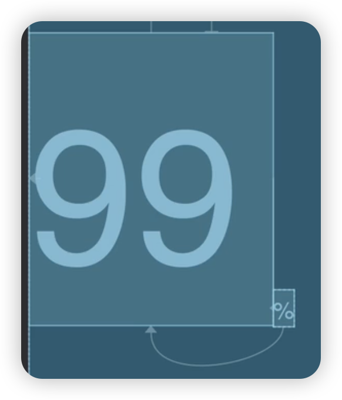
            
        - app:layout_constraintStart_toEndOf
        - app:layout_constraintStart_toStartOf
        - app:layout_constraintEnd_toStartOf
        - app:layout_constraintEnd_EndOf
        - app:layout_constraintBaseline_toBaselineOf
            
            
            ```kotlin
            app:layout_constraintBaseline_toBaseline0f="@+id/textView1"
            ```
            
            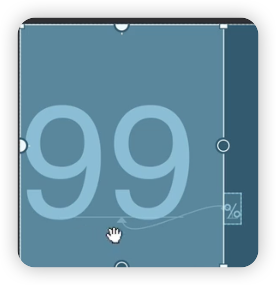
            
    - 角度定位
        - app:layout_constraintCircleAngle 角度
        - app:layout_constraintCircleRadius 距离
            
            
            ```kotlin
            app:layout_constraintCircleAngle="45"
            app:layout_constraintCircleRadius="150dp" 
            app:layout_constraintCircle="@id/sun"
            ```
            
            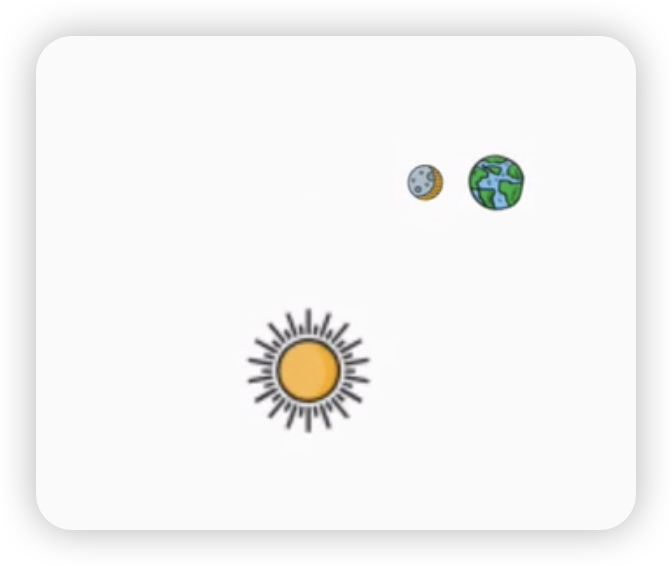
            
    - 边距
        - 常用 margin
            - android:layout_marginStart
            - android:layout_marginEnd
            - android:layout_marginLeft
            - android:layout_marginTop
            - android:layout_marginRight
            - android:layout_marginBottom
        - goneMargin
            - app:layout_goneMarginStart
            - app:layout_goneMarginEnd
            - app:layout_goneMarginLeft
            - app:layout_goneMarginTop
            - app:layout_goneMarginRight
            - app:layout_goneMarginBottom
            
            ```kotlin
            app:layout_goneMarginstart="16dp"
            app:layout_constraintStart_toEndOf="@id/textview"
            app:layout_constraintTop_toTop0f="@id/textview"
            ```
            
            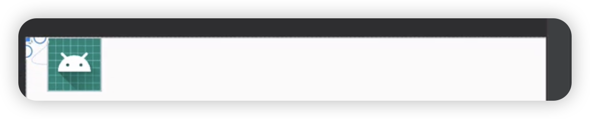
            
    - 居中
        - app:layout_constraintBottom_toBottomOf=”parent”
        - app:layout_constraintLeft_toLeftOf=”parent”
        - app:layout_constraintRight_toRightOf=”parent”
        - app:layout_constraintTop_toTopOf=”parent”
    - 尺寸约束
        - android:minWidth 最小的宽度；android:minHeight 最小的高度；
        android:maxWidth 最大的宽度；android:maxHeight 最大的高度
        - 使用 0dp (MATCH_CONSTRAINT)取代 match_parent
        - app:layout_constrainedWidth="true” 约束宽度
            
            
            ```kotlin
            app:layout_constrainedWidth="true"
            app:layout_constraintEnd_toEndOf="parent" 
            app:layout_constraintHorizontal_bias="0.0"
            app:layout_constraintStart_toEndOf="@+id/avatar" 
            app:layout_constraintTop_toTop0f="@+id/avatar"
            ```
            
            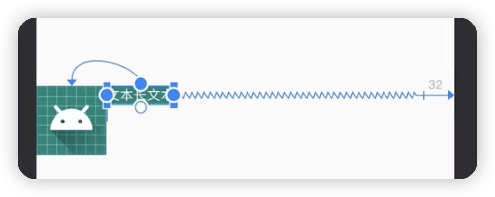
            
        - app:layout_constraintDimensionRatio 设置宽高比
            - 当宽或高至少有一个尺寸被设置为 0dp 时
            - app:layout_constraintDimensionRatio=”H,2:3”指的是 高：宽=2:3
            - app:layout_constraintDimensionRation=”W,2:3”指的是 宽：高=2:3
            
            ```kotlin
            android:layout_width="0dp" 
            android:layout_height="100dp"
            app:layout_constraintDimensionRatio="2:1"
            ```
            
            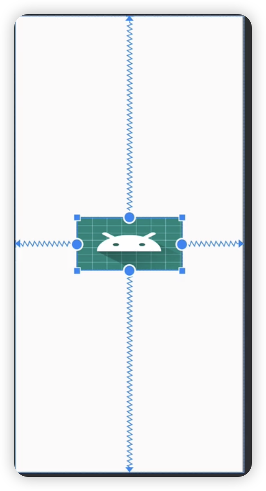
            
        - app:layout_constraintHorizontal_chainStyle 改变整条链的样式
            - chain_spread - 展开元素(默认)
            - chain_spread_inside - 展开元素贴近 parent；
                
                
                ```kotlin
                app:layout_constraintHorizontal_chainStyle="spread_inside"
                ```
                
                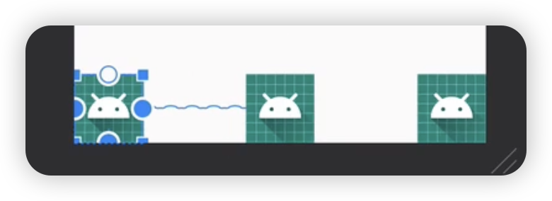
                
            - chain_packed - 链的元素将打包在一起
                
                
                ```kotlin
                app:layout_constraintVertical_bias="0.2"
                app:layout_constraintVertical_chainStyle="packed"
                ```
                
                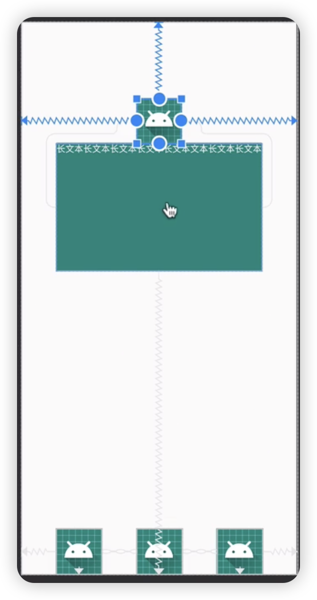
                
        - app:layout_constraintHorizontal_weight/layout_constraintVertical_weight 创建权重链
            
            
            ```kotlin
            app:layout_constraintHorizontal_weight="1"
            app:layout_constraintHorizontal_weight="1"
            app:layout_constraintHorizontal_weight="2"
            
            ```
            
            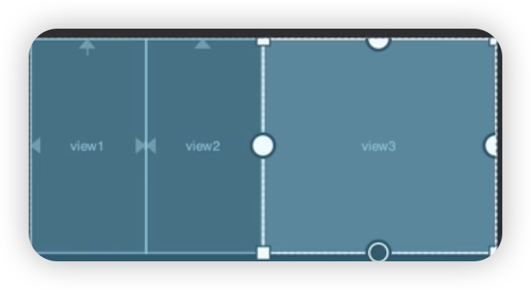
            
        - layout_constraintWidth_percent 百分比布局
            
            
            ```kotlin
            android:layout_width="Odp" 
            android:layout_height="300dp"
            app:layout_constraintWidth_percent="0.6"
            ```
            
            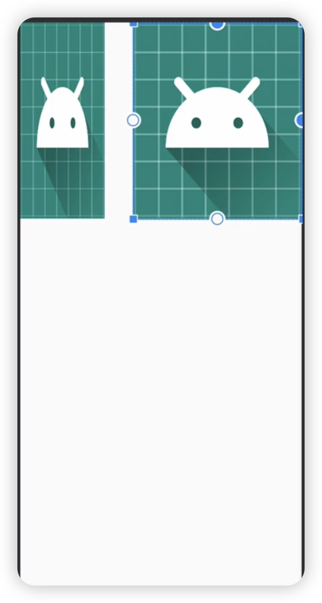
            
    - 辅助工具
        - Barrier
            - app:barrierDirection 为屏障所在的位置，可设置的值有：bottom、end、left、right、start、top
            - app:constraint_referenced_ids 为屏障引用的空间，可设置多个(用,隔开)
            
            ```kotlin
            ‹androidx.constraintlayout.widget.Barrier
            	android:id="@+id/barrier"
            	android:layout_width="wrap_content" 
            	android:layout_height="wrap_content"
            	app:barrierDirection="end"
            	app:constraint_referenced_ids="viewl,view2" />
            ```
            
            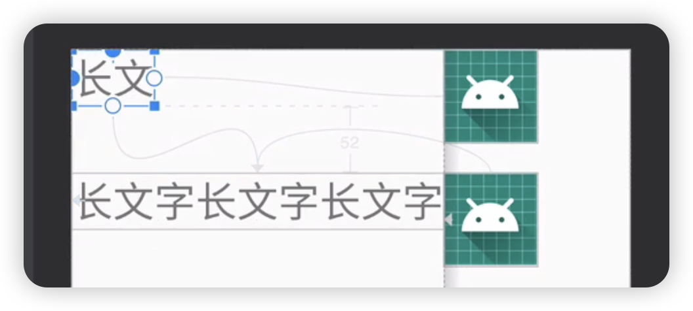
            
        - Group：Group 可以把多个控件归位一组，方便隐藏或显示一组控件
            
            
            ```kotlin
            <androidx. constraintlayout.widget.Group
            	android: id="@+id/group"
            	android: layout_width="wrap_content" 
            	android: layout_height="wrap_content"
            	app:constraint_ referenced_ids="view, view1, view7, view8"/>
            ```
            
            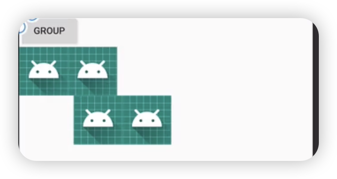
            
            - Guideline
                - android:orientation 垂直 vertical，水平 horizontal
                - layout_constraintGuide_begin 开始位置
                - layout_constraintGuide_end 结束位置
                - layout_constraintGuide_percent 距离顶部的百分比(orientation = horizontal 时则为距离左边)
                
                ```kotlin
                <androidx.constraintlayout.widget.Guideline
                	android:id="@+id/guideline"
                	android:layout_width="wrap_content" 
                	android:layout_height="wrap_content"
                	android:orientation="vertical"
                	app:layout_constraintGuide_end="60dp"
                	app:layout_constraintGuide_percent="0.2" />
                ```
                
                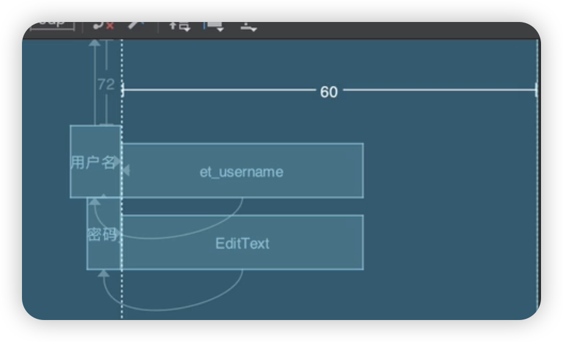
                
        - layout_optimizationLevel
            - none:无优化
            - standard:仅优化直接约束和屏障约束(默认)
            - direct:优化直接约束
            - barrier:优化屏障约束
            - chain:优化链约束
            - dimensions:优化尺寸测量
        - Placeholder：在 Placeholder 中可以使用 setContent()设置另一个控件的 id，使这个控件移动到占位符的位置