# RecyclerView

- RecyclerView是什么？
    
    A **flexible** view for providing a **limited** window into a **large** data set，为有限的屏幕显示大量的数据的灵活的View
    
- ListView 的局限
    - 只有纵向列表一种布局
    - 没有支持动画 API
    - 接口设计和系统不一致
        - setOnltemClickListener
        - setOnltemLongClickListener
        - setSelection
    - 没有强制实现 ViewHolder
    - 性能不如 RecyclerView
    
    setOnltemLongClickListener（
    setSelection（
    
- RecyclerView的优势
    - 默认支持 Linear, Grid, Staggered Grid 三种布局
        
        
        
    - 友好的 ItemAnimator 动画 API
    - 强制实现 ViewHolder
    - 解耦的架构设计
    - 相对于 ListView 有更好的性能
- RecyclerView的重要组件
    
    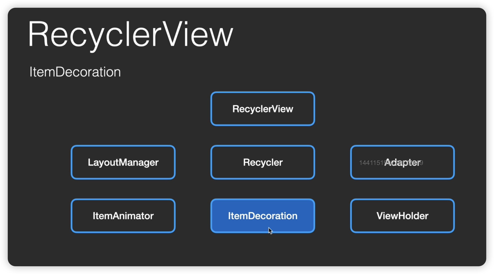
    
- RecyclerView 简单的 Demo
    
    
    
    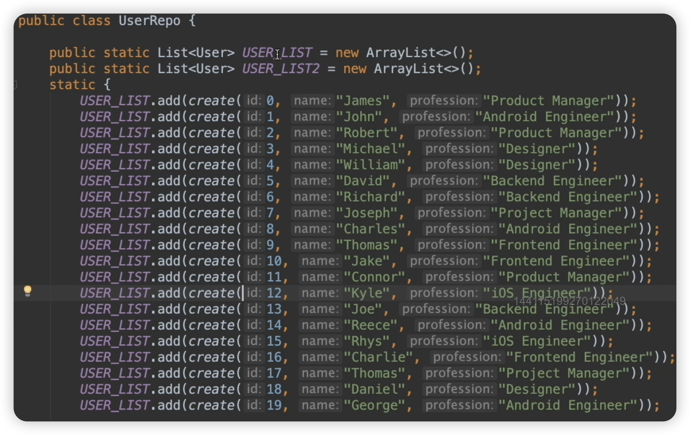
    
    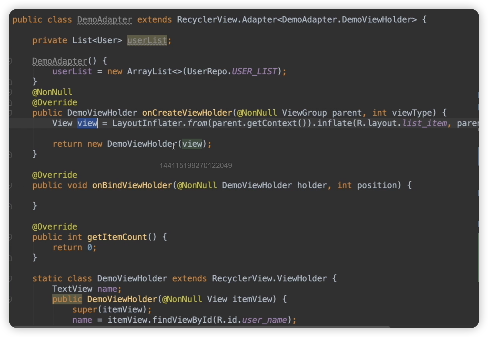
    
    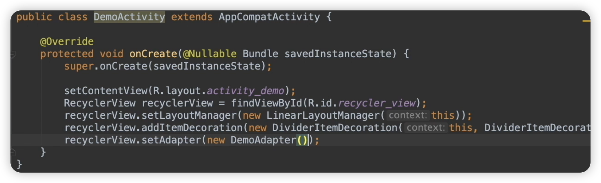
    
- RecyclerView 缓存机制
    
    ListView 缓存的是 View，而 RecyclerView 缓存的是 ViewHolder
    
    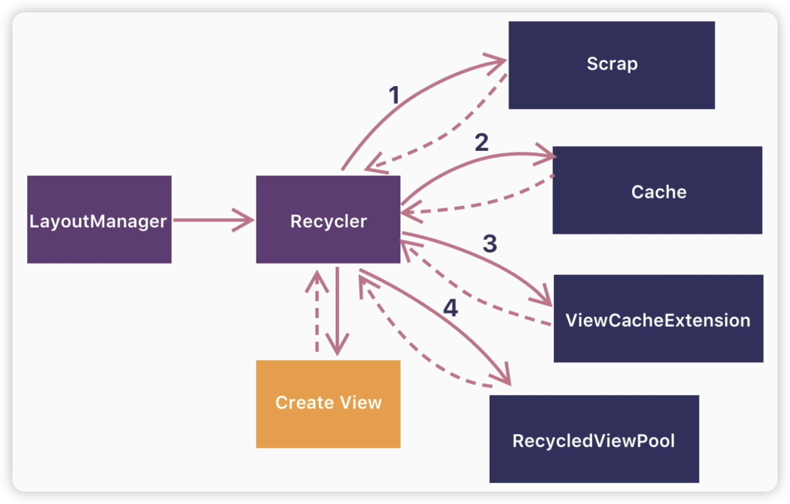
    
    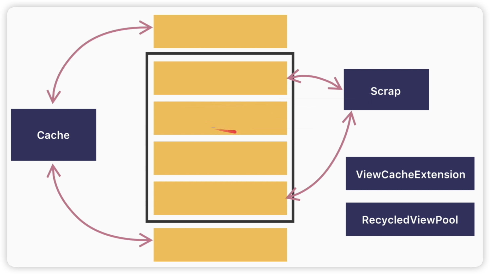
    
    - Scrap就是屏幕内屏幕内部的item view，通过 postion数据集找到找到 view；
    它是干净的数据，可以直接拿过来用。(不需要重新绑定数据)
    - cache 刚划出屏幕的 View，默认缓存是 2 个
    它是干净的数据，可以直接拿过来用。(不需要重新绑定数据)
        
        ```kotlin
        public final class Recycler {
            final ArrayList<ViewHolder> mCachedViews = new ArrayList<ViewHolder>();
        }
        ```
        
        ```kotlin
        public void setItemViewCacheSize(int size) {
            mRecycler.setViewCacheSize(size);
        }
        ```
        
    - ViewCacheExtension
        
        ```kotlin
        public void setViewCacheExtension(@Nullable ViewCacheExtension extension) {
            mRecycler.setViewCacheExtension(extension);
        }
        ```
        
        ```kotlin
        public abstract static class ViewCacheExtension {
            @Nullable
            public abstract View getViewForPositionAndType(@NonNull Recycler recycler, int position, int type);
        }
        ```
        
        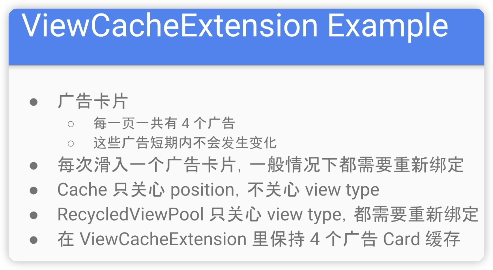
        
    - RecycledViewPool，里面的数据是 dirty 的，需要重新 bind。
- 注意：列表中 item/广告的 impression 统计
    
    通过 onViewAttachedToWindow来统计
    
    ```kotlin
    /**
     * Called when a view created by this adapter has been attached to a window.
     *
     * <p>This can be used as a reasonable signal that the view is about to be seen
     * by the user. If the adapter previously freed any resources in
     * {@link #onViewDetachedFromWindow(RecyclerView.ViewHolder) onViewDetachedFromWindow}
     * those resources should be restored here.</p>
     *
     * @param holder Holder of the view being attached
     */
    public void onViewAttachedToWindow(@NonNull VH holder) {}
    ```
    
- RecyclerView性能优化策略
    - 在onBindViewHolder里设置点击监听？
        - 错误的用法：onBindViewHolder 里设置点击监听器会导致重复创建对象
            
            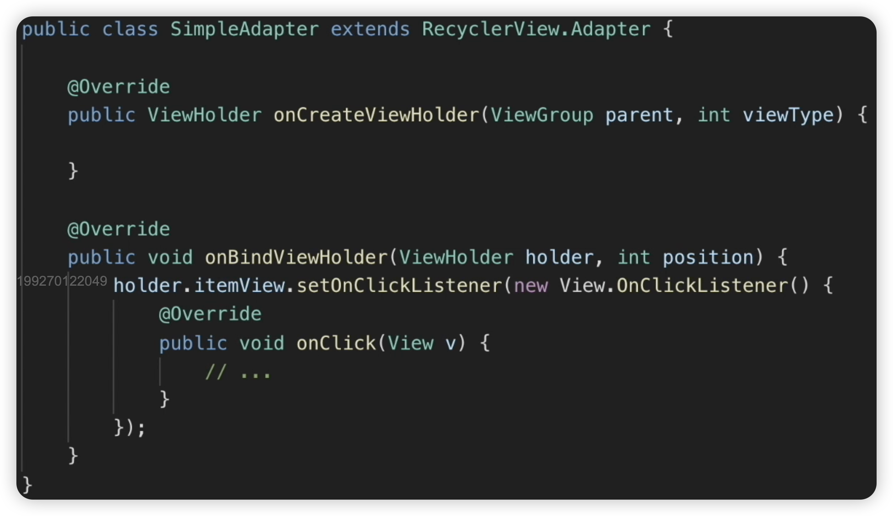
            
        - 正确做法：onCreateViewHolder 里设置监听
        设置的监听始终是一个，View、ViewHolder和View.OnClickListener三者一一对应。静态设置，动态计算。
        我点击的时候，信息可能发生变化，动态获取Item 上的信息。
            
            View holder里面的item view或者其他的子view只需要在创建的时候设置一次点击监听就可以了。
            
            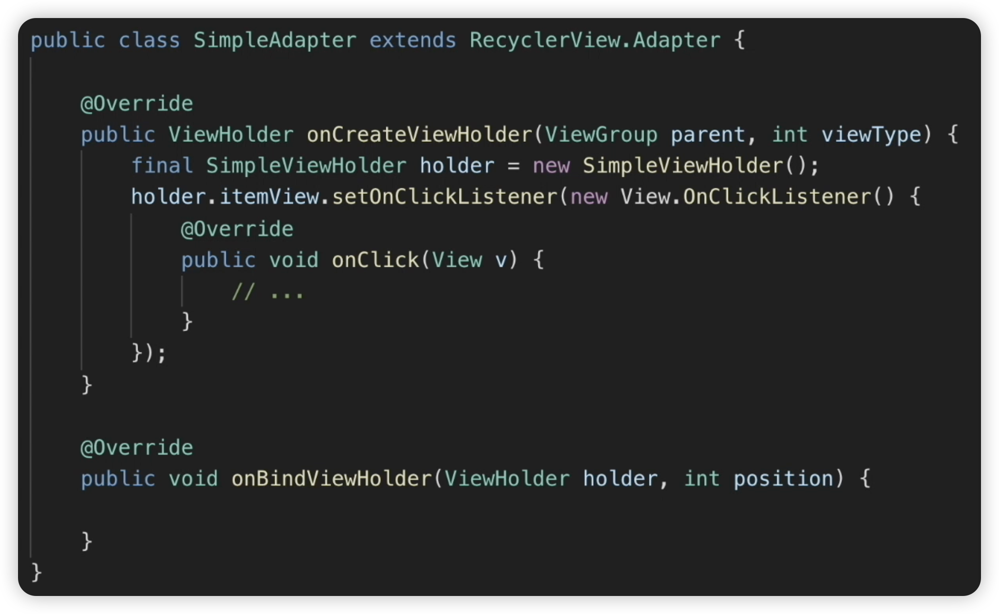
            
        
        View - ViewHolder -
        View.OnClickListener 三者一一对应
        
        View - ViewHolder -
        View.OnClickListener 三者一一对应
        
        View - ViewHolder -
        View.OnClickListener 三者一一对应
        
        View - ViewHolder -
        View.OnClickListener 三者一一对应
        
    - LinearLayoutManager.setInitialPrefetchltemCount()
        - 用户滑动到横向滑动的 item RecyclerView 的时候，由于需要创建更复杂的
        RecyclerView 以及多个子 view，可能会导致页面卡顿
        - 由于 RenderThread 的存在，RecyclerView 会进行 prefetch
        - LinearLayoutManager.setInitialPrefetchltemCount（横向列表初次显示时可见的item 个数），初始第一次看到它的时候，它要预先创建和绑定的 item的个数。
        - 只有 LinearLayoutManager 有这个 API
        - •只有嵌套在内部的 RecyclerView 会生效
    - RecyclerView.setHasFixedSize()
        
        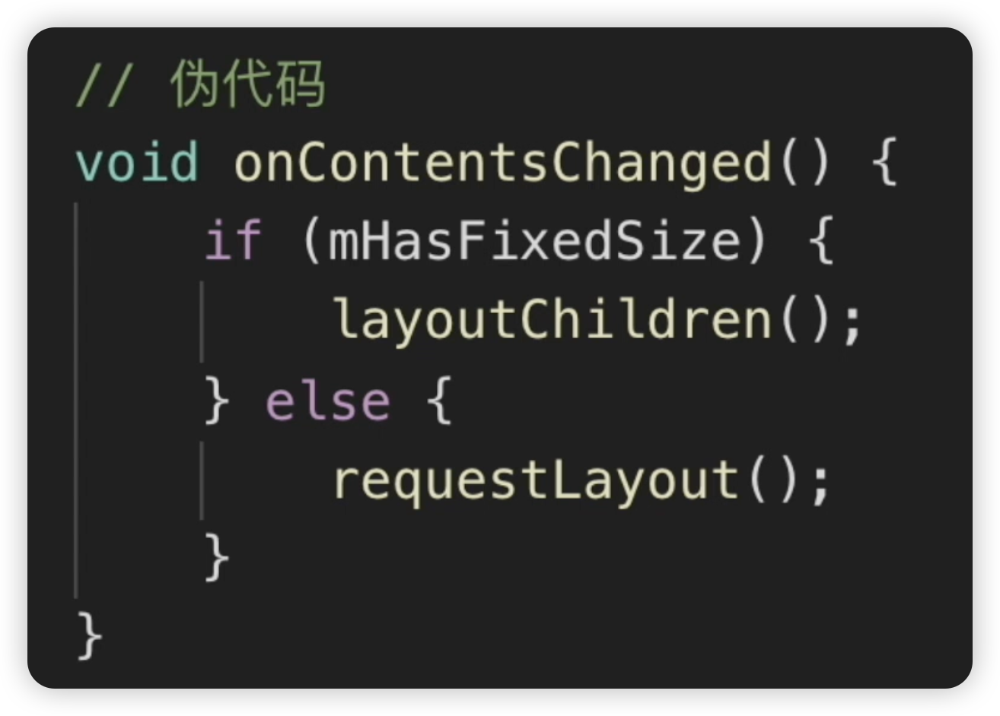
        
        如果 Adapter 的数据变化不会导致 RecyclerView的大小变化 →就可以设置RecyclerView.setHasFixedSize(true)
        
    - 多个 RecyclerView共用RecycledViewPool
        
        ```kotlin
        public void setRecycledViewPool(@Nullable RecycledViewPool pool) {
            mRecycler.setRecycledViewPool(pool);
        }
        ```
        
        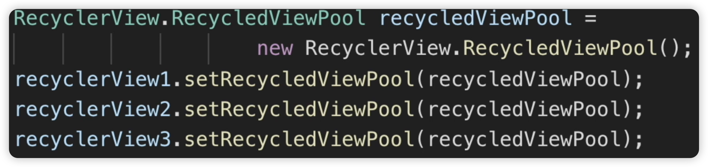
        
        
        
    - DiffUtil
        - DiffUtil is a utility class that can calculate the difference between two lists and output a list of update operations that converts the first list into the second one.
        - 局部更新方法 notifyltemXXX()不适用于所有情况
        - notifyDataSetChange()会导致整个布局重绘，重新绑定所有 ViewHolder，而且会失去可能的动画效果
        - DiffUtil适用于整个页面需要刷新，但是有部分数据可能相同的情况
        - DiffUtil基本用法
            
            ```kotlin
            public abstract static class Callback {
            
                public abstract int getOldListSize();
            
                public abstract int getNewListSize();
            
                public abstract boolean areItemsTheSame(int oldItemPosition, int newItemPosition);
            
                public abstract boolean areContentsTheSame(int oldItemPosition, int newItemPosition);
            
                @Nullable
                public Object getChangePayload(int oldItemPosition, int newItemPosition) {
                    return null;
                }
            }
            ```
            
            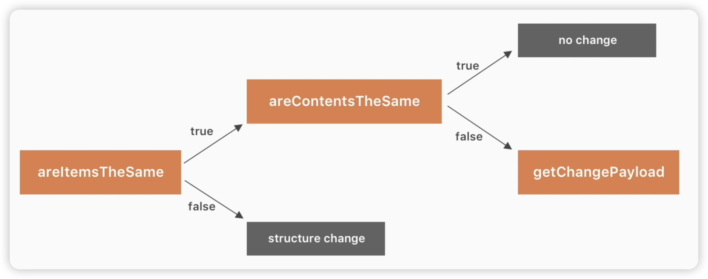
            
            DiffUtil.Callback 的逻辑
            
            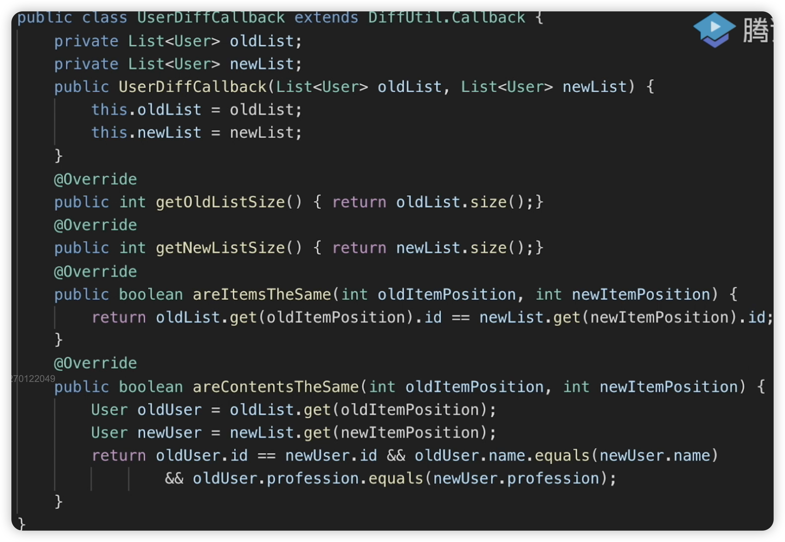
            
            举个例子
            
            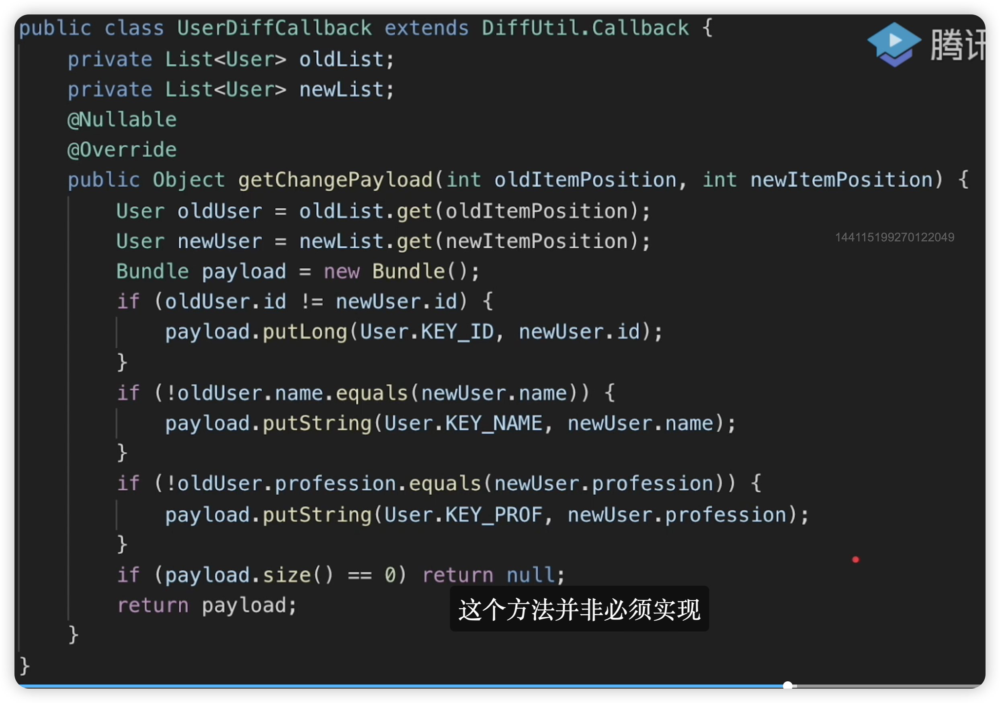
            
            用于 Item 的增量更新
            
            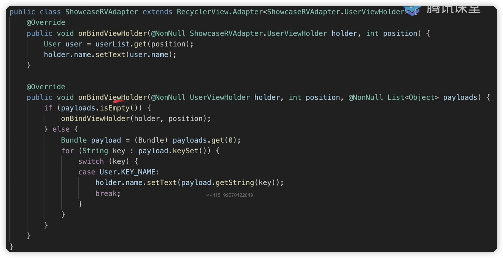
            
            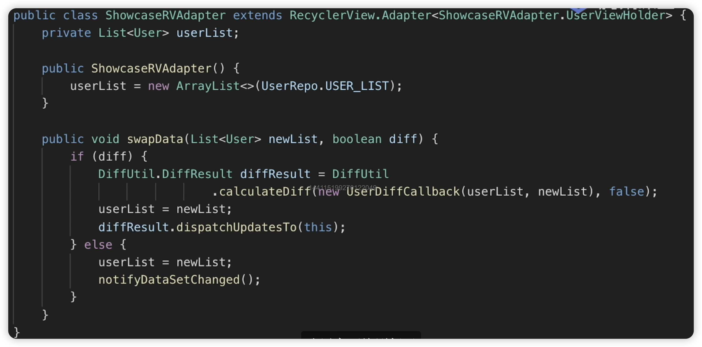
            
            使用 DiffUtil，最后一个参数：false代表不考虑 item 移动的情况；考虑的话算法 o^2
            
        - DiffUtil效率问题，优化写法
            
            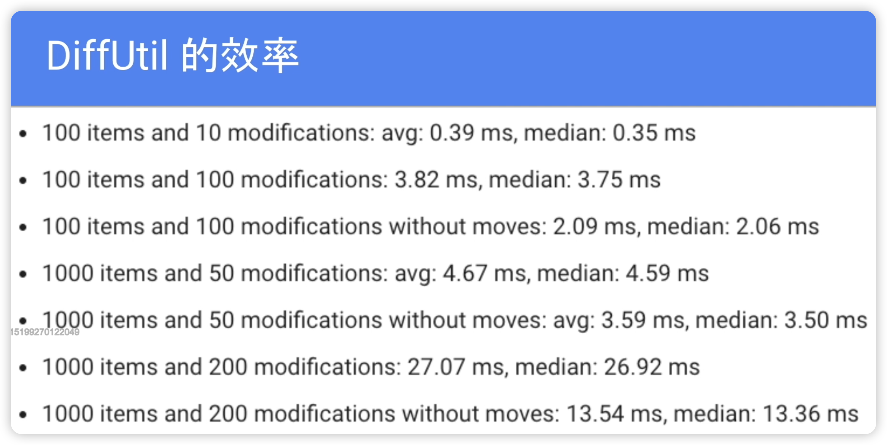
            
            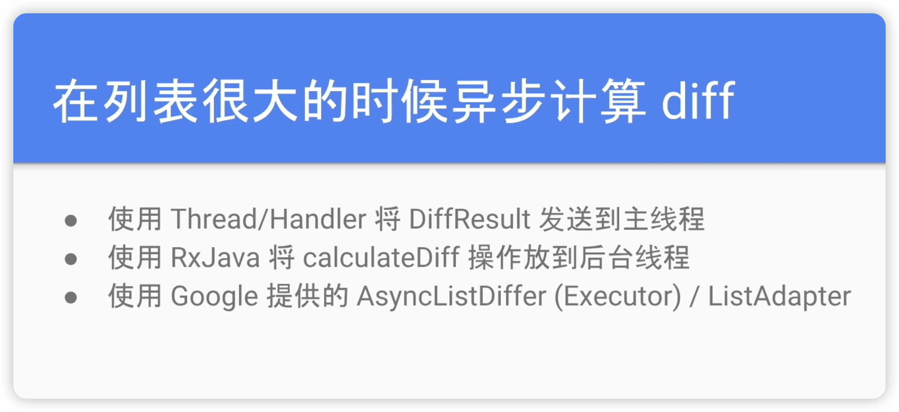
            
            - [https://developer.android.com/reference/androidx/recyclerview/widget/ListAdapter](https://developer.android.com/reference/androidx/recyclerview/widget/ListAdapter)
            - [https://developer.android.com/reference/androidx/recyclerview/widget/AsyncListDiffer](https://developer.android.com/reference/androidx/recyclerview/widget/AsyncListDiffer)
        - ItemDecoration
            
            为什么 ItemDecoration可以绘制分隔线？
            
            <aside>
            💡 如果在 Item 里面做分割线，做动画的时候，分割线会跟着动。
            
            </aside>
            
            ```kotlin
            public abstract static class ItemDecoration {
            		//在 itemView 的下面绘制
                public void onDraw(@NonNull Canvas c, @NonNull RecyclerView parent, @NonNull State state) {
                    onDraw(c, parent);
                }
            
            		//在 itemView 的上面绘制
                public void onDrawOver(@NonNull Canvas c, @NonNull RecyclerView parent,
                        @NonNull State state) {
            
                }
            		//对 item 进行偏移
                public void getItemOffsets(@NonNull Rect outRect, @NonNull View view,
                        @NonNull RecyclerView parent, @NonNull State state) {
                   
                }
            }
            ```
            
            ```kotlin
            public class DividerItemDecoration extends RecyclerView.ItemDecoration {
            
                public DividerItemDecoration(Context context, int orientation) {
                    final TypedArray a = context.obtainStyledAttributes(ATTRS);
                    mDivider = a.getDrawable(0);
                    if (mDivider == null) {
                        Log.w(TAG, "@android:attr/listDivider was not set in the theme used for this "
                                + "DividerItemDecoration. Please set that attribute all call setDrawable()");
                    }
                    a.recycle();
                    setOrientation(orientation);
                }
            }
            ```
            
            - Inset Divider 图示
                
                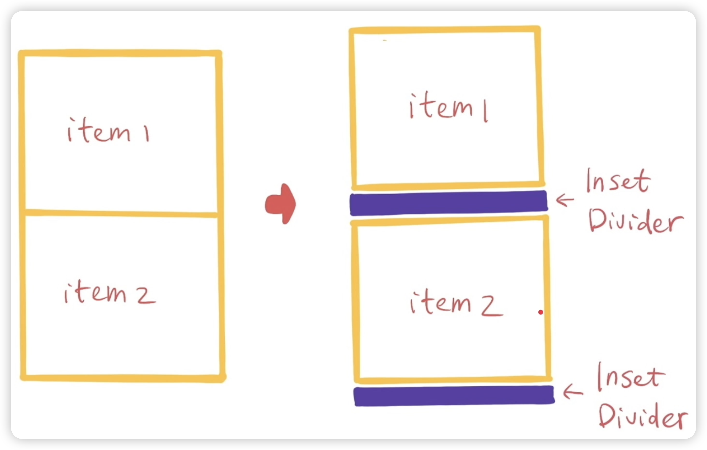
                
                Inset Divider 图示
                
            - Overlay Divider 图示
                
                
                
                Overlay Divider 图示
                
                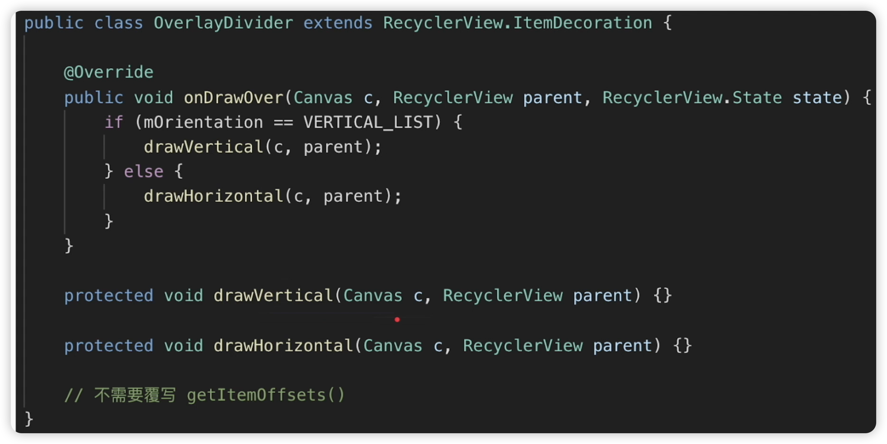
                
                代码实现
                
            - ItemDecoration 还可以做什么？
                - Drawing dividers between items(分割线)
                - Highlights(高亮)
                - Visual grouping boundaries(分组)
                
                ```kotlin
                final ArrayList<ItemDecoration> mItemDecorations = new ArrayList<>();
                
                public void addItemDecoration(@NonNull ItemDecoration decor) {
                    addItemDecoration(decor, -1);
                }
                
                public void addItemDecoration(@NonNull ItemDecoration decor, int index) {
                    if (mLayout != null) {
                        mLayout.assertNotInLayoutOrScroll("Cannot add item decoration during a scroll  or"
                                + " layout");
                    }
                    if (mItemDecorations.isEmpty()) {
                        setWillNotDraw(false);
                    }
                    if (index < 0) {
                        mItemDecorations.add(decor);
                    } else {
                        mItemDecorations.add(index, decor);
                    }
                    markItemDecorInsetsDirty();
                    requestLayout();
                }
                ```
                
                [https://advancedrecyclerview.h6ah4i.com](https://advancedrecyclerview.h6ah4i.com/)
                
                [https://github.com/h6ah4i/android-advancedrecyclerview](https://github.com/h6ah4i/android-advancedrecyclerview)
                
- RecyclerView核心要点
    - 复用机制(Recycler )
        
        RecyclerView复用的是 ViewHolder，ListView 复用的是 View
        
        1. scrap(一次布局中，临时保存 ViewHolder 的作用，如果还有，扔进RecyclerPool 里面)
            
            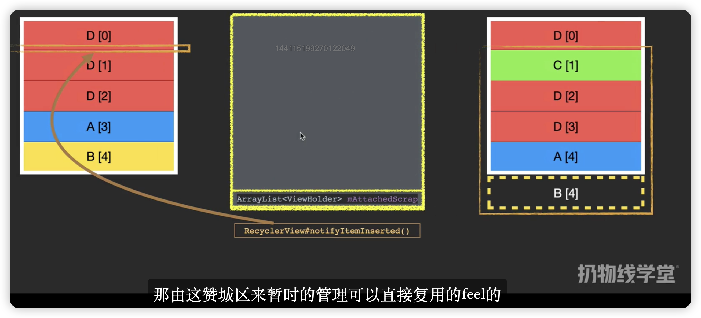
            
            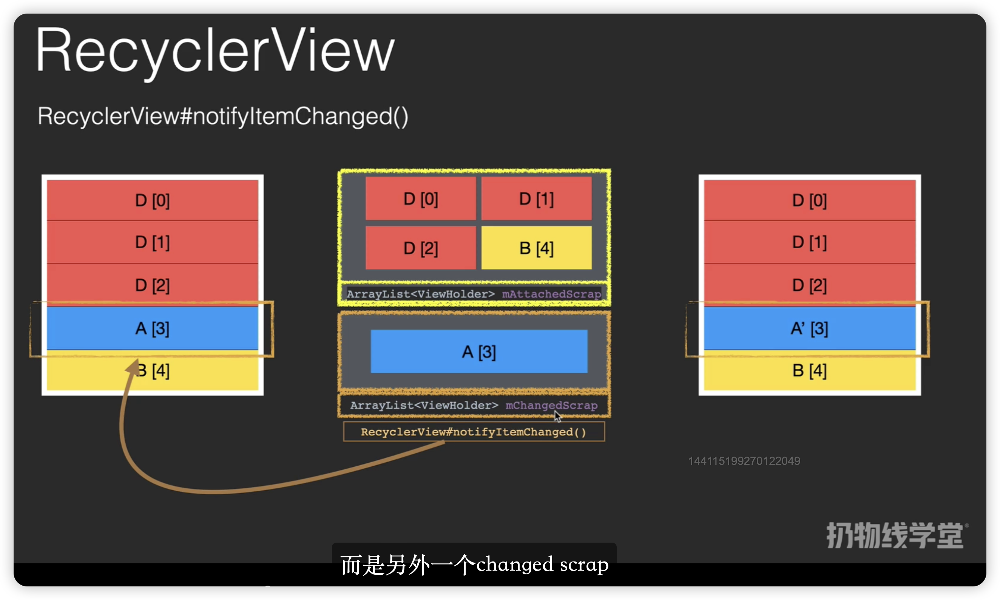
            
        2. Cache：连绑定都不需要，作用场景：数据没有改变，触发 onlayout；主要优化滑动的性能，最多存放两个ViewHolder；int mViewacheMax = DEFAULT_CACHE_SIZE;
        这里的cache缓存是不会按照ViewType 来分类的，不同类型的 viewHolder都可以同时被存放到cache里
        3. ViewCacheExtension
        4. RecycledViewPool
        需要重新绑定数据BindData,只能保证 ViewType 的类型是一致的，posiiton 不是一致的。
        其实也就代表着从回收十中捞出来的field上残留的数据很可能没有对应正确的数据
        
        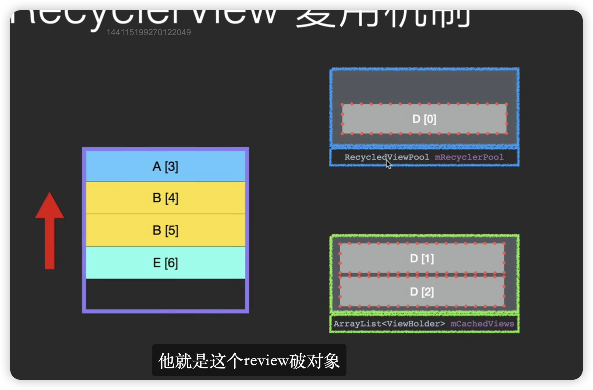
        
        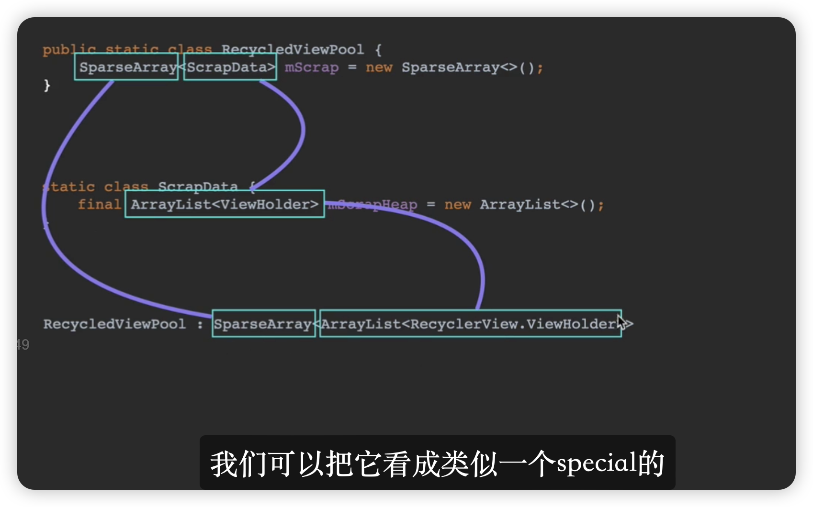
        
        SparseArray<ScrapData> 不用连续
        
        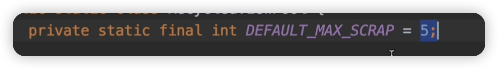
        
        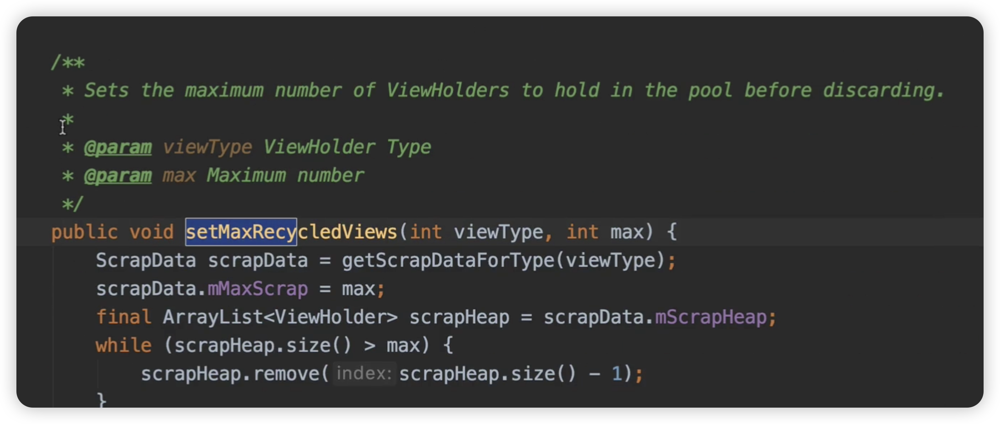
        
        举个复用的例子：如果有一个 viewType 有几十个，那么这个值设置大一点；如果有几百个 viewType，这个值就需要设置小一点(每个 viewType 最多缓存 5，那么就有 500个缓存)。
        
        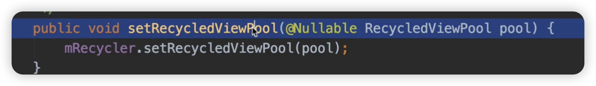
        
        多个 RecyclerView 共用一个回收池，举一个例子：Google Play
        
        d调用otifiyChange
        
        dnotifiyChange
        
        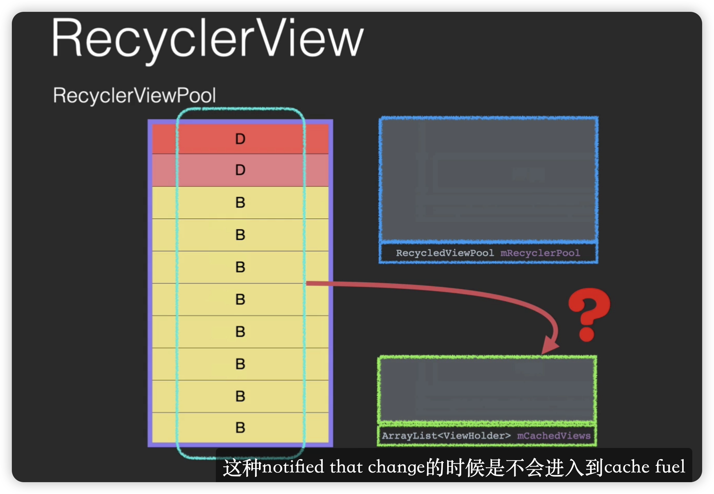
        
    
    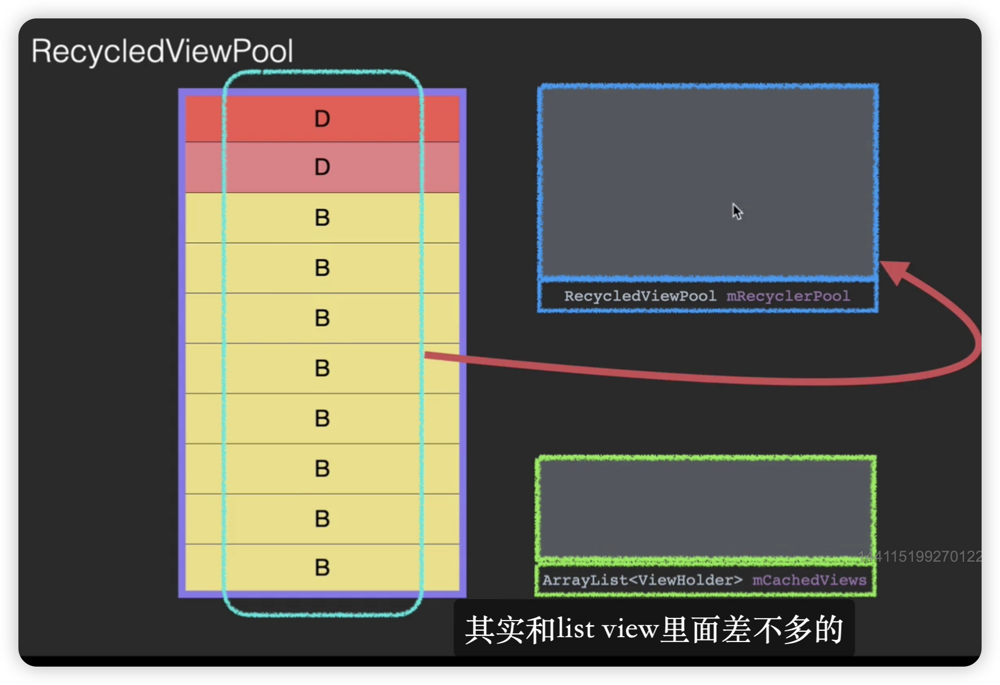
    
    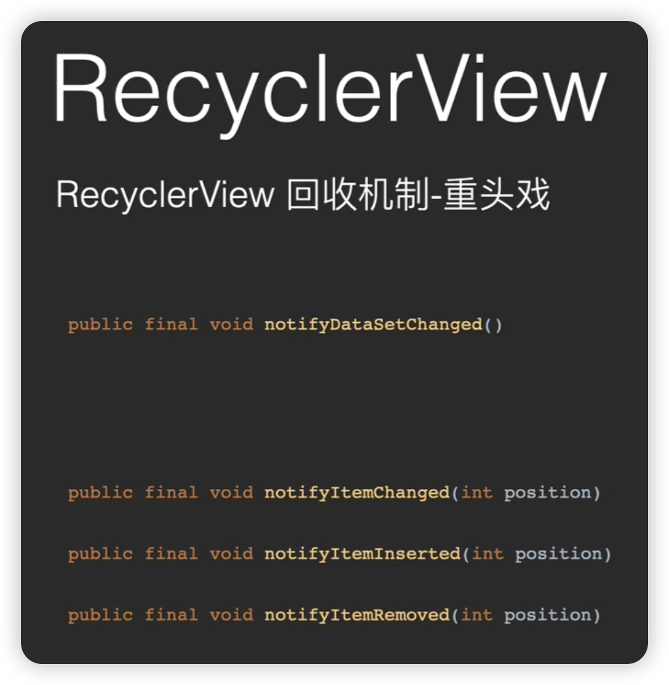
    
    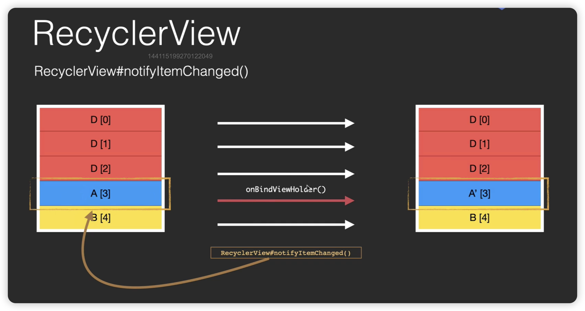
    
    - 性能优化策略
        - onCreateViewHolder里onClickListener
        - setItemViewCacheSize()
        - setInitialPrefetchItemCount()
        - setHasFixedSize()
        - RecycledViewPool
        - DiffUtil
            - AsyncListDiffer
            - Callback：1、areItemsTheSame 2、areContentsTheSame 3、getChangePayload
        - ItemDecoration：1、onDraw 2、onDrawOver 3、getItemOffset
        - ItemAnimator

View Adapter LayoutManager

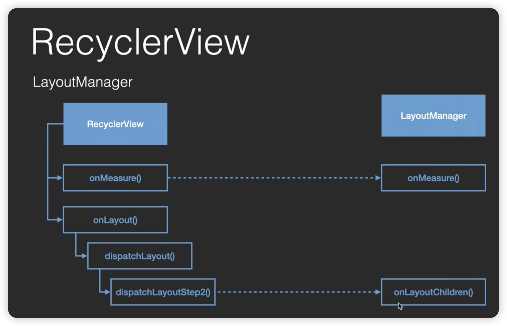

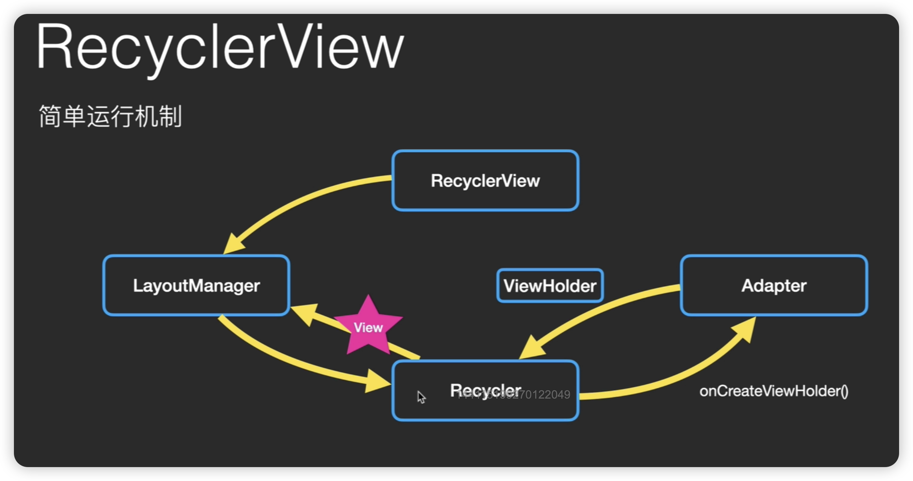

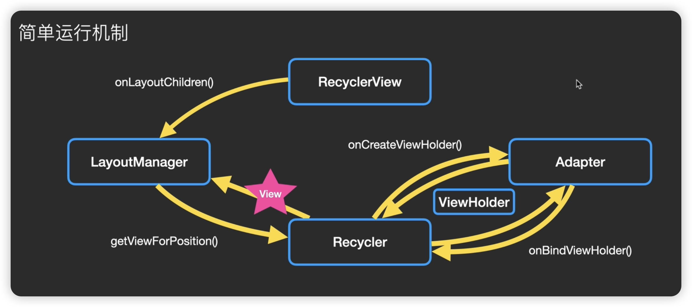

详解 RecyclerView 中的局部刷新机制 | 开发者说·DTalk

[https://mp.weixin.qq.com/s/Qi4sxUuc4Zi7zNrGqp9-mw](https://mp.weixin.qq.com/s/Qi4sxUuc4Zi7zNrGqp9-mw)

Android RecyclerView八个必会的面试技巧

[https://mp.weixin.qq.com/s/Sv5R-gycykFXZnnIboSPww](https://mp.weixin.qq.com/s/Sv5R-gycykFXZnnIboSPww)

**【Android面试题】高级UI面试题——RecyclerView的回收复用机制**

[https://juejin.cn/post/7270167187658358795](https://juejin.cn/post/7270167187658358795)

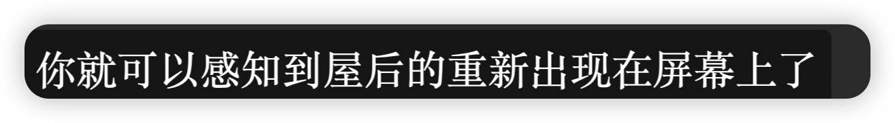

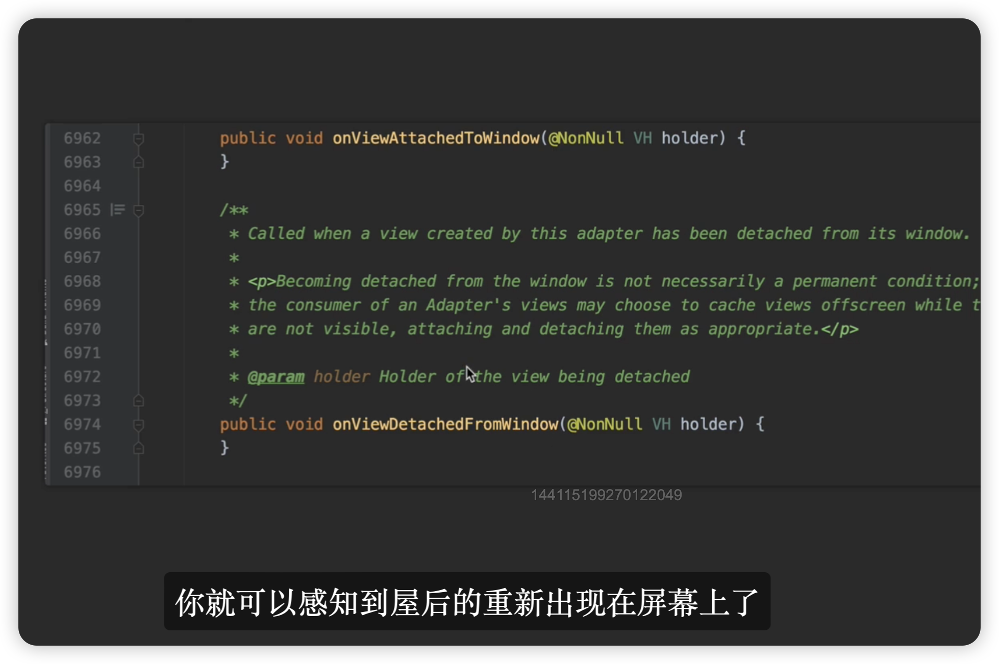

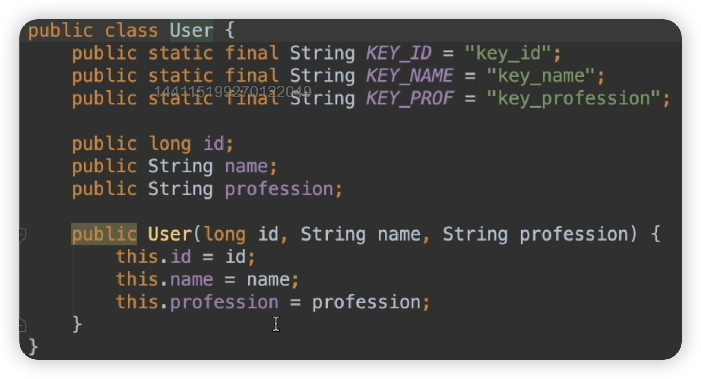