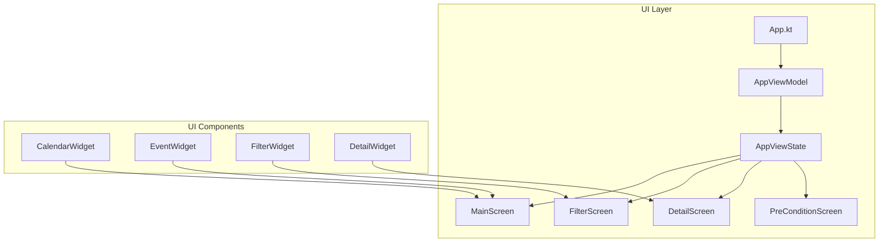
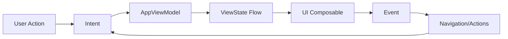
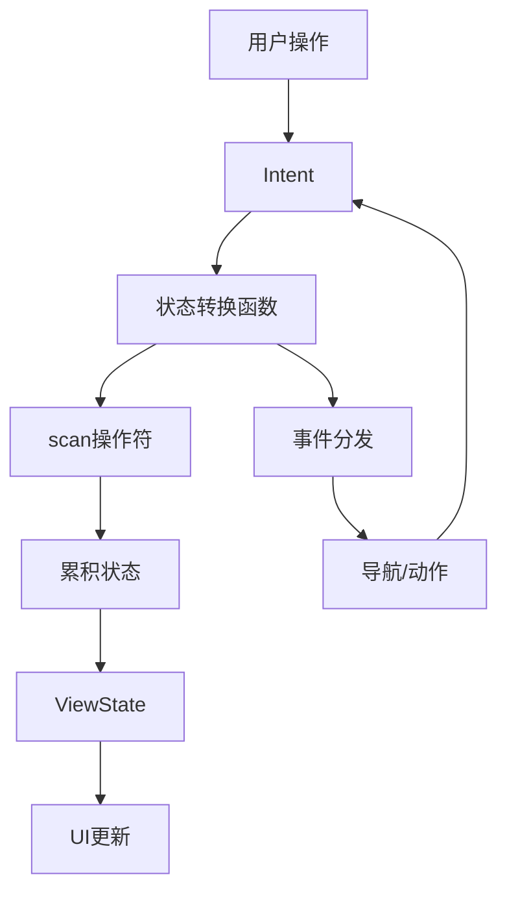
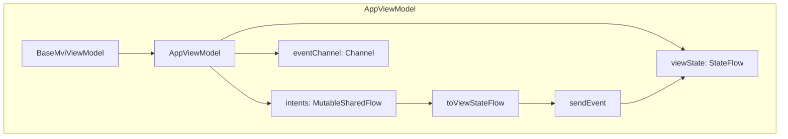
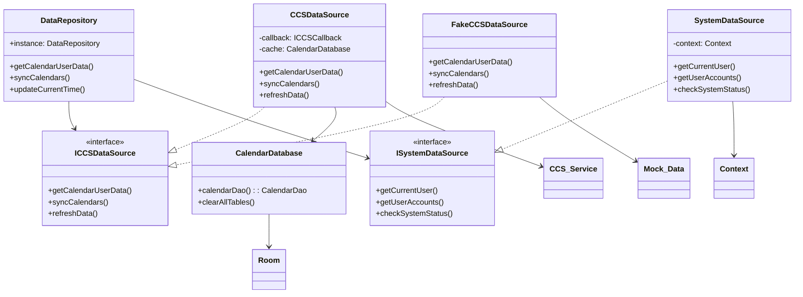
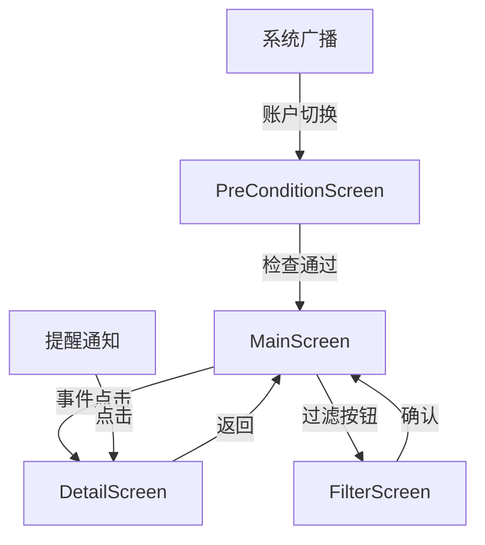

# 现代汽车日历应用架构设计文档

## 项目概览

现代汽车日历应用是一款专为Android车载系统构建的智能日历应用，基于Jetpack Compose开发，深度集成现代汽车CCS（互联汽车服务），提供日历事件管理、智能提醒、多语言支持等核心功能。

## 架构模式

应用采用现代化的**MVVM + MVI + 仓库模式**的混合架构：

- **MVI (Model-View-Intent)**: 单向数据流架构，确保状态管理的可预测性
- **MVVM (Model-View-ViewModel)**: 分离UI逻辑和业务逻辑
- **仓库模式**: 统一数据访问层，抽象数据源

## 核心架构原则

1. **单向数据流**: Intent → ViewState → Event
2. **分层架构**: 清晰的职责分离
3. **响应式编程**: 基于Kotlin Flow的响应式数据流
4. **集中式处理**: 统一处理所有Intent，简化流程
5. **依赖注入**: 通过单例和工厂模式管理依赖

## 表现层架构

### UI组件架构


### MVI架构实现

**Intent处理流程**:

```kotlin
// Intent定义
sealed class AppIntent {
    object GoMainScreenIntent : AppIntent()
    data class GoDetailScreenIntent(...) : AppIntent()
    object RefreshDataIntent : AppIntent()
    // ... 其他Intent
}

// ViewState状态
data class AppViewState(
    val calendarUserData: CalendarUserData?,
    val currentTime: LocalDateTime,
    val selectDay: LocalDate,
    val isLoading: Boolean,
    // ... 其他状态
)
```

**数据流向图**:


## Intent处理流程

应用采用简化的Intent处理流程，直接从Intent转换为ViewState，避免了额外的抽象层。

#### 数据流图




### 1. Intent发送阶段

#### 发送方式
```kotlin
// 方式1：直接发送
viewModel.sendIntent(AppIntent.GoMainScreenIntent())

// 方式2：通过事件触发
LaunchedEffect(true) {
    viewModel.sendIntent(AppIntent.GetCalendarUserDataForCurrentUserIntent)
}

// 方式3：用户交互触发
Button(onClick = {
    viewModel.sendIntent(AppIntent.SelectDayIntent(selectedDate))
}) {
    Text("选择日期")
}
```

#### 发送时机
- **用户交互**: 点击、滑动、输入等操作
- **生命周期**: 页面创建、销毁、暂停等
- **系统事件**: 网络变化、时间变化、账户切换等
- **数据变化**: 数据同步完成、缓存更新等

### 2. Intent接收和分发

#### BaseMviViewModel

```kotlin
open class BaseMviViewModel<INTENT, EVENT> : ViewModel() {

    protected val intents = MutableSharedFlow<INTENT>()
    protected val events = MutableStateFlow<EVENT>()

    fun <INTENT> MutableSharedFlow<INTENT>.log(): Flow<INTENT> {
        return this.onEach {
            //logd("intent=$it")
        }
    }

    fun sendIntent(intent: INTENT) {
        logd("intent send=$intent")
        viewModelScope.launch {
            intents.emit(intent) 
        }
    }
    
    fun sendEvent(event: EVENT) {
        viewModelScope.launch {
            events.emit(event)
        }
    }
}  
```

#### AppViewModel

```kotlin

class AppViewModel : BaseMviViewModel<AppIntent, AppEvent>() {
    val viewState: StateFlow<AppViewState> = intents
        .log()
        .toStateChangeFlow()
        .sendEvent()
        .scan(AppViewState.initial) { oldState, stateTransform -> stateTransform(oldState) }
        .flowOn(Dispatchers.Default)
        .stateIn(viewModelScope, SharingStarted.Eagerly, AppViewState.initial)
}  
```

#### Intent分发逻辑

应用采用**集中式Intent处理架构**，将所有Intent在一个统一的流程中处理，简化架构并提高性能。

```kotlin
class AppViewModel : BaseMviViewModel<AppIntent, AppEvent>() {
    
    @OptIn(ExperimentalCoroutinesApi::class)
    private fun Flow<AppIntent>.toStateChangeFlow(): Flow<(AppViewState) -> AppViewState> = merge(
        // 导航相关Intent - 直接返回状态转换函数
        filterIsInstance<AppIntent.GoMainScreenIntent>().flatMapConcat { it.toStateTransform() },
        filterIsInstance<AppIntent.GoFilterScreenIntent>().flatMapConcat { it.toStateTransform() },
        filterIsInstance<AppIntent.GoDetailScreenIntent>().flatMapConcat { it.toStateTransform() },
        filterIsInstance<AppIntent.GoLoadingScreenIntent>().flatMapConcat { it.toStateTransform() },
        
        // 用户交互相关Intent - 直接返回状态转换函数
        filterIsInstance<AppIntent.SelectDayIntent>().flatMapConcat { it.toStateTransform() },
        filterIsInstance<AppIntent.ResetTodayIntent>().flatMapConcat { it.toStateTransform() },
        filterIsInstance<AppIntent.ShowCalendarEventDialogIntent>().flatMapConcat { it.toStateTransform() },
        filterIsInstance<AppIntent.DismissCalendarEventDialogIntent>().flatMapConcat { it.toStateTransform() },
        
        // 数据同步相关Intent - 直接返回状态转换函数
        filterIsInstance<AppIntent.GetCalendarUserDataForCurrentUserIntent>().flatMapConcat { it.toStateTransform() },
        filterIsInstance<AppIntent.UpdateCalendarsIntent>().flatMapConcat { it.toStateTransform() },
        filterIsInstance<AppIntent.UpdateCurrentTime>().flatMapConcat { it.toStateTransform() },
        
        // 系统状态相关Intent - 直接返回状态转换函数
        filterIsInstance<AppIntent.LoadingDataIntent>().flatMapConcat { it.toStateTransform() },
        filterIsInstance<AppIntent.LoadingSuccessIntent>().flatMapConcat { it.toStateTransform() },
        filterIsInstance<AppIntent.LoadingFailIntent>().flatMapConcat { it.toStateTransform() },
        filterIsInstance<AppIntent.LoadingCacheIntent>().flatMapConcat { it.toStateTransform() },
        filterIsInstance<AppIntent.RefreshDataIntent>().flatMapConcat { it.toStateTransform() },
        filterIsInstance<AppIntent.RefreshSuccessIntent>().flatMapConcat { it.toStateTransform() },
        filterIsInstance<AppIntent.RefreshFailIntent>().flatMapConcat { it.toStateTransform() },
        filterIsInstance<AppIntent.CheckPreConditionIntent>().flatMapConcat { it.toStateTransform() },
        filterIsInstance<AppIntent.AccountChangeIntent>().flatMapConcat { it.toStateTransform() },
        
        // CCS服务相关Intent - 直接返回状态转换函数
        filterIsInstance<AppIntent.UCS_A_Intent>().flatMapConcat { it.toStateTransform() },
        filterIsInstance<AppIntent.UCS_A_Intent_For_Refresh>().flatMapConcat { it.toStateTransform() },
        filterIsInstance<AppIntent.UCS_2_A_Intent>().flatMapConcat { it.toStateTransform() },
        filterIsInstance<AppIntent.UCS_B_Intent>().flatMapConcat { it.toStateTransform() },
        filterIsInstance<AppIntent.UCS_2_B_Intent>().flatMapConcat { it.toStateTransform() },
        
        // UI状态相关Intent - 直接返回状态转换函数
        filterIsInstance<AppIntent.showAlertDialogIntent>().flatMapConcat { it.toStateTransform() },
        filterIsInstance<AppIntent.DismissAlertDialogIntent>().flatMapConcat { it.toStateTransform() },
    )
}
```

**Intent处理扩展函数**:

```kotlin
// 导航相关Intent处理 - 直接返回状态转换函数
private fun AppIntent.GoMainScreenIntent.toStateTransform(): Flow<(AppViewState) -> AppViewState> = flowOf(
    { oldState: AppViewState ->
        oldState.copy(
            isLoadingShown = false,
            isErrorShown = false,
            isAlertShow = false
        )
    }
)

private fun AppIntent.GoDetailScreenIntent.toStateTransform(): Flow<(AppViewState) -> AppViewState> = flow {
    if (this.requestDataFirst) {
        val calendarUserData = DataRepository.instance.getCalendarUserDataForCurrentUser().firstOrNull()
        if (calendarUserData != null) {
            emit { oldState: AppViewState ->
                oldState.copy(
                    calendarUserData = calendarUserData,
                    detailCalendarIndex = this.calendarIndex,
                    detailEventId = this.eventId,
                    detailSource = this.source
                )
            }
        } else {
            emit { oldState: AppViewState -> oldState }
        }
    } else {
        emit { oldState: AppViewState ->
            oldState.copy(
                detailCalendarIndex = this.calendarIndex,
                detailEventId = this.eventId,
                detailSource = this.source
            )
        }
    }
}

// 用户交互相关Intent处理
private fun AppIntent.SelectDayIntent.toStateTransform(): Flow<(AppViewState) -> AppViewState> = flowOf(
    { oldState: AppViewState ->
        oldState.copy(selectDay = this.selectDay)
    }
)

private fun AppIntent.ResetTodayIntent.toStateTransform(): Flow<(AppViewState) -> AppViewState> = flowOf(
    { oldState: AppViewState ->
        oldState.copy(selectDay = oldState.currentTime.date)
    }
)

// 系统状态相关Intent处理
private fun AppIntent.LoadingDataIntent.toStateTransform(): Flow<(AppViewState) -> AppViewState> = flow {
    val ccsCallback = InitLoadingDataMyCCSCallback(viewModel = this@AppViewModel) { stateCode ->
        when (stateCode) {
            CCS_CALLBACK_OK -> {
                send(AppIntent.LoadingSuccessIntent)
                AlarmUtil.checkReminder(CalendarApplication.sInstance)
            }
            CCS_CALLBACK_FAIL -> {
                send(AppIntent.LoadingFailIntent)
            }
            CCS_CALLBACK_NO_LINK_CALENDAR -> {
                send(AppIntent.showAlertDialogIntent(NoLinkedCalendarAlert()))
            }
        }
    }
    
    DataRepository.instance.registerCCSCallback(ccsCallback)
    send(AppIntent.UCS_A_Intent(ccsCallback))
    
    emit { oldState: AppViewState ->
        oldState.copy(
            isLoadingShown = true,
            isErrorShown = false,
            isAlertShow = false
        )
    }
}

// CCS服务相关Intent处理
private fun AppIntent.UCS_A_Intent.toStateTransform(): Flow<(AppViewState) -> AppViewState> = flow {
    // 执行UCS-A接口调用
    val result = DataRepository.instance.callC_UCS_A(forRefresh = false)
    
    emit { oldState: AppViewState ->
        when (result) {
            CcsApiDef.CcsStatus.OK -> oldState
            CcsApiDef.CcsStatus.INACTIVE_SVC -> oldState.copy(
                isAlertShow = true,
                alertType = NoNetworkAlert(R.string.ccs_error_data_transmission_failed)
            )
            else -> oldState.copy(
                isLoadingShown = false,
                isErrorShown = true
            )
        }
    }
}

// UI状态相关Intent处理
private fun AppIntent.showAlertDialogIntent.toStateTransform(): Flow<(AppViewState) -> AppViewState> = flowOf(
    { oldState: AppViewState ->
        when (this.alertType) {
            is GuestAccountAlert -> oldState.copy(isAlertShow = true, alertType = GuestAccountAlert())
            is NoActiveAlert -> oldState.copy(isAlertShow = true, alertType = NoActiveAlert())
            is NoLinkedCalendarAlert -> oldState.copy(isAlertShow = true, alertType = NoLinkedCalendarAlert())
            is NoNetworkAlert -> oldState.copy(isAlertShow = true, alertType = NoNetworkAlert(this.alertType.descId))
            is AccountNotBindCCSAlert -> oldState.copy(isAlertShow = true, alertType = AccountNotBindCCSAlert())
            is BasicEnrollAlert -> oldState.copy(isAlertShow = true, alertType = BasicEnrollAlert())
            is OfflineModeAlert -> oldState.copy(isAlertShow = true, alertType = OfflineModeAlert())
            is PreRdrBasicAlert -> oldState.copy(isAlertShow = true, alertType = PreRdrBasicAlert())
            is PreRdrShellAlert -> oldState.copy(isAlertShow = true, alertType = PreRdrShellAlert())
            UnknownAlert -> oldState.copy(isAlertShow = false, alertType = UnknownAlert)
        }
    }
)

private fun AppIntent.DismissAlertDialogIntent.toStateTransform(): Flow<(AppViewState) -> AppViewState> = flowOf(
    { oldState: AppViewState ->
        oldState.copy(isAlertShow = false, alertType = UnknownAlert)
    }
)
```

### 3. 事件分发机制

#### 事件生成和发送
```kotlin
sealed interface AppEvent {
    object GoLoadingEvent : AppEvent
    data class GoMainEvent(val needRefreshDataOnLaunch: Boolean) : AppEvent
    object GoFilterEvent : AppEvent
    class GoDetailEvent(val calendarIndex: String, val eventId: String) : AppEvent
    object OnUpdateCalendarEvent : AppEvent
    object OnLoadingSuccessEvent : AppEvent
    object OnLoadingCacheEvent : AppEvent
}

viewModel.sendEvent(GoMainEvent)
viewModel.sendEvent(GoFilterEvent)
viewModel.sendEvent(GoDetailEvent)
viewModel.sendEvent(OnUpdateCalendarEvent)
```

#### 事件处理

> **重要：Event 与 State 的区别**
>
> | 方面 | State（状态） | Event（事件） |
> |------|--------------|--------------|
> | **性质** | 持续的状态 | 单次发生的事情 |
> | **例子** | `isLoading: Boolean` | `NavigateToDetail` |
> | **处理方式** | 需要保留当前值 | 处理完就消费掉 |
> | **收集方式** | `collectAsStateWithLifecycle()` | `LaunchedEffect` + `collect` |
>
> **为什么 Event 不用 `collectAsStateWithLifecycle`？**
> - `collectAsStateWithLifecycle` 会保留最后一个值，在重组时重复使用
> - Event 是单次副作用（导航、Toast等），不应该被 recompose 重复触发
> - 使用 `LaunchedEffect` + `collect` 确保事件只被处理一次

```kotlin
@Composable
fun App() {
    val viewModel: AppViewModel = hiltViewModel()

    // State: 持续状态，用于 UI 渲染
    val viewState by viewModel.viewState.collectAsStateWithLifecycle()

    // Event: 单次事件，用 LaunchedEffect + collect 处理
    LaunchedEffect(Unit) {
        viewModel.eventFlow.collect { event ->
            handleEvent(event)
        }
    }
}

@MainThread
private fun handleEvent(event: AppEvent) {
    when (event) {
        is AppEvent.GoMainEvent -> {
            navController.navigate(route = "${Destinations.Main}/${event.needRefreshDataOnLaunch}") {
                launchSingleTop = true
                restoreState = true
            }
        }

        AppEvent.GoFilterEvent -> {
            navController.navigate(route = Destinations.Filter) {
                launchSingleTop = true
                restoreState = true
            }
        }

        is AppEvent.GoDetailEvent -> {
            navController.navigate(
                "${Destinations.Detail}?calendarIndex=${event.calendarIndex}&eventId=${event.eventId}"
            ) {
                launchSingleTop = true
                restoreState = true
            }
        }

        AppEvent.OnUpdateCalendarEvent -> {
            viewModel.sendIntent(AppIntent.GetCalendarUserDataForCurrentUserIntent)
        }

        AppEvent.OnLoadingSuccessEvent -> {
            viewModel.sendIntent(AppIntent.GetCalendarUserDataForCurrentUserIntent)
            viewModel.sendIntent(AppIntent.GoMainScreenIntent())
        }
    }
}
```

### 4. 状态流的最终组装

#### 状态监听和UI更新
```kotlin
// UI层直接使用viewState
@Composable
fun MainScreen() {
    val viewState by appViewModel.viewState.collectAsStateWithLifecycle()
    if (viewState.isLoadingShown) {
        LoadingIndicator()
    } else {
        CalendarContent(viewState.calendarUserData)
    }
}
```

### Intent处理流程的优势

#### 1. **线程安全**
- 所有状态更新都在主线程进行
- 异步操作通过Flow安全处理
- 避免了并发访问问题

#### 2. **错误隔离**
- 每个Intent的处理都是独立的
- 一个Intent的处理失败不会影响其他Intent
- 便于错误定位和修复

#### 3. **性能优化**
- 使用Flow的背压处理避免内存泄漏
- 状态合并和去重减少不必要的UI更新
- 异步操作不阻塞主线程

#### 4. **调试友好**
- 完整的处理链路可追踪
- 每个阶段都有日志记录
- 状态变化可预测和重现

## Intent设计架构

### Intent分类设计

应用采用基于密封接口（sealed interface）的Intent设计，确保类型安全和编译时检查。所有Intent按照功能职责进行分类：

#### 1. 页面导航Intent
```kotlin
// 页面跳转相关Intent
data class GoMainScreenIntent(val needRefreshDataOnLaunch: Boolean = false) : AppIntent
object GoFilterScreenIntent : AppIntent
data class GoDetailScreenIntent(
    val calendarIndex: String, 
    val eventId: String, 
    val requestDataFirst: Boolean = false,
    val source: String = Constants.DETAIL_SOURCE_UNKNOWN
) : AppIntent
object GoLoadingScreenIntent : AppIntent
```

#### 2. 用户交互Intent
```kotlin
// 用户操作相关Intent
data class SelectDayIntent(val selectDay: LocalDate) : AppIntent
object ResetTodayIntent : AppIntent
data class ShowCalendarEventDialogIntent(val targetDay: LocalDate) : AppIntent
object DismissCalendarEventDialogIntent : AppIntent
data class UpdateCalendarsIntent(val calendars: List<Calendar>) : AppIntent
```

#### 3. 数据管理Intent
```kotlin
// 数据获取和更新Intent
object GetCalendarUserDataForCurrentUserIntent : AppIntent
data class UpdateCurrentTime(val currentTime: LocalDateTime) : AppIntent
object RefreshDataIntent : AppIntent
```

#### 4. 系统状态Intent
```kotlin
// 系统状态和生命周期Intent
object LoadingDataIntent : AppIntent
object LoadingSuccessIntent : AppIntent
object LoadingCacheIntent : AppIntent
object LoadingFailIntent : AppIntent
object RefreshSuccessIntent : AppIntent
object RefreshFailIntent : AppIntent
```

#### 5. CCS服务Intent
```kotlin
// CCS云服务调用Intent
data class UCS_A_Intent(val ccsCallback: ICCSCallback) : AppIntent
data class UCS_A_Intent_For_Refresh(val ccsCallback: ICCSCallback) : AppIntent
object UCS_2_A_Intent : AppIntent
data class UCS_B_Intent(
    val version: String = "0.0.0",
    val email: String,
    val startDate: String,
    val endDate: String,
    val calendarShortInfos: List<CalendarShortInfo>
) : AppIntent
data class UCS_2_B_Intent(
    val startDate: String,
    val endDate: String,
    val calendarShortInfos: List<CalendarShortInfo>
) : AppIntent
```

#### 6. 系统检查Intent
```kotlin
// 系统预条件检查Intent
object CheckPreConditionIntent : AppIntent
data class AccountChangeIntent(val accountType: Int): AppIntent
```

#### 7. UI状态Intent
```kotlin
// UI弹窗和状态管理Intent
data class showAlertDialogIntent(val alertType: AlertType) : AppIntent
object DismissAlertDialogIntent : AppIntent
```

### Intent设计优势

#### 1. 类型安全
- **密封接口**: 编译时确保所有Intent类型都被处理
- **不可变数据**: 使用data class确保Intent数据的不可变性
- **显式参数**: 所有操作参数都明确声明，避免隐式依赖

#### 2. 单一职责
- **功能分离**: 每个Intent只负责一个特定功能
- **职责明确**: 导航、数据管理、UI状态分离
- **易于测试**: 每个Intent可以独立测试

#### 3. 可扩展性
- **新增功能**: 只需添加新的Intent类型，不影响现有逻辑
- **向后兼容**: 新Intent不影响现有Intent的处理
- **模块化**: 不同功能的Intent可以独立维护

#### 4. 调试友好
- **明确语义**: Intent名称清晰表达意图
- **参数追踪**: 所有操作参数都可追踪
- **状态可预测**: 单向数据流确保状态变化可预测

### Intent命名规范

#### 动词-名词模式
- **Go + 目标页面**: `GoMainScreenIntent`, `GoDetailScreenIntent`
- **Select + 对象**: `SelectDayIntent`
- **Update + 数据**: `UpdateCalendarsIntent`, `UpdateCurrentTime`
- **Get + 数据**: `GetCalendarUserDataForCurrentUserIntent`
- **Show/Dismiss + UI**: `ShowCalendarEventDialogIntent`

#### 状态命名
- **Loading + 状态**: `LoadingDataIntent`, `LoadingSuccessIntent`
- **Refresh + 状态**: `RefreshDataIntent`, `RefreshSuccessIntent`

### Intent参数设计

#### 必需参数 vs 可选参数
```kotlin
// 必需参数标识核心操作对象
data class GoDetailScreenIntent(
    val calendarIndex: String,    // 必需：标识日历
    val eventId: String,          // 必需：标识事件
    val requestDataFirst: Boolean = false,  // 可选：控制行为
    val source: String = Constants.DETAIL_SOURCE_UNKNOWN  // 可选：来源追踪
)
```

#### 默认值设计
- **安全默认**: 所有可选参数都有安全的默认值
- **行为控制**: 布尔值参数控制不同的行为模式
- **来源追踪**: source参数用于用户行为分析

## 表现层架构设计

### 按功能模块分包架构

```
composeApp/
├── App.kt                          # 根Composable和导航
├── presentation/                   # 表现层 - 按功能模块分包
│   ├── AppViewModel.kt             # 全局应用ViewModel
│   ├── main/                       # 主页面模块
│   │   ├── MainViewModel.kt        # 主页面ViewModel
│   │   ├── MainScreen.kt           # 主页面UI
│   │   ├── MainUiState.kt          # 主页面状态
│   │   ├── MainIntent.kt           # 主页面Intent
│   │   └── component/              # 主页面专用组件
│   ├── filter/                     # 过滤页面模块
│   │   ├── FilterViewModel.kt      # 过滤页面ViewModel
│   │   ├── FilterScreen.kt         # 过滤页面UI
│   │   ├── FilterUiState.kt        # 过滤页面状态
│   │   ├── FilterIntent.kt         # 过滤页面Intent
│   │   └── component/              # 过滤页面专用组件
│   ├── detail/                     # 详情页面模块
│   │   ├── DetailViewModel.kt      # 详情页面ViewModel
│   │   ├── DetailScreen.kt         # 详情页面UI
│   │   ├── DetailUiState.kt        # 详情页面状态
│   │   ├── DetailIntent.kt         # 详情页面Intent
│   │   └── component/              # 详情页面专用组件
│   ├── precondition/               # 预条件页面模块
│   │   ├── PreConditionViewModel.kt # 预条件页面ViewModel
│   │   ├── PreConditionScreen.kt   # 预条件页面UI
│   │   ├── PreConditionUiState.kt  # 预条件页面状态
│   │   ├── PreConditionIntent.kt   # 预条件页面Intent
│   │   └── component/              # 预条件页面专用组件
│   └── base/                        # 基础架构组件
│       ├── BaseMviViewModel.kt     # 基础MVI ViewModel
│       ├── BaseUiState.kt          # 基础UI状态
│       └── BaseIntent.kt           # 基础Intent
├── shared/                         # 共享组件
│   ├── component/                  # 通用UI组件
│   ├── theme/                      # 主题配置
│   ├── navigation/                 # 导航配置
│   └── constant/                   # 通用常量
├── domain/                         # 领域层
│   ├── usecase/                    # 业务用例
│   └── model/                      # 领域模型
├── data/                           # 数据层
│   ├── repository/                 # 仓库实现
│   ├── datasource/                 # 数据源
│   └── model/                      # 数据模型
└── di/                             # 依赖注入
    ├── AppModule.kt               # 应用模块
    ├── ViewModelModule.kt         # ViewModel模块
    └── RepositoryModule.kt        # 仓库模块
```

### 双层ViewModel架构

#### 全局应用级ViewModel
```kotlin
@Singleton
class AppViewModel @Inject constructor(
    private val getCalendarUseCase: GetCalendarUseCase,
    private val syncCalendarUseCase: SyncCalendarUseCase,
    private val userRepository: UserRepository
) : BaseMviViewModel<AppIntent, AppEvent>() {
    
    // 管理全局状态
    val viewState: StateFlow<AppViewState> = intents
        .toPartialChangeFlow()
        .scan(AppViewState.initial) { oldState, change -> change.reduce(oldState) }
        .stateIn(viewModelScope, SharingStarted.Eagerly, AppViewState.initial)
}
```

#### 页面级ViewModel
```kotlin
class MainViewModel @Inject constructor(
    private val appViewModel: AppViewModel,
    private val getCalendarUseCase: GetCalendarUseCase
) : ViewModel() {
    
    private val _uiState = MutableStateFlow(MainUiState.initial)
    val uiState: StateFlow<MainUiState> = _uiState.asStateFlow()
    
    fun onDateSelected(date: LocalDate) {
        _uiState.update { it.copy(selectedDate = date) }
        // 通知全局ViewModel
        appViewModel.send(AppIntent.UpdateSelectedDate(date))
    }
}
```

### UI实体转换

#### 1.ViewModel中的转换（推荐）

```kotlin
 //presentation/main/MainViewModel.kt
  class MainViewModel @Inject constructor(
      private val getCalendarUseCase: GetCalendarUseCase
  ) : ViewModel() {

      private val _uiState = MutableStateFlow(MainUiState.initial)
      val uiState: StateFlow<MainUiState> = _uiState.asStateFlow()

      fun loadCalendarData() {
          viewModelScope.launch {
              // 从UseCase获取领域实体
              val calendarUserData = getCalendarUseCase()

              // 在ViewModel中转换为UI状态
              _uiState.update { oldState ->
                  oldState.copy(
                      calendarUserData = calendarUserData.toUiModel(),
                      isLoading = false
                  )
              }
          }
      }
  }

  // 转换扩展函数 - 放在ViewModel同一个文件中
  private fun CalendarUserData.toUiModel(): CalendarUserDataUi {
      return CalendarUserDataUi(
          calendars = this.calendars.map { it.toUiModel() },
          events = this.events.map { it.toUiModel() },
          lastSyncTime = this.lastSyncTime
      )
  }

  private fun Calendar.toUiModel(): CalendarUi {
      return CalendarUi(
          id = this.id,
          name = this.name,
          color = Color(this.color),
          isVisible = this.isVisible,
          eventCount = this.events.size
      )
  }

  private fun Event.toUiModel(): EventUi {
      return EventUi(
          id = this.id,
          title = this.title,
          time = this.formatEventTime(),
          location = this.location,
          isAllDay = this.isAllDay
      )
  }
```

#### 2.专用Mapper类（复杂转换时使用）

```kotlin
// presentation/main/mapper/CalendarMapper.kt
  class CalendarMapper @Inject constructor(
      private val timeFormatUtil: TimeFormatUtil
  ) {

      fun mapToUiModel(data: CalendarUserData): CalendarUserDataUi {
          return CalendarUserDataUi(
              calendars = data.calendars.map { mapCalendar(it) },
              events = data.events.map { mapEvent(it) },
              lastSyncTime = data.lastSyncTime,
              selectedDate = LocalDate.now(),
              isLoading = false,
              errorMessage = null
          )
      }

      private fun mapCalendar(calendar: Calendar): CalendarUi {
          return CalendarUi(
              id = calendar.id,
              name = calendar.name,
              color = Color(calendar.color),
              isVisible = calendar.isVisible,
              eventCount = calendar.events.size,
              displayName = getDisplayName(calendar),
              icon = getCalendarIcon(calendar)
          )
      }

      private fun mapEvent(event: Event): EventUi {
          return EventUi(
              id = event.id,
              title = event.title,
              time = timeFormatUtil.formatEventTime(event.startTime, event.endTime),
              location = event.location,
              isAllDay = event.isAllDay,
              status = getEventStatus(event),
              priority = getEventPriority(event)
          )
      }

      private fun getDisplayName(calendar: Calendar): String {
          // 复杂的显示名称逻辑
          return when {
              calendar.name.contains("Google") -> "Google 日历"
              calendar.name.contains("iCloud") -> "iCloud 日历"
              else -> calendar.name
          }
      }

      private fun getCalendarIcon(calendar: Calendar): Int {
          // 复杂的图标选择逻辑
          return when {
              calendar.name.contains("工作") -> R.drawable.ic_work
              calendar.name.contains("个人") -> R.drawable.ic_personal
              else -> R.drawable.ic_calendar
          }
      }

      private fun getEventStatus(event: Event): EventStatus {
          // 复杂的状态判断逻辑
          return when {
              event.endTime < LocalDateTime.now() -> EventStatus.COMPLETED
              event.startTime < LocalDateTime.now() -> EventStatus.IN_PROGRESS
              else -> EventStatus.UPCOMING
          }
      }

      private fun getEventPriority(event: Event): EventPriority {
          // 复杂的优先级判断逻辑
          return when {
              event.title.contains("紧急") -> EventPriority.HIGH
              event.title.contains("会议") -> EventPriority.MEDIUM
              else -> EventPriority.LOW
          }
      }
  }

  // presentation/main/MainViewModel.kt
  class MainViewModel @Inject constructor(
      private val getCalendarUseCase: GetCalendarUseCase,
      private val calendarMapper: CalendarMapper
  ) : ViewModel() {

      fun loadData() {
          viewModelScope.launch {
              val domainData = getCalendarUseCase()
              val uiModel = calendarMapper.mapToUiModel(domainData)
              _uiState.value = MainUiState(calendarUserData = uiModel)
          }
      }
  }
```


### 分包优势说明

#### 1. **功能内聚**
- 每个功能模块的ViewModel、UI、状态、组件都在同一个包下
- 便于功能开发和维护
- 减少跨包依赖

#### 2. **清晰职责**
- **全局ViewModel**：管理跨页面的全局状态
- **页面ViewModel**：管理页面特定的UI状态
- **UI组件**：纯UI实现，不包含业务逻辑

#### 3. **便于测试**
- ViewModel可以独立测试
- UI组件可以预览测试
- 业务逻辑用例可以单独测试

#### 4. **易于扩展**
- 新增功能只需要在对应模块下添加文件
- 不会影响其他功能模块
- 支持团队并行开发

## 业务逻辑层架构

### UI层架构


### 业务逻辑处理
- **预条件检查**: 设备激活状态、网络状态、用户权限等
- **数据同步**: CCS服务集成、本地缓存管理
- **状态管理**: 集中化的应用状态协调
- **错误处理**: 统一的错误处理和用户提示

## 数据层架构

### 仓库模式架构


### 数据层结构

```
data/
├── model/                         # 数据模型
│   ├── entity/                    # 数据库实体
│   │   ├── User.kt
│   │   ├── Service.kt
│   │   ├── Calendar.kt
│   │   └── Event.kt
│   ├── ccs/                       # CCS数据模型
│   │   ├── request/               # 请求模型
│   │   │   ├── Request_C_UCS_B.kt
│   │   │   ├── Request_C_UCS_2_B.kt
│   │   │   └── CommonRequest.kt
│   │   └── response/              # 响应模型
│   │       ├── Response_C_UCS_A.kt
│   │       ├── Response_C_UCS_B.kt
│   │       ├── Response_C_UCS_2_A.kt
│   │       ├── Response_C_UCS_2_B.kt
│   │       ├── CommonResponse.kt
│   │       └── CcsEnrollmentStateBean.kt
│   └── dto/                       # 数据传输对象
│       ├── CalendarUserData.kt
│       └── CalendarShortInfo.kt
├── repository/                    # 仓库层
│   ├── ICalendarRepository.kt     # 主仓库接口
│   ├── CalendarRepository.kt      # 主仓库实现
│   └── filter/
│       └── CalendarFilterRepository.kt
├── datasource/                    # 数据源层
│   ├── shared/                     # 共享数据源基础设施
│   │   └── database/              # 共享数据库
│   │       ├── CalendarDatabase.kt
│   │       ├── CalendarDao.kt
│   │       ├── TableNames.kt
│   │       └── Converters.kt
│   ├── ccs/
│   │   ├── ICCSCallback.kt
│   │   ├── ICCSDataSource.kt
│   │   ├── CCSDataSource.kt
│   │   ├── FakeCCSDataSource.kt
│   │   └── cache/                 # CCS缓存实现
│   │       ├── CacheStrategy.kt
│   │       └── CacheManager.kt
│   └── system/
│       ├── ISystemDataSource.kt
│       └── SystemDataSource.kt
├── error/                         # 错误处理
│   ├── DataError.kt
│   └── ErrorHandler.kt
└── config/                        # 配置
    └── DataConfig.kt
```

## 导航架构

### 导航流程


### 导航实现
- 基于Android Navigation Component
- 自定义动画过渡
- 参数传递和状态恢复
- 深度链接支持

## 项目分包结构

### 根目录结构
```
app/src/main/java/com/hyundai/app/calendar/
├── CalendarApplication.kt          # 应用程序入口
├── MainActivity.kt                 # 主Activity
├── AlarmUtil.kt                    # 闹钟工具类
├── AlarmReceiver.kt                # 闹钟广播接收器
├── AlarmActivity.kt               # 闹钟Activity
├── ReminderView.kt                 # 提醒视图
├── ReminderDialog.kt              # 提醒对话框
├── TestActivity.kt                # 测试Activity
├── composeApp/                     # 主应用模块（按功能模块分包）
├── service/                        # 服务组件
├── shared/                         # 共享组件
└── utils/                          # 工具类
```

### composeApp模块结构（新架构）
```
composeApp/
├── App.kt                          # 根Composable和导航
├── presentation/                   # 表现层 - 按功能模块分包
│   ├── AppViewModel.kt             # 全局应用ViewModel
│   ├── main/                       # 主页面模块
│   │   ├── MainViewModel.kt        # 主页面ViewModel
│   │   ├── MainScreen.kt           # 主页面UI
│   │   ├── MainUiState.kt          # 主页面状态
│   │   ├── MainIntent.kt           # 主页面Intent
│   │   └── component/              # 主页面专用组件
│   ├── filter/                     # 过滤页面模块
│   │   ├── FilterViewModel.kt      # 过滤页面ViewModel
│   │   ├── FilterScreen.kt         # 过滤页面UI
│   │   ├── FilterUiState.kt        # 过滤页面状态
│   │   ├── FilterIntent.kt         # 过滤页面Intent
│   │   └── component/              # 过滤页面专用组件
│   ├── detail/                     # 详情页面模块
│   │   ├── DetailViewModel.kt      # 详情页面ViewModel
│   │   ├── DetailScreen.kt         # 详情页面UI
│   │   ├── DetailUiState.kt        # 详情页面状态
│   │   ├── DetailIntent.kt         # 详情页面Intent
│   │   └── component/              # 详情页面专用组件
│   ├── precondition/               # 预条件页面模块
│   │   ├── PreConditionViewModel.kt # 预条件页面ViewModel
│   │   ├── PreConditionScreen.kt   # 预条件页面UI
│   │   ├── PreConditionUiState.kt  # 预条件页面状态
│   │   ├── PreConditionIntent.kt   # 预条件页面Intent
│   │   └── component/              # 预条件页面专用组件
│   └── base/                        # 基础架构组件
│       ├── BaseMviViewModel.kt     # 基础MVI ViewModel
│       ├── BaseUiState.kt          # 基础UI状态
│       └── BaseIntent.kt           # 基础Intent
├── shared/                         # 共享组件
│   ├── component/                  # 通用UI组件
│   ├── theme/                      # 主题配置
│   ├── navigation/                 # 导航配置
│   └── constant/                   # 通用常量
├── domain/                         # 领域层
│   ├── usecase/                    # 业务用例
│   └── model/                      # 领域模型
├── data/                           # 数据层
│   ├── repository/                 # 仓库实现
│   ├── datasource/                 # 数据源
│   └── model/                      # 数据模型
└── di/                             # 依赖注入
    ├── AppModule.kt               # 应用模块
    ├── ViewModelModule.kt         # ViewModel模块
    └── RepositoryModule.kt        # 仓库模块
```

### 分包设计原则

#### 1. **功能模块化**
- 每个页面功能独立成一个模块
- 模块内包含ViewModel、UI、状态、组件等所有相关文件
- 便于团队并行开发和维护

#### 2. **清晰分层**
- **presentation层**：UI状态管理和用户交互
- **domain层**：业务逻辑和用例
- **data层**：数据访问和存储
- **shared层**：共享组件和配置

#### 3. **依赖注入**
- 使用Hilt进行依赖注入
- ViewModel通过构造函数注入依赖
- 便于测试和模块解耦

#### 4. **渐进式重构**
- 可以从现有架构逐步迁移到新架构
- 先创建新模块，再逐步迁移功能
- 降低重构风险

### 服务层结构
```
service/
├── CalendarReminderService.kt      # 日历提醒服务
└── CalendarReminderPlugin.kt       # 日历提醒插件
```

### 共享组件结构
```
shared/
├── TimeChangeReceiver.kt           # 时间变化接收器
├── TimeChangeListener.kt           # 时间变化监听器
├── SystemServiceUtil.kt            # 系统服务工具
├── LogUtil.kt                      # 日志工具
└── TrackingUtil.kt                 # 追踪工具
```

### 工具类结构
```
utils/
├── SystemManagerEx.kt             # 系统管理器扩展
├── MyComposeViewLifecycleOwner.kt # Compose视图生命周期
├── CalendarTBoxManager.kt        # 日历TBox管理器
├── CalendarDeviceManager.kt       # 日历设备管理器
├── CalendarCarTBoxManager.kt      # 日历车载TBox管理器
├── CarInputManagerHelper.kt       # 车载输入管理器助手
├── BrandCenterNumberConst.kt      # 品牌中心号码常量
├── CallCenterManager.kt           # 呼叫中心管理器
└── CCSProperties.kt               # CCS属性
```

### composeApp工具类结构
```
composeApp/util/
├── ThemeUtil.kt                    # 主题工具
├── LogoUtil.kt                     # Logo工具
├── CollectionUtil.kt              # 集合工具
├── UUIDUtil.kt                     # UUID工具
├── SoundUtil.kt                    # 声音工具
├── ProcessUtil.kt                  # 进程工具
├── TimeFormatState.kt              # 时间格式状态
├── PageUtil.kt                     # 页面工具
├── AlertUtil.kt                    # 提示工具
├── CalendarUtil.kt                 # 日历工具
├── BrandDetacor.kt                 # 品牌装饰器
├── Format.kt                       # 格式化工具
├── ModifierUtil.kt                 # 修饰符工具
└── CalResUtil.kt                   # 日历资源工具
```

### 主题和导航结构
```
composeApp/theme/
├── Colors.kt                       # 颜色定义
└── CalResUtil.kt                   # 日历资源工具

composeApp/navigation/
└── Destinations.kt                 # 导航目的地

composeApp/receiver/
└── ComposeAppReceiver.kt           # Compose应用接收器

composeApp/base/
└── BaseMviViewModel.kt            # 基础MVI ViewModel

composeApp/constant/
└── Constants.kt                    # 常量定义
```

## 总结

现代汽车日历应用采用了现代化的架构设计，通过MVI模式确保了数据流的单向性和可预测性，仓库模式统一了数据访问层，Compose提供了现代化的UI开发体验。应用充分考虑了车载环境的特殊需求，包括离线模式、多用户支持、系统集成等，为用户提供了稳定、可靠的日历服务。

### 架构优势

1. **可维护性**: 清晰的分层架构和职责分离
2. **可扩展性**: 模块化设计便于功能扩展
3. **可靠性**: 完善的错误处理和状态管理
4. **性能**: 优化的数据流和UI渲染
5. **车载适配**: 专门针对车载环境的优化

### 关键优化要点

1. **架构简化**: 去掉PartialChange层，直接使用状态转换函数
2. **状态累积**: 使用scan操作符确保状态连续性
3. **错误处理**: 完善的错误隔离和恢复机制
4. **性能优化**: 减少对象创建和转换开销，提升性能
5. **开发效率**: 简化代码结构，提高开发效率

### 新架构优势

#### 1. **功能内聚**
- ViewModel和UI页面在同一个功能模块下
- 便于开发和维护，减少认知负担
- 支持团队并行开发

#### 2. **清晰分层**
- 全局ViewModel管理跨页面状态
- 页面ViewModel管理页面特定状态
- UI组件纯展示，不包含业务逻辑

#### 3. **便于测试**
- ViewModel可以独立测试
- UI组件可以预览测试
- 业务逻辑用例可以单独测试

#### 4. **易于扩展**
- 新增功能只需要在对应模块下添加文件
- 不会影响其他功能模块
- 支持渐进式重构