# 属性动画

- 动画基本用法
    - 系统ViewPropertyAnimator的使用
        
        就是我不断的一点一点的非常频繁的改变它的一些属性，这些属性的在这个View的一些属性不断改变，从而改变我的显示效果。
        
        Animation本意是逐渐做变化，现代叫作动画。
        
        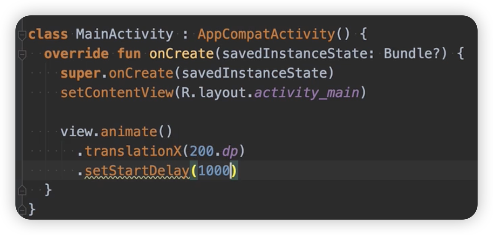
        
        ViewPropertyAnimator
        
    - ObjectAnimator 的使用
        
        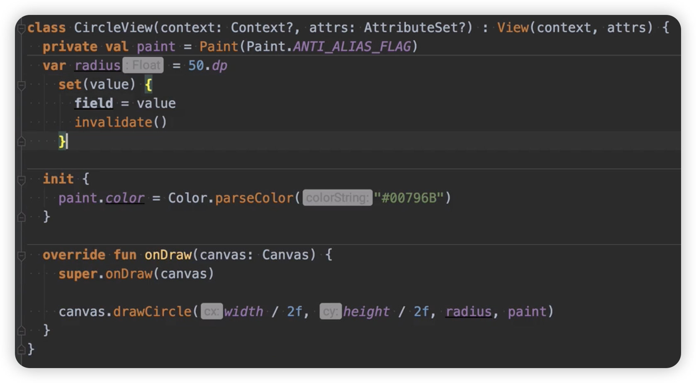
        
        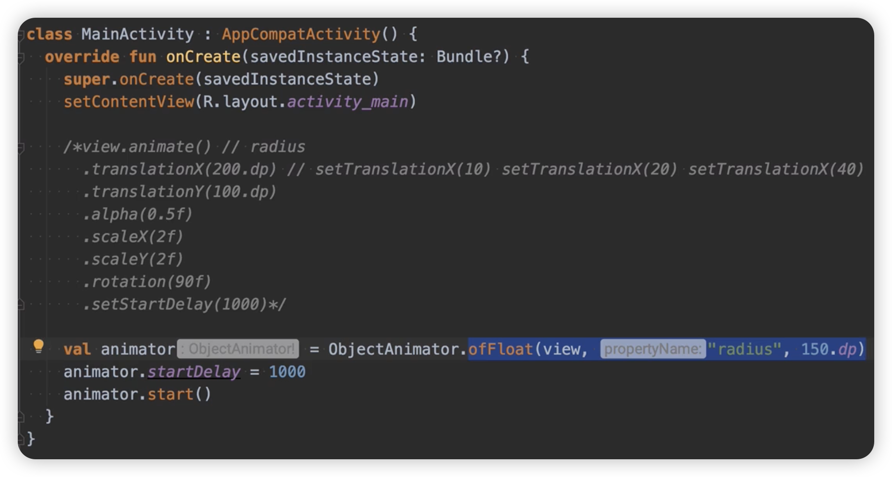
        
    - AnimationSet 的使用
        
        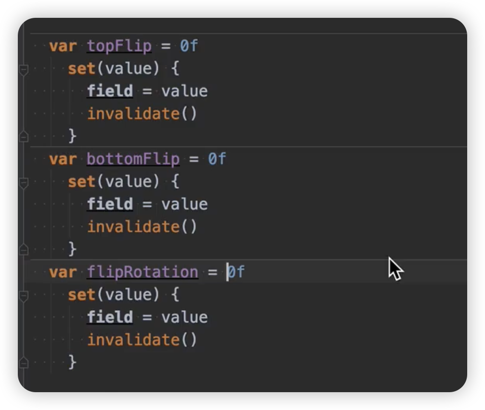
        
        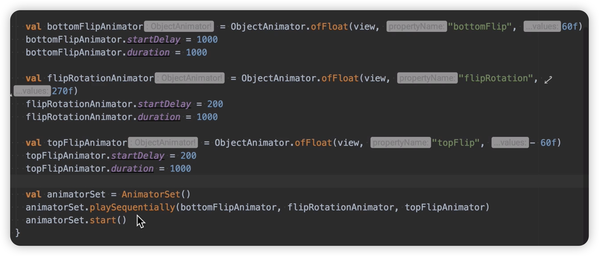
        
    - PropertyValuesHolder
        
        三个属性一起发生动画
        
        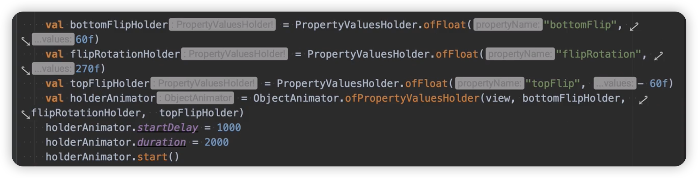
        
    - Keyframe
        
        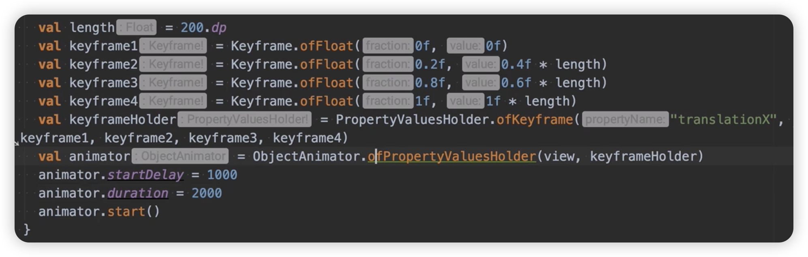
        
    - Interpolator(插值器)
    - TypeEvaluator(估值器)
        
        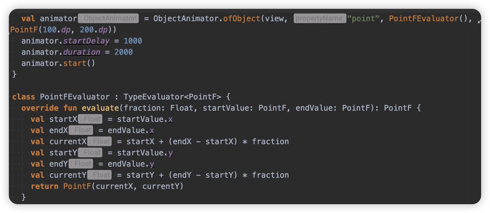
        
        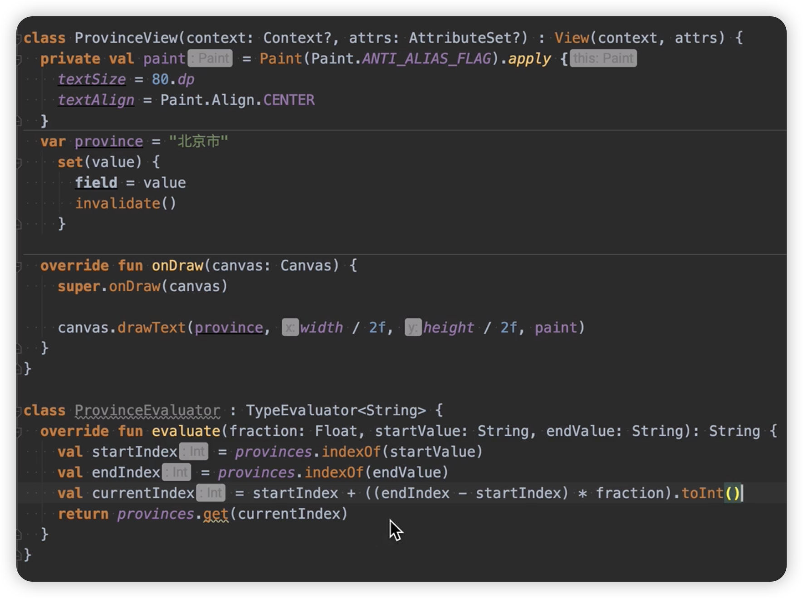
        
        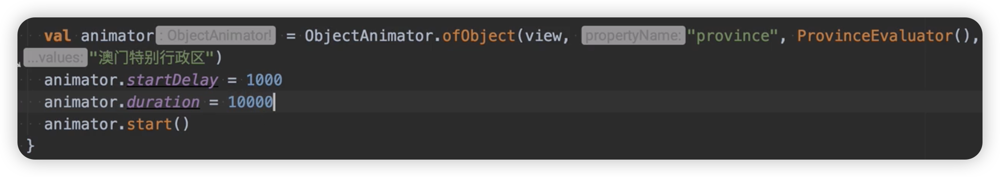
        
- 属性动画体系的总体设计
    
    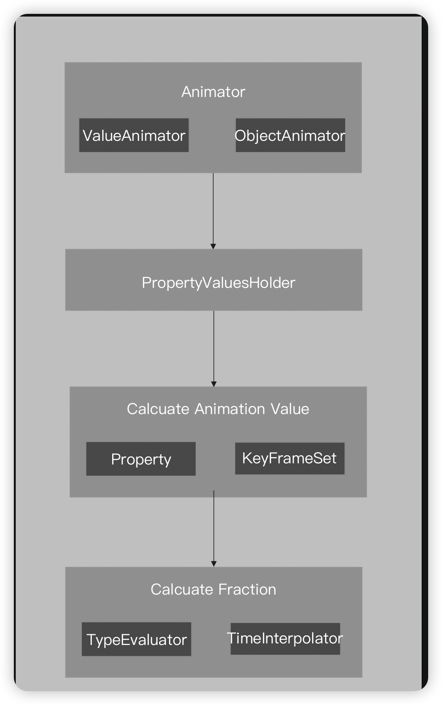
    
- 属性动画的核心类介绍
    - ValueAnimator：该类是Animator的子类，实现了动画的整个处理逻辑，也是属性动画最为核心的类。
    - ObjectAnimator：对象属性动画的操作类，继承自ValueAnimator，通过该类使用动画的形式操作对象的属性。
    - PropertyValuesHolder: PropertyValuesHolder是持有目标属性Property、setter和getter方法、 以及关键帧集合的类。
    - Property:属性对象，主要是定义了属性的set 和get 方法
    - KeyframeSet：存储一个动画的关键帧集合
    - TimeInterpolator：时间插值器，它的作用是根据时间流逝的百分比来计算出当前属性值改变的百分比，系统预置的有线性插值器 (LinearInterpolator)、加速減速插值器 (AccelerateDecelerateInterpolator) 和减速插值器 (DecelerateInterpolator)等。
    - TypeEvaluator:：TypeEvaluator 的中文翻译次类型估值算法，它的作用是根据当前属性改变 的百分比来计算改变后的属性值，系统预置的有针对整型属性 (IntEvaluator )、针对浮点型属性 (FloatEvaluator)和针对Color 属性 (ArgbEvaluator)。
- 属性动画的原理说明
    
    Android 属性动画详解与源码分析([https://www.jianshu.com/p/489abbc15241](https://www.jianshu.com/p/489abbc15241))
    (1) 动画是由许多的关键帧组成的，这是一个动画能够动起来的最基本的原理。
    (2) 属性动画的主要组成是 PropertyValuesHolder，而 PropertyValuesHolder 又封装了关键帧。
    (3) 动画开始后，其监听了 Choreographer 的 vsync，使得其可以不断地调用 doAnimationFrame() 来驱动动画执行每一个关键帧。
    (4) 每一次的 doAnimationFrame() 调用都会去计算时间插值，而通过时间插值器计算得到 fraction 又会传给估值器，使得估值器可以计算出属性的当前值。
    (5) 最后再通过 PropertyValuesHolder 所记录下的 Setter 方法，以反射的方式来修改目标属性的值。当属性值一帧一帧的改变后，形成连续后，便是我们所见到的动画。
    
    还有一种叫作：过渡动画
    

- 硬件加速
    
    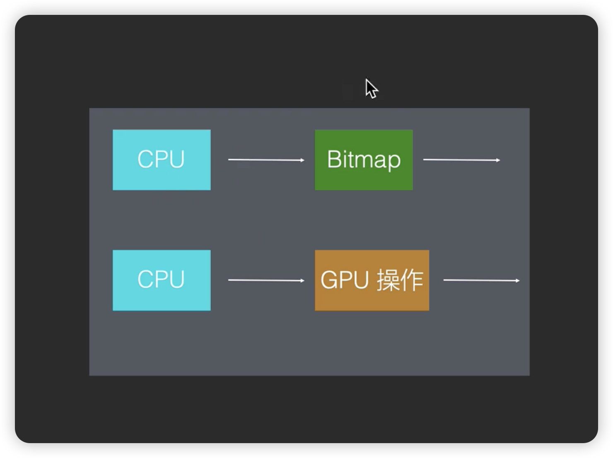
    
    - 软件绘制：使用 CPU 绘制
    - 硬件绘制：使用 GPU 绘制
        
        硬件加速很快，但是有兼容性问题；无法用 GPU 的简单操作，拼凑出软件绘制的效果。
        
        他最根本原因就是GPU它不是为Android绘制而生的，所以他无法提供完整功能。
        
        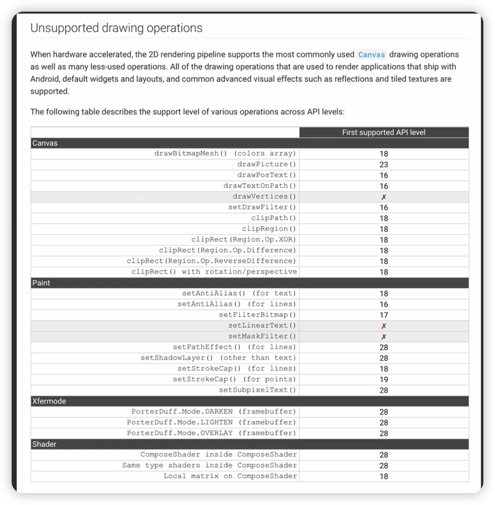
        
    - 离屏缓冲(存)
        - save layer
            
            每次绘制的时候，都创建一个离屏缓冲。
            
            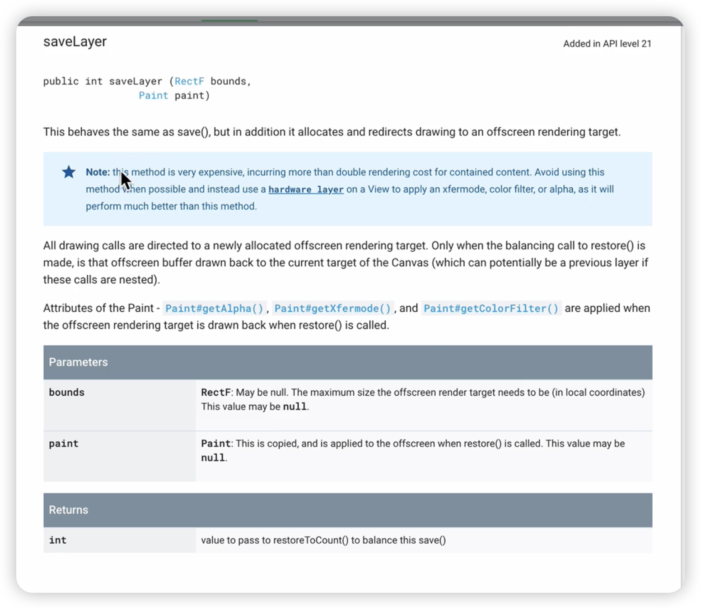
            
            API 介绍
            
            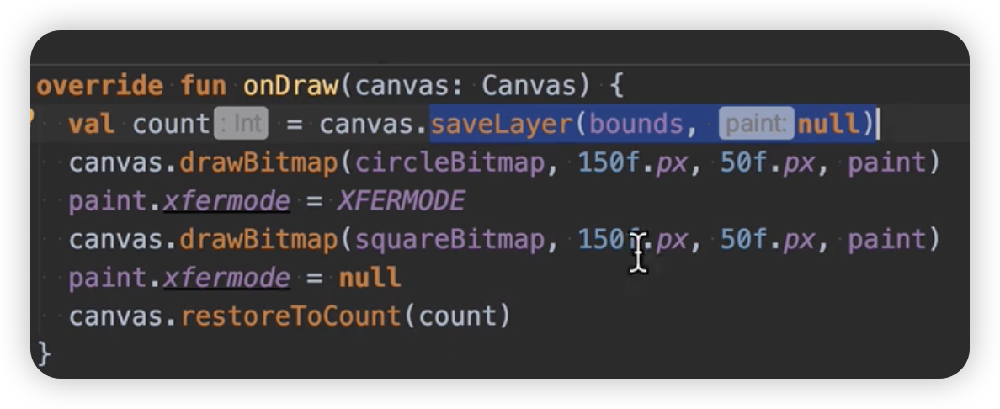
            
            具体使用
            
        - hardware layer
            
            为你的 view 创建一个 离屏缓冲，不是这次绘制。
            
            view.setLayerType 的 调用会导致界面的重绘。
            
            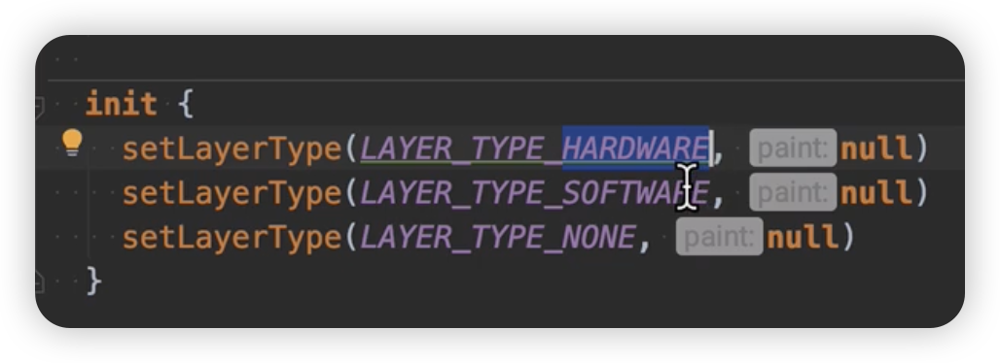
            
            - LAYER_TYPE_HARDWARE：开启View 的离屏缓冲，并且使用硬件加速来绘制。
            - LAYER_TYPE_SOFTWARE：开启 View 的离屏缓冲，同时使用软件绘制来实现。
            - LAYER_TYPE_NON：关闭 View 的离屏缓冲。
            
            1. 可以application标签下，配置hardwareAccelerated(默认就是开启)
            2. Android 可以开启和关闭硬件加速
            3. 但是没有给出View级别的配置硬件加速的开关，如果你开启了，就没有办法就某一个 View 进行关闭。
            4. 同时 Android它提供 一个功能，就是一个 View 单独设置离屏缓冲，而且这个离屏缓冲，你可以选择使用硬件来绘制，还是软件来绘制。
            5. 如果你设置了用软件来绘制这个离屏缓冲，然后这个离屏缓冲就会被软件来绘制。然后他就会就是这个离屏缓冲，稍候稍后也会用来去显示这个view。那么就是间接对这个 View使用软件绘制。
            6. 给 View 通过setLayerType(LAYER_TYPE_SOFTWARE, null)设置软件的离屏缓冲，就在实质上对这个View关闭了硬件加速。
            
            <aside>
            💡 使用这种方式来关闭硬件加速就成了Android唯一的对view级别关闭硬件加速的方式了
            
            </aside>
            
            临时开启硬件加速，动画结束之后，在关闭。
            
            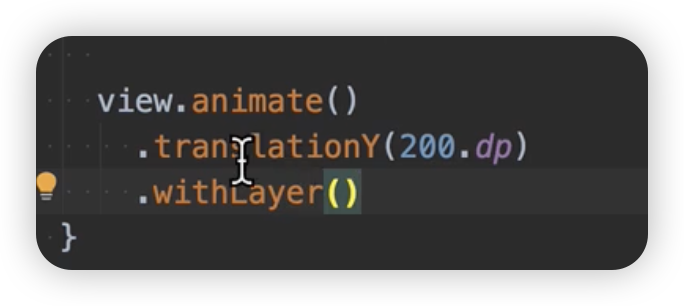