# 性能优化-对于原理的应用

性能优化的本质：充分且合理地使用硬件资源，让应用程序表现更好。

找工作角度：原理+方案+**开源项目源码(KOOM+LeakCanary+Matrix)**

问题：回答知识点、框架

原因： 

ANR

文件的检测,data/anr/traces.txt 

- ANR问题
    - 解决 ANR 问题，一般从三个方面着手。
        - 开发阶段：通过工具检查各个方法的耗时，卡顿情况，发现一处修改一处。
        - 线上阶段：这个阶段主要依靠监控工具发现ANR并上报，比如matrix。
        - 分析阶段：如果线上用户发生ANR，并且你获取了一份日志，这就涉及了本文要分享的内容——ANR日志分析技巧。
- 内存优化
    
    LeackCanary
    
    Koom
    
    内存泄露
    
    - adb shell总结
        - adb shell getprop ro.product.model
            
            ```bash
            adb shell getprop ro.product.model
            Pixel XL
            ```
            
        - adb shell dumpsys battery
            
            ```bash
            adb shell dumpsys battery
            Current Battery Service state:
              AC powered: true
              USB powered: false
              Wireless powered: false
              Max charging current: 0
              Max charging voltage: 0
              Charge counter: 0
              status: 5
              health: 1
              present: true
              level: 100
              scale: 100
              voltage: 0
              temperature: 0
              technology:
            ```
            
        - adb shell wm size
            
            ```bash
            adb shell wm size
            Physical size: 1440x2560
            ```
            
        - adb shell wm density
            
            ```bash
            adb shell wm density
            Physical density: 560
            ```
            
        - adb shell dumpsys window displays
            
            ```bash
            adb shell dumpsys window displays
            WINDOW MANAGER DISPLAY CONTENTS (dumpsys window displays)
              Display: mDisplayId=0 (organized)
                init=1440x2560 560dpi mMinSizeOfResizeableTaskDp=220 cur=1440x2560 app=1440x2392 rng=1440x1356-2392x2308
                deferred=false mLayoutNeeded=false mTouchExcludeRegion=SkRegion((0,0,1440,2560))
            
              mLastOrientationSource=WindowedMagnification:0:31@96363162
              deepestLastOrientationSource=ActivityRecord{b5a2694 u0 com.android.launcher3/.uioverrides.QuickstepLauncher} t9}
              overrideConfig={1.0 310mcc270mnc [zh_CN_#Hans,en_US] ldltr sw411dp w411dp h659dp 560dpi nrml port finger qwerty/v/v -nav/h winConfig={ mBounds=Rect(0, 0 - 1440, 2560) mAppBounds=Rect(0, 0 - 1440, 2392) mMaxBounds=Rect(0, 0 - 1440, 2560) mDisplayRotation=ROTATION_0 mWindowingMode=fullscreen mDisplayWindowingMode=fullscreen mActivityType=undefined mAlwaysOnTop=undefined mRotation=ROTATION_0} s.47 fontWeightAdjustment=0}
              mLayoutSeq=163
              mCurrentFocus=Window{924d873 u0 com.android.quicksearchbox/com.android.quicksearchbox.SearchActivity}
              mFocusedApp=ActivityRecord{9b0c883 u0 com.android.quicksearchbox/.SearchActivity} t10}
            
              mHoldScreenWindow=null
              mObscuringWindow=Window{c9a77e4 u0 com.android.systemui.wallpapers.ImageWallpaper}
              mLastWakeLockHoldingWindow=null
              mLastWakeLockObscuringWindow=null
            
              displayId=0
              mWallpaperTarget=Window{e2723ca u0 com.android.launcher3/com.android.launcher3.uioverrides.QuickstepLauncher}
              mLastWallpaperX=0.0 mLastWallpaperY=0.5
            
              Display areas in top down Z order:
                * Leaf:36:36
                * HideDisplayCutout:32:35
                  * OneHanded:34:35
                    * FullscreenMagnification:34:35
                      * Leaf:34:35
                  * FullscreenMagnification:33:33
                    * Leaf:33:33
                  * OneHanded:32:32
                    * Leaf:32:32
                * WindowedMagnification:0:31
                  * HideDisplayCutout:26:31
                    * OneHanded:26:31
                      * FullscreenMagnification:29:31
                        * Leaf:29:31
                      * Leaf:28:28
                      * FullscreenMagnification:26:27
                        * Leaf:26:27
                  * Leaf:24:25
                  * HideDisplayCutout:18:23
                    * OneHanded:18:23
                      * FullscreenMagnification:18:23
                        * Leaf:18:23
                  * OneHanded:17:17
                    * FullscreenMagnification:17:17
                      * Leaf:17:17
                  * HideDisplayCutout:16:16
                    * OneHanded:16:16
                      * FullscreenMagnification:16:16
                        * Leaf:16:16
                  * OneHanded:15:15
                    * FullscreenMagnification:15:15
                      * Leaf:15:15
                  * HideDisplayCutout:0:14
                    * OneHanded:0:14
                      * ImePlaceholder:13:14
                        * ImeContainer
                      * FullscreenMagnification:0:12
                        * Leaf:3:12
                        * DefaultTaskDisplayArea (organized)
                        * Leaf:0:1
            
              Task display areas in top down Z order:
                TaskDisplayArea DefaultTaskDisplayArea
                  overrideConfig={0.0 ?mcc?mnc ?localeList ?layoutDir ?swdp ?wdp ?hdp ?density ?lsize ?long ?ldr ?wideColorGamut ?orien ?uimode ?night ?touch ?keyb/?/? ?nav/? winConfig={ mBounds=Rect(0, 0 - 0, 0) mAppBounds=null mMaxBounds=Rect(0, 0 - 0, 0) mDisplayRotation=undefined mWindowingMode=fullscreen mDisplayWindowingMode=fullscreen mActivityType=undefined mAlwaysOnTop=undefined mRotation=undefined} ?fontWeightAdjustment}
                  mPreferredTopFocusableRootTask=Task{303cf3d #10 type=standard A=10054:com.android.quicksearchbox}
                  mLastFocusedRootTask=Task{303cf3d #10 type=standard A=10054:com.android.quicksearchbox}
                  Application tokens in top down Z order:
                  * Task{303cf3d #10 type=standard A=10054:com.android.quicksearchbox U=0 visible=true visibleRequested=true mode=fullscreen translucent=true sz=1}
                    bounds=[0,0][1440,2560]
                    * ActivityRecord{9b0c883 u0 com.android.quicksearchbox/.SearchActivity} t10}
                  * Task{89d65a7 #1 type=home U=0 visible=true visibleRequested=true mode=fullscreen translucent=false sz=1}
                    bounds=[0,0][1440,2560]
                    * Task{a8070a6 #9 type=home I=com.android.launcher3/.uioverrides.QuickstepLauncher U=0 rootTaskId=1 visible=true visibleRequested=true mode=fullscreen translucent=false sz=1}
                      bounds=[0,0][1440,2560]
                      * ActivityRecord{b5a2694 u0 com.android.launcher3/.uioverrides.QuickstepLauncher} t9}
                  * Task{8f06517 #3 type=undefined U=0 visible=false visibleRequested=false mode=fullscreen translucent=true sz=2}
                    bounds=[0,0][1440,2560]
                    * Task{bd82570 #5 type=undefined U=0 rootTaskId=3 visible=false visibleRequested=false mode=multi-window translucent=true sz=0}
                      bounds=[0,2560][1440,3840]
                    * Task{3f23d04 #4 type=undefined U=0 rootTaskId=3 visible=false visibleRequested=false mode=multi-window translucent=true sz=0}
                      bounds=[0,0][1440,2560]
            
              no ScreenRotationAnimation
            
              rootHomeTask=Task=1
            
              PinnedTaskController
                mIsImeShowing=false
                mImeHeight=0
                mMinAspectRatio=0.41841003
                mMaxAspectRatio=2.39
            
              DisplayFrames w=1440 h=2560 r=0
            
              DisplayPolicy
                mCarDockEnablesAccelerometer=true mDeskDockEnablesAccelerometer=true
                mDockMode=EXTRA_DOCK_STATE_UNDOCKED mLidState=LID_ABSENT
                mAwake=true mScreenOnEarly=true mScreenOnFully=true
                mKeyguardDrawComplete=true mWindowManagerDrawComplete=true
                mHdmiPlugged=false
                mLastBehavior=DEFAULT
                mShowingDream=false mDreamingLockscreen=false
                mStatusBar=Window{606a048 u0 StatusBar}
                mExpandedPanel=Window{23c9d2e u0 NotificationShade}
                isKeyguardShowing=false
                mNavigationBar=Window{cad34f8 u0 NavigationBar0}
                mNavBarOpacityMode=0
                mNavigationBarCanMove=true
                mNavigationBarPosition=4
                mFocusedWindow=Window{924d873 u0 com.android.quicksearchbox/com.android.quicksearchbox.SearchActivity}
                mTopFullscreenOpaqueWindowState=Window{924d873 u0 com.android.quicksearchbox/com.android.quicksearchbox.SearchActivity}
                mSystemBarColorApps={ActivityRecord{9b0c883 u0 com.android.quicksearchbox/.SearchActivity} t10}}
                mNavBarColorWindowCandidate=Window{924d873 u0 com.android.quicksearchbox/com.android.quicksearchbox.SearchActivity}
                mNavBarBackgroundWindow=Window{924d873 u0 com.android.quicksearchbox/com.android.quicksearchbox.SearchActivity}
                mLastStatusBarAppearanceRegions=
                  AppearanceRegion{ bounds=[0,0][1440,2560]}
                mLastLetterboxDetails=
                mStatusBarBackgroundWindows=
                  Window{924d873 u0 com.android.quicksearchbox/com.android.quicksearchbox.SearchActivity}
                mTopIsFullscreen=false
                mForceShowNavigationBarEnabled=false mAllowLockscreenWhenOn=false
                mRemoteInsetsControllerControlsSystemBars=false
                mDecorInsetsInfo:
                  ROTATION_0={nonDecorInsets=Rect(0, 0 - 0, 168), configInsets=Rect(0, 84 - 0, 168), nonDecorFrame=Rect(0, 0 - 1440, 2392), configFrame=Rect(0, 84 - 1440, 2392)}
                  ROTATION_90={nonDecorInsets=Rect(0, 0 - 168, 0), configInsets=Rect(0, 84 - 168, 0), nonDecorFrame=Rect(0, 0 - 2392, 1440), configFrame=Rect(0, 84 - 2392, 1440)}
                  ROTATION_180={nonDecorInsets=Rect(0, 0 - 0, 168), configInsets=Rect(0, 84 - 0, 168), nonDecorFrame=Rect(0, 0 - 1440, 2392), configFrame=Rect(0, 84 - 1440, 2392)}
                  ROTATION_270={nonDecorInsets=Rect(168, 0 - 0, 0), configInsets=Rect(168, 84 - 0, 0), nonDecorFrame=Rect(168, 0 - 2560, 1440), configFrame=Rect(168, 84 - 2560, 1440)}
                SystemGestures:
                  mDisplayCutoutTouchableRegionSize=0
                  mSwipeStartThreshold=Rect(84, 84 - 84, 84)
                  mSwipeDistanceThreshold=84
                Looper state:
                  Looper (android.ui, tid 21) {ed3164e}
                    (Total messages: 0, polling=true, quitting=false)
            
              DisplayRotation
                mCurrentAppOrientation=SCREEN_ORIENTATION_NOSENSOR
                mLastOrientation=5
                mRotation=0 mDeferredRotationPauseCount=0
                mLandscapeRotation=ROTATION_90 mSeascapeRotation=ROTATION_270
                mPortraitRotation=ROTATION_0 mUpsideDownRotation=ROTATION_180
                mSupportAutoRotation=true
                WindowOrientationListener
                  mEnabled=true
                  mCurrentRotation=ROTATION_0
                  mSensorType=null
                  mSensor={Sensor name="Genymotion Accelerometer", vendor="Genymobile", version=1, type=1, maxRange=19.6133, resolution=0.009576807, power=0.57, minDelay=5000}
                  mRate=2
                  AccelSensorJudge
                    mProposedRotation=0
                    mPredictedRotation=0
                    mLastFilteredX=0.0
                    mLastFilteredY=9.810242
                    mLastFilteredZ=0.0
                    mLastFilteredTimestampNanos=18174182038082 (7.91575ms ago)
                    mTiltHistory={last: 0.0}
                    mFlat=false
                    mSwinging=false
                    mAccelerating=false
                    mOverhead=false
                    mTouched=false
                    mTiltToleranceConfig=[[-25, 70], [-25, 65], [-25, 60], [-25, 65]]
            
                mCarDockRotation=-1 mDeskDockRotation=-1
                mUserRotationMode=USER_ROTATION_FREE mUserRotation=ROTATION_0 mCameraRotationMode=0 mAllowAllRotations=unknown
                mDemoHdmiRotation=ROTATION_90 mDemoHdmiRotationLock=false mUndockedHdmiRotation=-1
                mLidOpenRotation=-1
                mFixedToUserRotation=false
            
              InputConsumers:
                name=recents_animation_input_consumer pid=2389 user=UserHandle{0}
            
              WindowInsetsStateController
                InsetsState
                  mDisplayFrame=Rect(0, 0 - 1440, 2560)
                  mDisplayCutout=DisplayCutout{insets=Rect(0, 0 - 0, 0) waterfall=Insets{left=0, top=0, right=0, bottom=0} boundingRect={Bounds=[Rect(0, 0 - 0, 0), Rect(0, 0 - 0, 0), Rect(0, 0 - 0, 0), Rect(0, 0 - 0, 0)]} cutoutPathParserInfo={CutoutPathParserInfo{displayWidth=0 displayHeight=0 physicalDisplayWidth=0 physicalDisplayHeight=0 density={0.0} cutoutSpec={} rotation={0} scale={0.0} physicalPixelDisplaySizeRatio={0.0}}}}
                  mRoundedCorners=RoundedCorners{[RoundedCorner{position=TopLeft, radius=0, center=Point(0, 0)}, RoundedCorner{position=TopRight, radius=0, center=Point(0, 0)}, RoundedCorner{position=BottomRight, radius=0, center=Point(0, 0)}, RoundedCorner{position=BottomLeft, radius=0, center=Point(0, 0)}]}
                  mRoundedCornerFrame=Rect(0, 0 - 0, 0)
                  mPrivacyIndicatorBounds=PrivacyIndicatorBounds {static bounds=Rect(1104, 0 - 1391, 84) rotation=0}
                    InsetsSource type=ITYPE_STATUS_BAR frame=[0,0][1440,84] visible=true insetsRoundedCornerFrame=false
                    InsetsSource type=ITYPE_NAVIGATION_BAR frame=[0,2392][1440,2560] visible=true insetsRoundedCornerFrame=false
                    InsetsSource type=ITYPE_LEFT_GESTURES frame=[0,0][0,2560] visible=true insetsRoundedCornerFrame=false
                    InsetsSource type=ITYPE_RIGHT_GESTURES frame=[1440,0][1440,2560] visible=true insetsRoundedCornerFrame=false
                    InsetsSource type=ITYPE_TOP_MANDATORY_GESTURES frame=[0,0][1440,84] visible=true insetsRoundedCornerFrame=false
                    InsetsSource type=ITYPE_BOTTOM_MANDATORY_GESTURES frame=[0,2392][1440,2560] visible=true insetsRoundedCornerFrame=false
                    InsetsSource type=ITYPE_TOP_TAPPABLE_ELEMENT frame=[0,0][1440,84] visible=true insetsRoundedCornerFrame=false
                    InsetsSource type=ITYPE_BOTTOM_TAPPABLE_ELEMENT frame=[0,2392][1440,2560] visible=true insetsRoundedCornerFrame=false
                    InsetsSource type=ITYPE_IME frame=[0,2392][1440,2560] visibleFrame=[0,2560][1440,2560] visible=true insetsRoundedCornerFrame=false
                Control map:
                  ITYPE_IME -> Window{924d873 u0 com.android.quicksearchbox/com.android.quicksearchbox.SearchActivity}
                  ITYPE_STATUS_BAR -> Window{924d873 u0 com.android.quicksearchbox/com.android.quicksearchbox.SearchActivity}
                InsetsSourceProviders:
                  ImeInsetsSourceProvider
                    mSource=InsetsSource type=ITYPE_IME frame=[0,2392][1440,2560] visibleFrame=[0,2560][1440,2560] visible=true insetsRoundedCornerFrame=false
                    mSourceFrame=Rect(0, 2392 - 1440, 2560)
                    mControl=InsetsSourceControl type=ITYPE_IME mLeash=Surface(name=Surface(name=933172c InputMethod)/@0xf809a56 - animation-leash of insets_animation)/@0xf00736f mInitiallyVisible=false mSurfacePosition=Point(0, 84) mInsetsHint=Insets{left=0, top=0, right=0, bottom=168} mSkipAnimationOnce=false
                    mIsLeashReadyForDispatching=true
                    mWindowContainer=Window{933172c u0 InputMethod}
                    mAdapter=ControlAdapter mCapturedLeash=Surface(name=Surface(name=933172c InputMethod)/@0xf809a56 - animation-leash of insets_animation)/@0xf00736f
                    mControlTarget=Window{924d873 u0 com.android.quicksearchbox/com.android.quicksearchbox.SearchActivity}
                    mImeShowing=true
                  WindowContainerInsetsSourceProvider
                    mSource=InsetsSource type=ITYPE_BOTTOM_TAPPABLE_ELEMENT frame=[0,2392][1440,2560] visible=true insetsRoundedCornerFrame=false
                    mSourceFrame=Rect(0, 2392 - 1440, 2560)
                    mIsLeashReadyForDispatching=true
                    mWindowContainer=Window{cad34f8 u0 NavigationBar0}
                  WindowContainerInsetsSourceProvider
                    mSource=InsetsSource type=ITYPE_TOP_TAPPABLE_ELEMENT frame=[0,0][1440,84] visible=true insetsRoundedCornerFrame=false
                    mSourceFrame=Rect(0, 0 - 1440, 84)
                    mIsLeashReadyForDispatching=true
                    mWindowContainer=Window{606a048 u0 StatusBar}
                  WindowContainerInsetsSourceProvider
                    mSource=InsetsSource type=ITYPE_BOTTOM_MANDATORY_GESTURES frame=[0,2392][1440,2560] visible=true insetsRoundedCornerFrame=false
                    mSourceFrame=Rect(0, 2392 - 1440, 2560)
                    mIsLeashReadyForDispatching=true
                    mWindowContainer=Window{cad34f8 u0 NavigationBar0}
                  WindowContainerInsetsSourceProvider
                    mSource=InsetsSource type=ITYPE_TOP_MANDATORY_GESTURES frame=[0,0][1440,84] visible=true insetsRoundedCornerFrame=false
                    mSourceFrame=Rect(0, 0 - 1440, 84)
                    mIsLeashReadyForDispatching=true
                    mWindowContainer=Window{606a048 u0 StatusBar}
                  WindowContainerInsetsSourceProvider
                    mSource=InsetsSource type=ITYPE_RIGHT_GESTURES frame=[1440,0][1440,2560] visible=true insetsRoundedCornerFrame=false
                    mSourceFrame=Rect(1440, 0 - 1440, 2560)
                    mIsLeashReadyForDispatching=true
                    mWindowContainer=Window{cad34f8 u0 NavigationBar0}
                  WindowContainerInsetsSourceProvider
                    mSource=InsetsSource type=ITYPE_LEFT_GESTURES frame=[0,0][0,2560] visible=true insetsRoundedCornerFrame=false
                    mSourceFrame=Rect(0, 0 - 0, 2560)
                    mIsLeashReadyForDispatching=true
                    mWindowContainer=Window{cad34f8 u0 NavigationBar0}
                  WindowContainerInsetsSourceProvider
                    mSource=InsetsSource type=ITYPE_NAVIGATION_BAR frame=[0,2392][1440,2560] visible=true insetsRoundedCornerFrame=false
                    mSourceFrame=Rect(0, 2392 - 1440, 2560)
                    mOverrideFrames={2011=Rect(0, 2392 - 1440, 2560)}
                    mIsLeashReadyForDispatching=true
                    mWindowContainer=Window{cad34f8 u0 NavigationBar0}
                  WindowContainerInsetsSourceProvider
                    mSource=InsetsSource type=ITYPE_STATUS_BAR frame=[0,0][1440,84] visible=true insetsRoundedCornerFrame=false
                    mSourceFrame=Rect(0, 0 - 1440, 84)
                    mControl=InsetsSourceControl type=ITYPE_STATUS_BAR mLeash=Surface(name=Surface(name=606a048 StatusBar)/@0xa905ac7 - animation-leash of insets_animation)/@0xd37287c mInitiallyVisible=true mSurfacePosition=Point(0, 0) mInsetsHint=Insets{left=0, top=84, right=0, bottom=0} mSkipAnimationOnce=false
                    mIsLeashReadyForDispatching=true
                    mWindowContainer=Window{606a048 u0 StatusBar}
                    mAdapter=ControlAdapter mCapturedLeash=Surface(name=Surface(name=606a048 StatusBar)/@0xa905ac7 - animation-leash of insets_animation)/@0xd37287c
                    mControlTarget=Window{924d873 u0 com.android.quicksearchbox/com.android.quicksearchbox.SearchActivity}
            
            ```
            
        - adb shell settings get secure android_id
            
            ```bash
            adb shell settings get secure android_id
            a897454adc96692e
            ```
            
        - adb shell getprop ro.build.version.release
            
            ```bash
            adb shell getprop ro.build.version.release
            13
            ```
            
        - adb shell cat /proc/cpuinfo
            
            ```bash
            adb shell cat /proc/cpuinfo
            processor	: 0
            BogoMIPS	: 48.00
            Features	: fp asimd evtstrm aes pmull sha1 sha2 crc32 atomics fphp asimdhp cpuid asimdrdm jscvt fcma lrcpc dcpop sha3 asimddp sha512 asimdfhm dit uscat ilrcpc flagm sb paca pacg dcpodp flagm2 frint
            CPU implementer	: 0x61
            CPU architecture: 8
            CPU variant	: 0x0
            CPU part	: 0x000
            CPU revision	: 0
            
            processor	: 1
            BogoMIPS	: 48.00
            Features	: fp asimd evtstrm aes pmull sha1 sha2 crc32 atomics fphp asimdhp cpuid asimdrdm jscvt fcma lrcpc dcpop sha3 asimddp sha512 asimdfhm dit uscat ilrcpc flagm sb paca pacg dcpodp flagm2 frint
            CPU implementer	: 0x61
            CPU architecture: 8
            CPU variant	: 0x0
            CPU part	: 0x000
            CPU revision	: 0
            
            processor	: 2
            BogoMIPS	: 48.00
            Features	: fp asimd evtstrm aes pmull sha1 sha2 crc32 atomics fphp asimdhp cpuid asimdrdm jscvt fcma lrcpc dcpop sha3 asimddp sha512 asimdfhm dit uscat ilrcpc flagm sb paca pacg dcpodp flagm2 frint
            CPU implementer	: 0x61
            CPU architecture: 8
            CPU variant	: 0x0
            CPU part	: 0x000
            CPU revision	: 0
            
            processor	: 3
            BogoMIPS	: 48.00
            Features	: fp asimd evtstrm aes pmull sha1 sha2 crc32 atomics fphp asimdhp cpuid asimdrdm jscvt fcma lrcpc dcpop sha3 asimddp sha512 asimdfhm dit uscat ilrcpc flagm sb paca pacg dcpodp flagm2 frint
            CPU implementer	: 0x61
            CPU architecture: 8
            CPU variant	: 0x0
            CPU part	: 0x000
            CPU revision	: 0
            
            ```
            
        - adb shell cat /system/build.prop
            
            ```bash
            adb shell cat /system/build.prop
            ####################################
            # from generate-common-build-props
            # These properties identify this partition image.
            ####################################
            ro.system.product.cpu.abilist=arm64-v8a,armeabi-v7a,armeabi
            ro.system.product.cpu.abilist32=armeabi-v7a,armeabi
            ro.system.product.cpu.abilist64=arm64-v8a
            ro.system.build.date=Tue Nov 21 07:21:39 UTC 2023
            ro.system.build.date.utc=1700551299
            ro.system.build.id=TQ2B.230505.005.A1
            ro.system.build.version.incremental=252
            ro.system.build.version.release=13
            ro.system.build.version.release_or_codename=13
            ro.system.build.version.sdk=33
            ####################################
            # from out/target/product/motion_phone_arm64/obj/PACKAGING/system_build_prop_intermediates/buildinfo.prop
            ####################################
            # begin build properties
            # autogenerated by buildinfo.sh
            ro.build.id=TQ2B.230505.005.A1
            ro.build.version.incremental=252
            ro.build.version.sdk=33
            ro.build.version.preview_sdk=0
            ro.build.version.preview_sdk_fingerprint=REL
            ro.build.version.codename=REL
            ro.build.version.all_codenames=REL
            ro.build.version.known_codenames=Base,Base11,Cupcake,Donut,Eclair,Eclair01,EclairMr1,Froyo,Gingerbread,GingerbreadMr1,Honeycomb,HoneycombMr1,HoneycombMr2,IceCreamSandwich,IceCreamSandwichMr1,JellyBean,JellyBeanMr1,JellyBeanMr2,Kitkat,KitkatWatch,Lollipop,LollipopMr1,M,N,NMr1,O,OMr1,P,Q,R,S,Sv2,Tiramisu
            ro.build.version.release=13
            ro.build.version.release_or_codename=13
            ro.build.version.release_or_preview_display=13
            ro.build.version.security_patch=2023-05-05
            ro.build.version.base_os=
            ro.build.version.min_supported_target_sdk=23
            ro.build.date=Tue Nov 21 07:21:39 UTC 2023
            ro.build.date.utc=1700551299
            ro.build.user=genymotion
            ro.build.host=90bdee6b97e2
            ro.build.flavor=motion_phone_arm64-userdebug
            # ro.product.cpu.abi and ro.product.cpu.abi2 are obsolete,
            # use ro.product.cpu.abilist instead.
            ro.product.cpu.abi=arm64-v8a
            ro.product.locale=en-US
            ro.wifi.channels=
            # ro.build.product is obsolete; use ro.product.device
            ro.build.product=motion_phone_arm64
            # Do not try to parse description or thumbprint
            # end build properties
            ####################################
            # from device/genymotion/motion_phone_arm64/system.prop
            ####################################
            #
            # system.prop for Genymotion
            #
            # Disable opengl Zygote preloading to avoid opengl problems
            ro.zygote.disable_gl_preload=true
            dalvik.vm.heapsize=256m
            persist.service.adb.enable=1
            ro.opengles.version=131072
            ro.bq.gpu_to_cpu_unsupported=1
            # Add device version
            ro.genymotion.device.version=1
            #
            # Capabilities
            # (see device.mk for the ones missing here)
            #
            # Battery sensor
            ro.genyd.caps.bat=on
            # GPS sensor
            ro.genyd.caps.gps=on
            # Accelerometer sensor
            ro.genyd.caps.acc=on
            # Webcam / camera sensor
            ro.genyd.caps.cam=on
            # Screencast / screenshot capability
            ro.genyd.caps.scr=on
            # Remote controller capability
            ro.genyd.caps.rmt=on
            # DeviceID / IMEI and AndroidID emulation
            ro.genyd.caps.did=on
            # Network control capability
            ro.genyd.caps.net=on
            # Disk IO throttling capability
            ro.genyd.caps.diskio=on
            ro.hardware.hwcomposer=ranchu
            ro.hardware.gralloc=ranchu
            ro.hardware.vulkan=ranchu
            ####################################
            # from variable ADDITIONAL_SYSTEM_PROPERTIES
            ####################################
            vendor.rild.libargs=-s/dev/socket/baseband_ril
            vendor.rild.libpath=/vendor/lib64/libreference-ril.so
            ro.genyd.caps.baseband=on
            ro.build.shutdown_timeout=3
            ro.genymotion.version=3.1.0
            ro.product.first_api_level=16
            ro.ril.hsxpa=1
            ro.ril.gprsclass=10
            persist.media.treble_omx=false
            ro.boot.vr=0
            persist.sys.root_access=3
            service.adb.root=1
            ro.genyd.caps.systempatcher=on
            debug.stagefright.ccodec=0
            vendor.bt.rootcanal_test_console=off
            ro.genyd.caps.mobilethrottling=on
            ro.genyd.caps.roundedcorners=on
            ro.hardware.fingerprint=genymotion
            ro.genyd.caps.biometrics=on
            ro.treble.enabled=true
            ro.actionable_compatible_property.enabled=true
            persist.debug.dalvik.vm.core_platform_api_policy=just-warn
            ro.postinstall.fstab.prefix=/system
            ro.secure=1
            security.perf_harden=1
            ro.allow.mock.location=0
            ro.debuggable=1
            dalvik.vm.lockprof.threshold=500
            net.bt.name=Android
            ####################################
            # from variable PRODUCT_SYSTEM_PROPERTIES
            ####################################
            debug.atrace.tags.enableflags=0
            persist.traced.enable=1
            dalvik.vm.image-dex2oat-Xms=64m
            dalvik.vm.image-dex2oat-Xmx=64m
            dalvik.vm.dex2oat-Xms=64m
            dalvik.vm.dex2oat-Xmx=512m
            dalvik.vm.usejit=true
            dalvik.vm.usejitprofiles=true
            dalvik.vm.dexopt.secondary=true
            dalvik.vm.dexopt.thermal-cutoff=2
            dalvik.vm.appimageformat=lz4
            ro.dalvik.vm.native.bridge=0
            pm.dexopt.first-boot=verify
            pm.dexopt.boot-after-ota=verify
            pm.dexopt.post-boot=extract
            pm.dexopt.install=speed-profile
            pm.dexopt.install-fast=skip
            pm.dexopt.install-bulk=speed-profile
            pm.dexopt.install-bulk-secondary=verify
            pm.dexopt.install-bulk-downgraded=verify
            pm.dexopt.install-bulk-secondary-downgraded=extract
            pm.dexopt.bg-dexopt=speed-profile
            pm.dexopt.ab-ota=speed-profile
            pm.dexopt.inactive=verify
            pm.dexopt.cmdline=verify
            pm.dexopt.shared=speed
            dalvik.vm.dex2oat-resolve-startup-strings=true
            dalvik.vm.dex2oat-max-image-block-size=524288
            dalvik.vm.minidebuginfo=true
            dalvik.vm.dex2oat-minidebuginfo=true
            dalvik.vm.madvise.vdexfile.size=104857600
            dalvik.vm.madvise.odexfile.size=104857600
            dalvik.vm.madvise.artfile.size=4294967295
            ####################################
            # from variable PRODUCT_SYSTEM_DEFAULT_PROPERTIES
            ####################################
            # Auto-added by post_process_props.py
            ro.build.description.geny-def=motion_phone_arm64-userdebug 13 TQ2B.230505.005.A1 252 test-keys
            # Auto-added by post_process_props.py
            ro.build.display.id.geny-def=motion_phone_arm64-userdebug 13 TQ2B.230505.005.A1 252 test-keys
            # Auto-added by post_process_props.py
            ro.build.type.geny-def=userdebug
            # Auto-added by post_process_props.py
            ro.build.tags.geny-def=test-keys
            # Auto-added by post_process_props.py
            ro.product.system.brand.geny-def=google
            # Auto-added by post_process_props.py
            ro.product.system.device.geny-def=motion_phone_arm64
            # Auto-added by post_process_props.py
            ro.product.system.manufacturer.geny-def=Genymobile
            # Auto-added by post_process_props.py
            ro.product.system.model.geny-def=Genymotion 'Phone' version
            # Auto-added by post_process_props.py
            ro.product.system.name.geny-def=motion_phone_arm64
            # Auto-added by post_process_props.py
            ro.system.build.fingerprint.geny-def=google/motion_phone_arm64/motion_phone_arm64:13/TQ2B.230505.005.A1/252:userdebug/test-keys
            # Auto-added by post_process_props.py
            ro.system.build.tags.geny-def=test-keys
            # Auto-added by post_process_props.py
            ro.system.build.type.geny-def=userdebug
            # Auto-added by post_process_props.py
            persist.sys.usb.config=adb
            # end of file
            ```
            
        - adb shell cat /proc/meminfo
            
            ```bash
            adb shell cat /proc/meminfo
            MemTotal:        4011452 kB
            MemFree:         1664116 kB
            MemAvailable:    2303548 kB
            Buffers:           60116 kB
            Cached:           887740 kB
            SwapCached:            0 kB
            Active:           283512 kB
            Inactive:        1688316 kB
            Active(anon):       6424 kB
            Inactive(anon):  1029412 kB
            Active(file):     277088 kB
            Inactive(file):   658904 kB
            Unevictable:        3448 kB
            Mlocked:            3448 kB
            SwapTotal:             0 kB
            SwapFree:              0 kB
            Dirty:                 0 kB
            Writeback:             0 kB
            AnonPages:        986372 kB
            Mapped:           582836 kB
            Shmem:              9360 kB
            KReclaimable:      79900 kB
            Slab:             175184 kB
            SReclaimable:      79900 kB
            SUnreclaim:        95284 kB
            KernelStack:       21328 kB
            PageTables:        50492 kB
            NFS_Unstable:          0 kB
            Bounce:                0 kB
            WritebackTmp:          0 kB
            CommitLimit:     2005724 kB
            Committed_AS:   25828652 kB
            VmallocTotal:   259653632 kB
            VmallocUsed:       29448 kB
            VmallocChunk:          0 kB
            Percpu:             4176 kB
            HardwareCorrupted:     0 kB
            AnonHugePages:    489472 kB
            ShmemHugePages:        0 kB
            ShmemPmdMapped:        0 kB
            FileHugePages:         0 kB
            FilePmdMapped:         0 kB
            CmaTotal:          32768 kB
            CmaFree:               0 kB
            HugePages_Total:       0
            HugePages_Free:        0
            HugePages_Rsvd:        0
            HugePages_Surp:        0
            Hugepagesize:       2048 kB
            Hugetlb:               0 kB
            ```
            
        - adb shell dumpsys meminfo
            
            ```bash
            adb shell dumpsys meminfo
            Applications Memory Usage (in Kilobytes):
            Uptime: 98715158 Realtime: 98715158
            
            Total RSS by process:
                377,060K: system (pid 1795)
                244,980K: com.google.android.gms.persistent (pid 2606)
                243,848K: com.google.android.gms (pid 2842)
                234,096K: com.android.systemui (pid 1999)
                197,820K: com.google.android.gms.unstable (pid 3633)
                191,468K: com.android.vending (pid 3005)
                184,596K: com.android.launcher3 (pid 2389 / activities)
                162,872K: zygote64 (pid 1454)
                161,436K: com.android.vending:background (pid 14559)
                150,272K: com.android.phone (pid 2174)
                140,916K: com.google.android.contacts (pid 15582)
                136,524K: android.ext.services (pid 2180)
                135,172K: com.android.bluetooth (pid 2096)
                134,688K: com.android.inputmethod.latin (pid 2525)
                129,332K: com.android.providers.media.module (pid 2542)
                128,080K: com.android.quicksearchbox (pid 2583 / activities)
                121,976K: com.android.networkstack.process (pid 2086)
                120,920K: com.android.permissioncontroller (pid 14384)
                118,036K: android.process.acore (pid 14400)
                117,096K: com.google.process.gservices (pid 2818)
                112,312K: com.google.process.gapps (pid 2913)
                108,676K: android.process.media (pid 15641)
                108,472K: com.android.providers.calendar (pid 7267)
                105,548K: com.google.android.partnersetup (pid 5083)
                105,280K: webview_zygote (pid 2162)
                104,396K: com.genymotion.genyd (pid 2578)
                103,320K: com.android.se (pid 2134)
                102,304K: com.android.smspush (pid 2351)
                101,964K: com.genymotion.settings (pid 2554)
                100,952K: com.genymotion.systempatcher (pid 2555)
                 98,312K: com.genymotion.tasklocker (pid 2566)
                 28,356K: surfaceflinger (pid 1507)
                 27,572K: mediaserver (pid 1573)
                 26,836K: media.extractor (pid 1559)
                 26,604K: cameraserver (pid 1549)
                 25,928K: audioserver (pid 1486)
                 19,760K: media.swcodec (pid 1582)
                 16,752K: android.hardware.graphics.composer@2.4-service (pid 1472)
                 15,896K: media.codec (pid 1576)
                 15,500K: adbd (pid 1601)
                 14,624K: keystore2 (pid 1223)
                 13,848K: android.hardware.camera.provider@2.4-service_64 (pid 1460)
                 13,468K: android.hardware.audio.service (pid 1457)
                 12,132K: netd (pid 1452)
                 11,484K: android.hardware.wifi@1.0-service (pid 1480)
                 10,904K: rild (pid 1579)
                 10,856K: init (pid 1)
                 10,300K: media.metrics (pid 1572)
                 10,176K: credstore (pid 1487)
                  9,404K: wpa_supplicant (pid 1995)
                  8,700K: vold (pid 1157)
                  8,552K: android.hardware.neuralnetworks@1.3-service-sample-all (pid 1477)
                  8,192K: ueventd (pid 787)
                  8,152K: android.hardware.gnss@1.0-service (pid 1470)
                  8,080K: android.hardware.graphics.allocator@2.0-service (pid 1471)
                  7,900K: gpuservice (pid 1491)
                  7,556K: init (pid 784)
                  7,452K: android.hardware.drm@1.4-service.clearkey (pid 1466)
                  7,388K: android.hardware.bluetooth@1.1-service.sim (pid 1459)
                  6,980K: logd (pid 1143)
                  6,896K: wificond (pid 1575)
                  6,836K: installd (pid 1558)
                  6,584K: android.hardware.keymaster@4.1-service (pid 1229)
                  6,544K: local_camera (pid 1284)
                  6,384K: local_camera (pid 1283)
                  6,292K: storaged (pid 1574)
                  6,276K: android.hardware.drm@1.0-service (pid 1465)
                  6,236K: hwservicemanager (pid 1146)
                  6,108K: gatekeeperd (pid 1583)
                  5,928K: statsd (pid 1451)
                  5,668K: hostapd_noaidl (pid 1734)
                  5,636K: genybaseband (pid 1500)
                  5,584K: prng_seeder (pid 1138)
                  5,568K: android.hardware.cas@1.2-service (pid 1461)
                  5,536K: android.system.suspend@1.0-service (pid 1222)
                  5,536K: sh (pid 1765)
                  5,484K: redis (pid 1139)
                  5,472K: incidentd (pid 1557)
                  5,380K: servicemanager (pid 1145)
                  5,368K: android.hardware.identity-service.example (pid 1481)
                  5,044K: local_opengl (pid 1282)
                  4,964K: android.hardware.gatekeeper@1.0-service.software (pid 1469)
                  4,676K: android.hardware.sensors@1.0-service (pid 1479)
                  4,516K: android.hardware.configstore@1.1-service (pid 1462)
                  4,512K: android.hardware.biometrics.fingerprint@2.1-service (pid 1585)
                  4,452K: vndservicemanager (pid 1148)
                  4,268K: android.hardware.health@2.0-service.genymotion (pid 1474)
                  4,244K: android.hardware.power.stats@1.0-service.mock (pid 1478)
                  4,200K: android.hardware.power-service.example (pid 1485)
                  4,168K: android.hardware.light@2.0-service (pid 1475)
                  4,152K: android.hardware.authsecret@1.0-service (pid 1458)
                  4,084K: batteryd (pid 2508)
                  4,064K: android.hardware.memtrack@1.0-service (pid 1476)
                  4,044K: dumpsys (pid 17160)
                  4,032K: android.hardware.atrace@1.0-service (pid 1224)
                  3,964K: android.hidl.allocator@1.0-service (pid 1456)
                  3,904K: traced (pid 1547)
                  3,868K: ip6tables-restore (pid 1483)
                  3,840K: systempatcher_native (pid 1508)
                  3,836K: lmkd (pid 1144)
                  3,820K: traced_probes (pid 1542)
                  3,664K: iptables-restore (pid 1482)
                  3,624K: logcat (pid 1771)
                  3,560K: vinput (pid 1509)
                  3,504K: network_profile (pid 1494)
                  3,504K: mdnsd (pid 1615)
                  3,416K: diskiod (pid 1488)
                  3,396K: process-tracker (pid 1792)
                  3,260K: settingsd (pid 1506)
                  3,176K: tombstoned (pid 1250)
                  3,056K: logwrapper (pid 1489)
                  2,956K: createns (pid 1269)
                    700K: su (pid 1540)
            
            Total RSS by OOM adjustment:
                913,288K: Native
                    162,872K: zygote64 (pid 1454)
                    105,280K: webview_zygote (pid 2162)
                     28,356K: surfaceflinger (pid 1507)
                     27,572K: mediaserver (pid 1573)
                     26,836K: media.extractor (pid 1559)
                     26,604K: cameraserver (pid 1549)
                     25,928K: audioserver (pid 1486)
                     19,760K: media.swcodec (pid 1582)
                     16,752K: android.hardware.graphics.composer@2.4-service (pid 1472)
                     15,896K: media.codec (pid 1576)
                     15,500K: adbd (pid 1601)
                     14,624K: keystore2 (pid 1223)
                     13,848K: android.hardware.camera.provider@2.4-service_64 (pid 1460)
                     13,468K: android.hardware.audio.service (pid 1457)
                     12,132K: netd (pid 1452)
                     11,484K: android.hardware.wifi@1.0-service (pid 1480)
                     10,904K: rild (pid 1579)
                     10,856K: init (pid 1)
                     10,300K: media.metrics (pid 1572)
                     10,176K: credstore (pid 1487)
                      9,404K: wpa_supplicant (pid 1995)
                      8,700K: vold (pid 1157)
                      8,552K: android.hardware.neuralnetworks@1.3-service-sample-all (pid 1477)
                      8,192K: ueventd (pid 787)
                      8,152K: android.hardware.gnss@1.0-service (pid 1470)
                      8,080K: android.hardware.graphics.allocator@2.0-service (pid 1471)
                      7,900K: gpuservice (pid 1491)
                      7,556K: init (pid 784)
                      7,452K: android.hardware.drm@1.4-service.clearkey (pid 1466)
                      7,388K: android.hardware.bluetooth@1.1-service.sim (pid 1459)
                      6,980K: logd (pid 1143)
                      6,896K: wificond (pid 1575)
                      6,836K: installd (pid 1558)
                      6,584K: android.hardware.keymaster@4.1-service (pid 1229)
                      6,544K: local_camera (pid 1284)
                      6,384K: local_camera (pid 1283)
                      6,292K: storaged (pid 1574)
                      6,276K: android.hardware.drm@1.0-service (pid 1465)
                      6,236K: hwservicemanager (pid 1146)
                      6,108K: gatekeeperd (pid 1583)
                      5,928K: statsd (pid 1451)
                      5,668K: hostapd_noaidl (pid 1734)
                      5,636K: genybaseband (pid 1500)
                      5,584K: prng_seeder (pid 1138)
                      5,568K: android.hardware.cas@1.2-service (pid 1461)
                      5,536K: android.system.suspend@1.0-service (pid 1222)
                      5,536K: sh (pid 1765)
                      5,484K: redis (pid 1139)
                      5,472K: incidentd (pid 1557)
                      5,380K: servicemanager (pid 1145)
                      5,368K: android.hardware.identity-service.example (pid 1481)
                      5,044K: local_opengl (pid 1282)
                      4,964K: android.hardware.gatekeeper@1.0-service.software (pid 1469)
                      4,676K: android.hardware.sensors@1.0-service (pid 1479)
                      4,516K: android.hardware.configstore@1.1-service (pid 1462)
                      4,512K: android.hardware.biometrics.fingerprint@2.1-service (pid 1585)
                      4,452K: vndservicemanager (pid 1148)
                      4,268K: android.hardware.health@2.0-service.genymotion (pid 1474)
                      4,244K: android.hardware.power.stats@1.0-service.mock (pid 1478)
                      4,200K: android.hardware.power-service.example (pid 1485)
                      4,168K: android.hardware.light@2.0-service (pid 1475)
                      4,152K: android.hardware.authsecret@1.0-service (pid 1458)
                      4,084K: batteryd (pid 2508)
                      4,064K: android.hardware.memtrack@1.0-service (pid 1476)
                      4,044K: dumpsys (pid 17160)
                      4,032K: android.hardware.atrace@1.0-service (pid 1224)
                      3,964K: android.hidl.allocator@1.0-service (pid 1456)
                      3,904K: traced (pid 1547)
                      3,868K: ip6tables-restore (pid 1483)
                      3,840K: systempatcher_native (pid 1508)
                      3,836K: lmkd (pid 1144)
                      3,820K: traced_probes (pid 1542)
                      3,664K: iptables-restore (pid 1482)
                      3,624K: logcat (pid 1771)
                      3,560K: vinput (pid 1509)
                      3,504K: network_profile (pid 1494)
                      3,504K: mdnsd (pid 1615)
                      3,416K: diskiod (pid 1488)
                      3,396K: process-tracker (pid 1792)
                      3,260K: settingsd (pid 1506)
                      3,176K: tombstoned (pid 1250)
                      3,056K: logwrapper (pid 1489)
                      2,956K: createns (pid 1269)
                        700K: su (pid 1540)
                377,060K: System
                    377,060K: system (pid 1795)
              1,015,288K: Persistent
                    234,096K: com.android.systemui (pid 1999)
                    150,272K: com.android.phone (pid 2174)
                    121,976K: com.android.networkstack.process (pid 2086)
                    104,396K: com.genymotion.genyd (pid 2578)
                    103,320K: com.android.se (pid 2134)
                    101,964K: com.genymotion.settings (pid 2554)
                    100,952K: com.genymotion.systempatcher (pid 2555)
                     98,312K: com.genymotion.tasklocker (pid 2566)
                264,504K: Persistent Service
                    135,172K: com.android.bluetooth (pid 2096)
                    129,332K: com.android.providers.media.module (pid 2542)
                128,080K: Foreground
                    128,080K: com.android.quicksearchbox (pid 2583 / activities)
              1,000,912K: Visible
                    244,980K: com.google.android.gms.persistent (pid 2606)
                    197,820K: com.google.android.gms.unstable (pid 3633)
                    184,596K: com.android.launcher3 (pid 2389 / activities)
                    136,524K: android.ext.services (pid 2180)
                    134,688K: com.android.inputmethod.latin (pid 2525)
                    102,304K: com.android.smspush (pid 2351)
                334,244K: Previous
                    117,096K: com.google.process.gservices (pid 2818)
                    108,676K: android.process.media (pid 15641)
                    108,472K: com.android.providers.calendar (pid 7267)
              1,194,484K: Cached
                    243,848K: com.google.android.gms (pid 2842)
                    191,468K: com.android.vending (pid 3005)
                    161,436K: com.android.vending:background (pid 14559)
                    140,916K: com.google.android.contacts (pid 15582)
                    120,920K: com.android.permissioncontroller (pid 14384)
                    118,036K: android.process.acore (pid 14400)
                    112,312K: com.google.process.gapps (pid 2913)
                    105,548K: com.google.android.partnersetup (pid 5083)
            
            Total RSS by category:
              1,964,640K: Unknown
              1,328,960K: .so mmap
                802,580K: .jar mmap
                447,552K: .apk mmap
                340,652K: .oat mmap
                169,496K: Other mmap
                 86,972K: .dex mmap
                 29,220K: Other dev
                 15,480K: Ashmem
                 14,672K: Dalvik Other
                 12,540K: .ttf mmap
                 12,068K: Stack
                  3,028K: .art mmap
                      0K: Native
                      0K: Dalvik
                      0K: Cursor
                      0K: Gfx dev
                      0K: EGL mtrack
                      0K: GL mtrack
                      0K: Other mtrack
            
            Total PSS by process:
                233,554K: system (pid 1795)
                 98,346K: com.android.systemui (pid 1999)
                 89,046K: com.google.android.gms (pid 2842)
                 88,361K: com.google.android.gms.persistent (pid 2606)
                 66,979K: com.android.vending (pid 3005)
                 63,500K: com.android.launcher3 (pid 2389 / activities)
                 54,713K: com.google.android.gms.unstable (pid 3633)
                 45,206K: com.android.phone (pid 2174)
                 44,400K: com.android.vending:background (pid 14559)
                 41,323K: com.google.android.contacts (pid 15582)
                 37,142K: android.ext.services (pid 2180)
                 36,475K: com.android.bluetooth (pid 2096)
                 29,877K: com.android.providers.media.module (pid 2542)
                 28,597K: com.android.permissioncontroller (pid 14384)
                 28,579K: com.android.inputmethod.latin (pid 2525)
                 27,750K: webview_zygote (pid 2162)
                 25,446K: zygote64 (pid 1454)
                 24,552K: android.process.acore (pid 14400)
                 23,513K: com.google.process.gservices (pid 2818)
                 22,725K: com.android.networkstack.process (pid 2086)
                 21,298K: com.android.quicksearchbox (pid 2583 / activities)
                 20,613K: com.google.process.gapps (pid 2913)
                 20,013K: android.process.media (pid 15641)
                 19,796K: com.android.providers.calendar (pid 7267)
                 19,040K: com.genymotion.genyd (pid 2578)
                 17,529K: com.google.android.partnersetup (pid 5083)
                 17,513K: com.genymotion.systempatcher (pid 2555)
                 16,873K: com.genymotion.settings (pid 2554)
                 16,566K: com.android.se (pid 2134)
                 16,333K: com.android.smspush (pid 2351)
                 15,878K: com.genymotion.tasklocker (pid 2566)
                 15,160K: surfaceflinger (pid 1507)
                 11,154K: audioserver (pid 1486)
                 11,116K: adbd (pid 1601)
                  9,847K: cameraserver (pid 1549)
                  8,857K: media.swcodec (pid 1582)
                  8,214K: media.extractor (pid 1559)
                  7,831K: mediaserver (pid 1573)
                  6,871K: media.codec (pid 1576)
                  6,789K: rild (pid 1579)
                  6,737K: android.hardware.graphics.composer@2.4-service (pid 1472)
                  6,294K: android.hardware.wifi@1.0-service (pid 1480)
                  5,698K: android.hardware.audio.service (pid 1457)
                  5,482K: init (pid 1)
                  5,466K: keystore2 (pid 1223)
                  5,434K: netd (pid 1452)
                  5,098K: android.hardware.camera.provider@2.4-service_64 (pid 1460)
                  4,526K: media.metrics (pid 1572)
                  4,403K: wpa_supplicant (pid 1995)
                  4,261K: credstore (pid 1487)
                  4,075K: local_camera (pid 1284)
                  4,069K: local_camera (pid 1283)
                  3,625K: android.hardware.gnss@1.0-service (pid 1470)
                  3,553K: android.hardware.bluetooth@1.1-service.sim (pid 1459)
                  3,504K: android.hardware.neuralnetworks@1.3-service-sample-all (pid 1477)
                  3,398K: logd (pid 1143)
                  3,179K: ueventd (pid 787)
                  3,048K: redis (pid 1139)
                  3,021K: vold (pid 1157)
                  3,014K: sh (pid 1765)
                  2,810K: genybaseband (pid 1500)
                  2,674K: init (pid 784)
                  2,564K: local_opengl (pid 1282)
                  2,456K: prng_seeder (pid 1138)
                  2,361K: statsd (pid 1451)
                  2,310K: gpuservice (pid 1491)
                  2,212K: hostapd_noaidl (pid 1734)
                  2,163K: installd (pid 1558)
                  1,797K: wificond (pid 1575)
                  1,775K: android.hardware.keymaster@4.1-service (pid 1229)
                  1,711K: storaged (pid 1574)
                  1,563K: android.hardware.drm@1.4-service.clearkey (pid 1466)
                  1,493K: android.hardware.graphics.allocator@2.0-service (pid 1471)
                  1,492K: hwservicemanager (pid 1146)
                  1,391K: servicemanager (pid 1145)
                  1,377K: android.hardware.cas@1.2-service (pid 1461)
                  1,370K: android.system.suspend@1.0-service (pid 1222)
                  1,292K: android.hardware.identity-service.example (pid 1481)
                  1,284K: incidentd (pid 1557)
                  1,260K: android.hardware.drm@1.0-service (pid 1465)
                  1,204K: batteryd (pid 2508)
                  1,178K: traced (pid 1547)
                  1,167K: ip6tables-restore (pid 1483)
                  1,113K: traced_probes (pid 1542)
                  1,103K: gatekeeperd (pid 1583)
                  1,095K: mdnsd (pid 1615)
                  1,077K: iptables-restore (pid 1482)
                  1,075K: android.hardware.sensors@1.0-service (pid 1479)
                  1,054K: android.hardware.biometrics.fingerprint@2.1-service (pid 1585)
                    925K: process-tracker (pid 1792)
                    896K: lmkd (pid 1144)
                    889K: android.hardware.configstore@1.1-service (pid 1462)
                    883K: vndservicemanager (pid 1148)
                    879K: android.hardware.health@2.0-service.genymotion (pid 1474)
                    868K: android.hardware.gatekeeper@1.0-service.software (pid 1469)
                    838K: android.hardware.power.stats@1.0-service.mock (pid 1478)
                    797K: android.hardware.light@2.0-service (pid 1475)
                    796K: dumpsys (pid 17160)
                    788K: android.hardware.atrace@1.0-service (pid 1224)
                    778K: logcat (pid 1771)
                    773K: android.hardware.authsecret@1.0-service (pid 1458)
                    760K: android.hardware.memtrack@1.0-service (pid 1476)
                    759K: android.hardware.power-service.example (pid 1485)
                    749K: network_profile (pid 1494)
                    747K: vinput (pid 1509)
                    721K: android.hidl.allocator@1.0-service (pid 1456)
                    683K: systempatcher_native (pid 1508)
                    655K: tombstoned (pid 1250)
                    653K: settingsd (pid 1506)
                    641K: diskiod (pid 1488)
                    592K: su (pid 1540)
                    519K: logwrapper (pid 1489)
                    503K: createns (pid 1269)
            
            Total PSS by OOM adjustment:
                292,433K: Native
                     27,750K: webview_zygote (pid 2162)
                     25,446K: zygote64 (pid 1454)
                     15,160K: surfaceflinger (pid 1507)
                     11,154K: audioserver (pid 1486)
                     11,116K: adbd (pid 1601)
                      9,847K: cameraserver (pid 1549)
                      8,857K: media.swcodec (pid 1582)
                      8,214K: media.extractor (pid 1559)
                      7,831K: mediaserver (pid 1573)
                      6,871K: media.codec (pid 1576)
                      6,789K: rild (pid 1579)
                      6,737K: android.hardware.graphics.composer@2.4-service (pid 1472)
                      6,294K: android.hardware.wifi@1.0-service (pid 1480)
                      5,698K: android.hardware.audio.service (pid 1457)
                      5,482K: init (pid 1)
                      5,466K: keystore2 (pid 1223)
                      5,434K: netd (pid 1452)
                      5,098K: android.hardware.camera.provider@2.4-service_64 (pid 1460)
                      4,526K: media.metrics (pid 1572)
                      4,403K: wpa_supplicant (pid 1995)
                      4,261K: credstore (pid 1487)
                      4,075K: local_camera (pid 1284)
                      4,069K: local_camera (pid 1283)
                      3,625K: android.hardware.gnss@1.0-service (pid 1470)
                      3,553K: android.hardware.bluetooth@1.1-service.sim (pid 1459)
                      3,504K: android.hardware.neuralnetworks@1.3-service-sample-all (pid 1477)
                      3,398K: logd (pid 1143)
                      3,179K: ueventd (pid 787)
                      3,048K: redis (pid 1139)
                      3,021K: vold (pid 1157)
                      3,014K: sh (pid 1765)
                      2,810K: genybaseband (pid 1500)
                      2,674K: init (pid 784)
                      2,564K: local_opengl (pid 1282)
                      2,456K: prng_seeder (pid 1138)
                      2,361K: statsd (pid 1451)
                      2,310K: gpuservice (pid 1491)
                      2,212K: hostapd_noaidl (pid 1734)
                      2,163K: installd (pid 1558)
                      1,797K: wificond (pid 1575)
                      1,775K: android.hardware.keymaster@4.1-service (pid 1229)
                      1,711K: storaged (pid 1574)
                      1,563K: android.hardware.drm@1.4-service.clearkey (pid 1466)
                      1,493K: android.hardware.graphics.allocator@2.0-service (pid 1471)
                      1,492K: hwservicemanager (pid 1146)
                      1,391K: servicemanager (pid 1145)
                      1,377K: android.hardware.cas@1.2-service (pid 1461)
                      1,370K: android.system.suspend@1.0-service (pid 1222)
                      1,292K: android.hardware.identity-service.example (pid 1481)
                      1,284K: incidentd (pid 1557)
                      1,260K: android.hardware.drm@1.0-service (pid 1465)
                      1,204K: batteryd (pid 2508)
                      1,178K: traced (pid 1547)
                      1,167K: ip6tables-restore (pid 1483)
                      1,113K: traced_probes (pid 1542)
                      1,103K: gatekeeperd (pid 1583)
                      1,095K: mdnsd (pid 1615)
                      1,077K: iptables-restore (pid 1482)
                      1,075K: android.hardware.sensors@1.0-service (pid 1479)
                      1,054K: android.hardware.biometrics.fingerprint@2.1-service (pid 1585)
                        925K: process-tracker (pid 1792)
                        896K: lmkd (pid 1144)
                        889K: android.hardware.configstore@1.1-service (pid 1462)
                        883K: vndservicemanager (pid 1148)
                        879K: android.hardware.health@2.0-service.genymotion (pid 1474)
                        868K: android.hardware.gatekeeper@1.0-service.software (pid 1469)
                        838K: android.hardware.power.stats@1.0-service.mock (pid 1478)
                        797K: android.hardware.light@2.0-service (pid 1475)
                        796K: dumpsys (pid 17160)
                        788K: android.hardware.atrace@1.0-service (pid 1224)
                        778K: logcat (pid 1771)
                        773K: android.hardware.authsecret@1.0-service (pid 1458)
                        760K: android.hardware.memtrack@1.0-service (pid 1476)
                        759K: android.hardware.power-service.example (pid 1485)
                        749K: network_profile (pid 1494)
                        747K: vinput (pid 1509)
                        721K: android.hidl.allocator@1.0-service (pid 1456)
                        683K: systempatcher_native (pid 1508)
                        655K: tombstoned (pid 1250)
                        653K: settingsd (pid 1506)
                        641K: diskiod (pid 1488)
                        592K: su (pid 1540)
                        519K: logwrapper (pid 1489)
                        503K: createns (pid 1269)
                233,554K: System
                    233,554K: system (pid 1795)
                252,147K: Persistent
                     98,346K: com.android.systemui (pid 1999)
                     45,206K: com.android.phone (pid 2174)
                     22,725K: com.android.networkstack.process (pid 2086)
                     19,040K: com.genymotion.genyd (pid 2578)
                     17,513K: com.genymotion.systempatcher (pid 2555)
                     16,873K: com.genymotion.settings (pid 2554)
                     16,566K: com.android.se (pid 2134)
                     15,878K: com.genymotion.tasklocker (pid 2566)
                 66,352K: Persistent Service
                     36,475K: com.android.bluetooth (pid 2096)
                     29,877K: com.android.providers.media.module (pid 2542)
                 21,298K: Foreground
                     21,298K: com.android.quicksearchbox (pid 2583 / activities)
                288,628K: Visible
                     88,361K: com.google.android.gms.persistent (pid 2606)
                     63,500K: com.android.launcher3 (pid 2389 / activities)
                     54,713K: com.google.android.gms.unstable (pid 3633)
                     37,142K: android.ext.services (pid 2180)
                     28,579K: com.android.inputmethod.latin (pid 2525)
                     16,333K: com.android.smspush (pid 2351)
                 63,322K: Previous
                     23,513K: com.google.process.gservices (pid 2818)
                     20,013K: android.process.media (pid 15641)
                     19,796K: com.android.providers.calendar (pid 7267)
                333,039K: Cached
                     89,046K: com.google.android.gms (pid 2842)
                     66,979K: com.android.vending (pid 3005)
                     44,400K: com.android.vending:background (pid 14559)
                     41,323K: com.google.android.contacts (pid 15582)
                     28,597K: com.android.permissioncontroller (pid 14384)
                     24,552K: android.process.acore (pid 14400)
                     20,613K: com.google.process.gapps (pid 2913)
                     17,529K: com.google.android.partnersetup (pid 5083)
            
            Total PSS by category:
                877,757K: Unknown
                219,000K: .apk mmap
                207,912K: .so mmap
                 78,274K: .jar mmap
                 68,517K: .dex mmap
                 51,643K: Other mmap
                 14,129K: .oat mmap
                 11,944K: Stack
                 11,115K: .ttf mmap
                  6,673K: Dalvik Other
                  2,641K: Other dev
                  1,030K: Ashmem
                    138K: .art mmap
                      0K: Native
                      0K: Dalvik
                      0K: Cursor
                      0K: Gfx dev
                      0K: EGL mtrack
                      0K: GL mtrack
                      0K: Other mtrack
            
            Total RAM: 4,011,452K (status normal)
             Free RAM: 2,442,243K (  333,039K cached pss +   444,924K cached kernel + 1,664,280K free)
                  GPU:         0K
             Used RAM: 1,423,762K (1,217,734K used pss +   206,028K kernel)
             Lost RAM:   145,447K
               Tuning: 96 (large 256), oom   322,560K, restore limit   107,520K (high-end-gfx)
            ```
            
        - adb shell dumpsys meminfo com.google.android.gms
            
            ```bash
            adb shell dumpsys meminfo com.google.android.gms
            Applications Memory Usage (in Kilobytes):
            Uptime: 100921947 Realtime: 100921947
            
            ** MEMINFO in pid 2842 [com.google.android.gms] **
                               Pss  Private  Private     Swap      Rss     Heap     Heap     Heap
                             Total    Dirty    Clean    Dirty    Total     Size    Alloc     Free
                            ------   ------   ------   ------   ------   ------   ------   ------
              Native Heap        0        0        0        0        0    16420     7492     3354
              Dalvik Heap        0        0        0        0        0    15473    11605     3868
             Dalvik Other      552        0        0        0     1156
                    Stack       64       64        0        0       68
                   Ashmem       18        0        0        0      524
                Other dev      139        0      136        0      428
                 .so mmap     2151      708        0        0    32776
                .jar mmap     2108        0        0        0    31876
                .apk mmap    25151      332     2340        0    69636
                .dex mmap      112       20        0        0      928
                .oat mmap      567        0        0        0    12548
                .art mmap        2        0        0        0      108
               Other mmap     1663        8      940        0     4928
                  Unknown    58622    57584        0        0    90984
                    TOTAL    91149    58716     3416        0   245960    31893    19097     7222
            
             App Summary
                                   Pss(KB)                        Rss(KB)
                                    ------                         ------
                       Java Heap:        0                            108
                     Native Heap:        0                              0
                            Code:     3400                         148920
                           Stack:       64                             68
                        Graphics:        0                              0
                   Private Other:    58668
                          System:    29017
                         Unknown:                                   96864
            
                       TOTAL PSS:    91149            TOTAL RSS:   245960      TOTAL SWAP (KB):        0
            
             Objects
                           Views:        0         ViewRootImpl:        0
                     AppContexts:      322           Activities:        0
                          Assets:        8        AssetManagers:        0
                   Local Binders:      187        Proxy Binders:      103
                   Parcel memory:       30         Parcel count:       95
                Death Recipients:        5      OpenSSL Sockets:        0
                        WebViews:        0
            
             SQL
                     MEMORY_USED:      684
              PAGECACHE_OVERFLOW:      210          MALLOC_SIZE:       46
            
             DATABASES
                  pgsz     dbsz   Lookaside(b)          cache  Dbname
                     4      100             86         6/18/4  /data/user/0/com.google.android.gms/databases/reminders.db
                     4       84            123       34/45/25  /data/user/0/com.google.android.gms/databases/icing_contacts.db
                     4       32             24         7/26/2  /data/user/0/com.google.android.gms/databases/lighter_registration.db
                     4       36             51         4/29/5  /data/user/0/com.google.android.gms/databases/mobstore_gc_db_v0
                     4      124             55    1388/271/25  /data/user/0/com.google.android.gms/databases/google_app_measurement.db
            
             Asset Allocations
                : 1164K
            ```
            
        - adb shell procrank
            
            ```bash
            adb shell procrank
              PID       Vss      Rss      Pss      Uss  cmdline
             1795  17938932K  369908K  226486K  209524K  system_server
             2606  14909768K  266596K  102001K   67752K  com.google.android.gms.persistent
             1999  15375220K  231944K   96243K   80456K  com.android.systemui
             2842  14850860K  229184K   74635K   45256K  com.google.android.gms
             3005  14976976K  193516K   69004K   47404K  com.android.vending
             2389  14323236K  184596K   63787K   53572K  com.android.launcher3
             3633  14360128K  197824K   55001K   30084K  com.google.android.gms.unstable
             2174  14428796K  150332K   45448K   38452K  com.android.phone
            14559  14124256K  161436K   44390K   24388K  com.android.vending:background
            15582  14084768K  140916K   40006K   34000K  com.google.android.contacts
             2180  14086496K  136524K   37132K   31788K  android.ext.services
             2096  14448444K  135172K   36728K   32280K  com.android.bluetooth
             2542  14167948K  129332K   30126K   25452K  com.android.providers.media.module
             2525  14106780K  134688K   28861K   23472K  com.android.inputmethod.latin
            14384  13972276K  120920K   28839K   24652K  com.android.permissioncontroller
             2162  13964436K  105280K   28057K   24232K  webview_zygote
             1454  13954860K  162872K   25855K    9732K  zygote64
            14400  13960480K  118036K   24785K   20936K  android.process.acore
             2086  14154852K  123060K   24050K   19428K  com.android.networkstack.process
             2818  14157072K  117096K   23756K   18548K  com.google.process.gservices
             2583  14240788K  127844K   21348K   15548K  com.android.quicksearchbox
             2913  14070528K  112312K   20853K   15652K  com.google.process.gapps
            15641  13927856K  108676K   20254K   17112K  android.process.media
             7267  13958180K  108472K   20032K   16896K  com.android.providers.calendar
             2578  13940680K  104396K   19274K   16316K  com.genymotion.genyd
             2555  13924096K  100952K   17744K   14908K  com.genymotion.systempatcher
             5083  14063760K  105548K   17697K   14568K  com.google.android.partnersetup
             2554  13940620K  101964K   17105K   14164K  com.genymotion.settings
             2134  13941440K  103320K   16806K   13780K  com.android.se
             2351  13939964K  102304K   16568K   13568K  com.android.smspush
             2566  13887732K   98312K   16109K   13312K  com.genymotion.tasklocker
             1507  11564480K   28360K   15254K   13564K  /system/bin/surfaceflinger
             1486  11327524K   25928K   11252K    8740K  /system/bin/audioserver
             1601  11110640K   15500K   11133K   11020K  /apex/com.android.adbd/bin/adbd
             1549  11439128K   26604K    9969K    7564K  /system/bin/cameraserver
             1582  11178648K   19760K    8933K    8164K  media.swcodec
             1559  11384032K   26836K    8340K    6044K  media.extractor
             1573  11257904K   27572K    7965K    5440K  /system/bin/mediaserver
             1576  11069260K   15896K    6936K    6280K  media.codec
             1579  11017256K   10904K    6803K    6740K  /vendor/bin/hw/rild
             1472  11251612K   16752K    6795K    5028K  /vendor/bin/hw/android.hardware.graphics.composer@2.4-service
             1480  10965180K   11484K    6310K    6084K  /vendor/bin/hw/android.hardware.wifi@1.0-service
             1457  11123300K   13468K    5727K    4176K  /vendor/bin/hw/android.hardware.audio.service
                1  10894624K   10856K    5535K    4128K  /system/bin/init
             1223  10982876K   14624K    5506K    4560K  /system/bin/keystore2
             1452  11124160K   12136K    5460K    5212K  /system/bin/netd
             1460  11040892K   13848K    5150K    4080K  /vendor/bin/hw/android.hardware.camera.provider@2.4-service_64
             1572  10926692K   10300K    4559K    4184K  media.metrics
             1995  10873400K    9404K    4420K    4224K  /vendor/bin/hw/wpa_supplicant
             1487  10831864K   10176K    4292K    3788K  /system/bin/credstore
             1284  10827680K    6544K    4082K    4056K  /system/bin/local_camera
             1283  10805152K    6384K    4075K    4052K  /system/bin/local_camera
             1470  10854776K    8152K    3639K    3136K  /vendor/bin/hw/android.hardware.gnss@1.0-service
             1459  10876384K    7388K    3566K    3360K  /vendor/bin/hw/android.hardware.bluetooth@1.1-service.sim
             1477  10901828K    8552K    3532K    3416K  /vendor/bin/hw/android.hardware.neuralnetworks@1.3-service-sample-all
             1143  10904656K    6980K    3415K    3348K  /system/bin/logd
              787  10958240K    8192K    3212K    2000K  /system/bin/ueventd
             1139  10870812K    5484K    3056K    3028K  /system/bin/redis
             1157  10965956K    8700K    3051K    2768K  /system/bin/vold
             1765  10857272K    5536K    3019K    2996K  -/system/bin/sh
             1500  10927392K    5636K    2819K    2764K  /system/bin/genybaseband
              784  10842856K    7556K    2708K    1556K  /system/bin/init
             1282  11233776K    5044K    2570K    2548K  /system/bin/local_opengl
             1138  10831936K    5584K    2465K    2424K  /system/bin/prng_seeder
             1451  10946148K    5936K    2380K    2276K  /apex/com.android.os.statsd/bin/statsd
             1491  10871216K    7900K    2347K    2092K  /system/bin/gpuservice
             1734  10915660K    5668K    2223K    2116K  /vendor/bin/hostapd_noaidl
             1558  10831700K    6836K    2181K    2068K  /system/bin/installd
             1575  11026464K    6896K    1817K    1612K  /system/bin/wificond
             1229  10880900K    6584K    1797K    1296K  /vendor/bin/hw/android.hardware.keymaster@4.1-service
             1574  10855244K    6296K    1730K    1528K  /system/bin/storaged
             1466  10878008K    7452K    1582K    1224K  /vendor/bin/hw/android.hardware.drm@1.4-service.clearkey
             1471  10953100K    8080K    1528K    1208K  /vendor/bin/hw/android.hardware.graphics.allocator@2.0-service
             1146  10816916K    6236K    1512K    1324K  /system/bin/hwservicemanager
             1145  10836068K    5380K    1406K    1244K  /system/bin/servicemanager
             1461  10886520K    5568K    1394K    1284K  /vendor/bin/hw/android.hardware.cas@1.2-service
             1222  10996824K    5536K    1382K    1284K  /system/bin/hw/android.system.suspend@1.0-service
             1481  10875180K    5368K    1306K    1232K  /vendor/bin/hw/android.hardware.identity-service.example
             1557  10877188K    5472K    1297K    1164K  /system/bin/incidentd
            17448  10857196K    3792K    1292K    1256K  procrank
             1465  10837744K    6276K    1276K    1128K  /vendor/bin/hw/android.hardware.drm@1.0-service
             2508  10893916K    4084K    1212K    1152K  /system/bin/batteryd
             1547  10886408K    3904K    1185K     912K  /system/bin/traced
             1483  10835304K    3868K    1172K     968K  /system/bin/ip6tables-restore
             1583  10854616K    6108K    1120K     940K  /system/bin/gatekeeperd
             1542  10831764K    3820K    1119K     848K  /system/bin/traced_probes
             1615  10818516K    3504K    1100K    1080K  /system/bin/mdnsd
             1479  10849900K    4676K    1087K     960K  /vendor/bin/hw/android.hardware.sensors@1.0-service
             1482  10788200K    3664K    1084K     884K  /system/bin/iptables-restore
             1585  10848724K    4512K    1067K    1000K  /vendor/bin/hw/android.hardware.biometrics.fingerprint@2.1-service
             1792  10804100K    3396K     930K     908K  /data/local/tmp/.studio/process-tracker
             1144  10867648K    3836K     906K     864K  /system/bin/lmkd
             1462  10856528K    4516K     903K     824K  /vendor/bin/hw/android.hardware.configstore@1.1-service
             1148  10821464K    4452K     896K     808K  /vendor/bin/vndservicemanager
             1474  10839004K    4268K     888K     768K  /vendor/bin/hw/android.hardware.health@2.0-service.genymotion
             1469  10852316K    4964K     879K     776K  /vendor/bin/hw/android.hardware.gatekeeper@1.0-service.software
             1478  10781472K    4244K     847K     760K  /vendor/bin/hw/android.hardware.power.stats@1.0-service.mock
             1475  10837088K    4168K     807K     736K  /vendor/bin/hw/android.hardware.light@2.0-service
             1224  10808000K    4032K     796K     760K  /vendor/bin/hw/android.hardware.atrace@1.0-service
             1771  10788284K    3624K     786K     752K  logcat
             1458  10836648K    4152K     781K     744K  /vendor/bin/hw/android.hardware.authsecret@1.0-service
             1476  10785872K    4064K     772K     720K  /vendor/bin/hw/android.hardware.memtrack@1.0-service
             1485  10787508K    4200K     769K     728K  /vendor/bin/hw/android.hardware.power-service.example
             1494  10872932K    3504K     758K     696K  /system/bin/network_profile
             1509  10841188K    3560K     755K     696K  /system/bin/vinput
             1456  10904376K    3964K     732K     688K  /system/bin/hw/android.hidl.allocator@1.0-service
             1508  10835368K    3840K     692K     656K  /system/bin/systempatcher_native
             1506  10867848K    3260K     662K     612K  /system/bin/settingsd
             1250  10810360K    3176K     661K     636K  /system/bin/tombstoned
             1488  10836868K    3416K     650K     596K  /system/bin/diskiod
             1540  8674596K     700K     592K     588K  /system/xbin/su
             1489  10805784K    3056K     524K     500K  /system/bin/logwrapper
             1269  10783372K    2956K     510K     488K  /vendor/bin/createns
                                       ------   ------  ------
                                      1550675K  1238088K  TOTAL
            
             RAM: 4011452K total, 1666432K free, 60580K buffers, 887828K cached, 9384K shmem, 175580K slab
            ```
            
        - adb shell top
            
            ```bash
            adb shell top
            Tasks: 192 total,   1 running, 191 sleeping,   0 stopped,   0 zombie
              Mem:  4011452K total,  2343876K used,  1667576K free,    60700K buffers
             Swap:        0K total,        0K used,        0K free,   887852K cached
            400%cpu   1%user   0%nice   2%sys 393%idle   0%iow   3%irq   0%sirq   0%host
              PID USER         PR  NI VIRT  RES  SHR S[%CPU] %MEM     TIME+ ARGS
             1459 bluetooth    20   0  10G 5.7M 4.9M S  1.0   0.1  10:29.34 android.hardwar+
             1282 root         20   0  11G 4.3M 2.4M S  1.0   0.1  13:31.06 local_opengl
            17506 root         20   0  10G 4.7M 3.8M R  0.6   0.1   0:00.15 top
             2583 u0_a54       10 -10  14G 122M  68M S  0.3   3.1   9:35.37 com.android.qui+
             1795 system       18  -2  17G 340M 239M S  0.3   8.6   7:47.25 system_server
             1601 root         20   0  11G  15M 5.0M S  0.3   0.3   0:57.55 adbd --root_sec+
             1507 system       -3  -8  11G  27M  20M S  0.3   0.6   8:04.31 surfaceflinger
             1479 system       RT   0  10G 4.0M 3.3M S  0.3   0.1   1:43.40 android.hardwar+
             1472 system       -3   0  11G  16M  12M S  0.3   0.4   4:29.33 android.hardwar+
               25 root         20   0    0    0    0 S  0.3   0.0   0:11.18 [ksoftirqd/2]
            17498 root         20   0    0    0    0 I  0.0   0.0   0:00.03 [kworker/u8:2-e+
            17438 root         20   0    0    0    0 I  0.0   0.0   0:00.12 [kworker/u8:1-e+
            17400 root         20   0    0    0    0 I  0.0   0.0   0:00.17 [kworker/u8:0-e+
            15641 u0_a13       20   0  13G 105M  50M S  0.0   2.6   0:00.06 android.process+
            15582 u0_a94       20   0  13G 135M  71M S  0.0   3.4   0:00.25 com.google.andr+
            14559 u0_a91       20   0  13G 156M  91M S  0.0   3.9   0:00.27 com.android.ven+
            14400 u0_a11       20   0  13G 114M  56M S  0.0   2.9   0:00.08 android.process+
            14384 u0_a80       20   0  13G 116M  59M S  0.0   2.9   0:00.09 com.android.per+
            13809 root         20   0    0    0    0 I  0.0   0.0   0:02.66 [kworker/2:4-mm+
            13808 root         20   0    0    0    0 I  0.0   0.0   0:00.00 [kworker/2:3]
            
            ```
            
        - adb shell vmstat
            
            ```bash
            adb shell vmstat
            procs ------------memory------------ ---swap-- -----io---- --system- ----cpu----
             r  b    swpd    free   buff   cache   si   so    bi    bo   in   cs us sy id wa
             0  0       0 1667084  60724  968808    0    0    10     7  165  288  0  1 98  0
            ```
            
        - adb shell top -d 20 > meminfo
        - 
    
    抽丝剥茧
    
    VSS：
    
    PSS：
    
- 流畅度优化= 线程 +内存 +渲染机制
    - What什么是流畅度(图)?
        
        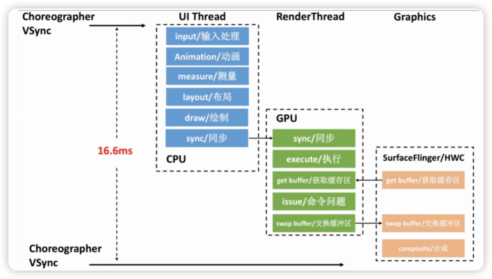
        
    - Why为什么不流畅？
        - 常规原因：层级过深、过度绘制
        - 内存的STW引起的
        - 阻塞当前主线程的代码都会造成卡顿
    - 线下分析定位
        - TraceView：所以路径，开销很大，数据不准确，不太推荐
            1. 生成trace文件：
            `/storage/emulated/0/Android/data/com.example.kotlincoroutinesample/files/sample.trace`
                
                ```kotlin
                override fun onCreate(savedInstanceState: Bundle?) {
                    super.onCreate(savedInstanceState)
                    Debug.startMethodTracing("wo/sample111")
                    setContentView(binding.root)
                    Debug.stopMethodTracing()
                }
                ```
                
            2. 查看分析trace文件：
            View→Tool Windows→Profiler
                
                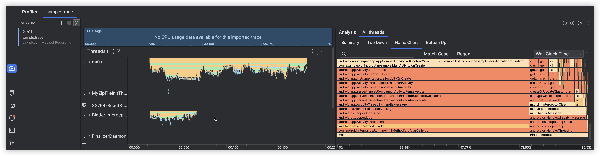
                
                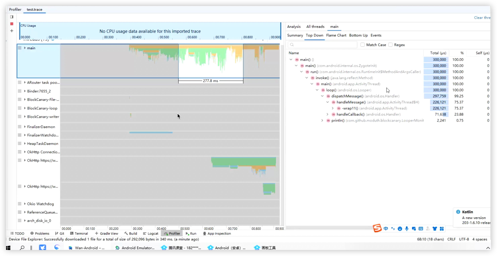
                
        - systrace
            - release包通过反射
                
                ```java
                /**
                 * From Android S, this is no-op.
                 *
                 * Before, set whether application tracing is allowed for this process.  This is intended to be
                 * set once at application start-up time based on whether the application is debuggable.
                 *
                 * @hide
                 */
                @UnsupportedAppUsage
                public static void setAppTracingAllowed(boolean allowed) {
                    nativeSetAppTracingAllowed(allowed);
                }
                ```
                
            - 打tag
                
                ```java
                override fun onCreate(savedInstanceState: Bundle?) {
                    super.onCreate(savedInstanceState)
                    Trace.beginSection("nihao")
                    setContentView(binding.root)
                    Trace.endSection()
                }
                ```
                
            
            jesson-sdk/platform-tools/systrace python [systrace.py](http://systrace.py/) -b 16384 -t 8 gfx input V
            d webview sm freg idle sched -o test trace.html
            
            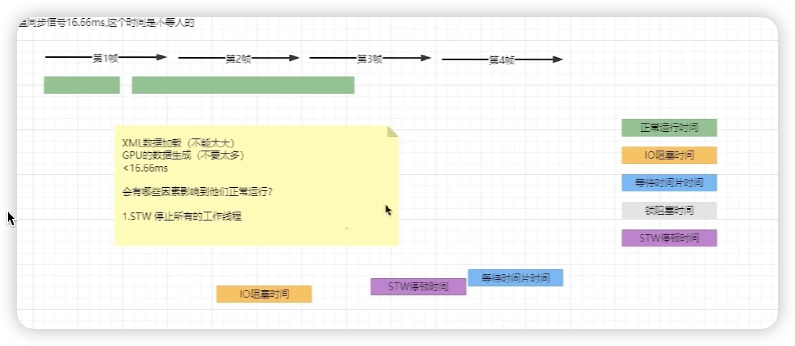
            
            systrace：给我们找事故的原因
            
            - 大面积绿色：代码的时机运行时间确实超过了；层级多，代码里面写了耗时的，绘制出问题了。
            - 大面积紫色：你的代码里有高频生产对象的代码
            - 大面积灰色：有锁问题
            - 大面积蓝色：系统资源不够
            - 大面积橙色：有IO问题出现
        - perfetto(android 10以上)
            1. 生成**.perfetto-trace文件_小米手机
            设置→更多设置→开发者选项→监控目录→功耗监测→Frame Rate Monitor Tools→Start
                
                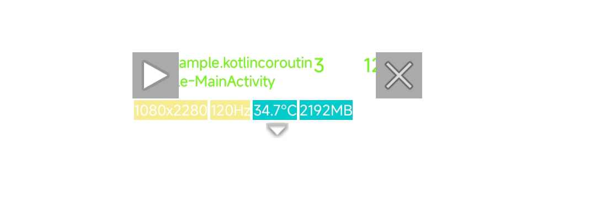
                
                1. 拉取文件到本地adb pull /data/local/traces/
                    
                    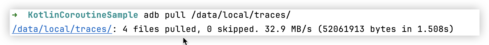
                    
                    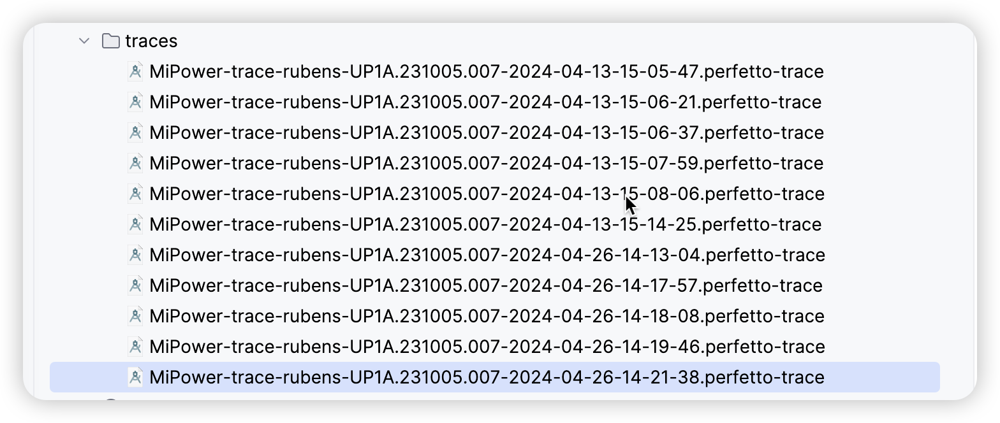
                    
                2. 打开[https://ui.perfetto.dev](https://ui.perfetto.dev/)
                    
                    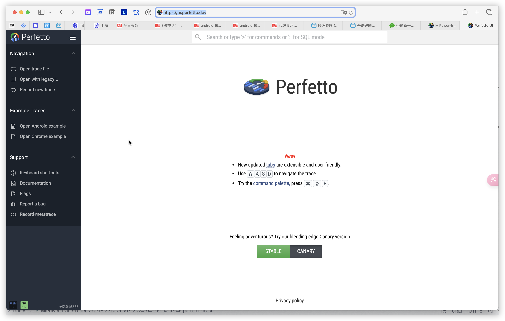
                    
                3. 参考资料
                    
                    [https://developer.android.google.cn/tools/perfetto?hl=zh-cn](https://developer.android.google.cn/tools/perfetto?hl=zh-cn)
                    
            
            - Systrace：关键路径的运行时间
        - 使用hugo
            
            [https://github.com/JakeWharton/hugo](https://github.com/JakeWharton/hugo)
            
        - GPU呈现模式分析：使用开发者选项→GPU呈现模式分析→在屏幕上显示为条形图
            
            查看呈现模式条形图时，主要关注两点：是否存在整体过高的问题、条形刷新是否频繁。当条形的高度超过底部的红色横线时，我们就可以认为出现掉帧了。掉帧时，如果绿色分段占比较大，可以从列表滚动事件处理、动画绘制、布局层级角度进行分析；如果蓝色分段占比较大，可以对自定义View的onDraw、dispatchDraw等方法进行分析；如果红色分段占比较大，可以从绘制命令是否过多、绘制内容是否过于负责的角度进行分析。
            
        - 调试GPU过度绘制：使用开发者选项→调试GPU过度绘制
            
            调试GPU过度绘制可以用来查看绘制层级是否合理。打开过度绘制检测开关后，会在App界面上增加绿色、蓝色、红色等遮罩，我们就可以根据遮罩的颜色判断层级是否过深，重点考虑红色。
            
        - 使用AS Profiler分析卡顿问题
            
            通过使用Profiler的采样功能，我们无须在代码里埋点即可获取函数的耗时情况，这对分析卡顿问题非常有帮助
            要使用他，我们可以从Android Studio顶部的「View→Tool Windows」打开Profiler，选择App进程后单击CPU面板，进入CPU Profiler界面。
            框选顶部“CPU Usage”的某段区间会出现这段时间内的函数调用情况，然后点击某个线程，就可以查看该线程在这段时间内的函数耗时数据。要以火焰图的方式查看函数耗时数据，可以点击“Top Down”旁边的"Flame Chart”。
            
            一般来说，使用火焰图分析问题的效率更高，根据火焰图上的比例我们可以很方便地得出函数的耗时情况，重点关注区块较长的非系统代码。此外Profiler的火焰图也支持搜索函数名，搜索后会高亮显示命中的内容。
            
    - 线上分析定位
        - Choreographer介绍
            
            Choreographer是App界面渲染的核心组成，它帮助我们封装了VSync信号的请求和分发操作；在我们发起界面绘制，播放动画、事件处理请求时，会先向Choreographer注册Vsync信号的监听，同时请求VSync信号；这样在收到渲染子系统发出的VSync信号后，App的输入事件处理、动画播放和布局测量和渲染等就得以执行。
            
            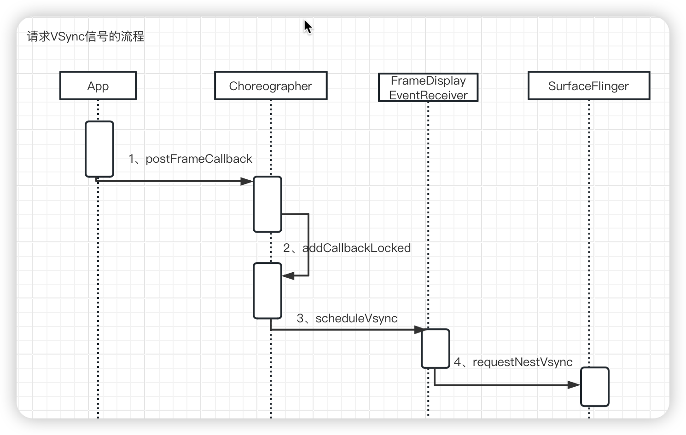
            
            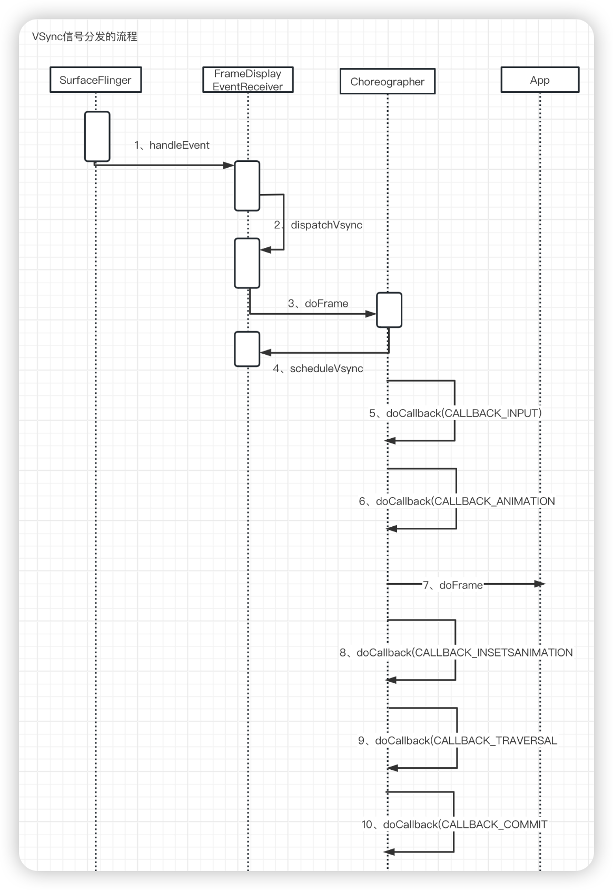
            
        - 获取屏幕的刷新频率
            
            ```java
            WindowManager windowManager = getWindowManager();
            Display defaultDisplay = windowManager.getDefaultDisplay();
            float refreshRate = defaultDisplay.getRefreshRate();
            ```
            
        - FPS统计方案(分不同Android版本)
            
            
            | 版本 | 统计方式 | 每帧开始的时间 | 每帧结束时间 | 每帧耗时 |
            | --- | --- | --- | --- | --- |
            | Android 8.0以前 | Looper+Choreographer | Looper执行绘制任务开始时间 | Looper执行绘制任务结束时间 | 执行绘制任务的耗时 |
            | Android 8.0以后 | FrameMetrics | IntendedVsyncTime | VsyncTime | Vsync信号被主线程
            其他任务耽搁的时间 |
            - Looper+Choreographer方案
                - 1、使用Choreographer#FrameCallback获取上一帧的耗时和FPS
                    
                    
                - 2、使用Looper定位卡顿的原因
                    
                    要获取掉帧的原因，我们可以将Choreographer和Looper的卡顿监控机制结合起来。在收到Choreographer的doFrame回调后，这认为当前正在执行绘制任务；如果此时Looper执行的消息耗时超过卡顿阈值，则认为出现卡顿和掉帧。这时抓取栈的话就可以获取引起这一帧掉帧的原因。
                    
            - FrameMetrics方案
                - 使用FrameMetrics获取每帧耗时
                    
                    ```java
                    if (android.os.Build.VERSION.SDK_INT >= android.os.Build.VERSION_CODES.N) {
                        Window.OnFrameMetricsAvailableListener listener = new Window.OnFrameMetricsAvailableListener() {
                            @Override
                            public void onFrameMetricsAvailable(Window window, FrameMetrics frameMetrics, int dropCountSinceLastInvocation) {
                                long totalDuration = frameMetrics.getMetric(FrameMetrics.TOTAL_DURATION);
                                
                            }
                        };
                        getWindow().addOnFrameMetricsAvailableListener(listener, new Handler());
                    }
                    ```
                    
        - 计算滑动的帧率
            
            **背景**：使用Choreographer#Framecallback的方式计算FPS，会出现没有绘制界面时FPS数值偏低的情况，无法真正反应用户使用体验；在实际监控中，我们更关注App在用户产生交互后的流程性，比如滑动时是否卡顿。
            
            **方案1**：在实际业务中，我们使用的滑动组件主要包括ScrollView、ViewPager、RecyclerView、HorizontalScrollView等。要监控到滑动时的帧率，简单的方式是在布局上添加滑动监听器；但是这种方式需要找到布局里每个滑动组件，实现成本太大。
            
            **方案2**：通过当前Activity的decorView获取ViewTreeObserver，然后添加滑动监听器，既可获取当前页面是否滑动。
            
            - 详细原因
                
                布局滑动本质上时一种事件，要获取整个布局所有层级的事件信息，可以通过ViewTreeObserver实现。通过ViewTreeObserver我们可以获取整个View树的事件，包括layout，draw，touch等事件，当然也包括我们期望的滑动事件。
                
                我们可以通过View.getViewTreeObserver获取当前View树的ViewTreeObserver
                
                ```java
                public ViewTreeObserver getViewTreeObserver() {
                    if (mAttachInfo != null) {
                        return mAttachInfo.mTreeObserver;
                    }
                    if (mFloatingTreeObserver == null) {
                        mFloatingTreeObserver = new ViewTreeObserver(mContext);
                    }
                    return mFloatingTreeObserver;
                }
                ```
                
                简单看一下，在ViewTreeObserver中，由dispatchOnScrollChanged将所有滑动事件分发给所有监听器。
                
                ```java
                @UnsupportedAppUsage
                final void dispatchOnScrollChanged() {
                    // NOTE: because of the use of CopyOnWriteArrayList, we *must* use an iterator to
                    // perform the dispatching. The iterator is a safe guard against listeners that
                    // could mutate the list by calling the various add/remove methods. This prevents
                    // the array from being modified while we iterate it.
                    final CopyOnWriteArray<OnScrollChangedListener> listeners = mOnScrollChangedListeners;
                    if (listeners != null && listeners.size() > 0) {
                        CopyOnWriteArray.Access<OnScrollChangedListener> access = listeners.start();
                        try {
                            int count = access.size();
                            for (int i = 0; i < count; i++) {
                                access.get(i).onScrollChanged();
                            }
                        } finally {
                            listeners.end();
                        }
                    }
                }
                ```
                
                ViewTreeObserver的dispatchOnScrollChanged会在ViewRootImpl的draw方法中被调用。
                
                ```java
                private boolean draw(boolean fullRedrawNeeded) {
                		//...
                    if (mAttachInfo.mViewScrollChanged) {
                        mAttachInfo.mViewScrollChanged = false;
                        mAttachInfo.mTreeObserver.dispatchOnScrollChanged();
                    }
                    //... 
                }
                ```
                
                mAttachInfo.mViewScrollChanged什么时候设置为true？答案是在View滑动时。
                
                ```java
                public void scrollBy(int x, int y) {
                    scrollTo(mScrollX + x, mScrollY + y);
                }
                
                public void scrollTo(int x, int y) {
                    if (mScrollX != x || mScrollY != y) {
                        int oldX = mScrollX;
                        int oldY = mScrollY;
                        mScrollX = x;
                        mScrollY = y;
                        invalidateParentCaches();
                        onScrollChanged(mScrollX, mScrollY, oldX, oldY);
                        if (!awakenScrollBars()) {
                            postInvalidateOnAnimation();
                        }
                    }
                }
                
                protected void onScrollChanged(int l, int t, int oldl, int oldt) {
                		//...
                    final AttachInfo ai = mAttachInfo;
                    if (ai != null) {
                        ai.mViewScrollChanged = true;
                    }
                    if (mListenerInfo != null && mListenerInfo.mOnScrollChangeListener != null) {
                        mListenerInfo.mOnScrollChangeListener.onScrollChange(this, l, t, oldl, oldt);
                    }
                }
                ```
                
                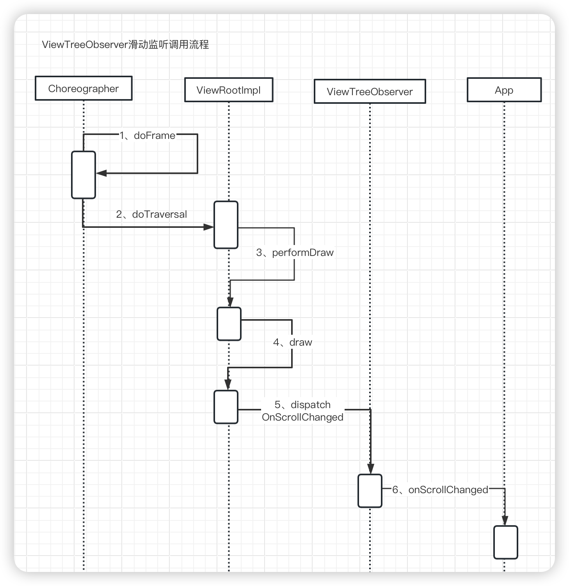
                
                因此我们先通过当前Activity的decorView获取ViewTreeObserver，然后添加滑动监听器，既可获取当前页面是否滑动。
                
                ```java
                View decorView = getWindow().getDecorView();
                decorView.getViewTreeObserver().addOnScrollChangedListener(new ViewTreeObserver.OnScrollChangedListener() {
                    @Override
                    public void onScrollChanged() {
                        isScrolling = true;
                        mHandler.removeCallbacks(mScrollingRunnable);
                        mHandler.postDelayed(mScrollingRunnable, 100);
                    }
                });
                ```
                
                由于OnScrollChangedListener的onScrolled没有状态，因此我们需要在onScrollChanged每次调用时向Handler中提交一个延时任务，再次滑动时移除。当延时任务执行时，说明已经停止。
                
                这样我们可以获取是否滑动的状态，在获取每帧的时长时，可以根据当前是否滑动，判断这帧是否时滚动帧，累加后计算即可以得到滑动帧率。
                
        - 主线程卡顿监控
            - 原理：计算主线程Looper执行每个任务的时长，如有任务耗时超过自定义的阈值即可认为发生了卡顿。
            - 监控：通过公开的Looper.getMainLooper().setMessageLogging(myPrinter)即可以设置监听。
                
                ```java
                public static void loop() {
                    final Looper me = myLooper();
                    if (me == null) {
                        throw new RuntimeException("No Looper; Looper.prepare() wasn't called on this thread.");
                    }
                    for (;;) {
                        Message msg = queue.next(); // might block
                        if (msg == null) {
                            // No message indicates that the message queue is quitting.
                            return;
                        }
                        // This must be in a local variable, in case a UI event sets the logger
                        final Printer logging = me.mLogging;
                        if (logging != null) {
                            logging.println(">>>>> Dispatching to " + msg.target + " " +
                                    msg.callback + ": " + msg.what);
                        }
                        msg.target.dispatchMessage(msg);
                        if (logging != null) {
                          logging.println("<<<<< Finished to " + msg.target + " " + msg.callback);
                        }
                    }
                }
                ```
                
            - 上报：在获取主线程消息执行耗时后，我就可以在任务执行的耗时超过自定义阈值时做堆栈的获取和上报。
                
                ```java
                public class LooperAnrTracer extends Tracer implements ILooperListener {
                    public void onDispatchBegin(String log) {
                	      this.anrTask.beginRecord = AppMethodBeat.getInstance().maskIndex("AnrTracer#dispatchBegin");
                	      if (this.traceConfig.isDevEnv()) {
                	          MatrixLog.v("Matrix.AnrTracer", "* [dispatchBegin] index:%s", new Object[]{this.anrTask.beginRecord.index});
                	      }
                	
                	      this.anrHandler.postDelayed(this.anrTask, 5000L);
                	      this.lagHandler.postDelayed(this.lagTask, 2000L);
                    }
                    
                    public void onDispatchEnd(String log, long beginNs, long endNs) {
                        if (this.traceConfig.isDevEnv()) {
                            long cost = (endNs - beginNs) / 1000000L;
                            MatrixLog.v("Matrix.AnrTracer", "[dispatchEnd] beginNs:%s endNs:%s cost:%sms", new Object[]{beginNs, endNs, cost});
                        }
                
                        this.anrTask.getBeginRecord().release();
                        this.anrHandler.removeCallbacks(this.anrTask);
                        this.lagHandler.removeCallbacks(this.lagTask);
                    }
                
                    class LagHandleTask implements Runnable {
                        LagHandleTask() {
                        }
                
                        public void run() {
                            String scene = AppActiveMatrixDelegate.INSTANCE.getVisibleScene();
                            boolean isForeground = LooperAnrTracer.this.isForeground();
                
                            try {
                                TracePlugin plugin = (TracePlugin)Matrix.with().getPluginByClass(TracePlugin.class);
                                if (null == plugin) {
                                    return;
                                }
                
                                StackTraceElement[] stackTrace = Looper.getMainLooper().getThread().getStackTrace();
                                String dumpStack = Utils.getWholeStack(stackTrace);
                                JSONObject jsonObject = new JSONObject();
                                DeviceUtil.getDeviceInfo(jsonObject, Matrix.with().getApplication());
                                jsonObject.put("detail", Type.LAG);
                                jsonObject.put("scene", scene);
                                jsonObject.put("threadStack", dumpStack);
                                jsonObject.put("isProcessForeground", isForeground);
                                Issue issue = new Issue();
                                issue.setTag("Trace_EvilMethod");
                                issue.setContent(jsonObject);
                                plugin.onDetectIssue(issue);
                                MatrixLog.e("Matrix.AnrTracer", "happens lag : %s, scene : %s ", new Object[]{dumpStack, scene});
                            } catch (JSONException var8) {
                                MatrixLog.e("Matrix.AnrTracer", "[JSONException error: %s", new Object[]{var8});
                            }
                
                        }
                    }
                }
                ```
                
            - 监控IdleHandler耗时
                
                当Looper执行时，会不断地从消息队列里取消息，如果当前消息队列里没有消息，或者消息队列里的第一条消息还没有到执行时间，就会执行之前添加的所有IdleHandler。也就是说，IdleHandler的queueIdle方法是在主线程执行的，如果在其中有耗时任务，同样会造成卡顿
                
        - BlockCanary
            - 定位不准
    - 优化流程度
        - 1、绘制相关线程获得的CPU时间过少→增加绘制相关线程的运行时间
            - 线程处于运行状态的时间少，主要原因如下：
                - 线程优先级不高
                    
                    Android上线程能够被分配多少CPU时间片，取决于线程的优先级。一般有两种方式修改优先级：
                    
                    ```java
                    java.lang.Thread#setPriority
                    android.os.Process#setThreadPriority(int)
                    ```
                    
                - 线程抢占频繁
                    1. 减少线程数，复用线程池。减少new Thread的使用，并在编译时修改字节码，将new Thread修改为提交线程池执行；开发SDK时提供接口，通过外部注入线程池，而不是自己新建。
                    2. 及时停止子线程
                    3. 子线程的优先级和繁忙程度。我们需要对子线程的执行时间和优先级做统计，找到优先级高当实际没有那么重要的线程，将他们的优先级设置得低一点，这样就会减少对绘制相关线程的抢占。
                - 线程没有处于可运行的状态
        - 2、主线程消息队列里绘制无关任务的耗时过多→减少主线程非绘制任务的耗时
            
            在非绘制任务中，主要存在文件IO、等锁、类加载、Binder调用等耗时点。
            
            - 减少主线程解析耗时
                
                ```kotlin
                //改造前
                val view = layoutInflater.inflate(R.layout.activity_main, null)
                
                //改造后
                val preloadView = mutableListOf<Pair<View, View?>>()
                val asyncLayout = AsyncLayoutInflater(this)
                asyncLayout.inflate(R.layout.activity_main, null) { view, resid, parent ->
                    preloadView.add(Pair(view, parent))
                }
                ```
                
            - 减少主线程读取文件耗时
                
                除了布局解析，还有很多操作会触发读写，比如：
                
                - 读取Assets文件
                - 调用ContentResolver query或者insert
                - 数据库读写
                
                我们需要避免主线程执行Assets读取、ContentResolver操作、数据库操作等文件IO行为。
                
                有如下检测方式。
                
                1. 开启StrictMode，但是StrictMode对性能损耗较大，所以只能在线下使用，并且StrictMode无法检测到C/C++代码中文件的操作。
                2. 拦截Linux read/write API，我们使用的Android File等API的文件操作，最终都会执行到Linux的read、write等文件操作API。因此想要在线程检测到所有文件读写操作，可以通过native hook拦截这些API。
            - 减少主线程Binder调用耗时
                
                Binder虽然高效，但毕竟采用的时跨进程通信方式，每次需要经过Client端的Java到Naive、Native到驱动，然后在Service端从驱动到Native、Native到Java，整个流程的耗时不容小觑。
                
                在项目开发中，为了减少Binder调用的耗时，我们需要减少API的调用，获取相关数据后保存到缓存，下次使用时最好从缓存获取。**还有一种通用的方法是在编译时修改字节码，将频繁的Binder方法调用改为使用统一管理的方式。**
                
                要检测App有哪些代码频繁触发Binder调用，可以通过adb shell am trace-ipc start，开启后进行App的功能测试，测试完后调用trace-ipc stop保存日志并将其导出。
                
        - 3、绘制任务耗时太久→减少绘制任务耗时
            1. 绘制任务耗时优化，首先可以从不可见布局加载入手。多页面布局，通常使用ViewPager。可以通过ViewPager的setOffscreenPageLimit方式减少不可见页面的缓存量。
            2. 如果一个XML文件中存在很多不会立即展示的布局内容，我们也可以通过使用ViewStub的方式将其延迟执行。
            3. 为了减少卡顿，我们需要在Activity/Fragment onPause或者View.onDetachedFromWindow时，停止播放所有动画
            4. 我们也可以使用开发者选项的“显示视图更新”功能，使用这个功能后，如果页面被刷新，屏幕就会闪烁；我们可以通过这个功能，查看App退出后台或者打开新页面，页面是否会刷新。
            5. 在进行绘制时，如果布局层次太深，刷新过于频繁，会导致主线程绘制指令太多而卡顿，布局中存在大量尺寸较大的ImageView时这个问题尤为明显。可以使用开发者选项中的“调试GPU过度绘制”功能，查看当前页面是否存在层级太深、过度绘制的问题。
    
    [benchmark](https://developer.android.google.cn/jetpack/androidx/releases/benchmark)
    
    就是我们在子线上通过定时任务来获取主线程对战的默认是0.8倍的國值吗
    
    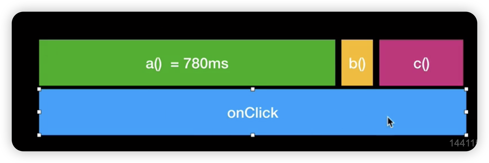
    
- 如何进行内存优化
    
    定位Java内存问题，最核心的就是获取到hprof文件。在获取到hprof文件后，我们可以通过MAT和Android Studio Profiler等工具进行分析，从而找到占用内存过高和泄露的对象。
    
    内存过高、对象泄露→抓取hprof文件→分析占用内存和引用链→得出结论。
    
    1. 在线下内存测试时，我们可以通过adb shell am dumpheap获取文件
    2.  而线上内存测试时，最简单的方式是通过Debug.dumpHprofData获取。Debug.dumpHrpofData的好处是使用简单，但它的缺点也很明显：调用后会导致进程卡顿数秒甚至数十秒！开源的KOOM库解决了Debug.deumpHprofData执行时的卡顿问题，使得线上获取hprof文件的性能损耗变得可以接受。KOOM高性能获取hprof文件的核心方案：fork子进程执行Debug.dumpHprofData，把耗时操作转移到子进程。
    
- 启动优化
    - 黑白屏优化
        
        用户在Launcher点击App→第一个Activity显示，显示application的theme.android:windowSplashscreenContentl
        PhoneWindowManager.java
        
        ```java
          private void addSplashscreenContent(PhoneWindow win, Context ctx) {
              final TypedArray a = ctx.obtainStyledAttributes(R.styleable.Window);
              final int resId = a.getResourceId(R.styleable.Window_windowSplashscreenContent, 0);
              a.recycle();
              if (resId == 0) {
                  return;
              }
              final Drawable drawable = ctx.getDrawable(resId);
              if (drawable == null) {
                  return;
              }
        
              // We wrap this into a view so the system insets get applied to the drawable.
              final View v = new View(ctx);
              v.setBackground(drawable);
              win.setContentView(v);
          }
        ```
        
        ```java
        	@Override
          public StartingSurface addSplashScreen(IBinder appToken, String packageName, int theme,
                  CompatibilityInfo compatInfo, CharSequence nonLocalizedLabel, int labelRes, int icon,
                  int logo, int windowFlags, Configuration overrideConfig, int displayId) {
              if (!SHOW_SPLASH_SCREENS) {
                  return null;
              }
              if (packageName == null) {
                  return null;
              }
        
              WindowManager wm = null;
              View view = null;
        
              try {
                  Context context = mContext;
                  if (DEBUG_SPLASH_SCREEN) Slog.d(TAG, "addSplashScreen " + packageName
                          + ": nonLocalizedLabel=" + nonLocalizedLabel + " theme="
                          + Integer.toHexString(theme));
        
                  // Obtain proper context to launch on the right display.
                  final Context displayContext = getDisplayContext(context, displayId);
                  if (displayContext == null) {
                      // Can't show splash screen on requested display, so skip showing at all.
                      return null;
                  }
                  context = displayContext;
        
                  if (theme != context.getThemeResId() || labelRes != 0) {
                      try {
                          context = context.createPackageContext(packageName, CONTEXT_RESTRICTED);
                          context.setTheme(theme);
                      } catch (PackageManager.NameNotFoundException e) {
                          // Ignore
                      }
                  }
        
                  if (overrideConfig != null && !overrideConfig.equals(EMPTY)) {
                      if (DEBUG_SPLASH_SCREEN) Slog.d(TAG, "addSplashScreen: creating context based"
                              + " on overrideConfig" + overrideConfig + " for splash screen");
                      final Context overrideContext = context.createConfigurationContext(overrideConfig);
                      overrideContext.setTheme(theme);
                      final TypedArray typedArray = overrideContext.obtainStyledAttributes(
                              com.android.internal.R.styleable.Window);
                      final int resId = typedArray.getResourceId(R.styleable.Window_windowBackground, 0);
                      if (resId != 0 && overrideContext.getDrawable(resId) != null) {
                          // We want to use the windowBackground for the override context if it is
                          // available, otherwise we use the default one to make sure a themed starting
                          // window is displayed for the app.
                          if (DEBUG_SPLASH_SCREEN) Slog.d(TAG, "addSplashScreen: apply overrideConfig"
                                  + overrideConfig + " to starting window resId=" + resId);
                          context = overrideContext;
                      }
                      typedArray.recycle();
                  }
        
                  final PhoneWindow win = new PhoneWindow(context);
                  win.setIsStartingWindow(true);
        
                  CharSequence label = context.getResources().getText(labelRes, null);
                  // Only change the accessibility title if the label is localized
                  if (label != null) {
                      win.setTitle(label, true);
                  } else {
                      win.setTitle(nonLocalizedLabel, false);
                  }
        
                  win.setType(
                      WindowManager.LayoutParams.TYPE_APPLICATION_STARTING);
        
                  synchronized (mWindowManagerFuncs.getWindowManagerLock()) {
                      // Assumes it's safe to show starting windows of launched apps while
                      // the keyguard is being hidden. This is okay because starting windows never show
                      // secret information.
                      // TODO(b/113840485): Occluded may not only happen on default display
                      if (displayId == DEFAULT_DISPLAY && mKeyguardOccluded) {
                          windowFlags |= FLAG_SHOW_WHEN_LOCKED;
                      }
                  }
        
                  // Force the window flags: this is a fake window, so it is not really
                  // touchable or focusable by the user.  We also add in the ALT_FOCUSABLE_IM
                  // flag because we do know that the next window will take input
                  // focus, so we want to get the IME window up on top of us right away.
                  win.setFlags(
                      windowFlags|
                      WindowManager.LayoutParams.FLAG_NOT_TOUCHABLE|
                      WindowManager.LayoutParams.FLAG_NOT_FOCUSABLE|
                      WindowManager.LayoutParams.FLAG_ALT_FOCUSABLE_IM,
                      windowFlags|
                      WindowManager.LayoutParams.FLAG_NOT_TOUCHABLE|
                      WindowManager.LayoutParams.FLAG_NOT_FOCUSABLE|
                      WindowManager.LayoutParams.FLAG_ALT_FOCUSABLE_IM);
        
                  win.setDefaultIcon(icon);
                  win.setDefaultLogo(logo);
        
                  win.setLayout(WindowManager.LayoutParams.MATCH_PARENT,
                          WindowManager.LayoutParams.MATCH_PARENT);
        
                  final WindowManager.LayoutParams params = win.getAttributes();
                  params.token = appToken;
                  params.packageName = packageName;
                  params.windowAnimations = win.getWindowStyle().getResourceId(
                          com.android.internal.R.styleable.Window_windowAnimationStyle, 0);
                  params.privateFlags |=
                          WindowManager.LayoutParams.PRIVATE_FLAG_FAKE_HARDWARE_ACCELERATED;
                  params.privateFlags |= WindowManager.LayoutParams.PRIVATE_FLAG_SHOW_FOR_ALL_USERS;
        
                  if (!compatInfo.supportsScreen()) {
                      params.privateFlags |= WindowManager.LayoutParams.PRIVATE_FLAG_COMPATIBLE_WINDOW;
                  }
        
                  params.setTitle("Splash Screen " + packageName);
                  addSplashscreenContent(win, context);
        
                  wm = (WindowManager) context.getSystemService(WINDOW_SERVICE);
                  view = win.getDecorView();
        
                  if (DEBUG_SPLASH_SCREEN) Slog.d(TAG, "Adding splash screen window for "
                      + packageName + " / " + appToken + ": " + (view.getParent() != null ? view : null));
        					//黑白屏显示的开始时间
                  wm.addView(view, params);
        
                  // Only return the view if it was successfully added to the
                  // window manager... which we can tell by it having a parent.
                  return view.getParent() != null ? new SplashScreenSurface(view, appToken) : null;
              } catch (WindowManager.BadTokenException e) {
                  // ignore
                  Log.w(TAG, appToken + " already running, starting window not displayed. " +
                          e.getMessage());
              } catch (RuntimeException e) {
                  // don't crash if something else bad happens, for example a
                  // failure loading resources because we are loading from an app
                  // on external storage that has been unmounted.
                  Log.w(TAG, appToken + " failed creating starting window", e);
              } finally {
                  if (view != null && view.getParent() == null) {
                      Log.w(TAG, "view not successfully added to wm, removing view");
                      wm.removeViewImmediate(view);
                  }
              }
        
              return null;
          }
        ```
        
    - 优化Applicaton.onCreate
    
    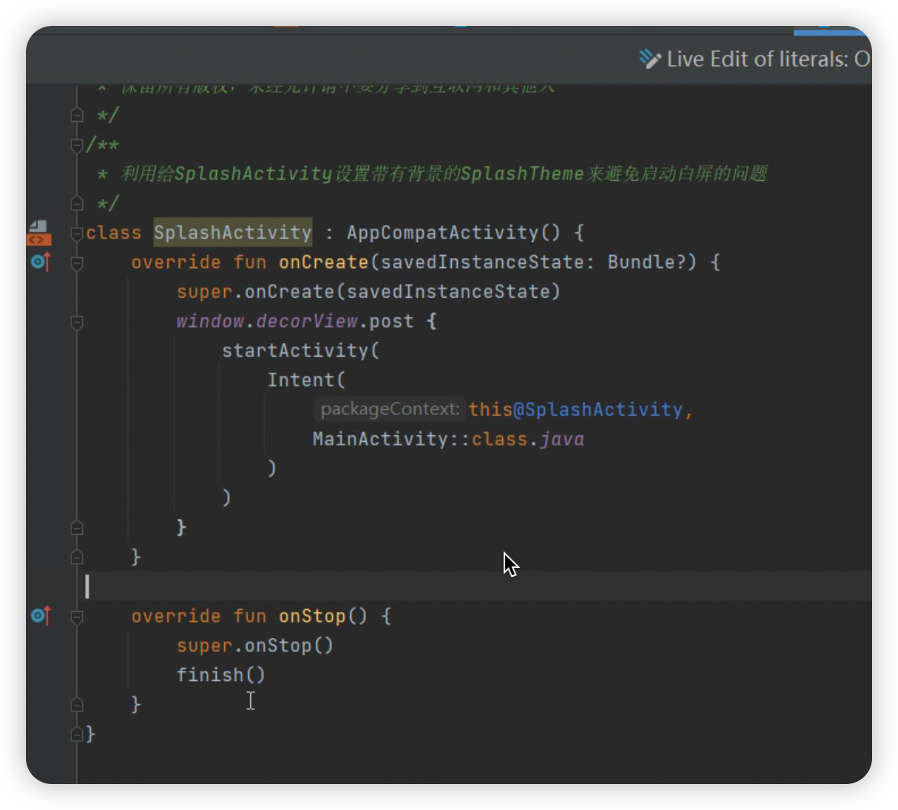
    
- SparseArray是什么，有什么特性？
    
    SparseArray 是 Android 框架中的一个类，用于代替普通的 HashMap，特别适用于存储稀疏数据的情况。稀疏数据指的是大部分索引位置都没有数据，只有少数索引位置有数据的情况。
    
    以下是 SparseArray 的一些特性：
    
    1. **内存效率**：相对于 HashMap，SparseArray 使用更少的内存，因为它避免了一些额外的内存开销，比如哈希表中的链表节点。这使得 SparseArray 在处理稀疏数据时更加高效。
    2. **性能**：由于 SparseArray 避免了哈希计算和冲突解决过程，因此在一些场景下，其访问和操作速度可能比 HashMap 更快。
    3. **线程安全**：SparseArray 并不是线程安全的。如果在多个线程中同时对 SparseArray 进行修改操作，可能会导致数据不一致或者其他意外情况。
    4. **自动排序**：SparseArray 的键值对按照键的升序进行排序，这点和 HashMap 不同，HashMap 并不保证键值对的顺序。
    
    SparseArray 主要用于 Android 开发中，特别是在处理 Android 内存中的稀疏数据结构时非常有用，比如在 ListView、RecyclerView 等列表控件中的 Adapter 中使用 SparseArray 来存储视图或数据。
    
- Android 如何进行布局UI 优化？
    
    找到主页面控件的加载耗时 做到心中有数
    
    解决？
    
    - 异步布局加载，不支持fragment
    - new对象 X2c
    
    ```java
    LayoutInflaterCompat.setFactory2(layoutInflater, object : LayoutInflater.Factory2 {
        override fun onCreateView(
            parent: View?,
            name: String,
            context: Context,
            attrs: android.util.AttributeSet
        ): View? {
            val start = System.currentTimeMillis()
            val view = delegate.createView(parent, name, context, attrs)
            val end = System.currentTimeMillis()
            println("onCreateView: $name, cost: ${end - start}")
            return view
        }
    
        override fun onCreateView(
            name: String,
            context: Context,
            attrs: android.util.AttributeSet
        ): View? {
            return null
        }
    })
    ```
    
    在 Android 中进行布局 UI 优化是确保应用程序性能和用户体验良好的重要步骤之一。以下是一些常见的布局 UI 优化技巧：
    
    1. **使用 ConstraintLayout**：ConstraintLayout 是 Android 中强大的布局管理器，可以帮助你创建灵活和高效的布局。它使用约束来定义视图之间的相对位置，可以减少布局层次，提高渲染性能。
    2. **避免过度嵌套**：过度嵌套的布局会增加布局层次，导致渲染性能下降。尽量避免使用过多的嵌套布局，可以使用 ConstraintLayout 来减少布局层次。
    3. **使用 RecyclerView**：对于大型数据集或者可滚动的列表，使用 RecyclerView 来显示数据。RecyclerView 使用 ViewHolder 模式和回收视图来优化内存使用和滚动性能。
    4. **合理使用布局重用**：尽可能地重用布局和视图组件，避免在需要时重复创建和销毁视图。这可以通过使用 ViewStub、LayoutInflater 和视图复用模式来实现。
    5. **优化布局层次**：尽量减少布局层次，因为布局层次越多，渲染性能就越低。可以通过合并布局、使用 ConstraintLayout 和删除不必要的视图来优化布局层次。
    6. **避免过多的视图绘制**：避免在主线程上进行过多的视图绘制操作，可以使用 ViewStub 来延迟加载视图，或者在必要时使用异步绘制。
    7. **使用合适的图像压缩**：在使用图片时，使用合适的压缩格式和大小，以减少内存占用和加载时间。
    8. **使用性能分析工具**：使用 Android Studio 中的布局分析工具和性能监视器来识别布局中的性能瓶颈和优化机会。
    
    通过结合这些技巧，可以有效地优化 Android 应用程序的布局 UI，提高性能和用户体验。
    
- Android 如何检测卡顿？
    
    在 Android 中，可以通过以下方法来检测卡顿：
    
    1. **使用开发者选项**：
        - 在 Android 设备的设置中，开发者选项中有一个"显示CPU使用情况"选项。启用该选项后，屏幕上会显示当前 CPU 的使用情况。如果应用程序出现卡顿，你可以观察 CPU 使用情况是否突然飙升，以确定是否是由于 CPU 使用率过高导致的卡顿。
    2. **使用性能监视工具**：
        - Android Studio 提供了丰富的性能监视工具，如CPU Profiler、Memory Profiler、Network Profiler等。这些工具可以帮助你分析应用程序的性能瓶颈，并识别可能导致卡顿的问题。
    3. **使用 Systrace**：
        - Systrace 是 Android 系统提供的一个性能分析工具，可以用来分析应用程序的运行状况。它可以提供详细的时间轴视图，显示应用程序在各个阶段的执行时间，帮助你找到卡顿的原因。
    4. **使用第三方库**：
        - 一些第三方库也提供了用于检测卡顿的工具，如Facebook的Stetho、Square的LeakCanary等。这些库可以帮助你监视应用程序的性能，并在出现卡顿或内存泄漏时发出警告。
    5. **用户反馈**：
        - 最后，也可以通过用户反馈来检测卡顿。如果用户在使用应用程序时经常遇到卡顿现象，他们可能会向你反馈。可以通过收集用户反馈来识别可能导致卡顿的问题，并进行相应的优化。
    
    综上所述，通过使用开发者选项、性能监视工具、Systrace、第三方库和用户反馈，可以帮助你检测并解决 Android 应用程序中的卡顿问题。
    
- Android 如何进行内存优化？
    
    在 Android 中，可以通过以下方法来检测卡顿：
    
    1. **使用开发者选项**：
        - 在 Android 设备的设置中，开发者选项中有一个"显示CPU使用情况"选项。启用该选项后，屏幕上会显示当前 CPU 的使用情况。如果应用程序出现卡顿，你可以观察 CPU 使用情况是否突然飙升，以确定是否是由于 CPU 使用率过高导致的卡顿。
    2. **使用性能监视工具**：
        - Android Studio 提供了丰富的性能监视工具，如CPU Profiler、Memory Profiler、Network Profiler等。这些工具可以帮助你分析应用程序的性能瓶颈，并识别可能导致卡顿的问题。
    3. **使用 Systrace**：
        - Systrace 是 Android 系统提供的一个性能分析工具，可以用来分析应用程序的运行状况。它可以提供详细的时间轴视图，显示应用程序在各个阶段的执行时间，帮助你找到卡顿的原因。
    4. **使用第三方库**：
        - 一些第三方库也提供了用于检测卡顿的工具，如Facebook的Stetho、Square的LeakCanary等。这些库可以帮助你监视应用程序的性能，并在出现卡顿或内存泄漏时发出警告。
    5. **用户反馈**：
        - 最后，也可以通过用户反馈来检测卡顿。如果用户在使用应用程序时经常遇到卡顿现象，他们可能会向你反馈。可以通过收集用户反馈来识别可能导致卡顿的问题，并进行相应的优化。
    
    综上所述，通过使用开发者选项、性能监视工具、Systrace、第三方库和用户反馈，可以帮助你检测并解决 Android 应用程序中的卡顿问题。
    
- Android 如何进行内存优化？
    
    在 Android 应用程序中进行内存优化是非常重要的，它可以提高应用程序的性能、减少崩溃和提升用户体验。以下是一些常见的内存优化技巧：
    
    1. **使用内存分析工具**：
        - 使用 Android Studio 提供的内存分析工具（如Memory Profiler）来识别应用程序中的内存泄漏和内存占用过高的问题。这些工具可以帮助你定位内存问题，并找到导致内存泄漏的原因。
    2. **避免静态引用**：
        - 避免在代码中使用静态引用（如静态变量、静态集合等），因为静态引用会使对象长时间保持在内存中，容易导致内存泄漏。
    3. **使用弱引用和软引用**：
        - 对于不需要长时间持有的对象，可以考虑使用弱引用（WeakReference）或者软引用（SoftReference）来引用对象，这样可以在内存不足时释放对象，避免内存占用过高。
    4. **及时释放资源**：
        - 在使用完资源后，及时释放资源（如关闭文件流、关闭数据库连接等），以避免资源泄漏和内存占用过高。
    5. **优化图片资源**：
        - 对于应用程序中使用的图片资源，可以通过压缩图片大小、使用适当的图片格式、减少图片的颜色深度等方式来减少内存占用。
    6. **避免过度绘制**：
        - 减少不必要的视图绘制操作，尽量避免在 UI 线程上执行耗时的绘制操作，以减少内存占用和提高 UI 渲染性能。
    7. **合理使用内存缓存**：
        - 使用内存缓存来存储频繁访问的数据，但要注意控制缓存的大小，避免缓存过多数据导致内存占用过高。
    8. **优化数据结构和算法**：
        - 使用合适的数据结构和算法来减少内存占用，尽量避免使用大量内存消耗的数据结构和算法。
    9. **分批加载数据**：
        - 对于大型数据集或者大文件，可以考虑分批加载数据，以避免一次性加载过多数据导致内存占用过高。
    10. **及时回收无用对象**：
        - 在适当的时候调用系统的垃圾回收机制（System.gc()），以及时释放无用对象，减少内存占用。
    
    通过以上方法，可以有效地进行 Android 应用程序的内存优化，提高应用程序的性能和稳定性。
    

定位卡顿位置，不准确，post