# 网络通讯

- okhttp的连接池是原理和复用
    
    好的，我们来详细讲解一下 OkHttp 连接池的原理和连接复用机制。这是 OkHttp 高性能的核心之一。
    
    ### 核心思想：减少延迟，提升效率
    
    在没有连接池的情况下，每次 HTTP 请求都需要进行三次握手建立 TCP 连接，请求结束后再经过四次挥手断开连接。这个过程非常耗时（尤其是 SSL/TLS 握手更耗时）。
    
    **连接复用的核心目标**就是：当一个 HTTP 请求完成后，保持其底层的 TCP 连接一段时间不关闭。当有新的、指向相同目标地址的请求时，直接复用这个已经建立好的连接，从而省去建立连接的开销。
    
    ---
    
    ### 一、连接池的原理
    
    OkHttp 的连接池 (`ConnectionPool`) 本质上是一个**管理空闲 TCP 连接的对象池**。它的工作原理可以概括为以下几个关键点：
    
    ### 1. 数据结构
    
    连接池内部使用一个 `Deque<RealConnection>`（双端队列）来存储空闲的连接。`RealConnection` 是 OkHttp 中真正代表一个 TCP 连接的类，其中封装了 Socket。
    
    ### 2. 关键参数
    
    连接池的行为由两个主要参数控制：
    
    - **最大空闲连接数（maxIdleConnections）**：默认是 5 个。这意味着对于同一个 `Address`（可以简单理解为同一个目标主机），连接池最多会保留 5 个空闲连接。
    - **保持存活时间（keepAliveDuration）**：默认是 5 分钟。这意味着一个连接在空闲状态最多存活 5 分钟，超时后会被清理。
    
    ### 3. 工作流程
    
    **a) 查找可用连接（复用）**
    当发起一个新的 HTTP 请求时，OkHttp 会首先尝试从连接池中找到一个可以复用的连接。查找的逻辑是：
    
    1. 遍历连接池中的空闲连接队列。
    2. 检查连接是否**匹配**当前请求的 `Address`（比较主机名、端口、代理、SSL 配置等是否完全一致）。
    3. 检查找到的连接是否是**健康的**（即底层的 Socket 没有被关闭，没有发生不可恢复的错误）。
    
    如果找到匹配且健康的连接，就直接拿出来使用，省去了建立连接的开销。
    
    **b) 存放空闲连接**
    当一个 HTTP 请求成功完成后，如果响应头中包含 `Connection: keep-alive`（HTTP/1.x）或者本身就是 HTTP/2 连接（默认多路复用），OkHttp 不会立即关闭底层的 Socket。
    
    1. 它会将这条 `RealConnection` 放回连接池的空闲队列中。
    2. 该连接此时处于“空闲”状态，等待被下一个匹配的请求复用。
    
    **c) 清理空闲连接（淘汰）**
    连接池不可能无限期地保持所有连接，否则会造成资源泄漏。OkHttp 内部有一个专门的**清理线程**来执行淘汰策略。
    
    清理逻辑：
    
    1. 定期（或者在有连接被放入池中时触发）扫描空闲连接队列。
    2. 对每个连接进行检查：
        - **数量限制**：如果某个 `Address` 的空闲连接数超过了 `maxIdleConnections`（默认5），则立即关闭最老的连接。
        - **时间限制**：如果某个连接的闲置时间超过了 `keepAliveDuration`（默认5分钟），则立即关闭它。
    3. 关闭连接，并将其从队列中移除。
    
    这个过程确保了连接池的大小和连接的生命周期都在可控范围内。
    
    ---
    
    ### 二、连接复用的条件
    
    不是所有连接都可以被任意复用，必须满足严格的条件：
    
    1. **Host 匹配**：必须是完全相同的**主机名（或 IP 地址）和端口号**。例如，`https://api.example.com/v1/user` 和 `https://api.example.com/v1/product` 可以复用同一个连接，因为它们的主机名和端口相同。
    2. **代理配置一致**：无论是直连、使用 HTTP 代理还是 SOCKS 代理，配置必须相同。
    3. **SSL/TLS 配置一致**：如果使用了 HTTPS，SSL 套件、证书验证策略（如主机名验证器）、证书锁钉等配置必须一致。
    4. **DNS 解析结果（重要且易忽略）**：OkHttp 允许对同一个主机名返回多个 IP 地址（IPv4/IPv6）。复用时要求连接的 IP 地址必须是当前请求 DNS 解析结果中的一个。这是为了支持** Happy Eyeballs** 算法（同时尝试 IPv4/IPv6，选择连接更快的）和连接失败后的快速重试。
    5. **连接健康**：底层的 Socket 必须没有被关闭，并且可以正常进行 I/O 操作。
    
    ---
    
    ### 三、HTTP/1.x vs HTTP/2 的复用差异
    
    虽然都使用同一个连接池，但 HTTP/1.x 和 HTTP/2 的复用机制有本质区别：
    
    | 特性 | HTTP/1.1 | HTTP/2 |
    | --- | --- | --- |
    | **机制** | **串行复用** | **多路复用** |
    | **描述** | 一个连接在任一时刻只能处理一个请求/响应。请求完成后，连接放回池中，等待下一个请求。 | 一个连接上可以同时并发多个请求/响应流（Stream）。这些流是交错在一起的，互不阻塞。 |
    | **性能表现** | 可以省去 TCP/SSL 握手开销，但如果页面有多个资源（CSS/JS/图片），仍然需要排队等待，可能产生线头阻塞。 | 极大地减少了延迟，多个资源请求可以并行发送，无需等待前面的完成，完美解决了 HTTP/1.1 的线头阻塞问题。 |
    | **连接池视角** | 连接池中存放的是“空闲”的 HTTP/1.1 连接。 | 连接池中存放的 HTTP/2 连接可能**正在被使用**（有活跃的 Stream），但只要 Stream 数量未达上限，就可以直接在这个连接上创建新的 Stream，而无需从池中“取出”。 |
    
    ---
    
    ### 四、总结与比喻
    
    **比喻**：
    可以把连接池想象成一个**出租车候客点**。
    
    - **乘客** = HTTP 请求
    - **出租车** = TCP 连接
    - **候客点** = 连接池
    - **目的地** = 请求的 URL
    1. **无连接池**：每次乘客都要打电话叫一辆新车（三次握手），到达目的地后出租车就开走（四次挥手）。效率低下。
    2. **有连接池**：乘客来到候客点，如果发现有去往相同目的地的空出租车（空闲连接），就直接上车出发（连接复用），省去了叫车和等车的时间。司机送完一个乘客后，如果候客点还有空位且没超时，就会开回候客点等待下一批去往相同方向的乘客。
    
    **核心优势**：
    
    - **降低延迟**：避免了重复的 TCP 和 SSL 握手。
    - **减少资源消耗**：减少了 CPU 开销（握手加密计算）和网络带宽占用。
    - **提升吞吐量**：特别是对于 HTTP/2，多路复用能极大提升网络效率。
    
    正是通过这套精巧的连接池和复用机制，OkHttp 成为了一个高效、可靠的网络库。
    
- OkHttp 中 `Address`, `Route`, `RealConnection` 以及 `ConnectionPool` 之间关系的 UML 类图。
    
    ```mermaid
    classDiagram
        class ConnectionPool {
            -deque: Deque~RealConnection~
            +get(Address, StreamAllocation, Route) RealConnection
            +put(RealConnection) void
            +evictAll() void
        }
    
        class Address {
            -url: HttpUrl
            -dns: Dns
            -socketFactory: SocketFactory
            -sslSocketFactory: SSLSocketFactory
            -proxy: Proxy
            -protocols: List~Protocol~
            +equals() boolean
            +hashCode() int
        }
    
        class Route {
            -address: Address
            -proxy: Proxy
            -inetSocketAddress: InetSocketAddress
            +equals() boolean
            +hashCode() int
        }
    
        class RealConnection {
            -route: Route
            -socket: Socket
            -source: BufferedSource
            -sink: BufferedSink
            -protocol: Protocol
            -allocations: List~StreamAllocation~
            -idleAtNanos: long
            +isEligible(Address, Route) boolean
            +connect() void
        }
    
        class StreamAllocation {
            -connection: RealConnection
            -address: Address
            +streamFinished() void
            +release() void
        }
    
        ConnectionPool "1" *-- "0..*" RealConnection : manages
        RealConnection "1" o-- "1" Route : uses
        Route "1" *-- "1" Address : for
        StreamAllocation "1" o-- "0..1" RealConnection : uses
        StreamAllocation "1" *-- "1" Address : target
    
        note for ConnectionPool "核心容器，持有空闲的RealConnection"
        note for Address "连接的抽象规格\n(如: api.example.com:443)"
        note for Route "连接的具体路径\n(如: 通过ProxyA连接到IP 1.2.3.4:443)"
        note for RealConnection "真实的物理连接\n(包含Socket, 协议状态等)"
        note for StreamAllocation "连接的使用者\n管理连接的生命周期"
    ```
    
- 一图看懂https原理?
    
    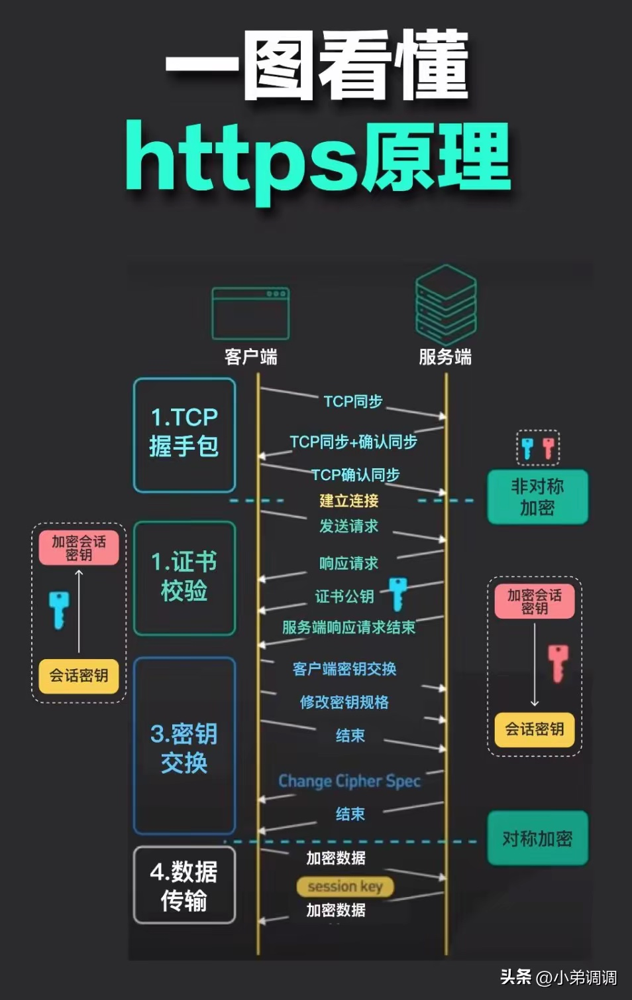
    
- OkHttp3整个流程?
    
    🧙🏾‍♂️: 好的，我们将重点分析OKHttp3中请求的执行过程。我们将从创建请求开始，到最终获取响应，并详细解析其中的关键步骤和源码。为了帮助你更好地理解，我们将逐步进行以下几个步骤：
    
    1. **请求的创建和初始化**
    2. **请求的执行过程**
    3. **拦截器链**
    4. **网络层与连接池**
    
    ### 1. 请求的创建和初始化
    
    请求的创建一般是通过`Request.Builder`来完成的，例如：
    
    ```java
    Request request = new Request.Builder()
        .url("<https://example.com>")
        .build();
    
    ```
    
    接下来是通过`OkHttpClient`创建`Call`对象：
    
    ```java
    OkHttpClient client = new OkHttpClient();
    Call call = client.newCall(request);
    
    ```
    
    ### 2. 请求的执行过程
    
    请求的执行有两种方式：同步和异步。分别通过`Call.execute()`和`Call.enqueue()`方法来执行。
    
    ### 同步请求
    
    ```java
    Response response = call.execute();
    
    ```
    
    ### 异步请求
    
    ```java
    call.enqueue(new Callback() {
        @Override
        public void onFailure(Call call, IOException e) {
            // 请求失败处理
        }
    
        @Override
        public void onResponse(Call call, Response response) throws IOException {
            // 请求成功处理
        }
    });
    
    ```
    
    ### 3. 源码分析：请求的执行过程
    
    我们重点分析同步请求的执行过程，即`Call.execute()`方法。
    
    ### `RealCall.execute()`
    
    这是`Call`接口的一个实现，核心方法`RealCall.execute()`的实现如下：
    
    ```java
    @Override 
    public Response execute() throws IOException {
        synchronized (this) {
            if (executed) throw new IllegalStateException("Already Executed");
            executed = true;
        }
        captureCallStackTrace();
        timeout.enter();
        callStart();
        try {
            client.dispatcher().executed(this);
            Response result = getResponseWithInterceptorChain();
            if (result == null) throw new IOException("Canceled");
            return result;
        } finally {
            client.dispatcher().finished(this);
        }
    }
    ```
    
    这个方法主要做了以下几件事：
    
    1. **检查请求是否已经执行**：防止重复执行。
    2. **超时处理**：初始化超时相关操作。
    3. **请求开始的回调**：调用`callStart()`方法。
    4. **通过拦截器链获取响应**：调用`getResponseWithInterceptorChain()`方法。
    5. **请求结束的回调**：调用`client.dispatcher().finished(this)`。
    
    ### `getResponseWithInterceptorChain()`
    
    这个方法是整个请求过程中最核心的部分，负责通过拦截器链来获取最终的响应。
    
    ```java
    Response getResponseWithInterceptorChain() throws IOException {
        // Build a full stack of interceptors.
        List<Interceptor> interceptors = new ArrayList<>();
        interceptors.addAll(client.interceptors());
        interceptors.add(new RetryAndFollowUpInterceptor(client));
        interceptors.add(new BridgeInterceptor(client.cookieJar()));
        interceptors.add(new CacheInterceptor(client.internalCache()));
        interceptors.add(new ConnectInterceptor(client));
        if (!forWebSocket) {
            interceptors.addAll(client.networkInterceptors());
        }
        interceptors.add(new CallServerInterceptor(forWebSocket));
    
        Interceptor.Chain chain = new RealInterceptorChain(interceptors, null, null, null, 0,
            originalRequest, this, client.connectTimeoutMillis(),
            client.readTimeoutMillis(), client.writeTimeoutMillis());
    
        return chain.proceed(originalRequest);
    }
    
    ```
    
    这个方法做了以下几件事：
    
    1. **构建拦截器链**：包括用户自定义的拦截器和内置的拦截器。
    2. **创建`RealInterceptorChain`**：将拦截器链和请求传入。
    3. **调用`proceed`方法**：执行拦截器链，获取响应。
    
    ### 4. 拦截器链
    
    每个拦截器都有机会对请求和响应进行处理。常见的内置拦截器包括：
    
    - **RetryAndFollowUpInterceptor**：负责重试和重定向逻辑。
    - **BridgeInterceptor**：负责将用户请求转换为HTTP请求。
    - **CacheInterceptor**：负责缓存逻辑。
    - **ConnectInterceptor**：负责与服务器建立连接。
    - **CallServerInterceptor**：负责实际的网络I/O操作。
    
    ### 5. 网络层与连接池
    
    在`ConnectInterceptor`中，会通过`ConnectionPool`来复用连接，提升性能。
    
    以下是`ConnectInterceptor`的核心代码：
    
    ```java
    @Override public Response intercept(Chain chain) throws IOException {
        Request request = chain.request();
        RealConnection connection = Internal.instance.get(connectionPool, address, this, request);
        // 省略部分代码
        return chain.proceed(request, connection, streamAllocation, httpCodec, response);
    }
    
    ```
    
    `ConnectionPool`负责管理与服务器的连接，并提供连接复用的功能，从而减少连接建立的开销。
    
    ### 总结
    
    OKHttp3的请求执行过程是一个高度模块化和可扩展的流程，通过拦截器链的设计，能够灵活地在请求和响应的不同阶段插入自定义逻辑。通过`RealCall.execute()`方法，我们可以看到请求的创建、执行、响应处理的全过程，了解了如何通过拦截器链来进行请求的拦截和处理。
    
    接下来，你是否有特定的部分需要进一步深入解析，或者对某个拦截器有特别的兴趣？
    
- 5 大OkHttp拦截器图示
    
    
    
    OkHttp是一个流行的开源HTTP客户端库，提供了丰富的功能和灵活的扩展机制。其中，拦截器（Interceptor）是OkHttp中非常重要的一部分，用于在HTTP请求和响应过程中对请求和响应进行处理、修改和监控。OkHttp提供了五种常用的拦截器，它们分别是：
    
    1. **CallServerInterceptor**：
        - 作用：负责发送HTTP请求给服务器并获取响应。
        - 功能：在发送HTTP请求之后，这个拦截器会等待服务器的响应，获取响应数据，并将响应数据返回给调用者。
    2. **ConnectInterceptor**：
        - 作用：负责建立与服务器的连接。
        - 功能：在发送HTTP请求之前，这个拦截器会检查连接池中是否存在可复用的连接，如果有，则复用该连接；如果没有，则创建一个新的连接。
    3. **CacheInterceptor**：
        - 作用：负责处理缓存。
        - 功能：在发送HTTP请求之前和获取服务器响应之后，这个拦截器会根据缓存策略来处理缓存，包括缓存的读取、写入、更新和删除等操作。
    4. **BridgeInterceptor**：
        - 作用：负责桥接应用程序和OkHttp。
        - 功能：在发送HTTP请求之前，这个拦截器会添加一些必要的请求头（如User-Agent、Accept-Encoding等），以及处理一些特殊的请求（如POST请求的请求体）。
    5. **RetryAndFollowUpInterceptor**：
        - 作用：负责处理请求的重试和重定向。
        - 功能：在发送HTTP请求之后，这个拦截器会根据服务器的响应状态码来判断是否需要进行重试或者重定向操作，并在必要时执行相应的操作。
    
    这五个拦截器在OkHttp中按照一定的顺序依次执行，每个拦截器负责不同的功能，通过它们的协作可以实现丰富的功能，如连接复用、重试、缓存等。同时，OkHttp还提供了灵活的扩展机制，允许开发者根据自己的需求自定义拦截器，从而实现更复杂的功能和业务逻辑。
    
- Okhttp会涉及队列吗?那一部分用的,怎么用的?
    
    🧙🏾‍♂️: 是的，OKHttp在请求的调度和执行过程中使用了队列。具体来说，OKHttp使用了`Dispatcher`类来管理请求的队列。接下来，我们将详细解析OKHttp中队列的使用，包括它的作用和具体实现。
    
    ### 1. Dispatcher简介
    
    `Dispatcher`类负责调度所有的网络请求，并通过队列管理同步和异步请求。它主要包含以下几个部分：
    
    - **同步请求队列**：管理同步请求。
    - **异步请求队列**：管理异步请求。
    - **执行中的请求**：跟踪正在执行的请求。
    
    ### 2. Dispatcher的核心属性
    
    以下是`Dispatcher`类的核心属性：
    
    ```java
    public final class Dispatcher {
        private int maxRequests = 64;
        private int maxRequestsPerHost = 5;
    
        private final Deque<Call.AsyncCall> readyAsyncCalls = new ArrayDeque<>();
        private final Deque<Call.AsyncCall> runningAsyncCalls = new ArrayDeque<>();
        private final Deque<Call> runningSyncCalls = new ArrayDeque<>();
        // 其他属性和方法
    }
    
    ```
    
    - `maxRequests`：最大同时请求数。
    - `maxRequestsPerHost`：每个主机的最大同时请求数。
    - `readyAsyncCalls`：等待执行的异步请求队列。
    - `runningAsyncCalls`：正在执行的异步请求队列。
    - `runningSyncCalls`：正在执行的同步请求队列。
    
    ### 3. 队列的使用：异步请求
    
    当一个异步请求被添加到`Dispatcher`时，它首先会进入`readyAsyncCalls`队列，然后根据当前的执行情况，决定是否立即执行或等待。
    
    ### `enqueue`方法
    
    当你调用`Call.enqueue()`方法时，实际上会调用`Dispatcher.enqueue()`：
    
    ```java
    synchronized void enqueue(AsyncCall call) {
        readyAsyncCalls.add(call);
    
        // 尝试执行更多请求
        promoteAndExecute();
    }
    
    ```
    
    这个方法将请求添加到`readyAsyncCalls`队列中，并调用`promoteAndExecute()`方法尝试执行请求。
    
    ### `promoteAndExecute`方法
    
    这个方法负责从`readyAsyncCalls`队列中选择可以执行的请求，并将其移到`runningAsyncCalls`队列中：
    
    ```java
    private void promoteAndExecute() {
        if (runningAsyncCalls.size() >= maxRequests) return; // 达到最大并发请求数
    
        for (Iterator<Call.AsyncCall> i = readyAsyncCalls.iterator(); i.hasNext(); ) {
            Call.AsyncCall call = i.next();
    
            // 如果请求可以执行，移到runningAsyncCalls队列中
            if (runningAsyncCalls.size() < maxRequests && runningCallsForHost(call) < maxRequestsPerHost) {
                i.remove();
                runningAsyncCalls.add(call);
                executorService().execute(call);
            }
    
            if (runningAsyncCalls.size() >= maxRequests) return; // 达到最大并发请求数
        }
    }
    
    ```
    
    这个方法主要做了以下几件事：
    
    1. **检查并发请求数是否达到上限**。
    2. **遍历`readyAsyncCalls`队列**，选择可以执行的请求。
    3. **将可执行的请求从`readyAsyncCalls`移到`runningAsyncCalls`**。
    4. **通过`executorService`执行请求**。
    
    ### 4. 队列的使用：同步请求
    
    同步请求与异步请求的处理方式有所不同，但也涉及队列管理。`Dispatcher`将同步请求添加到`runningSyncCalls`队列中进行管理。
    
    ### `executed`方法
    
    当你调用`Call.execute()`方法时，实际上会调用`Dispatcher.executed()`：
    
    ```java
    synchronized void executed(Call call) {
        runningSyncCalls.add(call);
    }
    
    ```
    
    这个方法将同步请求添加到`runningSyncCalls`队列中。
    
    ### `finished`方法
    
    当请求完成后，不论是同步还是异步，都会调用`Dispatcher.finished()`方法，将请求从对应的队列中移除：
    
    ```java
    void finished(AsyncCall call) {
        finished(runningAsyncCalls, call);
    }
    
    void finished(Call call) {
        finished(runningSyncCalls, call);
    }
    
    private <T> void finished(Deque<T> calls, T call) {
        int runningCallsCount;
        Runnable idleCallback;
    
        synchronized (this) {
            if (!calls.remove(call)) throw new AssertionError("Call wasn't in-flight!");
            runningCallsCount = runningCallsCount();
            idleCallback = this.idleCallback;
        }
    
        if (runningCallsCount == 0 && idleCallback != null) {
            idleCallback.run();
        }
    }
    
    ```
    
    这个方法负责将请求从相应的队列中移除，并检查是否有空闲回调需要执行。
    
    ### 总结
    
    OKHttp通过`Dispatcher`类使用队列来管理请求的调度和执行。`readyAsyncCalls`和`runningAsyncCalls`队列用于管理异步请求，而`runningSyncCalls`队列用于管理同步请求。通过`promoteAndExecute`方法，OKHttp能够高效地控制请求的并发数，确保不会超出设定的最大请求数限制。
    
    通过以上的解析，你应该对OKHttp中队列的使用有了深入的了解。如果你有更多具体问题或需要进一步解析的部分，请告诉我。
    
- 详细解析一下OkHttp的连接池是怎么复用,以及是怎么判断连接是可用的?
    
    🧙🏾‍♂️: 下面我们详细解析OKHttp的连接池是如何实现连接复用以及如何判断连接是否可用的。我们将会深入`ConnectionPool`和`RealConnection`类，逐步解析其中的关键部分。
    
    ### 1. 连接池简介
    
    OKHttp通过`ConnectionPool`类管理连接池，用于复用HTTP连接，以减少连接建立的开销，提高网络请求的效率。
    
    ### 2. `ConnectionPool`类的核心属性和方法
    
    ### 核心属性
    
    `ConnectionPool`类的核心属性如下：
    
    ```java
    public final class ConnectionPool {
        private final int maxIdleConnections;
        private final long keepAliveDurationNs;
        private final Deque<RealConnection> connections = new ArrayDeque<>();
        private final Runnable cleanupRunnable = new Runnable() {
            @Override public void run() {
                while (true) {
                    long waitNanos = cleanup(System.nanoTime());
                    if (waitNanos == -1) return;
                    if (waitNanos > 0) {
                        long waitMillis = waitNanos / 1000000L;
                        waitNanos -= (waitMillis * 1000000L);
                        synchronized (ConnectionPool.this) {
                            try {
                                ConnectionPool.this.wait(waitMillis, (int) waitNanos);
                            } catch (InterruptedException ignored) {
                            }
                        }
                    }
                }
            }
        };
    }
    
    ```
    
    - `maxIdleConnections`：最大空闲连接数。
    - `keepAliveDurationNs`：连接保持活跃的时间（纳秒）。
    - `connections`：保存空闲连接的双端队列。
    - `cleanupRunnable`：清理线程。
    
    ### 主要方法
    
    ### `get`方法
    
    获取一个可用的连接：
    
    ```java
    RealConnection get(Address address, StreamAllocation streamAllocation, Route route) {
        assert (Thread.holdsLock(this));
    
        for (RealConnection connection : connections) {
            if (connection.isEligible(address, route)) {
                streamAllocation.acquire(connection);
                return connection;
            }
        }
        return null;
    }
    
    ```
    
    该方法遍历连接池中的连接，检查连接是否符合要求（通过`isEligible`方法），并返回一个可用的连接。
    
    ### `put`方法
    
    将连接放回连接池：
    
    ```java
    void put(RealConnection connection) {
        assert (Thread.holdsLock(this));
        if (!cleanupRunning) {
            cleanupRunning = true;
            executor.execute(cleanupRunnable);
        }
        connections.add(connection);
    }
    
    ```
    
    该方法将连接添加到`connections`队列，并启动清理线程。
    
    ### `cleanup`方法
    
    定期清理连接：
    
    ```java
    long cleanup(long now) {
        int idleConnectionCount = 0;
        long longestIdleDurationNs = Long.MIN_VALUE;
    
        synchronized (this) {
            for (Iterator<RealConnection> i = connections.iterator(); i.hasNext(); ) {
                RealConnection connection = i.next();
    
                long idleDurationNs = now - connection.idleAtNanos;
                if (idleDurationNs > keepAliveDurationNs || connection.noNewStreams) {
                    i.remove();
                    connection.socket().close();
                } else {
                    if (idleDurationNs > longestIdleDurationNs) {
                        longestIdleDurationNs = idleDurationNs;
                    }
                    idleConnectionCount++;
                }
            }
    
            if (idleConnectionCount > 0) {
                return keepAliveDurationNs - longestIdleDurationNs;
            } else if (!connections.isEmpty()) {
                return keepAliveDurationNs;
            } else {
                cleanupRunning = false;
                return -1;
            }
        }
    }
    
    ```
    
    该方法遍历连接池中的连接，关闭超过`keepAliveDurationNs`时间未使用的连接，并返回下一次清理的时间。
    
    ### 3. 连接的复用和可用性判断
    
    ### 连接复用
    
    OKHttp通过在每次请求时从连接池中获取可用连接来实现连接复用。如果连接池中存在符合条件的连接，就会将其复用，否则创建一个新的连接。
    
    ### `RealConnection.isEligible`方法
    
    判断连接是否符合复用条件：
    
    ```java
    boolean isEligible(Address address, @Nullable Route route) {
        // 地址和路由是否匹配
        if (!this.route.address().equals(address)) return false;
    
        // 连接是否可用
        if (route == null || route.proxy().type() == Proxy.Type.DIRECT || this.route.proxy().type() == Proxy.Type.DIRECT) {
            if (route != null && !this.route.equals(route)) return false;
            return true;
        }
    
        // 检查连接是否有效
        if (this.route.proxy().type() != Proxy.Type.DIRECT) return false;
        if (route != null && !route.equals(this.route)) return false;
    
        return true;
    }
    
    ```
    
    这个方法会检查连接的地址和路由是否匹配，以及连接是否可用。
    
    ### 判断连接是否可用
    
    OKHttp通过以下几个方面判断连接是否可用：
    
    1. **连接是否关闭**：如果连接已经关闭，就不能复用。
    2. **连接的最大空闲时间**：如果连接的空闲时间超过`keepAliveDurationNs`，就不能复用。
    3. **连接的健康状态**：通过发送`ping`请求或其他方式检查连接是否仍然活跃。
    
    ### `RealConnection.isHealthy`方法
    
    检查连接是否健康：
    
    ```java
    boolean isHealthy(boolean doExtensiveChecks) {
        if (socket.isClosed() || socket.isInputShutdown() || socket.isOutputShutdown()) {
            return false;
        }
        if (http2Connection != null) {
            return http2Connection.isHealthy(doExtensiveChecks);
        }
        if (doExtensiveChecks) {
            try {
                int readTimeout = socket.getSoTimeout();
                socket.setSoTimeout(1);
                if (source.exhausted()) {
                    return false;
                }
                socket.setSoTimeout(readTimeout);
            } catch (SocketTimeoutException ignored) {
            } catch (IOException e) {
                return false;
            }
        }
        return true;
    }
    
    ```
    
    该方法通过检查套接字的状态、读取超时、以及是否有未读数据来判断连接是否健康。
    
    ### 4. 关键类：RealConnection
    
    `RealConnection`类代表一个实际的连接，其主要属性和方法包括：
    
    ### 核心属性
    
    ```java
    public final class RealConnection extends Http2Connection.Listener implements Connection {
        private final ConnectionPool connectionPool;
        private final Route route;
        private Socket socket;
        private long idleAtNanos = Long.MAX_VALUE;
        private int successCount;
        private Handshake handshake;
        private Protocol protocol;
        private Http2Connection http2Connection;
    }
    
    ```
    
    - `connectionPool`：连接池实例。
    - `route`：连接的路由。
    - `socket`：底层的套接字。
    - `idleAtNanos`：连接的空闲时间。
    - `successCount`：连接成功的次数。
    - `handshake`：握手信息。
    - `protocol`：协议（HTTP/1.1或HTTP/2）。
    - `http2Connection`：HTTP/2连接实例。
    
    ### 总结
    
    OKHttp的连接池通过`ConnectionPool`类管理连接，并实现连接复用和清理机制。连接池通过队列保存空闲连接，通过`get`和`put`方法获取和释放连接。通过`cleanup`方法定期清理过期的连接，确保连接池中的连接始终可用。连接的健康状态通过`isHealthy`方法进行判断，以确保复用的连接是可靠的。
    
    如果你有其他问题或需要进一步深入的解析，请告诉我。
    
- 计算机网络通信为什么要分层？
    
    计算机网络通信要分层是使得系统更易于理解、设计和实现，提高网络的维护性和可扩展性。分层的主要目的包括：
    
    1. **模块化设计**：将整个通信系统分解为多个层次，每个层次负责特定的功能，使得系统更易于理解、设计和实现。每一层都提供一组清晰定义的服务，上层能够通过这些服务来实现自己的功能，而不需要关注底层实现的细节。
    2. **标准化**：分层设计促使网络通信遵循标准化的协议，不同厂商和组织之间能够基于共同的标准进行通信，提高了系统的互操作性和兼容性。
    3. **易于维护和扩展**：由于各层之间的独立性，可以单独对某一层进行修改、更新或扩展，而不会影响其他层的功能和实现。这样可以降低系统维护的难度，同时也有利于系统的升级和扩展。
    4. **性能优化**：分层设计使得每一层都能够专注于特定的功能，可以根据实际需求对每一层进行优化，从而提高整个系统的性能和效率。
    5. **隔离故障**：分层设计能够将不同层次的功能隔离开来，当某一层发生故障时，只会影响到该层及其上下相邻的层，而不会对整个系统造成严重影响。
    
    总的来说，分层设计是一种有效的组织网络通信系统的方式，它使得系统更加模块化、标准化、易于维护和扩展，同时也有利于性能优化和故障隔离。
    
- 网络具体分层
    
    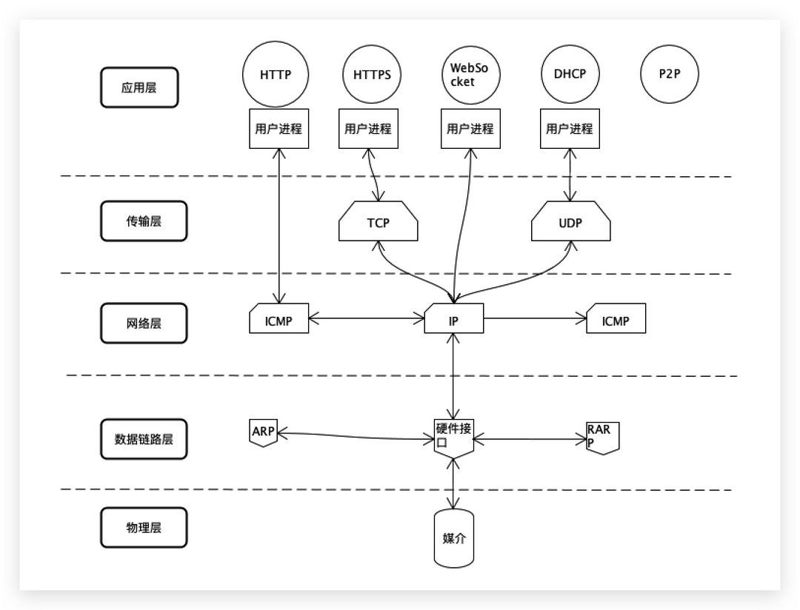
    
    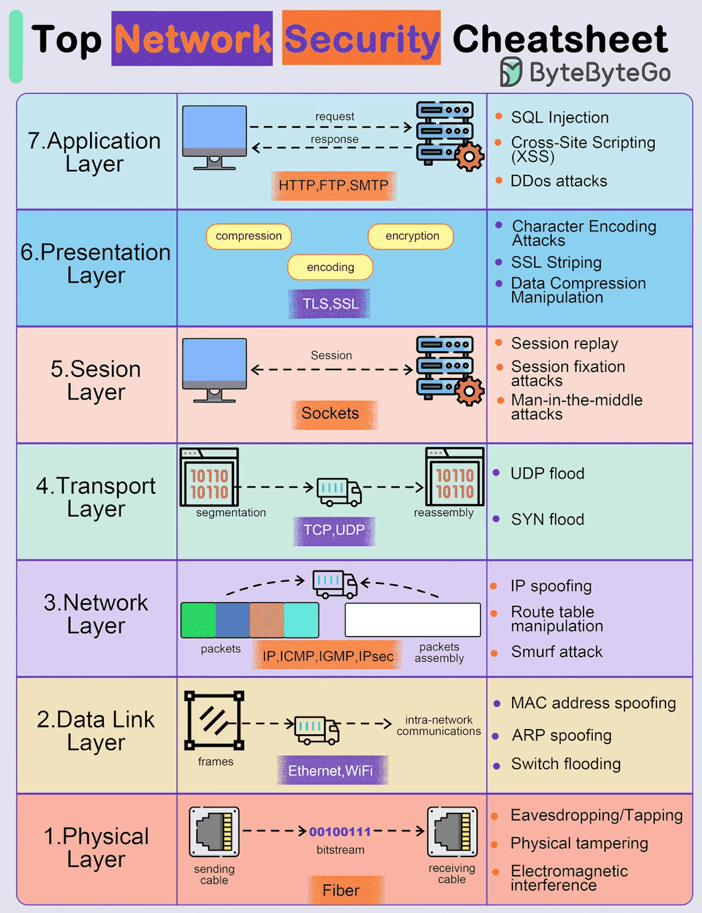
    
- TCP为什么要三次握手和四次挥手？
    
    TCP协议采用三次握手和四次挥手的机制，是为了确保通信的可靠性和正确性。具体原因如下：
    
    **三次握手的原因**：
    
    1. **建立连接的可靠性**：在开始数据传输之前，需要确保客户端和服务器之间的通信是可靠的。三次握手机制确保了双方都能够收到对方的确认信息，从而建立了可靠的连接。
    2. **防止过期的连接请求**：通过三次握手，可以防止过期的连接请求被错误地接受。如果只有两次握手，客户端发送的连接请求可能会在网络中滞留，导致服务器错误地接受过期的连接请求。
    3. **防止重复连接**：三次握手还可以防止重复的连接请求被服务器错误地接受。通过三次握手，客户端和服务器都可以确定对方发送的连接请求是唯一的，避免了重复连接的问题。
    
    **四次挥手的原因**：
    
    1. **确保数据完整传输**：在关闭连接之前，需要确保所有的数据都已经成功传输到对方。四次挥手机制通过双方交换确认信息，确保数据的完整传输。
    2. **防止连接的半关闭**：在关闭连接时，需要双方都明确地表示自己不再发送数据，从而避免连接的半关闭状态。四次挥手中的最后一次挥手是用来告知对方自己已经不再发送数据，以及对方也不再发送数据，从而完成连接的关闭。
    
    总的来说，TCP采用三次握手和四次挥手的机制，是为了确保通信的可靠性和正确性，在建立连接和关闭连接时进行必要的确认和协商，从而提高了网络通信的可靠性和稳定性。
    
- TCP协议的三次握手的过程？
    
    TCP（传输控制协议）使用三次握手来建立可靠的连接。三次握手的目的是确保客户端和服务器之间的通信能够正常进行，并且双方都能够接收和发送数据。
    
    1. 第一次握手：是由客户端向服务器端发起的。这是用来去发起一个连接建立的请求，那么这个报文中的SYN位会被标记为：1，所以呢我们常把他叫做一个 SYN包。
    2. 第二次握手：是由服务器向客户端发起的，是来确认服务器的一个请求连接的，这个报文中我们的ACK位还有SYN位都被标记：1，所以我们也把它叫作一个SYN-ACK包。
    3. 第三次握手：同样是客户端发给服务器的，这是对服务器的上一个报文的一个确认报文，这个报文中的一个ACK位被标记为：1，所以我们要把叫做一个ACK包
    4. 以上就是 TCP（协议）三次握手的一个过程
- TCP协议的四次挥手过程
    
    TCP协议的四次挥手过程用于终止一个已建立的TCP连接。以下是四次挥手的步骤：
    
    1. **第一步（客户端发送FIN）**：
        - 客户端发送一个带有FIN标志位的TCP段给服务器，表示客户端已经完成数据发送，要求关闭连接。
        - 这个FIN报文段的序列号（Sequence Number）由客户端增加1。
    2. **第二步（服务器回应ACK）**：
        - 服务器收到客户端的FIN后，发送一个确认序号（Acknowledgement Number）为收到序号加1的ACK给客户端。
        - 此时，服务器进入CLOSE_WAIT状态，等待应用层处理完数据后，再发送FIN给客户端。
    3. **第三步（服务器发送FIN）**：
        - 服务器处理完数据后，发送一个带有FIN标志位的TCP段给客户端，表示服务器已经完成数据发送，要求关闭连接。
        - 这个FIN报文段的序列号由服务器增加1。
    4. **第四步（客户端回应ACK）**：
        - 客户端收到服务器的FIN后，发送一个确认序号为收到序号加1的ACK给服务器。
        - 此时，客户端进入TIME_WAIT状态，等待可能出现的延迟报文，然后才会关闭连接。
        - 服务器收到客户端的ACK后，关闭连接，进入CLOSED状态。
    
    在四次挥手过程中，由于TCP是全双工的，因此每一方都需要发送FIN来关闭连接。另外，为了确保双方都能够完整地收到对方的FIN和ACK，客户端在发送最后一次ACK后会等待一段时间（称为TIME_WAIT状态），以处理可能出现的延迟报文。
    
- Retrofit的HttpServiceMethod
    
    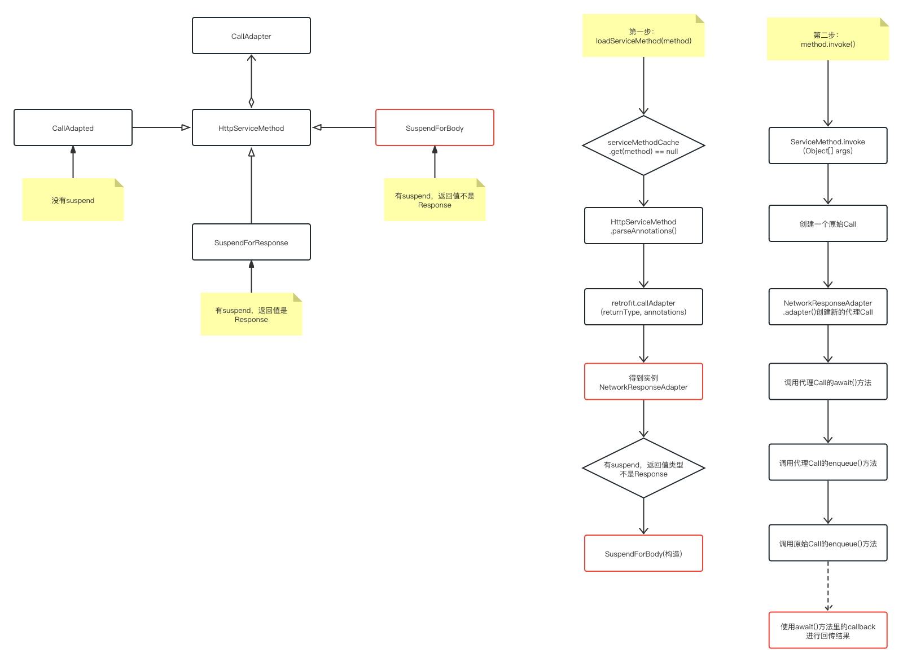
    
    Retrofit的HttpServiceMethod
    
- 当你输入到 URL 到浏览器，发生了什么？
    
    总体来说分为以下几个过程:
    
    1. DNS解析
    2. TCP连接
    3. 发送HTTP请求
    4. 服务器处理请求并返回HTTP报文
    5. 浏览器解析渲染页面
    6. 连接结束
    
    详细信息：[https://segmentfault.com/a/1190000006879700](https://segmentfault.com/a/1190000006879700)
    
    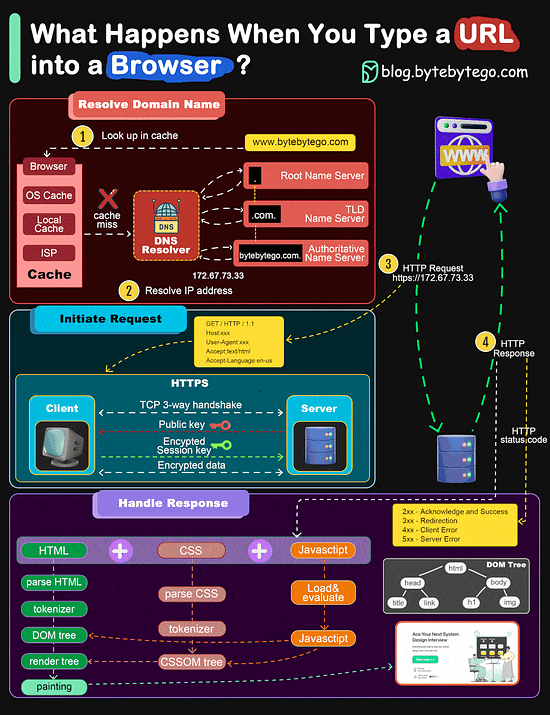
    
    [](https://p26-sign.toutiaoimg.com/tos-cn-i-ezhpy3drpa/8d954f9b42c64ea0ab9be4567e38f523~tplv-obj:550:715.image?_iz=97245&from=post&lk3s=06827d14&x-expires=1712793600&x-signature=uJkW6vFGfydSJfrxk3ryuGiUMxY%3D)
    
- 面试：TCP连接可以发多个HTTP 请求
    
    **面试官问我：一个 TCP 连接可以发多少个 HTTP 请求？我竟然回答不上来**
    
    [https://mp.weixin.qq.com/s?__biz=MzI2OTQxMTM4OQ==&mid=2247528080&idx=2&sn=c26a7ff2f8d86928c5b73ea139fd2ba8&chksm=eae29bc2dd9512d47fb5a3f69d6613ce7a417a6e6b27a2a84b63adcf35db8c80a2cbe52c9dbb&scene=132&exptype=timeline_recommend_article_extendread_samebiz#wechat_redirect](https://mp.weixin.qq.com/s?__biz=MzI2OTQxMTM4OQ==&mid=2247528080&idx=2&sn=c26a7ff2f8d86928c5b73ea139fd2ba8&chksm=eae29bc2dd9512d47fb5a3f69d6613ce7a417a6e6b27a2a84b63adcf35db8c80a2cbe52c9dbb&scene=132&exptype=timeline_recommend_article_extendread_samebiz#wechat_redirect)
    
- 一张图看懂 8 种网络协议
    
    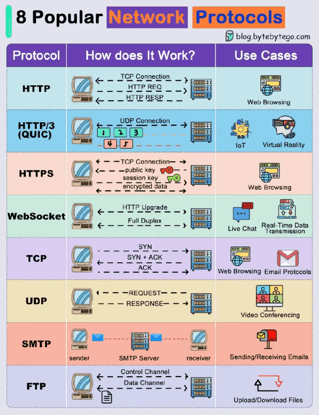
    
    [https://mp.weixin.qq.com/s/zT2WUPweZXSez10wCEzCog](https://mp.weixin.qq.com/s/zT2WUPweZXSez10wCEzCog)
    
- quic、cronet 分别是什么，有什么关系？
    
    QUIC（Quick UDP Internet Connections）是一种基于UDP协议的传输层协议，由Google开发。它旨在取代TCP作为传输层协议，以提供更快的连接建立和数据传输速度，并提供更好的流量控制和拥塞控制机制。QUIC通过在应用层实现可靠性和安全性，同时具有TCP和UDP的优点，成为了现代互联网通信的一种重要选择。
    
    Cronet是Google开发的用于移动应用程序的网络库，它是基于Chromium网络堆栈的移植版本。Cronet支持HTTP/HTTPS、HTTP/2和QUIC等协议，并提供了诸如缓存、代理、重试、连接池管理等功能。Cronet可以帮助开发者构建性能优化、稳定可靠的移动应用程序，提供更好的网络传输体验。
    
    关系：
    Cronet是基于Chromium网络堆栈的移植版本，支持多种网络协议，包括HTTP/HTTPS、HTTP/2和QUIC等。因此，Cronet可以使用QUIC作为其底层传输协议，以提供更快的连接建立和数据传输速度。可以说，Cronet和QUIC是相关的，Cronet可以利用QUIC的特性来优化移动应用程序的网络通信性能。
    
- HTTPS的传输流程？
    
    其实一个Https请求，中间包含了2次Http传输，假如我们请求www.baidu.com 具体流程如下：
    
    （1）客户端向服务端发起请求，要访问百度，那么此时与百度的服务器建立连接。
    
    （2）此时服务端有公钥和私钥，公钥可以发送给客户端，然后给客户端发送了一个SSL证书，其中包括：CA签名、公钥、百度的一些信息，详情可见2.2小节最后的图。
    
    （3）客户端在接收到SSL证书后，对CA签名解密，判断证书是否合法，如果不合法，那么就断开此次连接；如果合法，那么就生成一个随机数，**作为数据对称加密的密钥，通过公钥加密发送到服务端。**
    
    （4）服务端接收到了客户端加密数据后，通过私钥解密，拿到了对称加密的密钥，然后将百度相关数据通过对称加密秘钥加密，发送到客户端。
    
    （5）客户端通过解密拿到了服务端的数据，此次请求结束。
    
    其实Https请求并不是完全是非对称加密，而是集各家之所长，**因为对称加密密钥传递有风险，因此前期通过非对称加密传递对称加密密钥，后续数据传递都是通过对称加密，提高了数据解析的效率。**
    
    但是我们需要了解的是，Https保障的只是通信双方当事人的安全，像测试伙伴通过Charles抓包这种中间人攻击方式，还是会导致数据泄露的风险，因为通过伪造证书或者不受信任的CA就可以实现。
    
    图片
    
- HTTPS是什么
    
    Https = Http + SSL/TLS
    
    本质：在客户端和服务器之间用非对称加密协商出一套对称密钥，每
    次发送信息之前将内容加密，收到之后解密，达到内容的加密传输
    
- HTTPS连接简要过程
    1. 客户端：请求建立TLS请求建立连接
    2. 服务器：发回证书
    3. 客户端：验证服务器证书
    4. 客户端：信任服务器后，和服务器协商对称密钥
    5. 使用对称密钥开始通信
- HTTPS连接详细过程
    1. 是由客户端向服务器端发送一个字节(就是1)的数据，这个数据的值被叫做 Client Hello；还有可选的 TLS 版本的集合，可选的加密套件(可选的对称机密算法、可选的非对称加密算法和可选的 hash 算法)，还有客户端生成的随机数
    
    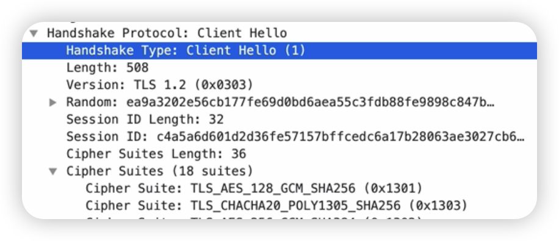
    
    1. 服务器收到这些信息之后，选出我要的 TLS 版本和我要加密套件，还有服务端随机睡，然后把这些信息发回给客户端，也会发回一个单字节(实际是 0)的数据，被叫作 Server Hello。  
        
        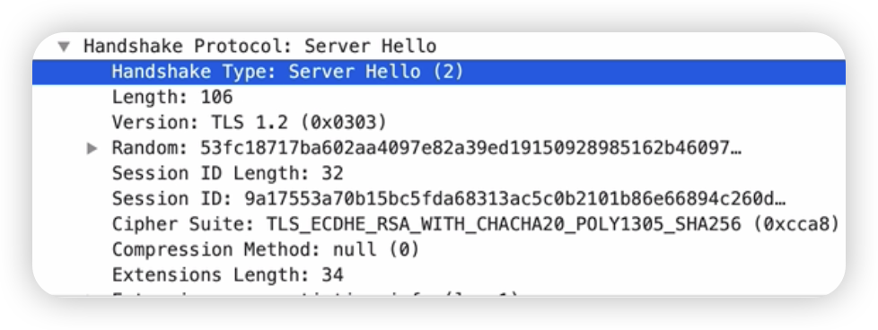
        
    2. 服务器向客户端发送证书，把服务器的公钥发送过去，还有证书签名信息
        
        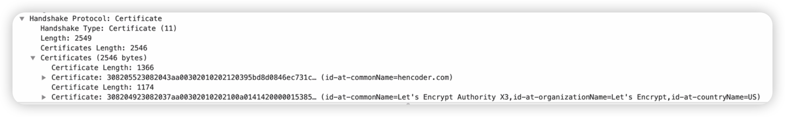
        
    3. 客户端使用签发机构的公钥来验证证书的合法性，还要通过主机名验证证书的正确性
        
        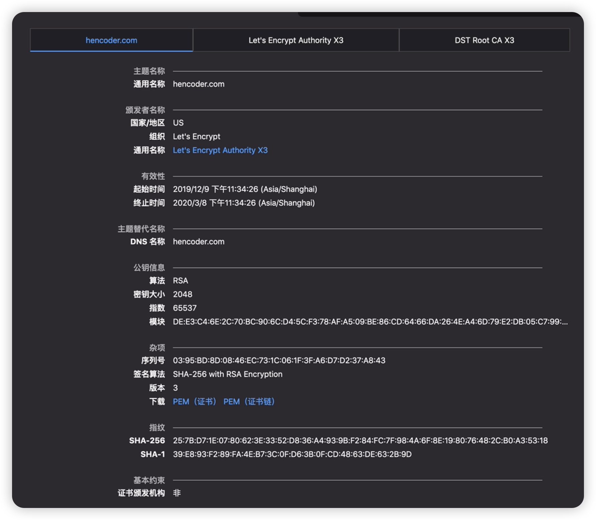
        
    4. 客户端向服务器发送Pre-master secret（使用服务器的公钥加密）
        
        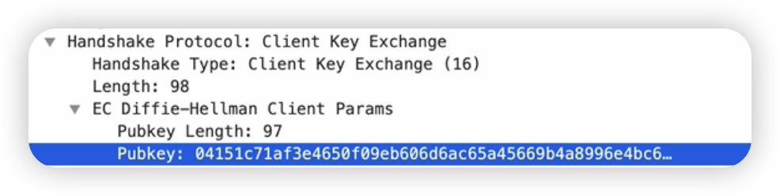
        
    5. 然后双方使用客户端的随机数、服务器的随机数和Pre-master secret，双方都会算出一个master secret(包括四个信息：客户端加密密钥，服务端加密密钥，客户端MAC secret，服务端MAC secret)
    6. 最后双方使用 master secret 最为密钥，使用对称加密的加密通信，直到会话结束
    
    - 为什么要用三个数，来算出对称加密的密钥呢？答：为了防止重放攻击
        
        为什么要使用两个非对称密钥？答：为了防止仍回来
        
    
- HTTPS 通讯过程中，证书的作用是什么?
    
    在 HTTPS 通信过程中，证书的作用是确保通信的安全性和可信度。具体来说，证书的作用包括以下几个方面：
    
    1. **身份验证**：证书用于验证服务器的身份。服务器会向客户端发送其数字证书，证书包含了服务器的公钥以及一些其他信息，比如证书颁发机构（CA）的数字签名等。客户端可以通过检查证书的有效性来确认服务器是否是其声称的那个，并且证书也可以证明通信双方之间的身份。
    2. **加密通信**：证书中包含了服务器的公钥，客户端可以使用该公钥来加密传输给服务器的数据。这样，即使数据被窃听，也无法解密其内容，因为解密需要服务器持有的私钥，私钥不会包含在证书中，只有服务器知道。
    3. **数据完整性**：证书还包含了服务器的数字签名，该签名由证书颁发机构（CA）对证书内容进行加密生成，用来确保证书的完整性。客户端可以使用 CA 的公钥来验证签名的有效性，从而确保证书未被篡改。
    
    总之，证书在 HTTPS 通信中起着关键的作用，通过验证服务器的身份、加密通信数据以及确保数据的完整性，保障了通信的安全性和可信度。
    
- HTTP 的多路复用是什么意思
    
    HTTP的多路复用指的是在单个TCP连接上同时发送多个HTTP请求和接收多个HTTP响应的能力。在传统的HTTP/1.1中，每个HTTP请求都需要建立一个新的TCP连接，这会导致网络资源的浪费和延迟增加。而在HTTP/2中引入了多路复用的机制，通过在单个TCP连接上并行发送多个请求和接收多个响应，从而提高了性能和效率。
    
    以下是HTTP的多路复用的一些关键点：
    
    1. **单个TCP连接**：在HTTP/2中，客户端和服务器之间只需建立一个TCP连接，而不是为每个HTTP请求建立一个新的TCP连接。这减少了TCP连接的建立和关闭所需的时间和资源消耗。
    2. **并行传输**：在单个TCP连接上，客户端可以同时发送多个HTTP请求，服务器也可以同时发送多个HTTP响应。这意味着多个请求和响应可以并行传输，而不会阻塞其他请求或响应。
    3. **头部压缩**：HTTP/2使用了头部压缩机制，将HTTP头部字段压缩发送，减少了每个请求和响应的头部大小，从而减少了网络带宽的占用和传输延迟。
    4. **避免队头阻塞**：在HTTP/1.1中，如果一个请求的响应被阻塞，后续的请求也会被延迟，导致队头阻塞问题。而在HTTP/2中，由于多路复用的机制，一个请求的阻塞不会影响其他请求的处理，避免了队头阻塞问题，提高了并发性能。
    
    总的来说，HTTP的多路复用通过在单个TCP连接上同时传输多个HTTP请求和响应，减少了TCP连接的建立和关闭次数，降低了网络延迟，提高了性能和效率。
    
- HTTP1.0、HTTP 1.1 、HTTP 2.0 的主要区别？
    
    HTTP/1.0、HTTP/1.1和HTTP/2.0是HTTP协议的不同版本，它们在功能和性能方面有许多区别。以下是它们的主要区别：
    
    1. **连接管理**：
        - HTTP/1.0：每个HTTP请求/响应都需要建立一个新的TCP连接，请求完成后立即关闭连接。这种连接管理方式会导致连接频繁建立和关闭，增加了网络开销和延迟。
        - HTTP/1.1：引入了持久连接（Persistent Connection）机制，允许多个HTTP请求/响应共享同一个TCP连接。这样可以减少连接建立和关闭的开销，提高了性能和效率。
        - HTTP/2.0：使用单个TCP连接进行多路复用，可以同时发送多个HTTP请求和接收多个HTTP响应。这进一步降低了连接建立和关闭的开销，提高了并发性能和效率。
    2. **头部压缩**：
        - HTTP/1.0和HTTP/1.1：每个HTTP请求和响应的头部信息都需要完整传输，包括重复的头部字段。这会增加网络带宽的占用和传输延迟。
        - HTTP/2.0：引入了头部压缩机制，可以将重复的头部字段进行压缩发送，减少了每个请求和响应的头部大小，降低了网络带宽的占用和传输延迟。
    3. **多路复用**：
        - HTTP/1.0和HTTP/1.1：每个HTTP请求/响应在同一个TCP连接上依次发送和接收，无法同时进行多个请求和响应的传输。
        - HTTP/2.0：通过在单个TCP连接上实现多路复用，可以同时发送多个HTTP请求和接收多个HTTP响应。这提高了并发性能和效率，尤其对于高延迟和高丢包率的网络环境效果更为显著。
    4. **服务端推送**：
        - HTTP/1.0和HTTP/1.1：服务端只能在客户端请求时响应，无法主动向客户端推送资源。
        - HTTP/2.0：支持服务端推送机制，服务端可以在收到客户端请求后主动向客户端推送相关资源，减少客户端等待时间，提高性能。
    
    总的来说，HTTP/2.0相对于HTTP/1.x具有更好的性能和效率，主要体现在连接管理、头部压缩、多路复用和服务端推送等方面。这些改进使得HTTP/2.0在现代网络环境中能够更好地适应高并发和高性能的需求。
    

[**Android 框架解析：OkHttp 请求原理基本认识**](https://xie.infoq.cn/article/9f1da4cd8077c14fa64722466)

[**Android 框架解析：深入理解 Retrofit 实现**](https://xie.infoq.cn/article/6c45b028d383b97a447032c04)

[https://github.com/getActivity/EasyHttp](https://github.com/getActivity/EasyHttp)

TCP的重传算法是一种用于在网络通信中处理丢失的数据包的机制。它通常使用超时重传和快速重传两种方法来处理丢失的数据包。超时重传是指当发送方在一定时间内没有收到确认应答时，就会重新发送数据包。快速重传是指当发送方收到连续的重复确认应答时，就会立即重新发送丢失的数据包，而不必等待超时。这些机制共同帮助TCP在不可靠的网络环境中实现可靠的数据传输。