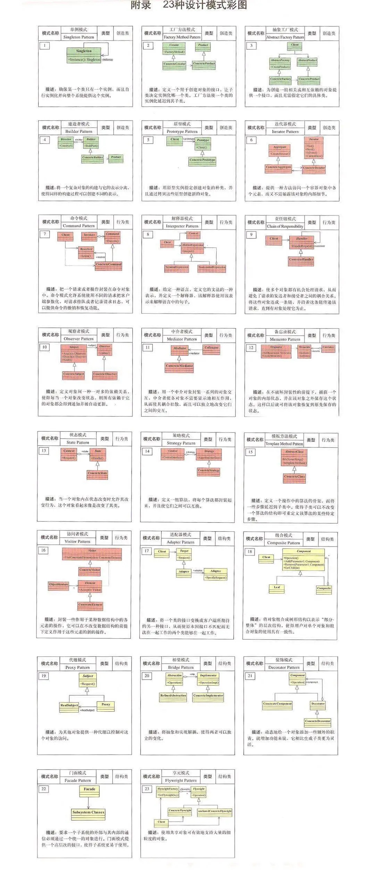

# 设计模式

<aside>
💡 设计计模式是一种在软件设计中常用的解决问题的方法论，它提供了一套经过验证的、可重用的设计思想和解决方案。设计模式可以帮助开发人员更好地组织和设计代码，提高代码的可读性、可维护性和可扩展性。

</aside>

- 面向对象的六大原则SOLID高扩展性、高內聚、低耦合
    - 单一职责原则SRP
        
        定义：就一类而言，应该仅有一个引起它变化的原因。
        
        解释：简单来说，一个类中应该是一组相关性很高的函数、数据的封装。
        
    - 开闭原则OCP
        
        定义：软件中的对象应该对于扩展开放的，但是对于修改是封闭的。
        
        解释：当软件需求变化时，应该尽量通过扩展的方式来实现，而是不是通过修改已有的代码实现。
        
    - 里氏替换原则 LSP
        
        定义：所有引用基类的地方必须能够透明地使用其子类的对象。
        
        解释：通俗点讲，只要父类能出现的地方子类就可以出现。但是，反过来就不行了，有子类出现的地方，父类未必就能适应。
        
    - 接口隔离原则 ISP
        
        定义：客户端不应该依赖它不需要的接口。
        
        解释：让客户端依赖的接口尽可能地小。
        
    - 里氏替换原则 DIP
        
        定义：模块间的依赖通过抽象发生，实现类之间不发生直接的依赖关系，其依赖关系是通过接口或抽象类产生的。
        
        解释：依赖抽象，而不依赖具体实现。
        
    - 迪米特原则 LOD
        
        定义：一个对象应该对其他对象有最少的了解。
        
- 基础高频设计模式
    - 单例模式-应用最广泛定义：单例对象的类必须保证只有一个实例存在。
        
        实践：ImageLoader，各种 Manager
        
        懒汉模式实现：方法上直接 synchronized缺点：第一次加载时要进行实例化，每次调用方法都要进行同步。
        
        饿汉单例实现：声明并创静态实例，获取实例直接返回
        
        DCL实现单例缺点：第一次加载时反应稍慢。
        
        静态内部类单例模式实现：第一次调用 getInstance 方法会导致虚拟机加载 SingletonHolder 类，优点：这种方式不仅能够确保线程安全，也能保证单例对象的唯一性，同时也延迟了单例的实例化，所以是推荐使用的单例模式实现方式。
        
    - Builder 模式-自由拓展你的项目定义：将一个复杂对象的构建与它的表示分离，使得同样的构建过程可以创建不同的表示。
        
        场景：构建复杂对象
        
        源码：AlertDialog.Builder，OKHttp的创建，Retrofit的创建实践：状态管理StatusView，CommonDialog 等
        
        总结：**简化对象的构建过程，避免构造器参数过多，支持不同的构建方式；支持不同的构建方式，对象的构建过程不够直观**
        
    - 工厂方法模式-应该最广泛的模式
        
        定义：一个用于创建对象的接口，让子类决定实例化哪个类。
        
        实现：Factory.create源码：LayoutInflater.Factory，ArrayList 和 HashSet中的 iterator 方法
        
        运用：BusinessProcessFactory创建简历流程对象，比如：简历完善老用户回流，字段强填，学生求职意向，创建简历实验
        
        总结：解耦客户端和具体对象的创建；增加了类的数量，增加了代码量
        
    - 适配器模式-得心应手的粘合剂
        
        定义：适配器模式把一个类的接口变成客户端所期待的另一个接口，从而使原本因接口不匹配无法在一起工作的两个类能够一起工作。
        
        源码：ListView，RecyclerView 的 Adapter运用：自定义 View 的 Adapter
        
        总结：更好的复用性，更好的扩展性；非常凌乱，看到调用的是a接口，实际上是调用的是b接口的实现。如果允许，可以直接对这种情况进行重构。
        
    - 观察者模式-解耦的钥匙
        
        定义：定义对象一种一对多的依赖关系，使得每当一个对象改变状态，则所有依赖于它的对象都会得到通知并被自动更新。
        
        实现：观察者、被观察者、订阅源码：系统广播，RxJava，EventBus
        
        运用：用户资料变动观察者，进行相应的业务处理。
        
        总结：观察者和被观察者是抽象耦合，应对业务变化；多个观察者，开发和调试等内容会比较复杂。
        
- 高级设计模式
    - 责任连模式-使变成更有灵活性
        
        定义：使每个对象都有机会处理请求，从而避免了请求的发送者和接收者之间的耦合关系。将这些对象连成一条链，并沿着这条链传递该请求，只到有对象处理它为止。
        
        实现：定义接口，提供不同的实现节点，连成链表。
        
        源码：OkHttp 的拦截器，View 的事件分发
        
        运用：
        
        总结：可以对请求者和处理者关系解耦，提高代码的灵活性；处理者过多，必定影响性能。
        
    - 模板方法模式-抓住问题核心
        
        定义：定义一个操作中的算法的框架，而将一些步骤延迟到子类中，使得子类可以不改变一个算法的结构既可重新定义该算法的某些特定步骤
        
        实现：定义抽象类和几个固定步骤的抽象方法，让子类去实现。
        
        源码：AsyncTask、Activity 的生命周期运用：图片加载流程、数据缓存加载流程
        
        总结：流程封装，封装框架，扩展可变实现；增加阅读的困难。
        
    - 组合模式-物以类聚定义：将对象组合成树形结构以表示“部分-整体”的层次结构，使得用户对单个对象和组合对象的使用具有一致性。
        
        源码：File结构，View的结构，Compose
        
        运用：
        
    - 外观模式-统一编程接口定义：要求一个子系统的外部与其内部的通讯必须通过一个统一的对象进行。
        
        实现：Facade类使用 SystemA，SystemB，SystemC
        
        源码：Context 包换AMS、PMS运用：sdk的类，比如分享、支付、ABtest
        
        总结：屏蔽子系统的细节，使得子系统更易使用；外观类接口膨胀，在一定程度增加了用户使用成本。外观类没有遵循开闭原则，当业务出现变更时，可能需要直接修改外观类。
        
- 低频有用的设计模式
    - 原型模式-是程序运行更高效
        
        定义：用原型实例指定创建对象的种类，并通过拷贝这些原型创建新的对象。
        
        实现：实现Cloneable 接口，重写 clone 方法。它的核心点就是对原始对象进行深拷贝。
        
        源码：ArrayList、Intent、Bundle
        
        运用：基础数据，解决内存数据不一致的问题
        
        总结：优点，原型模式是在内存二进制流的拷贝，要比直接 new 一个性能好多的，特别是要在一个循环体内产生大量的对象时，原型模式可以更好地体验其优点。缺点，这即是它的优点也是缺点，直接在内存中拷贝，构造函数不会执行的，在实际开发当中应该注意这个潜在的问题。
        
    - 备忘录模式-编程中的后悔药
        
        定义：在不破坏封闭的前提下，捕获一个对象的内部状态，并在该对象之外保存这个状态，这样以后就可以将该对象恢复到原先保存的状态。
        
        实现：定义一个 Memoto 模型类，在主类提供实现 storeMemoto 和 restoreMemto两个方法
        
        源码：Activity 的 onSaveInstanceState和 onRestoreInstanceState、View的 onSaveInstanceState 和 onRestoreInstanceState运用；
        
        总结：提供一种可以恢复状态的机制；成员变量过多，消耗资源。
        
    - 享元模式-对象共享，避免创建多对象
        
        定义：使用共享对象可有效地支持大量的细颗粒的对象。
        
        实现：TicketFactory类 的 getTicket方法 加上内存缓存
        
        源码：Message类的obtain方法运用：
        
        总结：大幅度减少同类对象的创建，将享元对象的状态外部化。
        
- 其他设计模式
    - 桥接模式-连接两地的交通枢纽
        
        定义：将抽象部分与实现部分分离，使他们都可会独立地进行变化。
        
        实现：定义接口并且有多个实现类。
        
        源码：Window 和 PhoneWindow，WindowManager 和 WindowManagerImpl
        
        运用：定义进度条，它有水平和垂直两种样式
        
        总结：优点分离抽象与实现、灵活的扩展以及对客户来说透明的实现。
        
    - 装饰模式定义：动态地给一个对象添加一些额外的职责。就增加功能来说，装饰模式相比生成子类更加灵活。
        
        实现：Component抽象类、Decorator抽象类、ConcreteComponent实现类源码：Context、ContextWrapper、ContextImpl
        
        运用：
        
        总结：装饰模式应该为所装饰的对象增强功能，代理模式是对代理对象施加控制。
        
    - 代理模式-编程好帮手定义：为其他对象提供一种代理以控制对这个对象的访问。
        
        实现：定义 Subject 接口，然后有两个实现类RealSubject 和 ProxySubject，ProxySubject 持有 RealSubject。
        
        源码：AMS，PMS 等运用：NotificationManager，ShareManager 等
        
        总结：委托机制，简化客户端的使用成本。
        
    - 策略模式-时势造英雄定义：策略模式定义了一系列的算法，并将每一个算法封装起来，而且是它们还可以互相替换。策略模式让算法独立与使用它的客户端而独立变化。
        
        实现：内部定义接口，对外提供设置方法，实现从外部设置。
        
        源码：时间插值期 TimeInterpolator运用：消息卡片，
        
        总结：耦合相对较低，扩展方便；随着策略的增加，子类也会变得繁多。
        
- View用到设计模式
    - 观察者模式（Observer Pattern）：View 组件通常需要与数据源或其他组件进行交互，观察者模式用于实现这种交互。例如，ListView 和 RecyclerView 使用观察者模式来监听数据源的变化，并更新显示的列表项。
    - 适配器模式（Adapter Pattern）：适配器模式用于将一个类的接口转换成客户端所期望的另一个接口。在 Android 中，常见的适配器模式应用是 AdapterView 和 RecyclerView.Adapter。它们将数据源适配成 View 组件所需的数据格式，并提供了一种统一的方式来管理和显示数据。
    - 建造者模式（Builder Pattern）：建造者模式用于创建复杂对象，通过一步一步地构建对象，最终返回一个完整的对象。在 Android 中，例如使用 AlertDialog.Builder 来构建对话框，通过链式调用方法来设置对话框的属性和按钮。
    - 装饰者模式（Decorator Pattern）：装饰者模式用于动态地给一个对象添加额外的功能，而不需要修改原始对象的结构。在 Android 中，常见的使用装饰者模式的 View 组件是 ViewGroup，它可以包含其他 View 组件，并对它们进行布局和绘制。
    - 责任链模式：View 的事件分发
    - 组合模式

