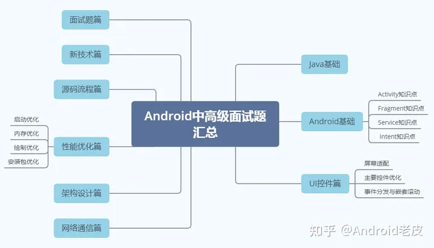

# 【干货分享】Android进阶开发面试必背300题，都在这里了~

[https://zhuanlan.zhihu.com/p/592293565?utm_medium=social&utm_oi=734792680583757824&utm_psn=1729256164628598784&utm_source=ZHShareTargetIDMore](https://zhuanlan.zhihu.com/p/592293565?utm_medium=social&utm_oi=734792680583757824&utm_psn=1729256164628598784&utm_source=ZHShareTargetIDMore)

Android的技术面试的本质与考试无差，许多知识点你可能之前没有涉及，之后也不会用到，但面试官提问时，你一定得会。

如果你只是精专于之前业务中的内容，那无疑所掌握的知识点会非常会非常片面，也会极大的限制你的发展性，减少你可选择的选项。

许多伙伴反馈，自己搜集了很多面试题，内容太多来不及看，容易抓不住重点，最终面试过程也全程懵逼。这里就给大家分享我花两个月时间整理的**Android进阶面试300题**，题目都非常经典，能够考察到你对技术的理解和总结，建议大家私藏起来！

> 完整版题目+解析可点击下方卡片获取~
> 

广告

2023最新Android中高级面试题汇总+解析 点击即可领取

## **Android开发面试必问经典题目**

### **Handler 相关知识，面试必问！**

常问的点：

Handler Looper Message 关系是什么？ Messagequeue 的[数据](https://zhuanlan.zhihu.com/write)结构是什么？为什么要用这个[数据](https://zhuanlan.zhihu.com/write)结构？ 如何在子线程中创建 Handler? Handler post 方法原理？

[Android消息机制的原理及源码解析](https://link.zhihu.com/?target=https%3A//link.juejin.cn/%3Ftarget%3Dhttps%253A%252F%252Fwww.jianshu.com%252Fp%252Ff10cff5b4c25) 源码角度完整解析 [Handler 都没搞懂，拿什么去跳槽啊？](https://link.zhihu.com/?target=https%3A//juejin.cn/post/6844903783139393550) [Android Handler 消息机制（解惑篇）](https://link.zhihu.com/?target=https%3A//juejin.cn/post/6844903446571663374) [Android 消息机制](https://link.zhihu.com/?target=https%3A//link.juejin.cn/%3Ftarget%3Dhttps%253A%252F%252Fblog.csdn.net%252Fguolin_blog%252Farticle%252Fdetails%252F9991569) **郭神的文章**

### **Activity 相关**

启动模式以及使用场景? onNewIntent()和onConfigurationChanged() onSaveInstanceState()和onRestoreInstanceState() Activity 到底是如何启动的

[启动模式以及使用场景](https://link.zhihu.com/?target=https%3A//link.juejin.cn/%3Ftarget%3Dhttps%253A%252F%252Fblog.csdn.net%252Fblack_bird_cn%252Farticle%252Fdetails%252F79764794) 详细的解释场景并且以及一些坑 [onSaveInstanceState以及onRestoreInstanceState使用](https://link.zhihu.com/?target=https%3A//link.juejin.cn/%3Ftarget%3Dhttps%253A%252F%252Fwww.jianshu.com%252Fp%252F27181e2e32d2) 简单通透 [onConfigurationChanged使用以及问题解决](https://link.zhihu.com/?target=https%3A//link.juejin.cn/%3Ftarget%3Dhttps%253A%252F%252Fwww.jianshu.com%252Fp%252F0127fb67516d) 全面得描述了各种情况 [Activity 启动流程解析](https://link.zhihu.com/?target=https%3A//link.juejin.cn/%3Ftarget%3Dhttps%253A%252F%252Fblog.csdn.net%252Fzhaokaiqiang1992%252Farticle%252Fdetails%252F49428287)

### **Fragment**

Fragment 生命周期和 Activity 对比 Fragment 之间如何进行通信 Fragment的startActivityForResult Fragment重叠问题

[Fragment 初探](https://link.zhihu.com/?target=https%3A//link.juejin.cn/%3Ftarget%3Dhttps%253A%252F%252Fblog.csdn.net%252Fguolin_blog%252Farticle%252Fdetails%252F8881711) [Fragment 重叠， 如何通信](https://link.zhihu.com/?target=https%3A//link.juejin.cn/%3Ftarget%3Dhttps%253A%252F%252Fblog.csdn.net%252Fqq_24442769%252Farticle%252Fdetails%252F77679147) [Fragment生命周期](https://link.zhihu.com/?target=https%3A//link.juejin.cn/%3Ftarget%3Dhttps%253A%252F%252Fwww.jianshu.com%252Fp%252F1b3f829810a1)

### **Service 相关**

进程保活 Service的运行线程（生命周期方法全部在主线程） Service启动方式以及如何停止 ServiceConnection里面的回调方法运行在哪个线程？

[startService 和 bingService区别](https://link.zhihu.com/?target=https%3A//link.juejin.cn/%3Ftarget%3Dhttps%253A%252F%252Fwww.jianshu.com%252Fp%252Fd870f99b675c) 完整讲解了它们之间得区别 [进程保活一般套路](https://link.zhihu.com/?target=https%3A//juejin.cn/post/6844903464523268103) 把进程保活手段都讲了一遍 [关于进程保活你需要知道的一切](https://link.zhihu.com/?target=https%3A//link.juejin.cn/%3Ftarget%3Dhttps%253A%252F%252Fwww.jianshu.com%252Fp%252F63aafe3c12af) 10万+ 关于进程保活得文章

### **Android布局优化之ViewStub、include、merge**

什么情况下使用 ViewStub、include、merge？ 他们的原理是什么？

[ViewStub、include、merge概念解析](https://link.zhihu.com/?target=https%3A//link.juejin.cn/%3Ftarget%3Dhttps%253A%252F%252Fblog.csdn.net%252Fu012792686%252Farticle%252Fdetails%252F72901531) [Android布局优化之ViewStub、include、merge使用与源码分析](https://link.zhihu.com/?target=https%3A//link.juejin.cn/%3Ftarget%3Dhttps%253A%252F%252Fblog.csdn.net%252Fbboyfeiyu%252Farticle%252Fdetails%252F45869393)

### **BroadcastReceiver 相关**

注册方式，优先级 广播类型，区别 广播的使用场景，原理

[Android广播动态静态注册](https://link.zhihu.com/?target=https%3A//link.juejin.cn/%3Ftarget%3Dhttps%253A%252F%252Fblog.csdn.net%252Fcsdn_aiyang%252Farticle%252Fdetails%252F68947014) 通俗易懂 [常见使用以及流程解析](https://link.zhihu.com/?target=https%3A//link.juejin.cn/%3Ftarget%3Dhttps%253A%252F%252Fblog.csdn.net%252Fcarson_ho%252Farticle%252Fdetails%252F52973504) [广播源码解析](https://link.zhihu.com/?target=https%3A//link.juejin.cn/%3Ftarget%3Dhttps%253A%252F%252Fwww.jianshu.com%252Fp%252F02085150339c)

### **AsyncTask相关**

AsyncTask是串行还是并行执行？ AsyncTask随着安卓版本的变迁

[AsyncTask完全解析](https://link.zhihu.com/?target=https%3A//link.juejin.cn/%3Ftarget%3Dhttps%253A%252F%252Fblog.csdn.net%252Fguolin_blog%252Farticle%252Fdetails%252F11711405) **郭神的文章 一篇足够 从使用到源码** [串行还是并行](https://link.zhihu.com/?target=https%3A//link.juejin.cn/%3Ftarget%3Dhttps%253A%252F%252Fblog.csdn.net%252Fsingwhatiwanna%252Farticle%252Fdetails%252F17596225)

### **Android 事件分发机制**

onTouch和onTouchEvent区别，调用顺序 dispatchTouchEvent， onTouchEvent， onInterceptTouchEvent 方法顺序以及使用场景 滑动冲突，如何解决

[事件分发机制](https://link.zhihu.com/?target=https%3A//link.juejin.cn/%3Ftarget%3Dhttps%253A%252F%252Fblog.csdn.net%252Fguolin_blog%252Farticle%252Fdetails%252F9097463) 郭神出品 [事件分发解析](https://link.zhihu.com/?target=https%3A//link.juejin.cn/%3Ftarget%3Dhttps%253A%252F%252Fblog.csdn.net%252Flmj623565791%252Farticle%252Fdetails%252F39102591) 鸿洋出品 [dispatchTouchEvent， onTouchEvent， onInterceptTouchEvent方法的使用场景解析](https://link.zhihu.com/?target=https%3A//link.juejin.cn/%3Ftarget%3Dhttps%253A%252F%252Fwww.jianshu.com%252Fp%252Fd3758eef1f72)

### **Android View 绘制流程**

简述 View 绘制流程 onMeasure， onlayout， ondraw方法中需要注意的点 如何进行自定义 View view 重绘机制

[Android LayoutInflater原理分析，带你一步步深入了解View(一)](https://link.zhihu.com/?target=https%3A//link.juejin.cn/%3Ftarget%3Dhttps%253A%252F%252Fblog.csdn.net%252Fguolin_blog%252Farticle%252Fdetails%252F12921889) [Android视图状态及重绘流程分析，带你一步步深入了解View(二)](https://link.zhihu.com/?target=https%3A//link.juejin.cn/%3Ftarget%3Dhttps%253A%252F%252Fblog.csdn.net%252Fguolin_blog%252Farticle%252Fdetails%252F16330267) [Android视图状态及重绘流程分析，带你一步步深入了解View(三)](https://link.zhihu.com/?target=https%3A//link.juejin.cn/%3Ftarget%3Dhttps%253A%252F%252Fblog.csdn.net%252Fguolin_blog%252Farticle%252Fdetails%252F17045157) [Android自定义View的实现方法，带你一步步深入了解View(四)](https://link.zhihu.com/?target=https%3A//link.juejin.cn/%3Ftarget%3Dhttps%253A%252F%252Fblog.csdn.net%252Fguolin_blog%252Farticle%252Fdetails%252F17357967) **别问我为什么推荐这么多郭神的文章，因为我是看着郭神的文章长大的！**

### **Android Window、Activity、DecorView以及ViewRoot**

[Window、Activity、DecorView以及ViewRoot之间的关系](https://link.zhihu.com/?target=https%3A//link.juejin.cn/%3Ftarget%3Dhttps%253A%252F%252Fwww.jianshu.com%252Fp%252F8766babc40e0)

### **Android 的核心 Binder 多进程 AIDL**

常见的 IPC 机制以及使用场景 为什么安卓要用 binder 进行跨进程传输 多进程带来的问题

[AIDL 使用浅析](https://link.zhihu.com/?target=https%3A//link.juejin.cn/%3Ftarget%3Dhttps%253A%252F%252Fblog.csdn.net%252Flmj623565791%252Farticle%252Fdetails%252F38461079) [binder 原理解析](https://link.zhihu.com/?target=https%3A//link.juejin.cn/%3Ftarget%3Dhttps%253A%252F%252Fzhuanlan.zhihu.com%252Fp%252F35519585) 真的不错 [binder 最底层解析](https://link.zhihu.com/?target=https%3A//link.juejin.cn/%3Ftarget%3Dhttps%253A%252F%252Fblog.csdn.net%252Fluoshengyang%252Farticle%252Fdetails%252F6618363%252F) 很难理解，我看了几遍还是了解一个大概 [多进程通信方式以及带来的问题](https://link.zhihu.com/?target=https%3A//link.juejin.cn/%3Ftarget%3Dhttp%253A%252F%252Fwuxiaolong.me%252F2018%252F02%252F15%252FAndroidIPC%252F) [多进程通信方式对比](https://link.zhihu.com/?target=https%3A//link.juejin.cn/%3Ftarget%3Dhttps%253A%252F%252Fblog.csdn.net%252Fu011240877%252Farticle%252Fdetails%252F72863432)

### **Android 高级必备 ：AMS,WMS,PMS**

这部分真的复杂！ AMS,WMS,PMS 创建过程

[AMS,WMS,PMS全解析](https://link.zhihu.com/?target=https%3A//link.juejin.cn/%3Ftarget%3Dhttps%253A%252F%252Fwww.cnblogs.com%252Fsunkeji%252Farticles%252F7650482.html) [AMS启动流程](https://link.zhihu.com/?target=https%3A//link.juejin.cn/%3Ftarget%3Dhttps%253A%252F%252Fblog.csdn.net%252Fitachi85%252Farticle%252Fdetails%252F76405596) [WindowManagerService启动过程解析](https://link.zhihu.com/?target=https%3A//link.juejin.cn/%3Ftarget%3Dhttps%253A%252F%252Fblog.csdn.net%252Fitachi85%252Farticle%252Fdetails%252F78186741) [PMS 启动流程解析](https://link.zhihu.com/?target=https%3A//link.juejin.cn/%3Ftarget%3Dhttps%253A%252F%252Fblog.csdn.net%252Flilian0118%252Farticle%252Fdetails%252F24455019)

### **Android ANR**

为什么会发生 ANR？ 如何定位 ANR？ 如何避免 ANR？

[什么是 ANR](https://link.zhihu.com/?target=https%3A//link.juejin.cn/%3Ftarget%3Dhttps%253A%252F%252Fdroidyue.com%252Fblog%252F2015%252F07%252F18%252Fanr-in-android%252F) [如何避免以及分析方法](https://link.zhihu.com/?target=https%3A//link.juejin.cn/%3Ftarget%3Dhttps%253A%252F%252Fwww.jianshu.com%252Fp%252F388166988cef) [Android 性能优化之 ANR 详解](https://link.zhihu.com/?target=https%3A//juejin.cn/post/6844903473041899534)

### **Android 内存相关**

**注意：内存泄漏和内存溢出是 2 个概念**

什么情况下会内存泄漏？ 如何防止内存泄漏？

[内存泄漏和溢出的区别](https://link.zhihu.com/?target=https%3A//link.juejin.cn/%3Ftarget%3Dhttps%253A%252F%252Fblog.csdn.net%252Fu013435893%252Farticle%252Fdetails%252F50608190) [OOM 概念以及安卓内存管理机制](https://link.zhihu.com/?target=https%3A//link.juejin.cn/%3Ftarget%3Dhttp%253A%252F%252Fhukai.me%252Fandroid-performance-oom%252F) [内存泄漏的可能性](https://link.zhihu.com/?target=https%3A//link.juejin.cn/%3Ftarget%3Dhttps%253A%252F%252Fwww.jianshu.com%252Fp%252Fac00e370f83d) [防止内存泄漏的方法](https://link.zhihu.com/?target=https%3A//link.juejin.cn/%3Ftarget%3Dhttps%253A%252F%252Fwww.jianshu.com%252Fp%252Fc5ac51d804fa)

### **Android 屏幕适配**

屏幕适配相关名词解析 现在流行的屏幕适配方式

[屏幕适配名词以及概念解析](https://link.zhihu.com/?target=https%3A//link.juejin.cn/%3Ftarget%3Dhttps%253A%252F%252Fblog.csdn.net%252Fzhaokaiqiang1992%252Farticle%252Fdetails%252F45419023) [今日头条技术适配方案](https://link.zhihu.com/?target=https%3A//link.juejin.cn/%3Ftarget%3Dhttps%253A%252F%252Fzhuanlan.zhihu.com%252Fp%252F37199709)

### **Android 缓存机制**

LruCache使用极其原理

[Android缓存机制](https://link.zhihu.com/?target=https%3A//link.juejin.cn/%3Ftarget%3Dhttps%253A%252F%252Fwww.jianshu.com%252Fp%252F2608f036f362) [LruCache使用极其原理述](https://link.zhihu.com/?target=https%3A//link.juejin.cn/%3Ftarget%3Dhttps%253A%252F%252Fwww.jianshu.com%252Fp%252Fb49a111147ee)

### **Android 性能优化**

如何进行 内存 cpu 耗电 的定位以及优化 性能优化经常使用的方法 如何避免 UI 卡顿

我正在看极客时间的Android开发高手课，里面的性能优化文章不错

[性能优化全解析，工具使用](https://link.zhihu.com/?target=https%3A//juejin.cn/post/6844903511742742541) [性能优化最佳实践](https://link.zhihu.com/?target=https%3A//juejin.cn/post/6844903641032163336) [知乎高赞文章](https://link.zhihu.com/?target=https%3A//link.juejin.cn/%3Ftarget%3Dhttps%253A%252F%252Fzhuanlan.zhihu.com%252Fp%252F30691789)

### **Android MVC、MVP、MVVM**

好几种我该选择哪个？优劣点

任玉刚的文章： [设计模式选择](https://link.zhihu.com/?target=https%3A//juejin.cn/post/6844903632446423054)

### **Android Gradle 知识**

这俩篇官方文章基础的够用了 [必须贴一下官方文档：配置构建](https://link.zhihu.com/?target=https%3A//link.juejin.cn/%3Ftarget%3Dhttps%253A%252F%252Fdeveloper.android.com%252Fstudio%252Fbuild%253Fhl%253Dzh-cn) [Gradle 提示与诀窍](https://link.zhihu.com/?target=https%3A//link.juejin.cn/%3Ftarget%3Dhttps%253A%252F%252Fdeveloper.android.com%252Fstudio%252Fbuild%252Fgradle-tips%253Fhl%253Dzh-cn)

Gradle插件 了解就好 [Gradle 自定义插件方式](https://link.zhihu.com/?target=https%3A//link.juejin.cn/%3Ftarget%3Dhttps%253A%252F%252Fblog.csdn.net%252Feclipsexys%252Farticle%252Fdetails%252F50973205) [全面理解Gradle - 执行时序](https://link.zhihu.com/?target=https%3A//link.juejin.cn/%3Ftarget%3Dhttps%253A%252F%252Fblog.csdn.net%252Fsingwhatiwanna%252Farticle%252Fdetails%252F78797506)

[Gradle系列一](https://link.zhihu.com/?target=https%3A//juejin.cn/post/6844903604642562061%23heading-2) [Gradle系列二](https://link.zhihu.com/?target=https%3A//juejin.cn/post/6844903605825191950) [Gradle系列三](https://link.zhihu.com/?target=https%3A//juejin.cn/post/6844903608190763015)

### **RxJava**

使用过程，特点，原理解析 [RxJava 名词以及如何使用](https://link.zhihu.com/?target=https%3A//link.juejin.cn/%3Ftarget%3Dhttps%253A%252F%252Fblog.piasy.com%252F2016%252F09%252F15%252FUnderstand-RxJava%252Findex.html) [Rxjava 观察者模式原理解析](https://link.zhihu.com/?target=https%3A//juejin.cn/post/6844903472131735559) [Rxjava订阅流程，线程切换，源码分析 系列](https://link.zhihu.com/?target=https%3A//juejin.cn/post/6844903518042603528)

### **OKHTTP 和 Retrofit**

[OKHTTP完整解析](https://link.zhihu.com/?target=https%3A//link.juejin.cn/%3Ftarget%3Dhttps%253A%252F%252Fblog.csdn.net%252Flmj623565791%252Farticle%252Fdetails%252F47911083) --鸿洋出品 [Retrofit使用流程，机制详解](https://link.zhihu.com/?target=https%3A//link.juejin.cn/%3Ftarget%3Dhttps%253A%252F%252Fblog.csdn.net%252Fcarson_ho%252Farticle%252Fdetails%252F73732076) [从 HTTP 到 Retrofit](https://link.zhihu.com/?target=https%3A//link.juejin.cn/%3Ftarget%3Dhttps%253A%252F%252Fwww.jianshu.com%252Fp%252F45cb536be2f4) [Retrofit是如何工作的](https://link.zhihu.com/?target=https%3A//link.juejin.cn/%3Ftarget%3Dhttps%253A%252F%252Fwww.jianshu.com%252Fp%252Fcb3a7413b448)

### **最流行图片加载库： Glide**

**郭神系列 Glide 分析** [Android图片加载框架最全解析（一），Glide的基本用法](https://link.zhihu.com/?target=https%3A//link.juejin.cn/%3Ftarget%3Dhttps%253A%252F%252Fblog.csdn.net%252Fguolin_blog%252Farticle%252Fdetails%252F53759439) [Android图片加载框架最全解析（二），从源码的角度理解Glide的执行流程](https://link.zhihu.com/?target=https%3A//link.juejin.cn/%3Ftarget%3Dhttps%253A%252F%252Fblog.csdn.net%252Fguolin_blog%252Farticle%252Fdetails%252F53939176) [Android图片加载框架最全解析（三），深入探究Glide的缓存机制](https://link.zhihu.com/?target=https%3A//link.juejin.cn/%3Ftarget%3Dhttp%253A%252F%252Fblog.csdn.net%252Fguolin_blog%252Farticle%252Fdetails%252F54895665) [Android图片加载框架最全解析（四），玩转Glide的回调与监听](https://link.zhihu.com/?target=https%3A//link.juejin.cn/%3Ftarget%3Dhttps%253A%252F%252Fblog.csdn.net%252Fguolin_blog%252Farticle%252Fdetails%252F70215985) [Android图片加载框架最全解析（五），Glide强大的图片变换功能](https://link.zhihu.com/?target=https%3A//link.juejin.cn/%3Ftarget%3Dhttp%253A%252F%252Fblog.csdn.net%252Fguolin_blog%252Farticle%252Fdetails%252F71524668) [Android图片加载框架最全解析（六），探究Glide的自定义模块功能](https://link.zhihu.com/?target=https%3A//link.juejin.cn/%3Ftarget%3Dhttp%253A%252F%252Fblog.csdn.net%252Fguolin_blog%252Farticle%252Fdetails%252F78179422) [Android图片加载框架最全解析（七），实现带进度的Glide图片加载功能](https://link.zhihu.com/?target=https%3A//link.juejin.cn/%3Ftarget%3Dhttp%253A%252F%252Fblog.csdn.net%252Fguolin_blog%252Farticle%252Fdetails%252F78357251) [Android图片加载框架最全解析（八），带你全面了解Glide 4的用法](https://link.zhihu.com/?target=https%3A//link.juejin.cn/%3Ftarget%3Dhttp%253A%252F%252Fblog.csdn.net%252Fguolin_blog%252Farticle%252Fdetails%252F78582548)

### **Android 组件化与插件化**

业务大了代码多了会用到。

为什么要用组件化？ 组件之间如何通信？ 组件之间如何跳转？

[Android 插件化和热修复知识梳理](https://link.zhihu.com/?target=https%3A//link.juejin.cn/%3Ftarget%3Dhttps%253A%252F%252Fwww.jianshu.com%252Fp%252F704cac3eb13d) [为什么要用组件化](https://link.zhihu.com/?target=https%3A//link.juejin.cn/%3Ftarget%3Dhttps%253A%252F%252Fblog.csdn.net%252Fguiying712%252Farticle%252Fdetails%252F55213884) [1、Android彻底组件化方案实践](https://link.zhihu.com/?target=https%3A//link.juejin.cn/%3Ftarget%3Dhttps%253A%252F%252Fwww.jianshu.com%252Fp%252F1b1d77f58e84) [2、Android彻底组件化demo发布](https://link.zhihu.com/?target=https%3A//link.juejin.cn/%3Ftarget%3Dhttps%253A%252F%252Fwww.jianshu.com%252Fp%252F59822a7b2fad) [3、Android彻底组件化-代码和资源隔离](https://link.zhihu.com/?target=https%3A//link.juejin.cn/%3Ftarget%3Dhttps%253A%252F%252Fwww.jianshu.com%252Fp%252Fc7459b59dcd5) [4、Android彻底组件化—UI跳转升级改造](https://link.zhihu.com/?target=https%3A//link.juejin.cn/%3Ftarget%3Dhttps%253A%252F%252Fwww.jianshu.com%252Fp%252F03c498e05a46) [5、Android彻底组件化—如何使用Arouter](https://link.zhihu.com/?target=https%3A//link.juejin.cn/%3Ftarget%3Dhttps%253A%252F%252Fwww.jianshu.com%252Fp%252Faa17cf4b2dca)

[插件化框架历史](https://link.zhihu.com/?target=https%3A//juejin.cn/post/6844903503064760333) [深入理解Android插件化技术](https://link.zhihu.com/?target=https%3A//link.juejin.cn/%3Ftarget%3Dhttps%253A%252F%252Fzhuanlan.zhihu.com%252Fp%252F33017826) 阿里插件化技术 [Android 插件化和热修复知识梳理](https://link.zhihu.com/?target=https%3A//link.juejin.cn/%3Ftarget%3Dhttps%253A%252F%252Fwww.jianshu.com%252Fp%252F704cac3eb13d)

### **面试常问的点**

除了上面整理的安卓高级技术问题，还有一些面试官喜欢问的点，大家针对准备回答：

- 你在项目中遇到最难得点是什么？如何解决的？
- 平时遇到问题了是如何解决的？比较好的回答： 官方文档一定要看，通过源码解决问题，然后才是搜索引擎以及和同事讨论
- 你最近做的 APP 是如何架构的？为什么要这样架构？
- 平时怎么进行技术进阶，如何学习？
- 你觉得自己处于什么技术水平？
- 你的技术优势是什么？

**未完待续......**

## **最后**

由于篇幅和时间原因，本文只列出了26道题。当然这只是Android知识点中的一小部分，Android涉及面较广，知识点非常多。之后我也会抽时间做面试题解析总结，有需要的朋友可**点赞收藏，持续关注**。

若近期内有技术提升需求的、或想为金九银十求职季加一分保障的，也可**点击下方卡片提前解锁完整版【Android面试真题+解析】**，以及其他Android学习笔记和视频资料！

最后的最后，虽然Android行业形势愈发严峻，但所谓金子在哪都会发光，只要你基础扎实、专业过硬且准备充分，一定会顺利拿下心仪的offer！在这里就先预祝大家求职顺利，越过大厂的龙门！