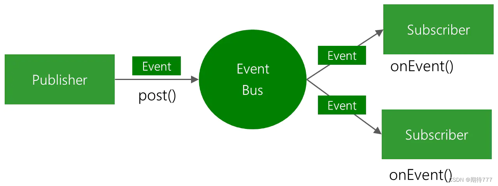
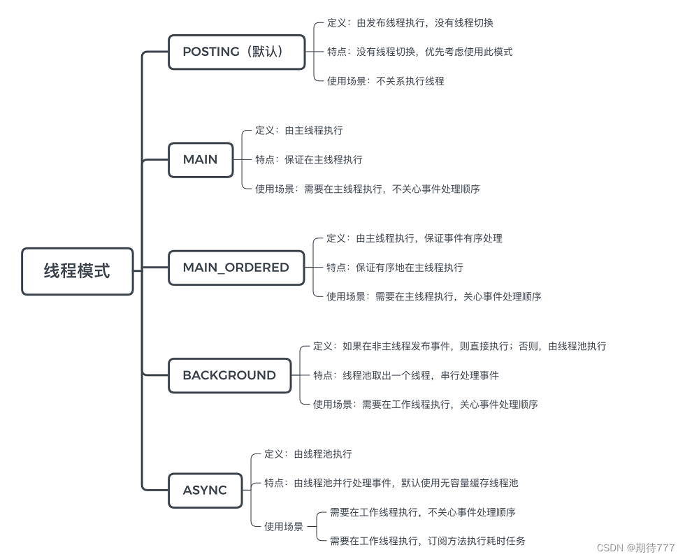
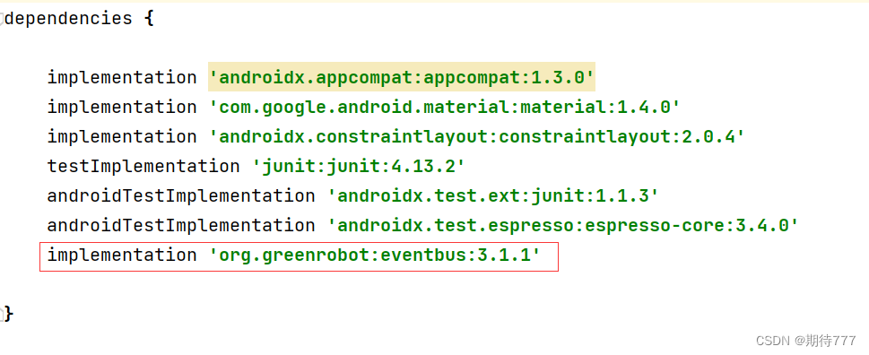

# Android 资深开发需要掌握的常用框架原理_安卓主流框架原理-CSDN博客

[https://blog.csdn.net/u011240877/article/details/128888062](https://blog.csdn.net/u011240877/article/details/128888062)

> 
> 
> 
> 最近把之前写的文章系统整理了一下，时隔几年，一些框架可能 API 有了不同，但底层架构和实现还是有变化不大的，这也侧面证明学习原理而不是 API 的长期有效性。
> 


什么是资深 Android 开发？每个人可能有自己的见解。但公认的是，资深 Android 开发，对常用框架一定不能仅仅停留在使用，更要明白其设计思想及实现原理。

本文汇总了 Android 常用框架的解析文章，深入分析了**事件总线、图片加载、网络请求和热修复等框架的设计思想及实现原理**，希望能为大家在成为更高阶的 Android 开发提供帮助。

[Android 框架解析：EventBus 3.0 的特点与如何使用](https://xie.infoq.cn/article/cd60cc6911309039512987e16)

本篇是 Android 事件总线框架 EventBus 分析的第一篇，主要介绍了 3.0 版本的新特点和如何使用，帮助读者快速了解 EventBus 3.0 的 API，为后续理解设计架构和原理打下基础。

[Android 框架解析：EventBus 3.0 如何实现事件总线](https://xie.infoq.cn/article/85f003425d67cf3cf5e278934)

作者：张拭心

本篇是 Android 事件总线框架 EventBus 分析的第二篇，主要介绍了 EventBus 的创建流程、事件注册和分发实现，同时结合 EventBus 的分层架构给出了整体的流程图，帮助读者更好的理解 EventBus 实现原理。

[Android 框架解析：从 EventBus 中学到的精华](https://xie.infoq.cn/article/bd9d8496d35a2a6a2b279fb7c)

作者：张拭心

本篇是 Android 事件总线框架 EventBus 分析的第三篇，主要从代码之外思考 EventBus 解决的问题、设计思想和用到的设计模式，并从繁杂的细节中提炼出值得学习的点，为事件总结学习画上完美的句号。

[Android 框架解析：Picasso 源码基本架构](https://xie.infoq.cn/article/c78f10cece9c5683fcc77ad30)

作者：张拭心

本篇是 Android 图片框架 Picasso 分析的第一篇，主要从自己手动实现的角度来思考一个图片框架应该有哪些核心模块。然后结合自己的思考，和 Picasso 相关 API 进行对比，从而对 Picasso 源码架构有个基本的认识。

[Android 框架解析：Picasso 核心功能实现原理](https://xie.infoq.cn/article/f74a9999b2c1209e75b1ddbde)

作者：张拭心

本篇是 Android 图片框架 Picasso 分析的第二篇，主要从图片加载的常用功能出发，分析和思考 Picasso 的相关实现，包括图片请求的整体流程、请求暂停/恢复/取消的调度、最大化性能和缓存相关策略，并且从繁杂的代码细节中，总结出一些值得学习的点，为图片框架学习画上句号。

[Android 框架解析：OkHttp 请求原理基本认识](https://xie.infoq.cn/article/9f1da4cd8077c14fa64722466)

作者：张拭心

本篇主要介绍了 Android 网络框架 Okhttp 的基本实现，包括一个 HTTP 请求发起后是如何处理、调度和执行的，还有获取到服务端响应后如何层层处理，最后给到调用方最终结果。读完本文，可以帮助读者对 OkHttp 的请求原理有比较全面的认识。

[Android 框架解析：深入理解 Retrofit 实现](https://xie.infoq.cn/article/6c45b028d383b97a447032c04)

作者：张拭心

本篇主要介绍了 Android 网络框架 Retrofit 的基本原理，包括各种注解背后的具体实现、请求的适配、结果的转换等细节，通过一系列图片帮助读者解构 Retrofit 的设计和实现。

[Android 框架解析：热修复框架 Tinker 从使用到 patch 加载、生成、合成原理分析](https://xie.infoq.cn/article/25f0dd3caaca8a0d95832e330)

作者：张拭心

本篇主要介绍了 Android 热修复框架 Tinker 的使用方法和具体实现，包括补丁中的 dex、resource、so 的加载流程、生成补丁的流程和应用获取到补丁后如何合并、加载的流程，帮助读者对 Tinker 的原理有更全面的认识。

## EventBus 概述

一套 **Android Java 事件订阅 / 发布框架**，由 greenrobot 团队开源。

作用：在组件 / 线程间通信的场景中，将数据或事件传递给对应的订阅者



使用原因：EventBus比传统的接口监听、Handler、LocalBroadcastManager更简单可靠。

优点：

1.使用事件总线框架，实现事件发布者与订阅者松耦合。

2.提供透明线程间通信，隐藏了发布线程与订阅线程间的线程切换。

## 角色分工

三个角色

**Event**：事件，它可以是任意类型，EventBus会根据事件类型进行全局的通知。

**Subscriber**：事件订阅者，在EventBus 3.0之前我们必须定义以onEvent开头的那几个方法，分别是onEvent、onEventMainThread、onEventBackgroundThread和onEventAsync，而在3.0之后事件处理的方法名可以随意取，不过需要加上注解@subscribe，并且指定线程模型，默认是POSTING。

**Publisher**：事件的发布者，可以在任意线程里发布事件。一般情况下，使用EventBus.getDefault()就可以得到一个EventBus对象，然后再调用post(Object)方法即可。

## 订阅者注解特性




## Demo

下面用一个简单的例子介绍一下EventBus的使用，这个例子实现的功能是：有界面1、界面2、两个界面，界面1跳转到界面2，界面2返回界面1时，带回一个参数，并且在界面1中以Toast方式展现。

1.引入依赖

引入 implementation ‘org.greenrobot:eventbus:3.1.1’



2.由目标可得出SecondActivity是事件发布，MainActivity是事件订阅

```
public class MainActivity extends AppCompatActivity {

    private Button button;
    private TextView textView;

    @Subscribe
    @Override
    public void onCreate(Bundle savedInstanceState) {
        super.onCreate(savedInstanceState);
        setContentView(R.layout.activity_main);

        //注册MainActivity为订阅者
        EventBus.getDefault().register(this);

        button = findViewById(R.id.button1);
        textView = findViewById(R.id.tv_maintext);

        button.setOnClickListener(new View.OnClickListener() {
            @Override
            public void onClick(View view) {
                Intent intent = new Intent(MainActivity.this, SecondActivity.class);
                startActivity(intent);
            }
        });
    }

    @Subscribe(threadMode = ThreadMode.MAIN)
    public void onEventMainThread(FirstEvent event) {
        Toast.makeText(this, event.getStrMsg(),Toast.LENGTH_LONG).show();
    }

    @Override
    protected void onDestroy() {
        super.onDestroy();
        //反注册
        EventBus.getDefault().unregister(this);
    }
}
1234567891011121314151617181920212223242526272829303132333435363738
```

```
public class SecondActivity extends AppCompatActivity {

    private Button btn_second;

    @Override
    public void onCreate(Bundle savedInstanceState) {
        super.onCreate(savedInstanceState);
        setContentView(R.layout.activity_second);
        btn_second = findViewById(R.id.btn_second);

        btn_second.setOnClickListener(new View.OnClickListener() {
            @Override
            public void onClick(View view) {
                EventBus.getDefault().post(new FirstEvent("我只有感叹号！！！"));
                finish();
            }
        });
    }
}
1234567891011121314151617181920
```

两个xml文件分别如下：

```
<?xml version="1.0" encoding="utf-8"?>
<LinearLayout xmlns:android="http://schemas.android.com/apk/res/android"
    xmlns:app="http://schemas.android.com/apk/res-auto"
    xmlns:tools="http://schemas.android.com/tools"
    android:layout_width="match_parent"
    android:layout_height="match_parent"
    android:orientation="vertical"
    tools:context=".MainActivity">

    <TextView
        android:id="@+id/tv_maintext"
        android:text="小朋友  你是否有很多的问号？"
        android:layout_width="wrap_content"
        android:layout_height="wrap_content"/>

    <Button
        android:id="@+id/button1"
        android:text="Button"
        android:layout_width="match_parent"
        android:layout_height="wrap_content"/>
</LinearLayout>
123456789101112131415161718192021
```

```
<?xml version="1.0" encoding="utf-8"?>
<LinearLayout xmlns:android="http://schemas.android.com/apk/res/android"
    xmlns:app="http://schemas.android.com/apk/res-auto"
    xmlns:tools="http://schemas.android.com/tools"
    android:layout_width="match_parent"
    android:layout_height="match_parent"
    tools:context=".SecondActivity">

    <Button
        android:id="@+id/btn_second"
        android:text="！！！！！"
        android:layout_width="wrap_content"
        android:layout_height="wrap_content"/>
</LinearLayout>
1234567891011121314
```

定义事件：定义一个事件的封装对象。在程序内部就使用该对象作为通信的信息：

```
public class FirstEvent {
    private String strMsg;

    public FirstEvent(String strMsg) {
        this.strMsg = strMsg;
    }

    public String getStrMsg() {
        return strMsg;
    }
}

123456789101112
```