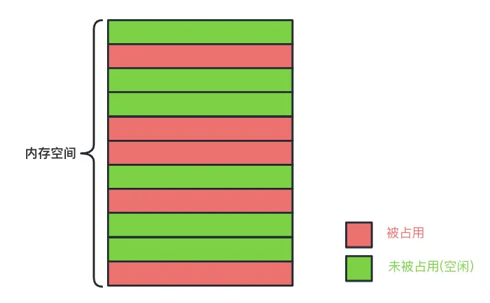

# 匿名内部类/Lambda Java和Kotlin谁会导致内存泄漏 - 简书

[https://www.jianshu.com/p/df1568a6eeb8](https://www.jianshu.com/p/df1568a6eeb8)

# 前言

内存泄漏是程序界永恒的话题，对于Android开发来说尤为重要，想让你的App表现得更优雅，了解并治理内存泄漏问题势在必行。

通过本篇文章，你将了解到：

> 
> 
> 1. 何为内存泄漏?
> 2. Android 常见内存泄漏场景
> 3. Java匿名内部类会导致泄漏吗？
> 4. Java的Lambda是否会泄漏？
> 5. Kotlin匿名内部类会导致泄漏吗？
> 6. Kotlin的Lambda是否会泄漏？
> 7. Kotlin高阶函数的会泄漏吗？
> 8. 内存泄漏总结

# 1. 何为内存泄漏?

## 简单内存分布



image.png

如上图，系统在分配内存的时候，会寻找空闲的内存块进行分配（有些需要连续的存储空间）。

分配成功，则标记该内存块被占用，当内存块不再被使用时，则置为空闲。

占用和被占用涉及到内存的分配和释放，在不同的程序语言里有不同的封装。

C 分配/释放内存函数：

> 
> 
> 
> 分配：malloc函数
> 
> 释放：free函数
> 

C++ 分配/释放内存函数：

> 
> 
> 
> 分配：new函数
> 
> 释放：delete函数
> 

C/C++ 需要程序员手动分配和释放内存，而我们知道手动的东西容易遗漏。

> 
> 
> 
> 如果一块内存永远不再被使用，但是又没有被回收，那么这段内存一直无法被复用，这就是内存泄漏
> 

## Java内存泄漏

鉴于C/C++ 需要手动释放内存容易遗漏最后造成内存泄漏的问题，Java在内存回收机制上做了改进：

**不需要程序员手动释放内存，JVM系统有GC机制，定期扫描不再被引用的对象，将对象所占的的内存空间释放。**

你可能会有疑惑：既然都有GC机制了，为啥还会有泄漏呢？

因为GC是根据可达性来判别对象是否还在使用，当GC动作发生时，如果一个对象被gc root对象持有，那么它是无法被回收的。

image.png

如上图，obj1~obj5被gc root 直接或间接持有，它们是不会被回收的，而obj6~obj10 没有被gc root持有，它们是可以被回收的。

## 常见的作为gc root的对象

JVM在发起GC 动作的时候，需要从gc root出发判别对象的可达性，常见的gc root对象：

image.png

开发里排查内存泄漏涉及比较多的gc root是：

> 
> 
> 
> JNI 变量、静态引用、活动的线程
> 

如果不涉及到JNI开发，我们更多关注的是后两者。

到此，我们知道了Java内存泄漏的缘由：

> 
> 
> 
> 不再被使用的对象，因为一些不当的操作导致其被gc root持有无法被回收，最终内存泄漏
> 

# 2. Android 常见内存泄漏场景

## 经典泄漏问题

### Handler使用不当泄漏

先看耳熟能详的Demo：

```
public class ThirdActivity extends AppCompatActivity {
    @Override
    protected void onCreate(@Nullable Bundle savedInstanceState) {
        super.onCreate(savedInstanceState);
        setContentView(R.layout.activity_third);
    }

    private Handler handler = new Handler() {
        @Override
        public void handleMessage(@NonNull Message msg) {
            super.handleMessage(msg);
            Log.d("fish", "hello world");
        }
    };
}

```

上面有个匿名内部类，继承自Handler。

我们知道在Java里，匿名内部类默认持有外部类引用，并且此处编译器会有提示：

```
This Handler class should be static or leaks might occur (anonymous android.os.Handler)

```

意思是：

> 
> 
> 
> 推荐使用静态类来继承Handler，因为使用匿名内部类可能会有内存泄漏风险
> 

**我们做个实验，操作步骤：打开Activity，关闭Activity，观察内存使用状况，是否发生内存泄漏。**

问题来了：以上代码会有内存泄漏吗？

答案当然是否定的，因为我们并没有使用handler对象。

将代码改造一下，onCreate里新增如下代码：

```
        handler.sendEmptyMessageDelayed(2, 5000);

```

此时会发生内存泄漏吗？

当然肉眼是无法证明是否泄漏的，我们通过使用Android Studio自带的性能分析工具：Profiler 进行分析：

image.png

果然Activity发生泄漏了。

如何规避此种场景下的内存泄漏呢？

```
public class ThirdActivity extends AppCompatActivity {
    @Override
    protected void onCreate(@Nullable Bundle savedInstanceState) {
        super.onCreate(savedInstanceState);
        setContentView(R.layout.activity_third);

        new MyHandler().sendEmptyMessageDelayed(2, 5000);
    }

    static class MyHandler extends Handler {
        @Override
        public void handleMessage(@NonNull Message msg) {
            super.handleMessage(msg);
            Log.d("fish", "hello world");
        }
    }
}

```

使用静态内部类实现Handler功能，静态内部类默认没有持有外部类引用。

检测结果，没有发生内存泄漏。

image.png

无论是匿名内部类还是静态内部类，都没有显式地持有外部类引用，既然匿名内部类会发生泄漏，那为啥还需要匿名内部类呢？

匿名内部类优点：

> 
> 
> 1. 无需重新定义新的具名类
> 2. 符合条件的匿名内部类可以转为Lambda表达式，简洁
> 3. 匿名内部类可以直接访问外部类引用

假若现在需要在收到message时弹出个Toast。

对于匿名内部类的实现很简单：

```
    private Handler handler = new Handler() {
        @Override
        public void handleMessage(@NonNull Message msg) {
            super.handleMessage(msg);
            Toast.makeText(ThirdActivity.this, "hello world", Toast.LENGTH_SHORT).show();
        }
    };

```

因为它默认持有外部类引用。

而对于静态内部类，则提示无法访问外部类对象。

image.png

需要给它单独传递外部类引用，相较于匿名内部类比较繁琐。

### Handler 泄漏的本质原因

对于当前的Demo来说，匿名内部类隐式持有外部类引用，我们需要需要找到匿名内部类被哪个gc root直接/间接地持有了。

image.png

由图可知，最终Activity被Thread持有了。

简单回顾源码流程：

> 
> 
> 1. 构造Handler对象时会绑定当前线程的Looper，Looper里持有MessageQueue引用
> 2. 当前线程的Looper存储在Thread里的ThreadLocal
> 3. 当Handler发送消息的时候，构造Message对象，而该Message对象持有Handler引用
> 4. Message对象将会被放置在MessageQueue里
> 5. 由此推断，Thread将会间接持有Handler，而Handler又持有外部类引用，最终Thread将会间接持有外部类引用，导致了泄漏

## 线程使用不当泄漏

先看简单Demo：

```
public class ThirdActivity extends AppCompatActivity {
    @Override
    protected void onCreate(@Nullable Bundle savedInstanceState) {
        super.onCreate(savedInstanceState);
        setContentView(R.layout.activity_third);

        new Thread(new Runnable() {
            @Override
            public void run() {
                try {
                    Thread.sleep(200000);
                } catch (InterruptedException e) {
                    throw new RuntimeException(e);
                }
            }
        });
    }
}

```

问：上述代码会发生内存泄漏吗？

答：当然不会，因为线程并没有开启。

```
public class ThirdActivity extends AppCompatActivity {
    @Override
    protected void onCreate(@Nullable Bundle savedInstanceState) {
        super.onCreate(savedInstanceState);
        setContentView(R.layout.activity_third);

        new Thread(new Runnable() {
            @Override
            public void run() {
                try {
                    Thread.sleep(200000);
                } catch (InterruptedException e) {
                    throw new RuntimeException(e);
                }
            }
        }).start();
    }
}

```

再分析分析，会有内存泄漏吗？

与之前的Handler一致，匿名内部类会持有外部类的引用，而匿名内部类本身又被线程持有，因此会发生泄漏。

如何规避此种场景下的内存泄漏呢？

有两种方式：

**第一种：使用静态内部类替换匿名内部类**

此种方式同Handler处理类似。

**第二种：使用Lambda替换匿名内部类**

```
public class ThirdActivity extends AppCompatActivity {
    @Override
    protected void onCreate(@Nullable Bundle savedInstanceState) {
        super.onCreate(savedInstanceState);
        setContentView(R.layout.activity_third);

        new Thread(() -> {
            try {
                Thread.sleep(200000);
            } catch (InterruptedException e) {
                throw new RuntimeException(e);
            }
        }).start();
    }
}

```

Lambda表达式没有隐式持有外部类，因此此种场景下不会有内存泄漏风险。

## 注册不当内存泄漏

模拟一个简单下载过程，首先定义一个下载管理类：

```
public class DownloadManager {
   private DownloadManager() {
   }
   static class Inner {
      private static final DownloadManager ins = new DownloadManager();
   }
   public static DownloadManager getIns() {
      return Inner.ins;
   }
   private HashMap<String, DownloadListener> map = new HashMap();
   //模拟注册
   public void download(DownloadListener listener, String path) {
      map.put(path, listener);
      new Thread(() -> {
         //模拟下载
         listener.onSuc();
      }).start();
   }
}

interface DownloadListener {
   void onSuc();
   void onFail();
}

```

外部传入下载路径，下载成功后通知外界调用者：

```
public class ThirdActivity extends AppCompatActivity {
    @Override
    protected void onCreate(@Nullable Bundle savedInstanceState) {
        super.onCreate(savedInstanceState);
        setContentView(R.layout.activity_third);

        DownloadManager.getIns().download(new DownloadListener() {
            @Override
            public void onSuc() {
                //更新UI
            }
            @Override
            public void onFail() {
            }
        }, "hello test");
    }
}

```

因为需要在下载回调时更新UI，因此选择匿名内部类接收回调，而因为该匿名内部类被静态变量：DownloadManager.ins 持有。

也就是说：

> 
> 
> 
> 静态变量作为gc root，间接持有匿名内部类，最终持有Activity导致了泄漏
> 

如何规避此种场景下的内存泄漏呢？

有两种方式：

> 
> 
> 1. 静态内部类持有Activity弱引用
> 2. DownloadManager提供反注册方式，当Activity销毁时反注册从Map里移除回调

# 3. Java匿名内部类会导致泄漏吗？

## 线程持有匿名内部类对象

内存泄漏的一些前置知识已经过了一遍，接下来我们从字节码的角度分别分析匿名内部类、Lambda表达式、高阶函数是否存在泄漏问题。

先看Demo：

```
public class ThirdActivity extends AppCompatActivity {
    @Override
    protected void onCreate(@Nullable Bundle savedInstanceState) {
        super.onCreate(savedInstanceState);
        setContentView(R.layout.activity_third);
        new Thread(new Runnable() {
            @Override
            public void run() {
                Log.d("fish", "hello world");
            }
        }).start();
    }
}

```

当我们进入Activity，而后又退出时，猜猜会发生泄漏吗？

有些小伙伴会说：当然了，线程持有匿名内部类对象，而匿名内部类对象又持有外部类(Activity)引用。

实际上是此处的线程并没有执行耗时任务，很快就结束了，系统回收Activity对象时线程已经结束了，不会再持有匿名内部类对象了。

怎么确定匿名内部类持有外部类引用呢？

一个很直观的表现：

> 
> 
> 
> 在匿名内部类里访问外部类实例变量，若是编译器没有提示错误，则可以认为匿名内部类持有外部类引用
> 

当然，想要看到石锤就得从字节码出发了。

## Java匿名内部类Class文件

build一下并查找Javac的产物：在/build/intermediates/javac 开头的目录下

image.png

这里是看不到匿名内部类的，需要到文件浏览器里查找。

image.png

可以看出，我们只是声明了一个ThirdActivity类，但是生成了两个Class文件，其中一个是匿名内部类生成的，通常命名方式为：外部类名+"$"+"第几个内部类"+".class"。

拖到Studio里查看内容：

image.png

显然匿名内部类构造函数形参里有外部类的类型，当构造匿名内部类时会传递进去并赋值给匿名内部类的成员变量。

## Java匿名内部类字节码

查看字节码方式有多种，可以用javap命令：

```
javap -c ThirdActivity$1.class

```

也可以在Android Studio里下载字节码插件：

image.png

在源文件上右键选择查看字节码：

image.png

可以看出：

> 
> 
> 1. New 指令创建匿名内部类对象并复制到操作数栈顶
> 2. 加载外部类对象到操作数栈顶
> 3. 调用匿名内部类构造函数，并将第2步的栈顶对象传入

如此一来，匿名内部类创建了，并且持有了外部类引用。

回到最初问题，Java匿名内部类是否会泄漏呢？

> 
> 
> 
> 当外部类销毁的时候，如果匿名内部类被gc root 持有(间接/直接)，那么将会发生内存泄漏
> 

# 4. Java的Lambda是否会泄漏？

## 线程持有Lambda对象

将上小结的匿名内部类改造为Lambda（注：不是所有的匿名内部类都可以转为Lambda表达式）

```
public class ThirdActivity extends AppCompatActivity {
    @Override
    protected void onCreate(@Nullable Bundle savedInstanceState) {
        super.onCreate(savedInstanceState);
        setContentView(R.layout.activity_third);
        new Thread(() -> {
            Log.d("fish", "hello world");
            Log.d("fish", "hello world2");
        }).start();
    }
}

```

## Java Lambda生成的Class文件

Java Lambda并没有生成Class文件。

## Java Lambda字节码

image.png

image.png

Java Lambda并没有生成Class文件，而是通过INVOKEDYNAMIC 指令动态生成Runnable对象，最后传入Thread里。

可以看出，此时生成的Lambda并没有持有外部类引用。

## Java Lambda显式持有外部类引用

```
public class ThirdActivity extends AppCompatActivity {
    @Override
    protected void onCreate(@Nullable Bundle savedInstanceState) {
        super.onCreate(savedInstanceState);
        setContentView(R.layout.activity_third);
        new Thread(() -> {
            //显式持有外部类引用
            Log.d("fish", ThirdActivity.class.getName());
        }).start();
    }
}

```

再查看字节码：

image.png

可以看出，传入了外部类引用。

回到最初问题，Java Lambda是否会泄漏呢？

> 
> 
> 1. Lambda没有隐式持有外部类引用，
> 2. 若在Lambda内显式持有外部类引用，那么此时和Java 匿名内部类类似的，当外部类销毁的时候，如果Lambda被gc root 持有(间接/直接)，那么将会发生内存泄漏

# 5. Kotlin匿名内部类会导致泄漏吗？

## 线程持有匿名内部类对象

```
class FourActivity : AppCompatActivity() {
    private lateinit var binding: ActivityFourBinding
    override fun onCreate(savedInstanceState: Bundle?) {
        super.onCreate(savedInstanceState)
        binding = ActivityFourBinding.inflate(layoutInflater)
        setContentView(binding.root)
        Thread(object : Runnable {
            override fun run() {
                println("hello world")
            }
        }).start()
    }
}

```

此时匿名内部类会持有外部类引用吗？

先从生成的Class文件入手。

## Kotlin 匿名内部类生成的Class文件

Kotlin编译生成的Class目录：build/tmp/kotlin-classes/

查找生成的Class文件：

image.png

我们发现生成了Class文件，命名规则：外部类名+方法名+第几个匿名内部类+".class"

## Kotlin 匿名内部类字节码

image.png

可以看出，并没有持有外部类引用。

## Kotlin 匿名内部类显式持有外部类引用

```
class FourActivity : AppCompatActivity() {
    val name = "fish"
    private lateinit var binding: ActivityFourBinding
    override fun onCreate(savedInstanceState: Bundle?) {
        super.onCreate(savedInstanceState)
        binding = ActivityFourBinding.inflate(layoutInflater)
        setContentView(binding.root)
        Thread(object : Runnable {
            override fun run() {
                println("hello world $name")
            }
        }).start()
    }
}

```

查看字节码：

image.png

由此可见，构造函数携带了外部类引用。

回到最初问题，Kotlin 匿名内部类是否会泄漏呢？

> 
> 
> 1. Kotlin 匿名内部类没有隐式持有外部类引用，
> 2. 若在Kotlin 匿名内部类内显式持有外部类引用，那么此时和Java 匿名内部类类似的，当外部类销毁的时候，如果Lambda被gc root 持有(间接/直接)，那么将会发生内存泄漏

# 6. Kotlin的Lambda是否会泄漏？

## 线程持有Lambda对象

```
class FourActivity : AppCompatActivity() {
    private lateinit var binding: ActivityFourBinding
    override fun onCreate(savedInstanceState: Bundle?) {
        super.onCreate(savedInstanceState)
        binding = ActivityFourBinding.inflate(layoutInflater)
        setContentView(binding.root)
        Thread { println("hello world ") }
    }
}

```

此时Lambda会持有外部类引用吗？

先从生成的Class文件入手。

## Kotlin Lambda生成的Class文件

Kotlin Lambda 并没有生成Class文件。

## Kotlin Lambda字节码

image.png

image.png

可以看出，并没有隐式持有外部类引用。

## Kotlin Lambda显式持有外部类引用

```
class FourActivity : AppCompatActivity() {
    val name = "fish"
    private lateinit var binding: ActivityFourBinding
    override fun onCreate(savedInstanceState: Bundle?) {
        super.onCreate(savedInstanceState)
        binding = ActivityFourBinding.inflate(layoutInflater)
        setContentView(binding.root)
        Thread { println("hello world $name") }
    }
}

```

查看字节码：

image.png

由此可见，构造函数携带了外部类引用。

回到最初问题，Kotlin Lambda是否会泄漏呢？

> 
> 
> 
> 和Java Lambda表述一致
> 

# 7. Kotlin高阶函数的会泄漏吗？

## 什么是高阶函数？

将函数类型当做形参或返回值的函数称为高阶函数。

高阶函数在Kotlin里无处不在，是Kotlin简洁写法的一大利器。

## 高阶函数生成的Class文件

```
class FourActivity : AppCompatActivity() {
    private lateinit var binding: ActivityFourBinding
    override fun onCreate(savedInstanceState: Bundle?) {
        super.onCreate(savedInstanceState)
        binding = ActivityFourBinding.inflate(layoutInflater)
        setContentView(binding.root)
        test {
            println("$it")
        }
    }
    //高阶函数作为形参
    private fun test(block:(String) -> Unit) {
        block.invoke("fish")
    }
}

```

很简单的一个高阶函数，查看生成的Class文件：

image.png

查看Kotlin Bytecode内容：

```
final class com/fish/perform/FourActivity$onCreate$1 extends kotlin/jvm/internal/Lambda implements kotlin/jvm/functions/Function1 {

```

继承自Lambda，并实现了Function1接口。

它的构造函数并没有形参，说明不会传入外部类引用。

## 高阶函数的字节码

image.png

和之前分析的匿名内部类和Lambda不同的是(虽然高阶函数也可以用Lambda简化表达)：涉及到了GETSTATIC指令。

该指令意思是从静态变量里获取高阶函数的引用，在高阶函数的字节码加载的时候就已经将静态变量初始化：

image.png

可以这么理解：

> 
> 
> 1. 高阶函数的Class加载的时候会初始化实例，并将该实例存储在静态变量里
> 2. 当外部调用高阶函数时，从静态变量里获取高阶函数实例

## 高阶函数显式持有外部类引用

```
class FourActivity : AppCompatActivity() {
    val name="fish"
    private lateinit var binding: ActivityFourBinding
    override fun onCreate(savedInstanceState: Bundle?) {
        super.onCreate(savedInstanceState)
        binding = ActivityFourBinding.inflate(layoutInflater)
        setContentView(binding.root)
        test {
            println("$it:$name")
        }
    }
    //高阶函数作为形参
    private fun test(block:(String) -> Unit) {
        block.invoke("fish")
    }
}

```

查看字节码：

image.png

构造函数持有了外部类引用，此时并没有生成静态变量（没必要生成，若生成了就是妥妥的内存泄漏了)

回到最初问题，高阶函数是否会泄漏呢？

> 
> 
> 
> 1.高阶函数没有隐式持有外部类引用，
> 
> 1. 若在高阶函数内显式持有外部类引用，那么此时和Java 匿名内部类类似的，当外部类销毁的时候，如果高阶函数被gc root 持有(间接/直接)，那么将会发生内存泄漏

# 8. 内存泄漏总结

image.png

简单理解内存泄漏：

> 
> 
> 1. 长生命周期的对象持有短生命周期的对象，导致短生命周期的对象在生命周期结束后没有被及时回收，导致内存无法复用，最终泄漏
> 2. 合理地释放对短生命周期对象的引用

代码基本都在正文里，此处就不贴github链接了，有疑惑请评论/私信

后续将会继续输出APT/AGP等全系列流程文章，敬请期待。

# 您若喜欢，请点赞、关注、收藏，您的鼓励是我前进的动力

# 持续更新中，和我一起步步为营系统、深入学习Android/Kotlin

©著作权归作者所有,转载或内容合作请联系作者

2人点赞

[Android 性能优化](https://www.jianshu.com/nb/53280030)

更多精彩内容，就在简书APP

"小礼物走一走，来简书关注我"

还没有人赞赏，支持一下

[小鱼人爱编程](https://www.jianshu.com/u/c3187f5a9eb1)源码面前无秘密，大前端知识持续输出中...<br>github:<a href="https:...

总资产69共写了31.2W字获得381个赞共851个粉丝

- [人面猴](https://www.jianshu.com/p/1003a129be45)序言：七十年代末，一起剥皮案震惊了整个滨河市，随后出现的几起案子，更是在滨河造成了极大的恐慌，老刑警刘岩，带你破解...[沈念sama](https://www.jianshu.com/u/dcd395522934)阅读 131,514评论 1赞 264
- [死咒](https://www.jianshu.com/p/1c4506f51019)序言：滨河连续发生了三起死亡事件，死亡现场离奇诡异，居然都是意外死亡，警方通过查阅死者的电脑和手机，发现死者居然都...[沈念sama](https://www.jianshu.com/u/dcd395522934)阅读 56,761评论 1赞 227
- [救了他两次的神仙让他今天三更去死](https://www.jianshu.com/p/1ded57e57939)文/潘晓璐 我一进店门，熙熙楼的掌柜王于贵愁眉苦脸地迎上来，“玉大人，你说我怎么就摊上这事。” “怎么了？”我有些...[开封第一讲书人](https://www.jianshu.com/u/5891e866c93e)阅读 84,677评论 0赞 181
- [道士缉凶录：失踪的卖姜人](https://www.jianshu.com/p/25685c1b1f2b) 文/不坏的土叔 我叫张陵，是天一观的道长。 经常有香客问我，道长，这世上最难降的妖魔是什么？ 我笑而不...[开封第一讲书人](https://www.jianshu.com/u/5891e866c93e)阅读 38,822评论 0赞 145
- [港岛之恋（遗憾婚礼）](https://www.jianshu.com/p/553802eff5d6)正文 为了忘掉前任，我火速办了婚礼，结果婚礼上，老公的妹妹穿的比我还像新娘。我一直安慰自己，他们只是感情好，可当我...[茶点故事](https://www.jianshu.com/u/0f438ff0a55f)阅读 46,010评论 1赞 228
- [恶毒庶女顶嫁案：这布局不是一般人想出来的](https://www.jianshu.com/p/59985a89b4ef)文/花漫 我一把揭开白布。 她就那样静静地躺着，像睡着了一般。 火红的嫁衣衬着肌肤如雪。 梳的纹丝不乱的头发上，一...[开封第一讲书人](https://www.jianshu.com/u/5891e866c93e)阅读 37,476评论 1赞 151
- [城市分裂传说](https://www.jianshu.com/p/62a01de427e0)那天，我揣着相机与录音，去河边找鬼。 笑死，一个胖子当着我的面吹牛，可吹牛的内容都是我干的。 我是一名探鬼主播，决...[沈念sama](https://www.jianshu.com/u/dcd395522934)阅读 29,200评论 2赞 230
- [双鸳鸯连环套：你想象不到人心有多黑](https://www.jianshu.com/p/6ccdc163474a)文/苍兰香墨 我猛地睁开眼，长吁一口气：“原来是场噩梦啊……” “哼！你这毒妇竟也来了？” 一声冷哼从身侧响起，我...[开封第一讲书人](https://www.jianshu.com/u/5891e866c93e)阅读 28,254评论 0赞 140
- [父亲被人害死了，幕后凶手却是我最亲的人！](https://www.jianshu.com/p/6fe2053108f7)想象着我的养父在大火中拼命挣扎，窒息，最后皮肤化为焦炭。我心中就已经是抑制不住地欢快，这就叫做以其人之道，还治其人...[爱写小说的胖达](https://www.jianshu.com/u/c70b17da4d0e)阅读 27,685评论 5赞 200
- [万荣杀人案实录](https://www.jianshu.com/p/8796e3463067)序言：老挝万荣一对情侣失踪，失踪者是张志新（化名）和其女友刘颖，没想到半个月后，有当地人在树林里发现了一具尸体，经...[沈念sama](https://www.jianshu.com/u/dcd395522934)阅读 31,431评论 0赞 192
- [护林员之死](https://www.jianshu.com/p/8a691dd8fa34)正文 独居荒郊野岭守林人离奇死亡，尸身上长有42处带血的脓包…… 初始之章·张勋 以下内容为张勋视角 年9月15日...[茶点故事](https://www.jianshu.com/u/0f438ff0a55f)阅读 28,382评论 2赞 189
- [白月光启示录](https://www.jianshu.com/p/a5293fa3b5e0)正文 我和宋清朗相恋三年，在试婚纱的时候发现自己被绿了。 大学时的朋友给我发了我未婚夫和他白月光在一起吃饭的照片。...[茶点故事](https://www.jianshu.com/u/0f438ff0a55f)阅读 29,639评论 1赞 197
- [惨遭霸总抛弃后，我靠赚来的钱成了富豪榜第一名](https://www.jianshu.com/p/a68a12246696)白月光回国，霸总把我这个替身辞退。还一脸阴沉的警告我。[不要出现在思思面前， 不然我有一百种方法让你生不如死。]我...[爱写小说的胖达](https://www.jianshu.com/u/c70b17da4d0e)阅读 23,698评论 0赞 28
- [活死人](https://www.jianshu.com/p/a83aa7e71001)序言：一个原本活蹦乱跳的男人离奇死亡，死状恐怖，灵堂内的尸体忽然破棺而出，到底是诈尸还是另有隐情，我是刑警宁泽，带...[沈念sama](https://www.jianshu.com/u/dcd395522934)阅读 26,327评论 2赞 183
- [日本核电站爆炸内幕](https://www.jianshu.com/p/bee7d9c3fcf9)正文 年R本政府宣布，位于F岛的核电站，受9级特大地震影响，放射性物质发生泄漏。R本人自食恶果不足惜，却给世界环境...[茶点故事](https://www.jianshu.com/u/0f438ff0a55f)阅读 30,453评论 3赞 187
- [男人毒药：我在死后第九天来索命](https://www.jianshu.com/p/c2cfc4cb0aa7)文/蒙蒙 一、第九天 我趴在偏房一处隐蔽的房顶上张望。 院中可真热闹，春花似锦、人声如沸。这庄子的主人今日做“春日...[开封第一讲书人](https://www.jianshu.com/u/5891e866c93e)阅读 25,102评论 0
- [一桩弑父案，背后竟有这般阴谋](https://www.jianshu.com/p/c329b54bd638)文/苍兰香墨 我抬头看了看天上的太阳。三九已至，却和暖如春，着一层夹袄步出监牢的瞬间，已是汗流浃背。 一阵脚步声响...[开封第一讲书人](https://www.jianshu.com/u/5891e866c93e)阅读 25,151评论 0赞 138
- [情欲美人皮](https://www.jianshu.com/p/d79d2f48417f)我被黑心中介骗来泰国打工， 没想到刚下飞机就差点儿被人妖公主榨干…… 1. 我叫王不留，地道东北人。 一个月前我还...[沈念sama](https://www.jianshu.com/u/dcd395522934)阅读 32,118评论 2赞 206
- [代替公主和亲](https://www.jianshu.com/p/fc890ed5083c)正文 我出身青楼，却偏偏与公主长得像，于是被迫代替她去往敌国和亲。 传闻我的和亲对象是个残疾皇子，可洞房花烛夜当晚...[茶点故事](https://www.jianshu.com/u/0f438ff0a55f)阅读 32,265评论 2赞 202

### 被以下专题收入，发现更多相似内容

[安卓底层](https://www.jianshu.com/c/79f716d30d36)[Android开发](https://www.jianshu.com/c/0dc880a2c73c)[Android...](https://www.jianshu.com/c/5139d555c94d)[Android...](https://www.jianshu.com/c/58b4c20abf2f)[Android开发](https://www.jianshu.com/c/d1591c322c89)

### 推荐阅读[更多精彩内容](https://www.jianshu.com/)

- [匿名内部类为什么泄漏？Lambda为什么不泄漏？](https://www.jianshu.com/p/5be06b010884)作者：麦客奥德彪 在Android开发中，内存泄露发生的场景其实主要就两点，一是数据过大的问题，而是调用与被调用生...[艾瑞败类](https://www.jianshu.com/u/842ccad35891)阅读 159评论 0
- [匿名内部类为什么泄漏，Lambda为什么不泄漏](https://www.jianshu.com/p/9ffd2657faa7)在Android开发中，内存泄露发生的场景其实主要就两点，一是数据过大的问题，而是调用与被调用生命周期不一致问题，...[头秃到底](https://www.jianshu.com/u/1be0a886b92c)阅读 72评论 0
- [Android 非静态内部类/匿名类引起的内存泄漏](https://www.jianshu.com/p/9199d8de44ee)一、概述 让我们先来回顾一下android内存泄漏的相关概念： 内存溢出：android系统会给每个安卓程序分配一...[比萨u](https://www.jianshu.com/u/3074501a134a)阅读 3,123评论 1
- [Android 非静态内部类/匿名类/Handler引起的内存泄漏](https://www.jianshu.com/p/6d2a402fb794)一、内存溢出和内存泄漏 内存溢出：Android系统会给每个安卓程序分配一定的内存，当程序所使用的内存超过最大值就...[Rimson](https://www.jianshu.com/u/c282b31f844d)阅读 3,171评论 0