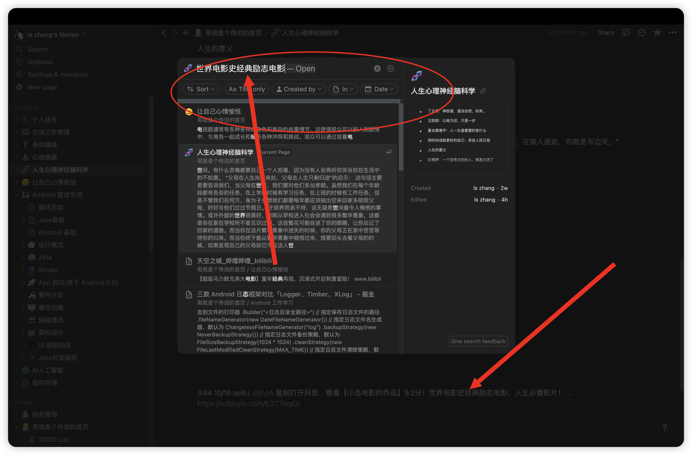
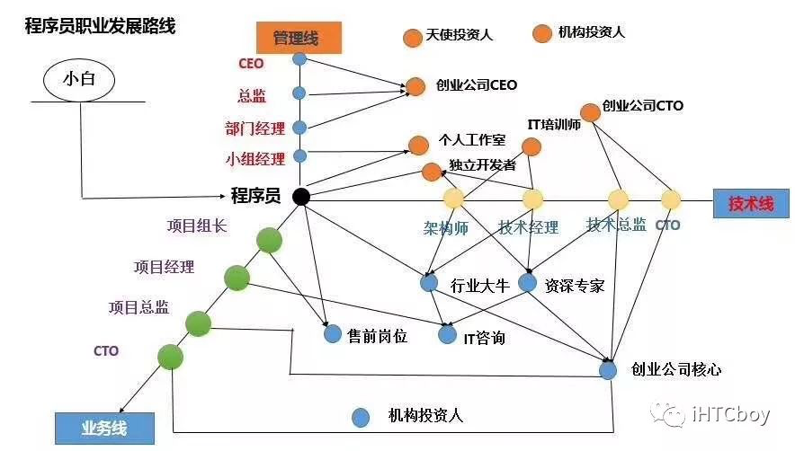
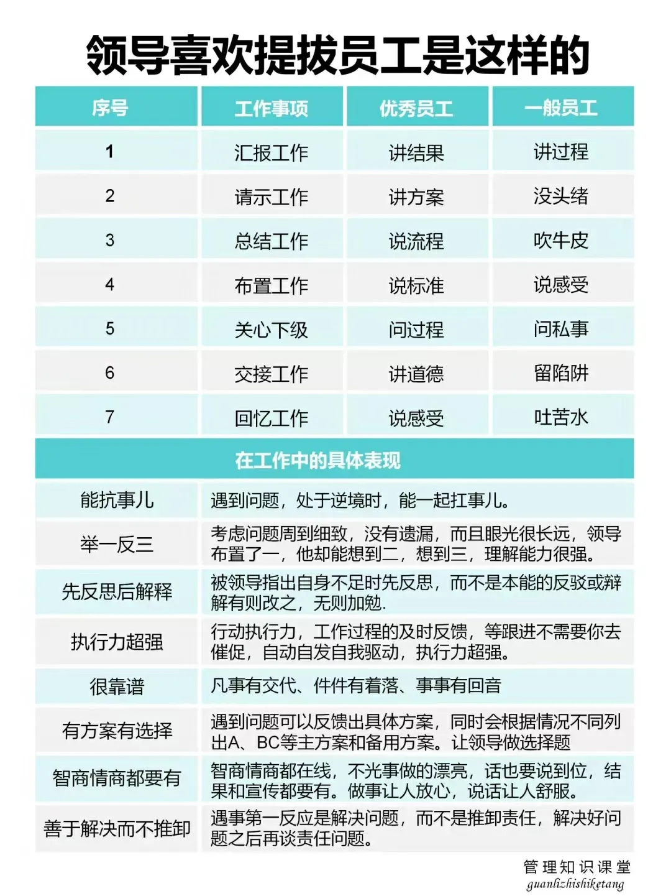

# 事业：职业规划

一个人该怎样找到自己真正热爱和擅长的事，并以此规划自己的人生？ - 知乎
[https://www.zhihu.com/question/399452902](https://www.zhihu.com/question/399452902)

[https://m.toutiao.com/is/iNnYw2jr/](https://m.toutiao.com/is/iNnYw2jr/)张雪峰普通家庭不推荐专业,保存起来给孩子看看-今日头条

**你擅长的(能力)**

-吸收能力，主动性，
学习能力(智商)
-不急躁，执着
-心态好，心态乐观，心态调节能力自洽
-对某些事情，追求极致
-数学数字敏感
-计算机背景
-眼光，前瞻性
-线性能力强，并发能力差
-慢思维好，快思维不行(尼采，快慢思维)
-逻辑思维能力
-理智能力
-执行能力，落地能力
-坚持
-方法论(上层重要，下层不重要)
-创新能力

**你喜欢的(环境)**

-比较高档，
但不热闹的场所
-事业社区
-户外
-办公室
-工业软件

**社会机会(商业)**

-AI
-银行
-证券、基金
-量化投资
-芯片

**骆驼箱子：**没有存在感，归属感，目标感，迷茫，焦虑，这些比上班的疲惫还痛苦。我是亲身体会到这种感觉，那时候我甚至有点怀念996的日子可以骑驴找马，找个轻松点的工作。

你的关注点在哪里，你的时间就花在哪里，你的成就也在哪里

[https://mp.weixin.qq.com/s?__biz=MjM5Njc2NzExMw==&mid=2257485877&idx=1&sn=c7cd6c53560f153f7f7ae4ab18355aa2&chksm=a59e14d392e99dc5b81c0c2809b04f4b56ee600cab0f5ede6d12fc95c49d25d7657c6e8318f3&scene=132&exptype=timeline_recommend_article_extendread_samebiz#wechat_redirect](https://mp.weixin.qq.com/s?__biz=MjM5Njc2NzExMw==&mid=2257485877&idx=1&sn=c7cd6c53560f153f7f7ae4ab18355aa2&chksm=a59e14d392e99dc5b81c0c2809b04f4b56ee600cab0f5ede6d12fc95c49d25d7657c6e8318f3&scene=132&exptype=timeline_recommend_article_extendread_samebiz#wechat_redirect)

选择行业 竞争过人

[为什么App独立开发最好别做日记、记账 - 掘金 (1)](%E4%BA%8B%E4%B8%9A%EF%BC%9A%E8%81%8C%E4%B8%9A%E8%A7%84%E5%88%92/%E4%B8%BA%E4%BB%80%E4%B9%88App%E7%8B%AC%E7%AB%8B%E5%BC%80%E5%8F%91%E6%9C%80%E5%A5%BD%E5%88%AB%E5%81%9A%E6%97%A5%E8%AE%B0%E3%80%81%E8%AE%B0%E8%B4%A6%20-%20%E6%8E%98%E9%87%91%20(1)%2038e32b4eaa5a4ba3862c3073a56a0059.md)

如何面对30多岁的职业焦虑？

[https://mp.weixin.qq.com/s/78UrSipKsbERvDi6lSSCPw](https://mp.weixin.qq.com/s/78UrSipKsbERvDi6lSSCPw)

如何提升职业转型的胜率？

[https://mp.weixin.qq.com/s/GwysRiZt8Bpzxmrkl3YKGg](https://mp.weixin.qq.com/s/GwysRiZt8Bpzxmrkl3YKGg)

所以，要选择环境

[https://mp.weixin.qq.com/s/KIyyigGqlVQcw1ZVnyjyYQ](https://mp.weixin.qq.com/s/KIyyigGqlVQcw1ZVnyjyYQ)

累死你的不是工作，而是工作方式

[https://mp.weixin.qq.com/s/W8FhirlU_FblSFSszlY9MQ](https://mp.weixin.qq.com/s/W8FhirlU_FblSFSszlY9MQ)

冯唐说：若领导私下夸奖你，表示感谢就行，别想太多；若领导在公众场合夸你，私下里却批评你，千万别生气，这是真的关心你。

[https://mp.weixin.qq.com/s/x3Xr1-EsDFlwmWDEJC71CQ](https://mp.weixin.qq.com/s/x3Xr1-EsDFlwmWDEJC71CQ)

职业选择

1. 选择一个有发展，有前途的行业
2. 在这个行业不断成长，要有自己的竞争力

0.56 12/08 p@q.rR pqr:/ 复制打开抖音，看看【欢科姐职场情商的作品】辞退你是第一步！还要PUA你，让你自我否定！# 职... [https://v.douyin.com/iLY6Lrck/](https://v.douyin.com/iLY6Lrck/)

5.10 b@a.AG LWM:/ 10/10 复制打开抖音，看看【崔璀优势星球的作品】用手做事，用嘴做成事# 崔璀 # 职场晋升101 ... [https://v.douyin.com/iLYMxX82/](https://v.douyin.com/iLYMxX82/)

**某大厂员工自爆超过80%的leader说：技术不重要，重要的是业务理解，沟通，向上管理...**

[https://zhuanlan.zhihu.com/p/659561992](https://zhuanlan.zhihu.com/p/659561992)

中美程序员不完全对比，太真实了。。。

[https://mp.weixin.qq.com/s/DxET1bm-AJnjJpr8vpHAeA](https://mp.weixin.qq.com/s/DxET1bm-AJnjJpr8vpHAeA)

职场

**如果失业了，我还能做什么？**

[https://mp.weixin.qq.com/s/wp1Gu8t_6AYy7JmA8h0c4g](https://mp.weixin.qq.com/s/wp1Gu8t_6AYy7JmA8h0c4g)

[11年北漂老码农转行！黯然离场...](%E4%BA%8B%E4%B8%9A%EF%BC%9A%E8%81%8C%E4%B8%9A%E8%A7%84%E5%88%92/11%E5%B9%B4%E5%8C%97%E6%BC%82%E8%80%81%E7%A0%81%E5%86%9C%E8%BD%AC%E8%A1%8C%EF%BC%81%E9%BB%AF%E7%84%B6%E7%A6%BB%E5%9C%BA%204743c197bbfc49c8b63362be1edb1d5d.md)

- 找工作不用想那么复杂，也没那么复杂

- ChatGPT爆火，哪些工作最容易被替代呢？

- 如何放大人生的复利？

- 找个好工作，先要选好赛道

- 找个好工作，先选好赛道：好工作的三个特点

- 哪些职业更容易致富：揭开富裕家庭的财富密码 | 螺丝钉带你读书

- 绝不轻易分散精力。

巴菲特说过，有一条长长的坡（生意长久），和厚厚的雪（有利润），然后越滚越大（复利）。

[人生：个人成长](%E4%BA%8B%E4%B8%9A%EF%BC%9A%E8%81%8C%E4%B8%9A%E8%A7%84%E5%88%92/%E4%BA%BA%E7%94%9F%EF%BC%9A%E4%B8%AA%E4%BA%BA%E6%88%90%E9%95%BF%2067de076a8e0947b8a31e50d382a199dd.md)