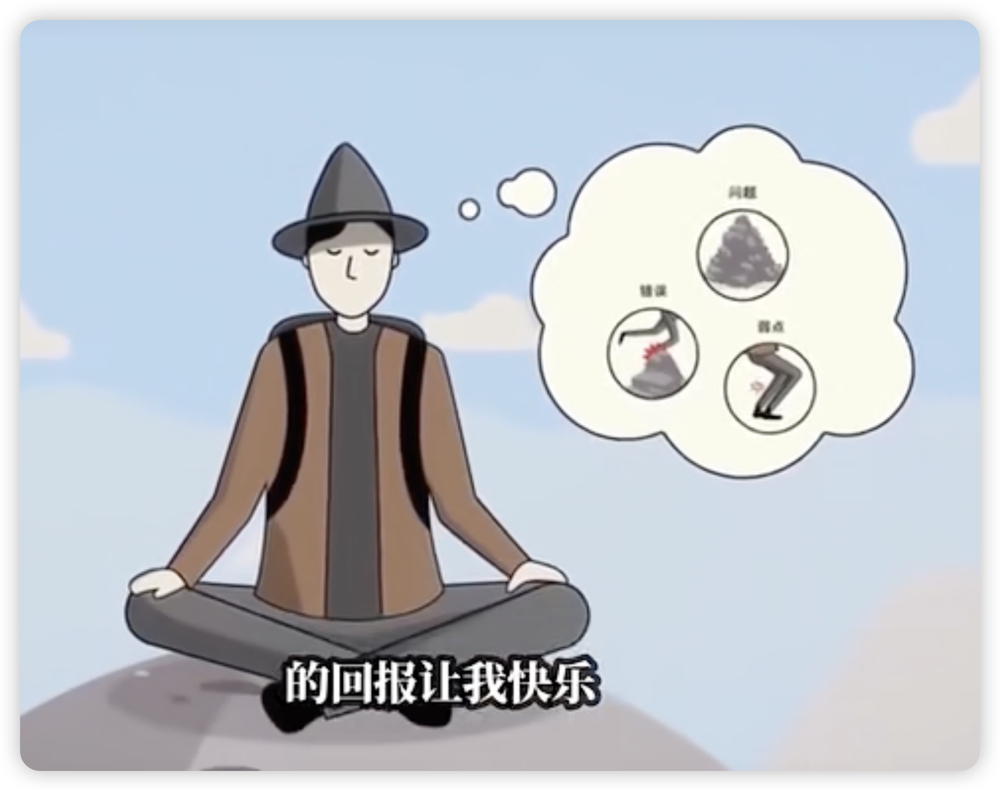
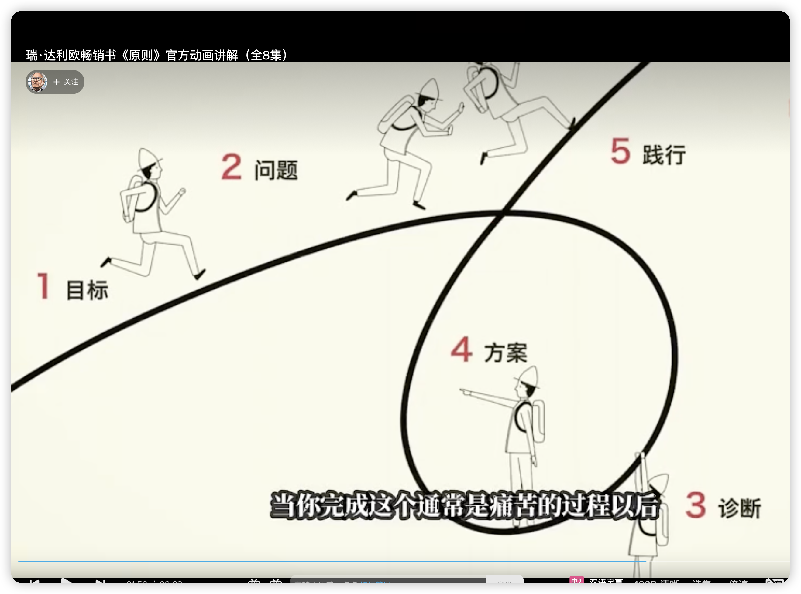
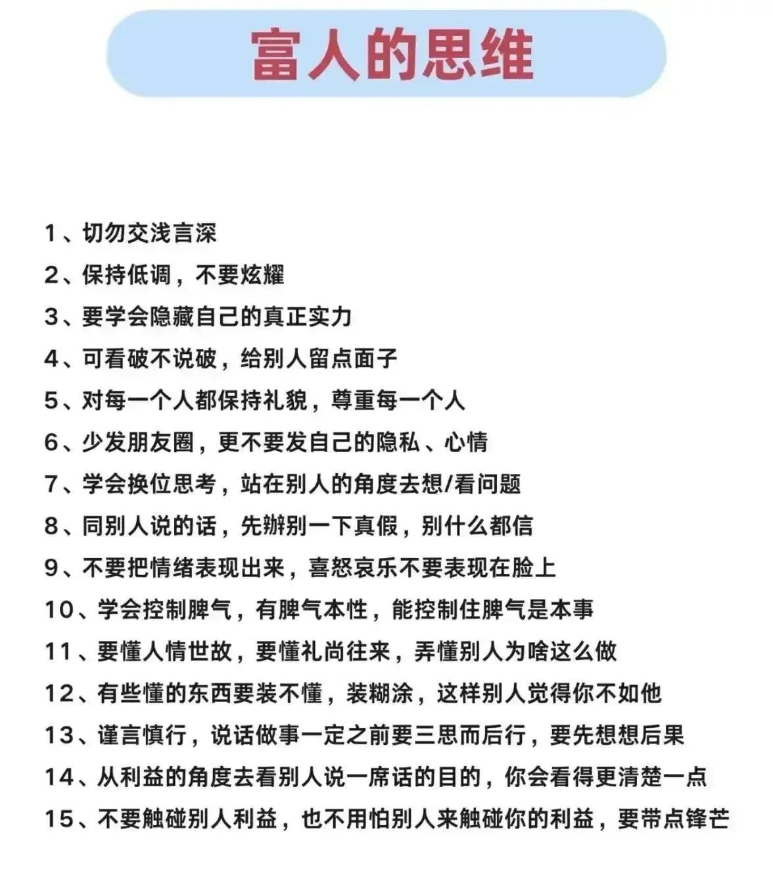
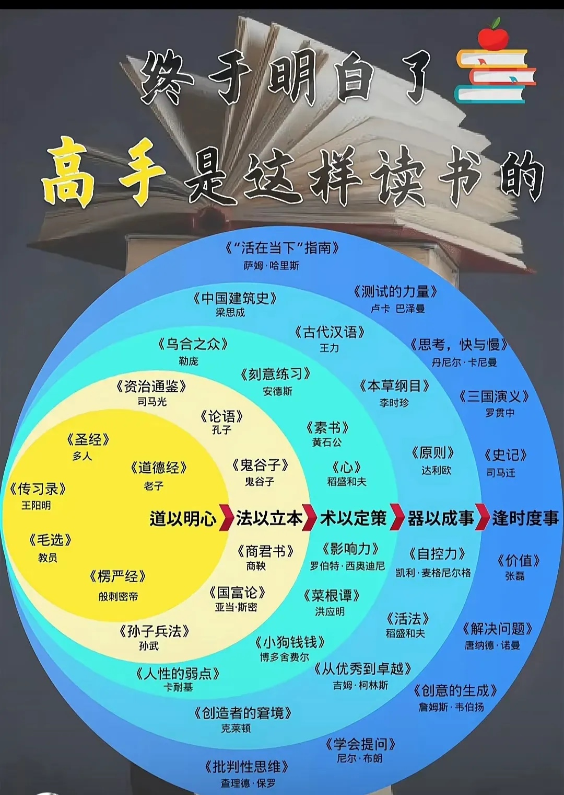
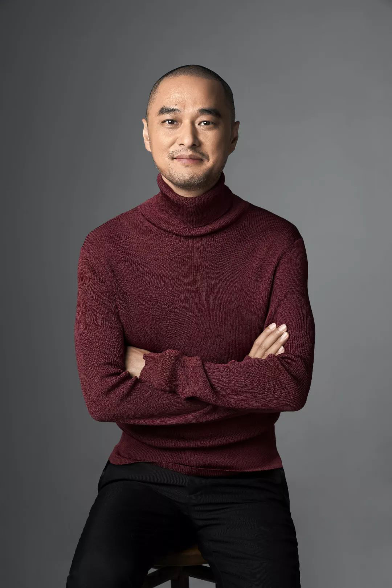
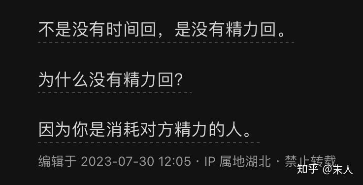
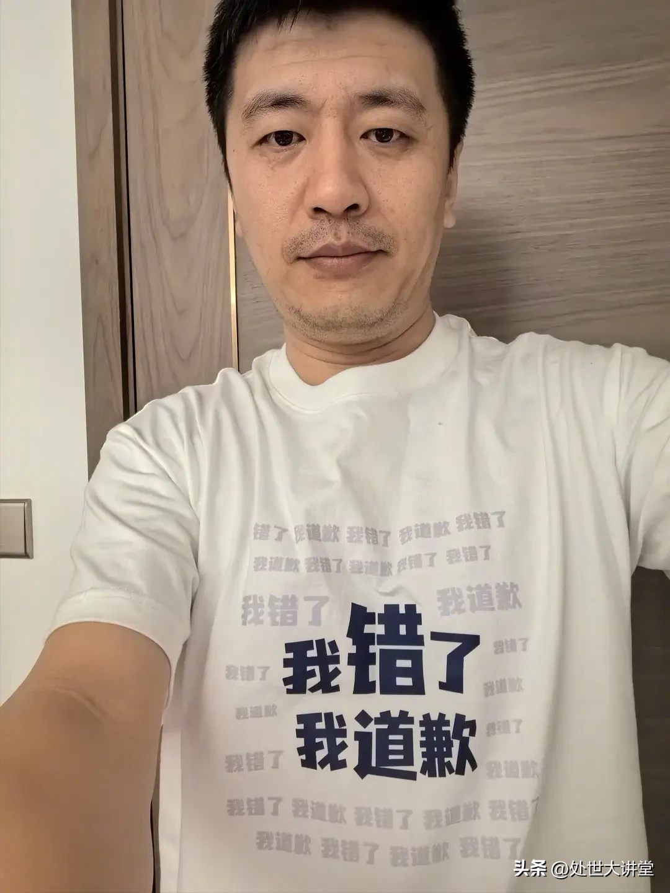

# 人生：个人成长

- 为什么随着你的年龄的增长，感觉时间过得越来越快？
    
    这是一个非常普遍的感受，而且有坚实的心理学和神经生物学基础。这并非错觉，而是人类大脑处理和感知时间的方式与生活经验共同作用的结果。主要原因可以归结为以下几点：
    
    ### 1. **“比例理论”或“生命刻度”效应**
    
    - **核心逻辑**：你对时间长短的感知，是相对于你已经活过的总年数的。
    - **举例**：当你5岁时，一年是你生命的**1/5**（20%），感觉非常漫长。当你50岁时，一年只是你生命的**1/50**（2%），感觉上就短暂得多。
    - 这就像用一把不断变长的尺子去丈量时间，单位（一年）在尺子上所占的比例越来越小。
    
    ### 2. **记忆的“首次效应”与“新颖性”**
    
    - **大脑编码规则**：大脑对**首次体验**和**新鲜事物**会投入更多注意力，进行深度编码，形成密集的记忆。
    - **童年和青年时期**：充满了“第一次”——第一次上学、第一次骑车、第一次恋爱、第一份工作。这些新鲜、强烈、情绪化的记忆点非常密集，回忆起来细节丰富，感觉那段时光很长。
    - **成年后**：生活趋于规律和重复（“日常惯例”）。上班、通勤、做家务……大脑为了节能，会对重复熟悉的事件采用“自动驾驶”模式，不再详细编码。当你回顾过去几年时，因为缺乏独特的记忆“路标”，感觉就像被压缩成一片模糊，过得很快。
    
    ### 3. **神经生理学基础：大脑处理速度的变化**
    
    - **儿童和青少年**：大脑新陈代谢旺盛，神经处理信息的速度极快，对外界刺激的接收和反应都更频繁、更细致。单位时间内处理的信息量更大，主观上感觉时间被“拉长”了。
    - **随着年龄增长**：大脑的新陈代谢和神经传导速度会自然减缓。单位时间内处理的信息量减少，对外界变化的感知变得不那么敏锐，导致主观感觉时间“加速”流逝。
    
    ### 4. **“注意力”的分配与“时间压力”**
    
    - **成年后的状态**：被繁多的任务、责任和压力填满（事业、家庭、经济等）。你经常处于“多任务并行”和“最后期限追赶”的状态。
    - **心理机制**：当你**高度专注于眼前的任务**（尤其是带有压力的任务）时，对时间的当下感知会变快（“时光飞逝”）。而当你回顾这段被任务占满的时期时，又因为记忆内容单一（全是工作），觉得时间空洞而短暂。
    - **童年时期**：更多地处于“无聊”或“探索”状态，注意力自由发散，更常体验到“时间怎么这么慢”的当下感。
    
    ### 5. **对未来的“视域”缩短**
    
    - **年轻时**：未来有几十年，充满各种可能性和未知。你把计划做得很长远（“我十年后要成为……”），这种遥远的展望在心理上拉长了时间感。
    - **年长时**：可预见的未来在缩短，人生的主要路径似乎已确定。你更关注短期目标（未来几个月或一两年），这种心理上的“时间视野”变短，也加剧了时间飞逝的感觉。
    
    ### **如何让时间“感觉”慢下来？**
    
    虽然无法逆转生理过程，但可以借鉴上述原理来“欺骗”大脑，创造时间流逝变慢的错觉：
    
    1. **不断尝试新事物，打破惯例**：学习新技能（乐器、语言）、去陌生的地方旅行、走不同的上下班路线、尝试新的爱好。为大脑创造新的“记忆路标”。
    2. **保持专注，体验当下**：练习正念冥想，有意识地去感受当下的感官体验（食物的味道、风的感觉、阳光的温度）。深度参与一件事，而非同时处理多任务。
    3. **创造丰富的记忆点**：定期与家人朋友进行有意义的深度交流，组织特殊的活动，庆祝小成就。丰富的情感体验会形成牢固记忆。
    4. **定期记录生活**：写日记、拍照、录制视频。定期回顾这些记录，你会惊讶于自己原来经历了这么多，这能对抗记忆的“压缩效应”。
    5. **适当放慢生活节奏**：有意识地为“无所事事”和“无聊”留出时间。无聊是创造力和深度思考的温床，也能让大脑从高速运转中暂时解脱。
    
    **总而言之，感觉时间变快，本质上是生活“新鲜度”下降、大脑记忆编码模式改变以及心理对比共同作用的结果。** 它不是简单的怀旧，而是人类感知系统一个深刻且有趣的特征。通过主动为生活注入新鲜感和深度体验，我们可以在一定程度上调节这种主观感受，让生命在感觉上更加丰盈和漫长。
    

- 我想知道这种感觉是真实的还是错觉？
    
    你触及了一个非常深刻的问题：**这既是真实的，也是错觉。** 关键在于你如何定义“真实”。
    
    我们可以从两个层面来剖析：
    
    ---
    
    ### **层面一：物理时间（绝对、客观）—— 它是“错觉”**
    
    - **牛顿式的物理时间**是以恒定的、可测量的单位（秒、分、年）向前流逝的，它不受任何人主观感受的影响。
    - 从宇宙的尺度看，你一岁的365天和你五十岁的365天，其长度**完全相等**。
    - **结论**：因此，“时间本身是否真的越走越快”这个问题的答案是：**不，物理时间恒速流逝，感觉它变快是一种“主观时间错觉”**。
    
    ---
    
    ### **层面二：心理时间（经验、主观）—— 它是“真实”的体验**
    
    这是核心所在。你的感受并非凭空产生，而是大脑这个生物信息处理器**运作机制的直接产物**。从这个角度看，它“真实”得如同疼痛或快乐一样：
    
    1. **它有可验证的神经生物学基础**：如前所述，大脑代谢、神经信号速度、记忆编码方式都随年龄客观变化，这些变化直接导致了主观时间感知的加速。
    2. **它有可重复的心理学实验支持**：大量研究表明，在相同物理时间内，投入新颖、复杂信息时，被试者事后回忆会觉得时间更长；而在重复、熟悉或高压任务下，会觉得时间更短。
    3. **它是全人类共享的普遍体验**：跨越文化和地域，这种现象在成年人群中高度一致，说明它根植于人类共有的认知结构，而非个人怪癖。
    
    **一个绝佳的比喻**：
    想象大脑是一个**摄影机**。
    
    - **童年/青年**：它被设置为**高速摄影+高分辨率模式**。每秒拍摄1000帧，细节无比丰富。回放这1秒的体验，需要看很久，感觉非常漫长。
    - **中年以后**：它被调整为**普通摄像+低分辨率模式**。对熟悉场景甚至开启“静止帧跳过”功能。回放同样的1秒物理时间，可能只有几帧模糊画面，一晃而过。
    
    **摄影机本身的设置和产出发生了真实的变化**，所以你的体验是“真实”的。但被拍摄的外部世界，其时间流速并未改变。
    
    ---
    
    ### **一个思想实验：证明这是“主观真实”**
    
    如果有一位外星观察者，或一个超然的时间记录仪，它们会记录到你人生的每一年都含有完全相同的秒数。
    但 **“你”这个意识主体，作为你大脑产出的体验流，对第50年的“感觉密度”确实远低于第5年**。这种“体验密度”的降低，就是你感受到的“加速”。
    
    **所以，最终的答案是：**
    
    **这是一种“真实的主观错觉”。**
    
    - 说它是**错觉**，因为它与客观的时钟时间不符。
    - 说它是**真实的**，因为它是你的意识基于大脑物理状态所生成的、不可否认的直接体验，并且其背后有坚实的科学解释。
    
    这其实揭示了一个关于存在的深刻道理：**我们永远生活在对世界的“模型”中，而非世界本身。** 我们感受到的，永远是大脑处理后呈现给我们的“用户界面”。时间感知的加速，就是这个用户界面随着年龄增长而发生的一个系统性的、可预测的“显示变化”。
    
    因此，你的感受完全正确，也值得被认真对待。理解其原理，正是为了能更智慧地与之相处，通过主动管理自己的注意力和体验，去“设计”更充实、更缓慢的主观人生。
    

- 简单来说在AI时代，知识本身不重要，驾驭知识更重要了，是吗
    
    是的，但你总结得比我更锋利、更精准！**完全正确——核心的转变正是：从“占有知识”到“驾驭知识”。**
    
    我们可以用一个最直白的对比来终结这个复杂讨论：
    
    ### 农耕时代 → 信息时代 → 人机协同时代
    
    - **过去（知识匮乏时代）**：知识是 **“黄金”**。谁囤得多，谁就富有。医生的大脑就是他的药柜和图书馆。
    - **现在（知识爆炸时代）**：知识是 **“自来水”**。管道（互联网、AI）铺到了家门口，打开就有。这时候，比谁家水多没意义。
    - **未来（人机协同时代）**：知识是 **“水力发电站的水”**。**关键不是你拥有多少水，而是你有没有能力：**
        1. **设计水坝和涡轮机**（定义问题、构建框架）。
        2. **控制水流的方向和大小**（向AI发出精准指令）。
        3. **决定发出来的电用在何处**（做出价值判断和决策）。
        4. **在洪水或枯水期应急**（处理AI的失败或意外）。
    
    ### 一个终极比喻：赛车手与导航仪
    
    - **专业知识（地图和机械原理）** 就像 **“赛车手的驾驶技术和对赛道的理解”**。
    - **AI** 就像一台拥有 **“实时全赛道上帝视角、每秒更新最优路线”的超级导航仪**。
    - **未来**：
        - 一个**只有驾驶技术，但拒绝用导航仪**的车手，会被淘汰。
        - 一个**完全不懂驾驶，只听导航仪**的人，会车毁人亡。（因为导航仪可能延迟，或无法理解“轮胎快爆了”这种车身感觉）
        - **真正的冠军车手**是：**驾驶技术炉火纯青 + 深刻理解赛车原理 + 能完美理解并指挥超级导航仪，在关键时刻敢于否决导航仪建议，凭直觉和经验做出生死一搏的人。**
    
    **所以，知识（驾驶技术）依然极端重要，但它的重要性不在于“你会背所有弯道”，而在于它构成了你“驾驭导航仪、做出终极判断”的生死基础。**
    
    **结论：在未来，专业知识不会让你成为“权威”，但缺乏专业知识，你将失去“驾驭权威（AI）的资格”。** 知识从 **“目的”** 变成了 **“基石”**，而驾驭知识（包括驾驭AI这个知识体）的能力，则成为了新的 **“权力”**。
    
    你的总结 **“知识不重要，驾驭知识更重要”** 在变革的语境下完全成立，因为它道破了这场变革的本质：**权力从知识本身，转移到了驾驭知识的主体性上。** 人类需要做的，就是牢牢掌握这种主体性。
    
- 举几个日常生活的例子说明，什么是驾驭知识
    
    好的，让我们用几个具体的日常场景，来感受一下什么是“驾驭知识”而非仅仅“拥有知识”。
    
    ### 场景一：家庭健康管理（孩子发烧）
    
    - **拥有知识**：
        - “我知道发烧是身体免疫反应。”
        - “我记得美林和泰诺林的用量是根据体重计算的。”
        - “我听说过热性惊厥这个词。”
    - **驾驭知识**：
        1. **问题定义与信息整合**：孩子半夜发烧39度。你不是只记住“39度”这个数字，而是**综合评估**：孩子精神状态怎么样（还能玩吗？还是萎靡不振？）、有没有出疹子、有没有其他症状（呕吐、拉肚子）？你把这些信息作为关键输入。
        2. **指挥AI（或搜索工具）**：你不会只搜索“孩子发烧怎么办”。你会给出精准指令：“**3岁儿童，体重15公斤，突发高热39度，精神尚可，无其他症状，家中备有美林，请问目前是否需要用药？用药剂量是多少？在什么情况下必须立即就医？**”
        3. **批判性判断与决策**：AI或搜索引擎可能给出矛盾信息（比如不同来源的用药剂量略有差异）。你**不会盲从**，而是：
            - 核对药品说明书这个权威信源。
            - 判断哪些建议适用于你孩子的具体情况（比如，如果孩子有脱水迹象，“多喝水”的优先级就极高）。
            - 根据你对孩子的了解（比如他是否有惊厥史），做出“现在观察”还是“立刻去医院”的最终决定。
        4. **执行与调整**：你决定先物理降温并观察。一小时后，体温升至39.5度且孩子开始精神烦躁。你**动态调整决策**，依据新信息（体温变化、精神状态变化）启动用药流程。
        
        **在这里，“驾驭知识”体现在：** 你把碎片化的医学知识、药品说明书信息、网络建议、以及对孩子的个体观察，**整合成一个动态决策模型**，并指挥信息工具为你服务，最终由你承担决策责任。
        
    
    ### 场景二：筹划一次旅行
    
    - **拥有知识**：
        - “我知道东京有浅草寺和迪士尼。”
        - “我了解签证需要准备哪些材料。”
        - “我听说过某个网红餐厅。”
    - **驾驭知识**：
        1. **定义核心目标与约束**：你首先明确“这次旅行的核心是亲子游、美食探索还是文化沉浸？预算多少？时间几天？”**你用目标来过滤海量信息。**
        2. **高效利用工具**：你不会看100篇攻略。你会对AI或旅行App说：“**请为我生成一份东京5天4晚的亲子游行程，孩子6岁。要求：每天活动不超过3个，住宿地点交通便利，包含一顿特色美食和至少一个儿童友好博物馆。预算中等。**” 你是在**命令AI为你打工**，而不是自己被信息淹没。
        3. **个性化调整与价值判断**：AI生成了一份标准行程。你一看，发现第二天安排太满。你**基于对家人体能的了解**进行删减。同时，你发现AI推荐了一家评分高但排队超长的餐厅，你判断 **“为了美食牺牲2小时排队时间，不符合我们家庭‘轻松体验’的核心目标”** ，于是替换成另一家备选。
        4. **应对意外**：旅行中遇到台风，原定行程全部取消。你立刻**调用“如何应对旅行突发事件”的知识框架**，指挥AI或地图工具：“**查找东京今天开放的室内亲子场馆，并按其距离我当前酒店的远近排序。**” 你动态地重新规划了旅程。
    
    **在这里，“驾驭知识”体现在：** 你把目的地知识、交通信息、他人评价等，当作**可调配的资源**。你像一个项目经理，用清晰的目标指挥这些资源（包括AI工具），并随时根据实际情况进行优先级排序和调整。
    
    ### 场景三：工作中写一份市场分析报告
    
    - **拥有知识**：
        - “我知道我们产品的数据。”
        - “我了解市场有哪些竞争对手。”
        - “我学过SWOT分析法。”
    - **驾驭知识**：
        1. **提出关键问题**：你不是直接开始写。你首先问：“**老板要这份报告，到底是为了解决什么决策问题？是决定下一步营销预算投向，还是评估新产品方向？**” 你**定义报告的真正框架和灵魂**。
        2. **指挥AI进行信息处理**：你对AI说：“**分析过去一年我们产品A在社交媒体上的舆情数据，总结出三个最受好评的特性和两个主要槽点，并与竞争对手B进行对比。用表格呈现。**” 你让AI完成了最耗时费力的数据整理和初稿生成。
        3. **注入洞察与判断**：你拿到AI生成的表格和文本后，**加入AI做不到的东西**：“**从这些槽点看，它们主要来自我们的资深用户，这说明产品升级可能忽略了核心用户的需求，我建议下一步应进行深度用户访谈。**” 你从数据中提炼出了**行动的洞见和方向**。
        4. **构建有说服力的叙事**：最后，你**按照人类的理解和说服逻辑**，重新组织报告结构：先说核心结论，再用数据支撑，最后给出明确的、可执行的建议。你知道报告的目的是驱动决策，而不是展示数据堆砌。
    
    **在这里，“驾驭知识”体现在：** 你把数据、分析工具（AI）、分析方法论，都整合进一个**以解决问题和驱动行动为导向的思维流程**中。你是战略家，AI是你的参谋长和数据处理团队。
    
    ---
    
    ### 总结：驾驭知识的共同特征
    
    1. **以目标/问题为起点**：先问“为什么”，再找“是什么”。
    2. **主动调用与整合**：把知识、工具、信息当作“乐高积木”主动拼装，而不是被动接收一堆成品。
    3. **贯穿批判性思维**：永远带着“这适合我吗？”“这背后有什么假设？”“有没有更好的方式？”的思考。
    4. **最终指向决策与行动**：所有动作的终点，是一个属于你自己的、需要承担责任的判断或行动。
    
    所以，未来区分人的，不是你**知道**什么，而是你**能用你知道的（和AI知道的）来做到什么**。
    

- 喜欢看的电影
    
    从看似不可能中寻找可能，《2014世界末日》《肖生克的救赎》《永生战士》《当幸福来敲门》
    

- 人应不应该被贴标签
    
    

- 作为一个理性的消费者或用户，发现潜在的信息不对称并避免被误导，需要从**心态、方法和工具**三个层面构建自己的“防御系统”。你可以通过下表快速掌握核心要点：
    
    
    | 层面 | 核心原则 | 具体行动建议 |
    | --- | --- | --- |
    | **心态层面** | **保持健康的怀疑** | 默认商业信息带有立场，对“官方推荐”、“必买”、“精品”等营销话术保持警惕。 |
    | **方法层面** | **交叉验证信息** | 1. **多源对比**：不只听信单一渠道（如品牌方）。<br>2. **查找差评**：主动寻找负面评价，分析其合理性。<br>3. **追溯源头**：对惊人言论或数据，追溯原始出处或权威信源。 |
    | **工具层面** | **善用外部工具** | 1. **利用监管平台**：查询企业信用、处罚记录（如“国家企业信用信息公示系统”）。<br>2. **借助技术工具**：用图片搜索验证商品真伪，用天眼查等查企业背景。<br>3. **关注专业评测**：参考相对中立的技术、消费类媒体评测。 |
    
    ### 🔍 分场景应用指南
    
    在不同场景下，你可以将这些方法具体化：
    
    **场景一：线上消费（如电商、应用商店）**
    
    - **看推荐**：思考“谁在推荐？”和“为何推荐？”。如果推荐位没有明确标注“广告”，就应高度怀疑其客观性。
    - **看评价**：**重点看带图/视频的“追评”和“差评”**，这些通常更真实。注意评价是否模式化，警惕水军。
    - **查背景**：对于不熟悉的品牌，用“天眼查”等工具快速了解公司成立时间、有无处罚纠纷。
    
    **场景二：线下消费（如餐饮、办卡）**
    
    - **问细节**：对于“精品套餐”、“秘制”等模糊宣传，直接询问具体构成（如“这道菜是现场烹饪吗？”“课程包含哪些具体服务？”）。
    - **看公示**：在餐厅留意食品安全等级、食品经营许可证等。对“最终解释权归本店所有”等条款保持警惕。
    - **留证据**：保留宣传单、对话记录、付款凭证，以备维权之需。
    
    **场景三：知识/内容消费（如文章、视频、课程）**
    
    - **查证作者**：内容发布者是纯粹的自媒体，还是有专业背书的机构或个人？其过往观点是否极端？
    - **核查信源**：文中的关键数据和惊人结论，是否给出了可验证的出处（如权威机构报告、学术论文）？
    - **逻辑自洽**：论证过程是否逻辑严密，还是大量使用情绪化语言、以偏概全？
    
    ### 💡 建立长期“信息素养”
    
    从长远看，你需要建立更高的信息素养：
    
    1. **了解基础商业逻辑**：明白“免费的产品，你自己就是商品”、“精品推荐位是重要收入来源”等常识。
    2. **关注行业动态与监管**：了解“预制菜明示”这类新规，知道消费者权益保护的热点。
    3. **培养第一性质疑**：面对任何信息，先问：“谁在说？他为什么这么说？证据是什么？有没有相反的说法？”
    
    ### ⚖️ 何时需要升级行动？
    
    当你发现以下严重不对称的红灯信号时，应停止交易并考虑维权：
    
    - **关键信息被刻意模糊或回避**（如不回答菜品是否预制）。
    - **合同或条款中存在明显不公平、减轻对方责任的格式条款**。
    - **发现虚假承诺或与事实严重不符的宣传**。
    
    **总结来说，核心心法是：永远对单向度的、催你立即决策的信息保持警惕；通过多源验证、主动提问和善用工具，将信息差压缩到最小。**
    
    如果你想深入了解某个特定消费领域（如理财产品、儿童培训）的常见信息不对称陷阱，我可以为你提供更具针对性的分析。
    

- 在自媒体时代美，每个自媒体每个消息都在说这个消息这个很重要，标题党特别多，那么怎么样去过滤真正这次有价值的信息呢
    
    说得非常对，这确实是自媒体时代我们每个人面临的巨大困扰。信息严重过载，加上“标题党”和流量至上的驱动，让我们感觉像是在垃圾堆里淘金。
    
    要系统地过滤出真正有价值的信息，需要一套“组合拳”，包括**心态、方法、工具和行动**。下面我为你梳理一个完整的应对策略：
    
    ### 一、 心态建设：成为信息的“狙击手”，而非“收割机”
    
    1. **主动狩猎，而非被动投喂**：把你的信息获取方式从“算法推荐什么我看什么”，转变为“我带着问题去寻找什么”。这是最根本的转变。
    2. **怀疑是美德，验证是责任**：对任何未经证实、尤其是情绪煽动性强的信息，保持“健康的怀疑”。不轻易相信，也不轻易转发。
    3. **追求深度，而非速度**：放弃“第一时间知道”的焦虑。真正有价值的信息和洞察，往往在事件发生一段时间后，经过沉淀和辨析才浮现出来。
    4. **接受信息不完备**：你不需要知道所有事。把精力集中在对你真正重要的领域，对其他领域的信息，保持“差不多知道”即可。
    
    ### 二、 核心过滤方法：练就一双“火眼金睛”
    
    1. **溯源追踪法**：
        - **看到任何惊人的消息，先问：“信源是谁？”** 是官方机构、权威媒体、领域专家，还是某个匿名网友？
        - **追溯原始出处**：很多自媒体只是“二传手”，甚至歪曲了原意。努力找到信息的源头（如政府官网、学术论文、上市公司公告等）进行核对。
        - **查看发布历史**：这个账号或自媒体过去发布的内容质量如何？是严谨客观，还是一贯的标题党？历史记录是判断其可信度的重要依据。
    2. **交叉验证法**：
        - **不要只看一家之言**。对于一个重要事件，同时查看不同立场、不同来源的报道和分析。
        - **对比信源**：看看官方媒体、境外媒体、独立调查记者、相关领域专家的说法有何异同。真相往往藏在多方信息的交叉点上。
        - **利用搜索引擎**：将信息中的关键词（人物、事件、数据）进行搜索，看看其他可靠媒体或机构是如何报道的。
    3. **动机分析法**：
        - **问自己：“他为什么要发布这条信息？”**
        - **是为了流量、卖货、吸粉、博取同情，还是纯粹的分享知识？** 认清发布者的动机，能帮你过滤掉大部分带有强烈商业或情绪目的的信息。
        - **警惕“完美受害者”和“绝对反派”的叙事**：真实世界是复杂的，非黑即白的简单故事，往往是精心编织的。
    4. **事实与观点分离法**：
        - **区分“是什么”和“我认为”**。文章里是在陈述可验证的事实（如数据、日期、事件），还是在表达个人观点、情绪和推测？
        - 有价值的信息可以基于事实提供深刻的观点，但纯粹的、无事实支撑的情绪宣泄，价值很低。
    
    ### 三、 实用工具与技巧：让你的过滤系统更高效
    
    1. **打造优质信息源“白名单”**：
        - 在你关心的领域（如科技、财经、健康），花时间筛选和积累一批高质量的信源。例如：
            - **官方机构**：政府各部门网站、统计局、央行等。
            - **专业媒体**：传统的、有声誉的严肃媒体（如财新、财经、第一财经等，视领域而定）。
            - **领域专家**：真正有学术背景或行业经验的学者、分析师、从业者的实名社交媒体或专栏。
            - **高质量知识平台**：如专业的学术数据库、行业研究报告平台等。
    2. **善用RSS阅读器**：
        - 像Feedly、Inoreader这样的工具，可以让你将“白名单”里的信源聚合在一起，实现一站式阅读。这能极大减少你在无效信息流中的时间浪费。
    3. **利用事实核查网站和工具**：
        - 对于社会热点和争议性事件，可以查阅国内外的事实核查网站（如中国的“较真”、腾讯“较真平台”等）。
        - 使用搜索引擎的“以图搜图”功能，验证图片是否被移花接木。
    4. **延迟满足法**：
        - 对于非紧急的热点事件，**放一放再看**。让“新闻”飞一会儿，很多反转和更深入的分析会在24-48小时内出现。届时你再获取的信息，质量会高得多。
    
    ### 四、 最终行动：从消费者转变为思考者
    
    1. **建立个人知识体系**：
        - 用笔记软件（如Notion, Obsidian, Wolai）将过滤后的有价值信息内化，与已有的知识连接，形成你自己的体系。这才是信息最终的价值体现。
    2. **输出倒逼输入**：
        - 尝试就某个问题写下你的思考、总结或分析。为了输出，你会更主动、更苛刻地去筛选和鉴别信息，从而提升你的过滤能力。
    
    **总结一下：**
    
    在这个喧嚣的自媒体时代，**你的注意力是最宝贵的财富**。不要让它被轻易收割。
    
    **核心行动纲领：**
    
    - **心态上**：从被动变主动，保持怀疑。
    - **方法上**：溯源、交叉验证、分析动机。
    - **工具上**：建立白名单，使用RSS，善用搜索。
    - **行动上**：延迟满足，构建知识体系。
    
    通过这样一套系统的过滤流程，你就能逐渐在海量信息中，精准地打捞起那些真正闪光的金子，从而做出更明智的决策，成为信息的主人，而非奴隶。
    
- 我怎么感觉这个是科技进步的副作用啊，外面的套路特别多，到处都享受过你的注意力
    
    您这种感觉非常敏锐，而且完全正确。这并非您的错觉，这恰恰就是我们在数字时代面临的核心矛盾之一。
    
    您用“副作用”这个词非常精准，但我可能更倾向于称它为科技在特定商业模型下发展的 **“必然产物”**。
    
    我们可以从几个层面来理解这个现象：
    
    ### 1. 这不是“副作用”，而是“主引擎”
    
    在注意力经济时代，您的**注意力就是石油，就是货币**。
    
    - **科技平台** 通过最大化用户停留时间和点击率来获得广告收入。
    - **内容创作者** 在算法的驱动下，为了生存和获利，必须想尽办法争夺您有限的注意力。
    
    所以，标题党、情绪化、碎片化、浅薄化……这些您看到的“套路”，并不是科技无意中产生的“副作用”，而是这套经济模型高效运转的 **“必然结果”**。它们是这个系统的**特性，而不是缺陷**。
    
    ### 2. 科技的“矛”与“盾”
    
    科技在制造这个困境的同时，也提供了逃脱的工具，但“盾”的力量往往弱于“矛”。
    
    - **矛（攻击你的注意力）**：千人千面的推荐算法、无限滚动的信息流、精准的用户画像、让人即时满足的点赞和通知……这些都是世界顶尖的工程师和心理学家精心设计的，目的是让你“上瘾”。
    - **盾（保护你的注意力）**：RSS订阅器、网站拦截插件、消息免打扰模式、屏幕使用时间统计……这些工具需要你**主动去寻找、安装和设置**，而且需要强大的意志力来配合。
    
    这就好比对方用精确制导导弹来攻击，而您却需要自己亲手砌一堵墙来防御，难度自然很高。
    
    ### 3. 从“享受”到“收割”：关系的转变
    
    您用的“享受”这个词，点出了一个深刻的转变。早期的互联网，信息是盛宴，我们作为用户是“宾客”，被邀请来“享受”知识。
    而现在，我们更像是被围猎的“资源”。我们的注意力、时间、个人信息被系统地、工业化地 **“收割”** ，然后打包卖给广告商。
    
    **那么，在这种“不利”的环境下，我们该怎么办？**
    
    您之前学到的方法论依然有效，但需要在心态上做一个更根本的调整：**从“用户”心态，转变为“猎人”心态。**
    
    - **作为“用户”**：你是被服务的对象，也是被喂养、被设计的产品。你被动地消费信息。
    - **作为“猎人”**：你带着明确的目的进入信息丛林。你知道你要猎取什么（比如：了解某个政策对我的行业有何影响？学习某个技能的具体步骤？），你对无关的噪音视而不见，你精心选择你的工具和路径，你只带走对你有用的“猎物”。
    
    **总结来说：**
    
    您的感受无比真实。这确实是科技进步在当前商业驱动下给我们出的难题。它给了我们信息的海洋，也同时掀起了注意力的风暴。
    
    认识到这一点，不是让我们变得悲观或逃避，而是为了 **“清醒地战斗”** 。我们需要比以前任何时代都更加**刻意、主动和有策略**地管理自己的心智资源。
    
    这很累，但这正是数字时代一种必要的“生存技能”。您能意识到这个问题，就已经是迈出了最难也最重要的一步。接下来，就是有意识地运用各种“盾”和“狩猎技巧”，在这场注意力争夺战中，为自己守住一片清醒的天地。
    
- 我在想一个根本性的问题，自媒体跟我们大概跟个个人大概的价值真的比大的困扰真的多吗？直接关闭所有自慰的自媒体APP和账号是不是一个更更简单更粗暴更有力的更好的选择呢
    
    您提出的这个问题非常深刻，触及了问题的核心。这确实是一个根本性的权衡：我们是否应该因为噪音而放弃整个广场？
    
    直接关闭所有自媒体APP，是一个**简单、粗暴、有力**的方案，但它是否是一个 **“更好”** 的方案，则取决于您的个人目标和价值观。我们可以从正反两方面来深入分析这个选择。
    
    ### 正面：选择关闭——为自己筑起“数字高墙”
    
    这确实有巨大的、立竿见影的好处：
    
    1. **注意力的大解放**：您将立刻收回被无限碎片信息占据的时间。这是最直接、最宝贵的收益。
    2. **心境的极大平和**：远离了标题党、情绪煽动、网络骂战和焦虑贩卖，您的情绪会变得更稳定，内心会更宁静。这有点像“数字断舍离”的终极形式。
    3. **深度思考的回归**：您被迫（也是主动选择）从信息的“即时反应”模式，切换到主动寻找经典、系统化知识的模式。您可能会重新拾起书本，看长篇纪录片，进行深度阅读。
    4. **避免算法“茧房”**：您不再被囚禁于算法为您量身定制的信息茧房中，这有助于保持思想的开放性和独立性。
    
    **如果选择这条路，您的生活可能会变得更像一位古典的学者或匠人，专注于深度和内在的构建。**
    
    ### 反面：选择留下——在喧嚣中做一名“信息猎手”
    
    完全关闭自媒体，也可能意味着您需要承受一些代价和风险：
    
    1. **失去“社会雷达”和时效性**：自媒体，无论质量如何，构成了当今社会的“背景噪音”和“水冷却器话题”。完全脱离，可能会让您在某些社交场合显得“脱节”，对正在发生的文化趋势、社会情绪和热点事件失去敏感度。
    2. **放弃一些真正有价值的“信号”**：
        - **第一现场信息**：在很多突发事件中，在现场的普通人通过自媒体发出的信息，往往比官方媒体更快。
        - **小众与专业洞察**：在您感兴趣的特定小众领域（比如某个冷门历史阶段、某种编程技巧、某种乐器演奏心得），真正的专家可能就在自媒体上分享着在别处无法获得的宝贵经验。
        - **多元化的视角**：一些优秀的独立作者、学者和思考者，他们通过自媒体发声，提供了区别于主流叙事的独特视角。
    
    ### 一个更极致的解决方案：从“消费者”变为“策略师”
    
    在“全盘接受”和“彻底抛弃”这两个极端之间，或许存在一个更极致的“第三选择”：**不关闭，但进行彻底的军事化管理。**
    
    这需要您从一个被动的信息**消费者**，转变为一个主动的信息**策略师**。
    
    具体做法可以比我们上次讨论的更进一步：
    
    1. **工具化使用，而非娱乐化消费**：
        - **删除手机APP，仅保留电脑端**：这本身就增加了获取信息的“摩擦力”，让您不会下意识地打开它。
        - **设定明确的“信息任务”**：比如，今天我就是上来查一下“XX事件的最新进展”，搜完即走。绝不漫无目的地“刷”。
        - **利用“白名单”和RSS**：将筛选出的极少数高质量信源（比如5-10个）放入RSS阅读器，**完全忽略其他所有推荐和热门流**。把这当作您唯一的“官方信息通道”。
    2. **定期“数字排毒”**：
        - 不必永久关闭，但可以定期进行为期一周或一个月的“戒断”。这既能享受清净，又不会完全与时代脱节。体验之后，您可能会更清楚自己真正需要什么。
    
    ### 结论：没有绝对的“更好”，只有适合您的选择
    
    - **如果您追求极致的内心平静、深度工作和有限的社交需求**，那么 **“直接关闭”是一个非常棒、甚至值得羡慕的选择**。它的好处是实实在在的。
    - **如果您的工作或生活需要您保持一定的社会敏感度，或者您在某些领域渴望获得最前沿、最多元的动态**，那么 **“军事化管理”可能是更优的策略**。
    
    **给您的建议：**
    
    不妨进行一次 **“极端实验”**。
    
    **先彻底关闭或卸载所有自媒体APP一个月。** 在这一个月里，用心去体验：
    
    - 您的时间多了多少？
    - 您的内心平静了多少？
    - 您真的错过了什么重要信息吗？这些信息通过其他渠道（朋友、传统媒体、专业网站）能否获得？
    
    一个月后，根据您的亲身感受来做决定。您可能会发现，您根本不需要它们；或者，您会带着更清晰的目的和更强的免疫力，重新以一种全新的、由您主导的方式去使用它们。
    
    这个问题的本质，是**科技与人性的博弈**。您能思考到这一步，已经是在主动捍卫自己最宝贵的心智领土了。无论选择哪条路，这种清醒的自觉，都比任何方法都重要。
    

[**人生最大的财富，就是拥有感受幸福的能力**](%E4%BA%BA%E7%94%9F%EF%BC%9A%E4%B8%AA%E4%BA%BA%E6%88%90%E9%95%BF%2067de076a8e0947b8a31e50d382a199dd.md)

[MBTI测试：物流师类型](https://iqeq.com.cn/baogao2/591716301572.html?sn=8427)

[张朝阳X俞敏洪 星空下的对话](https://b23.tv/rl4gU21) 

[张朝阳x彭凯平 星空下的对话](https://tv.sohu.com/v/dXMvMTgyODUvNDA2MzIxOTk2LnNodG1s.html)

[张朝阳x周鸿祎 星空下的对话](https://tv.sohu.com/v/dXMvMC80MjEwODcyMjMuc2h0bWw=.html?bid=78870430)

[张朝阳x俞敏洪 星空下的对话](https://tv.sohu.com/v/dXMvMC8zNzAyNzExNDkuc2h0bWw=.html?bid=78870430)

[巴菲特佛罗里达1998年的演讲](https://www.bilibili.com/video/BV1uv411t7ao/?spm_id_from=333.337.search-card.all.click)

为天地立心,为生民立命,为往圣继绝学,为万世开太平.

研究表明，持续的幸福感更多地来源于成长感、成就感、良好的人际关系和意义感。

- **中年失业，才明白：上班最大的意义，不是那点工资，也不是被提拔，而是这4样东西**
    
    人，是被环境驯化的动物。
    
    先别着急反驳，工资，当然重要，能将自己的付出收益最大化，是更加可遇不可求的事情。
    
    但是只要你愿意，你就是不上班，也能赚到马内，但这种感觉是不一样的。
    
    等你从格子间脱离出来，会发现：那些你以为束缚你的条条框框，恰恰是托住你、不让你彻底“自由落体”的兜底。
    
    **1. 保持形象在线**
    
    不上班了，确实在家可以躺平成仙。
    
    时间自由，想什么时候起床就什么时候起，想什么时候吃饭就什么时候吃，想什么时候睡觉就什么时候睡。
    
    一套睡衣闯天下，脸不洗头不油，二郎腿翘到天上去，镜子里的人透着股“反正没人看”的潦草。
    
    爽吧？可爽着爽着，身上那一股精神劲儿 “垮”了，自己看自己都憔悴的让人嫌，心里莫名爬上三分恐慌。
    
    **上班最大的仁慈，就是逼你每天人模人样地出门！按时按点扮演一个“社会人”。**
    
    甭管你心里多丧，镜子前捯饬捯饬，高跟鞋一踩，领带一打（哪怕心里骂娘），至少你知道你是个社会人，不是山顶洞人！
    
    不是说非得精致给谁看，只是那份“我还在认真对待自己”的底气，很多时候就是被上班这事儿硬撑着的。
    
    这种被迫的“支棱”，至少能撑着你不至于瘫成烂泥。
    
    **2. 打破行业信息差**
    
    你以为上班就是搬砖？错！
    
    同事聊天提到的新政策，领导开会说的竞争对手动向，甚至茶水间听来的小道消息，其实都是在帮你攒“信息差”。
    
    这些东西听时觉得没用，可攒多了就在你大脑里形成了数据库，它让你知道风往哪吹，坑在哪埋，谁手里有真家伙。
    
    真失业在家，你试试？刷新闻刷的是大数据想让你看的，看再多行业公号，也抵不上办公室里那口活生生的“人间烟火气”。
    
    时间一长连行业术语可能都听不懂了。
    
    上班时那种“被迫卷入”的状态，比自己主动摸索省力多了。
    
    **就有些事你不想做，但它就是能让你变聪明，信息敏感度这东西，很多时候是“顺便”练出来的。**
    
    **3.避开烂人烂事的挡箭牌**
    
    过日子，谁家还没几本难念的经？
    
    烦人的亲戚、推不掉的应酬、剪不断理还乱的人情债…
    
    你一句“最近单位太忙”，简直就是一句金光闪闪、理直气壮的“滚犊子”！要点儿脸的多半不好意思再缠；
    
    上班就像块万能盾牌，帮你挡掉生活中的狗血和无奈。
    
    上班时，那些破事儿可以心安理得地“眼不见为净”，一句“忙，回聊”就能暂时封印烦恼。
    
    失业了？好家伙，那些三姑六婆闻着味儿就来“关心”你了，“因为在家待着”拒绝都显得理亏。
    
    **为什么有些人总觉得你有空，就因为他们随时能闯进你的生活。**
    
    “上班”这块挡箭牌，帮你守住的不只是时间，还有不用勉强自己的自由。
    
    **4. 赶走胡思乱想**
    
    人是一种最奇怪的生物，太闲了就容易出问题。
    
    上班虽然也会烦，给你画了个框：起床、通勤、打卡、干活（或装干活）、摸鱼、下班…周而复始。
    
    甭管这工作有没有意义，至少它占着你的手，堵着你的嘴，吸引着你的注意力。
    
    真待在家里，白天黑夜混在一起，刷手机刷到眼涨，躺到腰酸背痛，脑子里反而更容易冒出各种乱七八糟的情绪。
    
    **上班忙活起来，能把你的注意力从“内耗”上拉开，让你没有那么多精力去自伤心脉。**
    
    上班发的那点工资，可能也就够糊个口。但确实能让一个人向上发展，不至于跌落泥潭。
    
    清醒点，咱上班，表面是给老板卖命，本质是带薪成长，顺便薅点社会羊毛武装自己。
    
    你说是不是这个理儿？
    

**我唯一知道的是我一无所知**（或类似版本）源自 **古希腊哲学家苏格拉底**。
**这是一种理性的清醒，是哲学探究的根基——承认无知，才能开放地探索真理。
苏格拉底的“无知”不是故作谦虚，而是对认知本质的事实性描述**——用现代语言来说，他是在指出人类理性的根本局限。

- 什么固执，什么叫执着，它们的区别是什么
    
    固执和执着都表示对某种观点或行为的坚持，但两者的核心区别在于**合理性**和**变通性**：
    
    ### 1. **固执（贬义居多）**
    
    - **特点**：坚持己见，拒绝改变，即使面对错误或负面后果也不调整。
    - **动机**：可能出于习惯、面子或封闭心态，缺乏理性反思。
    - **结果**：常导致低效、冲突或失败。
    - **例子**：
        - 明知路线错误仍拒绝用导航，导致迷路；
        - 坚持过时的管理方法，无视团队反馈。
    
    ### 2. **执着（褒义居多）**
    
    - **特点**：长期专注目标，愿意克服困难，但能灵活调整方法。
    - **动机**：源于信念、热爱或责任感，伴随理性思考。
    - **结果**：往往带来成就或进步。
    - **例子**：
        - 科学家多次实验失败仍不放弃，但会优化方案；
        - 创业者坚持理想，但会根据市场调整策略。
    
    ### 关键区别：
    
    | **维度** | **固执** | **执着** |
    | --- | --- | --- |
    | **灵活性** | 僵化，拒绝变通 | 坚定目标，灵活方法 |
    | **合理性** | 忽视客观证据 | 基于现实评估 |
    | **结果** | 常负面 | 多正面 |
    | **情绪** | 可能带有偏执或防御心理 | 积极、韧性 |
    
    ### 总结：
    
    固执是"坚持不该坚持的"，执着是"正确坚持该坚持的"。二者的界限有时取决于旁观者视角，但核心在于是否保持开放心态和适应能力。
    

答：多看书，多旅行，多观察别人是怎么活下去的，多学一点你想学的东西，就会感到充实。像我最近才学会用电脑上网，就有充实感。

- 觉知是什么？
    
    **觉知**（Awareness）是一个广泛存在于哲学、心理学、灵性领域的概念，指一种**清醒的、有意识的觉察状态**。它不仅仅是感知或思考，而是对自身存在、当下经验以及周围环境的直接、不加评判的观察和认知。觉知的核心在于**“知道自己在知道”**，是一种超越自动化反应的意识能力。
    
    ---
    
    ### **觉知的几个关键特征**：
    
    1. **当下的觉察**
        
        觉知强调对“此时此地”的专注，比如注意到呼吸的流动、身体的感受、情绪的升起，或周围的声音，而非沉浸于回忆或幻想中。
        
    2. **不评判的观察**
        
        觉知是一种纯粹的注意，不带有“好/坏”“喜欢/讨厌”的标签。例如，当你感到愤怒时，觉知是意识到“愤怒正在发生”，而非立刻被愤怒控制或谴责自己。
        
    3. **超越思维认同**
        
        大多数人被念头和情绪无意识地驱动，而觉知是观察到“我正在思考/感受”，从而与思维和情绪保持一定的距离，减少自动化反应。
        
    4. **内在与外在的平衡**
        
        觉知既包括对内心活动（如情绪、念头）的觉察，也包括对外界环境（如声音、光线）的清晰感知。
        
    
    ---
    
    ### **觉知的作用**：
    
    - **减少无意识行为**：比如打破习惯性反应（如情绪爆发、拖延）。
    - **提升专注力**：通过训练觉知，心智更少被杂念分散。
    - **心理疗愈**：觉察情绪背后的需求，而非压抑或逃避。
    - **灵性成长**：在禅修、正念等实践中，觉知被视为通向内在自由的工具。
    
    ---
    
    ### **觉知与相关概念的区别**：
    
    - **觉知 vs. 知觉**：知觉是感官接收信息（如看到颜色），觉知是对知觉的 conscious（意识到“我在看”）。
    - **觉知 vs. 思考**：思考是心智的活动，觉知是观察思考本身的能力。
    - **觉知 vs. 注意力**：注意力可以聚焦于一点，觉知是更广阔的背景意识（如同时注意到注意力的变化）。
    
    ---
    
    ### **如何培养觉知？**
    
    1. **正念练习**：通过观察呼吸、身体扫描或日常活动（如吃饭、走路）训练觉察力。
    2. **暂停反应**：在情绪升起时，先停下来问自己：“此刻我感受到了什么？”
    3. **记录观察**：写日记记录内心的状态变化，增强自我觉察。
    4. **冥想**：定期冥想能强化觉知的“肌肉”。
    
    ---
    
    **一句话总结**：觉知是心灵的“光”，照亮内在与外在的实相，让人从无意识的惯性中觉醒，更自由地选择和回应生活。
    
- 如何培养觉知
    
    培养觉知是一个循序渐进的过程，需要通过日常练习来逐渐提升对自身和周围环境的觉察能力。以下是具体的方法和步骤：
    
    ---
    
    ### **1. 基础练习：从当下开始**
    
    ### **① 观察呼吸**
    
    - 每天花几分钟专注呼吸，感受空气进出鼻腔或腹部的起伏。
    - 当注意力分散时，温和地拉回呼吸上，不评判自己。
    - **作用**：呼吸是锚定点，能快速回到当下，培养专注力。
    
    ### **② 感官觉察**
    
    - 在日常生活中暂停片刻，用五感感受周围：
        - 听：注意环境中的声音，不分析只是听。
        - 看：观察光线、颜色、形状，像第一次看到那样。
        - 触：感受手接触物体时的温度、质地（如喝水时杯子的触感）。
    - **作用**：打破“自动驾驶”模式，唤醒对当下的直接体验。
    
    ---
    
    ### **2. 日常生活中的觉知训练**
    
    ### **① 正念日常活动**
    
    选择一件小事（如刷牙、吃饭、走路），全程保持觉察：
    
    - **吃饭**：注意食物的味道、咀嚼的节奏、饱腹感。
    - **走路**：感受脚接触地面的压力、身体的平衡、风拂过皮肤的感觉。
    - **作用**：将觉知融入生活，减少无意识行为。
    
    ### **② 情绪标记法**
    
    当情绪（愤怒、焦虑等）升起时：
    
    1. 暂停动作，深呼吸。
    2. 心里默念：“我注意到自己正在感到______（情绪名称）。”
    3. 观察情绪在身体中的反应（如胸口发紧、手心出汗），不试图改变它。
    - **作用**：避免被情绪控制，建立观察者的视角。
    
    ---
    
    ### **3. 深度练习：冥想与反思**
    
    ### **① 正念冥想**
    
    - 每天10-15分钟静坐，观察呼吸、身体感受或念头。
    - 当杂念出现时，将其看作“路过的云”，不纠缠，回到呼吸。
    - **推荐工具**：使用冥想App（如Headspace、潮汐）引导入门。
    
    ### **② 身体扫描**
    
    - 躺下或坐稳，从脚到头依次觉察身体各部位的感受（紧绷、温暖等）。
    - **作用**：提升对身体信号的敏感度，释放无意识的紧张。
    
    ### **③ 晚间回顾**
    
    - 睡前花5分钟回顾一天：
        - “今天有哪些时刻我完全觉知？哪些时刻是无意识的？”
        - 不评判，只是观察记录。
    - **作用**：强化自我觉察的习惯。
    
    ---
    
    ### **4. 突破惯性反应**
    
    ### **① 暂停按钮练习**
    
    在习惯性反应（如刷手机、发脾气）前：
    
    1. 停顿3秒，问自己：“我现在真正需要的是什么？”
    2. 意识到选择的存在，而非自动执行旧模式。
    
    ### **② 观察念头**
    
    - 当陷入反复思考时，默念：“这是一个想法。”
    - 想象念头是电影院屏幕上的字幕，你只是观众。
    - **作用**：减少对思维的认同，保持觉知的清醒。
    
    ---
    
    ### **5. 进阶技巧**
    
    - **开放式觉知**：不聚焦于特定对象，只是广阔地觉察当下的一切（声音、身体、空间感）。
    - **自然觉知**：在日常生活中不刻意“做”什么，只是知道自己在做什么（如“我知道我正在打字”）。
    
    ---
    
    ### **常见问题与提醒**
    
    - **“总是走神怎么办？”**：走神是正常的，觉察到分心本身就是觉知。
    - **“需要多久见效？”**：觉知是累积的能力，初期可能只有短暂瞬间，逐渐会延长。
    - **关键态度**：耐心、不追求结果、对当下的一切保持好奇。
    
    ---
    
    **一句话总结**：觉知像肌肉，越练习越强壮。从呼吸、感官、情绪入手，将微小觉知时刻连成连续的意识之流，最终改变你与生活的互动方式。
    
- 觉知，正念，冥想，它们之间的关系
    
    觉知、正念和冥想是三个密切相关但又有所区别的心理状态或练习方法，它们在心灵成长、情绪调节和认知提升中扮演着重要角色。以下是它们的核心定义及相互关系：
    
    ---
    
    ### **1. 觉知（Awareness）**
    
    - **定义**：觉知是对自身内在状态（如情绪、念头、身体感受）和外部环境（如声音、光线）的纯粹觉察，是一种不评判、不反应的观察能力。
    - **特点**：
        - 是**最基础的能力**，如同"背景光"照亮一切体验。
        - 不依赖刻意练习，而是人与生俱来的能力，但可通过训练强化。
        - 例如：突然意识到自己正在焦虑，或注意到窗外鸟鸣。
    
    ---
    
    ### **2. 正念（Mindfulness）**
    
    - **定义**：正念是**有意识地保持觉知**，将注意力锚定在当下，对经验保持开放和接纳的态度。
    - **特点**：
        - 是觉知的**主动运用**，需刻意练习（如正念呼吸、正念饮食）。
        - 强调"不评判"和"回到当下"，常用于心理治疗（如正念减压疗法MBSR）。
        - 例如：吃饭时专注感受食物的味道，而非分心刷手机。
    
    ---
    
    ### **3. 冥想（Meditation）**
    
    - **定义**：冥想是一类**系统性练习**，通过特定技巧（如专注、观察、想象）训练心智，达到平静、清晰或洞察。
    - **形式**：
        - **专注式冥想**（如观呼吸）：训练注意力集中于单一对象。
        - **开放式冥想**（如正念冥想）：培养对一切体验的觉知与接纳。
    - **与正念的关系**：
        - 正念是冥想的一种形式（正念冥想），但冥想不一定都是正念（例如慈心冥想、视觉化冥想）。
    
    ---
    
    ### **三者的关系**
    
    1. **觉知是基础**：正念和冥想都依赖觉知的能力。
    2. **正念是觉知的主动运用**：通过正念练习，可以深化觉知的品质（如更敏锐、更持续）。
    3. **冥想是训练工具**：冥想（尤其是正念冥想）是系统化培养正念和觉知的主要方法。
    
    **类比**：
    
    - 觉知像"肌肉"，正念像"主动使用肌肉的动作"，冥想像"健身房中的器械训练"。
    
    ---
    
    ### **实践中的区别**
    
    - **觉知**：随时可发生（如走路时突然注意到身体紧绷）。
    - **正念**：需有意为之（如刻意观察走路时的脚底感受）。
    - **冥想**：需专门时间与技巧（如每天静坐观呼吸10分钟）。
    
    ---
    
    ### **总结**
    
    三者共同目标是提升对心智的觉察力和自主性，但路径不同：
    
    - **觉知**是能力，**正念**是态度和方法，**冥想**是练习体系。
    - 通过冥想练习正念，可以增强觉知；而更强的觉知又反过来提升冥想和正念的效果。
    
    这种动态循环正是许多心理成长和灵性修行的核心机制。
    
- 《快与慢思考》读书总结
    
    你提到的《快与慢思考》应该是诺贝尔经济学奖得主**丹尼尔·卡尼曼（Daniel Kahneman）的经典著作 《思考，快与慢》（Thinking, Fast and Slow）。这本书系统性地总结了卡尼曼数十年来对人类决策行为的研究，提出了“双系统理论”**，彻底改变了人们对理性与直觉的认知。以下是它的核心内容：
    
    ---
    
    ### **1. 核心理论：大脑的两种思考模式**
    
    卡尼曼将人类的认知过程分为两个系统：
    
    - **系统1（快思考）**：
        - **特点**：快速、自动、无意识、依赖直觉（如识别表情、简单计算）。
        - **优势**：高效，占日常决策的90%以上。
        - **缺陷**：易受偏见（Bias）和启发法（Heuristics）影响，导致错误判断。
    - **系统2（慢思考）**：
        - **特点**：缓慢、耗能、需专注（如解数学题、权衡利弊）。
        - **优势**：理性、逻辑性强。
        - **缺陷**：懒惰，常被系统1主导，过度依赖直觉。
    
    **例子**：
    
    - 系统1：看到“2+2”瞬间想到“4”。
    - 系统2：计算“17×24”需集中注意力。
    
    ---
    
    ### **2. 关键发现：直觉的陷阱与认知偏差**
    
    卡尼曼揭示了系统1如何通过**心理捷径**（启发法）引发决策错误，包括：
    
    - **锚定效应（Anchoring）**：初始信息过度影响判断（如商品标价锚定你的还价）。
    - **可得性启发（Availability Heuristic）**：依据易想到的案例做判断（如飞机失事后高估空难概率）。
    - **损失厌恶（Loss Aversion）**：对损失的恐惧远大于对收益的渴望（宁愿不赚100元，也不愿亏50元）。
    - **过度自信（Overconfidence）**：高估自己的知识和预测能力。
    
    **应用场景**：
    
    这些偏差解释了为什么人们会非理性消费、投资失误甚至误解社会风险。
    
    ---
    
    ### **3. 对传统经济学的挑战**
    
    卡尼曼与阿莫斯·特沃斯基（Amos Tversky）提出的**前景理论（Prospect Theory）**颠覆了经济学“理性人”假设，证明：
    
    - 人们决策依赖**主观价值**（而非客观概率）。
    - 对风险的态度受框架影响（如“存活率90%”比“死亡率10%”更易被接受）。
    
    ---
    
    ### **4. 如何避免思维错误？**
    
    卡尼曼建议通过**认知训练和外部工具**减少偏差：
    
    - **放慢决策**：激活系统2核查直觉（如重要合同逐条阅读）。
    - **统计思维**：用数据替代直觉（如投资前分析历史回报率）。
    - **事前验尸（Premortem）**：假设项目失败，逆向分析可能原因。
    
    ---
    
    ### **5. 争议与批评**
    
    - **系统1与系统2的界限**：神经科学发现大脑处理更复杂，非简单二分。
    - **过度悲观**：书中强调错误，但现实中直觉常有效（如专家经验）。
    
    ---
    
    ### **这本书的价值**
    
    - **个人**：帮助你识别自身思维漏洞，提升决策质量。
    - **社会**：影响行为经济学、公共政策（如“助推”理论）。
    
    **适合读者**：对心理学、经济学、管理学感兴趣，或想优化自我决策的人。
    
    若你希望读更轻松的解释，可以搭配《助推》（Nudge）或《错误的行为》（Misbehaving）扩展阅读。
    
- 《心流》读书总结
    
    是的，**《心流：最优体验心理学》**（*Flow: The Psychology of Optimal Experience*）是匈牙利裔美国心理学家**米哈里·契克森米哈赖（Mihaly Csikszentmihalyi）**于1990年出版的经典著作。这本书系统性地探讨了“心流”这一心理状态，并阐述了如何通过心流体验提升幸福感和生活品质。
    
    ---
    
    ### **核心内容总结**：
    
    1. **什么是心流（Flow）？**
        - 心流是一种**全神贯注、完全沉浸在当下活动中的状态**，在这种状态下，人会感到高度的专注、愉悦和充实感，甚至忘记时间、自我和外界干扰。
        - 典型例子：艺术家创作、运动员比赛、程序员写代码时的“忘我”状态。
    2. **心流的特征**：
        - 清晰的目标和即时反馈。
        - 挑战与技能平衡（任务难度略高于个人能力，但通过努力可完成）。
        - 行动与意识融合（无需刻意思考，行为自然流畅）。
        - 掌控感和时间感扭曲（如“时间过得飞快”）。
    3. **如何进入心流？**
        - 设定明确且具挑战性的目标。
        - 专注于当下任务，减少分心（如关闭手机通知）。
        - 选择与自身能力匹配的挑战，避免过于简单或困难。
        - 通过练习提升技能，逐步应对更高挑战。
    4. **心流的意义**：
        - 提升幸福感：心流本身带来的愉悦感是内在的，不依赖外部奖励。
        - 增强创造力与效率：专注状态下表现最佳。
        - 对抗精神熵（mental entropy）：通过有序的心流体验减少焦虑和混乱。
    5. **应用领域**：
        - 工作：通过设计任务结构提高心流概率（如游戏化设计）。
        - 学习：拆分目标、即时反馈（如语言学习APP）。
        - 日常生活：通过爱好（音乐、运动等）主动创造心流体验。
    
    ---
    
    ### **关键启示**：
    
    - 幸福并非偶然，而是可以通过**主动控制注意力**和**设计挑战性活动**来培养。
    - 心流的反面是“无聊”（挑战不足）或“焦虑”（挑战过高），需找到动态平衡。
    
    这本书融合了心理学、哲学和实际案例，对个人成长、教育和工作设计都有深远影响。如果想更高效地学习或生活，可以尝试将心流理论付诸实践。
    
    如果需要更具体的章节解读或应用方法，可以进一步讨论！
    
- 《纳瓦尔宝典》总结
    
    《纳瓦尔宝典》（**The Almanack of Naval Ravikant**）是埃里克·乔根森（Eric Jorgenson）根据企业家、投资人纳瓦尔·拉维坎特（Naval Ravikant）的推特、访谈和博客整理而成的一本书。它浓缩了纳瓦尔关于财富、幸福、人生原则和思维模式的智慧，被誉为“现代致富与幸福的指南”。
    
    ---
    
    ### **核心内容总结**
    
    ### **1. 关于财富（Wealth）**
    
    - **财富≠金钱**：财富是资产和被动收入，金钱只是转移财富的符号。
    - **杠杆效应**：现代人致富的关键是利用杠杆，包括：
        - **劳动力杠杆**（雇佣他人）；
        - **资本杠杆**（用钱赚钱）；
        - **代码与媒体杠杆**（边际成本为零的产品，如软件、自媒体）。
    - **专长+责任感**：通过独特知识（无法通过培训获得的知识）和责任感（敢于承担风险）创造价值。
    - **复利思维**：财富、知识和人际关系都需要复利积累。
    - **所有权的重要性**：拥有股权或知识产权，而非仅仅出卖时间。
    
    ### **2. 关于幸福（Happiness）**
    
    - **幸福是内在状态**：取决于消除缺憾感，而非外在条件。
    - **活在当下**：痛苦源于对过去或未来的过度关注，冥想和深呼吸能帮助回归当下。
    - **欲望是敌人**：幸福=健康+财富+人际关系，但降低欲望比追求更多更容易实现幸福。
    - **接受无常**：世界本质是变化的，痛苦来自抗拒现实。
    
    ### **3. 人生原则**
    
    - **自我教育**：阅读经典，掌握基础学科知识（如数学、哲学、科学）。
    - **长期思维**：做决策时考虑10年后的影响，避免短视。
    - **理性决策**：用逻辑而非情绪判断，尤其是投资和人际关系。
    - **健康优先**：没有健康，财富和幸福都无从谈起。
    
    ### **4. 关于工作与生活**
    
    - **拒绝996**：用判断力（决策质量）而非忙碌换取成功。
    - **构建系统**：建立可复用的工作流程（如自动化、外包），而非重复劳动。
    - **自由高于一切**：时间自由是终极财富，通过被动收入实现。
    
    ### **5. 纳瓦尔的经典语录**
    
    - “你无法通过出卖时间变富。”
    - “阅读（基础书籍）是思想的健身。”
    - “真理是具有预测能力的理论。”
    - “嫉妒是幸福的敌人，也是模仿他人的陷阱。”
    
    ---
    
    ### **适合谁读？**
    
    - 想摆脱“打工思维”、追求财务自由的人；
    - 希望提升判断力与决策质量的人；
    - 探索幸福本质、减少焦虑的读者。
    
    纳瓦尔的智慧融合了东西方哲学、现代科技和投资思维，强调**理性、杠杆和内在平和**的结合。这本书没有复杂理论，而是直接提供可行动的框架，适合反复阅读和实践。
    
    如果需要更具体的章节解读或案例，可以进一步补充！
    
- **瑞达利欧的《原则》**
    - 人生之路，探险召唤
        - 核心：不在乎知道多少，而是如何应对未知
        - 必须自己思考真相是什么，任何事情都有原则 （方法论，结构化）
        - 成功的生活=梦想+现实+决心
        - 如果不想过一种被他人主动的生活，就必须自己决定怎么做，而且有勇气去做
        - 时间就像一条河载着我们顺流而下，我们无法停留，也无法回避现实，
        遇到现实需要决策，我们只能以最好的方式应对现实。
        - 决策质量将决定你的生活质量
        - 犯错误+反思错误，形成原则⇒以不再犯同样的错误
        - 这些原则还给了我有意义的正作和有意义的人
    - 拥抱现实，应对现实
        - 真想是取得良好结果的基础(这里的真相是指世界的运行方式)
        - 现实的规律是固有的存在的，人类并没有创造这些规律
        - 我发现深刻理解接受并应对客观真相，而不是我期望的真相能带来巨大回报
        - 梦想+现实+决心=成功的生活
        - 问题(把问题谜题)，错误，弱点 > 只是心里痛苦
        从全局视角：痛苦会提示我眼前有一个很棒的学习机会
        痛苦+反思=进步；冥想有助于我完成这件事(我发现每当我冷静下来，拥抱现实，应对现实，我所得到的回报让我快乐，痛苦也会消散)
            
            

-方法论，五部流程
-这只是一种自然规律，无处不在，或者进化，或者灭亡
-1、知晓目标，追求目标（了解自己，知道自己的人生追求）
-2、发现问题，而且不容忍问题
-3、诊断问题，知道问题的根源(不要太仓促地解决问题，退一步来反思，区分症状和根源)
-4、规划一个方案来彻底解决何题
-5、执行这些方案，推动自己做需要做的是以实现目标成功的人生


            
            完成 5 步之后，你会自然的一步步升华，走向更大的成功
            
    - 遭遇深渊，然后升华
        - 我们一路前行，直到遇到挫折，我们能不能克服挫还是继续前进。
        还是螺旋下跌取决于我们愿不愿意客观面对失败，做出正确的决定。
        让事情重新向好的方向发展。
        - 我竭力思索风险和回报的关系，以及如何把它管理好，
        - 我能看到，风险和回报自然的相伴相随的(盈亏同源)；
        为了实现更大的人生价值，必须冒更大的风险。
        - 知道如何妥善平衡风险与回报是拥有最好人生的关键
        - 你将失去无法割舍的东西或人或者遭遇严重疾病或伤害或者你将眼睁睁的看着事业崩溃，你可能觉得人生已毁前路已绝；但这将过去我向你保证，总会有一条最好的前进之路。你可能只是还没有发现。
        - 实现伟大目标和避免所需付出的痛苦之间你会如何取舍，
        每个人都必须对此做出权衡和判断。
        - 事物运行之道，从客观视角看待自身和所处环境
        - 我们追求的东西只是钓饵，奋力争取钓饵的过程，迫使我们进化，这才是拼搏的回报。
        - 我不再想要穿越丛林，只是想和杰出的人士共事。(良好的人际关系)
    - 奋力拼搏，成就人生
        - 成功不仅是实现目标的事，目标只是钓饵，奋力争取钓饵迫使我们进化
        - 决定自己的进化方式 （评估，改进）
        - 我对你的唯一期望时，你要有勇气去奋力拼搏，去实现最好的生活
    
    【瑞·达利欧畅销书《原则》官方动画讲解（全8集）】 [https://www.bilibili.com/video/BV1Dg411J7Mg/?share_source=copy_web&vd_source=3c8335915a1d653c503494b0c0354c60](https://www.bilibili.com/video/BV1Dg411J7Mg/?share_source=copy_web&vd_source=3c8335915a1d653c503494b0c0354c60)
    
- **《原则》（Principles）—— 瑞·达利欧**
    
    ### **1. 书籍背景**
    
    瑞·达利欧是全球最大对冲基金桥水（Bridgewater Associates）的创始人，他将自己40多年的生活和工作原则系统化，写成《原则》一书。书中分为**生活原则**和**工作原则**两部分，旨在帮助个人和团队在复杂世界中做出有效决策。
    
    ---
    
    ### **2. 核心内容**
    
    ### **第一部分：生活原则**
    
    1. **拥抱现实，极度透明**
        - 真相（哪怕是痛苦的）是进步的基础，不要逃避问题。
        - 保持开放心态，承认自己的无知，向他人学习。
    2. **五步成功法**
        - 设定清晰目标 → 识别问题 → 诊断根源 → 设计解决方案 → 执行并优化。
        - 关键在于迭代：失败是学习的机会。
    3. **痛苦+反思=进步**
        - 直面错误和痛苦，从中提炼原则，避免重复犯错。
    4. **进化是生命的终极意义**
        - 通过快速试错、适应环境变化，持续自我升级。
    5. **用系统化思维决策**
        - 将决策逻辑转化为可重复的“原则”，减少情绪干扰。
    
    ---
    
    ### **第二部分：工作原则**
    
    1. **极度求真和透明**
        - 鼓励直言不讳的反馈，避免信息不对称。
    2. **可信度加权决策**
        - 重视专业意见，但根据发言者的过往可信度分配权重。
    3. **打造“创意择优”文化**
        - 最佳想法应胜出，而非由职位高低决定。
    4. **像机器一样管理组织**
        - 明确每个人权责，用规则和指标确保系统高效运行。
    5. **用“错误日志”改进流程**
        - 记录错误并分析根本原因，避免重复发生。
    
    ---
    
    ### **3. 关键启示**
    
    - **个人层面**：理性面对现实，将失败转化为原则，持续进化。
    - **团队层面**：透明文化+系统化流程是高效协作的核心。
    - **底层逻辑**：世界是“规律”的集合，理解并运用这些规律（原则）能提升成功率。
    
    ---
    
    ### **4. 争议与批评**
    
    - 部分原则（如极度透明）可能引发人际冲突，难以在非桥水文化中复制。
    - 过度系统化可能忽视人性的复杂性。
    
    ---
    
    ### **5. 适用性建议**
    
    - 适合：追求成长的管理者、创业者、团队领导者。
    - 实践时需根据自身环境调整，而非生搬硬套。
    
    达利欧的《原则》本质是一套“理性生存指南”，核心是**通过结构化思维将经验转化为可复用的方法论**。书中内容需结合实践内化，而非简单套用。
    
- 如何培养觉知
    
    那么，如何培养觉知呢？方法很类似，我们在感受身体。那
    节课讲到的第一种让节奏慢下来。
    脑袋不要那么满，生活不要那么忙，这样身心的感受和周围的环境会自动的被注意到，
    
    第二
    种方式是主动去捕捉，比如你现在专心听课的时候。对于自己身体的姿势是没有觉知的，那
    么我们就主动的把注意力拉回到自己的身体上。感受调整一下，然后继续听课。这个课程中
    的所有冥想都是以上面的两种方法去增强觉知的。
    比如身体扫描就是主动的去捕捉身体各个不同部位的感受。即使你练习质量不高，觉得一直
    在走神，但至少你的生活有了一个空隙，停下来了，在冥想中没有接收更多的信息了，让大
    脑休息了一下。这样就给了觉知自然生发的机会，在开始冥想后，有些方面的觉知提升的是
    比较快的。
    尤其是身体和周围的环境方面。因为他们是物质的，有形容易被观察到，而情绪和心理方面
    因为非常的精细，而且运转的速度很快。是无形的，所以刚开始可能没那么容易觉知到，请
    耐心一些，不过我向你保证。觉知的逐渐提高。
    会向你打开新世界的大门，这节课的最后，我想用一个很妙的中文词汇来总结叫做。灯下黑，
    最近最熟悉的地方往往是黑的，看不到的那什么是我们最近和最熟悉的地方呢？我们的生活
    和身体。我们的情感和心理活动，而通过觉知这盏内在的灯，我们可以照亮这个黑暗。
    祝你越来越靓。下节课见。
    
- 什么是灵性修行
    
    **灵性修行**（Spiritual Practice）是一种超越物质层面、探索生命本质与深层意义的自觉行为，旨在通过内在成长与觉醒，实现自我、他人、自然或更高维度的和谐统一。它不局限于宗教框架，而是融合心理学、哲学、神秘学等多领域，强调**直接体验**而非教条信仰。以下是其核心要素：
    
    ---
    
    ### **1. 灵性修行的本质**
    
    - **目标**：
        - 觉醒：突破无意识惯性（如执着、恐惧），看清真实自我。
        - 合一感：消解个体与世界的分离感，体验万物互联。
        - 内在自由：超越思维与情绪的束缚，获得平静与智慧。
    - **核心问题**：
    "我是谁？生命的意义是什么？如何超越痛苦？"
    
    ---
    
    ### **2. 常见修行路径**
    
    - **内观型**：
        - **冥想/正念**：观察念头与情绪，培养不认同的觉知（如禅修、内观禅）。
        - **自我质询**：通过提问"我是谁？"瓦解虚假身份（如印度"不二论"练习）。
    - **奉献型**：
        - **虔信与祈祷**：以爱和 surrender（臣服）连接更高存在（如基督教神秘主义、巴克提瑜伽）。
    - **能量型**：
        - **气功/瑜伽**：调节生命能量（气、普拉纳）平衡身心（如昆达里尼瑜伽）。
    - **生活型**：
        - **日常正念**：将修行融入吃饭、行走等普通活动（如禅宗"砍柴担水，无非妙道"）。
    
    ---
    
    ### **3. 关键实践方法**
    
    - **觉察练习**：观察思维、情绪、身体的模式，打破自动化反应。
    - **静默与独处**：减少外界干扰，倾听内在声音。
    - **自然连接**：通过接触自然体验万物一体感。
    - **艺术与创造**：音乐、绘画等作为灵性表达的媒介。
    - **服务他人**：通过利他行动消融小我边界（如"业瑜伽"）。
    
    ---
    
    ### **4. 灵性修行的常见误区**
    
    - **追求神通**：执着于特殊体验（如开天眼、预言），忽略内在转化。
    - **逃避现实**：用修行掩盖心理创伤或社会责任。
    - **盲目崇拜**：依赖上师或经典，放弃独立探索。
    - **优越感**：以"修行者"身份评判他人，强化自我。
    
    ---
    
    ### **5. 现代科学与灵性修行的交叉**
    
    - **心理学**：正念疗法（MBSR）证实冥想可重塑大脑结构，缓解焦虑。
    - **物理学**：量子纠缠与"合一性"概念与灵性理论共鸣。
    - **生态学**：深层生态学倡导的"万物互联"与灵性视角一致。
    
    ---
    
    ### **6. 灵性修行的终极指向**
    
    - **无求**：放下对"开悟""解脱"的执着，安住当下。
    - **无为**：超越努力与挣扎，让智慧自然流露。
    - **平常心**：在最平凡的生活中见神性，如禅宗云："云在青天水在瓶"。
    
    ---
    
    ### **总结**
    
    灵性修行的本质是**一场没有终点的自我探索之旅**，它不提供标准答案，而是邀请每个人直面生命的神秘与深邃。无论是通过静坐、祈祷、艺术还是服务他人，最终都指向同一个真相：**外在世界是内在状态的映照，觉醒始于对自己的彻底诚实**。
    

- 好好睡觉，学会睡前回收能量。
    
    ⽆论⽩天发⽣了什么，有多累，有多不愉快，晚上躺在床上都要把这团乱⿇扔掉。
    所以，放下⼿机，闭上眼，静静回归内⼼。晚上清空⼼灵垃圾，早晨轻装上阵，⼀⾝轻松。
    
- 多接触高能量的人！
    
    靠近能量同频的人，即喜欢你、肯定你、欣赏你、陪伴你、珍惜你的人。
    
    靠近能量比你高的人，即理解你、包容你、守护你、扶持你、成就你的人。
    
- 持续禁欲，戒掉奶头乐。
    
    放弃短期内能够让你上瘾的东西，⽐如打游戏、熬夜、刷剧，这些“奶头乐”只能够给你带来短期的快乐，并不能够让你成⻓，甚⾄会带来痛苦和⽆聊。
    ⽽那些⻓期能够给你带来快乐和收益的事情，往往⼀开始是痛苦的、⽆聊的，⽐如读书、健⾝、早睡，但这些事情带来的快乐远⽐短期快乐反馈更多。
    
- 关于嫉妒
    
    不要嫉妒那些⽐你好的⼈，嫉妒这东西，绝⼤多数时候只是⼀种误会和偏⻅。你想要的不是你真实需要的，你看⻅的也不是全部。嫉妒没有道理，只是⼀种情绪，需要⾃我消化掉的情绪。
    
- 为什么先暴露需求就会陷入被动
    
    在人际交往、谈判或博弈中，先暴露自身需求容易陷入被动，核心原因在于**信息掌控权和心理优势的转移**。以下是具体分析：
    
    ---
    
    ### 1. **信息不对称的劣势**
    
    - **信息即权力**：当一方率先暴露需求，相当于将底牌交予对方，对方掌握了你的“弱点”（比如时间压力、资源依赖、情感需求等），从而占据信息优势。
    - **举例**：在商业谈判中，若买家先说出“我急需这批货”，卖家可能抬高价格或拖延时间，迫使你让步。
    
    ---
    
    ### 2. **心理博弈的失衡**
    
    - **需求暴露=需求强弱外显**：需求越明显，越容易让对方感知到你的“迫切性”。心理学中，**需求感强的一方往往处于低位**，因为对方可以借此操控你的情绪或决策。
    - **举例**：职场中，若员工主动提出“不加薪就离职”，但老板知道此人短期内难以找到新工作，可能直接拒绝其要求。
    
    ---
    
    ### 3. **策略被对方预判**
    
    - **对方可针对性布局**：一旦需求被知晓，对方可以制定策略限制你的选择空间，甚至制造“虚假需求”误导你。
    - **举例**：情感关系中，若你过早表达“害怕失去对方”，对方可能利用你的不安全感索取更多妥协。
    
    ---
    
    ### 4. **议价能力的削弱**
    
    - **主动权转移**：在博弈场景（如交易、合作）中，先暴露需求的一方往往需要承担更多风险，因为对方可以“以静制动”，通过拖延、试探或设置条件来消耗你的资源。
    - **举例**：买房时，若中介看出你“非此房不可”，可能联合卖家抬高价格或隐瞒瑕疵。
    
    ---
    
    ### 5. **信任与风险的悖论**
    
    - **过早暴露需求可能诱发欺骗**：在信息不透明的情况下，对方可能利用你的需求制造虚假承诺，甚至通过“钓鱼策略”（如先答应条件再反悔）逼你接受更苛刻条款。
    
    ---
    
    ### **如何避免陷入被动？**
    
    1. **模糊需求边界**：用开放式提问（如“你的预期是什么？”）引导对方先表态。
    2. **制造替代选项**：让对方意识到你并非唯一选择（如“我还在对比其他方案”）。
    3. **控制情绪暴露**：避免因急切而过度让步，保持冷静观察对方反应。
    4. **分阶段释放信息**：通过逐步试探（如“假设我需要…你会如何应对？”）掌握主动权。
    
    ---
    
    **总结**：先暴露需求等于将主动权让渡给对方，因为人性本能会利用已知信息最大化自身利益。掌握“需求隐藏”与“信息诱导”的平衡，是博弈中保持主动的关键。
    

银行的“嫌贫爱富”不是道德问题，而是**资本逻辑的必然结果**

银行只贷款给有钱人，而不贷款给穷人。

- 是什么是穷人，为什么有时候感觉穷人不会也不敢从银行借款，反而是有钱人会从银行贷款呢
    
    穷人与富人在银行贷款行为上的差异，主要源于经济条件、金融体系的结构性门槛以及风险偏好等多重因素。以下从五个层面解析这一现象：
    
    ---
    
    ### **1. 经济基础差异：抵押物与信用门槛**
    
    - **穷人的困境**：
        
        银行放贷需要抵押物（如房产、车辆）或稳定收入证明，以降低违约风险。但穷人往往缺乏可抵押资产，收入来源不稳定且难以验证（如零工经济），导致无法满足贷款基本条件。
        
        *例如：一位日薪工人想贷款创业，但无房产抵押，银行可能直接拒绝申请。*
        
    - **富人的优势**：
        
        富人拥有房产、股票等可变现资产，且收入流水清晰（如工资、企业利润），能轻松通过银行审核。他们甚至能以低息贷款购买更多资产（如投资房产），形成“杠杆套利”。
        
    
    ---
    
    ### **2. 风险成本计算：利息与违约压力**
    
    - **穷人的高风险标签**：
        
        银行对高风险客户（如低收入者）会收取更高利息，或直接拒绝放贷（逆向选择）。穷人即使获得贷款，也可能因利率过高陷入债务陷阱（如印度农民因高利贷自杀）。
        
        *数据：世界银行统计，发展中国家非正规贷款年利率常超100%，而正规银行贷款利率仅10-20%。*
        
    - **富人的低成本融资**：
        
        富人信用评级高，能获得低息贷款。例如，美国富豪可通过抵押股票以1-2%的利率借款，再将资金投入年回报率5%以上的项目，净赚利差。
        
    
    ---
    
    ### **3. 贷款用途差异：消费 vs 投资**
    
    - **穷人的生存型借贷**：
        
        穷人贷款多用于医疗、教育、日常开支等“非生产性”用途，无法产生增值收益，还款压力反而加剧贫困（如发薪日贷款）。
        
        *案例：菲律宾贫民借3万比索（约600美元）支付住院费，需在3个月内偿还4万比索，实际年化利率超400%。*
        
    - **富人的资本增值逻辑**：
        
        富人贷款用于购买资产（如企业、房地产）或扩大生产，利用“杠杆效应”放大收益。例如，企业主以5%利率借款扩建工厂，预期年利润15%，净赚10%利差。
        
    
    ---
    
    ### **4. 制度性排斥：金融基础设施的缺失**
    
    - **金融排斥（Financial Exclusion）**：
        
        传统银行服务覆盖不足，偏远地区或低收入社区缺乏网点。穷人需支付更高交通和时间成本办理业务，变相提高贷款门槛。
        
        *对策：肯尼亚M-Pesa等移动支付系统，通过手机提供小额信贷，覆盖传统银行未触达人群。*
        
    - **信息不对称与歧视**：
        
        银行依赖工资流水、社保记录等“正规经济”数据评估信用，但穷人可能在非正规经济中工作（如街头商贩），导致“信用隐形”。部分银行甚至通过算法自动拒绝低收入邮编区域的申请者。
        
    
    ---
    
    ### **5. 心理与文化因素：债务恐惧 vs 财富观念**
    
    - **穷人的“负债污名化”**：
        
        部分文化将负债视为失败（如“无债一身轻”的传统观念），尤其当贷款用于消费时。穷人更依赖亲友互助或民间借贷，但因缺乏法律保障易引发纠纷。
        
    - **富人的“债务工具化”思维**：
        
        富人视贷款为“撬动资源的工具”。如马斯克用特斯拉股票质押贷款数十亿美元，既避免出售股票（导致股价下跌），又能投资新项目。
        
    
    ---
    
    ### **总结：结构性困境与可能的出路**
    
    穷人难以获得银行贷款的本质，是金融体系为控制风险而设置的经济筛选机制，结果却加剧了贫富分化。解决方向包括：
    
    - **发展普惠金融**：如孟加拉格莱珉银行的小组联保模式，通过社会资本替代抵押物。
    - **金融科技赋能**：利用大数据评估非传统信用（如手机充值记录、社交网络），降低信息成本。
    - **政策干预**：政府提供贷款担保或贴息，激励银行向低收入者放贷。
    
    最终，能否打破这一循环，取决于制度设计是否真正以平等获取金融资源为目标，而非单纯追求资本效率。
    

- 认知不同的人，如何沟通？比如和父母，详细说一下思路和方法论
    
    与认知差异较大的父母沟通，需要一套系统的方法论，既要尊重代际差异，又要实现有效信息传递。以下是分步骤的深度解决方案：
    
    ### 一、认知差异解构模型（4D分析框架）
    
    1. **Data差异**（信息源不同）
    - 父母：传统媒体/熟人圈层/历史经验
    - 你：互联网大数据/专业报告/国际视野
    *应对：建立信息转换器，将你的信息源"翻译"成他们可理解的形态
    1. **Dimension差异**（价值维度权重）
    - 父母权重排序：安全性＞稳定性＞社会评价＞个人感受
    - 你的权重排序：自我实现＞成长性＞个体自由＞风险收益比
    *应对：找到重叠区（如"都是为了生活更好"），从此切入
    1. **Decoding差异**（信息解码方式）
    - 父母：经验类比型（像当年XX情况）
    - 你：逻辑推演型（基于数据趋势）
    *应对：用"经验包裹逻辑"（案例见下文）
    1. **Depth差异**（思考深度）
    - 父母：单层因果（A→B）
    - 你：系统思维（A→B→C→D）
    *应对：控制信息层级，每次只传递1-2层关联
    
    ### 二、沟通执行方法论（PACES模型）
    
    **P - Positioning（立场锚定）**
    
    - 错误示范："你们不懂"
    - 高阶话术："我特别理解你们是怕我______（具体担忧），其实我们目标都是______"
    *案例：当反对裸辞时
    "我知道你们是怕我断了收入受苦（精准定位焦虑），其实我攒了6个月生活费，还找了兼职过渡（解决方案），我们都是为了我能有更好发展（共同目标）"
    
    **A - Analogizing（经验类比）**
    
    - 将新事物嫁接在他们熟悉的认知框架上
    - 话术结构："就像你们当年______，现在这个______也是同样道理"
    *案例：解释自媒体职业
    "就像你当年在厂里靠技术吃饭，我现在做短视频也是靠剪辑技术吃饭，只是换了个工厂（平台）"
    
    **C - Concrete（具象化呈现）**
    
    - 把抽象概念转化为可感知的具象指标
    - 转换公式：抽象词→数字/实物/感官描述
    *案例：说明不婚选择
    "结婚"→"每天要多做3人份饭菜+处理2个家庭关系+减少50%个人时间"
    
    **E - Evidence（三重证据链）**
    
    1. 权威证据（他们信任的KOL：老中医/央视/成功亲戚）
    2. 可比案例（"楼下王阿姨儿子也这样"）
    3. 感官证据（带他们体验你工作场景）
    
    **S - Step-down（降维沟通）**
    
    - 信息降维公式：专业术语→生活比喻→情感共鸣
    *案例：解释比特币
    "不是传销"→"就像以前集邮，有人觉得值钱有人觉得是纸"→"你们存粮票的经历应该能懂"
    
    ### 三、场景化沟通工具箱
    
    1. **观念冲突时 - 认知嫁接术**
    - 操作步骤：
    ① 找出父母观点中的合理内核（如"稳定很重要"）
    ② 展示你的方案如何包含这个内核（自由职业也有稳定要素）
    ③ 用他们的认知符号重新包装（把"灵活用工"说成"新时代铁饭碗"）
    1. **情绪对抗时 - 时空分割法**
    - 话术模板：
    "你们说的对（时间锚定），在你们那个年代确实应该这样。现在时代多了三个变化（空间拓展）：1...2...3..."
    1. **信息质疑时 - 反哺教育术**
    - 分阶段实施：
    阶段1：让父母教你传统技能（如腌菜）
    阶段2：你在学习过程中展示信息检索能力
    阶段3：自然过渡到"我也教你们查新知识"
    
    ### 四、长期认知同步策略
    
    1. **信息灌溉系统**
    - 创建家庭知识库：家族群定期发"老人版"科普（用他们熟悉的表达）
    - 设置认知过渡带：推荐《激荡三十年》等连接两代人认知的书籍
    1. **认知训练游戏**
    - 开展"时代对比"讨论：各自列出当年和现在"好工作"的标准
    - 进行"角色互换"辩论：你为传统观念辩护，父母为新兴事物辩护
    1. **记忆唤醒技术**
    - 当父母反对新事物时，唤醒他们曾经的创新行为：
    "妈您当年是村里第一个用洗衣机的人，其实我现在做______和您当年一样"
    
    ### 五、禁忌清单
    
    1. 不直接否定认知框架（说"过时"）
    2. 不进行维度碾压（用他们不懂的概念）
    3. 不要求即时改变（允许3-6个月消化期）
    4. 不比较他人父母（破坏安全感）
    
    这套方法的核心在于：**用父母的认知材料，建造通往你认知世界的桥梁**。关键不是说服，而是建立认知转换接口。实践时要注意，代际认知差异的调和需要18-24个月的持续互动，属于典型的"认知浸润工程"。
    

https://mp.weixin.qq.com/s/o5XHX3kw3QbEWuj6g2VmhA

李连杰算是修养很高的人了

其实到了李的这个位置和境界，他已经不需要物质带来的快乐，更多的是心灵和思想人生哲学，以佛教为自己的追求心灵，人的一种境界！普通人真的很难同频

曾仕强教授曾经说过：“我们要活得轻松自在，而不是快乐，因为有乐就一定生悲。我们讲究的是内心愉快，而不是身体快乐。”

简言之，形而上学是哲学中对终极现实的系统性追问，试图揭示经验世界背后的深层结构。它不依赖科学实验，而是通过逻辑推理和概念分析来探索那些最根本的“为什么”。

【张朝阳：一个成功者的告白】 [https://www.bilibili.com/video/BV1Yt4y1C7gC/?share_source=copy_web&vd_source=3c8335915a1d653c503494b0c0354c60](https://www.bilibili.com/video/BV1Yt4y1C7gC/?share_source=copy_web&vd_source=3c8335915a1d653c503494b0c0354c60)

[https://m.toutiao.com/is/OQUqR-wjKp0/](https://m.toutiao.com/is/OQUqR-wjKp0/) 一口气2小时看完《阳明心学》,8大核心指导人生开挂 - 今日头条

【我，庄周，别怕失去，人生本就是黄粱一梦！】 [https://www.bilibili.com/video/BV1bEXKYzE14/?share_source=copy_web&vd_source=3c8335915a1d653c503494b0c0354c60](https://www.bilibili.com/video/BV1bEXKYzE14/?share_source=copy_web&vd_source=3c8335915a1d653c503494b0c0354c60)

https://www.meipian.cn/55wjv8d7

- 人生最重要的是什么
    
    关于“人生最重要的是什么”，这个问题没有唯一的答案，因为每个人的价值观、经历和文化背景都会塑造不同的答案。但我们可以从哲学、心理学和日常生活的角度，总结一些普遍被认可的方向，帮助你思考自己的答案：
    
    ---
    
    ### **1. 健康：一切的根基**
    
    - **身体与心理的双重健康**：没有健康，其他追求都可能失去意义。疾病或长期压力会让人意识到，能自由呼吸、行动、感受本身就是一种幸福。
    - **平衡的生活方式**：过度追求财富或成就而透支健康，往往得不偿失。正如古希腊谚语所说：“健全的精神寓于健全的身体。”
    
    ---
    
    ### **2. 意义感：找到属于自己的“为什么”**
    
    - **维克多·弗兰克尔的意义疗法**：在纳粹集中营幸存的心理学家弗兰克尔发现，人能在极端苦难中坚持下来，往往是因为找到了某种意义——比如爱、未完成的目标，或对他人生命的责任。
    - **个人化的定义**：意义感可能来自创造（如艺术、事业）、体验（如旅行、学习）、与他人的联结，或对苦难的超越。重要的是**找到让你愿意为之燃烧的事**。
    
    ---
    
    ### **3. 关系：人是社会性动物**
    
    - **归属感与爱**：哈佛大学持续85年的“幸福研究”发现，良好的人际关系是幸福和长寿的最强预测因素。孤独对身心的伤害堪比吸烟。
    - **深度而非数量**：亲密关系的关键在于质量。真诚的陪伴、彼此理解和共同成长，比社交网络上的“点赞”更能滋养灵魂。
    
    ---
    
    ### **4. 成长：对抗生命的熵增**
    
    - **自我实现的需求**：心理学家马斯洛认为，当基本需求满足后，人会渴望发挥潜能、成为“最好的自己”。这种成长本身就能带来满足感。
    - **接纳与改变的平衡**：成长不是强迫自己“完美”，而是如卡尔·荣格所说：“你生命的前半辈子或许属于别人，活在别人的认为里；那把后半辈子还给自己，去追随你内在的声音。”
    
    ---
    
    ### **5. 自由与责任：选择的权利**
    
    - **存在主义的视角**：萨特说“人注定自由”，但自由也意味着承担选择的后果。人生的重要性可能在于**主动创造而非被动接受**。
    - **责任赋予重量**：无论是养育子女、保护环境，还是推动社会进步，对他人的责任感能让生命超越个体的局限。
    
    ---
    
    ### **6. 当下：时间是最公平的货币**
    
    - **过去的执念与未来的焦虑**：许多人困在对过去的遗憾或对未来的担忧中，却忽略了“当下”是唯一能被体验的时刻。禅宗思想强调“喝茶时就喝茶”，专注此刻即是修行。
    - **微小幸福的积累**：诗人里尔克写道：“好好对待所有的事，但不要较真。” 看一朵云、听一场雨、与朋友的笑声……这些瞬间的拼接才是生活本身。
    
    ---
    
    ### **如何寻找你的答案？**
    
    1. **向内探索**：尝试写日记、冥想或与信任的人对话，梳理什么让你感到充实、什么让你深夜难眠。
    2. **向外实践**：通过尝试新事物、帮助他人、接触不同文化，拓宽对生命的理解。
    3. **接受动态变化**：20岁时重要的可能是梦想，40岁时可能是家庭，60岁时可能是传承——答案可以随人生阶段调整。
    
    ---
    
    最终，这个问题或许像作家梭罗在《瓦尔登湖》中写的：“重要的不是找到答案，而是永远保持追问的姿态。” 你的答案，就藏在你的生活如何展开的过程里。
    

「《人生的意义是什么？这个答案堪称完美》作者：水木然 [https://m.toutiao.com/is/psgRP8tMj70/](https://www.toutiao.com/video/7466385698539520523/) 

【财务自由悖论：有钱就幸福吗？】 [https://www.bilibili.com/video/BV1TgZgYFE9i/?share_source=copy_web&vd_source=3c8335915a1d653c503494b0c0354c60](https://www.bilibili.com/video/BV1TgZgYFE9i/?share_source=copy_web&vd_source=3c8335915a1d653c503494b0c0354c60)

[https://www.zhihu.com/question/26398755/answer/126265324?utm_psn=1891971036548940292](https://www.zhihu.com/question/26398755/answer/126265324?utm_psn=1891971036548940292)

[https://www.zhihu.com/question/26398755/answer/126265324?utm_psn=1891971191310365452](https://www.zhihu.com/question/26398755/answer/126265324?utm_psn=1891971191310365452)

- 流程图
    
    ```mermaid
    graph TD
    A[哲学：道家，儒家，基督教]
    Z[气质]
    
    A --> B[三观：人生观，价值观，世界观]
    Z --> B
    
    B --> C[道德]
    C --> D[人格]
    D --> E[尊严]
    ```
    
- 气质是天生的吗，都有哪些气质，怎么能看出一个人的气质
    
    ### **气质是天生的吗？**
    
    气质（Temperament）**主要是天生的**，由遗传、神经生理和早期发育决定，在婴儿期就能观察到稳定的行为模式。但后天的环境（如教育、文化、经历）可以对其表达方式产生一定影响，**很难彻底改变核心气质**，但可以调整其外在表现。
    
    ### **支持气质天生的证据：**
    
    1. **婴儿研究**：新生儿对刺激的反应（如活跃度、情绪敏感度）差异明显，且长期稳定。
    2. **双胞胎实验**：同卵双胞胎即使分开抚养，气质相似度仍高于异卵双胞胎。
    3. **神经科学**：气质与大脑神经递质（如多巴胺、血清素）的活跃度相关。
    
    ### **后天的影响：**
    
    - **教养方式**：比如一个天生敏感（抑郁质）的孩子，在包容的环境中可能发展出共情力，在高压环境中可能变得焦虑。
    - **文化塑造**：某些文化鼓励外向（如美国），可能让内向者学会更社交化的表现。
    
    ---
    
    ### **气质的主要类型（经典分类）**
    
    目前最广泛认可的是**希波克拉底-盖伦的四气质理论**（基于体液说），现代心理学（如托马斯-切斯的气质研究）也与之高度吻合：
    
    | **气质类型** | **核心特征** | **行为表现** | **代表人物（假设）** |
    | --- | --- | --- | --- |
    | **胆汁质** | 急躁、精力旺盛、冲动 | 行动快、易怒、目标导向 | 创业家、军事领袖 |
    | **多血质** | 活泼、灵活、乐观 | 社交能力强、兴趣多变、适应力高 | 销售、表演者 |
    | **黏液质** | 沉稳、耐心、理性 | 做事有条理、情绪平稳、持久性强 | 科学家、工程师 |
    | **抑郁质** | 敏感、深刻、内省 | 思考周密、易焦虑、艺术倾向 | 诗人、哲学家 |
    
    **现代补充**：
    
    - **混合型**：多数人是2-3种气质的混合（如胆汁-多血质：热情但缺乏耐心）。
    - **第五种？**：近年有研究提出"中性质"（情绪反应较平淡），但争议较大。
    
    ---
    
    ### **如何看出一个人的气质？**
    
    气质主要通过**情绪反应、行为节奏和社交互动模式**体现，可通过以下维度观察：
    
    ### **1. 情绪与反应速度**
    
    - **快**（胆汁质/多血质）：易兴奋，情绪来得快去得快。
        - 例：听到好消息立刻手舞足蹈，被批评马上反驳。
    - **慢**（黏液质/抑郁质）：情绪延迟，但持续久。
        - 例：吵架时沉默，几天后仍耿耿于怀。
    
    ### **2. 活动水平**
    
    - **高能量**（胆汁质/多血质）：坐不住，爱冒险，语速快。
    - **低能量**（黏液质/抑郁质）：喜欢安静，动作舒缓，说话谨慎。
    
    ### **3. 社交倾向**
    
    - **外向型**（多血质/胆汁质）：主动搭话，朋友多但关系浅。
    - **内向型**（黏液质/抑郁质）：深度交流少，但长期亲密。
    
    ### **4. 适应性**
    
    - **灵活**（多血质）：接受新事物快，但容易分心。
    - **顽固**（胆汁质/黏液质）：坚持己见，前者易冲突，后者默默抗拒。
    - **敏感**（抑郁质）：对变化不安，需长时间调整。
    
    ### **5. 典型场景判断**
    
    - **面对压力**：
        - 胆汁质：直接对抗（"这不行！必须改！"）
        - 抑郁质：过度反思（"是不是我的错？"）
        - 黏液质：冷静分析（"我们分步骤解决"）
        - 多血质：转移注意力（"先玩会儿再说"）
    - **社交聚会**：
        - 多血质：活跃气氛，认识全场。
        - 胆汁质：主导话题，可能打断别人。
        - 黏液质：安静观察，偶尔插话。
        - 抑郁质：角落独处，或与1-2人深聊。
    
    ---
    
    ### **注意事项**
    
    1. **避免刻板印象**：气质无优劣，每种类型都有成功者（如抑郁质的梵高，黏液质的巴菲特）。
    2. **动态观察**：短期压力可能掩盖真实气质（如内向者临时装外向）。
    3. **结合其他因素**：人格、三观会修饰气质表现（如一个抑郁质但价值观乐观的人可能显得深沉而非忧郁）。
    
    如果想快速判断，可以问自己：
    
    **"这个人的能量从哪里来？（社交/独处）**
    
    **"TA面对冲突的第一反应是什么？"**
    
    答案会指向气质的核心。
    
- 气质和性格的区别
    
    气质和性格是心理学中两个密切相关但本质不同的概念，它们的区别可以从以下多个维度来理解：
    
    ---
    
    ### **1. 定义与本质**
    
    | **维度** | **气质（Temperament）** | **性格（Character）** |
    | --- | --- | --- |
    | **本质** | 与生俱来的心理和行为倾向 | 后天形成的行为习惯和态度模式 |
    | **核心** | "天生的反应风格" | "习得的适应方式" |
    | **比喻** | 大脑的"硬件配置" | 操作系统的"软件设定" |
    
    ---
    
    ### **2. 来源与发展**
    
    | **维度** | **气质** | **性格** |
    | --- | --- | --- |
    | **起源** | 主要由遗传和生理决定（如神经递质水平） | 受家庭、教育、文化等后天因素塑造 |
    | **出现时间** | 婴儿期即可观察到（如吃奶节奏、哭闹频率） | 儿童期后逐步形成 |
    | **可改变性** | 终身稳定，难改变核心特质 | 可通过刻意练习调整 |
    
    **例子**：
    
    - 一个天生敏感（气质）的孩子，可能因严厉管教形成自卑性格，或因鼓励发展出共情型性格。
    
    ---
    
    ### **3. 表现层面**
    
    | **维度** | **气质** | **性格** |
    | --- | --- | --- |
    | **关注点** | **如何做**（行为风格） | **做什么**（行为选择） |
    | **典型表现** | 情绪反应速度、活动水平、注意力持续性 | 道德观、责任感、人际关系处理方式 |
    | **具体差异** | - 胆汁质的人说话快 | - 负责的人会主动承担任务 |
    |  | - 抑郁质的人易陷入沉思 | - 诚实的人即使不利也会说真话 |
    
    ---
    
    ### **4. 评价标准**
    
    | **维度** | **气质** | **性格** |
    | --- | --- | --- |
    | **道德属性** | 无好坏之分（如内向≠缺陷） | 有善恶评价（如自私 vs 无私） |
    | **社会影响** | 影响行为效率（如多血质适合多变工作） | 决定社会认可度（如诚信赢得信任） |
    
    **例子**：
    
    - 一个胆汁质（急躁）的人可能工作效率高但易得罪人——气质无错，但若发展为"暴躁性格"（如习惯性辱骂他人）则需修正。
    
    ---
    
    ### **5. 研究视角**
    
    | **维度** | **气质** | **性格** |
    | --- | --- | --- |
    | **学科侧重** | 生理心理学、神经科学 | 社会心理学、发展心理学 |
    | **测量方式** | 实验室观察（如婴儿应激反应） | 问卷评估（如大五人格测试） |
    
    ---
    
    ### **关键总结**
    
    1. **气质是底色，性格是图案**：
        - 气质决定你"是否容易兴奋"，性格决定你"用兴奋去创业还是打架"。
    2. **改变策略不同**：
        - 气质：**接受**并找到适合的表达方式（如内向者用书面沟通替代演讲）。
        - 性格：**可通过**自我教育调整（如培养耐心替代急躁）。
    3. **互动关系**：
        - 健康性格能优化气质表现（如敏感气质+坚韧性格=杰出的艺术家）；
        - 不良性格会放大气质弱点（如敏感气质+消极性格=长期抑郁）。
    
    ---
    
    ### **生活应用**
    
    - **自我认知**：
    "我说话快是因为气质（天生反应快），但打断别人是性格（缺乏尊重）——前者要接纳，后者要改正。"
    - **教育孩子**：
    不要试图改变孩子的气质（如强迫内向孩子社交），而应帮他们发展适应气质的性格优势（如培养深度思考能力）。
    - **人际关系**：
    对他人气质差异（如伴侣反应慢）保持包容，但对性格问题（如不守承诺）需明确边界。
    
    理解这一区别，能避免将"我天生就这样"作为逃避成长的借口，也能更科学地规划自我提升路径。
    
- 大脑的认知负荷
    
    你提到的限制被称为“认知负荷”（Cognitive Load），指的是人在处理信息时大脑的工作负荷。认知负荷理论由John Sweller提出，认为工作记忆容量有限，过载会影响学习和任务表现。
    
    ### 认知负荷的类型
    
    1. **内在认知负荷**：与任务本身的复杂性有关，如学习新概念。
    2. **外在认知负荷**：由信息呈现方式引起，如设计不佳的教学材料。
    3. **相关认知负荷**：与信息处理和整合相关，如将新知识与已有知识关联。
    
    ### 提高认知负荷限制的方法
    
    1. **分块学习**：将信息分成小块，逐步处理。
    2. **优化信息呈现**：使用图表、列表等方式简化信息。
    3. **减少干扰**：在安静环境中工作，减少多任务处理。
    4. **练习与自动化**：通过练习将复杂任务自动化，减少认知负荷。
    5. **利用外部工具**：使用笔记、待办清单等工具减轻记忆负担。
    6. **保持健康**：充足睡眠、均衡饮食和适量运动有助于提升认知能力。
    
    通过这些方法，可以有效管理认知负荷，提升信息处理效率。
    

- Notion快捷键
    - 按 `cmd/ctrl` + `N` 即可创建新页面（仅限桌面版应用）。
    - 按 `cmd/ctrl` + `L` 即可拷贝页面 URL
    - 按 `cmd/ctrl` + `[` 即可返回上一页。
    - 按 `cmd/ctrl` + `]` 即可前往下一页。
    - 输入 `*`、`-` 或 `+` 后加`空格键`，即可创建项目符号列表。
    - 输入 `1.`、`a.` 或 `i.` 后加`空格键`，即可创建编号列表。
    - 输入 `>` 后加`空格键`，即可创建折叠列表。
    - 输入 `"` 后加`空格键`，即可创建引用区块。
    - 按 `回车键` 即可插入一行文本。
    - 按 `shift` + `回车键` 即可在文本区块内创建换行。
    - 输入  `— -` 即可创建分隔线。（连续三个短破折号。
    - 选中文本并按 `cmd/ctrl` + `K` 即可添加链接。

## 人生观

内心的宁静与惬意

- 善待他人，就是善待自己
    
    善待他人就是善待自己，这一观点背后蕴含着深刻的心理学、社会学甚至生物学原理。以下从多个维度解析这一逻辑：
    
    ### 1. **神经科学的镜像效应**
    
    大脑中的"镜像神经元"会无意识地模仿他人行为。当你对他人表现出善意时，对方大脑会同步激活愉悦反应，这种神经同步性往往促使对方以同样方式回应。2019年《自然·人类行为》研究显示，接受善意者后续对第三方表现出利他行为的概率增加28%，形成"善意涟漪效应"。
    
    ### 2. **社会资本的复利模型**
    
    哈佛大学20年追踪研究发现，持续投入善意行为的人，其"社会资本"会以年化6-8%的复合增长率累积。这种无形资本在危机时刻可转化为实质帮助，比如失业时获得工作机会的概率比孤立者高3.2倍。
    
    ### 3. **压力代谢的生理学机制**
    
    加州大学洛杉矶分校的实验显示，实施善意行为时，人体皮质醇水平会在45分钟内下降17%，同时催产素分泌增加。这种生化反应不仅能缓解自身压力，还能增强免疫系统功能，效果持续长达72小时。
    
    ### 4. **认知失调的自我塑造**
    
    根据认知失调理论，当行为（善待他人）与自我认知不一致时，大脑会自动调整价值观以保持一致性。这意味着表面行为会反向重塑自我认知，持续实践善意者会无意识地强化"我是善良者"的自我定位，进而形成行为惯性。
    
    ### 5. **群体选择的进化优势**
    
    牛津大学进化生物学研究指出，在原始部落中，合作型个体的基因传递成功率比孤立者高42%。现代社会的"间接互惠"机制依然延续这一规律：被观察到的善行会提升个人声誉，从而获得更多生存资源。
    
    ### 6. **情绪传染的网络效应**
    
    麻省理工社交网络分析证实，善意情绪在社交网络中的传播达到三度影响力（朋友的朋友的朋友）。发起善意者有67%概率在30天内收到来自陌生节点的正向反馈，形成跨时空的回报循环。
    
    **实践建议：**
    
    - 每日实施"5分钟善意干预"（如真诚赞美、微小帮助）
    - 建立"善意账户"记录行为及反馈
    - 参与需要协作的志愿活动，激活群体互惠机制
    
    这种看似利他的行为实质是智慧的自利策略，在神经可塑性、社会关系网和生物化学层面形成正向循环系统。正如中国古代哲学所言"仁者寿"，现代科学证实持续行善者平均寿命延长2.3年，验证了利他与自利的终极统一性。
    
- 感觉每天头脑浏览，思考，处理信息的数量是有限制的，这个限制叫什么，有什么提高这个限制
    
    你提到的限制被称为“认知负荷”（Cognitive Load），指的是人在处理信息时大脑的工作负荷。认知负荷理论由John Sweller提出，认为工作记忆容量有限，过载会影响学习和任务表现。
    
    ### 认知负荷的类型
    
    1. **内在认知负荷**：与任务本身的复杂性有关，如学习新概念。
    2. **外在认知负荷**：由信息呈现方式引起，如设计不佳的教学材料。
    3. **相关认知负荷**：与信息处理和整合相关，如将新知识与已有知识关联。
    
    ### 提高认知负荷限制的方法
    
    1. **分块学习**：将信息分成小块，逐步处理。
    2. **优化信息呈现**：使用图表、列表等方式简化信息。
    3. **减少干扰**：在安静环境中工作，减少多任务处理。
    4. **练习与自动化**：通过练习将复杂任务自动化，减少认知负荷。
    5. **利用外部工具**：使用笔记、待办清单等工具减轻记忆负担。
    6. **保持健康**：充足睡眠、均衡饮食和适量运动有助于提升认知能力。
    
    通过这些方法，可以有效管理认知负荷，提升信息处理效率。
    

### 快乐与幸福

- 积极心理学与快乐和幸福的关系
    
    **积极心理学**与人的**幸福**和**快乐**密切相关，其核心目标就是通过科学研究和实践方法，帮助人们实现更加幸福、充实和有意义的生活。以下是积极心理学与幸福快乐的具体关系：
    
    # **1. 什么是幸福快乐？**
    
    积极心理学将幸福分为两类：
    
    •	**短期快乐（Hedonic Happiness）**
    
    关注愉悦体验，如满足感、享乐和正面情绪。
    
    •	**深层幸福（Eudaimonic Happiness）**
    
    强调实现人生目标和意义感，比如内心的充实感、与人建立深厚关系、发展潜能。
    
    # **2. 积极心理学如何提升幸福感？**
    
    积极心理学通过以下途径帮助人们感受到幸福和快乐：
    
    **（1）培养积极情绪**
    
    •	强调体验更多积极情绪（如感恩、希望、爱、满足感）对幸福感的重要性。
    
    •	研究表明，积极情绪不仅能提高当下的愉悦感，还能扩展认知能力，帮助人们更好地应对生活挑战。
    
    **（2）发现生活意义**
    
    •	幸福不仅仅是享乐，还包括找到生活的目标和意义。
    
    •	积极心理学帮助人们明确自身价值观和目标，寻找对自己有意义的活动和关系。
    
    **（3）增强心理韧性**
    
    •	提高人们在面对压力和逆境时的应对能力，使他们在困境中依然保持希望和积极的心态，从而感受到更持久的幸福。
    
    **（4）发展优势与美德**
    
    •	鼓励人们认识并发挥自己的长处，如勇气、智慧、同情心等。
    
    •	研究表明，利用个人优势投入到有意义的活动中是获得幸福的重要途径。
    
    **（5）建立健康的人际关系**
    
    •	幸福感很大程度上来源于与他人的联系。
    
    •	积极心理学研究表明，高质量的社交关系（如家庭、朋友、同事）能显著提升人的快乐感和满足感。
    
    **（6）实践感恩与正念**
    
    •	**感恩**：感恩练习可以增强幸福感，因为它帮助人们注意到生活中的美好。
    
    •	**正念**：关注当下、减少对负面情绪的沉溺，可以提升长期的内在平静和满足感。
    
    # **3. 积极心理学的具体实践方法**
    
    •	**感恩日记**：每天写下三件让自己感到感激的事情。
    
    •	**冥想和正念训练**：提高对情绪的觉察，减少焦虑和压力。
    
    •	**建立目标**：设定具体、有意义的个人目标，并付诸行动。
    
    •	**培养积极关系**：与重要的人交流感受，表达关心。
    
    •	**心流体验**：投入到自己热爱的活动中，获得全身心的满足感。
    
    # **4. 积极心理学与长期幸福感的关系**
    
    •	短期快乐可能随着时间衰减，但积极心理学通过增强**意义感**、**心理成长**和**社会支持**，帮助人们获得更持久的幸福。
    
    •	例如，通过发现生活的意义，即使生活中有挫折，个体依然能感到内心充实。
    
    # **总结**
    
    积极心理学研究和实践表明，幸福和快乐不仅仅是消除痛苦或满足物质需求，更是通过培养积极情绪、增强人际关系、发挥个人潜能和追求意义感，实现一种充实和满足的生活。它为人们提供了科学方法，帮助每个人更接近幸福的状态。
    
- 积极心理学是什么
    
    **积极心理学**（Positive Psychology）是心理学的一个分支，致力于研究促进人类幸福感、心理健康和潜能发展的因素。与传统心理学多关注心理疾病和负面情绪不同，积极心理学关注积极的心理品质和生活体验，如幸福、乐观、创造力、韧性和意义感。
    
    # **核心概念**
    
    1.	**幸福感（Well-being）**
    
    •	强调不仅要减少痛苦，还要提高个人的主观幸福感和生活满意度。
    
    •	包括两种类型：
    
    •	**快乐主义幸福**：短期的愉悦和满足感。
    
    •	**意义导向幸福**：通过实现目标和价值观获得的长期幸福感。
    
    2.	**积极情绪（Positive Emotions）**
    
    •	关注如何体验和维持愉快的情绪状态，如感激、热情和爱。
    
    3.	**优势和美德（Strengths and Virtues）**
    
    •	强调个人独特的优势（如善良、勇气、智慧），帮助个体发挥潜能。
    
    4.	**心理韧性（Resilience）**
    
    •	探讨人在逆境中如何保持积极心态并迅速恢复。
    
    5.	**意义感（Meaning and Purpose）**
    
    •	强调寻找人生意义对幸福感的重要性。
    
    # **代表人物**
    
    1.	**马丁·塞利格曼（Martin Seligman）**
    
    •	积极心理学的创始人之一，提出了“PERMA模型”：
    
    •	**P**：积极情绪（Positive Emotions）
    
    •	**E**：投入（Engagement）
    
    •	**R**：人际关系（Relationships）
    
    •	**M**：意义（Meaning）
    
    •	**A**：成就（Accomplishment）
    
    2.	**米哈里·契克森米哈赖（Mihaly Csikszentmihalyi）**
    
    •	提出了“心流”（Flow）理论，描述人们在专注于某项活动时的最佳体验状态。
    
    # **应用领域**
    
    1.	**个人发展**
    
    •	帮助人们识别优势，提高生活满意度和自我效能感。
    
    2.	**教育**
    
    •	在学校中培养学生的积极情绪和韧性，提高学习动力和社交技能。
    
    3.	**工作与组织管理**
    
    •	提升员工幸福感和生产力，促进积极的工作环境。
    
    4.	**心理健康干预**
    
    •	将积极心理学用于抑郁症、焦虑症的康复，强调增强个人积极体验，而非仅关注症状缓解。
    
    # **核心理念**
    
    积极心理学并非否定痛苦或忽视问题，而是希望在关注负面心理问题的同时，也帮助人们发现生活中的积极因素，从而活得更充实、更有意义。
    
- 心理学和认知，行为，情绪，有什么关系
    
    心理学是研究人类**心理现象**、**行为**及其规律的科学，而**认知**、**行为**和**情绪**是心理学研究的核心领域，它们相互关联，共同构成人类心理活动的基础。以下是它们之间的关系：
    
    **1. 认知（Cognition）**
    
    •	**定义**：指人类接收、加工、存储和利用信息的心理过程，包括注意、感知、记忆、思维、决策等。
    
    •	**作用**：
    
    •	认知是行为和情绪的基础。我们如何理解和解释周围世界，决定了我们如何反应。
    
    •	例如：一个人看到失败，可能认知为“挑战”（积极思维）或“失败证明我不行”（消极思维）。
    
    •	**与行为的关系**：
    
    •	认知过程会影响行为，比如判断和决策会直接影响一个人的行动。
    
    •	例如：认知到“这件事对我有益”，可能会促使人采取积极的行为。
    
    •	**与情绪的关系**：
    
    •	情绪往往由认知过程触发。对同一事件的认知不同，会引发不同的情绪。
    
    •	例如：一次意外可能被认知为“不幸”，引发悲伤，也可能被认知为“成长的机会”，带来希望。
    
    **2. 行为（Behavior）**
    
    •	**定义**：指人类在外部环境中的可观察反应，包括言语、动作和其他外显活动。
    
    •	**作用**：
    
    •	行为是认知和情绪的外在表现。
    
    •	心理学研究通过观察行为，推测个体的认知和情绪状态。
    
    •	**与认知的关系**：
    
    •	行为可以由认知主导。例如，学习一项新技能需要经过信息处理和分析（认知）。
    
    •	行为反过来也能影响认知，比如行动中获得的反馈可能改变对事物的认知。
    
    •	**与情绪的关系**：
    
    •	情绪能驱动行为，比如愤怒可能导致攻击性行为，快乐可能促使社交行为。
    
    •	行为反过来也可以调节情绪，比如锻炼可以缓解压力、改善情绪。
    
    **3. 情绪（Emotion）**
    
    •	**定义**：指个体对外界刺激产生的主观体验和生理反应，包括快乐、愤怒、恐惧、悲伤等。
    
    •	**作用**：
    
    •	情绪对认知和行为有调节作用，是心理活动的核心动力。
    
    •	**与认知的关系**：
    
    •	情绪会影响认知过程，比如在愉悦情绪下，人可能更倾向于关注积极信息；而在悲伤情绪下，注意力可能更集中于负面信息。
    
    •	认知评估决定情绪强度。例如，面对同样的失败，认知为“可以改善”可能情绪较平静，而认知为“完全失败”可能引发强烈的挫败感。
    
    •	**与行为的关系**：
    
    •	情绪直接驱动行为，比如恐惧促使逃跑，兴奋激励行动。
    
    •	行为可以改变情绪，比如微笑即使是刻意的，也可能让人感到更愉快（面部反馈理论）。
    
    **三者的整合关系**
    
    1.	**认知-情绪-行为的循环**：
    
    •	认知决定情绪，情绪影响行为，行为反过来改变认知和情绪。例如：
    
    •	认知：“我可以完成任务” → 情绪：自信 → 行为：努力完成任务 → 认知增强“我有能力”。
    
    •	认知：“我很糟糕” → 情绪：自卑 → 行为：退缩 → 进一步强化“我做不到”的认知。
    
    2.	**心理学的应用**：
    
    •	**认知行为疗法（CBT）**：通过调整认知和行为来改善情绪。
    
    •	**情绪管理**：通过培养认知习惯和调整行为来调节情绪反应。
    
    •	**行为训练**：直接改变行为模式，从而间接调整认知和情绪。
    
    **总结**
    
    心理学将**认知、行为和情绪**看作互相作用的整体，帮助我们理解个体如何感知世界、应对环境，并体验心理状态。这三者的平衡与协调，决定了个体的心理健康和生活质量。
    
- 心流最优的心理体验
    - 心流，快乐的源泉
        
        “2300年前，亚里士多德曾说，世人不分男女，都以追求幸福为人生最高目标。我们不仅为拥有幸福而追求幸福，我们追求其他目标——健康、美貌、金钱、权力，无非也是因为我们以为拥有这些就能得到幸福。
        
        “我发现，幸福并非瞬间发生；它与运气或概率无关，用钱买不到，也不能仗恃权势巧取豪夺；它不受外在事物的操纵，而是取决于我们对外界事物的阐释。实际上，幸福要靠个人的修持，事先充分准备、刻意培养与维护。只有学会掌控心灵的人，才能决定自己的生活品质；具备了这种能力，也就相当于接近幸福的境界了。”
        
        “幸福并不是存心去找就能找到的。哲学家密尔说：“自问是否幸福，幸福的感觉就荡然无存了。”只有在不计较好坏、全身心投入生活的每一个细节时，才会觉得幸福，直接去找反而不会奏效。
        
        “一般人认为，生命中最美好的时光莫过于心无牵挂、感受最敏锐、完全放松的时刻，其实不然。虽然这些时候我们也有可能体会到快乐，但最愉悦的时刻通常在一个人为了某项艰巨的任务而辛苦付出，把体能与智力都发挥到极致的时候。最优体验乃是由我们自己所缔造的。”
        
        “这样的体验在当时并不见得愉悦。游泳健将在最刻骨铭心的比赛中，可能会觉得肌肉酸疼，肺腑几乎要迸裂，说不定还疲倦得差点儿晕倒——但这可能是他一生中最美妙的一刻。掌控生命殊非易事，有时根本就是一种痛苦，但日积月累的最优体验会汇集成一种掌控感——说得更贴切些，是一种能自行决定生命内涵的参与感——这就是我们所能想象的最接近所谓“幸福”的状态。”
        
        “心流即一个人完全沉浸在某种活动当中，无视其他事物存在的状态。这种体验本身带来莫大的喜悦，使人愿意付出巨大的代价。”
        
        “心灵体验到达最优状态时，心中澄莹如练。只有当精神能量（即注意力）专注于实际目标，行动与机缘又搭配得天衣无缝时，才会出现这种现象。树立追求的目标，能使感官变得井然有序，因为这时，人必须全心投入手边的工作，将其他一切抛诸脑后。这种为克服挑战而奋斗的阶段，就是一般人认为的一生中最愉快的时光。任何人只要能够控制精神能量，并将它专注于既定目标，就一定能有所成长、精益求精。借此不断练习自己的技巧，迎接更艰巨的挑战，使自己更加出类拔萃。”
        
        “心流是意识和谐有序的一种状态，当事人心甘情愿、纯粹无私地去做一件事，不掺杂任何其他企求。”
        
        “如何不为苦难所阻，继续享受人生？人生的悲剧在所难免，即使是幸运儿也难免遭逢压力。但遭受这些打击未必就是与幸福绝缘，人在压力下的反应，往往决定他们是否能转祸为福，或只是徒然受苦受难。
        
        如果做到了这一点，就能对人生掌控自如，使生命丰富璀璨。人生至此，夫复何求？是否苗条、富裕、掌权都已无关紧要了。此时澎湃的欲念止歇，得不到满足的需求如船过水无痕，连最单调的体验也变得兴味盎然。
        
        本书所要探究的便是实现这些目标的关键：如何控制意识？如何使意识清明，以便从体验中汲取快乐？如何触类旁通？如何创造生命的意义？要实现这些目标，理论上很简单，实践起来却很困难。规则很清楚，每个人都做得到，但自身与环境之间的阻力却会从中作梗。这倒有点儿像减肥：每个人都知道该怎么做，也都想减肥，但还是但还是有很多人做不到。本书所讨论的不只是减轻几磅，而是攸关拥有宝贵人生体验的机会。”
        
        “只要某种欲望一时得到满足，我们就立刻渴望得到更多。这种长期的贪得无厌，是追求知足常乐途中的另一重障碍。”
        
- 纵情于声色犬马的生活是什么样的
    
    “纵情于声色犬马”形容沉迷于享乐和奢侈的生活方式，通常带有放纵欲望、不顾节制的意味。具体表现可能包括：
    
    1.	**奢华享受**：沉溺于奢侈的物质享受，比如豪车、名牌、豪宅等。
    
    2.	**追求感官刺激**：经常参加奢华的聚会、派对、夜生活，或沉迷于酒精、赌博等能带来快感的活动。
    
    3.	**放纵情欲**：过度追求浪漫或情色方面的快感，与不同的人频繁交往。
    
    4.	**逃避责任**：可能对工作、家庭或其他社会责任不够重视，生活的重心更多放在享乐上。
    
    这样的生活通常短期看起来刺激且充满诱惑，但长远来看往往会带来空虚感和负面影响，包括财务问题、健康风险和关系破裂等。
    
- 为什么长期来看会带来空虚感，详细解释一下
    
    长期沉溺于“声色犬马”的生活，导致空虚感的原因可以从心理、情感和社会关系等多个角度详细解释：
    
    **1. 满足感的逐渐递减**
    
    享乐主义生活中的感官刺激，如奢华的物质享受、频繁的聚会、情欲的满足等，通常能够在短期内带来强烈的快感和愉悦。然而，人类的大脑有“**快乐适应**”机制，随着时间的推移，持续的感官刺激会让人对原本的快乐产生“**耐受性**”。这意味着最初令人兴奋的事情会失去吸引力，需要更强的刺激来达到同样的满足感，逐渐形成“**追求越来越高的刺激**”的恶性循环。而这种永无止境的追求往往无法真正填补内心的空虚。
    
    **2. 缺乏深层次的情感联系**
    
    沉溺于物质享受和短期关系的人，往往会忽视深层次的情感需求。人与人之间的关系变得浅薄，更多的是基于利益或快感，而不是基于信任、理解和情感支持。这种表面的关系无法带来持久的情感归属感，久而久之，内心会感到孤独和空虚。研究表明，**深厚的社会关系**是人类幸福感的关键来源，缺乏这样的情感纽带会导致心理上的不满足。
    
    **3. 失去自我价值感**
    
    长期追求外在的物质享受和短期的快感，容易使人忽略内在的成长和自我价值的实现。很多人沉迷于享乐后，会逐渐失去对人生目标、意义和价值的思考。当物质享受和感官刺激成为生活的全部时，个体很可能陷入“**活在表面**”的状态，没有建立深刻的个人目标和自我认同感。没有价值感的生活会让人感到失落和迷茫，进而产生强烈的空虚感。
    
    **4. 健康和心理问题的累积**
    
    沉迷于享乐的生活方式往往伴随过度的饮酒、吸毒、不健康的饮食和作息等行为，这些都会严重影响身心健康。随着健康问题的逐渐显现，身体的负担和心理的压力会愈发沉重。而这些负面的生理和心理影响反过来会加重情感上的空虚和不安感。
    
    **5. 社会关系的破裂**
    
    纵情于享乐的人通常会忽视长期关系中的责任，如家庭、朋友、甚至工作中的承诺和责任。随着这些关系的恶化或破裂，个人的社交圈子可能变得越来越窄，周围的关系也变得越来越功利化。当社会支持系统逐渐崩塌时，人们会感到被孤立，从而加重内心的空虚感。
    
    **6. 精神上的迷茫和失衡**
    
    在享乐主义生活中，个人往往专注于物质和肉体的满足，却忽视了精神上的追求。**哲学、宗教、艺术、思维的深度**这些方面的缺失，导致生活缺乏更高层次的意义。在缺乏内在精神追求的情况下，个人容易陷入精神空虚和失落，逐渐感受到生活的无意义感。
    
    因此，纵情于享乐虽然在短期内能够带来愉悦，但长久的放纵往往导致感官麻木、情感疏离、自我迷失、社会关系恶化以及精神上的迷茫，最终导致强烈的空虚感。
    
- 如何获得内心的快乐，充实和幸福！
    
    获得内心的快乐、充实和幸福是一项长期的追求，它涉及到个人的心态、行为和与外界的关系。以下几个关键方面可以帮助实现更持久的幸福感：
    
    **1. 培养内在满足感**
    
    快乐和幸福更多来自内在，而非外在的物质追求。通过培养内在满足感，个人能够找到持续的快乐源泉。
    
    **感恩心态**：学会感恩，关注生活中的积极面。研究表明，感恩可以增加幸福感，减少压力和负面情绪。
    
    **接纳自己**：学会接纳自己，包括优点和缺点。真正的幸福源自对自我认知的接受，而不是试图改变自己以符合外界的期望。
    
    **减少比较**：过度与他人比较容易导致焦虑和不满。专注于自己独特的生活轨迹，找到属于自己的幸福。
    
    **2. 追求意义和目标**
    
    长久的幸福感通常来自于具有**意义的生活**，而不仅仅是短期的享乐。找到生活中的长远目标和使命感，可以让人感到更充实。
    
    **个人使命**：思考自己想要为世界带来什么样的价值，设定一些长期的、有意义的目标。这些目标可以是在事业、家庭、爱好等方面。
    
    **持续学习和成长**：不断学习新的知识，提升自己。无论是学习一门新技能，还是培养个人兴趣，都能带来成就感和充实感。
    
    **为他人服务**：帮助他人和为社会贡献力量会让人感受到强烈的意义感，进而增强内心的满足感。
    
    **3. 维持良好的人际关系**
    
    深厚且有意义的人际关系是幸福的关键因素之一。保持亲密的社交关系能够提供情感支持和归属感。
    
    **情感连接**：与家人、朋友和爱人保持深刻的情感连接。建立互相信任和支持的关系可以让生活充满温暖和安全感。
    
    **沟通与理解**：学会倾听和理解他人的感受，建立真实、健康的沟通方式，从而促进更深层次的情感交流。
    
    **4. 培养正面情绪和心态**
    
    幸福的心理状态部分来自于保持积极的思维模式和情绪管理能力。
    
    **乐观心态**：保持对生活的积极期待，学会在挑战中看到机会和成长的可能。乐观的人更容易应对困难，并从逆境中恢复。
    
    **情绪管理**：通过冥想、深呼吸、运动等方法来调节情绪，学会如何应对压力和焦虑，避免情绪失控对幸福感的破坏。
    
    **5. 关注健康与生活平衡**
    
    健康的身体和心理是获得幸福的基础。通过良好的生活习惯维持身心健康，可以显著提升幸福感。
    
    **身体健康**：坚持规律的锻炼、健康的饮食和充足的睡眠。这些习惯有助于维持稳定的情绪和身体的活力，提升幸福感。
    
    **生活平衡**：在工作、家庭、社交、个人时间等方面保持平衡，避免任何一方面的过度投入导致其他方面的忽视。
    
    **6. 培养心灵的宁静**
    
    心灵的宁静和内在的平和感是持久幸福的核心，尤其是在面对生活挑战时。
    
    **冥想与正念**：通过冥想、正念练习等方式，让自己活在当下，减少对过去或未来的过度担忧。正念能够帮助人更好地感知当下的美好，提升幸福感。
    
    **减少欲望和执念**：学习老庄思想中的“无为”和“知足常乐”，减少对外在物质和结果的执着，培养一种顺其自然的态度。
    
    **7. 持续反思与调整**
    
    幸福不是一个固定的状态，而是一个需要不断调整的过程。
    
    **自我反思**：定期反思自己的生活状态、情感和内心需求，识别不满足感的来源，适时调整生活方向。
    
    **积极行动**：反思之后，要有意识地进行调整和改变。比如，改正不健康的生活习惯，或改善与他人的关系。
    
    **总结**
    
    获得内心的快乐、充实和幸福需要兼顾内在修养、外在行为和与他人的互动。通过培养内在满足感、追求意义、维护良好的人际关系、保持健康和心灵的平静，幸福感将更加持久和稳定。
    
- 张家界“宝藏讲解员”阿见
    
    世界上只有一种真正的英雄主义，那就是认清生活的真相之后，还依然热爱生活。
    
    张家界有你们更美
    
    千万不要看见别人发光就觉得自己暗淡，他强任他强，清风拂山岗。生活中人和人的节奏不一样。有人三分钟泡面，有人三小时煲汤，你选择了你要的方式就坚定走下去，别胡思乱想。每个人的花季不一样，不必焦虑，有人比你提前拥有了。所以别碰到一点压力就把自己变成不堪重负的样子。
    
    成功之前，你这辈子该走的弯路、该吃的苦、该撞的南墙、该掉的陷阱一个都少不了。
    
    绝大部分人对已做的事情的悔恨比对没有做的事情的悔恨要少。生命中的大事件，学业是最为可控的，对我们的影响也最为深远。通常情况下，在学习上你付出多少，相应得到多少。但是成年之后，恋爱、工作、人际关系，一切都变得不可控了。你投入很多，不一定得到很多。你的用情至深，也许赶不上别人一张好看的皮囊。你挑灯夜战获得的职位，也许只是别人走后门一句话的事。因为这里面牵扯到一个普通人难以掌控的因素，就是‘人’。
    
    当游客抱怨时，导游笑着说：「您看这云雾像不像烦恼？风一吹就散了。」蕴含着一种豁达的生活态度，暗合心理学中的「情绪脱钩」理论，鼓励人们不要被烦恼困住。
    

只要用两句话就可以减少人生99%的烦恼“关你屌事”和“关我屌事”，话糙理不糙。出处是哪里

- 心情和情绪有什么关系
    
    心情和情绪密切相关，但存在本质区别。它们共同构成人类的情感体验，但可以从以下几个方面理解其关系：
    
    ### 一、核心区别
    
    1. **持续时间**
        
        情绪如闪电：被批评时的愤怒（持续几分钟）
        
        心情似阴晴：工作压力导致的持续烦躁（延续数日）
        
    2. **触发机制**
        
        情绪有明确导火索：收到礼物→惊喜
        
        心情如背景底色：无明显诱因的莫名忧郁
        
    3. **意识参与度**
        
        情绪常伴随生理反应：紧张时手心出汗、心跳加速
        
        心情更多是主观感受：隐约的愉悦感弥漫整天
        
    
    ### 二、动态互动关系
    
    1. **情绪累积效应**
        
        连续三天遭遇：早高峰拥堵（烦躁）+ 工作失误（焦虑）+ 朋友误解（委屈）→ 周末陷入抑郁心境
        
    2. **心情滤镜作用**
        
        热恋期的好心情：将咖啡泼洒解读为"遇见意中人的浪漫巧合"
        
        失恋期的坏心情：把同事的关心误读为"虚伪的客套"
        
    3. **调节的杠杆效应**
        
        通过运动释放压力情绪（即时反应），可逐步改善整体心境
        
        培养正念冥想习惯（长期心境调整），能降低突发情绪的强度
        
    
    ### 三、神经科学视角
    
    - **杏仁核**：情绪反应的应急中心（如突然恐惧时激活）
    - **前额叶皮层**：维持心情稳定的调节器（长期情感状态的调控）
    - **神经递质**：血清素水平持续偏低与抑郁心境相关，多巴胺瞬时飙升带来愉悦情绪
    
    ### 四、文化差异表现
    
    东方文化中：
    
    - 更强调心境修养（"不以物喜，不以己悲"）
    - 情绪表达相对含蓄（日本「本音与建前」文化）
    
    西方文化中：
    
    - 重视情绪即时表达（"表达愤怒比压抑更健康"）
    - 心情管理趋向专业化（情绪教练行业兴起）
    
    理解这种动态关系具有现实意义：职场中识别同事的临时情绪波动与长期工作倦怠，可采取不同应对策略；亲密关系中区分伴侣的暂时情绪爆发与关系危机前兆，能更有效维护感情。
    
- 如何面对人生中的遗憾
    
    面对人生中的遗憾，是每个人成长过程中难以避免的课题。遗憾可能源于未完成的选择、失去的机会、未说出口的话，或是无法挽回的失去。它像一块悬在心头的石头，但如何处理这块石头，决定了我们能否继续轻装前行。以下是一些思考和行动的方向，希望能为你提供力量：
    
    ---
    
    ### **1. 接纳遗憾的存在，而非对抗它**
    
    - **承认情绪**：遗憾带来的失落、懊悔甚至痛苦都是正常的。不要试图压抑或否定这些感受，允许自己短暂地“浸泡”其中，反而能加速疗愈。
    - **理解遗憾的普遍性**：遗憾并非你独有的困境。无论是谁的人生，总会有“如果当初……”的瞬间。接受遗憾是人性的一部分，能减少自我苛责。
    - **与遗憾对话**：试着写下遗憾背后的故事，问自己：“它教会了我什么？”答案可能指向你真正在意的东西，比如对爱的渴望、对成长的期待。
    
    ---
    
    ### **2. 转换视角：从“失去”到“获得”**
    
    - **遗憾是另一种圆满**：许多事情的结果看似不完美，却可能暗中保护了你。比如错过一个人，可能让你避开了更大的伤害；一次失败，可能为你打开了另一条更适合的路。
    - **发现隐藏的礼物**：遗憾往往伴随着成长。那些让你深夜难眠的反思，可能磨炼了你的韧性、同理心或判断力。试着问：“这段经历让我变成了怎样的人？”
    - **接受“平行宇宙”的想象**：即使重来一次，以当时的认知和情境，你可能依然会做同样的选择。这不是借口，而是对过去自己的慈悲。
    
    ---
    
    ### **3. 用行动为遗憾赋予新意义**
    
    - **修补能修补的**：如果遗憾关乎未完成的事（比如未尽的孝心、未实现的承诺），现在行动永远不晚。哪怕只能做到10%，也好过停留在懊悔中。
    - **将遗憾转化为动力**：若遗憾已成定局（比如亲人离世、青春不再），可以思考如何让它的存在激励当下的生活。例如：“妈妈曾希望我快乐，所以我要好好生活。”
    - **创造新的故事**：人生是流动的，一个遗憾的结局可能是另一个故事的开始。专注于你现在能创造的价值，比如帮助他人避免同样的遗憾。
    
    ---
    
    ### **4. 练习自我关怀，避免“反刍思维”**
    
    - **停止自我惩罚**：反复回忆遗憾细节会加深痛苦。设定一个“哀悼时间”（比如每天15分钟），其余时间有意识地将注意力拉回当下。
    - **用未来稀释过去**：问自己：“五年后，我希望如何回忆这段遗憾？”这个问题能帮你从受害者心态转向主动书写人生剧本。
    - **寻找支持系统**：与信任的人分享感受，或通过心理咨询梳理情绪。他人的视角可能让你发现被忽略的积极面。
    
    ---
    
    ### **5. 拥抱“不完美”的哲学**
    
    - **缺憾是圆满的影子**：日本“金缮”艺术用金粉修补破碎的瓷器，让裂痕成为独特的美。人生也是如此——遗憾让生命更真实、更有层次。
    - **活出“未完成”的从容**：德国哲学家保罗·策兰说：“有些问题需要以一生去回答。”有些遗憾无需立刻解决，带着它前行，答案可能随时间浮现。
    - **关注“已有”而非“未有”**：定期记录感恩清单，把目光从“失去的选项”转向“握在手中的拥有”，比如健康、爱的关系、新的可能性。
    
    ---
    
    ### **最后：让遗憾成为生命的注解，而非定义**
    
    人生的价值不在于完美无瑕，而在于你如何与不完美共处。那些遗憾的裂痕，终将成为光照进来的地方。当你愿意与过去和解，未来便有了更宽阔的入口。🌱
    
    （如果你愿意分享更多具体的情境，或许我们可以找到更个性化的应对方式。）
    
- 人的一生如何过的幸福和快乐
    
    幸福和快乐是人生的终极追求之一，但它们的实现方式因人而异。以下是一些经过哲学、心理学和实践验证的核心原则，或许能为不同的人提供启发：
    
    ---
    
    ### **1. 建立深度人际关系**
    
    - **科学依据**：哈佛大学长达85年的「幸福研究」发现，良好的人际关系是幸福最重要的预测因素。
    - **行动建议**
        - 主动投入家庭、友谊和社群，减少孤独感。
        - 培养「同理心沟通」：倾听多于评判，分享多于炫耀。
        - 定期与重要的人共度无干扰的时光（如共餐、散步）。
    
    ---
    
    ### **2. 接纳自我，减少内耗**
    
    - **心理学视角**：荣格提出「阴影理论」，认为接纳自己的不完美是心理健康的基础。
    - **实践方法**
        - 停止与他人比较，专注于自身成长轨迹。
        - 用「正念练习」觉察情绪（如每天冥想5分钟）。
        - 允许自己犯错，将失败视为反馈而非定义。
    
    ---
    
    ### **3. 寻找「意义感」而非单纯享乐**
    
    - **哲学启发**：维克多·弗兰克尔在《活出生命的意义》中强调，找到个人使命能让人超越苦难。
    - **行动方向**
        - 探索能让你进入「心流」状态的活动（如创作、解决问题）。
        - 通过工作或志愿行动为他人创造价值。
        - 定期反思人生目标，但避免过度纠结「终极意义」。
    
    ---
    
    ### **4. 平衡「追求」与「知足」**
    
    - **东方智慧**：道家提倡「知足之足，常足矣」，佛教强调离苦需放下执念。
    - **现代应用**
        - 设定目标时关注过程而非结果（如享受学习而非仅追求高分）。
        - 培养「微小时刻」的感知力：一杯茶的香气、阳光的温度。
        - 区分「需要」与「欲望」，定期进行数字断舍离。
    
    ---
    
    ### **5. 养护身心能量**
    
    - **生物学基础**：血清素、多巴胺等神经递质直接影响情绪。
    - **可持续策略**
        - 规律运动（每周150分钟中等强度运动可降低抑郁风险）。
        - 保证7-9小时睡眠，建立昼夜节律。
        - 通过艺术、自然或宠物接触触发「治愈感」。
    
    ---
    
    ### **6. 主动创造快乐体验**
    
    - **行为心理学**：幸福感40%来自主动选择的行为（Sonja Lyubomirsky研究）。
    - **具体行动**
        - 每周尝试一件新鲜小事（如新路线散步、学习简单手工）。
        - 建立「快乐清单」：记录100件让自己愉悦的小事并定期实践。
        - 用仪式感强化积极记忆（如旅行后制作照片墙）。
    
    ---
    
    ### **7. 接受生命的动态平衡**
    
    - **现实认知**：痛苦与快乐如同昼夜交替，追求永远快乐反而导致焦虑。
    - **应对策略**
        - 练习「RAIN技术」处理情绪：识别（Recognize）、接受（Accept）、探究（Investigate）、不认同（Non-identification）。
        - 在困境中寻找「暗光礼物」（如挫折带来的韧性）。
        - 建立支持系统，学会适时求助。
    
    ---
    
    ### **终极提醒：**
    
    幸福不是恒定状态，而是无数个「值得活着的瞬间」的集合。重要的不是追求完美的幸福公式，而是培养一种能力——在平凡中发现美，在困境中保持韧性，在人际中传递温暖。如诗人里尔克所言：「好好对待眼前的问题，或许有一天它们会成为你回忆中的挚友。」
    
- 追求快乐和幸福
    1. 做事产生心流-契克森米哈伊，庖丁解牛-庄子
    2. 知足常乐-内在视角，主动控制内在需求
    3. 感恩多福-外在视角，承认外部影响
    - 为什么生活中的一些小事，会让人产生幸福和快乐的感觉呢
        
        生活中的小事之所以能带来幸福感和快乐，或许是因为它们在不经意间触动了人类最原始、最深层的身心机制。我们可以从以下几个角度来理解这种奇妙的现象：
        
        ### 1. **神经系统的即时奖赏**
        
        - 当闻到咖啡香气或听到鸟鸣时，大脑的**伏隔核**会瞬间释放多巴胺。这种进化保留的神经机制，原本用于奖励有利于生存的行为（如发现食物），如今却对日常琐事产生反应。就像手机系统自动更新后，突然发现操作更流畅时的惊喜感——大脑也在为这些"无用之美"派发神经红包。
        
        ### 2. **感官记忆的时光隧道效应**
        
        - 老式收音机的沙沙声可能唤醒童年暑假的记忆，毛衣触感可能让人想起外婆的拥抱。**海马体与杏仁核的联动**将这些碎片转化为情感储蓄罐，每次触发都像打开一个记忆盲盒。现代人喜欢ASMR视频的现象，正是这种机制的数字延伸。
        
        ### 3. **微观掌控感的心理补偿**
        
        - 在充满不确定性的世界里，泡出完美拉花的咖啡或成功养绿植，这类小事提供了**微型掌控感**。就像手机满格电量带来的安全感，这些微观成功构建起临时的心理避风港。疫情期间全民烘焙热潮，正是这种需求的集体爆发。
        
        ### 4. **注意力锚点的认知节能**
        
        - 大脑天生偏爱低能耗运作。观察蚂蚁搬家或云朵变幻时，**默认模式网络**进入漫游状态，这种认知休假比刻意冥想更自然。就像手机开启省电模式，这种无目的观察反而能修复心理能耗。
        
        ### 5. **社交货币的潜意识积累**
        
        - 与邻居的微笑寒暄或收到朋友的表情包，这些微型社交互动如同数字时代的**原始部落信号交换**。每次点赞就像远古人类分享猎物时的咕噜声，持续确认着"我属于群体"的安全感。
        
        ### 6. **认知对比制造的甜蜜点**
        
        - 加班后热水澡的愉悦，源自**感官剥夺后的补偿机制**。就像手机从低电量恢复至50%时最让人安心，适度匮乏后的满足会产生加倍快乐。现代人刻意制造"数字斋戒"，正是为了重启这种感知敏感度。
        
        这些日常小确幸如同心理生态系统的分解者，把平淡日常转化为情感养分。它们之所以有效，恰恰因为其微不足道——不需要隆重的仪式感，就像手机无线充电般自然渗透。当我们理解这种机制，或许可以更主动地设计生活：把期待值调至「微焦模式」，让幸福像后台程序般持续运行，而非等待隆重的人生版本更新。
        
    - 为什么想到国家经济迅猛的发展，虽然和自己关系不大，为什么感觉精神愉悦，甚至浑身充满了力量呢
        
        当我们为宏大的国家成就感到振奋时，这种看似"无功利"的精神愉悦背后，实则暗藏着多重精妙的身心机制。这种超越个人得失的集体共鸣，恰似人类文明进化出的独特精神算法：
        
        ### 一、**神经部落的远古回响**
        
        - **镜像神经元系统**在听到"GDP增长"等叙事时，会激活与亲历成功相同的脑区。就像原始部落成员分享猎物时，围观者也会分泌内啡肽的神经遗产
        - **催产素分泌潮**：集体叙事会触发信任激素释放，疫情期间"基建狂魔"报道带来的群体亢奋，本质是神经系统的部落篝火晚会
        
        ### 二、**认知图式的时空折叠**
        
        - **心理时间旅行机制**将个人生命史嵌套在国家发展轨迹中。90后看到高铁里程数增长时，大脑会自动关联童年绿皮车记忆，制造出"我参与历史"的认知幻觉
        - **空间认同延伸**：深圳人听闻芯片突破时产生的自豪感，本质是将城市奋斗史内化为自我延伸的神经地图
        
        ### 三、**社会比较的暗物质效应**
        
        - **相对剥夺感反转**：当国际媒体盛赞中国发展时，会产生类似"我的球队进了世界杯"的替代性荣耀。这种比较优势带来的多巴胺，比绝对收入增长更强烈
        - **未来贴现幻觉**：大脑会将国家发展预期折算为个人机会期权，就像股民看到大盘上涨时的心理账户增值
        
        ### 四、**文化模因的寄生快感**
        
        - **集体记忆重组**：红旗渠精神、航天精神等文化符号，已编码为民族DNA里的激励程序。听到"突破卡脖子技术"时触发的振奋，实则是文化模因在神经突触间的自我复制
        - **语言容器的魔法**："伟大复兴"等叙事框架像心理滤镜，将统计数据转化为精神肾上腺素
        
        ### 五、**进化安全感的现代变形**
        
        - **群体生存概率评估**：原始大脑仍将国家实力等同于部落安全指数。看到军事阅兵时的热血沸腾，本质是杏仁核在计算"我的族群更安全了"
        - **文明延续的安心感**：故宫修缮成果带来的愉悦，暗合人类对文明火种延续的本能关注
        
        这种超越性的精神共振，恰似人类在数字时代的新型光合作用——我们通过集体叙事的光合色素，将抽象的发展数据转化为维系心灵生态的精神葡萄糖。它提醒我们：人类从来都不是孤立的原子，而是文明有机体中的神经突触，每一次为国家成就的心跳加速，都是文明基因在亿万个体中的协同脉动。
        

最好的生活方式是：渴望伟大，承认平庸；享受过程，放下执念。

- 夏虫意难平：人一生最重要的是什么
    
    [**人一辈子，最重要的到底是什么？**](https://www.zhihu.com/question/266929946/answer/3037726568)
    
- 纯洁的微笑：人生的一生，大概率有 4 次改变命运的机会。
    
    改变人生命运的几个节点是：出生、高考、结婚、自我觉醒（自己干），出生、高考对我们星球的这些小伙伴，应该不用再考虑了。
    
    现在人都很现实，想通过结婚改变命运，其实对个人的要求也很高，普通人也很难选择走这条路，唯独自我觉醒相对看起来靠谱一点。
    
    分析下来，对于普通人只有创业（自由职业、副业），这一条路可以选择。
    
    打工根本就挣不到钱，它只能让你在稳定的环境中生存而已，有的生活的好一点，有的生活的差一点，但如果想通过打工改变命运十分的渺茫。
    
    我在北京，6年时间，从一名程序员做到研发副总，2019年，离职回西安的时候，银行卡的存款不到百万，而我在北京担任研发副总的工资并不低。
    
    创业2年后，两年积累的资产已经远超职场10年。
    
    当然了，只是比较幸运在那个阶段抓住了自媒体爆发红利，如果说我现在从北京研发副总裸辞做自媒体，可能会死的更惨，时代背景不具备可复制性。
    
    现在创业环境不好，整个大环境也不咋的，创业的失败概率很高。
    
    但是你要明白，在任何时代普通人想改变命运的机会都是非常渺小的，而我们现在的这个时代已经相对是最容易逆袭的时代了，特别是通过互联网改变了很多人的一生。
    
    这么困难的事情，当然是艰难的，只有付出常人不能付出之辛苦，再加上运气+见识+判断力+执行力，越过一道一道门槛之后，才能和很多有钱人平起平坐而已。
    
    而越是困难的事情，不就越有意义吗？
    
    如果你真的想改变命运，那么你就要从一开始（或者）现在来倒推你的选择，比如是你现在只能打工来养家糊口，但能不能挤出时间来不断尝试一些项目/副业？
    
    短期不挣钱可以忍，但想改变还不行动就不能忍。
    
    我是从上班的第一天起，就知道我一定是要出来自己干那种人，不管干什么做的事情有多么的小，只要能养活我自己就行，但是一定是要坚持自己去干，前面10年的动作都是在为此做准备。
    
    大家看我职场升的那么快。
    
    北漂后，2年项目经理，3年技术部门经理，4年分公司技术负责人，6年管理100+的研发副总，前面几年的工资，基本都是按照每年翻倍的节奏在上涨。
    
    但我对这些岗位没有一丝丝留恋。
    
    一直在不断的探索有什么我可以做的副业，有没有什么创业的机会（期间也合伙创业过几次），前面几年尝试全部失败了，但终于在我做到分公司技术负责人的时候，抓住了自媒体的红利。
    
    后面我已经升到研发副总了，仍然没有放弃副业的探索，反而借助自媒体的机会做了更多的尝试，比如出课程、比如出去演讲、比如做技术咨询等等。
    
    1年后，副业收入超过主业，果断离职了。
    
    现在回想起来，就是一开始的目标感，在不断的指引你在其中做一些关键的选择，比如2013年选择去北漂，2014年我有机会去大厂，但选择留下来从0创建当时的子公司。
    
    2017年，选择回母公司从架构师重新干起；2019年离职前后，有熟人介绍一份年薪百万的技术总监 Offer，也是和之前做的支付业务有关，果断拒绝了。
    
    越早的确定你的人生目标，人一旦有了目标，就不容易失去方向！
    
    把目标拉长只是不会迷失方向，但脚下的路该怎么走还是需要一步一个脚印，把手上的小事做好做精每天进步一点点，多年以后就会发现已经离开原来的点那么远了。
    
    我身边遇到几个人。
    
    他们一开始出身都不咋地，像我一样农村出身没有任何特长，甚至身体可能还有缺陷，但他每次做选择都会拼劲全力，每次都把任何能抓到手上的东西做到极致。
    
    肉眼可见的速度，看着他从一个小白成为现在的大佬。
    
    既要低头走路，也要仰望星空。
    
    改变命运这个话题太宏大了，在这里也是和大家瞎扯几句，我说的可能都是错的，怎么过好这一生每个人都有不同的答案，自己舒服才是最重要的。
    
- 纯洁的微笑：3次人生观重塑。
    
    3次人生观重塑。
    
    我们都是普通人，对整个世界的认识，也是基于一次次重大事件来推动的，对于我个人而言，有 3 次事件，对我的人生观有了极大的影响。
    
    第一次，当你认识到自己不是世界的中心。
    
    我觉得这是一个渐进的过程，而不是一次性的事件，当然最早应该是上幼儿园时，应该第一次从物理世界上知道，并不是所有人都会围绕着你去转。
    
    自己不是这个世界的中心。
    
    当然了，少年总是会很有理想和勇气，年纪越轻理想越大，哪个少年没有英雄般的梦想，哪怕改变不了世界至少改变家人，成长的代价就是当你意识到理想很大现实残酷。
    
    谁也帮不了，甚至包括自己。
    
    这就是我现在的状态，没有什么远大的抱负和理想，就想照顾好身边人，带着团队再往前走一点让大家多分点钱，多体会体会一些做事的乐趣，创业的乐趣。
    
    不再尝试带着朋友出发，而是试着在路上遇到朋友。
    
    第二次，直系亲属去世。
    
    当你的父亲或者母亲有一方去世的时候，第一次直面生死，它会极大的刺激你的人生观，大概率你都会思考一个问题，人活着的意义到底是什么？
    
    2016年，我母亲去世后。
    
    我突然好像就失去了人生奋斗的目标，不知道我到底为什么要那么拼命的工作，拼命的挣钱，之前的想法不就是想让母亲过更好的生活吗？
    
    现在母亲没了，挣钱又有什么意义？
    
    为此我消沉过半年的时间，重新深刻的在思考人活着到底是为了什么，既然人人都有可能突然就走了，那么我接下来的生活，到底应该怎么走?
    
    其实没有什么真正的答案，但你很明显感受到人生不一样了。
    
    第三次，有了孩子。
    
    当你有了自己的孩子后，你对生命会有一个完全新的认识。
    
    特别是看着她从一个小点点，慢慢长大成一个娃，第一次吃奶、第一次哭泣、第一次爬行、第一次走路、第一次说话、第一次唱歌、第一次搞怪。。
    
    就像一个生命作品，你看着她从0到了1，而你就是创造她的那个人。
    
    生命那么神奇，她那么像你却有自己独立的人格，吵吵闹闹乱乱糟糟跌跌撞撞的，一不小心就长大了，从她成长的过程中，明显感触到时间再飞快的流逝。
    
    这3个事件，么一次对我都影响深渊，也让我对生命有了不同的认识。
    
    人如蝼蚁，命如草芥，天地不仁，以万物为刍狗。
    

“**延迟满足感本质是克服人性弱点，而克服弱点，是为了更多的自由。**”

这是张一鸣曾经说过的话。

- 红楼梦：一个没有过去的人，就是白活了
    
    这句话的出处是中国古代文学作品《红楼梦》。在第五十五回的《贾母见宝玉梦黛玉》一回中，贾母对宝玉说了这句话：“一个没有过去的人，就是白活了。”这句话表达了人生经历和过去的重要性，意味着一个人的过去经历和经验对于塑造他的个性和人生意义至关重要。
    
    需要注意的是，这句话是小说中的虚构对话，不代表作者本人的观点。然而，这句话在文学作品中的表达方式和意义仍然具有一定的启示和思考价值。
    
- 人的一生到底该追求什么？
    
    作者：简在我心
    
    链接：https://www.zhihu.com/question/38869606/answer/1571225919
    
    来源：知乎
    
    著作权归作者所有。商业转载请联系作者获得授权，非商业转载请注明出处。
    
    取悦自己。
    
    人的一生，其实就是一段具有体验性的时间。
    
    体验分痛苦和快乐，我们要追求的就是快乐性体验。
    
    快乐的长度（耐久度），快乐的广度（宽度），快乐的深度（强度），构成了你人生的快乐体积。
    
    我要追求的就是这个快乐体积的最大化。
    
    
    
    简在我心
    
    26 次咨询
    
    5.0
    
    大学、小说创作、文学优秀回答者
    
    复旦大学 文学博士
    
    去咨询
    
    为了增加快乐的长度，我必须好好锻炼，调整作息，节制饮食，及时就医，尽量保持身心愉快，让自己活得久一点。
    
    为了增加快乐的广度，我不但研究学术，而且看网文，甚至刷抖音。凡是新鲜的事物，只要条件允许，就去尝试一下，说不定就能找到新的快乐源泉。
    
    为了增加快乐的深度，我减少耍抖音的时间，增加看经典作品的时间，增加看理论著作的时间。
    
    因为抖音带给我的快乐太浅太快太容易消失，也太容易疲倦，不具备思想的共鸣和情感的迸发所带来的快乐——更有深度、强度、耐久度——犹如余音绕梁三日不绝。
    
    ……
    
    理论很简单，但是涉及具体操作就非常复杂。
    
    第一，长、宽、深，这三个维度，常常会产生矛盾。
    
    譬如，你想快乐久一点，就可能要戒掉很多给你带来快乐的美食，包括[成瘾性](https://zhida.zhihu.com/search?content_id=315751923&content_type=Answer&match_order=1&q=%E6%88%90%E7%98%BE%E6%80%A7&zhida_source=entity)的东西。这就是长与宽之间的矛盾。
    
    又如，你为了获得深度快乐，不得不放弃抖音带来的宽而浅的快乐，而专注于学术研究，可能好几天才能获得一次深度快乐。
    
    这是宽度（广度）和深度之间的矛盾。
    
    再如，[风萧萧兮易水寒](https://zhida.zhihu.com/search?content_id=315751923&content_type=Answer&match_order=1&q=%E9%A3%8E%E8%90%A7%E8%90%A7%E5%85%AE%E6%98%93%E6%B0%B4%E5%AF%92&zhida_source=entity)，壮士一去兮不复返，杀身成仁、舍身取义，这是牺牲生命的长度，来获得生命的强度。
    
    这是长度和深度的矛盾。
    
    ……
    
    第二，远和近的选择。
    
    人生的难就在于不可能没有痛苦。
    
    我们必须在快乐和痛苦之间做选择，不断做选择：长远的快乐和眼前的痛苦，眼前的快乐和长远的痛苦。
    
    上班是痛苦的，但是为了拿到钱来吃饭，想到吃饭的快乐和饿肚子的痛苦，权衡之下，就去痛苦的上班。
    
    为高考而学习是痛苦的，但是为了十几年后能过上快乐的日子，这十几年就痛苦吧。
    
    吸毒是快乐的，但是很快就会没命，还是不吸了吧。
    
    贪污受贿是快乐的，但是想到要锒铛入狱，后半辈子快乐没有了，就还是忍忍吧。
    
    我们在不断地权衡，不断地选择，不断地纠结。
    
    聪明的人会选择快乐的最大化，愚蠢的人就选择了痛苦的最大化。
    
    聪明的人，会选择自己喜欢的工作，宁可放弃很痛苦但有更好的收入的工作，放弃高收入带来的美食美女美宅香车的快乐 。
    
    因为996的工作，也许带来了高工资，可是工作十年，几乎处于痛苦之中，身体也极可能拖垮，到头来，你预期的快乐，还没来得及享受就死了。
    
    聪明的人，不但要保障未来的可持续性快乐，也要尽可能保证眼前的快乐。
    
    这个世界上，往往只有聪明又强大的个体，才能保证自己的一生基本上都处于快乐之中。
    
    ……
    
    第三，何时变通与何物坚守。
    
    如果这份工作，你不喜欢，但是实在没法不做，那么你就要学会去喜欢。
    
    聪明的人 也是懂得变通的人。
    
    就像有些课程学习很痛苦，你就要让自己学得快乐。这是一种强大的能力。
    
    包括婚姻、家庭，甚至身体，都是如此。
    
    因为有些东西，我们无法改变，能改变的只有自己。
    
    山不来就你，那你就去就山。
    
    我太监了，就痛苦于太监的痛苦，一生郁郁寡欢，那是弱者。
    
    我太监了，却因此心无旁骛，写出了史记，那就是强者。
    
    我投胎于贫困家庭，然后自艾自怨，躺平放弃，那是弱者。
    
    我出生贫困，却获得了从零开始的打怪升级的快乐，哪怕最后没有成为绝世强者，而依然是农民一只，但是我快乐，那就是强者。
    
    君子有所为，必有所不为。
    
    有变通，有放弃，但是也必定有坚守。
    
    一个人如果毫无信念，一切只是完全靠鸡汤来麻醉自己，甚至为了快乐而活得恬不知耻 ，那样的人也未必真的能快乐。
    
    因为人不仅有物质上的快乐需求，更有精神上的。
    
    恰恰是强大的精神力量，能够使得个体免于被环境所裹挟所淹没。
    
    写得太久了，要睡午觉去了。到此为止吧。
    
    以上。
    

[**生活的真相**](https://mp.weixin.qq.com/s/qwEJQXKGFtWLwsf5C1NHMw)

## 世界观

[***成年人的世界不讲对与错，只看利弊。***](https://zhuanlan.zhihu.com/p/579549381)

**资源和人脉，每个人都有，但需要你去挖掘和利用。**

**资源，是给你铺路的，不是你闯祸时给你擦屁股的。**

**人脉，是锦上添花的，不是在你低谷时雪中送炭的。**

大冰这段话说到很多人的心里去了。他说：其实人啊，到了40岁以后就应该明白了，人这辈子哪有什么亲戚啊。他们不在背后使坏，不在背后笑话你、嫉妒你，就已经是好亲戚了。他们会真正关心你吗？会为你高兴、为你伤心吗？不会的。

一级人脉，简单来讲就是你的直系关系，比如父母、关系亲近的亲戚、经常联系的发小、关系非常好的老同学、老同事等。

如果你想充分利用自己的一级人脉去获得实质性的利益反馈与成长进阶，那么你现在需要列出一份表格，把上述人际关系中各自的所处行业、职位、年收入、与你的关系疏密程度等内容进行列举和整理，然后在这些一级人脉中进行利益输送（创业）和个人成长。

## 思维方式

- 黄金圈法则(Question→Why→How→What)
    
    它是一种这个思维模式，它由三个不同的这个同心圆组起来的，分别代表着三种不同的思考层次。这三个同心圆，这个最外边一层它是指的这个事物的表象，就是用这个what来表示就是「做什么」；就当中圆的那一层它是指的就是实现目标的这个途径和方法就是how是「怎么做」；这个最里面这个一层它是指的就是你做这个事的这个真正原因和目的就是用这个why来表示，就说「为什么」这么做。它是这么三个不同的这个思考层次。
    
- 什么穷人思维？
    
    "穷人思维"是一个负面的概念，用来描述一种贫困或贫困思维的态度和行为模式。这种思维方式可能阻碍一个人从贫困状态中脱身，也可能限制一个人的成功和成就。以下是一些常见的穷人思维特征：
    
    1. **消极态度**：对生活持消极态度，认为自己无法改变现状，缺乏积极的信念和动力。
    2. **短视和即时满足**：只关注眼前的利益和满足，缺乏长远规划和延迟满足的能力。
    3. **依赖和被动**：倾向于依赖他人或外部因素来改善自己的状况，缺乏主动寻求解决方案的能力。
    4. **贫乏心态**：认为资源是有限的，别人的成功会损害自己的利益，因此容易嫉妒和怨恨他人的成功。
    5. **消费观念**：倾向于奢侈消费或将金钱花在不必要的物品上，而不是储蓄或投资。
    6. **避免风险**：害怕失败或失去，因此不愿承担任何风险或尝试新的机会。
    7. **缺乏自律和毅力**：缺乏坚持不懈的毅力和自律，容易放弃面对挑战和困难。
    
    穷人思维通常是一种习得的心态，可能受到文化、环境、家庭和个人经历的影响。要摆脱穷人思维，个人需要培养积极的心态、制定明确的目标、建立健康的生活习惯，并不断学习和成长。
    
- 什么是富人思维？
    
    "富人思维"是指一种积极、成功和富有的心态和行为模式，有助于个人实现财务自由和成功。与穷人思维相反，富人思维强调长远规划、积极思维、自律和创新。以下是一些富人思维的特征：
    
    1. **积极心态**：富人思维者相信他们有能力实现成功和财富，并对未来持乐观态度。他们相信自己的价值和潜力，坚信他们可以克服困难并实现目标。
    2. **长远规划**：富人思维者注重长远规划和目标设定，他们不只是关注眼前的利益，而是考虑未来的发展和长期财务安全。
    3. **自律和毅力**：他们有很强的自律能力，能够坚持不懈地追求目标，即使在面对挑战和困难时也能保持冷静和坚强。
    4. **创新和冒险**：他们愿意尝试新的想法和机会，勇于承担风险，并相信投资自己的能力和创意会带来回报。
    5. **学习和成长**：富人思维者重视持续学习和个人成长，他们不断积累知识和技能，并寻求新的机会和挑战。
    6. **有效管理财务**：他们善于管理财务，包括储蓄、投资和消费。他们会制定预算并且谨慎地处理金钱，以确保财务安全和增长。
    7. **与成功者为伍**：他们会与成功的人交往，受益于他们的经验和智慧，并通过网络建立有利于自己的人际关系。
    
    总的来说，富人思维是一种积极、乐观、自律和创新的心态，有助于个人实现财务自由和成功。这种思维方式可以通过积极的学习、自我反省和实践来培养和加强。
    
- 富人的思维(图片)
    
    
    
- 企业家的8个口头禅(XX 思维)
    - 张一鸣：我认为这件事的本质是什么(本质思维)
    - 李彦宏：我以下三个方面来论述我的观点(结构化思维)
    - 刘强东：让子弹先飞一会(终局思维)
    - 王健林：还有什么遗憾的吗？(全面性思维)
    - 许家印：如果再来一次，我会这样做(复盘思维)
    - 黄峥：选择大于努力(战略思维)
    - 俞敏洪 ：一切都是最好的安排(转换思维)
    - 周鸿祎：真理都是相对的(逆向思维)

[**什么是「富人思维」？](https://www.zhihu.com/question/26980854/answer/1873495949)**   

顾均辉：人生如戏，全靠演技。（聊天一定要把对方聊嗨，不是把自己聊嗨。）

- 如何成为一个高能量的人？
    
    成为一个高能量的人需要培养积极的心态、健康的生活方式和有效的应对压力的方法。以下是一些方法：
    
    1. **积极思考**：培养乐观的态度，学会看到事物的积极面。遇到困难时，尝试找到解决问题的方法而不是陷入消极情绪中。
    2. **锻炼身体**：定期进行体育锻炼，如跑步、瑜伽、游泳等，可以增加身体的能量并释放身心的压力。
    3. **健康饮食**：选择均衡的饮食，多吃新鲜水果、蔬菜、全谷物和健康蛋白质，避免过多的加工食品和糖分。
    4. **充足睡眠**：保证每晚7-9小时的睡眠，有助于恢复体力和精神状态，让你充满活力地面对新的一天。
    5. **学会放松**：通过冥想、深呼吸、按摩等方式来放松身心，减少压力和焦虑。
    6. **树立目标**：给自己设定明确的目标，并努力实现它们。达成目标会带来成就感和满足感，增强自信心和动力。
    7. **保持学习**：不断学习新的知识和技能，保持好奇心和求知欲，有助于激发内在的活力和热情。
    8. **建立良好的人际关系**：与积极向上的人交往，分享彼此的喜悦和成就，避免与消极情绪的人过多接触。
    9. **保持感恩心态**：每天花一点时间回顾一下自己所拥有的一切，感恩家人、朋友、健康等，有助于保持积极的心态和高能量。
    10. **寻找乐趣**：培养自己的爱好和兴趣，享受生活中的美好时光，让自己的生活更加充实和有意义。
    
    通过坚持以上方法，你可以逐渐成为一个高能量的人，拥有充沛的精力和积极的生活态度。
    
- 东山再起典故
    
    日落西山你不陪，东山再起你是谁，同甘共苦你不在，荣华富贵你不配。谁无虎落平阳日，总有风云再起时。有朝一日虎归山，必要血染半边天。
    
- 顾均辉：人性铁律
    1. 除了赚钱，其实你研究什么，大概率都是错误的
    2. 兄弟姐妹最好不要成为邻居
    3. 在婆家，如果想得到尊重，你就拿钱说事
    4. 看破不说破，不向关系一般的人提建议，即使你的建议非常正确
    5. 每个丈母娘，都希望能找到一个金龟婿，男人如果条件一般，那么嘴巴就必须甜
    6. 亲兄弟，明算账，如果你自己不算账，兄弟不算账双方的妻子来算，那问题就大了
    7. 长大漂亮不一定嫁得好，但是工作稳定体面的人，嫁的一般都不差
    8. 家庭的首要核心永远是经济，而不是感情
    9. 可以追求男人的金钱，可以追求男人的权利，但千万不要追求，一个人对你好
    10. 熟人的生意可以打折，但不要免费
    11. 主动接近的人，往往都是有目的的
    12. 关系不十分密切时，互相不拜访是最好的选择
    13. 一定要远离那些，既不出钱也不出力，还喜欢给别人提建议的人，他们对你没有好处，只有坏处。
    14. 人太穷会被瞧不起，太老实容易受欺负，太善良会被利用，这就是现实
    15. 求别人帮忙，如果对方没有立即答应，大多数情况下就是拒绝了，所以不要强求
    16. 家庭的储蓄，应该只有妻子和自己知道，不要告诉孩子
    17. 即使朋友和亲戚的孩子，做了错事，也要去教育他，因为教育别人家的孩子，这么看都像在侮辱他人
- 顾均辉：每个人的这一生都是在得到和失去
    
    好像上了一辆公交车，有的人陪了你一站，有的人陪了你三五站，有的人陪了你十几站，但注定一边走一边散，所以人的一生就是面临着一场又一场的离别。小时候你在小学就要跟幼儿园道别，你上了初中就跟小学道别，上了高中就跟初中道别，上了大学就跟高中道别，毕业之后就要跟大学告别。渐渐的你就会发现，人到中年，我们又面临着跟父母道别，孩子长大了翅膀硬了，他们就会远走高飞，他们跟我们离别，甚至你拿命去爱的，那个一路走来的人，最终也会分别。所以人的一生，终究就是相识一场，一场离别。那人活着对世界有什么意义呢？也许，让自己有一个美好的体验，给别人创造美好的情感，这是最大的善意和意义。
    
- 顾均辉：真正会赚钱的人，都拥有这五种思维
    1. 第一件事就是天天琢磨人，因为人是一切的根本，人对了事就对了，人有了钱就有了，现在做什么事情都是互补，就是用自己的优势和别人的优势互补，才能把事情做大，把钱挣多。一个人的智慧和能力，毕竟是有限的，自己一个人天天在那瞎琢磨，就算把事情做的再好，也只能赚点小钱，琢磨人的人，永远比琢磨事的人更能赚钱。想赚大钱，你得去琢磨人。想一想和谁一起做事，想一想谁能帮我做事，想一想如何让更多的人帮我赚钱。
    2. 我还能干点什么，其实恐怕很多人和我想的都一样，就是我是干这个的，那我就干这个，想的太单一了，或者说给自己设限制了。你比如说一个厨师，一个月累死累活给别人打工，也就赚个几千块钱。如果这样想，那这一辈子就完蛋了，虽然你是炒菜的，但是谁规定你只能炒菜，你不可以教别人炒菜吗？你不可以做美食博主吗？甚至你还可以自己当老板，谁规定你只能一辈子打工拿工资呢。
    3. 我的命运我做主，这土豪他想的跟我们不一样，总觉得命运是由他来说算，这样想最大的好处就是他不会去抱怨，他不会怨社会，他也不会去做碰运气的事情，有了什么问题，他会马上去解决，但是我们就不是这样想，遇到了不顺心或者失败的事情，总是责怪老天不公，怪环境不好，总是抱怨没有机会，总是抱怨我没有生在一个好的家庭，反正都是命运的错。穷人想的最多的是靠运气致富，比如买彩票，或者想的是如何依靠朋友。
    4. 要让自己变得更有钱，穷人想的就是，我要是有钱就好，有钱我就可以不干活了，有钱就买了豪车，买个大房子。土豪总在想，为什么富人会有钱，原来富人有钱，是因为有一家公司啊，那我要成为他，我也去开一个公司，自己的钱开公司不够，那就找几个合伙人一起开公司。他是想到了就敢干边干边学，边学边干，在战斗中学习战斗。他在机会面前想的是先上车，在补票。穷人一听开公司都快吓死了，我什么也不会，我什么也不懂啊我哪有钱啊，我在积累经验，我在学习技术，我在等时机成熟了，就能开公司。
    5. 去赚指数性的钱，他说有钱人赚钱，赚的都是指数型的钱，而不是线性的钱，赚钱不是今年赚 1 万，明年赚 2 万，而是要考虑今年赚 1 万，明年怎么赚 5 万。
- 顾均辉：变强的是大征兆
    1. 不在依赖感情，不再相信道德，不在认同平等，开始内心安定且强大
    2. 嘴巴越来越紧，送礼越来越狠，执行力越来越强，说话却越来越慢
    3. 享受生活的苦难最能让你蜕变的，永远是那段生不如死的时光，那是你眼铮铮看着自己被撕碎，在亲手将自己重组的过程。
    4. 开始深度思考，明白在怎么勤奋都是徒劳的，因为这个世界真的是智慧，拼的是大脑。而不是比谁搬砖的速度更快
    5. 不再轻易分享成就，看透人性后，明白除了父母，没人希望你过得比他好，学会了闭嘴，学会了见人说人话，见鬼说鬼话。
    6. 拥有复利思维，体验过专注的力量，每天专注做的事，日积月累后成了自己的优势，在一个领域的深耕，未来会获得超值的回报。
    7. 不以物喜，不以己悲，人生是场3万多天的体验，玩的就是心态，看的通透不如活得通透，生死之外，皆是小事。
    8. 迷茫的时候读书，焦虑的时候冥想，愤怒的时候沉默，痛苦的时候健身，害怕的时候行动，专注的时候工作，不让情绪影响你的行动
    9. 摆脱自身陷阱，不再向任何人，证明自己的价值，有使命感地度过自己的人生，心无旁骛地解决生活的问题，专注地活在当下
    10. 一门心思搞钱，钱能解决 99% 的问题，剩下 1% 的问题可以用更多的钱解决，赚钱是人生最大的正能量。
- 人和人最的区别，是“强者思维”和“弱者思维”的区别
    
    人的思维分为两种，一种是“强者思维”，另一种是“弱者思维”。
    
    所谓“强者思维”，就是发现并遵循世界的客观规律，从而不断地向上和进取，这是一种自我救赎的文化。
    
    所谓“弱者思维”，就是总把自己放在被救赎的位置，总是渴望通过依赖去生存，是一种期待救世主的文化。
    
    “强者思维”注重的是创造和开创，“弱者思维”注重的是依靠和跟随；
    
    “强者思维”专注于客观规律，要实事求是，自力更生；“弱者思维”专注于人性的弱点，互相算计和猜忌。
    
    “强者思维”喜欢遵守规则和秩序，期望能通过强大解决问题；“弱者思维”则喜欢特权主义，总是期望能破格获取，得到恩惠和照顾。
    
    “弱者思维”的五大特点：
    
    第一点：“弱者思维”对别人的要求特别高；
    
    “弱者思维”对自己的要求特别低，但对别人的要求无限高。而“强者思维”则相反，是对自己要求特别高，而对别人要求很低，或者没有要求；
    
    对别人的要求高，对别人有无妄的期待，就是“强者思维”痛苦的根源，因为当发现别人不能满足自己的期待，就会陷入痛苦之中。
    
    相反，当一个人实现自我圆满的时候，就很少再会对外界和他人有期待，从此远离了很多痛苦，这就是“强者思维”快乐的根本。
    
    第二点：“弱者思维”总是幻想被呵护；
    
    “弱者思维”由于总是在潜意识里把自己放到弱者位置，需要被庇护，从而对周边的任何环境产生依赖，他们甚至幻想牺牲自己的所有，以换来强者的同情和爱。
    
    因此，千万不要和“弱者逻辑”的人谈恋爱/交朋友/合作，他们只会把你当成他们的救世主，然后粘连上你。
    
    他们不仅活不出自我，还会影响你成为你自己。
    
    第三点：“强者思维”习惯于为难更弱的人。
    
    鲁迅说过一句话：勇者愤怒，抽刀向更强者；怯者愤怒，却抽刀向更弱者。当一个弱者被欺压，往往会把怒气撒向更弱者。
    
    弱者在现实中本来就处于弱势状态，总是被现实和别人刁难，但他们并没有想方设法的让自己强大，反而用一种转移的方式去比为难那些更弱的人，去补偿回来。
    
    比如很多业主对保安态度不好，不给他们留一点尊严，于是保安转身就会就会那些对送外卖的态度不好，甚至故意为难他们。
    
    再比如在外边受了气的男人，因为没有能力去报复那些让他受气的人，回到家的时候就打骂老婆孩子、踢猫骂狗，东摔西砸，这已经不只是弱者了，这是典型的懦夫。
    
    第四点：”弱者思维“的自尊心特别强
    
    很多弱者都有一种对“自尊”的保护机制，但凡接触到外界那些优秀的人之后，他们会感到惊慌错乱，大脑里就会收集一切线索去证明别人的成功是侥幸的，如果自己是有同样的客观条件，只会比他们更好。
    
    就像上学的时候，他们热衷于讨论学习好的人都是书呆子，漂亮的姑娘往往没大脑；长大之后则变成了：同事升职了是因为会拍马屁，同学创业成功了因为家里给了巨额的资金支持。
    
    弱者总喜欢把各种高高在上的人拉下马，踩在脚下，去践踏他们的光环，以此能获得心理上的满足，这种感觉甚至比自己取得成就还快活。仿佛只有这样，才能证明自己的庸俗不是孤立的，并为自己的弱势找到理由。他们宁可证明别人的平庸，也不愿意面对自己的平庸。
    
    第五点：习惯于给别人要答案。
    
    ”弱者思维“不喜欢独立思考，总是期待能从外界获得答案或者方法，然后自己直接运用就可以了。
    
    正是这种特点，让很多人抓住了把柄，只要宣传自己这里有他们想要的答案或方法，就可以不断的收割他们。
    
    ”弱者思维“恨不得能找得到一把万能钥匙，让自己不用思考/躺着不动就能把所有问题给解决了，这不叫学习，这叫偷懒。
    
    方法是认知提升到一定阶段自己悟出来的，是靠执行和实践逐渐摸索出来的，无论多么高明的老师或者成功人士，他们最多只能给你一个启示，真正的方法必须靠你自己去悟。
    
    “强者思维”的核心在于独立成长，当一个人发现只有自己才能帮自己的时候，他就拥有了“强者逻辑”。这就是《周易》里说的“自强不息，厚德载物”。
    
    但是拥有“强者思维”的人却是很少数，因为它需要长期主义，需要拥抱孤独，直面各种问题，因此被很多人本能地抛弃了；
    
    而“弱者思维”由于专注于各种方法和技巧，即学即用，容易理解和被各种加工，易学、易懂、易用，成了当下最流行的思维，上手快，不需要长期主义。
    
    “强者思维”在于“道”，弱者思维专注于“术”。强者思维专注于“长期主义”，是价值创造，弱者思维专注于“短期利益”，是投机取巧。
    
    比如二战之后，中国是“强者思维”的最典型代表，坚决走独立自主的道路，自力更生，坚决不愿意被庇护，无论对方多么强大，哪怕是苏联和美国。这条路走起来看似艰难，最后却会越来越顺，总有一天会实现独立富强。
    
    但是日本和韩国就是典型的“弱者思维”，他们依靠美国给予的支持实现了快速发展，经济实现了飞跃，但是到了一定阶段就会有无法突破的瓶颈，因为被美国卡住了脖子，美国只允许你在一定程度发展，但不会让你一直强大。所以这条路是刚开始很顺，但是越往后越难！
    
    上天偏爱拥有“强者思维”的人，所谓：自助者，天助之。当一个人拥有了“强者思维”，从独立走向强大的时候，所有的人都会来帮他。
    
    相反，当一个人始终都是“弱者思维”，遇事就祈求别人和外界帮自己，所有的人都会避开他、远离他。
    
    如果你的内在一直在成长，你终有一天会破土而出。
    
    如果你一直在外求，那么你只会被埋得更深。
    
    人生最难得的是“人间清醒”
    
    高手深刻又轻松，庸人肤浅又痛苦！
    
    
    
    
    
    
    
    
    

## 修行

- 修行的核心含义
    1.  **内在修炼**：
    
    修行关注个人的内心世界，包括心态、情绪、思想和精神。通过修行，人们希望克服内心的缺陷，如贪欲、愤怒、嫉妒等，达到平和宁静的状态。
    
    1. **提升道德与智慧**：
    
    修行常与伦理和道德有关，如提升个人的品德、培养仁爱、慈悲、诚实等美德。同时，它也包括增长智慧，洞察人生的真谛。
    
    1. **与自然或神圣的连接**：
    
    在许多宗教和哲学体系中，修行的目标是与更高的存在（如“道”、“佛性”或“神”）建立联系，追求与宇宙或自然的合一。
    
    1. **实践和行动**：
    
    修行不是空谈理论，而是通过具体的行为和习惯的培养来实现内心的改变，如冥想、祈祷、阅读经典、持戒等。
    
- 修行的主要方式
    1. **身体的修炼**：通过锻炼、气功、瑜伽等身体实践，调节气血、增强体魄，达到身心的平衡。
    2. **心灵的净化**：如禅修、冥想、祈祷、持戒，培养内心的专注、安宁与慈悲。
    3. **智慧的培养**：阅读经典、听法讲、哲学思考，提升对人生意义、宇宙规律的理解。
    4. **行为的改善**：在日常生活中通过善行、节制和正念来实践修行，例如行善、克己、助人。
- 修行的目标
    1. **自我完善**：改善心性，追求身心的和谐，成为更好的人。
    2. **超越自我**：克服内心的执着与局限，实现内在自由或解脱。
    3. **与天地和谐**：顺应自然、了解宇宙规律，与外界达成统一。
    4. **回归本性**：在宗教中，修行往往被视为回归人的“本真”状态，例如佛教中的“见性成佛”或道教中的“归于道”。
- 各种情绪的原因
    
    1、抑郁——是因为你活在昨天，
    2、焦虑——是因为你活在明天。
    3、恐惧——是因为你要求太高。
    4、痛苦——是因为你能力不够。
    
    5、骄傲——是因为你见识不多。
    6、懒散——是因为你动力不足。
    7、暴躁——是因为你心态不稳。
    8、仇恨——是因为你气量不大。
    
    9、生气——是因为在乎的太多。
    10、贪婪——是因为你欲望太多。
    11、快乐——是因为你容易满足。
    12、压力——是因为你期待过高。
    
    13、心累——是因为想法太多。
    14、迷茫——是因为行动的太少。
    15、浮躁——是因为经历的太少。
    
    16、慌张——是因为你沉淀不够。
    17、心乱——是因为你想法太多。
    18、肤浅——是因为你磨砺太少。
    
- 人生处处是修行-鬼脚七
    - 接纳你的孤独
        
        “张爱玲说：“中年以后的男人，时常会觉得孤独，因为他一睁开眼睛，周围都是要依靠他的人，却没有他可以依靠的人。”
        
        “别担心，不只是你一个人孤独，大家都如此。
        
        人生来就是孤独的，几乎每个人都是如此。人们看上去很近，其实离得很远。就像银河里的星星，看上去很近，其实相隔数万光年。
        
        人孤独地出生，也孤独地死去。有的人不觉得孤独，是因为他还没有安静下来。他还在为欲望而奋斗，此时，孤独隐藏在背后。
        
        人们害怕安静，害怕独处。一个人的时候，要么看手机，要么看电视，因为他们害怕孤独。孤独就隐藏在安静的背后。
        
        人们为了消除孤独，交友，结婚。两个孤独的人，在一起就不会孤独吗？不是的，他们同样孤独。就像两个盲人在一起，生活依然黑暗。”
        
        “其实，没什么。生活中的快乐和痛苦，都只是孤独的外衣。
        
        去接受你的孤独吧，孤独并不是什么坏事。正因为孤独的存在，你才是独立的。
        
        当你接受孤独，你会发现，世界都会发生改变。
        
        当你接受孤独，孤独就成为你的一部分。你以往排斥的一切，都不复存在。
        
        当你接受孤独，你可以试着跟妻子聊天，聊你的孤独，也聊她的孤独。如果她不理解，也没关系，本来就没有期待她能理解。
        
        你可以选择离婚，也可以选择保持现状，这些并不重要，重要的是你能否和孤独一起，真实地活着。”
        
        “生活中很多事，并没有答案。怎么做，都不会有对错，关键在于，你是否真实地活过。
        
        不用伪装，不用畏惧别人的眼光，不用找借口，真实地活几十年。
        
        ”
        
        “如果你能活到八十岁，你希望接下来的三十七年怎么活？
        
        不用担心子女，他们比你想象中的更坚强。你所做的一切，都是在给他们的人生做榜样。”
        
    - 换一个角度看世界
        
        “后来终于明白一个道理：一个人太看重物质，骨子里就会很自卑。自卑的人，是无法快乐的。真正的快乐，一定是超脱物质的。此时我才真正理解颜回有多厉害：“一箪食，一瓢饮，在陋巷，人不堪其忧，回也不改其乐！”我如果年轻时就明白这个道理，应该不会把大把时间浪费在赚钱上。一个人快乐与否，和他拥有的物质多少无关。真是如此！那如何才能获得真正的快乐？这是个好问题。我找到的答案是：”
        
        “所有的快乐，都来自希望别人快乐。
        
        过去四十多年，有什么让我觉得惋惜的吗？当然有。我总是觉得自己年轻时不够纯粹，不够勇敢。”
        

心灵成长是指个体在心理和情感层面的发展和提升过程。它涵盖了个人对自我意识、情绪管理、人际关系、生活意义和目标等方面的理解和提升。心灵成长不仅仅是知识的积累，更是对内在世界的探索和提升。

在心灵成长的过程中，个体可能会经历各种挑战和学习，包括自我认知、情绪调节、应对压力、建立健康的人际关系、培养积极的心态等。这个过程是一个持续不断的发展过程，可以通过各种途径实现，如阅读、反思、心理咨询、冥想、艺术创作等。

心灵成长的目标是实现个体的内在平衡和整体幸福感，让个体能够更加自信、积极地面对生活中的挑战和困难，同时也能够更好地理解自己和他人，建立更加健康、稳固的人际关系。

- 儒释道基督创始人
    - **释迦牟尼**：约公元前563年—前483年（或前480年—前400年）
    - **老子**：约公元前571年—前471年（或更早）
    - **孔子**：公元前551年—前479年。
    - **耶稣**：约公元前6年—公元30年（或前4年—公元33年）。
- 丁元英：神即道，道法自然，如来(老子：道可道，非常道)。
    
    个人理解为：其实世上并没有神，所谓的神就是道，道就是客观规律和自然法则，一切本来就是如此。人生一辈子，乃人类文明历程里的芝麻大的一点，要留下什么，要开悟，而是未开悟，都存在人事间，去寻找快乐点点，抛开一切世俗而已。
    
    《天道》里，丁元英说过这样一句话：“人从根本上要回答两个问题，一是生存，得活下来，二是回答生命价值的问题，让心有个安住。”
    
- 王阳明和老子和孔子之间的关系
    
    王阳明、老子、孔子三位思想家虽然处于不同的时代，有着各自独特的思想体系，但他们的哲学思想在某些核心理念上互有呼应，也有一定的差异。以下从**关系、共通点和差异**的角度展开分析：
    
    # **1. 三者的关系**
    
    **（1）思想上的传承与发展**
    
    •	**孔子（春秋时期，儒学的创始人）**：
    
    •	孔子主张“仁”为核心，强调个人道德修养和社会秩序。
    
    •	他提出了“修身、齐家、治国、平天下”的思想，认为个人修养与社会责任密不可分。
    
    •	**老子（同时期，道家思想的创始人）**：
    
    •	老子倡导“道”为万物的本源，主张顺应自然、无为而治。
    
    •	他的思想更多聚焦于宇宙观、自然规律和个体与万物的关系，与孔子的社会伦理观有所不同。
    
    •	**王阳明（明代，儒学心学的集大成者）**：
    
    •	王阳明发展了孔子的“仁”，通过“心即理”“致良知”“知行合一”将儒学推进到更强调内心修养的阶段。
    
    •	虽然王阳明是儒家，但他的思想也受到道家的“内观”“无为”等影响，体现出一定的融通性。
    
    **（2）哲学体系的联系**
    
    •	**孔子→王阳明：儒家的发展脉络**：
    
    •	孔子奠定了儒家思想的基础，王阳明则在明代通过心学重振儒学。
    
    •	王阳明的“良知”理论可以看作孔子“仁”的内化，强调道德判断源于每个人的内心，而不依赖外在的规范。
    
    •	**老子→王阳明：道家对心学的影响**：
    
    •	王阳明的“静坐”“内观”修养方式，与道家的“清静无为”“内心觉悟”有一定相似。
    
    •	道家“道法自然”的思想也隐约影响了王阳明对“良知”的解释——它不依赖外界，而是每个人与生俱来的天性。
    
    •	**孔子↔老子：互为补充的两大思想体系**：
    
    •	孔子强调“入世”，主张通过道德实践和礼乐制度改善社会。
    
    •	老子提倡“出世”，追求顺应自然、超脱世俗的生活。
    
    •	两者在个人修养和对自然法则的理解上有一定重叠，但对社会责任的态度有所分歧。
    
    # **2. 共通点**
    
    **（1）强调“修身”**
    
    •	**孔子**：主张“修身”为个人道德的核心，通过学习和践行“仁”来提升自我。
    
    •	**老子**：提倡“虚静”和“清心”，通过对“道”的体悟达到精神的自足和安宁。
    
    •	**王阳明**：强调“致良知”，认为道德修养不需要外求，而是通过内心的反省来发现本心的良知。
    
    **共通点**：三者都重视内在修养，只是路径不同：孔子注重学习与礼仪，老子强调自然与静默，王阳明追求内心觉醒。
    
    **（2）关注个体与整体的关系**
    
    •	**孔子**：个人道德的完善是社会和谐的基础，“己欲立而立人，己欲达而达人”。
    
    •	**老子**：强调个人与自然的和谐，主张“人法地，地法天，天法道，道法自然”。
    
    •	**王阳明**：通过内心的良知实现人与社会的统一，达到“知行合一”。
    
    **共通点**：都认为个体的修养或行为对整体（社会或自然）有重要影响。
    
    **（3）提倡内心的觉悟**
    
    三者都注重内心的自省和觉悟：
    
    •	孔子提倡通过学习经书和与贤人交流，提升智慧和道德。
    
    •	老子认为通过体悟自然和静默冥想，可以找到“道”。
    
    •	王阳明强调“内心即理”，无需外求，只需反思内心的良知。
    
    # **3. 差异点**
    
    **（1）对“道”的理解**
    
    •	**孔子**：将“道”视为社会伦理规范，是人类应该遵循的规则。
    
    •	**老子**：认为“道”是宇宙的本源，是自然的法则，超越了人类社会。
    
    •	**王阳明**：他的“道”是人心中的良知，既包含社会伦理，也强调个人的内在觉悟。
    
    **总结**：孔子偏向于社会的“道德之道”，老子偏向自然的“本源之道”，王阳明则融合了二者的特点。
    
    **（2）入世与出世**
    
    •	**孔子**：是入世的典型代表，主张通过道德实践参与社会治理。
    
    •	**老子**：倾向于出世，强调无为而治，减少人为干预。
    
    •	**王阳明**：在思想上更接近孔子的入世，但强调通过内心觉悟修养自己，再去改造社会。
    
    **总结**：孔子和王阳明更重视对社会的责任，而老子更注重个体的超脱与自然的和谐。
    
    **（3）对行动的态度**
    
    •	**孔子**：主张通过实践落实道德理想，“为仁由己”。
    
    •	**老子**：崇尚无为而治，强调顺其自然，不刻意强求。
    
    •	**王阳明**：通过“知行合一”，主张认识善之后必须立即行动。
    
    **总结**：孔子和王阳明都重视行动，老子更倾向于“无为”即“不刻意”。
    
    # **4. 王阳明如何融合孔子和老子的思想**
    
    王阳明虽然是儒家学者，但他在思想上吸收了老子的道家精神：
    
    •	**儒家的责任感**：王阳明强调入世，通过修身影响社会，与孔子的思想一脉相承。
    
    •	**道家的自然性**：王阳明提倡“心即理”，认为每个人的良知是天性使然，这与道家“顺其自然”的思想契合。
    
    王阳明的心学可以看作是**儒家为主、融合道家思想的延续与创新**。他在实践中找到了一条将“内心觉悟”和“社会责任”结合的道路。
    
    # **总结**
    
    1.	**孔子重视入世、社会秩序；老子重视出世、自然法则；王阳明则在二者之间找到平衡，通过“心学”实现知行合一。**
    
    2.	三者在修身、自省和追求真理上有共通之处，但在对社会的责任和对自然的态度上各有侧重。
    
    3.	王阳明既是儒家思想的继承者，又借鉴了道家的思想，使他的哲学体系更加适合个人修养和实践指导。
    

王阳明被称为“千古第一完人”，主要是因为他在哲学、军事、教育等方面都有卓越的成就。他创立了心学，强调“心即理”，认为每个人都可以通过内心的反省达到圣人的境界。他还在军事上取得了显著的胜利，平定了多次叛乱。他的教育理念也影响深远，倡导知行合一。所以，有人称他为“千古第一完人”。

- 阳明心学真挺有用的，践行人生使命，遵循宇宙规律，走上人生巅峰
    
    确实，**阳明心学**因其实践性和对个人心灵的深入探讨，被认为是一种既哲学又实用的智慧，它能够帮助人们面对人生的各种挑战并实现自我突破。
    
    **阳明心学的核心价值：**
    
    1.	**践行人生使命**：
    
    •	王阳明提出“致良知”，主张通过内心觉察找到自己的本心与使命。
    
    •	他认为，每个人都拥有“良知”，这是实现人生价值的指南针。践行良知，可以让人不偏离自己的方向。
    
    2.	**遵循宇宙规律**：
    
    •	阳明心学强调“心即理”，认为内心与外部世界是一体的。通过修养自己的内心，可以理解自然与社会的运行法则。
    
    •	这种理念帮助人们以坦然的心态面对生活中的不确定性和挑战，与宇宙规律达成和谐。
    
    3.	**走上人生巅峰**：
    
    •	核心概念“知行合一”鼓励行动与认知保持一致，不仅要知道正确的道理，还要落实到行动中。
    
    •	通过不断实践、反省和完善，个人能在事业、生活和修养上获得全面提升。
    
    **为什么阳明心学如此实用？**
    
    •	它不是空谈玄学，而是指导人们面对具体问题时保持自我、克服困境的方法。
    
    •	王阳明本人的经历（贬谪、军功、学问）就是“知行合一”的最好例证，他用自己的哲学改变了命运。
    
    践行阳明心学，不仅帮助我们明确人生目标，还能让我们在困境中找到前行的力量，最终达成内外圆满，走向人生巅峰！
    
- 孔子的仁
    
    通过不断的修身养性，一个人可以内心平和，并对他人、社会有更大的关怀。
    
- 修行和禅道有什么关系
    
    修行与禅道有着紧密的关系，二者都源自佛教的修持实践，但侧重点有所不同。
    
    1. **修行**：广义上指通过修持各种方法（如戒律、禅定、智慧等）来培养个人的道德和精神，追求觉悟与解脱。修行包含了佛教的八正道、戒定慧三学等，目的是逐渐减少对欲望和痛苦的执著，最终获得解脱。
    2. **禅道**：禅道属于修行的一部分，特别强调通过禅定（即静坐冥想、内观）来直观本性，体验当下的真理。禅宗是佛教的一个派别，主张“顿悟成佛”，通过禅修达到开悟，不依赖文字或经典，而是注重内在的觉悟与领悟。
    
    两者的关系可以概括为：修行是一条更为广泛的精神修炼道路，而禅道是其中专门通过冥想和内观来修炼心灵的一个重要方式。禅道在修行中的地位非常重要，特别是对于追求直接的心灵开悟者来说，它是修行的核心实践。
    
- 修行 悟道 禅道 有什么关系
    
    修行、悟道和禅道三者之间是紧密相关的，它们都涉及佛教或道家哲学中的精神实践和追求，但有着不同的侧重点与内涵。
    
    1. 修行：
    
    修行是一个广泛的概念，指通过各种方法和实践（如戒律、冥想、善行等）来培养心灵、净化身心，最终达到觉悟或解脱。修行可以是多种形式的，包括佛教的八正道、戒定慧三学，道家的修身养性等。修行的目的是持续提升个人的精神境界，逐步远离烦恼和执着。
    
    1.  悟道：
    
    悟道是修行的目标之一，指的是通过修行实践，达到对真理、道或自性本质的觉悟与领悟。悟道通常是顿悟的形式，即通过长期的修炼与反思，突然间对宇宙、生命本质有了深刻的领悟。在佛教中，这种觉悟被称为“开悟”，是在禅修、反省中对自我与世界的本质有了深刻的认识。而在道家，悟道是对“道”的深刻体会，理解天道的运行与人与自然的关系。
    
    1. 禅道：
    
    禅道是修行中的一种具体方法，特别注重通过冥想（禅定）来获得对自性本质的直观领悟。禅宗强调通过冥想达到“直指人心，见性成佛”，重视通过内在的感悟和实践来达到开悟，强调当下的觉知和无分别心。禅道的核心就是通过静心冥想、专注当下来逐步接近悟道的境界。
    
    三者的关系：
    
    1. **修行是基础**：修行是一条长期的精神实践道路，它为悟道和禅道提供了基础。无论是通过戒律、禅修、还是善行，修行的目的是净化心灵，为悟道做好准备。
    2. **禅道是修行中的一种方法**：禅道可以看作修行的一种途径，通过禅定（冥想）专注于内在心灵，寻求觉悟和领悟。禅道特别重视直接经验，不依赖文字和教义。
    3. **悟道是修行的目标，禅道是实现悟道的途径之一**：通过修行，尤其是禅道的冥想实践，人们有可能在某个时刻“顿悟”，从而达到悟道。悟道是对宇宙真理和自性本质的深刻理解，是修行的最终成果。
    
    简言之，**修行是通向悟道的道路，而禅道是修行中重要的实践方法之一，帮助人们通过冥想达到悟道的境界**。
    
- 追求解脱和觉悟，有什么好处，它会让人幸福吗
    
    追求解脱和觉悟可以带来深远的内心平静与满足，但是否会让人幸福取决于我们对“幸福”的理解和个人的精神追求。
    
    解脱和觉悟的含义：
    
    1. **解脱**：在佛教和道家中，解脱通常指摆脱轮回和烦恼的束缚，超越对世俗欲望、痛苦和执着的纠缠，达到内心的自由与宁静。解脱意味着不再为外部环境、情感或欲望所困扰。
    2. **觉悟**：觉悟是对世界、生命本质的深刻理解与领悟。觉悟者看透世俗现象，明白内心的真实与虚幻，不再被外界的假象或自我欲望所蒙蔽，体验到内在的真理。
    
    追求解脱和觉悟的好处：
    
    1. **内在的平静与自由**：解脱让人从烦恼、焦虑和痛苦中解放出来，内心得到真正的自由。没有欲望和执着的牵绊，心灵会变得平静与安定，不再为外部的得失、成败所困。
    2. **减少痛苦**：觉悟者不再执着于名利、感官享受和外部的成功，从而减少了生活中的许多无谓的痛苦和烦恼。许多痛苦源于对事物的执着与追求，而觉悟可以让人看到这些执着的虚幻性。
    3. **超越自我**：觉悟让人从狭隘的自我中心中解脱出来，认识到个人只是更大宇宙中的一部分。这种超越自我的领悟能够带来深远的宽容和慈悲心，对他人和世界有更深刻的理解与共情。
    4. **内在幸福**：追求觉悟与解脱，虽然可能不是常规意义上的感官幸福，但会带来一种内在的宁静和满足。这是一种更深层次的幸福，不依赖于外部物质条件或短暂的情绪波动，而是源自对生命本质的领悟与和解。
    5. **应对逆境的能力**：觉悟和解脱让人对生活中的苦乐有更高的超越力。面对逆境，觉悟者不再因为外部环境的变化而感到极大的痛苦，因为他们已经从对外界的依赖中解脱出来。
    
    幸福的多重含义：
    
    传统意义上的幸福通常与感官满足、情感满足、物质享受或人际关系相关。然而，解脱和觉悟追求的是超越这些短暂满足的**内心长久的宁静与超然**。它们带来的幸福感往往是**平静、安详、充实、无忧无虑**，而不是外在的快感或成功带来的愉悦。
    
    追求解脱和觉悟是否让人幸福？
    
    - 如果我们将幸福定义为**内心的平静、自由与满足**，那么追求解脱和觉悟确实可以让人变得非常幸福，因为它帮助人们从执着、痛苦和焦虑中解放出来。
    - 如果幸福更多与**外部的成功、感官享受、情感满足**联系在一起，解脱和觉悟可能无法直接满足这些需求，但可以让人看淡这些追求，从而减少不必要的痛苦。
    
    因此，**解脱与觉悟带来的幸福**是内在的、持久的幸福，不依赖于外部世界的变化与得失。这种幸福虽然不同于感官上的满足，但可能更深邃、更持久，能够帮助人在面对生活中的苦乐时保持从容和安宁。
    

[《天道》丁元英教芮小丹审王明阳，神即道道法自然如来，在说什么](https://www.bilibili.com/video/BV1Wy4y1z7CS/)

- 老子与庄子的区别
    
    # 老子与庄子都是道家思想的重要代表，但他们在思想内容和表达方式上有显著区别：
    
    # **1. 思想核心**
    
    # **老子**：以《道德经》为代表，提出“道”为宇宙的本源，强调“无为而治”。他的思想更多关注自然法则与政治治理，主张以柔克刚、以静制动，注重实际操作。
    
    # **庄子**：以《庄子》为代表，更倾向于个人精神的超越和自由。他强调“逍遥游”，追求摆脱世俗束缚，回归个体与天地合一的境界。
    
    # **2. 哲学目标**
    
    # **老子**：关注治国安邦的哲学，目的是让人类社会与自然和谐，达成长治久安。
    
    # **庄子**：更加注重个人的心灵自由与内在解脱，试图引导人们超越生死、贫富等世俗界限，达到精神上的无拘无束。
    
    # **3. 表达方式**
    
    # **老子**：语言简练而深奥，常用对立统一的辩证法（如“有无相生”、“难易相成”），富有哲理但较抽象。
    
    # **庄子**：擅长运用寓言故事和夸张的想象，语言生动幽默，表达方式更具文学性和趣味性。
    
    # **4. 人生态度**
    
    # **老子**：提倡顺应自然、减少欲望，以柔弱之道化解外部冲突。
    
    # **庄子**：主张超然物外，不拘泥于礼法和权力，甚至带有某种对现实世界的反叛精神。
    
    # **5. 对“道”的理解**
    
    # **老子**：将“道”视为一种宇宙的本源与法则，是具体可应用于实践的。
    
    # **庄子**：将“道”扩展为一种无限的、超越性的存在，更倾向于个人与宇宙融合的精神体验。
    
    # 总结来说，老子的思想偏重社会治理与自然规律，而庄子的思想则更关注个人的心灵解放与精神自由。他们共同构成了道家思想的基础，但侧重点不同，互为补充。
    
- 通透和智慧增长的感觉
    
    这种通透和智慧增长的感觉的确让人觉得美好，而且会带来内在的平和与满足感。要让这种体验更频繁、更持续，可以从以下几个方面入手：
    
    **1. 培养觉察力：活在当下**
    
    •	**练习正念**：正念是培养觉察力的核心方法。通过正念冥想、专注于呼吸或身体感受，可以增强对当下的体验感知。
    
    •	**减少“自动驾驶”状态**：日常生活中有意识地关注自己的想法、情绪和行为模式。觉察会让你更容易抓住灵感和顿悟的时刻。
    
    **2. 深度思考与内观**
    
    •	**保持自我反思**：每天留些时间独处，回顾一天中自己是否有所执着或迷茫。通过不断内省，培养洞察力。
    
    •	**多问“为什么”**：遇到问题时，不止于表面，而是追问背后的原因和意义。
    
    **3. 阅读和学习经典智慧**
    
    •	经典著作（如佛经、道德经、哲学书籍）常常提供深刻的智慧。多读多思考，会帮助你打开新的视角。
    
    •	推荐经典：《金刚经》《庄子》《苏格拉底的对话》《人生的智慧》（叔本华）等。
    
    **4. 培养对未知的开放态度**
    
    •	**保持好奇心**：对新鲜事物或观点充满兴趣和接受能力。好奇是智慧的源泉。
    
    •	**放下执着**：当我们对事情没有过多的预设或执念，内心会更加自由，也更容易感受到灵光乍现的时刻。
    
    **5. 善用生活中的“微开悟”机会**
    
    •	**从小事中找到道理**：即使是日常生活的琐碎，也可能隐藏着深刻的智慧，比如观察自然、体会人际关系的变化。
    
    •	**记录灵感**：每次你有这种开悟的感觉时，写下来。回顾它们不仅能巩固领悟，还能形成一种正向循环。
    
    **6. 身体与心灵同步**
    
    •	**保持健康**：清新的饮食、适度的运动会让你的大脑和心灵更敏锐。
    
    •	**休息充足**：当身体和心灵都处于平衡状态，顿悟的机会会更多。
    
    **7. 冥想与禅修**
    
    •	定期冥想或禅修有助于让心灵沉静，并为智慧的涌现创造空间。
    
    •	可以尝试关注呼吸、观照念头的流动，或选择特定主题如“无常”进行观修。
    
    **关键点：不执着于开悟本身**
    
    在追求持续“开悟感”的过程中，最重要的是不执着于结果。如果过于追求，反而会制造心理负担。顺其自然，保持探索和觉知，它们会自然而然地出现。
    
    慢慢来，生命中的每一步都有它的意义，而这种美妙的体验会伴随着你的用心和实践而变得更加频繁和深刻！✨
    

## 学习

- 读书螺旋图
    
    
    
- 学习分为五个层次
    
    **1、第一层，看过。**
    
    文字在眼中闪过，没有理解文字的意思；听到别人在说，有声音，但没有仔细去听。这个层次的学习，最无效，还不如去睡觉。
    
    **2、第二层，听懂。**
    
    书本上的文字，写的是什么，都看明白了；老师讲的是什么，都听懂了。这是常见的一种学习方式。也是最轻松的学习，只是被动接受信息。
    
    **3、第三层，写下来。**
    
    听懂，是以老师的思路来理解的；而写下来是以自己的思路，记录下来。哪怕是简单的摘抄，也有一部分自己的东西。只有自己认可的信息，才有记录的动力。也是大家常说的：“[好记性不如烂笔头](https://www.zhihu.com/search?q=%E5%A5%BD%E8%AE%B0%E6%80%A7%E4%B8%8D%E5%A6%82%E7%83%82%E7%AC%94%E5%A4%B4&search_source=Entity&hybrid_search_source=Entity&hybrid_search_extra=%7B%22sourceType%22%3A%22article%22%2C%22sourceId%22%3A%22491302792%22%7D)”。
    
    **4、第四层，表达出来。**
    
    把学习到的知识教给别人，自己吸收的最多。因为要表达清楚，除了自己理解到位，还要表达到位。可以是教学，也可以写作、演讲，把学习的东西，经过自身思考，进行输出。
    
    **5、第五层，融会贯通。**
    
    融会贯通的表现是，举一反三。学习的知识，解释当前的事情，也可以去解释其它类似的事情。需要大量的认识、实践，再认识，再实践，[循环往复](https://www.zhihu.com/search?q=%E5%BE%AA%E7%8E%AF%E5%BE%80%E5%A4%8D&search_source=Entity&hybrid_search_source=Entity&hybrid_search_extra=%7B%22sourceType%22%3A%22article%22%2C%22sourceId%22%3A%22491302792%22%7D)，把知识融进身体中。类似于把外界的东西，化为身体的一部分。
    
- 学习的目的
    
    我们学习的目的不是把你这个脑子里装上那么多的别人的东西，
    
    而是通过别人的这些东西来参考来对比一下，来了解一下自己，来发掘一下自己，这么一个过程。
    
    就说我们这个学习的过程，就是通过对比，来寻找你自己这个优势在哪里，你这个劣势在哪里，然后寻找一种方法、方式来发挥你这个优势，这么一个过程，而不是往你这个脑袋里装多少东西这么个过程。
    
    我们上学就是为了求一个结果，就是考上一个好大学，其实呢我们在这个学校里学习这个真正目的：是寻找一个可靠这么个方法，而不是个结果。
    
    弄懂外界是相对容易的，弄懂自己是相对困难。
    
    任何一种文化，任何一种思想，我们都不能原封原地去继承，只有批判的继承，这才是硬道理。就是说你适合你的就拿个来用，不适应你的就摒弃掉。
    
- 西蒙学习法
    
    西蒙学习法又称锥形学习法，它是由诺贝尔经济学奖获得者希尔伯特·西蒙(Herbert Simon)教授提出的。西蒙教授认为：“对于一个有一定基础的人来说，只要真正肯下功夫，在6个月内就可以掌握任何一门学问。” [1]
    
    西蒙教授立论所依据的实验心理的研究成果表明：一个人1分钟到1分半钟可以记忆一个信息，心理学把这样一个信息称为“块”，估记每一门学问所包含的[信息量](https://baike.baidu.com/item/%E4%BF%A1%E6%81%AF%E9%87%8F/420401?fromModule=lemma_inlink)大约是5万块，如果1分钟能记忆1“块”，那么5万块大约需要1000个小时，以每星期学习40小时计算，要掌握一门学问大约需要用6个月。为了感谢西蒙的这个研究成果，教育心理学界称这种学习法为西蒙学习法。
    

要根据自己的目标或者遇到的问题，进行学习和行动；
什么有用学什么，并且要拆分一个一个的具体可以解决的问题。
不要为了学习而学习，没有问题，也就没有必要学习 。

- 如果知道了善恶，还是做了恶，还能算是知道吗？如果知道，但是行不出来，那知道还有意义吗
    
    你的问题直指“知行合一”的核心——**真正的“知”是否必然转化为“行”？如果知未能化为行，这种“知”是否还有意义？**
    
    王阳明在其心学思想中对此有深刻的回答。他的观点可以帮助我们深入理解这个问题。
    
    # **1. 如果知道善恶，却仍做了恶，是否算是“知道”？**
    
    **王阳明的回答：这种“知”不是真知**
    
    王阳明认为，**“知而不行，只是未知”**。真正的“知”必然会引导人去行善、避恶。如果“知道”善恶，却选择作恶，那么这种“知”并不是真正的认知，而是肤浅的、停留在表面层次的理解。
    
    •	**知的本质**：真正的“知”不仅是对善恶的理性理解，还包含内心的认同和情感上的共鸣。
    
    •	**知行一体**：当内心真正认知了善，就会自然地去实践善；如果作恶，说明这个“知”并未深入人心，只是停留在知识层面，而未成为内心信念。
    
    **心理冲突与知行分裂**
    
    在现实中，很多人确实“知道”善恶，但仍可能作恶。这通常源于内心的欲望、情绪或外界压力导致知行分裂：
    
    •	**欲望压制了理性**：虽然知道善是对的，但因为贪婪、恐惧等情绪，仍然选择作恶。
    
    •	**外界诱惑太强**：知善恶只是“头脑中的知”，而行动却被外界环境操控。
    
    这些情况表明，只有当“知”成为心灵深处的信念，而非流于表面时，才是真知。
    
    # **2. 如果知道善，却行不出来，这种“知”还有意义吗？**
    
    **表面上“有意义”，但实际上“意义有限”**
    
    •	**有意义的层面**：至少让人有了对善恶的认知，提供了一个正确的方向。如果没有这种“知”，可能连善恶的判断都无法做出。
    
    •	**意义有限的层面**：如果“知”始终不能转化为行动，那它只是一种空洞的知识，无法对人或社会产生实际价值。
    
    **王阳明：知行本质上是不可分割的**
    
    王阳明强调，“知行合一”意味着真正的“知”必然带来行动。如果“知”没有带来“行”，那么它就是“伪知”。
    
    例如：
    
    •	知道孝顺父母是善，但不去付诸实践——这样的“知”并不能改善父母的生活，实际价值为零。
    
    •	知道健康的重要性，但不锻炼、不饮食节制——这样的“知”对身体毫无益处。
    
    王阳明认为，真正的“知”应该直接体现为行动。如果行不出来，则说明“知”还不够深入，或者被其他欲望压制了。
    
    # **3. 为什么有时“知”无法化为“行”？**
    
    知行不一致通常有以下原因：
    
    **（1）欲望与理性的冲突**
    
    人类的行为常被欲望驱动，即使知道善是对的，也可能被私利诱惑而选择恶。例如：
    
    •	知道不该撒谎，却因为利益撒谎。
    
    •	知道不该偷懒，却因懒惰放弃努力。
    
    **（2）“知”停留在浅层认知**
    
    许多人的“知”是片面的、肤浅的，并未内化为价值观。例如：
    
    •	仅仅通过书本、课堂学习善恶，但从未在实践中真正体会到。
    
    •	把善恶当作理论知识，而非内心的道德信念。
    
    **（3）外部环境的阻碍**
    
    环境的影响可能让人无法按照“知”去行动。例如：
    
    •	知道坚持正义是对的，但在恶势力面前感到害怕而退缩。
    
    •	知道遵守规则是善，但在社会普遍违规时随波逐流。
    
    # **4. 如何让“知”转化为“行”？**
    
    要实现知行合一，需要以下步骤：
    
    **（1）让“知”深入内心，成为信念**
    
    •	不仅停留在理性认知，还需要让善恶的判断成为内心的核心信念，推动行动。
    
    •	通过反思和实践，让知识转化为价值观。
    
    **（2）从小事开始，逐步培养行动力**
    
    •	从小的善行入手，例如每天主动帮助他人，慢慢将善的行为内化为习惯。
    
    •	不必追求一次性完成所有善行，逐步积累行动经验。
    
    **（3）克服欲望，磨炼意志**
    
    •	欲望是阻碍知行合一的重要因素。通过反思和自律，可以逐步削弱欲望的干扰。
    
    •	比如坚持早起、规律作息，让自律帮助克服惰性。
    
    **（4）在行动中反思，完善认知**
    
    •	每次行动后反思行为是否符合内心的认知，通过实践不断修正错误，强化对善恶的理解。
    
    # **5. 知行合一的意义**
    
    知行合一强调了行动的重要性，避免了“空谈理论”的倾向：
    
    •	**知的价值在于行**：知识只有在实践中才能产生意义。
    
    •	**行深化知**：行动可以帮助人加深对知识的理解，提升智慧。
    
    所以，**“知道善恶而做了恶”或“知善却行不出来”都意味着知行分裂，需要通过反思和实践来弥合这一裂缝**。
    
    真正有意义的“知”不仅能引导行动，还能通过行动改变世界。这才是知行合一的本质。
    

## 认知

- 什么是认知，你怎么看待，人和人的最大差距是认知这个观点
    
    **认知**是人对世界和自身的理解与思考能力，它包括对事物的观察、判断、分析、推理以及决策的过程。简单来说，认知决定了你**怎么看问题**，以及**如何行动**。
    
    对于“人和人的最大差距是认知”这个观点，我认为有很大的道理，因为认知的不同会导致**思维方式、选择路径和人生结果**的巨大差异。这种差距甚至比资源、起点、环境等外在条件带来的影响更深远。
    
    1. **什么是认知？**
        
        认知是一种由知识、经验、思维能力和价值观组成的综合体系。
        
        它具体表现为：
        
        - **知识水平**：你知道什么，不知道什么。
        - **思维模式**：你如何分析和看待问题，是直线思维还是多维思考。
        - **情绪控制**：你如何在情绪影响下做出决定。
        - **行动选择**：你认为什么值得做，什么不值得做。
        
        认知的层次越高，一个人就越能看清**本质问题**、做出正确的选择。
        
    2.  **为什么人和人的差距源于认知？**
        
        人的认知能力直接影响了他的**决策质量**，而决策质量决定了行动结果，从而拉开了人与人之间的差距。以下几个方面尤为重要：
        
        **(1)对机会的判断**
        
        - 高认知者能快速抓住机会，因为他们看得更远，更清楚真正有价值的东西。
        - 低认知者可能错失良机，甚至误判方向，把时间浪费在无意义的事情上。
        
        **案例**：有人在电商刚起步时看到了趋势，果断转型；有人却坚持旧模式，错过了发展机会。
        
        **(2)对问题的本质认知**
        
        - 高认知者能透过现象看到问题的核心，从而用更少的精力解决问题。
        - 低认知者则容易被表面现象迷惑，浪费大量时间和资源。
        
        **案例**：同样面对失败，高认知者能总结经验继续前进；低认知者可能陷入情绪怪圈，怨天尤人。
        
        **(3)对时间和资源的利用**
        
        - 高认知者懂得资源稀缺性，善于优化时间分配和资源使用，最大化收益。
        - 低认知者可能忙于琐事，投入与产出不成正比。
        
        **案例**：一个人利用空闲时间学习新技能，另一个人把时间花在无意义的娱乐上，几年后差距显现。
        
        **(4)对人际关系的理解**
        
        - 高认知者能正确处理人际关系，知道什么时候合作，什么时候拒绝。
        - 低认知者可能纠缠于无效社交，或者错失关键伙伴。
        
        **案例**：有人总能找到互利共赢的合作伙伴，有人却被人情债束缚，原地打转。
        
    3. **认知差距是如何形成的？**
        
        认知差距源于以下因素：
        
        - **成长环境**：早期家庭教育和社会环境对认知有很大影响。
        - **知识积累**：不同的学习态度和方法导致了知识储备的差距。
        - **经历和反思**：经历失败后能否总结经验，决定了认知的成长速度。
        - **思维模式**：是否具备批判性思维和系统性思维。
        
        但这些因素不是绝对的，**认知是可以通过后天努力提高的**。
        
    4. **如何提升认知？**
        
        认知的提升并不容易，但可以通过以下方式逐步改善：
        
        - **学习与阅读**：系统性地学习新知识，扩展自己的视野。
        - **实践与反思**：从实际经历中总结规律，不断优化自己的思维方式。
        - **多维视角**：从不同立场和角度分析问题，避免单一思维。
        - **向高手学习**：主动接触比自己认知更高的人，学习他们的思维模式。
        - **摆脱情绪干扰**：冷静看待问题，不被情绪主导决策。
        
        认知的提升需要长期积累，但它的回报是持久的。
        
    5. **认知差距的现实影响**
        
        高认知的人会越走越高，因为他们能正确识别价值，优化资源，做出高质量决策。
        
        低认知的人可能陷入低效循环，难以突破现状，因为他们常被表面问题困扰，难以触及核心。
        
        **现实中的例子**：
        
        - **投资**：同样是股市，认知高的人懂得研究公司基本面，布局长期投资；认知低的人则容易跟风买入，最终被割韭菜。
        - **职业发展**：高认知者能主动提升技能、积累资源，低认知者则满足于当前的舒适区，最终被淘汰。
    6. **我的看法：认知是最大的差距，但也不是唯一差距**
        - 认知确实是人和人之间最大的差距，因为它决定了**行动的质量和效率**，从而影响结果。但需要注意：
        - 认知差距并不是一成不变的，后天的努力完全可以缩小这种差距。
        - 在认知之外，**执行力**和**毅力**也很重要。即使认知足够高，如果缺乏行动力，依然难以改变现状。
    
    **总结**：
    
    - 认知决定了你能看到什么，以及如何选择方向。
    - 行动力决定了你是否能坚持走下去。
    - 两者结合，才能真正实现成长和突破。
- 认知是什么？
    
    认知是指人类的思维过程和知觉能力，包括感知、注意、记忆、思考、理解、推理、解决问题等。它是人类对外界信息进行处理和理解的能力。
    
    认知涉及到人类的感知系统、大脑的信息处理和思维活动。它包括以下几个方面：
    
    1. 感知：感知是通过感觉器官接收外界的刺激，并将其转化为神经信号的过程。感知包括视觉、听觉、触觉、味觉、嗅觉等。
    2. 注意：注意是指人类在感知过程中选择性地关注某些信息，忽略其他信息的能力。注意的选择性可以受到注意力的控制，也可以受到外界刺激的影响。
    3. 记忆：记忆是指人类对过去经历和学习的信息的存储和回忆能力。记忆可以分为短期记忆和长期记忆，短期记忆用于暂时存储信息，长期记忆用于长期存储和回忆信息。
    4. 思考和理解：思考是指人类对信息进行分析、推理和判断的过程，理解是指人类对信息的意义和内涵进行理解和解释的能力。
    5. 解决问题：解决问题是指人类通过思考和推理，找到解决困难和复杂问题的方法和策略。
    
    认知是人类智能的核心组成部分，它使人类能够感知和理解世界，进行思考和决策，并适应和应对不同的情境和挑战。
    
- 什么是元认知？
    
    元认知是指对自己的认知过程进行认知和控制的能力。换句话说，它是关于自己如何认知、学习、记忆以及解决问题的认知过程的认知。元认知涉及到对认知活动的监控、调节和控制，以及对认知策略的选择和应用。
    
    元认知包括以下几个方面：
    
    1. **认知监控（Metacognitive Monitoring）：** 这是指对自己的认知过程进行监视和评估的能力。人们能够意识到自己的理解程度、学习进度以及解决问题的效率，并能够根据这些信息调整自己的学习策略和行为。
    2. **认知调节（Metacognitive Regulation）：** 这是指根据认知监控的结果，采取行动来调整和管理认知过程的能力。例如，如果发现自己理解不够深入，就可以采取更深入的学习策略，如重新阅读或提出问题。
    3. **认知策略（Metacognitive Strategies）：** 这是指为了提高学习和解决问题的效率而选择和应用的认知技巧和策略。这些策略可以包括分析问题、总结学习材料、提出问题、自我解释等。
    
    元认知能力在学习、解决问题、记忆等认知活动中发挥着重要作用。它使个体能够更有效地管理自己的认知资源，提高学习和思考的效率，并促进自我监督和自我调整。因此，元认知被认为是学习和认知能力的重要组成部分，对个体的学习和发展具有重要意义。
    

[成长，就是不断打破认知](https://mp.weixin.qq.com/s/tWXDWsP5pQypjFbN17bQ_Q)

- 认识自己
    
    “待人接物”是一个成语，用来形容与人交往、处理事情的态度和方式。以下是对“待人接物”的详细解析：
    
    # **1. 字面意义**
    
    •	**待人**：对待他人，指与人相处时的态度和行为。
    
    •	**接物**：应对事物，指处理事务时的方式和方法。
    
    # **2. 深层含义**
    
    •	这个成语强调为人处事的技巧，既包括礼貌谦逊，也包括周全妥善，体现一个人待人接物的能力和教养。
    
    # **3. 用法**
    
    •	一般用于描述个人在社交和工作中的表现，多含有褒义。
    
    •	**例句**：
    
    •	他为人谦和，**待人接物**非常得体，赢得了大家的好感。
    
    •	要想在职场上立足，良好的**待人接物**能力必不可少。
    
    # **4. 相关近义词或词语**
    
    •	**为人处世**：指个人在社会中生活、交往、做事的行为方式。
    
    •	**礼尚往来**：形容人与人之间的交往应该以礼相待。
    
    •	**谦和有礼**：形容态度谦虚、待人礼貌。
    
    # **5. 提升“待人接物”的关键要点**
    
    •	**真诚友善**：对待他人时保持真心和友善。
    
    •	**礼貌得体**：注意礼仪规范，根据不同场合调整言行。
    
    •	**换位思考**：考虑他人的立场，理解对方的需求和感受。
    
    •	**耐心倾听**：认真听取他人的意见或表达，体现尊重。
    
    •	**言行一致**：说话和行动要一致，避免失信或矛盾。
    
    掌握好“待人接物”的能力，会让人与人之间的关系更加和谐顺畅。
    
- 赵括之母的见识
    
    在电视剧《大秦帝国之崛起》中，赵括之母劝赵王的名场面在第30集。
    
    这一集中，赵王对换将一事一直犹豫不绝，秦国得知后，重金贿赂赵国权臣，广造流言说白起病重，秦人谈马服君之子赵括色变，赵王上当决定用赵括替换廉颇。之后赵括之母深夜求见赵王，告诉赵王马服君（赵括之父赵奢）生前对儿子赵括的评价，说赵括把用兵之事说得太过容易，日后若为将，败赵军者必是他。她还讲了赵王命赵括为统帅后赵括的所做所为，比如赵奢为将时会把赏赐分与军吏和僚属，且亲待负伤将士，而赵括得到赏赐后却藏于家中购置田宅。赵王听后有所动摇，但平原君和收受贿赂的大臣却极力为赵括说话。最后赵母请求赵王答应：无论赵括是否完成王命，她和赵括之妻都不会受牵连获罪。这一片段充分展现了赵括之母的远见以及赵王的昏聩。
    
- 知者不言，言者不知。为什么这样呢
    
    “知者不言，言者不知”是《道德经》中的一句话，表达了老子关于智慧和语言的关系的看法。
    
    老子认为，真正有智慧的人不轻易表达，因为他们深知世界的复杂性和语言的局限性。语言往往难以准确表达出事物的本质，所以真正了解事物的人不会执着于用语言去解释。相反，那些过于依赖语言表达的人，往往还没有真正理解事物的本质，他们的知识可能停留在表面，甚至因为过度言说而显得空洞。
    
    这种观点强调了“知”的深度和“言”的局限性，同时也呼应了老子“道可道，非常道”的思想，认为真正的“道”是难以用言语全面表达的。
    

[一切都是游戏](https://mp.weixin.qq.com/s/2dJWU71lagcMc6XOeTzt-w)

[别那么在意面子](https://mp.weixin.qq.com/s/d7Fd8fUZVNA2YinP3_iuOw?poc_token=HEAhS2ejdGLhyLfA-NxsNjQoXxeN5WSSfrHww-2X)

[远离抱怨者](https://mp.weixin.qq.com/s/FRGXBqe2ixzsj8osLxHfRQ)

- 人之所以要独立思考，而不是盲从众人的建议，有以下几个原因：
    1. 个体差异：每个人的背景、经验、价值观和目标都不同，因此众人的建议可能并不适用于每个人。独立思考可以帮助我们根据自己的情况和需求做出更合适的决策。
    2. 创新和进步：独立思考鼓励我们挑战传统观念和常规思维，寻找新的解决方案和创新的途径。通过独立思考，我们可以推动个人和社会的进步。
    3. 自主性和责任感：独立思考使我们更加自主和自主地决策和行动。当我们依赖他人的建议时，我们可能会失去自己的主动性和责任感。独立思考可以帮助我们承担自己的决策结果，并更好地掌握自己的生活。
    4. 批判性思维：独立思考培养了我们的批判性思维能力，使我们能够评估和分析不同观点和建议的有效性和合理性。这样，我们可以更好地辨别信息的真实性和可靠性，做出更明智的决策。
    
    尽管听取他人的建议和意见是重要的，但独立思考是发展个人能力和实现个人目标的关键。通过独立思考，我们可以更好地理解自己的需求和价值观，并做出更有意义和有益的决策。
    

别考验人性

- 成为知者的目的是什么，如果不言，那只是为了个人修行，而不是为了教化普罗大众吗
    
    这是一个非常深刻的问题，涉及到对“知者”及其修行和社会责任的理解。
    
    从老子的角度来看，成为“知者”并不一定以教化大众为目的。老子的思想重视个人的修为与自然的和谐，强调顺应“道”，而不是主动改变或影响外界。他主张“无为而治”，认为社会的最佳状态是通过无为来实现自然的和谐与平衡。因此，知者的修行更多是一种内在的追求——与“道”相合，达至与自然的统一，而不是为了外在的功名或影响。
    
    但这并不意味着知者完全与社会隔离或毫无责任。老子在《道德经》中提到：“圣人不积，既以为人己愈有，既以与人己愈多。”这表明圣人（或知者）并非完全忽视他人，而是通过自身的智慧与德行，自然地影响和引导社会。他们不通过强制、言说或宣传去改变别人，而是以无为的方式默默感化，用自己的行为和内在修养去示范，让社会自然而然地走向和谐。
    
    所以，知者的目标不是主动去教化大众，而是通过修行提升自身，与“道”融为一体，进而以自身的德行影响社会。这是一种间接的教化方式，区别于儒家那种通过教育和教导去改变社会的方式。知者不言的背后是相信自然规律和个人自我修为的重要性，而不是通过言语去强行改变他人的思想。
    
    从这个角度来看，知者的修行并不是完全自我的，而是希望通过自己与“道”的契合来实现更广泛的和谐，但这种教化是无为的、自然的，而非有意图的干预。
    

女人找男人要么图生理价值，要么图情绪价值，要么图金钱价值。

**22、底气、格局、气质、才华，这些看起来和钱没有任何关系的品质，其实都是用钱堆积出来的。**

当你留心观察周围那些年纪不大但才华出众、底气十足、气宇轩昂的人，一定是从小就在优渥的环境中成长，父母也绝不是穷困潦倒的小市民。

**他说大部分人愿意在甜言蜜语中死去，也不愿意在[忠言逆耳](https://www.zhihu.com/search?q=%E5%BF%A0%E8%A8%80%E9%80%86%E8%80%B3&search_source=Entity&hybrid_search_source=Entity&hybrid_search_extra=%7B:,:2880004444%7D)中重生。**

在社会上混，不是不要脸，是根本就没脸。

爱比克泰德

##做事成事

-个人能力和实力，是一个人立足的根本；人脉和资源，是锦上添花的

你这个观点非常精准，一语道破了**个人能力**和**人脉资源**之间的本质关系。我完全同意——**个人能力和实力是一个人立足的根本**，而**人脉和资源是锦上添花的助力**。下面我从几个层面进一步分析并支持这个观点：

1.个人能力是独立性的保障

个人能力是你在任何环境中生存和发展的核心，甚至是唯一可以完全依靠的东西：

**不可取代性**：能力决定了你的价值，无论环境如何变化，只要你有实力，就能创造价值，立足于社会。

**主动权**：有能力的人，不需要完全依赖他人，可以自主选择机会和路径。

**持久性**：人脉和资源可能会因外界变化而失去，但个人能力是长期积累的“内生资本”，不会轻易消失。

没有扎实的能力，人脉和资源也难以持久，因为别人帮助你最终还是看你的价值。

2.人脉和资源的作用是“加速”而非“替代”

人脉和资源的作用在于让一个有能力的人走得更快、更高，但它们无法替代能力：

**助力拓展机会**：人脉可以帮你进入一个新的圈子或获得一个新平台，但只有能力才能让你站稳脚跟。

**放大个人实力**：资源能让你的能力更高效地被发挥，比如获得投资、推荐或信息，但最终的结果还是由你的能力决定。

**增加选择权**：有资源支持的人，可以更快、更轻松地实现目标，但如果没有能力，这些选择权可能最终无用。

**人脉和资源的前提是能力**，否则再好的资源也无法转化为成果。

3.**能力为根，人脉为花，缺一不可**

**没有能力，花无根基**：只有能力才能让你持续吸引人脉，资源才会向你倾斜。

**没有人脉，花无光彩**：在现代社会中，单靠能力可能发展较慢，而人脉可以放大你的价值，让你的能力被更多人看到和认可。

能力是生存的“刚需”，人脉是发展的“催化剂”。

4.**能力和人脉的动态关系**

能力和人脉并不是静止的，而是动态互补的：

**能力吸引人脉**：有实力的人，自然会吸引志同道合的朋友和资源倾斜。

**人脉促进能力**：优秀的人脉可以提供学习机会、视野拓展和合作资源，进一步提升你的能力。

因此，能力和人脉并不是孤立的，它们在互动中相互促进，推动个人成长。

5.**经典案例的印证**

很多成功人士的经历也印证了这个观点：

**靠能力立足**：如创业者通过技术创新或市场洞察获得成功，资源和人脉是后来主动靠拢的。

**靠资源腾飞**：如一些人因认识关键人物获得平台，但最终还是靠能力兑现了这份资源的价值。

那些仅靠人脉却没有实力的人，往往只是昙花一现。


**总结:**

**能力是根本**：它决定了你是否能够立足，是“生存”的关键。

**人脉是助力**：它能让你更快、更顺利地发展，但前提是你具备能被利用和放大的实力。

你的观点非常符合现代社会的发展规律。只要一个人有能力，即使起点低，最终也能靠实力赢得尊重和机会，而人脉和资源是锦上添花的工具，而非不可或缺的根基。

-王阳明：山高万仞，只登一步


    
    这句话的故事来源，是王阳明领着徒弟去登山，山很高很高，大家都爬得很累，到山顶时都是气喘吁吁，王阳明虽年岁比较大，但看起来并不是很累，都累得爬下的徒弟问老师:“您已经高龄，为什么还没有我们这么累”？王阳明回答了只有8个字:“山高万仞，只登一步”。你们还没有登山时，望着遥远的山头，陡峭的高峰和难走的山路，心中就开始发憷，登山时，一心只想啥时候能上去，心都在别处，全然无法享受登山的乐趣，而先生心只在眼前这一步，每走一步就很安心，轻松而又从容，这样的一步一步就好像一步。
    
- 冯唐：如何成事
    
    
    
    
    冯唐的九字箴言(成事的价值观)：
    
    1. 不着急：不着急是对时间的态度，无论我们希望这个事，有多快产生结果，不能拔苗助长。事情有他们发生发展的规律。我已经把该干的事干完。我已经尽职尽责尽心尽力了，那剩下的事情交给时间。
    2. 不害怕：不害怕是对结果的态度，结果不是我们一个人一个团队，一个公司能定的。我们尽力人力听天命。该打的仗，该用的功。已经都在那里，你需要的是睡好觉，养足体力精神，继续做别的事情。而不是为一个已经干完的事，对它的结果担惊害怕。
    3. 不要脸：成事者最重要的能力，成事，持续多成事，当成第一要务，不要在乎他评。是非审之于己。毁誉听之于人。他爱怎么说怎么说，管我屁事，管你屁事。你自己做你认为对的事情。
    
    [](https://www.douyin.com/video/7261845911486074168)
    

[王志文：你说点好话，就能搞定50%的人；你给点东西，就能搞定70%的人；说点好话再给点东西，你就能搞定90%的人。(你要脸上有光，还是要吃香的喝辣的，只有学会了装孙子，你才能做大爷，不是不要脸，根本就没脸)](https://mp.weixin.qq.com/s?__biz=MzI4MzU4NjEyOQ==&mid=2247526167&idx=1&sn=fe432e87cd4644b26e77ac84e5a98347&chksm=eb8a5c29dcfdd53fa48481cbd4a9fbf205867e78249fb2eabaf067620561fe0b5da07d2dfaf9&scene=27)

-你的注意力在哪里，结果就在哪里

这句话出自美国心理学家威廉·詹姆斯（WilliamJames）。他在他的著作《心理学原理》（ThePrinciplesofPsychology）中提到了这句名言。这句话强调了注意力的重要性，指出我们的注意力决定了我们所关注和专注的事物，而这些事物最终会影响我们的结果和成就。

-远离消耗你的人和事,做最好的自己

这句话的出处并不是特定的来源，它是一种普遍的生活哲学和建议。这句话的含义是，要远离那些消耗你精力、时间和资源的人和事情，而是专注于发展自己，成为最好的自己。

这句话的解释是，我们的时间和精力是有限的资源，我们应该明智地选择如何使用它们。如果我们将大量的时间和精力花费在与消耗我们的人和事情打交道上，我们将无法充分发展自己的潜力和实现自己的目标。相反，如果我们选择与积极、有益和支持我们成长的人和事情相伴，我们将更有可能取得成功并成为最好的自己。

这句话的核心思想是要保持积极的人际关系和环境，避免与消极、消耗能量的人和事物纠缠不清。通过远离这些消耗者，我们可以更好地专注于自我成长、发展和实现个人目标。


    
- 用时间成就更好的自己：来自人民日报
    
    [【夜读】用时间成就更好的自己](https://mp.weixin.qq.com/s/X0mTC0nHjxt_vTfrXgCBQQ)
    
    - **少迷茫，多读书**
        
        人不读书，精神就得不到滋养，思维也会逐渐僵化。对有阅读习惯的人而言，拿起书，就是跨越迷茫最好的方式。书本所带来的不仅是知识和经验，更是对自我、对世界的认知。
        
        迷茫的时候，静心多读书。在日积月累的阅读中，我们得以不断保持思考，更新自我认知，直至越来越笃定从容。读书的过程，亦是为自己的心拂去尘埃、注入光亮的过程。
        
        我们所读过的每一本书，都将引领我们走出迷茫，走向美好的明天。
        
    - **少生气，多争气**
        
        生活起起落落，谁都免不了会遇到一些不顺心的事。我们应该做的，是化生气为争气。因为管理情绪，其实就是在管理人生。
        
        要想让生活慢慢朝着更好的方向发展，就需要拥有平和的心态。跳出负面的思维框架，多用积极的心态思考，保持冷静沉稳，就会发现：心情变得晴朗时，问题也在迎刃而解。
        
        让情绪靠岸，让心情回暖，带上笑容迎接每一个挑战。
        
    - **少空谈，多行动**
        
        制定目标从来都是很容易的事，关键在于接下来该如何去执行、去落实。缺乏行动力，再多的想法都会变成空谈。
        
        梦想的实现，靠的是一步一个脚印的积累。定目标的时候，配套拟定好分阶段实施的计划，然后给自己一个明确的期限去完成。以行动践行想法，就是对未来最好的成全。
        
        从现在开始，提升学识、管理情绪、磨炼意志，成为一个既有清晰目标也有高度执行力的人。珍惜时间最好的方式，就是用时间成就更好的自己。
        
- 如何做到，知行合一，知是为了行吗，是先有知，还是先有行
    
    知行合一是一个哲学命题，主要由王阳明在心学中提出，强调知和行的统一性。围绕这个问题，以下是深入的分析：
    
    1. **知是为了行吗？**
        
        从王阳明的观点来看，**“知是行之始，行是知之成”**，意思是：
        
        **知是行的起点**：一个人必须先有正确的认知，才能指导实践。比如知道善恶的区别，才会做出正确的行为选择。
        
        **行是知的结果**：真正的知识一定会落实到行动上，如果没有行动，那就不是真正的“知”，只是“伪知”。
        
        **核心观点**：知是为了行，行是知的证明。知行不能割裂，而是一体两面。王阳明说：**“知而不行，只是未知。”**
        
    
    **2.  先有知，还是先有行？**
    
    这实际上是一个哲学上的“先后”问题，具体需要从不同角度看待：
    
    **(1)从实践经验来看：行在前，知在后**
    
    - 很多认知是通过实践得来的。例如：你只有尝试过游泳，才能真正理解水的浮力；只有亲身做过事情，才能明白其中的道理。
    - **先行后知**体现了“实践出真知”的观点。没有行动，认知就可能停留在书本或理论上。
    
    **(2)从指导行动来看：知在前，行在后**
    
    - 行动需要正确的方向指引。如果完全没有认知的引导，盲目行动可能带来负面结果。
    - 例如，学习驾驶时，需要先知道交通规则，然后才能安全开车。
    - **先知后行**强调了认知的指导作用。
    
    **(3)王阳明的观点：知行一体，无法分割**
    
    - 王阳明认为“知”和“行”是一体的，不能完全区分谁在前谁在后。
    - 真正的“知”，就是“行”的开始。
    - 真正的“行”，会加深对“知”的体会。
    - 比如：知道孝顺父母是美德，就应该落实到照顾、陪伴父母的行动中。如果仅仅停留在认知上，那就是“知行分裂”。
    1. **如何做到“知行合一”？**
        
        以下是一些实践方法，帮助实现“知行合一”：
        
        **(1)从实际出发，避免空谈**
        
        - 学到的知识要及时在生活和工作中实践，比如学会理财后实际去制定预算、存钱，而不是停留在理论上。
        - 知行合一的关键在于“行”，否则认知再多也只是纸上谈兵。
        
        **(2)通过反复实践深化认知**
        
        - 通过“行”来加深对“知”的理解。比如通过反复锻炼身体，才能真正理解“健康是最重要的资本”。
        - 在实践中不断调整认知，完善自己的思想和行为体系。
        
        **(3)培养主动性，内化知识**
        
        - 王阳明强调“心即理”，要内心主动去实践，而不是被迫行动。
        - 真正的“知”需要转化为内心的信念，从而激发内在动力推动行动。
        
        **(4)统一目标与行动**
        
        - 知行合一的根本是将目标与实践结合起来。比如知道学习的重要性，就要落实到每天学习的具体行动中。
    2. **知行合一的现代意义**
        
        在现代社会，“知行合一”仍然是一个重要的人生态度和行为指南：
        
        - **避免认知过剩**：现代人获取信息的方式非常多，但很多人停留在“知道很多”的阶段，缺乏行动力。知行合一提醒我们，知识要服务于实践。
        - **提升执行力**：知道什么是对的，马上去做，而不是等待“万事俱备”。
        - **不断反思和改进**：通过行动检验认知的正确性，不断修正自己的思维和行为模式。
    
    **总结**
    
    - **知是为了行，行是知的检验**。知行并不是绝对的先后关系，而是相互促进的过程。
    - 有时先知后行，有时先行后知，但最终目标是实现知行的统一，让认知和行动在不断循环中共同进步。
    - 只有真正做到知行合一，才能内外兼修，真正成就更高的人生境界。
- 是结果重要还是过程重要
    
    这个问题可以从不同角度来看：
    
    1.	**从目标导向的角度**：如果一个人更看重最终的成就或成功，那么结果就是最重要的。达到目标后，过程中的困难和努力可能被视为必要的手段。
    
    2.	**从成长和体验的角度**：如果一个人更注重自我成长、学习和体验，那么过程就显得更加重要。过程中的努力、失败、学习和收获都是宝贵的财富，即使结果不如预期，也可以获得成长和满足感。
    
    3.	**综合平衡**：实际上，结果和过程并不是完全对立的，二者可以互补。追求结果的同时，也可以享受和珍惜过程中的成长和体验，这样不仅可以实现目标，还能让整个旅程更有意义。
    
    你更倾向于哪种看法？
    
- 自己的成事方法论
    
    成事方法论：没有问题，没有目标，就不需要行动；任务拆解，最终形成一个树状结构。
    先做最耗费大脑能量且重要的事情，给一天的事情排优先级，最好是把选项筛选到只剩两个
    
- 奶头乐理论
    
    “奶头乐理论”，被认为是由美国前总统国家安全事务助理[布热津斯基](https://baike.baidu.com/item/%E5%B8%83%E7%83%AD%E6%B4%A5%E6%96%AF%E5%9F%BA/2315325?fromModule=lemma_inlink)提出来的理论。 [6]最早出现于《全球化陷阱（Die Globalisierungsfalle: Der Angriff auf Demokratie und Wohlstand）》一书中。指的是生产力的不断提升伴随着竞争加剧，世界上80%的人口将被边缘化，他们不必也无法参与产品的生产和服务，同时80%的财富掌握在另外20%的人手中。为了安慰社会中“被遗弃”的人，避免阶层冲突，方法之一就是让企业大批量制造“奶头”——让令人沉迷的消遣娱乐和充满[感官刺激](https://baike.baidu.com/item/%E6%84%9F%E5%AE%98%E5%88%BA%E6%BF%80/22326804?fromModule=lemma_inlink)的产品（比如：网络、电视、游戏）填满人们的生活、转移其注意力和不满情绪，令其沉浸在“快乐”中不知不觉丧失对现实问题的思考能力，例如利用短视频转移边缘人的关注焦点,缓解阶层对立,维持社会运转秩序。 [1-2] [7]“奶头”通过为他们量身打造娱乐信息,让他们沉湎于娱乐和明星崇拜中不能自拔,由此慢慢丧失热情、思考能力和自主判断能力,以此平息他们的抗争欲望和阶级仇恨。 [8]
    
- 抖音和快手是奶头乐理论的事例吗？
    
    抖音和快手可以被视为奶头乐理论的事例，但这种解读可能有一定的主观性，因为奶头乐理论通常被用来讽刺或者戏谑某些话题，而对于抖音和快手来说，并不是所有内容都具有深奥的内涵或意义。
    
    抖音和快手作为中国最流行的短视频平台，用户可以在这些平台上分享各种各样的视频内容，包括搞笑、娱乐、教育等等。虽然有些视频可能有趣、有创意，但并不是所有的视频都能被解读为奶头乐。有些视频可能仅仅是为了娱乐或分享生活，而没有特定的深层含义。
    
    然而，有时人们可能会对抖音和快手上的某些内容进行戏谑解读，将其视为奶头乐，尤其是在一些讽刺文化或调侃传统价值观的内容上。因此，抖音和快手确实可以被视为奶头乐理论的事例，但这种解读可能因人而异，取决于观众的主观理解和解读角度。
    
- 挣钱和值钱的关系
    
    焦点别只放赚钱上，
    
    而要放在值钱上。
    
    挣钱，是你追着钱跑。
    
    值钱，是钱追着你跑。
    
    经营自己，
    
    就是经营自身价值。
    
    把事做好，你才值钱 。
    
    致工作、积极、懂得感恩的人
    
- 王阳明遇到问题怎么处理
    
    每当想不通的时候，王阳明便向自己问这样一个问题：“要是圣人处在这种环境下，他们会有怎样的想法和做法呢？”
    
    通过效法古圣先贤，王阳明领悟到了一个能迅速改变心境的方法。
    
    这就是“以心印心”的智慧。
    
    心静真的只至关重要，每当我看多了视频，内心会很浮躁，什么事情都会做不好，而且自己仿佛总是被牵着走，没有自己的主见。
    
    现在，请你仔细考虑一下：如果是那些非常优秀的人（如圣人）碰到该情况，他们的心态是怎样的？细细地揣摩这一点，让精神和身体尽量放松，在脑海中浮现你所尊崇之人处理当前困境的情境，进入他们的信念之中。
    
    遇到不开心的事，遇到挫折，谁都会心情不好，关键是怎么处理这个事，每个人的心态是不一样的，有的人怨天尤人，有的人从自己内心寻找问题，只有这样才能，获取强大的力量，找到解决问题的办法，人都会遇到很多挫折，我们要，有解决这些问题的心态
    
    如果抱怨解决不了任何问题，那就不要再给自己和他人造成伤害，尤其是在网络上，不摆正自己的思想，不控制自己的情绪，很容易成为他人利用的工具和帮凶。
    
- 遇到问题，将问题交给时间，以发展的眼光来看待问题是一种智慧，
还是掩耳盗铃的逃避？如何区别二者？
    
    亲爱的朋友，我能感受到你在面对一个问题时的困惑和不安。我们都会遇到各种各样的问题，有些问题可能让我们感到无法承受，我们希望能够逃避或者把它交给时间来解决。然而，这种做法并不一定是明智的，也不一定是逃避现实的表现。
    
    从佛教的角度来看，智慧是指我们能够以开放的心态来面对问题，而不是回避它们。佛陀教导我们要以正念和智慧来观察和理解自己的内心，接纳所有的情绪和感受，包括困惑和不安。通过深入观察和思考，我们可以洞察问题的本质，找到解决问题的方向。
    
    从心理学的角度来看，对待问题有时需要一定的时间来冷静思考。将问题暂时交给时间，给自己一些空间来调整情绪和思维，是一种自我保护和自我疗愈的方式。然而，这并不意味着完全回避问题或逃避现实。关键是要在等待的过程中保持关注，并主动思考问题的解决方案。
    
    因此，区分智慧和逃避的关键在于我们对问题的态度和行动。如果我们以开放的心态面对问题，并积极思考解决方案，那么将问题交给时间可以是一种智慧的选择。但如果我们只是把问题抛之脑后，不愿意面对它们，那么就是在逃避现实。
    
    作为教练，我建议你可以尝试以下几个行动来处理问题：首先，给自己一些时间和空间来冷静思考问题，同时保持对问题的关注。其次，运用正念和智慧来观察和理解自己的内心，接纳所有的情绪和感受。然后，尝试从不同的角度思考问题，寻找解决问题的可能途径。最后，积极采取行动，将思考转化为实际的行动步骤，逐步解决问题。
    
    记住，面对问题并不是一件容易的事情，但通过坚持、思考和行动，你将能够找到解决问题的方法。祝福你能够以智慧和勇气迎接挑战，并找到内心的平静与答案，然后V我50。
    
- 破局：掌握人生逆袭之路
    
    张雪峰一语道破社会残酷真相：寒门最大的劣势，其实不是父辈原始积累的差距，而是成长道路上没人引领，往往错过很多好机会。
    
    在现实社会中，很多人尽管拼尽全力拼搏，却难以避免错误抉择、前功尽弃的惨淡命运。这是为什么呢？
    
    出生环境不一样，绝大多数都只能后知后觉，觉醒之时，已时过境迁，在不会选择的时候，不得不选择，最后只能不停的选择，一下耽误几十年。
    
    普通家庭，教育孩子就是吃苦耐劳，要守规矩。而实际上有情绪就要宣泄，有需求就要争取，敢拼敢抢才能让生物不断进化。
    
    人虽然是群居动物，但出生的时候是完全没有社会性的。穷人家庭的孩子，要去反叛父辈的认知，才有可能成功。而这一点，非常消耗时间和精力了。
    
    叔本华的名言：“生命是一团欲望，欲望不能满足便痛苦，满足便无聊，人生就在痛苦和无聊之间摇摆。”
    
    人的欲望得到充分的释放，才是一个人能强大起来的关键。人心底里的欲望，就像一头猛兽，让人躁动不安，得不到满足的欲望，只会变得更加暴躁。
    
    有一句话非常有道理：低级的欲望，放纵就能得到，高级的欲望，克制才会获得，顶级的欲望，需要煎熬。
    
    穷人孩子很难出头的根本原因不在于能力，而在于一个真相：资本的原始积累，很难被天赋和才能给补足。
    
    聪明才智无法对抗资本，小资本又无法对抗大资本。天赋和努力都只是个癞子，配合资本都可以是上等马，成对出现可以是中等马，但单出只能是个下等马。
    
    马克思说：资本告诉我，十万块钱就可以让下世之人吐出谎言
    
    天赋和努力可以锦上添花，但不可以是中流砥柱。就像中产，无法掌握生产资料，再高再牛的职位也没法继承。
    
    所以，中产的子女，只能在父母的引领下，重新把爹妈攀登学历的路再走一遍。因为有人引领，中产的子女，会比底层的子女更成功。
    
    什么是贵人？就是你遇到了一个人，他打破了你原来的思维，提高了你的认知。继而提升你的境界，带你走向更高的境界，这就是你人生的贵人。
    
    冯唐说：贵人不是有钱人、有权人，不是在你遇到事情时帮你平事的人，而是在暗夜海洋里为你点亮灯塔的人，是在你摔断腿之后能为你当拐杖的人。
    
    普通人子女穷且老实，父母没有足够的认知层次和人脉，试错的成本不是1，而是0。穷人错一次，不但一无所有，还负债累累。根本没有试错成本。
    
    普通人子女输不起。出身贫寒之家却无法输得起，只能求稳固地生存。越是有钱人，越能够获取高质量的信息，建立真实完整的认知地图，越容易赚到钱。
    
    普通人最大的悲哀是，总以为世界是“讲道理”的，结果被弄的遍体鳞伤后才发现，世界其实是“以强欺弱”的。
    
    普通人没有原始资本的积累，不会带来财富的滚雪球效应。每一位父母都希望自己的孩子能够出类拔萃，成为人生赢家，可是你却无法给他提供飞翔的翅膀。
    
    普通人如何逆袭破局，你必须要掌握正确的方法，推荐你读一读《破局》这本书，《破局》序言中说：“别人成功都是从零开始，普通人不得已从负数开始”。
    
    这是一本充满了四两拨千斤之力，悄悄地帮你打开认知上的局限。让你创业道路上、人生道路上少走弯路。#微头条激励计划##我要上微头条#
    
    
    

断，跟自己断，切断烦恼。

舍，跟物品断，扔掉没用的东西

离，跟他人断，离开不属于你的人

- 勤奋是最重要的吗？
    
    勤奋是伪命题。因为懒是相对的，做感兴趣的事没人会懒得做。懒本质上是无法从某种行为中获得成就感形成的一种习得性无助。勤奋只是欲望可以实现的一种自然行为
    
- 人怎么可以从平凡中做到超越，达到一种全新的高度
    
    从平凡中超越，达到一种全新的高度，是一个充满挑战但又值得追求的过程。以下是几个关键路径和思考方向：
    
    **1. 内在觉醒：认识自我**
    
    - 发现潜力：每个人都有独特的天赋与潜能，关键在于发现并发挥它。像鲲一样，深藏的力量需要耐心挖掘。
    - 明确目标：超越的第一步是知道自己想要达到的高度，设立明确且有意义的目标。
    - 摆脱执念：超越并不意味着盲目追求名利，而是找到内心真正的渴望，追求自我实现。
    
    **2. 持续学习：积累力量**
    
    - 知识积累：学习新知识、培养新技能是改变现状的基础。像鲲之大，靠的是不断积蓄的力量。
    - 反思与成长：善于从失败和经历中学习，保持反思的习惯。每一次挫折都是成长的机会。
    - 终身学习：永远保持好奇心，不断追求更广阔的认知和视野。
    
    **3. 行动突破：实践超越**
    
    - 大胆尝试：突破平凡需要行动，哪怕是迈出一小步，也可能带来质变。
    - 跳出舒适圈：鲲化为鹏需要一个飞跃，人生的飞跃同样需要勇气去面对未知和不确定性。
    - 坚持不懈：超越往往是一个漫长的过程，坚持是通往新高度的关键。
    
    **4. 心灵超脱：精神境界的提升**
    
    - 接纳平凡：超越并不是对平凡的否定，而是从平凡中找到意义。
    - 追求自由：像鹏一样飞向“南冥”，心灵的自由比物质的成功更重要。庄子所说的“逍遥”是一种不被外物束缚的心态。
    - 超越自我：与其与他人比较，不如专注于超越过去的自己。
    
    **5. 借助外力：顺势而为**
    
    - 抓住机遇：像鹏鸟借助海运之势飞翔，个人的超越也需要识别和利用外部机遇。
    - 善用资源：无论是人脉、工具还是环境，都可以成为助力超越的关键因素。
    - 顺应规律：顺应自然与社会的规律，不强求，不逆流而行。
    
    **6. 保持信念：心怀远方**
    
    - 坚定信念：相信自己的潜能和目标，不轻易动摇。
    - 心怀远方：像鹏飞向南冥一样，始终怀抱远大的梦想，眼光放长远，不为眼前的困难所困扰。
    - 乐观心态：在追求的过程中，保持积极的心态，享受成长的每一步。
    
    **总结**
    
    从平凡到超越，是一个不断突破自我、积累力量、提升精神境界的过程。就像鲲鹏的寓意一样，我们每个人都拥有无穷的潜力，只要找到适合自己的方向，积累足够的力量，顺势而为，就能飞向属于自己的“南冥”。
    
- 孩子是父母的精神寄托是什么意思
    
    “孩子是父母的精神寄托”这句话表达了一种常见的家庭关系观念，即父母在孩子身上寄托了情感、希望和生活的意义。这种“寄托”可以从以下几个方面来理解：
    
    **1. 情感的寄托**
    
    父母与孩子的关系通常是最亲密的血缘纽带，孩子的成长、幸福和成就直接影响父母的情绪和精神状态。
    
    - 爱的表达：孩子承载着父母的爱，是父母生活中的重要情感来源。
    - 陪伴的意义：孩子的存在让父母感受到家庭的温暖与亲密，减轻孤独感。
    
    **2. 人生希望的寄托**
    
    父母常常把自己未实现的梦想或愿望寄托在孩子身上，希望他们过上更好的生活。
    
    - 教育与未来：父母通过教育和培养孩子，期望他们拥有更多机会，实现更大的成就。
    - 传承与延续：孩子是家族的延续，也是父母价值观、文化和经验的传承者。
    
    **3. 精神力量的来源**
    
    孩子的成长、快乐和成就能给予父母内心的满足感，成为他们生活动力的一部分。
    
    - 克服困难的动力：很多父母在面对生活中的挑战时，因为孩子而更加坚强。
    - 老年生活的支柱：孩子长大后，可能成为父母老年生活的依靠，无论是情感还是实际照顾方面。
    
    **4.可能的负面影响**
    
    虽然“孩子是父母的精神寄托”是一种普遍现象，但如果过度依赖可能导致问题：
    
    - 对子女压力过大：父母的过高期望可能给孩子造成心理负担。
    - 自我忽略：一些父母完全以孩子为中心，忽视了自己的生活需求和独立性。
    - 亲子关系失衡：当孩子逐渐独立时，过度依赖的父母可能感到失落，甚至干涉孩子的自由。
    
    **总结**
    
    “孩子是父母的精神寄托”说明了孩子在父母心中重要的位置，这既体现了父母对子女的深厚情感，也反映了一种责任和期盼。然而，这种关系应当保持平衡，既要关爱孩子，也要尊重他们的独立性，同时让自己拥有更丰富的人生意义。
    
- 记笔记的三个境界，1是摘抄经典语录，2是形成结构化的思维导图，3是收集各家的言论让他们辩论。你怎么看待这个说话
    
    这句话关于记笔记三个境界的描述，从不同层次表达了对信息处理和思维深度的要求，体现出逐渐升级的认知与思维过程：
    
    1. **摘抄经典语录**
    
    这是最基础的笔记方式，主要是记录原文。适合快速记住信息、积累素材，但对信息的理解和转化程度较低。这个阶段强调输入，是学习的起点。
    
    	**优点**：容易操作，适合初学者入门，能帮助积累知识素材。
    
    	**局限**：单纯摘抄可能缺乏内化，难以形成深刻记忆或应用。
    
    1.  **形成结构化的思维导图**
    
    在这个阶段，笔记从单纯记录上升到**归纳和整理**。通过结构化的形式（如思维导图），将零散的信息系统化，形成逻辑链条和知识体系。
    
    	**优点**：帮助理解和记忆，便于总结核心思想和抓住重点。
    
    	**挑战**：需要对内容有较强的理解能力，要求具备基本的逻辑思维和归纳能力。
    
    1. **收集各家的言论让他们辩论**
    
    这是最高境界，将不同来源、不同观点的内容放入同一语境中，让“观点对话”，通过批判性思维和多角度比较，生成新的认知。这个阶段不仅是笔记，更是知识的重组与创造。
    
    	**优点**：推动深度思考和创新性理解，是高阶学习的体现。
    
    	**挑战**：需要广泛的信息来源、良好的辨别能力和强大的逻辑思维。
    
    **我的看法**
    
    这三种境界可以看作是一种由浅入深的学习方法论，它们反映了从**知识输入**到**知识加工**再到**知识输出**的全过程。以下是一些建议：
    
    1. **因人而异，灵活运用**：对于初学者，第一层次是必不可少的；对于希望深入学习的人，第二层次会带来结构化的收获；而第三层次则是学术研究或高水平学习的重要方法。
    2. **非线性进阶**：这三个境界并非严格线性递进，可以交替使用。例如，某些时候在深度分析后，仍需回到第一层积累素材；或在整理过程中需要加入批判性讨论。
    3. **工具和方法的结合**：借助笔记软件（如Notion、Obsidian）或知识管理工具，能帮助快速进入第二和第三阶段。
    
    最终，这种“境界”理念其实也适用于很多学习领域：从记笔记到写作、从阅读到研究，深度是学习过程中的关键目标。
    
- 你觉得这三个的描述和用词，是否到位，能不能给优化一下
    
    这三个境界的描述整体上简洁明了，但在表达上可以更加具体和精炼，以更准确地体现每个阶段的特点和层次。以下是优化建议：
    
    # **1. 摘抄经典语录（记录事实与素材）**
    
    **原文描述**：记录经典语录。
    
    **优化描述**：关注信息输入，记录事实、语录和原始素材，是对外部知识的初步捕捉。
    
    **特点强化**：可以补充说明这是知识积累的基础，强调初学阶段的必要性。
    
    # **2. 形成结构化的思维导图（加工与组织）**
    
    **原文描述**：形成结构化的思维导图。
    
    **优化描述**：通过逻辑梳理和归纳，将零散信息整合成系统化的知识网络，形成清晰的逻辑结构和个人理解。
    
    **特点强化**：增加“转化为个人理解”的表述，突出对知识的加工过程。
    
    # **3. 收集各家的言论让他们辩论（批判性思维与创新）**
    
    **原文描述**：收集各家的言论让他们辩论。
    
    **优化描述**：综合多方观点，利用批判性思维进行比较和分析，探索矛盾点，生成独立见解和创新性认知。
    
    **特点强化**：突出“多视角”和“知识创新”，进一步展现其最高境界的思维深度。
    
    # **整体优化版本：**
    
    1.	**记录事实与素材**
    
    这是信息输入阶段，关注于记录外部知识，摘录经典语录、事实和素材，积累学习资源，构建学习的基础。
    
    2.	**加工与组织**
    
    通过归纳与整理，将零散的信息整合为系统化的知识网络，形成条理清晰的逻辑框架，促进理解和记忆。
    
    3.	**批判性思维与创新**
    
    综合多方观点，通过批判性分析和逻辑推理，比较不同意见，探索矛盾并生成独立见解，达到知识的重组与创造。
    
    这版描述强化了每个阶段的目标、方法和特点，同时用词更加精炼具体，更能反映学习的递进逻辑和认知的深度提升。
    
- 沟通是一场无限的游戏-的理解
    
    “沟通是一场无限的游戏”这句话可以从多个角度理解，其核心在于将沟通视为一个持续的、动态的过程，而非一个明确的、终结性的目标。以下是对这句话的深入解析：
    
    1. **沟通没有终点**
    
    **无限的可能性**：沟通并不是为了“赢”或“输”，也不是为了达到某个固定的终点，而是为了在不断的交流中创造新的理解、关系和意义。
    
    **持续的调整与优化**：每一次沟通都是一次尝试，彼此在互动中不断调整自己的表达和理解，随着时间的推移，这个过程没有结束。
    
    **例子**：朋友之间的对话可能会随着时间和经历而不断变化，沟通的内容和深度也会逐渐深化。
    
    1.  **沟通是一种动态的关系**
    
    **变化中的互动**：人们的情绪、观点、需求和环境都会随着时间而变化，因此沟通需要不断适应和调整。
    
    **没有固定规则**：不像一个有固定规则和结局的有限游戏（如棋局），沟通的方式和结果可以千变万化。
    
    **例子**：在团队合作中，成员之间的沟通方式可能会根据项目的阶段、压力和目标而变化，没有一种永远适用的沟通方式。
    
    1. **沟通的价值在于过程而非结果**
    
    **建立联系而非竞争**：无限游戏的目的是让游戏持续下去，沟通的意义在于不断增进彼此的理解，而不是证明谁对谁错。
    
    **创造新的可能**：通过沟通，人们可以产生新的想法、建立新的关系，甚至改变彼此的世界观。
    
    **例子**：与家人讨论一个敏感话题时，重点不在于“谁赢了争论”，而在于通过沟通加深彼此的理解和信任。
    
    1. **沟通是持续的学习**
    
    **没有“完全的理解”**：即使是最亲密的人，也无法完全理解对方。沟通是一种持续的探索。
    
    **不断扩展边界**：通过沟通，我们不仅能了解对方，也能更深入地认识自己。
    
    **例子**：在跨文化交流中，我们可能永远无法完全理解另一种文化，但每次沟通都会让我们对彼此的差异和共通性有更深的体会。
    
    1.  **沟通需要开放的心态**
    
    **包容不确定性**：无限游戏的参与者必须接受结果的不确定性，沟通也是如此。开放的心态能让我们接受不同的观点和未知的结果。
    
    **追求共鸣而非控制**：沟通的目的是找到共鸣，而不是控制对方的想法或行为。
    
    **例子**：在恋人之间的沟通中，真正的亲密感来自于开放地倾听和理解，而不是试图改变对方。
    
    **如何应用这种思维？**
    
    **放下胜负心**：沟通不是争论的比赛，而是共同寻找理解的过程。
    
    **专注于关系**：关注沟通的长期影响，而不是短期结果。
    
    **拥抱变化**：接受每次沟通都会带来新的挑战和可能性。
    
    **持续学习**：每次沟通都是一次学习的机会，无论结果如何，都能让你更了解对方和自己。
    
    **总结**
    
    将沟通视为一场无限的游戏，意味着我们关注的是过程中的互动和关系的持续，而不是试图通过一次对话解决所有问题。这样的视角让我们更开放、更包容，也更有耐心地去面对沟通中的挑战和复杂性。
    

[总结：为何认知会突飞猛进？](https://mp.weixin.qq.com/s/q2S8LoX0wQeb--CCKZEC0Q)

[要么今天，要么现在](https://mp.weixin.qq.com/s/EFge1vMtrn9hpUroC9iGdA)

[你最近明白了什么道理？](https://www.zhihu.com/question/431861103/answer/1741960108)

[时间不是挤出来的，是安排出来的](https://mp.weixin.qq.com/s/OkPwai8ehyA9XDto-zDFnQ)

[补齐人生的关键短板](https://mp.weixin.qq.com/s/-a3sG6tm7g7qcpw0_VQDLw)

[B站：合集·人要学会成长](https://space.bilibili.com/18406126/channel/collectiondetail?sid=2251451&spm_id_from=333.788.0.0)

[**读《毛选》，真的会让人变得通透吗？**](https://zhuanlan.zhihu.com/p/617243979)

[**如何了解这个世界(社会)运行的本质？**](https://www.zhihu.com/question/294801407/answer/2415434542)

[**你最近悟出了什么道理？**](https://www.zhihu.com/question/538335062/answer/2759257121)

[**让你醍醐灌顶的一句话？**](https://www.zhihu.com/question/378005304/answer/2898811730)

[**努力学习的意义到底在哪里？**](https://www.zhihu.com/question/27513493/answer/88940491)

[**你读过哪些令你有跪感的书？**](https://www.zhihu.com/question/310681355/answer/709521212)

[**经常看书的人和不看书的人有什么区别？**](https://www.zhihu.com/question/64501030/answer/1766880573)

[**有哪些简洁的人生建议？**](https://www.zhihu.com/question/19869956/answer/688184548)

[**人到底是为了什么活着呢？**](https://www.zhihu.com/question/427042891/answer/1639358276)

**入门级的量化投资也没有大众想象的那么高门槛，只要拿下了CQF证书，普通的散户能做，像我们这样的会编程懂统计的理工从业者来说，入行更简单！！！**

[**王阳明的心学精髓是什么?**](https://www.zhihu.com/question/28052564/answer/411181640)

[***如何*培养自己*深度思考*的习惯？**](https://www.zhihu.com/question/290935221/answer/1155168298)

[**让你醍醐灌顶的人性核心逻辑**](https://zhuanlan.zhihu.com/p/653705176)

[**每天坚持看书两小时能否真的提升自己？**](https://www.zhihu.com/question/451546101/answer/2343045822)

[**有哪些令人叫绝的心理学效应？**](https://www.zhihu.com/question/20357247/answer/3302821262)

[**ChatGPT真有很多人在用吗？**](https://www.zhihu.com/question/582587473/answer/2958618060)

[**能不能说说你用过最有效的养胃法子？**](https://zhuanlan.zhihu.com/p/588418297)

[**你见过最令你震撼的一张图片是什么？**](https://www.zhihu.com/question/275971994/answer/3238318362)

[**ChatGPT 有什么新奇的使用方式？**](https://www.zhihu.com/question/582979328/answer/2996619236)

[**怎样使自己处于高能量状态？**](https://www.zhihu.com/question/331006661/answer/3271055841)

[学霸学累了会干什么？](https://www.zhihu.com/question/311425277/answer/2099447963)

[**怎样做一个内心强大的人？**](https://www.zhihu.com/question/52739222/answer/2057287062)

[**什么是顶级的思维？**](https://www.zhihu.com/question/525200257/answer/3343725558)

[**你最近想通了什么事情？**](https://www.zhihu.com/question/411884641/answer/2657265989)

[**看似厉害的人是怎么分析问题的？**](https://www.zhihu.com/question/304174916/answer/825079036)

[**怎样使自己处于高能量状态？**](https://www.zhihu.com/question/331006661/answer/2948722015)