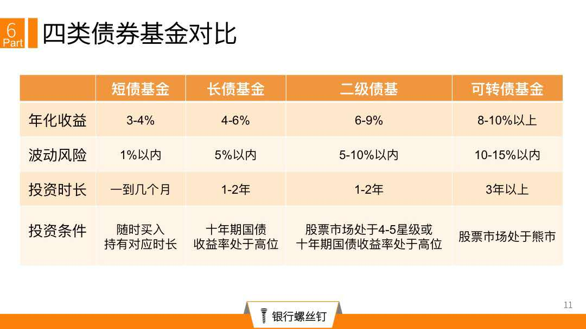
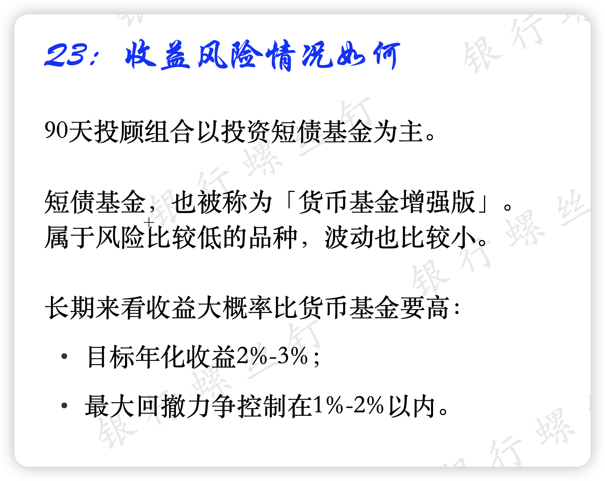
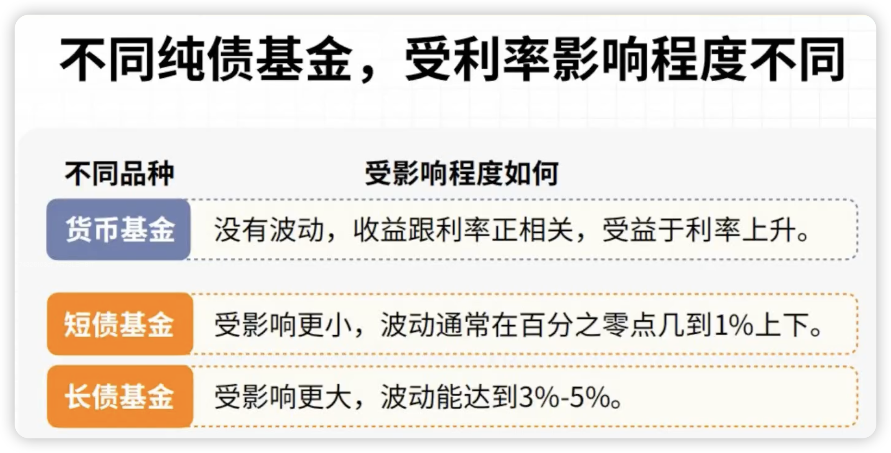
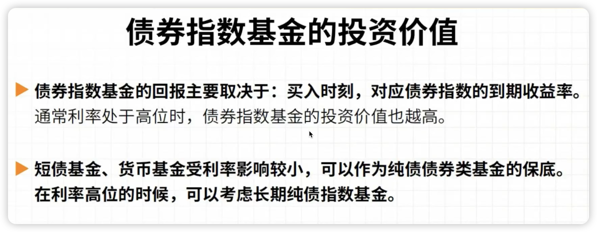

# 债券资产投资
## 债券类型固收资产
### 债券基础知识
通常利率上行阶段，是债券的熊市；利率下行阶段，是债券的牛市。因为利率=利息/市值；通常利息一段时间里不变，所以利率下降，往往对应债券市值上涨；反之利率上升，对应债券市值下跌。

**注意：可转债现在属于权益资产**

### 不同类别基金详细介绍

[如何估算钉钉宝365天组合收益](assets/债券资产投资/Untitled10.pdf)
[十五问十五答：螺丝钉银钉宝90天投顾组合](assets/债券资产投资/Untitled11.pdf)
[纯债基金上涨了,现在还能投资么?](assets/债券资产投资/Untitled12.pdf)
[债券基金的选择.pdf](assets/%25E5%2580%25BA%25E5%2588%25B8%25E5%259F%25BA%25E9%2587%2591%25E7%259A%2584%25E9%2580%2589%25E6%258B%25A9-%25E5%25B7%25B2%25E5%258E%258B%25E7%25BC%25A9.pdf)

## 具体产品或者策略参考
  - [久聪债券](https://danjuanfunds.com/ic/TIAA026004)
  - [纯债汉堡Plus](https://danjuanfunds.com/ic/TIAA004009)
  - [螺丝钉银钉宝365天投顾组合](https://mp.weixin.qq.com/s/lmEKev11InZ8xbEP4IisaA)
  - [螺丝钉银钉宝90天投顾组合](https://mp.weixin.qq.com/s/jQCNXQRgkWPjRdtTebQawQ)
  - [纯债汉堡](https://lc.jr.jd.com/finance/fund/fundinvest/detail/?fundUtmSource=65&fundUtmParam=resultsDetail&jrcontainer=h5&jrlogin=true&itemId=1003JDCRHB&utm_term=copyurl)
  - [玄奘安鑫](https://danjuanfunds.com/ic/TIAA026042)
  - [固若金汤](https://danjuanfunds.com/ic/TIAA026009)
  - [九维狐固收](https://danjuanfunds.com/ic/TIAA026020)
  - [积金至斗债基组合](https://danjuanfunds.com/ic/TIAA004010)
  - [永动机美元债券型](https://danjuanfunds.com/ic/TIAA026103)
  - [全球债券通](https://danjuanfunds.com/ic/TIAA003008)
  - [10月稳健投资品种，有哪些好选择？](https://mp.weixin.qq.com/s/ThW4abZt7JqDGrnJR4U6NQ)

## 纯债基金估值分析
### 有朋友问，纯债基金这几年收益比较好，现在估值如何？
纯债基金收益率跟什么有关系呢？
通常，债券基金收益跟几个因素有关：
**（1）期限**
越是长期债券，收益也会越高，波动也会越大。
这也容易理解，就像买理财，3年期的收益得比1年期的高，否则投资者就不会接受更长的持有时间。
**（2）安全性**
债券分为利率债和信用债。
• 利率债，是国债等安全性极高的债券。
• 信用债则是企业债、城投债等有一定违约风险的债券。
越是安全的债券，收益也会越低。
而有一定风险的债券，投资者也要求更高的回报才会考虑。
对我们普通投资者来说，掌握了股票基金等的投资知识，也没必要在债券资产上博高收益。
就像咱们投顾组合底层，如果投资债券基金，也是避免违约风险，以利率债为主。

### 参考利率
短债的收益率：可以查看 [中证短融指数](https://www.csindex.com.cn/#/indices/family/detail?indexCode=H11014) 的到期收益率(要持有一轮债券牛熊市)

## 相关链接
- [LPR_贷款市场报价利率 _LPR报价行名单_中国货币网](https://www.chinamoney.com.cn/chinese/lllpr/?ivk_sa=1024609w)
- [中国10年期国债收益率(GCNY10)_债券_新浪财经_新浪网](https://stock.finance.sina.com.cn/forex/globalbd/gcny10.html)
- [2022年4月稳健投资品种，有哪些好选择（新增债基地图）_微信文章](https://mp.weixin.qq.com/s/qNVR8QQvrxACXH5oLNBonw)