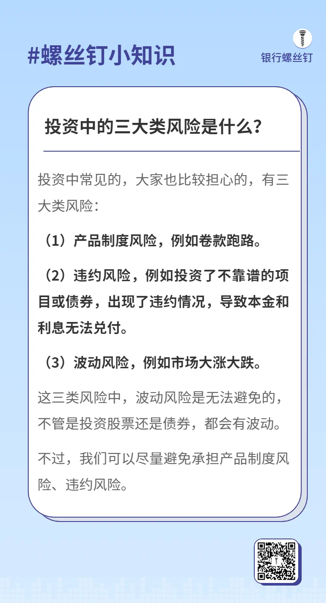

# 投资风险与收益
## 投资平台通常会将理财产品按照风险高低划分为不同的等级，常见的5种投资风险等级及其特点如下：
1、低风险（如保守型）：
- 特点：此类投资产品的安全性最高，资本损失的风险很小或几乎不存在，收益相对稳定但通常较低。
- 常见产品：银行存款、货币市场基金、国债。
- 适合人群：风险厌恶型投资者，注重资本保值和稳定收益。
2、中低风险（如谨慎性）：
- 特点：具有一定的安全性，可能会有少量的波动，但总体上仍然以保护本金为主，收益略高于低风险产品。
- 常见产品：债券型基金、优质企业债券、固定收益类理财产品。
- 适合人群：能够承受少量风险，希望在一定程度上保值并获得略高于低风险产品的回报。
3、中风险（如稳健型）：
- 特点：风险和收益之间取得较好的平衡，既有一定的增长潜力，也伴随着一定的波动性。投资者可能会面临部分本金损失的风险。
- 常见产品：混合型基金、股票型债券基金、结构化理财产品。
- 适合人群：愿意接受中等水平的风险，以追求中等水平回报的投资者。
4、中高风险（如积极型）：
- 特点：风险较高，可能有较大的价格波动，但回报也可能更高。投资者需要具备较强的风险承受能力。
- 常见产品：股票型基金、行业主题基金、部分P2P理财产品。
- 适合人群：愿意承担更大风险以追求更高回报的投资者，通常有较强的市场分析能力。
5、高风险（如进取型）：
- 特点：伴随着最高的收益潜力，但也有可能导致严重的资本损失或全损。此类投资产品的价格波动性非常大，风险极高。
- 常见产品：股票、期货、外汇、杠杆基金、私人股权投资。
- 适合人群：具备高风险承受能力的投资者，通常为专业投资者或愿意承担全部本金损失的个人。

## 将这五种风险等级对应成走路的快慢，可以用来形象化理解投资的风险与收益关系：
  1. **低风险**（慢走）：
  - 相当于慢慢走路，脚步稳健，几乎没有摔倒的风险。对应的是像货币基金、国债这种稳定、安全的投资。
  2. **较低风险**（小步快走）：
  - 步伐稍微加快，但仍然比较稳重。虽然速度变快了一点，但摔倒的几率依然很低。对应的是债券基金或银行理财产品。
  3. **中等风险**（正常走路）：
  - 正常的步速，既不过于慢也不过快。可能会遇到些小的障碍，但只要小心，摔倒的几率还是较低。对应于平衡型基金、混合型基金，既有稳健的成分，也有一些风险暴露。
  4. **较高风险**（慢跑）：
  - 开始慢跑，速度显著加快，虽然能更快到达目的地，但不小心可能会摔倒。对应的是股票型基金或部分个股。
  5. **高风险**（全速奔跑）：
  - 全力冲刺，速度极快，但非常容易失去平衡，摔倒的风险大大增加。对应高风险的股票、期货、外汇等高波动性资产。
这种类比可以帮助形象理解投资中的"风险与回报"平衡，就像走路时速度越快，失去平衡的可能性越大一样。

## 六大成熟的投资策略
这些策略，大多是历史上一些投资大师或机构，所采用的经典投资策略。
将这些策略的规则进行提炼，写得明确一些，就得到了策略指数。
策略指数丰富了投资的选项，满足了很多投资者个性化的需求。
例如红利指数基金很多就有高分红，有的投资者会冲着这个特点来投资。
经过多年沉淀，目前全球范围，比较公认的有6大策略：
- **红利策略**：挑选高股息率的股票。
- **价值策略**：挑选低市盈率、低市净率的股票。
- **成长策略**：挑选收入、盈利成长性高的股票。
- **质量策略**：挑选高ROE的股票，盈利能力较强。
- **低波动策略**：挑选波动率较低的股票。
- **龙头策略**：挑选行业龙头股票。

### 古文版投资风险承受能力
1. **保守投资**：所谓保守，就是稳坐其位，不轻举妄动。得则固守，不得则避其锋芒，积累安全垫后再做打算。
2. **谨慎投资**：所谓谨慎，就是观其势，待其时，方稳步而进。得则守，不得则退，常留余力，不轻冒风险。
3. **稳健投资**：所谓稳健，就是步步为营，审时度势。得则谨守，不急于贪多；不得则稳中求进，避险守拙，待机而动。
4. **积极投资**：所谓积极，就是步步为营，顺势而进。得则稳守，不得则调整策略，随时准备再次出击。
5. **进取投资**：所谓进取，就是未至其位，而跃起夺之。得则进，不得则蓄力再发。

### 投资中的三大类风险是什么(图片)

## 投资股市的理解
### 在长期投资中，如何培养信心
在长期投资中，培养信心是一个持续的过程，需要通过知识积累、实践经验和心理建设来实现。以下是一些具体的方法：
**1. 建立扎实的投资知识基础**
学习投资理论：阅读经典投资书籍，如《聪明的投资者》、《漫步华尔街》等，理解市场运作规律和长期投资的优势。
了解资产的基本面：研究你投资的公司、行业或基金的基本面，清楚它们的价值所在，增强对投资标的的信任。
掌握风险管理：学习如何分散投资、控制风险，避免因短期波动而丧失信心。
**2. 制定清晰的投资计划**
设定明确的目标：根据自己的财务状况和未来需求，设定长期目标（如退休储蓄、子女教育基金）。
坚持投资纪律：制定适合自己的投资策略（如定投、资产配置），并严格执行，避免因情绪波动而频繁调整。
**3. 关注长期，而非短期波动**
理解市场波动的正常性：市场短期的涨跌是常态，不必过于担忧。长期来看，优质资产的价值通常会增长。
避免频繁查看账户：过度关注短期表现可能导致不必要的焦虑，降低对投资的信心。
**4. 从历史数据中获得信心**
回顾市场历史：了解股票市场、房地产等资产在过去几十年的表现，发现即使经历了危机和下跌，市场最终仍会回升。
借鉴成功案例：学习长期投资者（如巴菲特）的经历，明白坚持的重要性。
**5. 保持良好的心态**
接受不确定性：投资本质上是与不确定性共舞，接受波动是长期投资的一部分。
培养逆向思维：当市场情绪低迷时，学会冷静思考，抓住机会，而不是随波逐流。
**6. 寻找支持和指导** 
加入投资社区：与志同道合的人交流经验，分享见解，相互鼓励。
寻求专业建议：咨询理财顾问或金融专家，获得专业指导。
**7. 坚持定投** 
定期定额投资（如指数基金定投）是培养信心的有效方法。它可以帮助你避免试图择时市场的焦虑，同时利用市场波动获得更低的平均成本。
**8. 记录和反思** 
记录投资历程：写下每次投资的理由、过程和结果，定期回顾，了解自己的进步。
总结经验教训：从成功和失败中学习，逐步优化投资策略，增强信心。
**9. 保持耐心**  
理解复利的力量：复利需要时间才能发挥作用，耐心等待是长期投资成功的关键。
专注于目标：时刻提醒自己为什么开始投资，把目光放在未来的收益上，而不是眼前的波动。
通过不断学习、实践和调整心态，你会逐渐建立对长期投资的信心，最终实现财富的稳步增长。
股票投资：不是技术的问题，是信心和信仰的问题，是价值观的问题。
**银行螺丝钉：攀比就像一场永无止境的战争，唯一的胜利者是那些选择不参与的人。用知足的态度来接受结果。**但行好事，莫问前程。投资也是如此，做好自己该做的事情，执行好每一笔定投，做好每一笔止盈。把钱花在刀刃上，对得起自己的努力。这就是富有的一生了。
A股本身有熊长牛短的特征。市场的大涨行情只发生在7%的时间里，其他93%的时间，就是下跌或者横盘震荡。
这种行情下，不必因为市场的下跌而焦虑，也不必因为市场的上涨而过度兴奋。
可以做理性的投资者，制定好自己的投资计划，并且坚定地按照计划进行投资。
股市里挥金如土，生活中缝缝补补。

### 如何坚持(93%时间持有，7% 的有行情)
[5星级持续，这次熊市是历史上最久的一次吗？](https://mp.weixin.qq.com/s/7Jx9pxuFjijw1qP-lpnyfw)
[熊市底部，哪些品种容易上涨呢？（精品课程）](https://mp.weixin.qq.com/s/WLzFEuVAjbKWZMocVwsziA)
手里的基金短期表现不好，该怎么办？
[https://mp.weixin.qq.com/s/nJg8fZKjVOUoDCsfs5aYRg](https://mp.weixin.qq.com/s/nJg8fZKjVOUoDCsfs5aYRg)
［4月26日］指数估值数据(会不会有6星级、7星级？）
[https://mp.weixin.qq.com/s/FJKZ7C9I-RPrCOL1JXZD0g](https://mp.weixin.qq.com/s/FJKZ7C9I-RPrCOL1JXZD0g)
股债性价比指标，该如何使用呢？
[https://mp.weixin.qq.com/s/OSMt77-fHc1_DoJvo2wIKA](https://mp.weixin.qq.com/s/OSMt77-fHc1_DoJvo2wIKA)
投资股票基金，如何获得更好的收益？（精品课程）
[https://mp.weixin.qq.com/s/R8i19OnKXLPsQR5B4ULiNg](https://mp.weixin.qq.com/s/R8i19OnKXLPsQR5B4ULiNg)
什么样的投顾组合，才算好呢？
[https://mp.weixin.qq.com/s/n3C2WIoG6fEnfjmXyq45mA](https://mp.weixin.qq.com/s/n3C2WIoG6fEnfjmXyq45mA)
熊市底部，坚持的底气在哪里？
[https://mp.weixin.qq.com/s/vSHjFtHNwUU3TD7tWedRBA](https://mp.weixin.qq.com/s/vSHjFtHNwUU3TD7tWedRBA)
买基金，要不要看估值呢？
[https://mp.weixin.qq.com/s/dl-3rpXXOlR-g9ijmwSIsQ](https://mp.weixin.qq.com/s/dl-3rpXXOlR-g9ijmwSIsQ)
只在5星级投资，收益会更好吗？
[https://mp.weixin.qq.com/s/222VUnHcUJFFS6H2rqcwUg](https://mp.weixin.qq.com/s/222VUnHcUJFFS6H2rqcwUg)

### 投资交易的本质是克服人性的弱点
投资交易的本质确实涉及到克服人性的弱点。成功的投资者往往能够意识到并努力克服这些弱点，以更理性和目标导向的方式进行投资。以下是投资交易如何帮助克服人性弱点的一些方式：
  1. **冷静和理性思考**: 投资交易要求投资者保持冷静和理性。他们需要在情绪波动和市场变化中保持镇定，避免贪婪和恐惧的影响，以客观的眼光评估投资机会。
  2. **长期观念**: 成功的投资者通常具有长期的投资观念，他们不会被短期波动和热点所影响，而是专注于长期的投资目标和价值发现。
  3. **严格的风险管理**: 投资交易中的风险管理至关重要。投资者需要设定合理的止损点和风险控制策略，以保护资金并避免过度风险暴露。
  4. **独立思考**: 成功的投资者能够进行独立思考，并不盲目跟随市场热点或他人的建议。他们会进行充分的研究和分析，形成自己的投资判断。
  5. **学习与适应**: 投资交易是一个不断学习和适应的过程。投资者需要不断提升自己的投资技能和知识水平，及时调整投资策略以适应不断变化的市场环境。
总的来说，投资交易可以帮助投资者意识到并克服人性的弱点，培养出更理性、纪律和目标导向的投资习惯，从而提高投资成功的概率。

### 对于股票投资来说，人性有那些弱点？
股票投资是一个涉及情绪和心态的领域，以下是人性在股票投资中常见的弱点：
1. **贪婪与恐惧**: 这两种情绪是股票市场中最普遍的驱动力之一。贪婪使人们追逐高收益，可能导致过度投资或者冒险行为；恐惧则可能让投资者在市场下跌时恐慌性抛售，错失良机或遭受损失。
2. **过度自信**: 有些投资者过度自信，认为自己可以预测市场走势或者击败市场。这种态度可能导致他们不够谨慎，过度交易或者忽视风险管理。
3. **跟风与赶潮流**: 很多投资者会受到他人行为的影响，特别是在社交媒体上。他们可能会盲目跟随别人的投资行为，而不做独立的研究和分析。
4. **短视和急功近利**: 许多投资者更关注短期收益，而忽视了长期投资的重要性。他们可能会追逐短期涨幅，而忽视了公司的基本面和长期前景。
5. **情绪化决策**: 在市场波动时，许多投资者会受到情绪的影响，做出不理智的决策。他们可能会因为恐慌而抛售股票，或者因为贪婪而追逐高风险的投资。
这些弱点使得投资者容易受到市场波动和情绪波动的影响，而忽视了长期投资规划和风险管理的重要性。

### 跑输市场
### 踏空
### 浮亏