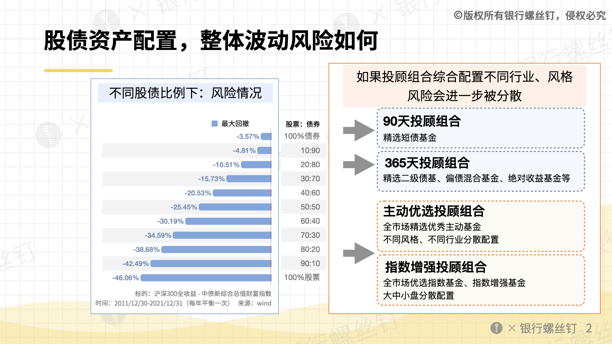
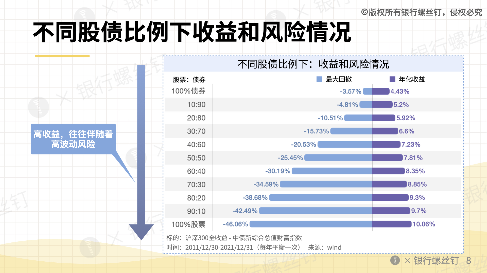
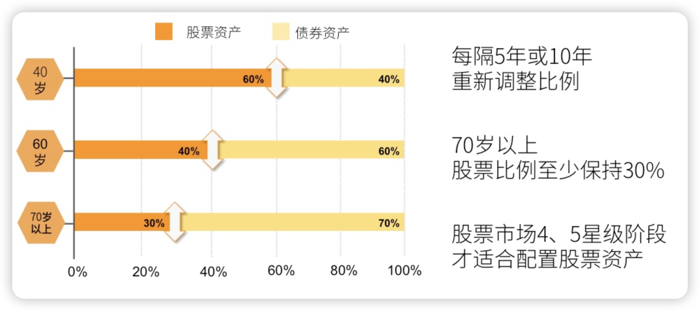
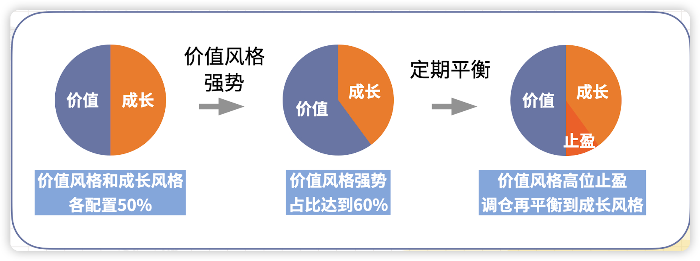
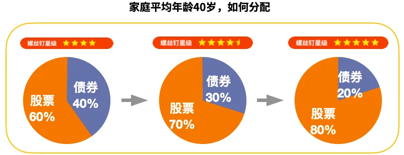

# 股债配置方案
## 不同股债资产配置的风险和收益(图片)

## 股票基金配置方案：分散配置+再平衡

只在 5 星级投资，分散不同风格定投到股票基金里，逐步达到上限。
主动优选：优选基金经理+风格轮动
基金经理：核心能力是选股能力，主要的选股。
基金投顾是一个投资策略，它要把这个策略执行好，并不是一个资管产品。
**踏空的痛苦大于浮亏的痛苦**
熊市跌得少，牛市跟得上。

## 股票资产配置
如果是已有的一笔闲钱，那就可以趁市场便宜的阶段，做好分散配置。
通常可以根据「100-年龄」的方式，来分配股票类资产和债券类资产：
**•  股票资产，可以配置「100-年龄」%的比例；**
**•  债券资产，可以配置「年龄」%的比例。**
其中股票资产，不是任何时候都适合配置。需要在市场进入到4星级-5星级阶段时，进行配置。
举个例子。比如40岁的朋友，当市场达到4星级时，可以配置好60%左右的股票资产。当市场达到4.5星级时，可以增加一部分股票资产比例。达到5星级时，可以再增加一部分比例。
像[主动优选投顾组合](https://mp.weixin.qq.com/s?__biz=MzAwNzQ5ODk3Nw==&mid=2651055699&idx=1&sn=cba9308bbfa9cae2df4b7b041625e775&token=318135502&lang=zh_CN&scene=21#wechat_redirect)、[指数增强投顾组合](https://mp.weixin.qq.com/s?__biz=MzAwNzQ5ODk3Nw==&mid=2651056339&idx=1&sn=f958b85fadc0952c007c2e9392e6ffe8&token=318135502&lang=zh_CN&scene=21#wechat_redirect)，都是属于股票资产，会分散配置一篮子优秀的主动基金、指数基金。
分散资产配置，就好比有一个强大的、全天候的队伍。可以帮助我们应对各种市场情况。

投顾组合也会自动调仓，省心省力，适合作为家庭资产配置的主力。
- 4-5星级配置股票基金100-年龄以上
- 3.×星级配置股票基金100-年龄以下

## 主动优先买入后是否需要止盈？
通常，到了3星级，会有一部分品种达到高估，可以考虑止盈。
（1）如果一两个品种到高估
投顾组合会止盈高估品种，加仓其他低估品种。
这个是投顾组合自动操作的，不需要投资者做什么，更加省心省力。
（2）如果整体到高估，例如到了2星级、1星级。
那可以对投顾组合整体做止盈。也可以考虑股票基金组合，切换为债券基金组合。
到时候螺丝钉也会有提示的。
[**4-5星优选：螺丝钉金钉宝主动优选投顾组合**](https://mp.weixin.qq.com/s/zcFmti4loDT7DSnx3FOH6Q)
[**直播回放：5星级到3星级，我们该如何投资呢？**](https://mp.weixin.qq.com/s/vSXCXq76UwS_XOiBrSUsfQ)
[影响基金长期风险的因素](assets/股债配置方案/Untitled.pdf)
[A股投资者结构分析](assets/股债配置方案/Untitled1.pdf)
[A股过去20年，经历的5轮⽜熊市](assets/股债配置方案/Untitled2.pdf)
[「股债房商」 家庭资产该如何分配](assets/股债配置方案/Untitled3.pdf)
[未来还会有3星级吗](assets/股债配置方案/Untitled4.pdf)