# 天津买房落户上学

## 基本情况

### 家庭情况
- **男方**：35岁，安卓工程师，月薪2万，户口吉林
- **女方**：34岁，幼师背景，目前全职带娃，计划孩子上幼儿园后求职
- **孩子**：3岁，尚未入学
- **现居**：南京，租房

### 核心诉求
1. 一家三口必须在一起生活
2. 孩子不能转学（要求从入学到高考在同一个城市）
3. 买房预算：总价65万以内
4. 需要在天津与南京之间选择一个城市：落户、买房、上学、高考

### 待决问题
- 选天津还是选南京？
- 65万预算如何在选定的城市实现买房落户？
- 夫妻双方就业、孩子入学如何落地？

---

## 买房流程

### 标准流程（2027年）
1. **委托中介**：分别签署买方/卖方版的《房地产经纪服务合同》
2. **办理网签**：三方共同完成《存量房屋买卖协议》的**网签备案**
3. **申请贷款**：买方与银行签署《银行贷款合同》
4. **资金监管**：签署《资金监管协议》，存入购房款
5. **缴税过户**：到不动产登记中心办理，最终取得新房本
6. **物业交割**：依据《房屋状况说明书》交接房屋、结清费用

### 贷款不成免责解除
**情况一：合同约定"贷款不成可免责解除"**

### 房地产经纪服务合同

在天津买房时，你（买方）需要与中介签订一份 **《房地产经纪服务合同》（俗称"中介合同"或"居间合同"）。** 这份合同确定了你和中介之间"委托-服务"的法律关系，其核心内容和关键点如下：

#### 📝 合同核心内容一览

| 条款板块 | 核心内容 | 你需要特别关注的风险点与细节 |
| --- | --- | --- |
| **1. 服务内容与期限** | • 明确中介为你提供的具体服务（如提供房源、带看、促成签约、协助贷款过户等） • 确定委托服务的起止期限 | • **是否独家委托**：如果合同中约定"**是**"，则在此期限内你不可委托其他中介或私下交易该套房，否则可能构成"跳单"违约 |
| **2. 佣金与费用** | • **佣金金额与计算方式**（例如，按房屋总价的百分比计算） • **支付时间与条件**（例如，签订买卖合同时付50%，过户完成时付50%） • 约定除佣金外是否还有其他费用 | • **支付条件**：必须明确佣金与交易进度挂钩，最好**分阶段支付**，避免提前支付所有费用 • **"跳单"后果**：明确若你利用中介信息后绕开中介直接与卖方成交，应承担的责任（通常是支付全额或部分佣金） |
| **3. 双方权利义务** | • **中介的义务**：如实报告房屋情况、提供真实信息、核实产权等 • **你的义务**：配合提供真实购房资料、及时做出决策等 | • **中介责任**：合同中应有条款明确，若中介**隐瞒重要事实或提供虚假情况**导致你受损，其应承担责任且无权收取佣金 |
| **4. 违约责任** | • 规定任何一方违约（如你逾期支付佣金、中介未尽职）的赔偿方式 | • 关注违约金是否合理 |
| **5. 合同终止** | • 约定在哪些情况下合同可以终止（如双方协商一致、交易成功等） | • 注意在独家委托下，你单方面提前终止合同可能需要承担一定责任 |

#### 💎 核心要点与行动建议

1. **理清合同关系**：作为买方，你只需签署买方版的《房地产经纪服务合同》。卖方会与中介签署另一份卖方版。最终，你们三方（你、卖方、中介）共同签署《房产买卖合同》。
2. **使用官方合同范本**：为保障权益，建议你主动要求使用天津本地的官方推荐合同文本。很多地区如唐山、铜陵都已发布更符合本地交易习惯的文本，天津也可能有类似版本。
3. **所有约定书面化**：对于中介承诺的任何额外服务（如保证办下贷款、赠送搬家服务等），务必要求写入合同的补充条款。

**总结**：这份合同的关键在于明确服务清单、敲定佣金支付节点、理解独家委托与"跳单"条款，并确认中介的尽职调查责任。

---

## 费用明细

### 2007年标准
- **满五唯一**
- 个税1%，契税1%，土地出让金1%，买家中介费1.5%
- 无燃气民水民电

### 当前标准
- 首付比例1.5成
- 商贷利率3.1%
- 买家中介费1.5%

---

---

## 学区房深度分析

详细分析请参考：[学区房深度分析](./学区房深度分析.md)

---

## 收益率计算

基于您提供的信息（15%的首付、4%的租金回报率、3%的贷款利率），我将一步步计算您的投资收益率。这里的"收益率"通常指**现金回报率（Cash-on-Cash Return）**，即年净现金流除以您的自有资金投入（首付）。

### 计算假设
- **租金回报率（4%）**：是年租金收入占房产总价值的比例（即 Gross Rental Yield）。公式为：年租金收入 = 房产总价值 × 4%。
- **贷款利率（3%）**：假设贷款为**只付利息贷款（Interest-Only Loan）**，即每年只支付利息，不偿还本金（这是简化计算的常见做法，因为您未提供贷款期限）。如果贷款是分期偿还（Amortizing Loan），需要更多信息（如贷款年限），结果会不同。
- **其他费用**：忽略税费、维护费、空置率等（实际投资中这些会影响净收益）。
- **房产总价值**：设为 \( P \)（任意值，收益率是比例，结果与 \( P \) 无关）。

### 计算步骤

1. **自有资金投入（首付）**：
   - 首付比例 = 15%
   - 首付金额 = \( 0.15P \)
2. **贷款金额**：
   - 贷款比例 = 100% - 15% = 85%
   - 贷款金额 = \( 0.85P \)
3. **年租金收入**：
   - 租金回报率 = 4%
   - 年租金收入 = \( P \times 0.04 = 0.04P \)
4. **年贷款利息支出**：
   - 贷款利率 = 3%
   - 年利息支出 = 贷款金额 × 利率 = \( 0.85P \times 0.03 = 0.0255P \)
5. **年净现金流（净收入）**：
   - 年净现金流 = 年租金收入 - 年利息支出 = \( 0.04P - 0.0255P = 0.0145P \)
6. **收益率（Cash-on-Cash Return）**：
   - 收益率 = （年净现金流 / 自有资金投入） × 100%
   - = \( \frac{0.0145P}{0.15P} \times 100\% = \frac{0.0145}{0.15} \times 100\% \)
   - 计算：\( 0.0145 \div 0.15 = 0.096667 \)
   - \( 0.096667 \times 100\% = 9.6667\% \)

### 结果
- **您的收益率约为 9.67%**（四舍五入到小数点后两位）。

### 重要说明
- **此计算是简化版**：实际投资中，需考虑本金偿还（如果是分期贷款）、税费、保险、维护费、空置率等，这些会降低净现金流和收益率。
- **敏感性分析**：
  - **位置影响**：如您之前讨论，位置是核心因素。如果位置好，租金上涨潜力大，收益率可能提高；反之，位置差可能导致空置率上升，降低收益。
  - **杠杆效应**：由于使用了贷款（杠杆），您的收益率（9.67%）高于租金回报率（4%），但杠杆也放大风险（如利率上升或租金下降）。
- **建议**：
  - 使用更精确计算器：尝试在线房地产计算器（如Zillow Mortgage Calculator），输入贷款年限、具体费用等。
  - 一般标准：在房地产投资中，现金回报率 > 8% 通常被视为较好，但需结合市场风险评估。
  - 咨询专业人士：在实际投资前，咨询财务顾问或房产经纪人，获取本地数据和详细模型。

---

## 全国范围

### 天津2024年10月16号最新购房贷款政策

[LPR_贷款市场报价利率 _LPR报价行名单_中国货币网](https://www.chinamoney.com.cn/chinese/lllpr/?ivk_sa=1024609w)

### 天津住房贷款政策

**2024年10月11号**

首套商业贷款利率是3.25，LPR减去60个基点，首付1.5成

#### 2024年5月29号

2024年5月29日起，天津市住房信贷政策有所调整：

1. **首付比例**：
   - 首套房：商业性个人住房贷款最低首付款比例不低于15％。
   - 二套房：商业性个人住房贷款最低首付款比例不低于25％。9月24日央行宣布统一首套房和二套房的房贷最低首付比例后，天津二套房贷款首付比例也将降至15%。

2. **贷款利率**：
   - **商业贷款**：取消天津市首套住房和二套住房商业性个人住房贷款利率政策下限，银行业金融机构结合本机构经营状况、客户风险状况等因素，合理确定每笔贷款的具体利率水平。目前天津首套房贷利率约为LPR减去60个基点，即3.25%左右；二套房贷利率约为LPR减去5个基点，约为3.8%。
   - **公积金贷款**：2024年5月18日之后（含当日）发放的个人住房公积金贷款，5年以下（含5年）和5年以上首套个人住房公积金贷款利率分别调整为2.35%和2.85%，5年以下（含5年）和5年以上第二套个人住房公积金贷款利率分别调整为2.775%和3.325%。

**2024年05月19日**

您好，我是链家地产置业顾问岳亮16600275752，之前您向我咨询过房子的事情。近期国家出台购房新政策，商贷购房首付：首套1.5成利率3.55%，二套2.5成利率4.15%，公积金首套2成利率2.85％，二套3成利率3.325％，且南开区出台6年一学位，转学需提前3年买房等政策！我们预测未来市场会出现重大变化，如果您有购房打算，根据您的现有情况清晰的为您规划购房方案，为您匹配更合适更优质房源！

**2024年03月14日**

政策下来了，公积金首套首付两成

**商业贷款利率**：
- 首套：首付2成，利率3.55%(LPR-40基点)
- 二套：首付3成，利率4.15%

**公积金贷款利率**：
- 首套：首付2成，利率3.1%
- 二套：首付3成，利率3.575%

#### 公积金贷款
- 首付 20%，贷款 20 年(二手房最多20 年，女性可以最多贷到 60 周岁)

[首付比例降了，一起来了解公积金贷款这些事！](https://mp.weixin.qq.com/s/94h-fO-TyzdLXqOdUF5aEw)

[天津购房贷款计算](天津买房落户上学/Untitled.xlsx)

[LPR_贷款市场报价利率 _LPR报价行名单_中国货币网](https://www.chinamoney.com.cn/chinese/lllpr/?ivk_sa=1024609w)

[中国10年期国债收益率(GCNY10)_债券_新浪财经_新浪网](https://stock.finance.sina.com.cn/forex/globalbd/gcny10.html)

[大调整！2024天津楼市最新政策！买房、贷款、落户，都变了！](https://mp.weixin.qq.com/s/NSMM6fm6ChFWOda5Sfdnlw)

---

## 买房投资收益率分析

### 买房投资的绝对收益率

以下是修正后的清晰公式及说明：

#### 绝对收益率公式

$$
\boxed{
\text{绝对收益率} = \frac{
\text{租金总收入} + \text{卖出净收入} - (\text{初始投资} + \text{贷款利息} + \text{运营成本})
}{\text{初始投资}} \times 100\%
}
$$

#### 变量说明

| 变量名 | 计算公式/说明 |
| --- | --- |
| **租金总收入** | \( R \times t \) （年租金 \( R \) × 持有时间 \( t \) 年） |
| **卖出净收入** | \( P \times (1+g)^t \times (1-s) - \text{剩余贷款余额} \)   • \( P \): 房价   • \( g \): 房产增值率   • \( s \): 卖房费用率 |
| **初始投资** | \( D + C \)   • \( D \): 首付   • \( C \): 购房税费、中介费等 |
| **贷款利息** | 根据还款计划计算的总利息（等额本息/等额本金） |
| **运营成本** | \( O \times t \) （年维护费 \( O \) × 持有时间 \( t \) 年） |

#### 计算示例

假设参数：

- 房价 \( P = 100 \) 万元
- 首付 \( D = 20 \) 万元
- 购房费用 \( C = 5 \) 万元
- 贷款利息总额 = 19.76 万元
- 租金总收入 \( 6 \times 5 = 30 \) 万元
- 运营成本 \( 2 \times 5 = 10 \) 万元
- 卖出净收入 = 36.13 万元

代入公式：
$$
\text{绝对收益率} = \frac{30 + 36.13 - (20+5 + 19.76 + 10)}{20+5} \times 100\% = \frac{11.37}{25} \times 100\% = 45.48\%
$$

#### 公式意义

该公式量化了杠杆购房的总收益，综合考量了：
1. **现金流收益**（租金）
2. **资产增值收益**（卖出净收入）
3. **成本项**（首付、利息、税费等）

适用于对比不同投资方案的绝对回报率。

### 房租的绝对收益率

在贷款买房的情况下，计算房租的绝对收益率通常需结合首付、租金收入和贷款成本。以下是分步计算说明：

#### 1. 定义绝对收益率

此处假设"绝对收益率"为 **现金回报率**，即年租金净收入（扣除贷款相关支出）占首付的比例。公式如下：

$$
\text{绝对收益率} = \frac{\text{年租金收入} - \text{年贷款利息支出}}{\text{首付金额}} \times 100\%
$$

（若忽略其他成本，如物业费、税费等）

#### 2. 计算步骤与示例

**假设参数**：

- 房价总额：100万元
- 首付比例：30%（即30万元）
- 贷款金额：70万元，年利率5%，贷款期限20年
- 年租金收入：6万元（月租5000元）

**步骤1：计算年贷款利息支出（简化）**
- 首年利息 ≈ 贷款本金 × 年利率 = 70万 × 5% = **3.5万元**

**步骤2：计算净租金收入**
- 净收入 = 年租金收入 - 年利息支出 = 6万 - 3.5万 = **2.5万元**

**步骤3：计算绝对收益率**
$$
\text{收益率} = \frac{2.5\text{万}}{30\text{万}} \times 100\% \approx 8.33\%
$$

#### 3. 注意事项

1. **本金偿还的影响**：
   若需考虑月供中的本金部分（如计算现金流回报率），需用 **租金收入 - 月供总额**，公式为：
   $$
   \text{收益率} = \frac{\text{年租金} - \text{年供款总额}}{\text{首付}} \times 100\%
   $$
   - 示例：月供约4619元（等额本息），年供款5.54万元，净现金流=6万 -5.54万=0.46万，收益率=0.46/30≈1.53%。

2. **杠杆效应**：贷款放大了收益率（如示例中的8.33% vs 无贷款时的毛收益率6%），但也增加了风险。

3. **其他成本**：实际中需扣除物业费、维修费、税费等，进一步降低净收益。

#### 4. 公式总结

- **毛租金收益率**（不考虑贷款）：
  $$
  \frac{\text{年租金}}{\text{房价总额}} \times 100\%
  $$

- **现金回报率**（考虑月供）：
  $$
  \frac{\text{年租金} - \text{年供款总额}}{\text{首付}} \times 100\%
  $$

- **净经营收益率**（仅扣利息）：
  $$
  \frac{\text{年租金} - \text{年利息支出}}{\text{首付}} \times 100\%
  $$

根据需求选择合适的计算方式，并明确假设条件。

### 卖出的绝对收益率

贷款买房的绝对收益率（仅考虑卖出时）计算步骤如下：

#### 计算公式

$$ \text{绝对收益率} = \frac{\text{卖出净收入} - \text{买入现金支出}}{\text{买入现金支出}} \times 100\% $$

#### 步骤说明

1. **买入现金支出**
   包括首付和购房相关费用（如契税、中介费等）：
   $$
   \text{买入现金支出} = \text{首付} + \text{购房费用}
   $$

2. **卖出净收入**
   卖出价扣除卖出费用和剩余贷款本金后的金额：
   $$
   \text{卖出净收入} = \text{卖出价} - \text{卖出费用} - \text{剩余贷款本金}
   $$

3. **利润计算**
   卖出净收入减去初始现金投入：
   $$
   \text{利润} = \text{卖出净收入} - \text{买入现金支出}
   $$

4. **绝对收益率**
   利润占初始现金投入的比例：
   $$
   \text{绝对收益率} = \frac{\text{利润}}{\text{买入现金支出}} \times 100\%
   $$

#### 示例计算

- **买入条件**
  - 房价：100万元
  - 首付30%：30万元
  - 贷款70万元（利率5%，20年等额本息）
  - 购房费用：契税1%（1万元）+ 中介费2万元 = 3万元
  - 买入现金支出：30 + 3 = **33万元**

- **卖出条件**
  - 持有5年后卖出，卖出价：120万元
  - 卖出费用：中介费1%（1.2万元）+ 税费1%（1.2万元） = **2.4万元**
  - 剩余贷款本金（5年后）：约60.2108万元

- **计算过程**
  1. 卖出净收入 = 120 - 2.4 - 60.2108 = **57.3892万元**
  2. 利润 = 57.3892 - 33 = **24.3892万元**
  3. 绝对收益率 = \( \frac{24.3892}{33} \times 100\% \approx 73.9\% \)

#### 关键点

- **剩余贷款本金**：需根据还款时间通过等额本息公式或贷款计算器精确计算。
- **费用包含**：买入时的契税、中介费；卖出时的税费、中介费。
- **不包含**：持有期间的月供利息，仅考虑初始现金投入与卖出净收入。

#### 最终公式

$$
\boxed{
\text{绝对收益率} = \left( \frac{\text{卖出价} - \text{卖出费用} - \text{剩余贷款本金} - \text{首付} - \text{购房费用}}{\text{首付} + \text{购房费用}} \right) \times 100\%
}
$$

---

## 天津地铁规划2027年版

---

## 中国高校统计

以下是中国**一本学校**、**211学校**和**985学校**的数量统计：

### 一本学校数量
- **数量**：全国范围内大约有 **500多所** 一本高校。
- 一本高校是指各省市在本科第一批次招生的高校，具体数量每年可能有所调整，因为一些省市逐渐合并了录取批次，例如只设"本科批"，不再单独划分一本和二本。
- 一本高校包括：**211高校、985高校** 和部分非211、985但教学质量较高的地方重点高校。

---

## 天津各区分析

### 天津河西区

#### 河西一片

**教学质量：**
- 小学如上海道小学、台湾路小学在全市知名，对应的初中（如新华中学、卓群中学）也有很强的综合实力。
- 初中阶段的升学率较高，很多学生能够考入市内重点高中。

**缺点：**
- **学区竞争激烈**：河西一片是传统的教育强区，学区房价格高，入学难度相对较大。
- **校舍资源有限**：一些学校位于老城区，场地和设施较其他片区（如梅江片区）稍显陈旧。

#### 河西二片

**教学质量：**
- 以优质教育均衡著称，小学和初中分布合理。
- 实验中学等初中学校教学质量高，部分学生考入市五所、重点高中的比例稳定。
- 师大二附小等学校师资力量雄厚，素质教育方面突出。

**缺点：**
- **发展潜力不足**：相比一片和三片，河西二片在整体资源和社会关注度上略逊一筹。
- **生源竞争相对中等**：部分家庭倾向选择一片的传统名校或三片的新兴学校。

#### 河西三片

**教学质量：**
- 以新兴优质资源为亮点，小学如天津师大附小、科技大附小，与对应的初中如北京师大天津附属中学、第四中学等配套完善。
- 梅江片区的学校硬件设施新，课程体系更加现代化，注重素质教育与科技创新。

**缺点：**
- **发展时间短**：三片内部分学校成立时间较短，积累的教育资源和历史沉淀相对不足。
- **优质学区房竞争加剧**：近年来三片成为热门学区，导致房价飙升，但部分学校尚未达到一片的教学口碑。

#### 综合对比

| 片区 | 教学优势 | 主要缺点 |
| --- | --- | --- |
| 河西一片 | 名校资源集中，升学率高 | 学区竞争激烈，设施稍显陈旧 |
| 河西二片 | 教育均衡，素质教育强 | 资源发展潜力不足 |
| 河西三片 | 新兴学校硬件好，发展快 | 教育积累有限，学区房竞争大 |

#### 结论
1. **追求传统名校与稳定升学率**：可选择河西一片。
2. **关注综合教育和均衡发展**：河西二片是适合的选择。
3. **倾向现代化教学与素质培养**：河西三片更具吸引力。

#### 河西重点小学家长群内部信息

总结：闽侯路小学教学质量保障性不太理想，相对23年房价二三十万！相对来说上海道小学更靠谱！

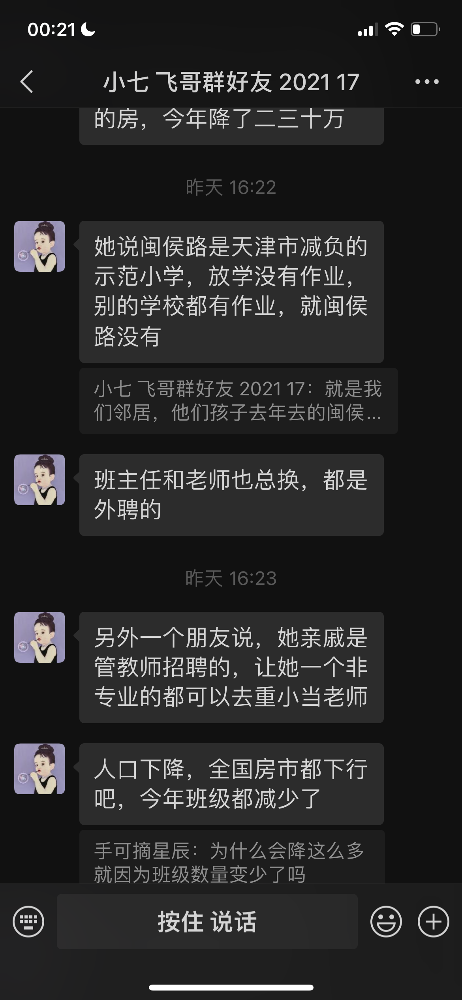

#### 河西区非学区房考虑

**一片区非学区房（混上好初中）**

群友：河西一片湘江道便宜！！！

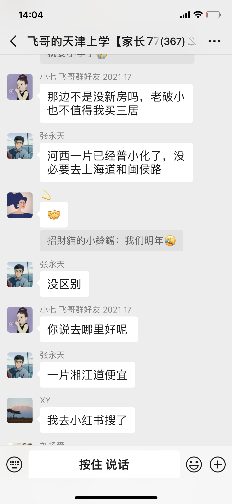

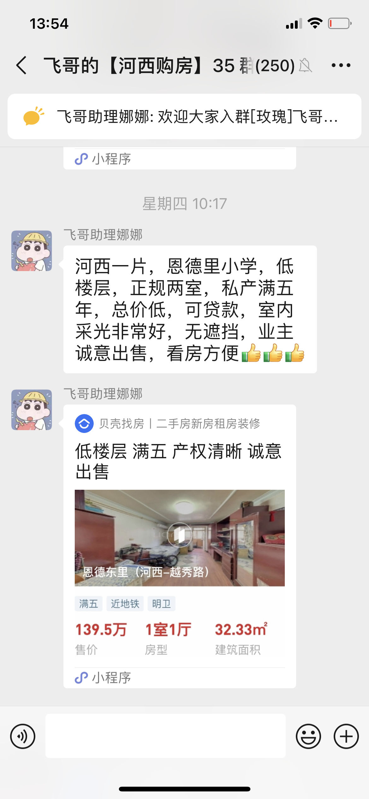

豆包参考》河西一片区相对较便宜的学校房源如下：

- **恩德里小学**：其对应的连荣里、红波里小区有总价130万左右的房子。如连荣里一套31平米南向6层顶层的房子，总价130万；红波里有35平米6层东向总价125万的房子，以及37.33平米南向6层总价130万的房子。
- **东楼小学**：对应的景兴西里小区，有南北通透的砖楼，也有东西向带外跨楼梯的房子，其中一套35平米西向6层的房子总价134万。
- **湘江道小学**：有一套1楼带院的房子，报价137万，该房两间居室均在阳面，还附赠小院，地段位于河西一片的市中心，距地铁1号线700米，距在建的地铁8号线100米。

**河西最最便宜（初中不理想）**

考虑因素：部分优质学校周边的房子价格较高，但如果考虑性价比，可以选择位置稍偏一些的房源，例如小海地附近。

小海地位于河西区东南部，属于河西区三片.对应的小学有：

- **天津职业技术师范大学附属珠江道小学**：始建于1981年，是小海地地区开办最早的学校之一，位于平江里21号，为全日制公办小学，现有29个教学班，学校坚持"为学生成功铺路，为教师发展奠基"的办学理念。
- **陵水道小学**：位于泰山里34号，是一所公立小学，现有26个教学班，学生940余人，该校实行对口直升，对应中学有双水道中学、微山路中学、枫林路中学、天津市第四十二中学、北师大天津附中、天津市第四中学。
- **天津师范大学第二附属小学**：绿水道校区位于小海地捂水道与枫林路交口，紧挨着地铁6号线梅林路站，其师资力量雄厚，教学质量高，是小海地地区认可度较高的小学。
- **天津财经大学附属小学**：坐落在河西区三片小海地附近，注重学生综合素质培养，开展多样化社团活动，如书法、绘画、音乐等，丰富学生课余生活，提升综合素养。

#### 河西初中学校排名

**飞哥群友总结**

河西的一片儿的初中整体来讲是挺好的，除了和平区，也就就是河西一片儿。

1. **新华**：每年都是区第一
2. **海河**：海河原来是是个重点中学。
3. **卓群和田家炳**：2023年的初中成绩，田家炳是整个河西第二，卓群是第四。
4. **2022年又转过两个民私立学校，转成了公办**：一个叫觉民，一个叫卓越。这两个学校更好。现在归到河西一片儿，你那一算都是好学校。

从这个整体升学情况来讲的话，肯定是河西一片儿最好（除和平以外）。

**AI搜集总结**

以下是天津市河西区初中学校的排名，并在学校后备注其所在片区：

1. **新华中学**（第一片区）
2. **实验中学**（第二片区）
3. **海河中学**（第一片区）
4. **第四十一中学**（第二片区）
5. **第四中学**（第三片区）
6. **第四十二中学**（第三片区）
7. **卓群中学**（第一片区）
8. **田家炳中学**（第一片区）
9. **卓越中学**（第一片区）
10. **觉民中学**（第一片区）
11. **环湖中学**（第二片区）
12. **滨湖中学**（第二片区）
13. **梅江中学**（第二片区）
14. **梧桐中学**（第二片区）
15. **微山路中学**（第三片区）
16. **双水道中学**（第三片区）
17. **北京师范大学天津附属中学**（第三片区）
18. **华宁中学**（未明确具体片区）
19. **自立中学**（未明确具体片区）
20. **培杰中学**（未明确具体片区）
21. **津海中学**（未明确具体片区）
22. **佟楼中学**（未明确具体片区）
23. **梅江西中学**（未明确具体片区）

#### 河西区所有初中名单

**第一片区：**
1. **新华中学**（市五所之一）
2. **海河中学**（市重点）
3. **卓群中学**
4. **田家炳中学**
5. **觉民中学**
6. **卓越中学**

**第二片区：**
1. **实验中学**（市五所之一）
2. **第四十一中学**（市重点）
3. **梧桐中学**
4. **梅江中学**
5. **滨湖中学**
6. **环湖中学**

**第三片区：**
1. **第四中学**（市重点）
2. **第四十二中学**（市重点）
3. **北京师范大学天津附属中学**
4. **微山路中学**
5. **枫林路中学**
6. **双水道中学**
7. **第二新华中学**
8. **景海道中学**
9. **学苑中学**

请注意，以上排名主要参考了学校的教学质量和升学情况，具体排名可能因年份和评估标准而有所变化。

#### 河西五年房价变化

#### 河西五年房租变化

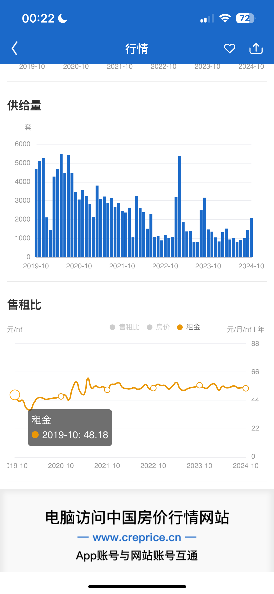

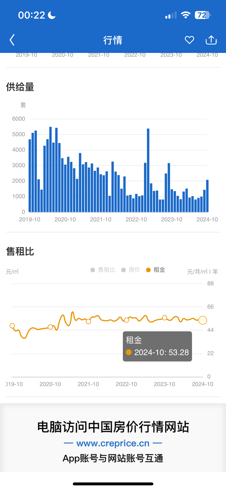

#### 河西五年租售比

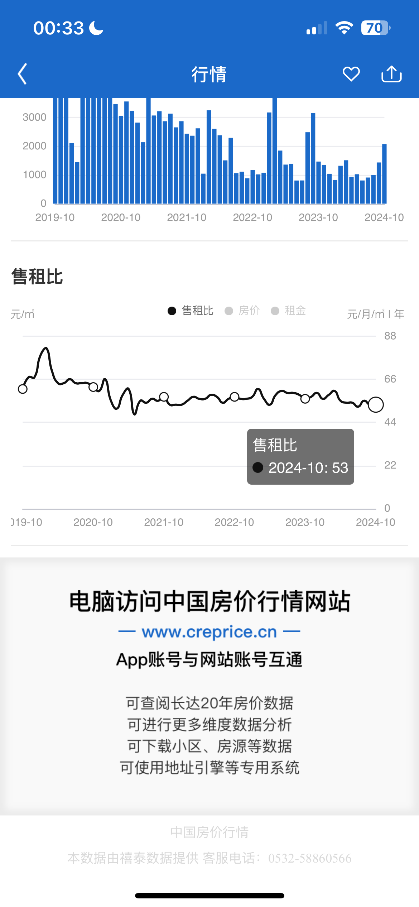

---

### 天津南开区

#### 南开区的重点小学主要有以下几所

**1. 中营小学(北片)：**
- **地址**：天津南开区中营前街2号。
- **优势**：该校于1905年（清光绪31年）开始筹建，1906年3月5日建成，是天津最早的官办小学，历史悠久。学校坚持"勤朴敏健"的校风，"严谨善导"的教风和"勤学多思"的学风，教学质量高，师资力量雄厚，在南开区乃至天津市都有较高的声誉，也是众多家长心目中的优质学校。

**2. 五马路小学(北片)：**
- **地址**：有多个校区，分布在不同位置。
- **优势**：始建于1956年，是南开区的老牌重点小学。学校实施素质教育，管理理念先进、教育特色鲜明。学校拥有多个校区，多次面向全国、市、区做教学专题展示，为高一级重点中学输送了大批优秀学生。其教学质量和口碑在南开区都非常不错。

**3. 南开中心小学(北片)：**
- **地址**：天津南开区双峰道40号。
- **优势**：前身是著名教育家张伯苓先生创办的南开学校小学部，解放后成为南开四马路小学，进入21世纪更为现名。它坐落在南开区中心地带，是天津市九年义务教育示范校，拥有深厚的文化底蕴和优质的教育资源。

#### 南开区的房源

[颂禹里-五马路小学](https://tj.ke.com/xiaoqu/1211045186898/?fb_query_id=904177780513460224)

#### 南开五年房价变化

#### 南开五年房租变化

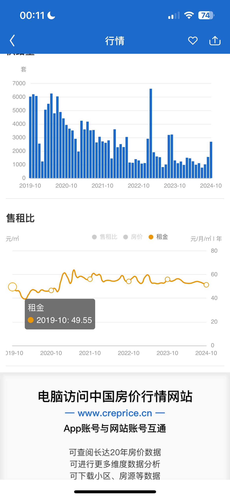

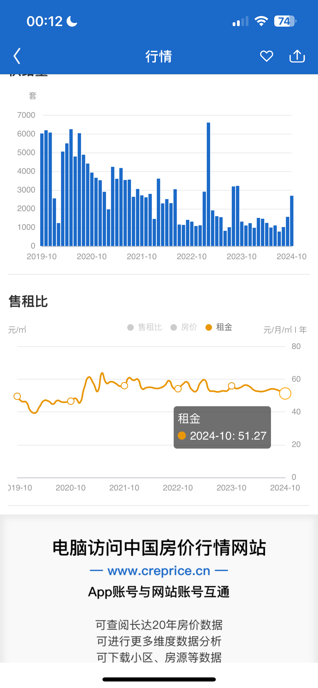

#### 南开五年租售比

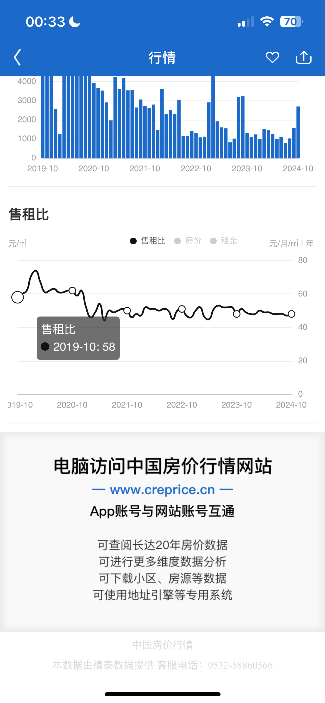

---

## 天津上学政策

[河东区教育局](https://www.tjhd.gov.cn/zwgk/zcwj/bdwwj/qjyj1/)

[河西区教育局](https://www.tjhx.gov.cn/hxjyj/index.html)

[南开区教育局](https://www.tjnk.gov.cn/NKQZF/ZWGK5712/zfxxgkqwbj/qjyj1/fdzdgknr17/zdmsxx17/jy17/index.html)

[招考资讯网](http://www.zhaokao.net/?webview_progress_bar=1&show_loading=0)

[**关于调整河东区小学转学和入学政策的通知**](https://www.tjhd.gov.cn/zwgk/zcwj/bdwwj/qjyj1/202411/t20241112_6777578.html)

**2025年天津市居住证持有人随迁子女申请在本区小学入学的通告，咨询电话：中小学教育科  022-84110241、022-24140672**

# [**河东区关于《2025年天津市居住证持有人随迁子女申请在本区小学入学》的通告**](https://mp.weixin.qq.com/s/jbEkIhba21XySnk_wGVYgA)

---

## 河东区范围

### 2024年河东内各校中考成绩/五所升学率/升学率

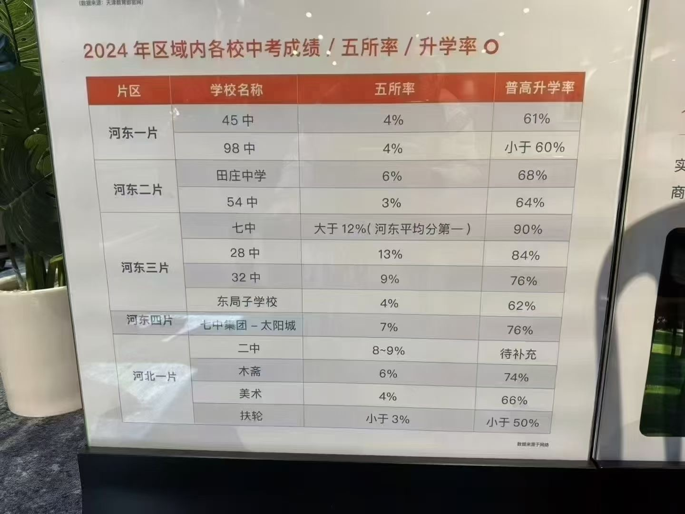

### 河东区比较好的学片是第三学片

**主要原因如下：**

1. **初中资源优质**：
   - **天津市第七中学**：是天津市九所重点中学之一，教学质量和师资力量都非常雄厚，在河东区乃至天津市都有较高的声誉，每年的中考成绩表现突出，为学生提供了良好的升学途径和发展平台。
   - **天津市第二十八中学**：该校新校区近几年成绩不断上升，属于黑马级别的学校。学校在教学管理、课程设置等方面不断改进和创新，为学生的学习和成长创造了良好的条件。
   - **天津市第三十二中学**：是有着70多年历史的老牌重点校，教学经验丰富，拥有一批教学水平较高的教师队伍，在教育教学方面有着深厚的积淀。

2. **小学实力不错**：该学片内的小学能为初中提供优质生源。例如，河东区实验小学是河东区公认的比较好的小学，在教学质量、师资队伍、学校管理等方面都有出色的表现；第二实验小学、前程小学等学校的整体教学质量也不错，为学生的小学阶段学习打下了坚实的基础。

不过，河东区的其他学片也有各自的优势和特点。比如第二学片位于大王庄和大直沽板块，与河西区和平区相邻，地理位置较好，且有天津市重点的第五十四中学以及排名较为靠前的第一中心小学。第四学片有在河东区公立校中排名靠前的第一〇二中学。所以选择学片时，还需要根据家庭的实际情况和孩子的特点进行综合考虑。

### 选中的房子

#### 候选小区

- [东惠家园](https://tj.ke.com/xiaoqu/1211045426281/?fb_query_id=824304200091381760)
- [松风东里](https://tj.ke.com/xiaoqu/1211045591367/?fb_query_id=801179891466153984)
- [松风西里](https://tj.ke.com/xiaoqu/1211045592451/?fb_query_id=824304740929347584)
- [芳和嘉园](https://tj.ke.com/xiaoqu/12000000039097/?fb_query_id=824305404284092416)

**松风东里小区**：
- **优势**：价格便宜，离地铁站近，交通配套齐全
- **缺点**：房龄比较老，1988 年的

时间：2024年 1 月 24 日

- 中介 1.5%
- 过户费：3%，2%
- 25平
- 50 平米以下，都是企业产
- 万新村，二号桥
- 靠近人流区：肯德基，麦当劳，工商银行

[天津市河东区程林里55-7-501-504 - 司法拍卖 - 阿里资产](天津买房落户上学/天津市河东区程林里55-7-501-504 - 司法拍卖 - 阿里资产 1e37d10b14c4814da048cb6d01bed860.md)

#### 河东区(2024年10月18日)

- [凤岐里(5套)](https://tj.ziroom.com/z/z2/?qwd=凤岐里)
- [友爱南里(4套)](https://tj.ziroom.com/xiaoqu/1211045892521.html)
- [松风东里(5套)](https://tj.ziroom.com/xiaoqu/1211045591367.html)
- [凤岐里(4套)](https://tj.ziroom.com/xiaoqu/1211045568507.html)
- [程林里小区(2套)](https://tj.ziroom.com/xiaoqu/1211045537902.html)
- [互助南里(5套)](https://tj.ziroom.com/xiaoqu/1211045877500.html)
- [春华里(7套)](https://tj.ziroom.com/xiaoqu/1211045459784.html)
- [月光园(6套)](https://tj.ziroom.com/xiaoqu/1211045504537.html)

---

## 成长投资

### 价值投资：当前房贷利率3%，租售比33年；天津站，附近的房子

#### 月光园

[月光园](https://tj.ke.com/xiaoqu/1211045504537/?fb_query_id=903426400185769985)

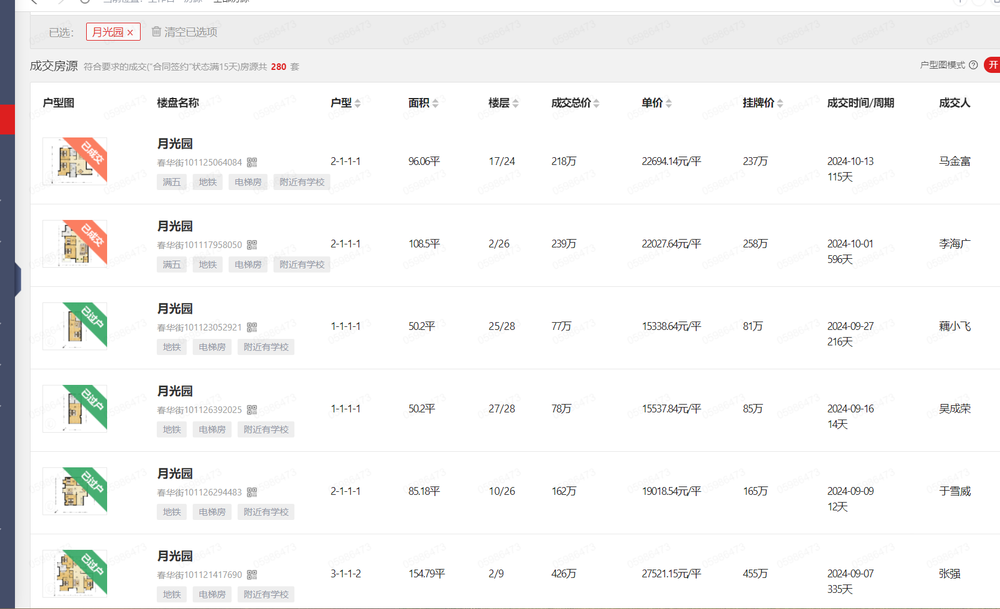

#### 巨福公寓

[巨福园公寓](https://tj.ke.com/xiaoqu/1211099955490/?fb_query_id=903427014509154304)

- 52平总价：70万
- 租金：2000-2500
- 租金回报率：3.42%-4.28%

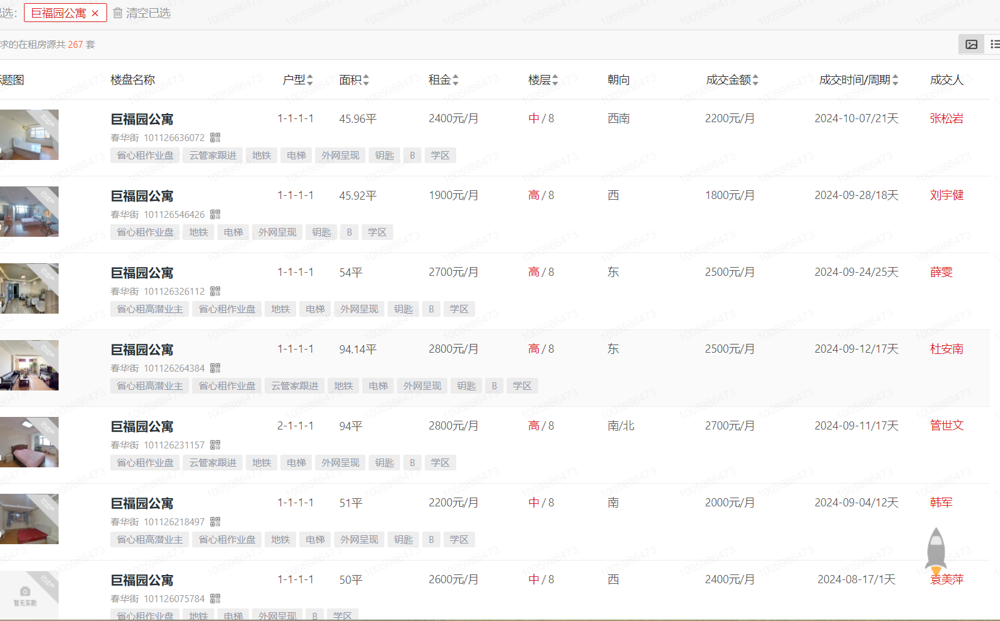

是这样的，94平的这个呀，他是这个业主跟这个客户有这个生意上的往来。正常来讲，这套房子应该租到三千。差不多，然后因为他们俩认识，所以就以这个价格租啦。然后，您说的上面54平的那个，其实他的成交价大概应该就是在2200。这不，他这套房子装修应该是挺好的。我看了一下，装修特别好，所以他这个租金稍微提了一些。其实正常的应该是两千两千、2100、2200这样。

### 河东五年房价变化

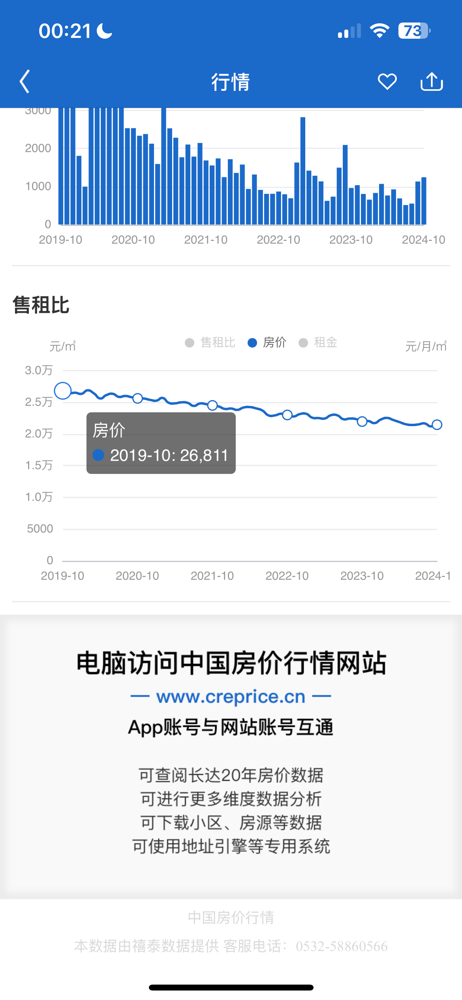

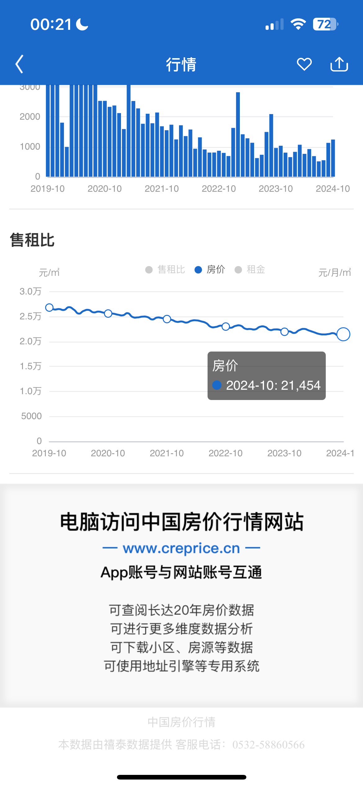

### 河东五年房租变化

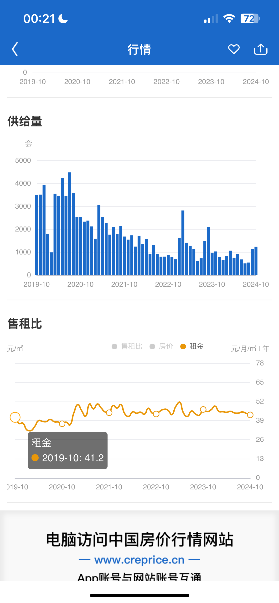

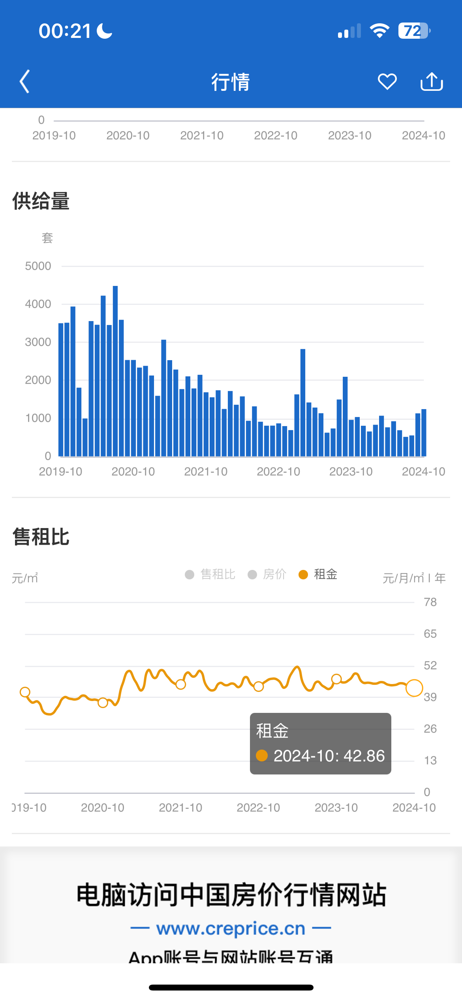

### 河东五年租售比

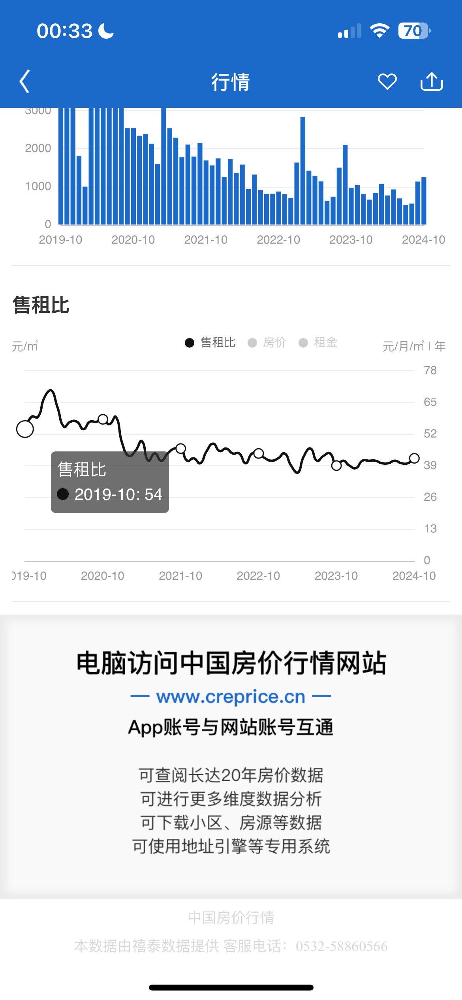

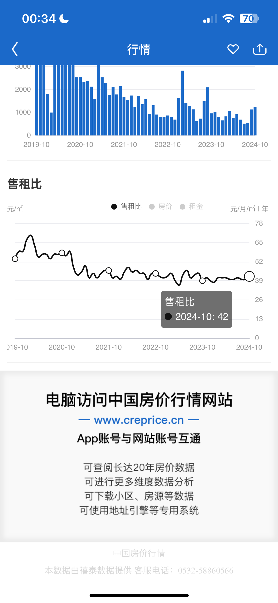

### 朋友的房产参考

- **张利顺**：2016年6月买入，北京-城建万科城，面积92平，单价23600元/平，总价215万-首付95万，贷款120万-月供4921元-年限25年
- **魏国华**：2015年买入，公主岭-政法新城，面积XX平，单价3100元/平，总价30万-首付8万，贷款18万-月供1418元-年限15年
- **李广**：
  - 2016年6月买入，长春-胶合板宿舍，面积62平，单价6000元/平，总价38万-首付18万，贷款20万-月供1300元-年限20年
  - 2022年卖出，长春-胶合板宿舍，面积62平，价格37万
- **刘梓桐**：
  - 2016年买入，长春-恒大首府，面积86平，单价8000/平，总价74万-首付45万，贷款30万-月供1260元-年限30年
  - 2021年卖出，长春-恒大首府，面积62平，价格75.8万
