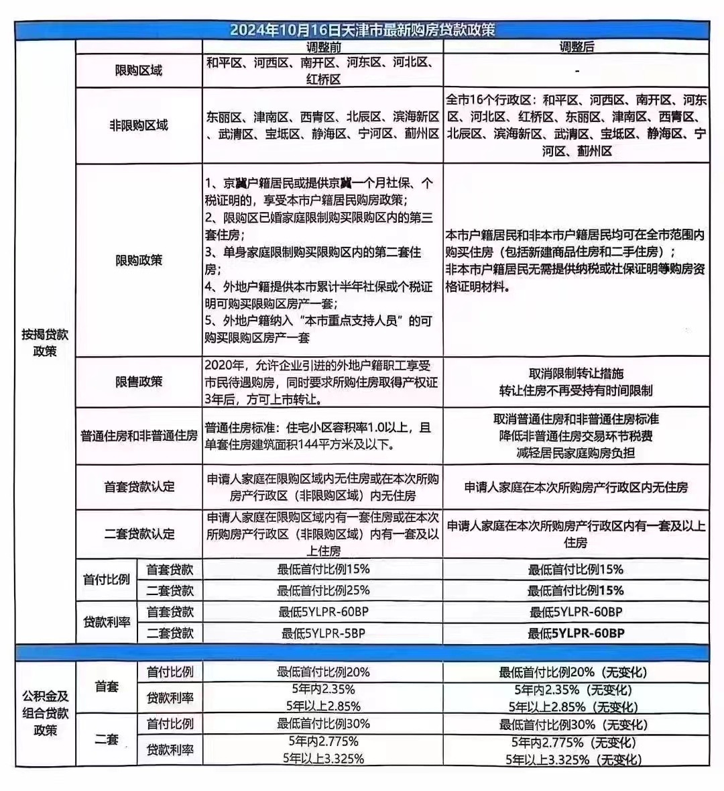
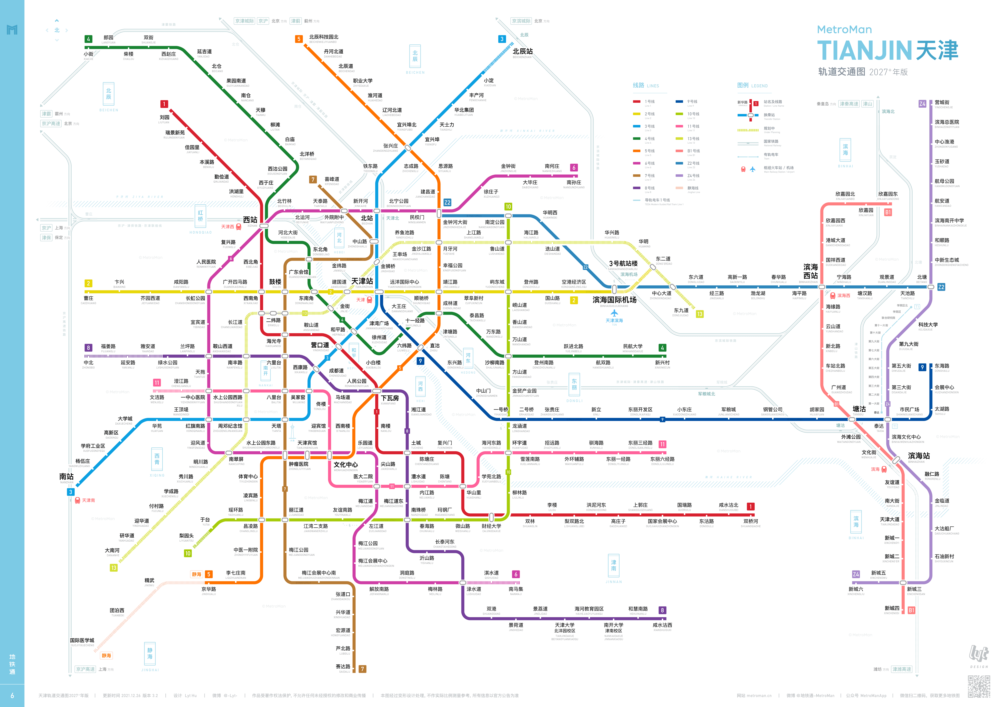
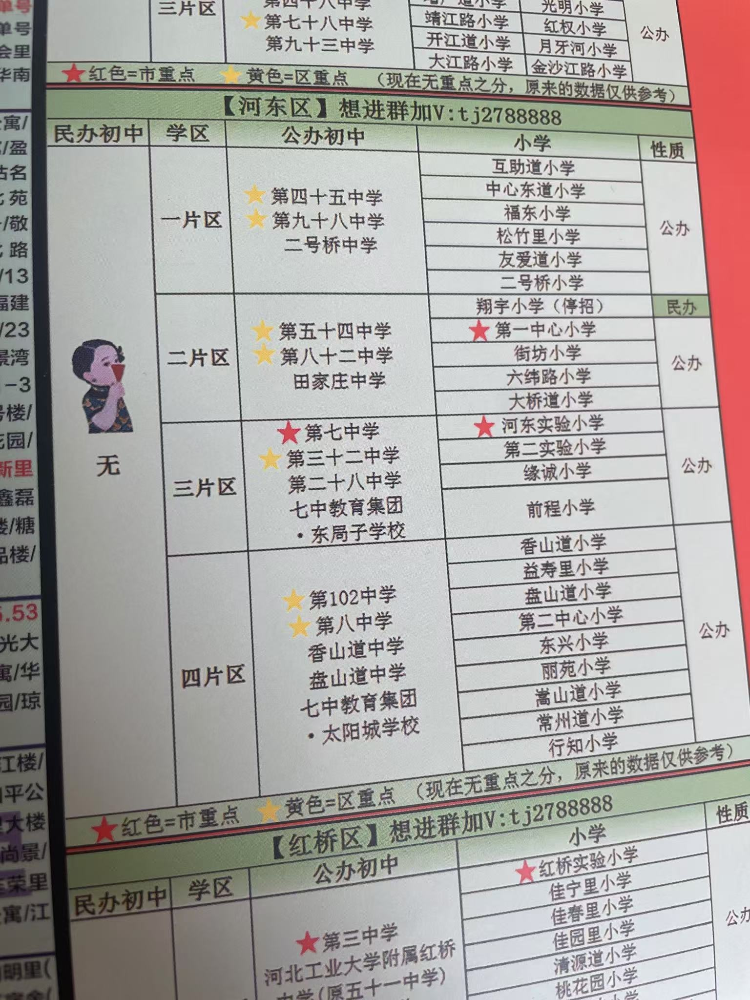
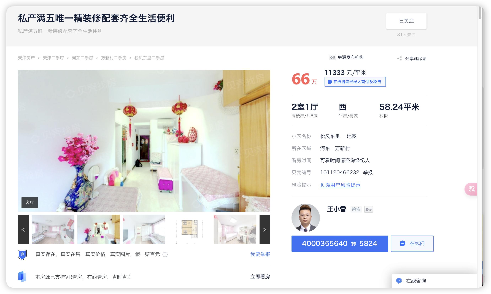
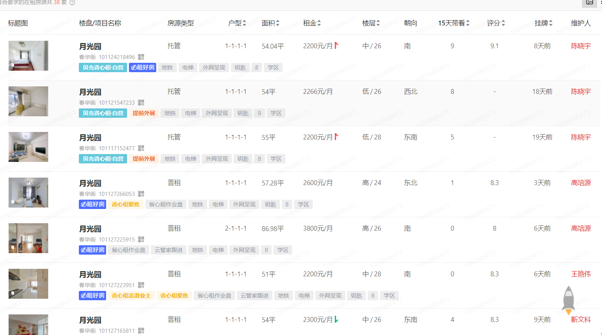
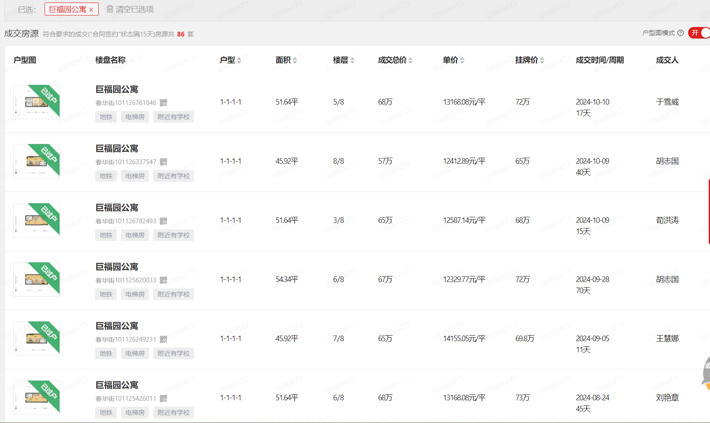

# 天津买房落户上学

## 基本情况

### 待决问题
- 选天津还是选南京？
- 65万预算如何在选定的城市实现买房落户？
- 夫妻双方就业、孩子入学如何落地？

---

## 买房流程

详细流程请参考：[买房流程](./买房流程.md)

---

## 费用明细

### 2007年标准
- **满五唯一**
- 个税1%，契税1%，土地出让金1%，买家中介费1.5%
- 无燃气民水民电

### 当前标准
- 首付比例1.5成
- 商贷利率3.1%
- 买家中介费1.5%

---

---

## 学区房深度分析

详细分析请参考：[学区房深度分析](./学区房深度分析.md)

---

## 全国范围

### 天津2024年10月16号最新购房贷款政策

[LPR_贷款市场报价利率 _LPR报价行名单_中国货币网](https://www.chinamoney.com.cn/chinese/lllpr/?ivk_sa=1024609w)

### 天津住房贷款政策

**2024年10月11号**

首套商业贷款利率是3.25，LPR减去60个基点，首付1.5成

#### 2024年5月29号

2024年5月29日起，天津市住房信贷政策有所调整：

1. **首付比例**：
   - 首套房：商业性个人住房贷款最低首付款比例不低于15％。
   - 二套房：商业性个人住房贷款最低首付款比例不低于25％。9月24日央行宣布统一首套房和二套房的房贷最低首付比例后，天津二套房贷款首付比例也将降至15%。

2. **贷款利率**：
   - **商业贷款**：取消天津市首套住房和二套住房商业性个人住房贷款利率政策下限，银行业金融机构结合本机构经营状况、客户风险状况等因素，合理确定每笔贷款的具体利率水平。目前天津首套房贷利率约为LPR减去60个基点，即3.25%左右；二套房贷利率约为LPR减去5个基点，约为3.8%。
   - **公积金贷款**：2024年5月18日之后（含当日）发放的个人住房公积金贷款，5年以下（含5年）和5年以上首套个人住房公积金贷款利率分别调整为2.35%和2.85%，5年以下（含5年）和5年以上第二套个人住房公积金贷款利率分别调整为2.775%和3.325%。

**2024年05月19日**

您好，我是链家地产置业顾问岳亮16600275752，之前您向我咨询过房子的事情。近期国家出台购房新政策，商贷购房首付：首套1.5成利率3.55%，二套2.5成利率4.15%，公积金首套2成利率2.85％，二套3成利率3.325％，且南开区出台6年一学位，转学需提前3年买房等政策！我们预测未来市场会出现重大变化，如果您有购房打算，根据您的现有情况清晰的为您规划购房方案，为您匹配更合适更优质房源！

**2024年03月14日**

政策下来了，公积金首套首付两成

**商业贷款利率**：
- 首套：首付2成，利率3.55%(LPR-40基点)
- 二套：首付3成，利率4.15%

**公积金贷款利率**：
- 首套：首付2成，利率3.1%
- 二套：首付3成，利率3.575%

#### 公积金贷款
- 首付 20%，贷款 20 年(二手房最多20 年，女性可以最多贷到 60 周岁)

[首付比例降了，一起来了解公积金贷款这些事！](https://mp.weixin.qq.com/s/94h-fO-TyzdLXqOdUF5aEw)

[天津购房贷款计算](天津买房落户上学/Untitled.xlsx)

[LPR_贷款市场报价利率 _LPR报价行名单_中国货币网](https://www.chinamoney.com.cn/chinese/lllpr/?ivk_sa=1024609w)

[中国10年期国债收益率(GCNY10)_债券_新浪财经_新浪网](https://stock.finance.sina.com.cn/forex/globalbd/gcny10.html)

[大调整！2024天津楼市最新政策！买房、贷款、落户，都变了！](https://mp.weixin.qq.com/s/NSMM6fm6ChFWOda5Sfdnlw)

---

## 买房投资收益率分析

详细分析请参考：[买房投资收益率分析](./买房投资收益率分析.md)（包含简化计算示例和完整公式分析）

---

## 天津地铁规划2027年版

---

## 中国高校统计

以下是中国**一本学校**、**211学校**和**985学校**的数量统计：

### 一本学校数量
- **数量**：全国范围内大约有 **500多所** 一本高校。
- 一本高校是指各省市在本科第一批次招生的高校，具体数量每年可能有所调整，因为一些省市逐渐合并了录取批次，例如只设"本科批"，不再单独划分一本和二本。
- 一本高校包括：**211高校、985高校** 和部分非211、985但教学质量较高的地方重点高校。

---

## 天津各区分析

详细分析请参考：[天津各区分析](./天津各区分析.md)

---

## 天津上学政策

[河东区教育局](https://www.tjhd.gov.cn/zwgk/zcwj/bdwwj/qjyj1/)

[河西区教育局](https://www.tjhx.gov.cn/hxjyj/index.html)

[南开区教育局](https://www.tjnk.gov.cn/NKQZF/ZWGK5712/zfxxgkqwbj/qjyj1/fdzdgknr17/zdmsxx17/jy17/index.html)

[招考资讯网](http://www.zhaokao.net/?webview_progress_bar=1&show_loading=0)

[**关于调整河东区小学转学和入学政策的通知**](https://www.tjhd.gov.cn/zwgk/zcwj/bdwwj/qjyj1/202411/t20241112_6777578.html)

**2025年天津市居住证持有人随迁子女申请在本区小学入学的通告，咨询电话：中小学教育科  022-84110241、022-24140672**

# [河东区关于《2025年天津市居住证持有人随迁子女申请在本区小学入学》的通告](https://mp.weixin.qq.com/s/jbEkIhba21XySnk_wGVYgA)

---

## 河东区范围

### 2024年河东内各校中考成绩/五所升学率/升学率

### 河东区比较好的学片是第三学片

**主要原因如下：**

1. **初中资源优质**：
   - **天津市第七中学**：是天津市九所重点中学之一，教学质量和师资力量都非常雄厚，在河东区乃至天津市都有较高的声誉，每年的中考成绩表现突出，为学生提供了良好的升学途径和发展平台。
   - **天津市第二十八中学**：该校新校区近几年成绩不断上升，属于黑马级别的学校。学校在教学管理、课程设置等方面不断改进和创新，为学生的学习和成长创造了良好的条件。
   - **天津市第三十二中学**：是有着70多年历史的老牌重点校，教学经验丰富，拥有一批教学水平较高的教师队伍，在教育教学方面有着深厚的积淀。

2. **小学实力不错**：该学片内的小学能为初中提供优质生源。例如，河东区实验小学是河东区公认的比较好的小学，在教学质量、师资队伍、学校管理等方面都有出色的表现；第二实验小学、前程小学等学校的整体教学质量也不错，为学生的小学阶段学习打下了坚实的基础。

不过，河东区的其他学片也有各自的优势和特点。比如第二学片位于大王庄和大直沽板块，与河西区和平区相邻，地理位置较好，且有天津市重点的第五十四中学以及排名较为靠前的第一中心小学。第四学片有在河东区公立校中排名靠前的第一〇二中学。所以选择学片时，还需要根据家庭的实际情况和孩子的特点进行综合考虑。

### 选中的房子

#### 候选小区

- [东惠家园](https://tj.ke.com/xiaoqu/1211045426281/?fb_query_id=824304200091381760)
- [松风东里](https://tj.ke.com/xiaoqu/1211045591367/?fb_query_id=801179891466153984)
- [松风西里](https://tj.ke.com/xiaoqu/1211045592451/?fb_query_id=824304740929347584)
- [芳和嘉园](https://tj.ke.com/xiaoqu/12000000039097/?fb_query_id=824305404284092416)

**松风东里小区**：
- **优势**：价格便宜，离地铁站近，交通配套齐全
- **缺点**：房龄比较老，1988 年的

时间：2024年 1 月 24 日

- 中介 1.5%
- 过户费：3%，2%
- 25平
- 50 平米以下，都是企业产
- 万新村，二号桥
- 靠近人流区：肯德基，麦当劳，工商银行

[天津市河东区程林里55-7-501-504 - 司法拍卖 - 阿里资产](天津买房落户上学/天津市河东区程林里55-7-501-504 - 司法拍卖 - 阿里资产 1e37d10b14c4814da048cb6d01bed860.md)

#### 河东区(2024年10月18日)

- [凤岐里(5套)](https://tj.ziroom.com/z/z2/?qwd=凤岐里)
- [友爱南里(4套)](https://tj.ziroom.com/xiaoqu/1211045892521.html)
- [松风东里(5套)](https://tj.ziroom.com/xiaoqu/1211045591367.html)
- [凤岐里(4套)](https://tj.ziroom.com/xiaoqu/1211045568507.html)
- [程林里小区(2套)](https://tj.ziroom.com/xiaoqu/1211045537902.html)
- [互助南里(5套)](https://tj.ziroom.com/xiaoqu/1211045877500.html)
- [春华里(7套)](https://tj.ziroom.com/xiaoqu/1211045459784.html)
- [月光园(6套)](https://tj.ziroom.com/xiaoqu/1211045504537.html)

---

## 成长投资

### 价值投资：当前房贷利率3%，租售比33年；天津站，附近的房子

#### 月光园

[月光园](https://tj.ke.com/xiaoqu/1211045504537/?fb_query_id=903426400185769985)

#### 巨福公寓

[巨福园公寓](https://tj.ke.com/xiaoqu/1211099955490/?fb_query_id=903427014509154304)

- 52平总价：70万
- 租金：2000-2500
- 租金回报率：3.42%-4.28%

是这样的，94平的这个呀，他是这个业主跟这个客户有这个生意上的往来。正常来讲，这套房子应该租到三千。差不多，然后因为他们俩认识，所以就以这个价格租啦。然后，您说的上面54平的那个，其实他的成交价大概应该就是在2200。这不，他这套房子装修应该是挺好的。我看了一下，装修特别好，所以他这个租金稍微提了一些。其实正常的应该是两千两千、2100、2200这样。

### 河东五年房价变化

### 河东五年房租变化

### 河东五年租售比

### 朋友的房产参考

- **张利顺**：2016年6月买入，北京-城建万科城，面积92平，单价23600元/平，总价215万-首付95万，贷款120万-月供4921元-年限25年
- **魏国华**：2015年买入，公主岭-政法新城，面积XX平，单价3100元/平，总价30万-首付8万，贷款18万-月供1418元-年限15年
- **李广**：
  - 2016年6月买入，长春-胶合板宿舍，面积62平，单价6000元/平，总价38万-首付18万，贷款20万-月供1300元-年限20年
  - 2022年卖出，长春-胶合板宿舍，面积62平，价格37万
- **刘梓桐**：
  - 2016年买入，长春-恒大首府，面积86平，单价8000/平，总价74万-首付45万，贷款30万-月供1260元-年限30年
  - 2021年卖出，长春-恒大首府，面积62平，价格75.8万
