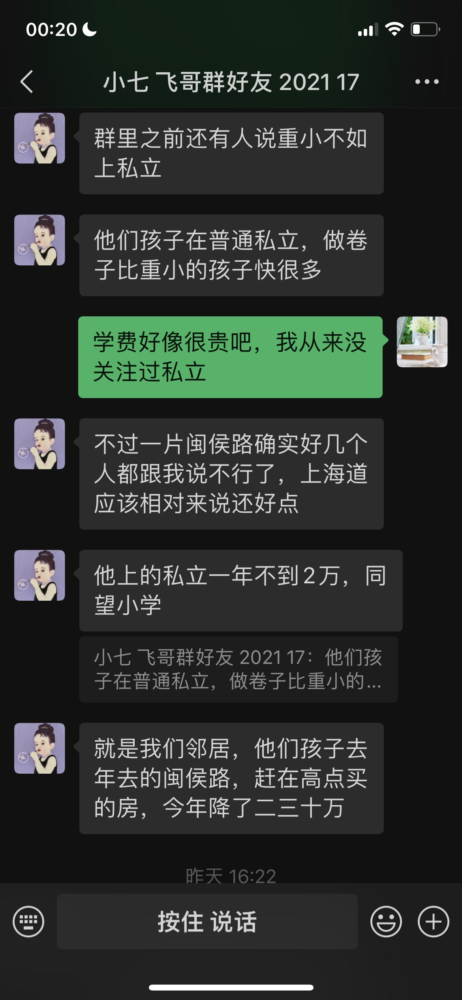
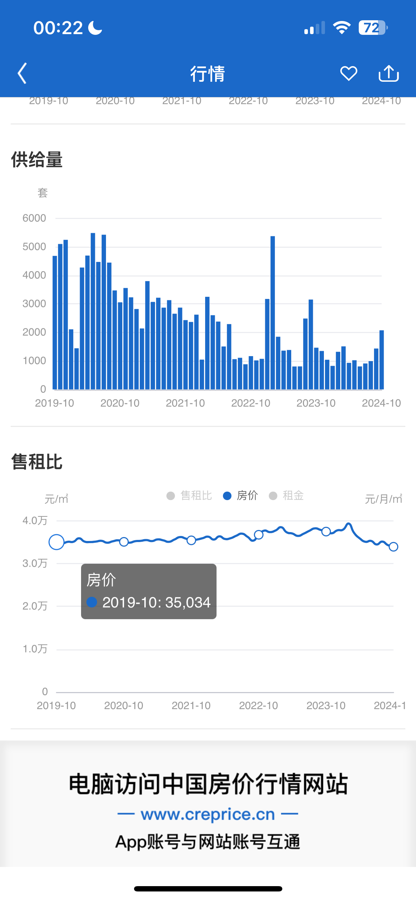
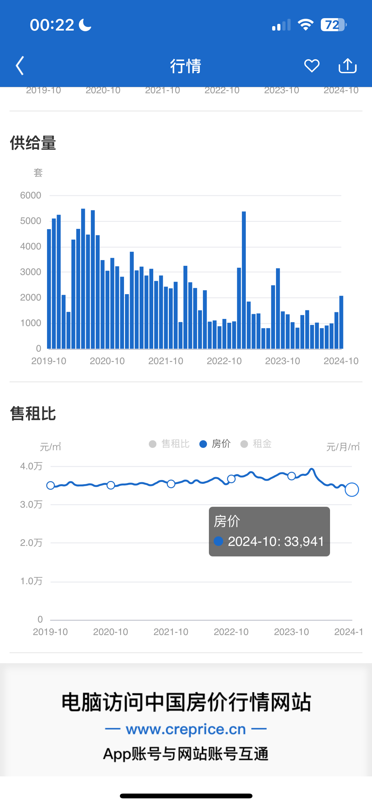
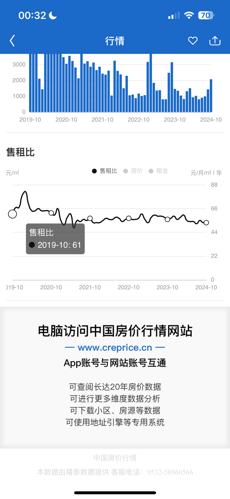
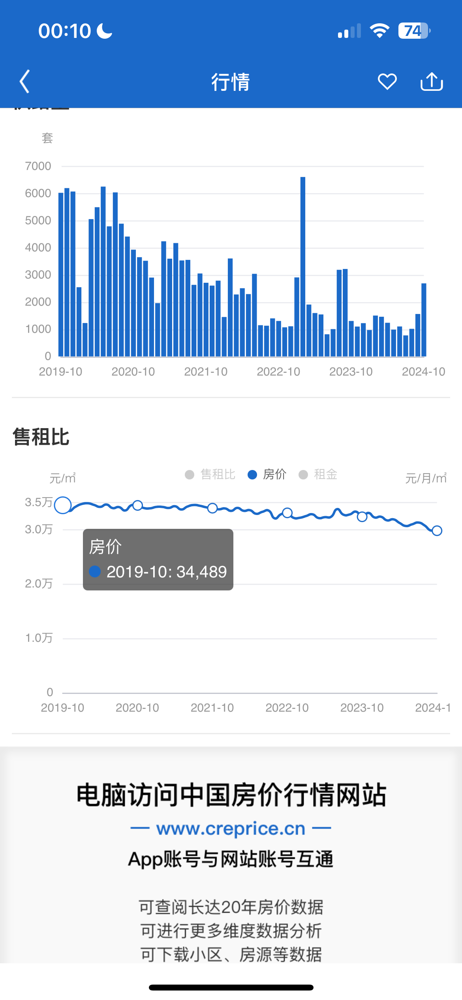
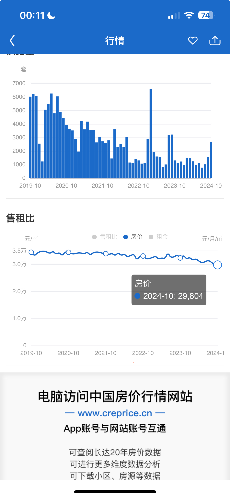
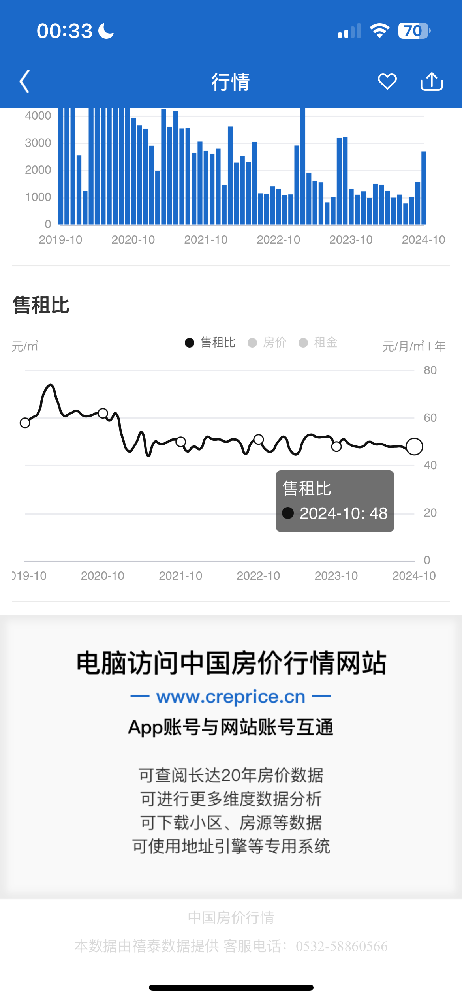

# 天津各区分析

## 天津河西区

### 河西一片

**教学质量：**
- 小学如上海道小学、台湾路小学在全市知名，对应的初中（如新华中学、卓群中学）也有很强的综合实力。
- 初中阶段的升学率较高，很多学生能够考入市内重点高中。

**缺点：**
- **学区竞争激烈**：河西一片是传统的教育强区，学区房价格高，入学难度相对较大。
- **校舍资源有限**：一些学校位于老城区，场地和设施较其他片区（如梅江片区）稍显陈旧。

### 河西二片

**教学质量：**
- 以优质教育均衡著称，小学和初中分布合理。
- 实验中学等初中学校教学质量高，部分学生考入市五所、重点高中的比例稳定。
- 师大二附小等学校师资力量雄厚，素质教育方面突出。

**缺点：**
- **发展潜力不足**：相比一片和三片，河西二片在整体资源和社会关注度上略逊一筹。
- **生源竞争相对中等**：部分家庭倾向选择一片的传统名校或三片的新兴学校。

### 河西三片

**教学质量：**
- 以新兴优质资源为亮点，小学如天津师大附小、科技大附小，与对应的初中如北京师大天津附属中学、第四中学等配套完善。
- 梅江片区的学校硬件设施新，课程体系更加现代化，注重素质教育与科技创新。

**缺点：**
- **发展时间短**：三片内部分学校成立时间较短，积累的教育资源和历史沉淀相对不足。
- **优质学区房竞争加剧**：近年来三片成为热门学区，导致房价飙升，但部分学校尚未达到一片的教学口碑。

### 综合对比

| 片区 | 教学优势 | 主要缺点 |
| --- | --- | --- |
| 河西一片 | 名校资源集中，升学率高 | 学区竞争激烈，设施稍显陈旧 |
| 河西二片 | 教育均衡，素质教育强 | 资源发展潜力不足 |
| 河西三片 | 新兴学校硬件好，发展快 | 教育积累有限，学区房竞争大 |

### 结论
1. **追求传统名校与稳定升学率**：可选择河西一片。
2. **关注综合教育和均衡发展**：河西二片是适合的选择。
3. **倾向现代化教学与素质培养**：河西三片更具吸引力。

### 河西重点小学家长群内部信息

总结：闽侯路小学教学质量保障性不太理想，相对23年房价二三十万！相对来说上海道小学更靠谱！

### 河西区非学区房考虑

**一片区非学区房（混上好初中）**

群友：河西一片湘江道便宜！！！

豆包参考》河西一片区相对较便宜的学校房源如下：

- **恩德里小学**：其对应的连荣里、红波里小区有总价130万左右的房子。如连荣里一套31平米南向6层顶层的房子，总价130万；红波里有35平米6层东向总价125万的房子，以及37.33平米南向6层总价130万的房子。
- **东楼小学**：对应的景兴西里小区，有南北通透的砖楼，也有东西向带外跨楼梯的房子，其中一套35平米西向6层的房子总价134万。
- **湘江道小学**：有一套1楼带院的房子，报价137万，该房两间居室均在阳面，还附赠小院，地段位于河西一片的市中心，距地铁1号线700米，距在建的地铁8号线100米。

**河西最最便宜（初中不理想）**

考虑因素：部分优质学校周边的房子价格较高，但如果考虑性价比，可以选择位置稍偏一些的房源，例如小海地附近。

小海地位于河西区东南部，属于河西区三片.对应的小学有：

- **天津职业技术师范大学附属珠江道小学**：始建于1981年，是小海地地区开办最早的学校之一，位于平江里21号，为全日制公办小学，现有29个教学班，学校坚持"为学生成功铺路，为教师发展奠基"的办学理念。
- **陵水道小学**：位于泰山里34号，是一所公立小学，现有26个教学班，学生940余人，该校实行对口直升，对应中学有双水道中学、微山路中学、枫林路中学、天津市第四十二中学、北师大天津附中、天津市第四中学。
- **天津师范大学第二附属小学**：绿水道校区位于小海地捂水道与枫林路交口，紧挨着地铁6号线梅林路站，其师资力量雄厚，教学质量高，是小海地地区认可度较高的小学。
- **天津财经大学附属小学**：坐落在河西区三片小海地附近，注重学生综合素质培养，开展多样化社团活动，如书法、绘画、音乐等，丰富学生课余生活，提升综合素养。

### 河西初中学校排名

**飞哥群友总结**

河西的一片儿的初中整体来讲是挺好的，除了和平区，也就就是河西一片儿。

1. **新华**：每年都是区第一
2. **海河**：海河原来是是个重点中学。
3. **卓群和田家炳**：2023年的初中成绩，田家炳是整个河西第二，卓群是第四。
4. **2022年又转过两个民私立学校，转成了公办**：一个叫觉民，一个叫卓越。这两个学校更好。现在归到河西一片儿，你那一算都是好学校。

从这个整体升学情况来讲的话，肯定是河西一片儿最好（除和平以外）。

**AI搜集总结**

以下是天津市河西区初中学校的排名，并在学校后备注其所在片区：

1. **新华中学**（第一片区）
2. **实验中学**（第二片区）
3. **海河中学**（第一片区）
4. **第四十一中学**（第二片区）
5. **第四中学**（第三片区）
6. **第四十二中学**（第三片区）
7. **卓群中学**（第一片区）
8. **田家炳中学**（第一片区）
9. **卓越中学**（第一片区）
10. **觉民中学**（第一片区）
11. **环湖中学**（第二片区）
12. **滨湖中学**（第二片区）
13. **梅江中学**（第二片区）
14. **梧桐中学**（第二片区）
15. **微山路中学**（第三片区）
16. **双水道中学**（第三片区）
17. **北京师范大学天津附属中学**（第三片区）
18. **华宁中学**（未明确具体片区）
19. **自立中学**（未明确具体片区）
20. **培杰中学**（未明确具体片区）
21. **津海中学**（未明确具体片区）
22. **佟楼中学**（未明确具体片区）
23. **梅江西中学**（未明确具体片区）

### 河西区所有初中名单

**第一片区：**
1. **新华中学**（市五所之一）
2. **海河中学**（市重点）
3. **卓群中学**
4. **田家炳中学**
5. **觉民中学**
6. **卓越中学**

**第二片区：**
1. **实验中学**（市五所之一）
2. **第四十一中学**（市重点）
3. **梧桐中学**
4. **梅江中学**
5. **滨湖中学**
6. **环湖中学**

**第三片区：**
1. **第四中学**（市重点）
2. **第四十二中学**（市重点）
3. **北京师范大学天津附属中学**
4. **微山路中学**
5. **枫林路中学**
6. **双水道中学**
7. **第二新华中学**
8. **景海道中学**
9. **学苑中学**

请注意，以上排名主要参考了学校的教学质量和升学情况，具体排名可能因年份和评估标准而有所变化。

### 河西五年房价变化

### 河西五年房租变化

### 河西五年租售比

---

## 天津南开区

### 南开区的重点小学主要有以下几所

**1. 中营小学(北片)：**
- **地址**：天津南开区中营前街2号。
- **优势**：该校于1905年（清光绪31年）开始筹建，1906年3月5日建成，是天津最早的官办小学，历史悠久。学校坚持"勤朴敏健"的校风，"严谨善导"的教风和"勤学多思"的学风，教学质量高，师资力量雄厚，在南开区乃至天津市都有较高的声誉，也是众多家长心目中的优质学校。

**2. 五马路小学(北片)：**
- **地址**：有多个校区，分布在不同位置。
- **优势**：始建于1956年，是南开区的老牌重点小学。学校实施素质教育，管理理念先进、教育特色鲜明。学校拥有多个校区，多次面向全国、市、区做教学专题展示，为高一级重点中学输送了大批优秀学生。其教学质量和口碑在南开区都非常不错。

**3. 南开中心小学(北片)：**
- **地址**：天津南开区双峰道40号。
- **优势**：前身是著名教育家张伯苓先生创办的南开学校小学部，解放后成为南开四马路小学，进入21世纪更为现名。它坐落在南开区中心地带，是天津市九年义务教育示范校，拥有深厚的文化底蕴和优质的教育资源。

### 南开区的房源

[颂禹里-五马路小学](https://tj.ke.com/xiaoqu/1211045186898/?fb_query_id=904177780513460224)

### 南开五年房价变化

### 南开五年房租变化

### 南开五年租售比

