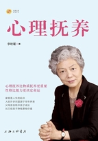
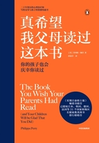
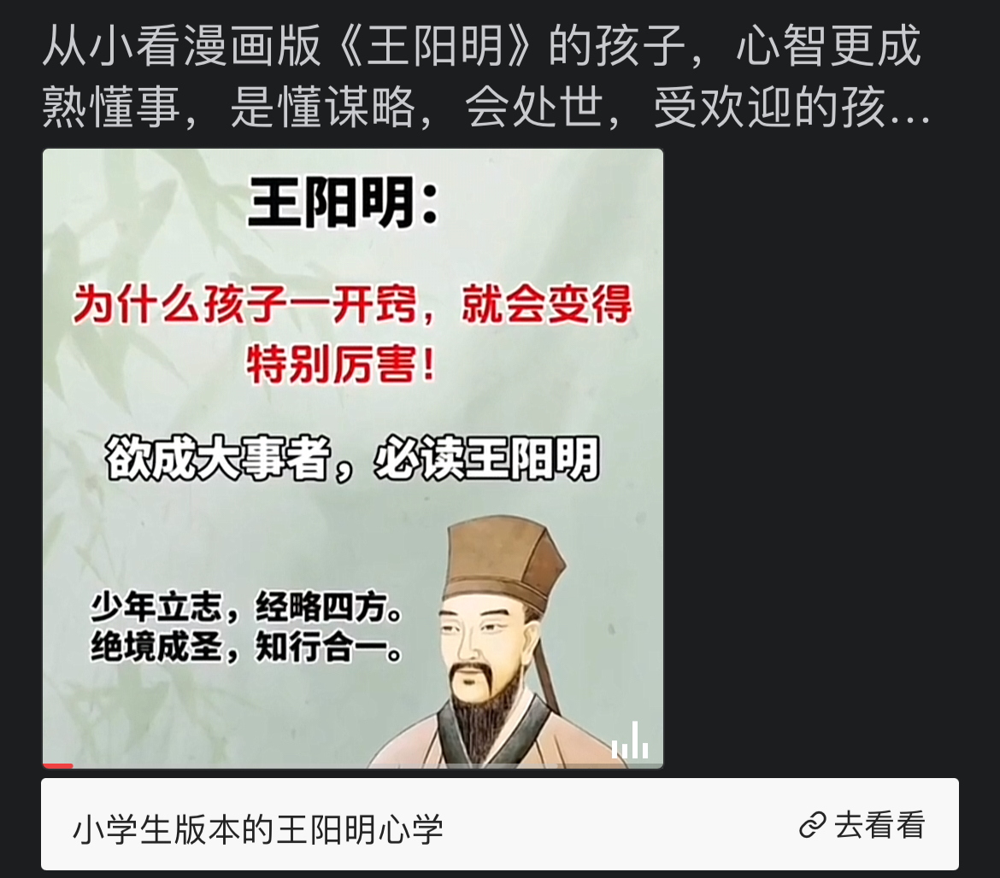
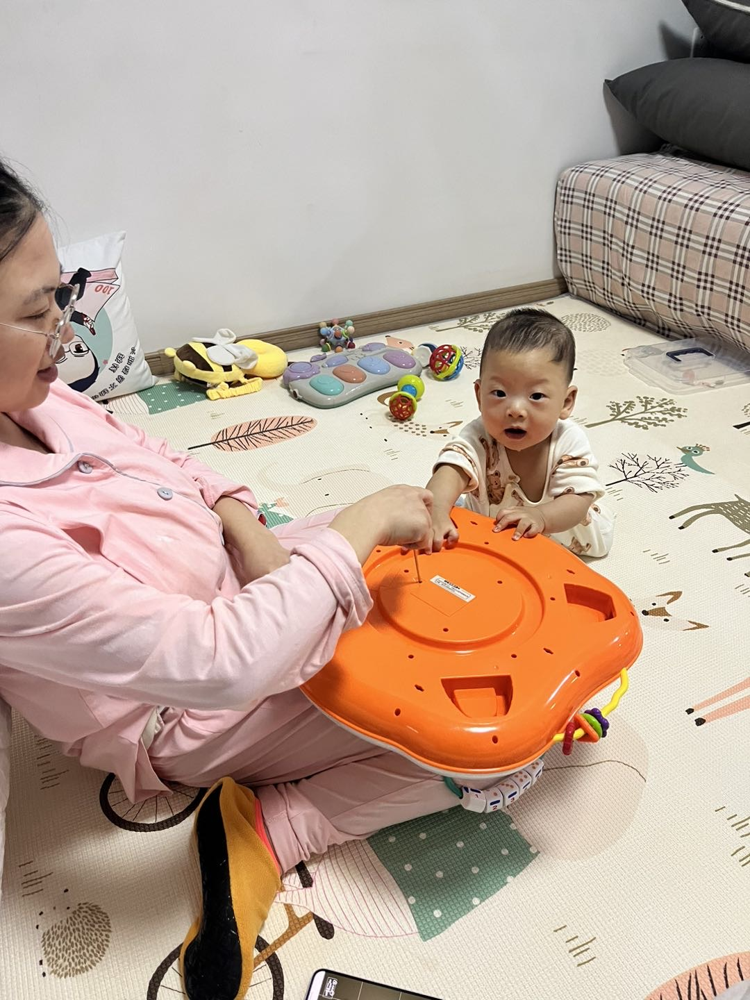

# 孩子的教育

0-几岁：个体永久性

小学-初中：数学+逻辑，理解不了：复利，平方，投资

初中高中：

小狗狗钱钱：

蓝筹孩子：

穷爸爸富爸爸：

- 三岁看大
    
    “三岁看大”是一种强调早期教育和环境对人成长影响的重要性，但要做到“全方位地看”，可以从以下几个方面着手：
    
    # **1. 健康状态：身体与心理**
    
    •	**身体发育**：观察孩子的身高、体重、视力、听力等指标是否达到同龄人正常水平。
    
    •	**心理健康**：关注孩子的情绪表达、适应能力，是否有安全感，是否能正确表达需求。
    
    # **2. 性格特质**
    
    •	**情绪管理**：是否容易发脾气，能否调节自己的情绪。
    
    •	**社交能力**：是否能和其他孩子友好相处，是否有团队合作意识。
    
    •	**独立性**：是否愿意尝试新事物，有没有自己的小主意。
    
    # **3. 认知发展**
    
    •	**语言能力**：词汇量、语句表达是否清晰，能否听懂和回应复杂指令。
    
    •	**逻辑思维**：能否分类、排序、理解简单因果关系。
    
    •	**专注力**：是否能在一件事情上集中注意力较长时间。
    
    # **4. 行为习惯**
    
    •	**生活习惯**：如吃饭、睡觉、如厕是否有规律。
    
    •	**学习习惯**：是否对书籍、绘画、音乐等表现出兴趣并能持续投入。
    
    # **5. 兴趣倾向**
    
    •	通过观察孩子的日常选择，了解他们对某些活动或事物的持续兴趣，如搭积木、画画、讲故事等。
    
    # **6. 环境影响**
    
    •	**家庭环境**：家长是否提供了足够的陪伴和支持，家庭氛围是否和谐。
    
    •	**外部环境**：孩子的幼儿园、玩伴、社区活动等对孩子性格的影响。
    
    # **7. 道德品行**
    
    •	是否知道什么是“对”和“错”，对分享、合作、帮助他人是否有初步的认识。
    
    # **方法建议**
    
    •	**记录观察**：通过照片、视频、文字记录孩子的成长变化，找出其优势和需要加强的地方。
    
    •	**和专业人士沟通**：定期咨询育儿专家或儿科医生，获取专业建议。
    
    •	**多元体验**：给孩子创造机会去接触不同的活动、场景和文化，从而全面评估和培养能力。
    
    做到全面地“看”，不仅是观察当前的状态，更是为未来成长做出适时的调整和规划。
    
- 七岁看老
    
    “七岁看老”是一句俗语，表达了人在幼年时期显现出的性格、行为习惯、以及智力发展，可能会对其一生产生深远影响。如果想从“全方位”看待孩子的成长，可以从以下几个方面入手：
    
    # **1. 性格与心理特质**
    
    观察孩子在情绪管理、社交互动、以及对挫折的反应中展现的特质。例如：
    
    •	**自控力**：能否控制自己的冲动？
    
    •	**共情能力**：是否能够体会他人的感受？
    
    •	**抗挫折能力**：面对失败和困难时是否愿意尝试再次努力？
    
    # **2. 行为习惯**
    
    习惯是一生发展的基础，可以通过以下方面观察：
    
    •	**生活习惯**：是否具备基本的时间观念和自理能力？
    
    •	**学习习惯**：是否能专注完成任务，善于提问和探索？
    
    •	**责任感**：是否愿意承担小任务并完成？
    
    # **3. 智力与认知发展**
    
    智力并不仅仅指成绩，而是多元化的能力：
    
    •	**逻辑与思维能力**：能否提出自己的见解或解决问题？
    
    •	**语言表达能力**：沟通是否流畅、用词是否丰富？
    
    •	**兴趣与专注力**：对哪些事物表现出特别的兴趣并愿意深入？
    
    # **4. 社交能力**
    
    了解孩子在人际关系中的表现：
    
    •	是否愿意与同伴分享？
    
    •	如何处理冲突或解决分歧？
    
    •	是否主动建立新的友谊？
    
    # **5. 身体健康与运动能力**
    
    体能发展对孩子的心理和学习都有影响：
    
    •	是否有良好的饮食和睡眠习惯？
    
    •	是否有运动协调性和灵活性？
    
    •	身体素质是否适应成长需求？
    
    # **6. 家庭与环境影响**
    
    一个人的发展也离不开家庭和环境：
    
    •	父母是否在关键时刻支持和引导？
    
    •	孩子是否在包容与理解的氛围中成长？
    
    •	所处的教育资源是否能满足孩子的需求？
    
    # **7. 未来潜力与可塑性**
    
    最重要的是，7岁时虽然能看到一些倾向，但更要关注**成长空间**：
    
    •	性格中是否有可塑之处？
    
    •	家长如何针对性地培养优势、改善短板？
    
    # **小结**
    
    “七岁看老”不是定论，而是提醒家长和教育者关注儿童早期发展的重要性。从全方位的角度看，孩子的性格、习惯、能力和家庭环境共同作用，决定了他们未来的成长轨迹。因此，关键是**用心观察、适时引导、因材施教**，帮助孩子充分发挥潜力。
    
- 英语启蒙步骤
    - 磨耳朵
        - 儿歌
            - [ ]  SSS英文儿歌
        - 童谣
            - [ ]  鹅妈妈
        - 动画
            - [ ]  趣趣知知鸟
            - [ ]  小鼠波波
            - [ ]  Wow English
            - [ ]  Yakka Dee

- 性格
    - 勇敢：
    
- 三观
    - 世界观：指人们对世界、自然、社会和人生的总体看法和根本观点。世界观觉得了一个人如何理解和解释周围的世界，以及他们如何看待自己在这个世界中的位置。
    - 人生观：是关于人生目的、意义、态度和对待人生各种问题的基本看法。人生观影响一个如何看待生命的意义，如何定义自己的生命目标，以及如何面对生活中的挑战和选择。
    - 价值观：指人们对事物、行为、现象等的价值和意义的基本看法和态度。价值观反映了一个人认为什么是最重要的，什么是值得追求的，以及如何区分对错和善恶。

- 中国幼儿园的作息时间表
    
    中国幼儿园的作息时间表通常根据孩子的年龄段和幼儿园的具体安排有所不同，但一般来说，较为标准的作息时间表如下：
    
    # **幼儿园作息时间参考**
    
    **7:30 - 8:30**
    
    •	入园接待、晨检
    
    •	自由活动
    
    **8:30 - 9:00**
    
    •	早操或户外活动
    
    **9:00 - 9:30**
    
    •	早点时间（简单的加餐）
    
    **9:30 - 10:30**
    
    •	集体教学活动（语言、数学、音乐、美术等课程）
    
    **10:30 - 11:00**
    
    •	户外游戏/体育活动
    
    **11:00 - 11:30**
    
    •	午餐
    
    **11:30 - 12:00**
    
    •	餐后散步/安静活动
    
    **12:00 - 14:30**
    
    •	午休
    
    **14:30 - 15:00**
    
    •	起床、整理、下午加餐
    
    **15:00 - 16:00**
    
    •	游戏活动（角色游戏、建构游戏等）
    
    •	个别化教育活动
    
    **16:00 - 16:30**
    
    •	户外活动/放学准备
    
    **16:30 - 17:30（部分延时服务）**
    
    •	延时看护、自主活动
    
    # **特点与调整**
    
    1.	**季节性调整**
    
    冬季和夏季可能会根据天气条件对户外活动时间进行适当调整。
    
    2.	**灵活性**
    
    每个幼儿园的安排会有所不同，有的会加入特色课程或延长自由游戏时间。
    
    3.	**年龄差异**
    
    小班（3-4岁）、中班（4-5岁）、大班（5-6岁）课程安排可能不同，大班的教学活动相对更集中。
    
    具体作息时间应以各幼儿园的实际安排为准。
    
- 中国小学生的作息时间表
    
    中国小学生的作息时间表因地区、学校和年级的不同而有所差异，但一般遵循教育部门的规定，确保学生有充足的学习和休息时间。以下是一个典型的小学生作息时间表参考：
    
    # **小学作息时间表参考**
    
    **7:00 - 7:30**
    
    •	起床、早饭、上学
    
    **7:40 - 8:00**
    
    •	早读或晨会
    
    **8:00 - 8:45**
    
    •	第一节课
    
    **8:55 - 9:40**
    
    •	第二节课
    
    **9:40 - 10:00**
    
    •	课间操/课间休息
    
    **10:00 - 10:45**
    
    •	第三节课
    
    **10:55 - 11:40**
    
    •	第四节课
    
    **11:40 - 13:30**
    
    •	午餐、午休
    
    **13:30 - 14:15**
    
    •	第五节课
    
    **14:25 - 15:10**
    
    •	第六节课
    
    **15:10 - 15:30**
    
    •	课间活动或眼保健操
    
    **15:30 - 16:15**
    
    •	第七节课（部分学校为兴趣活动或补充课程）
    
    **16:15 - 17:00**
    
    •	自主活动或放学（部分学校安排课后托管服务）
    
    # **作息特点**
    
    1.	**上学时间**
    
    一般在7:40-8:00之间开始，不同地区可能略有不同，特别是寒暑假期间会有所调整。
    
    2.	**课程设置**
    
    每节课时间为35-45分钟，小学低年级（1-2年级）课时更短，课外活动更多。
    
    3.	**课间活动**
    
    包括眼保健操、课间操、自由活动等，旨在帮助学生放松和预防近视。
    
    4.	**延时服务**
    
    部分学校提供课后托管或兴趣班，放学时间延长至17:30左右。
    
    # **教育部门规定**
    
    教育部明确要求小学一、二年级学生每天课程不超过4节，高年级不超过6节，确保小学生每天至少有10小时的睡眠时间。
    
    具体作息时间需根据学校的实际安排查看。
    

- 狭隘的世界观
    
    把金钱看得过重，导致狭隘的世界观，会带来一系列问题和负面影响。这样的世界观使人过度关注物质财富，忽视其他重要的生活价值，如情感、道德、社会关系和个人成长。这种狭隘的世界观在生活和工作中可能会导致以下几方面的影响：
    
    ### 1. **人际关系紧张**
    
    - **缺乏信任和真诚**：如果一个人过于看重金钱，可能会让他在与他人的交往中显得功利化，注重利益得失。这种态度会让他人感到不被尊重，缺乏信任和真诚。
    - **忽视情感和道德**：对金钱的过度重视可能使人忽略情感交流和道德责任，导致家庭关系和友谊的破裂。例如，可能会因为金钱问题与家人或朋友发生冲突，或者在关键时刻选择利益而非情感。
    
    ### 2. **工作中的影响**
    
    - **短视和缺乏远见**：在工作中，如果过度重视金钱，可能会导致短视行为，倾向于追求短期利益而忽略长期发展的潜力和价值。这种行为可能限制职业发展，因为真正的成功通常需要远见、创新和对团队和客户的长期承诺。
    - **团队合作和领导力受限**：狭隘的世界观会让人难以理解和尊重同事的不同观点和利益，影响团队合作。如果领导者也是如此，可能会导致团队士气低落，因为团队成员感觉他们的贡献被贬低或忽视。
    - **决策失误**：在决策过程中，如果只关注经济利益而忽略其他因素，如员工满意度、社会责任、品牌声誉等，可能会做出不利于公司长远发展的决策。
    
    ### 3. **个人成长的局限**
    
    - **缺乏幸福感和满足感**：研究表明，金钱并不是幸福的唯一来源，过于看重金钱的人往往会忽视生活中的其他美好，如友情、家庭、个人成就感和精神追求，这会导致内心的空虚感和缺乏真正的幸福感。
    - **压力和焦虑增加**：把金钱看得过重，可能会导致对财富积累的执着和焦虑。这种压力会影响心理健康，甚至可能导致焦虑症、抑郁症等精神问题。
    
    ### 4. **社会和道德责任的忽视**
    
    - **社会责任感淡薄**：狭隘的世界观可能让人忽略社会责任和道德义务，对环境、社区和社会的贡献感到无关紧要。这种态度可能导致对公共事务漠不关心、不参与慈善和公益活动，甚至可能在商业活动中采取不道德的行为。
    - **伦理道德问题**：过于重视金钱的人可能更容易在道德和法律的边界上游走，为了金钱而不择手段，如欺诈、贿赂等，这不仅有损他人，也可能让自己身陷法律纠纷。
    
    ### 总结
    
    把金钱看得过重造成的狭隘世界观，会在生活和工作中带来诸多问题，包括人际关系紧张、职业发展受限、个人幸福感降低、社会责任感淡薄等。调整这种过度金钱导向的观念，平衡物质和非物质的追求，有助于获得更健康、幸福和成功的生活。
    
- 自私、以自我为中心的三观
    
    以自己为中心，不为别人付出，只要求别人为自己付出，这种行为反映了一个人自私、以自我为中心的三观。这种三观在世界观、人生观和价值观上都有着明显的偏差：
    
    ### 1. **世界观的偏差**
    
    - **自我中心的世界观**：这种人通常持有一种狭隘的、以自我为中心的世界观。他们可能认为世界围绕着自己转，其他人的需求、感受和利益都不如自己的重要。这种世界观忽视了人际关系中的互惠互利和相互尊重的原则，导致了他们在与人交往中只关注自己的得失。
    
    ### 2. **人生观的偏差**
    
    - **功利性的人生观**：在人生观上，这种人可能以自我利益最大化为目标，把个人的快乐、成功和满足置于他人之上。他们往往认为生活的意义在于追求自己的利益和舒适，而忽视了对他人的关爱、分享和合作的重要性。
    
    ### 3. **价值观的偏差**
    
    - **自私的价值观**：在价值观上，这种人可能认为自己的需求和愿望是最重要的，其他人的需求和感受可以被忽略或不被重视。这种自私的价值观可能会导致他们在行为上表现出冷漠、自私、缺乏同理心和责任感。
    
    ### 这种三观在生活和工作中的表现和影响
    
    1. **人际关系紧张**：这种人往往很难建立深厚和持久的人际关系，因为他们的行为和态度会让他人感到被利用、不被尊重或被忽视。他们可能会失去朋友、同事的信任和支持。
    2. **职业发展受限**：在工作中，这种自私的态度可能会使他们难以与同事合作，缺乏团队精神，甚至可能在竞争中采取不道德的手段。长期来看，这种行为会影响他们的职业发展和声誉。
    3. **心理和情感上的孤立**：因为总是以自我为中心，这种人可能会感到孤立，缺乏真正的情感连接和支持系统。他们可能会感到孤独和不满足，因为他们的关系通常是建立在不对等的基础上，很难获得深层次的情感满足。
    4. **道德和社会责任的缺失**：这种人可能缺乏对社会和他人的责任感，不愿意为他人或社会做出贡献。这不仅会影响他们在社会中的形象，还可能让他们在需要帮助或支持时得不到他人的回应。
    
    ### 总结
    
    以自己为中心，不为别人付出，只要求别人为自己付出，这种三观是自私和狭隘的表现。这种观念会影响一个人在社会、工作和个人生活中的各个方面，导致人际关系紧张、职业发展受限、心理孤立以及缺乏道德和社会责任感。要改善这种状况，关键在于培养同理心、尊重他人以及学会感恩和分享，从而建立更健康、平衡的三观。
    

5岁开始学习《增广贤文》为人处世的启蒙，是人生智慧与经验的传承。

增广贤文   人生导师 ，5岁开始学习 儿童启蒙书目 学习如何处世

- 如何学习 增广贤文
    
    《增广贤文》是一部适合启蒙教育的传统读物，其内容通俗易懂，句子简短押韵，包含大量生活哲理、为人处世的智慧，适合不同年龄段的学习，但具体学习方式和深度可以根据年龄进行调整。
    
    # **推荐学习年龄及学习方式：**
    
    **1. 启蒙阶段：4-6岁**
    
    •	**目标：** 培养语言节奏感，启发道德观念。
    
    •	**学习方式：**
    
    •	亲子共读，家长带着孩子朗读或背诵。
    
    •	不要求理解，只需让孩子熟悉韵律和句式。
    
    •	可结合日常生活举例，例如“人无远虑，必有近忧”讲规划的重要性。
    
    **2. 初步学习阶段：6-10岁**
    
    •	**目标：** 识字、背诵，初步理解内容。
    
    •	**学习方式：**
    
    •	引导孩子理解简单句子的意思，如“莫信直中直，须防人不仁”。
    
    •	结合故事或实际案例，帮助孩子建立基本的生活智慧和道德观念。
    
    •	适量练习书写，加深记忆。
    
    **3. 深入学习阶段：10岁及以上**
    
    •	**目标：** 理解句意，应用于生活。
    
    •	**学习方式：**
    
    •	系统学习《增广贤文》的内容，结合实际生活问题讨论其中的智慧。
    
    •	引导孩子举一反三，将古训与现代处世相联系。
    
    •	探讨句子间的哲学意义，例如“逢人且说三分话，未可全抛一片心”谈信任与谨慎。
    
    # **注意事项：**
    
    •	**启蒙时期重在趣味性，避免强求背诵。**
    
    •	**随着年龄增长，可以逐渐加深对内容的理解，重视与实际生活的结合。**
    
    •	**家长适当引导，帮助孩子从内容中感悟智慧，而非仅停留在记忆阶段。**
    
    这种分阶段学习方式既能帮助孩子从小建立文化根基，也能逐步培养其思辨能力和人生智慧。
    
- 笠翁对韵
    
    《笠翁对韵》是一部经典的启蒙读物，非常适合儿童学习语言对仗和汉字的音韵特点。适合学习的年龄可以根据孩子的语言和认知发展程度来调整：
    
    # **推荐学习年龄：**
    
    1.	**4-6岁：**
    
    •	孩子刚开始学习语言节奏感，对韵律和对仗感兴趣。
    
    •	可以通过亲子共读或朗诵，培养孩子的语感。
    
    2.	**6-8岁：**
    
    •	孩子识字量增加，逐渐能够理解简单的句意。
    
    •	这个阶段可以开始学习简单的对仗规则，帮助培养语言表达能力。
    
    3.	**8岁以上：**
    
    •	孩子对文字的理解力和记忆力增强，可以系统地学习《笠翁对韵》。
    
    •	同时可以结合课外古诗文学习，提升审美和文学素养。
    
    # **学习建议：**
    
    •	**趣味化教学：** 通过儿歌、游戏、故事等方式让孩子体会对仗的乐趣。
    
    •	**逐步引导：** 从简单的对仗句开始，不必急于理解深奥内容。
    
    •	**重在音韵感受：** 强调朗诵和节奏，不必过多纠结词意。
    
    如果孩子对文学感兴趣，也可以稍微提前尝试，但要注意循序渐进，避免太多压力。
    

《增广贤文》 [1]。又名《昔时贤文》、《古今贤文》，是中国明代时期编写的儿童启蒙书目。书名最早见之于明万历年间的戏曲《牡丹亭》，据此可推知此书最迟写成于万历年间。

类别：儿童启蒙书目

主要内容：谈人及人际关系，谈命运，谈如何处世，表达对读书的看法

琢磨人：[鬼谷子](https://baike.baidu.com/item/王诩/7414?fr=ge_ala)

巧虎

当培养一个优秀的孩子时，可以根据不同年龄段的发展特点和需求制定相应的计划。以下是一些针对不同年龄段的培养方案建议：

1. **婴儿期至幼儿期（0-3岁）**：
    - 提供安全和稳定的环境，建立爱和信任的关系。
    - 提供丰富的感官刺激，包括触摸、听觉、视觉和嗅觉。
    - 鼓励宝宝探索和发现，给予充分的关注和回应。
    - 培养良好的睡眠和饮食习惯，建立日常规律。
2. **学龄前期（3-6岁）**：
    - 提供适当的早期教育和启蒙，包括简单的学习游戏、故事阅读等。
    - 鼓励孩子培养社交技能，学会与他人合作和分享。
    - 培养孩子的自理能力，如穿衣、洗漱、整理玩具等。
    - 引导孩子学会表达自己的情感和想法，倾听他们的需求和感受。
3. **小学阶段（6-12岁）**：
    - 培养孩子的学习兴趣和好奇心，鼓励他们探索各种学科和领域。
    - 培养孩子的学习方法和解决问题的能力，注重培养批判性思维和创造性思维。
    - 培养孩子的品德和价值观，注重礼貌、诚实、责任心等品质的培养。
    - 鼓励孩子参加体育、艺术和社会活动，促进全面发展。
4. **青少年期（12-18岁）**：
    - 培养孩子的自主性和独立性，鼓励他们自主解决问题和做出选择。
    - 培养孩子的社交能力和人际关系，关注他们的情感和心理健康。
    - 引导青少年树立目标和追求梦想，提供支持和指导，鼓励他们积极面对挑战和困难。
    - 注重青少年的职业规划和生涯发展，提供相关的教育和指导。

在制定这些计划时，家长应该关注孩子的个性和特点，灵活调整教育方式和方法，注重与孩子的沟通和互动，共同成长和进步。

人生=人生观、价值观、世界观

价值观绝大多数是来父母

提升认知

性格决定命运，培养良好的性格

- 《心理抚养》李玫瑾 |微信读书
    
    
    
    微信读书推荐值92.5%
    
    精彩点评
    
    浑金璞玉  推荐
    
    不幸的人用一生来治愈童年，幸福的人用童年治愈一生。父母的生而不养、养而不教、教而不当，这些先天的不足，自己无法选择；但长大后自己应该竭尽全力去拓展知识、开阔眼界、增长见识、丰富阅历、磨练心性、陶治性操，避免沉湎过去、一条道走到黑。
    
    阿白  推荐
    
    ☘️读完此书，让我受益颇多！如果把人生说成一本书，那么父母是原件，孩子就是复印件，父母的一言一行，举手投足都是孩子最好的样板和直接用心的教材！（也包括家庭其他成员）并且父母的一言一行或者某种决定，真的会直接影响孩子的一生！ ☘️咱中国流传下来有句古话，叫做棒下出孝子！而真正有智慧的父母（人）拳头都在脑子里。
    
    此木是柴  推荐
    
    《心理抚养》是李老师应广大读者提出的需求完成的一本新书，之前看过李老师的很多有关犯罪心理和儿童教育的相关视频，受益匪浅。第一次系统的读李老师写的书，书中很多心理学理论比较深奥，到结合老师实际解决的犯罪实际，理论和实际合理理解起来比较容易。 本书中有一个重要的概念我觉得说的非常好，爱源于接触，无论婴儿还是少年，还是爱人之间，爱必须要有接触，而接触的最直接的好处就是安全感，往往有时对孩子和爱人的一个简单的拥抱就能将本来要爆发的矛盾化无无性之中了。爱源于接触，除了身体接触还有就是语言，多和孩子沟通和交流对孩子形成良好的性格同样帮助很大，尤其是睡前，我发现每天睡前留给自己和孩子几分钟交流的时间，可以知道孩子每天都在想些什么、做着什么、孩子的需求是什么，此外每天睡前简单的交流还能够增进感情，让孩子知道父母是爱自己的。 爱源于接触，要想孩子性格身心能够健康最好的方法就是陪伴。书中有一个观点认为人在婴幼儿阶段所的到的关注度要远远比其他阶段重要的多。比如婴儿一直在哭，他肯定是有需求才哭，而大人要是认为哭一会就好了，过一会孩子可能就不哭了，但是这样的培养方式势必会对孩子内心造成一定程度创伤，会让孩子没有安全感。 书友列举了很多走上犯罪道路的孩子大多数都是父母不在身边或者父母无暇顾及孩子没时间陪孩子的情况。都说父母是孩子的第一任老师，如果父母都不在身边的话，就无法给孩子做到表率作用，更谈不上对孩子的影响了。同样是管教孩子，相比爷爷奶奶孩子还是更能听进去父母的话。爱源于接触，说远一点爱其实源于回应和共情，当孩子需要父母的帮助时父母能够就是出现及时引导，能够去理解孩子，这样对孩子的身心发展肯定要有好处。很多时候我们去吼去喊，而没有走进孩子的内心，没有从他还是一个孩子的角度来考虑问题。
    
    热门划线
    
    人的胃口是喂出来的，脾气是带出来的，观念是唠叨出来的，残忍是孤弱无助熬出来的，无耻是百般迁就宠溺出来的。
    
    Autumn等 20491 人划线
    
    小聪明是对事的，具有短视性，而大智慧是对人生的。如果想问题时不仅仅停留在眼前的事情上，而是以整个人生来权衡，那么，这种思维方式就非常好。
    
    XiaoHui等 11131 人划线
    
    真正的心理成熟是什么？就是在处理各种复杂的问题时，人能够不把缘由归结于外部，而是从自身找原因。
    
    夏至丶等 10792 人划线
    
    人们在找原因时，往往把好的行为和成功的行为归因于自己，而把不好的行为和失败的行为归因于外部。社会心理学把这种现象称为“归因偏差”。
    
    Autumn等 10691 人划线
    
    因为决定一个人有没有“人味”，要看他对人间悲欢离合的感悟，以及他带给别人和社会的感受。一个人能让身边的人感到舒服和幸福，能为社会做出贡献，这应该是父母最开心的事。能养育出这样的孩子就是父母最大的功德。
    
    愛与誠等 10556 人划线
    
    养育孩子，并非天天在说教，也并非事事在照顾。陪伴也是一种养育，这需要的是一种过程。亲子关系，是需要用时间培养的。细心照顾，耐心陪伴，慧心观察，这是读懂孩子的前提。
    
    彩儿📚等 8926 人划线
    
    无论是男性还是女性，性情好和有责任感最重要。那么，如何考察呢？一定要先看对方的父母关系好不好。如果对方父母恩爱、家庭和睦，你可以闭着眼睛跟他结婚。如果对方父母关系紧张，家庭成员感情冷漠、怨气十足，这种家庭要慎入。
    
    彩儿📚等 8466 人划线
    
    人，其实是“养育+教育”的产品。学校教育之前的家庭养育，尤其是心理抚养的好坏，可以影响乃至决定人的一生。
    
    Autumn等 8087 人划线
    
    你做爸爸的不在孩子身边，不要太关注孩子的成绩，那是老师关心的事情。你每次打电话要问他：‘你上学快不快乐？老师喜不喜欢你？你和同学关系怎样，有没有人欺负你？’做爸爸的要关心这些，而不是只问成绩。如果有人欺负他，你要给他出主意，要想办法解决。实在不行的话，你要回去陪伴他。成绩是次要的，这个才是最重要的。”
    
    夏至丶等 7958 人划线
    
    人活在世上，无论是男人还是女人，首先要做一个独立的人，要自信和自尊。也就是说，你可以爱别人，也可以被人爱，但你就是你，你的价值首先体现在你是能自立的，而不是将自己的一切依附于某个人身上。只有这样，你才能得到别人的尊重。
    
    Autumn等 7751 人划线
    

- 《看见孩子》贝姬·肯尼迪 |微信读书
    
    Ying🤍  推荐
    
    学习“看见孩子”的同时也帮助我审视了自己，如何重视自己的情绪，如何理解行动是结果而不是重点。做了很多笔记，也购入了实体书送给孩子爸爸，期待在未来的成长路上慢慢消化、实践与思考。
    
    知足&知止  推荐
    
    当我看到有一本书书名叫《真希望我的父母读过这本书》，我也非常希望能推荐给父母读一下，但我知道这是不可能的。有些事儿，就像流淌的河水，虽然河还是那条河，但水早就不是原来的水了。已经张大成人的大宝宝，是无论如何也不可能做回小宝宝了。 可是，难道就这样下去吗？不，一定还有别的办法。既然养育不可重来，那我何不试试自我养育——一人如同出色的演员那样，分饰两角，同时演绎父母和孩子👶🏻重新养育自己的那个内在小孩。 这本书与其说是一本育儿指南，不如说是一本能让你在生活的所有领域都能感受到本心的好的指南。毕竟，重拾本心的好是改变我们自身，进而打破代际恶性循环的关键。一旦我们感受到自己本心的好，我们就会开始看到孩子本心的好。也学着去看到父母的本心的好。 这一点，是借鉴李笑来老师的把时间当做朋友而不是敌人。疗愈过去，也不要把父母当做敌人，而是——真相不唯一。我们必须同时接纳两个看似对立的真相。虽然过去造成了很多的不愉快，但现在此刻，只要我自己开始改变，并且相信每个人的本心都是好的。只是遇到了暂时无法解决的困难，这样想，无论是站在父母的角色还是孩子的角色，都可以获得更多的宽容。 同时，改变的关键在于学会容忍心里涌起的内疚或羞愧，我们要把这些感受看作改变的一部分，而非改变的敌人。我们需要和这些感受交朋友，因为它们是我们正在进步的信号！
    
    热门划线
    
    首先也是最重要的一点是，理解行为只是冰山看得见的部分，看不见的是孩子无比渴望被理解的整个内心世界。
    
    构筑牢固关系的前提是双方共同认定没有谁绝对正确，因为人在关系中的安全感来自理解，而非说服。
    
    Ruli等 1699 人划线
    
    行为规则不是告诉孩子不要做什么，而是告诉孩子我们会怎么做。
    
    V.D.M.等 1236 人划线
    
    在提升心理韧性方面，儿童最需要父母做的事情有：共情，倾听，接纳孩子本来的样子，通过稳定的陪伴给予孩子安全感，找出孩子的优势，允许孩子犯错，培养孩子的责任感，以及提升孩子解决问题的能力。
    
    PeppermintH等 1080 人划线
    
    一旦我们理解了本心的善良，我们就能把人（孩子）与他们的行为（不讲礼貌、打人、说“我讨厌你”）区分开来。把人本身与他们做的事区分开来，是引发深刻改变，同时又不影响亲子感情的关键。
    
    人更加在乎的不是任何具体的决定，而是感到自己被看见，后面这件事几乎永远都是最重要的。
    
    V.D.M.等 783 人划线
    
    行为是了解孩子内心困境的线索
    
    孩子在家庭系统中的职责是通过感知和表达他们的情绪和愿望来探索和学习。孩子需要了解自己的能力边界、什么是安全的、他们在家里的角色、他们有多少自主权，以及在尝试新事物时可能会遇到什么情况。
    
    任何行为都是一扇“窗”，里面藏了一个人的感受、想法、冲动、感觉和未能满足的需求。行为从来都不是迫切需要我们去解决的问题本身，它只是问题的线索。
    

- 《真希望我父母读过这本书》菲利帕·佩里 |微信读书
    
    
    
    微信读书推荐值87.9%
    
    推荐  一般  不行
    
    精彩点评
    
    小任性  推荐
    
    你为什么要读书? 知乎上有一个提问：“我读过的书，后来大部分都忘记了，那读书的意义是什么？” 看到一个回答很绝妙：当我还是一个孩子的时候，我吃过很多食物，现在已经记不起吃过什么了。但是可以肯定的是，它们中的一部分已经长成了我的骨头和血液，读书对人的改变亦是如此。 你读过的书，经历的事，等时间长了，那些细枝末节你都忘了，剩下来的，就成了你的修养。读过的书，不一定都能记住，但会存在心里，它能让你说话有道理、做事有余地，出言有尺度，嬉闹有分寸。你的言谈举止都是你读书沉淀下来的，不知不觉就会改变你的整个人生。 读书和赚钱是人生最好的修行，前者让人不惑，后者让人有尊严。 用生活所感去读书，用读书所得去生活。你的气质里，藏着你读过的书，走过的路和爱过的人。 通过这本书，我又加深了理解，因为理解所以宽容，所以共情，所以有同理心，换位思考， 孩子出生为什么会哭泣，因为突然脱离了子宫的环境，我们永远无法与孩子完美地同步，无法像胎儿在子宫里那样和他同呼吸共命运，误解及关系破裂在所难免。我们能做的是尽量去关心孩子，及时地回应他的要求，增加孩子的安全感，让他从子宫转移到外部世界的过程尽可能顺利。你听到的哭声是本能的强迫性呼喊。孤独就像不舒服、口渴或饥饿的感觉一样，需要被人关注，才能维持个人心理健康。 我们每个人都是从婴儿时期过来的，想想我们自己还是婴儿的时候，希望父母如何对待我们，有的家庭也许父母对待孩子的方式确实有问题，而我们之所以读书学习就是希望改变一些传统的观念和教育方式，从而改善亲子关系。 无论孩子（或成人）年纪多大，觉得自己受到认真对待都是一种很好的心理疗愈。如果认真对待你的人是你的父母，无论你说什么，他们都不责怪你，那确实是最温暖的鼓励。 长大后我们成为了小时候想要的父母 稳定的情绪，以及有效的沟通。是多么重要，不用为打翻的牛奶而哭泣。 压抑的家庭氛围多么痛苦，特别是小孩子，只能依附在父母身边。当我们长大了，才发现自己可以做决定是多么幸福的事情。被好好对待，被好好的爱，是多么幸福的事情。 真的很奇妙，换位思考，假如我们就是婴儿，想象你突然发现自己身处于沙漠中，没有食物，没有住所，没有饮用水，更糟的是，你完全孤立无援。一小时后，你会有什么感觉？两小时后呢？如果你看到远处有一些人呢？为了引起他们注意，你会疯了一样尖叫、呼喊、挥手，你会拼命求援。也许婴儿的感觉就是如此。 这本书的很多观点是我以前所没有思考到的，每一本书都是宝藏，加油吧，读书人。 最后推荐一些教育书籍 大家可以针对性的挑选些阅读 《真希望我父母读过这本书》 《正面管教》 《陪孩子终身成长》 《教孩子学整理:从收拾玩具到管理自己》 《捕捉儿童敏感期》 《重要的“性”，影响孩子一生：41个常见性教育问题解析》 《好妈妈都懂的心理学》 《儿童时间管理效能手册：30天让孩子的学习更主动》 《孩子你慢慢来》 《遇见孩子，遇见更好的自己》 《不吼不叫：如何平静地让孩子与父母合作》 《读懂孩子的心》 《养育男孩》 《养育女孩》 《好妈妈胜过好老师》 《如何说孩子才会听，怎么听孩子才肯说》 《游戏力》 《养育的选择》 《爱和自由》 《童年的秘密》 《完整的成长》 《唤醒孩子的内驱力》 《你的亲子关系价值千万》 《1000天阅读效应》 《亲子关系全面技巧》 《实用程序育儿法》 《父母效能训练手册》 《做对“懒”爸妈养出省心娃》 《接纳孩子》 《不咆哮，让孩子爱上学习》 《孩子，把你的手给我》 《哈佛家训》 《妈妈的意义-孩子如何改变你的一生》 《你就是孩子最好的玩具》 《共情：好的亲子关系胜过一切教育》 《爱在左，管教在右》 《倾听孩子》 《如何说孩子才肯学》 《无条件养育》 《唤醒孩子的内驱力》 《极简亲子对话法：让孩子听得进去的70堂沟通课》 《用尊重成就孩子的一生》 《谁拿走了孩子的幸福》 《陪孩子走过小学六年》 《陪孩子走过青春期》 《不能错过的英语启蒙》 《爱在左，管教在右》
    
    秋秋  推荐
    
    为人父母真是一件苦差事，每天早上醒来后到晚上临睡前，几乎都在忙碌不停，有时候也感慨时间都去哪了？这样做真的值得吗？ 孩子并不是时时都是萌软可爱的，他们会抢零食，抢玩具，抢妈妈，几乎每天都上演不同版本的“精武门”。有时候我也会情绪激动，会动手收拾他们。 有一本绘本叫《让我安静五分钟》，多么真实的感受。 为人父母也是需要学习的，我们必须先释放暗藏在心底的悲伤，才能够释放内心的爱。养育他们长大，言传和身教，希望他们做一个健康，正直，善良的人。 孩子是我们生命中最重要的人，也是丰富我们人生的源泉。尽量收起情绪，用爱和温柔浇灌善良。
    
    A 秋刀鱼不会过期  推荐
    
    本书阅读起来对我本人还是有一些难度的。不过令我感触最深的是人在沙漠中的例子，让我懂得了与宝宝换位思考的重要性，回想之前育儿的所作所为，简直后悔没有早点读到这本书。 睡眠逐步推进中的舒适基线，也是我初为人父即将面临的一个挑战，还有输赢游戏中讲述了本书从始至终一直在灌输的要学会理解及发现孩子某些行为背后的孩子的真实感受及发生这种行为的理由，帮孩子准确的表达出来，不与孩子争输赢，而不是走我们老一辈亲子教养的老路。 当然不是在否定老一辈亲子教养不好，而是人们都是在不断的学习，努力学习到更好的方式方法来建立一个更好的亲子关系。这也是为什么我们会看这类书籍的重要原因。 书看到这里，我承认我记住和所学到的并不是很多。但是想想看，你会记得你昨天的晚餐吃了什么，但你会记得一个月前的晚餐都吃了些什么吗？当然不会记得，因为它们都已经变成养分进入到你的身体里了。读书也是一样，我甚至不记得本书中的大部分内容，但我着重记住了我切实感同身受的，对我马上即将面临用到的部分记住，与其他的部分及案例化成养分在我的身体与脑海中。 所以学习使人进步，哪怕只有一点，也是进步。慢慢读书路，半程风雨半程春，加油吧，读书人！
    
    热门划线
    
    赞赏孩子的努力，描述你看到的东西与感受，并鼓励孩子，而不要做任何评判。描述你的观察，并发现一些具体的特质给予称赞，远比“干得好”“太棒了”之类的笼统评语更鼓舞人心，也远比批评更实用。
    
    当你对孩子正在做的事情或提出要求的事情感到愤怒时（或产生其他负面情绪，包括怨恨、挫折感、嫉妒、厌恶、恐慌、恼怒、恐惧等等），最好把它视为一个警报。那个警报不是在提醒你，孩子肯定做错了什么，而是表明你的记忆闸门又被打开了。
    
    每个人都是这样，我们必须先释放暗藏在心底的悲伤，才能够释放内心的爱。
    
    亲子教养的核心，在于你和孩子之间的关系。如果把人比作植物，关系就是土壤。关系支持和滋养着孩子，让孩子得以成长（或抑制成长）
    
    对家长来说，真正重要的是，和孩子轻松自在地相处，让孩子感到安全，让孩子觉得你想要陪伴他。我们的言语也会发挥小小的作用，但更大的作用体现在我们展现出的温情、触碰、善意和尊重：尊重孩子的感受，尊重他们的个性、观点，以及看世界的角度。换句话说，我们需要在孩子清醒时，表达对他们的爱，而不仅仅是在他们安静入睡时才展现出来。
    
    经常检视内心，多做自我批评，对父母来说极为重要，以免把破坏力传给下一代。
    
    如果你希望孩子拥有幸福快乐的能力，记住，你的自我批评可能是妨碍孩子幸福的最大绊脚石。
    
    和谐伴侣关系的关键，在于积极回应及表示兴趣。这个道理不仅适用于夫妻关系，也适用于所有关系，尤其是亲子关系。
    
    จุ๊บ鈴鈴鈴等 8220 人划线
    
    对每个人来说都是如此，无论孩子或成人。当我们感觉不好时，我们不需要被治愈，我们想要的只是有人感同身受，而不是被当成问题来处理。我们希望有人理解我们的感受，这样我们就不会陷入孤立无援的境地。
    

- 《父母的觉醒》沙法丽·萨巴瑞 |微信读书
    
    微信读书推荐值84.3%
    
    一般
    
    不行
    
    推荐  一般  不行
    
    精彩点评
    
    Svasti(梵 吉祥童子）  推荐
    
    觉醒，意味着对我们所经历的每一件事情保持清醒，按照现实的本来面目去接受和应对它，而不是控制和改变它。 《父母的觉醒》一书，从父母和孩子这一关系视角，阐述了颇有改变生命价值的方法：“觉醒的教养方法并非一套聪明的策略，而是一整套人生哲学。父母与孩子在教养之旅中将逐步成为精神上的伙伴，亲子关系也会变得更加富有意义”。此书不单适合带孩子的宝妈作为育儿经；亦适合让自己活在真实生命中的每个人作为改变自己人生的指南！ 在成人的世界里，通常是不觉醒的，成人往往活在各种成见中，用带有优越自负感的“自负心”代替“真心”，““真心”指的是真实的自我，它是事物的纯粹写照。” 孩子时刻处在本真的世界中，与孩子不带有任何自负感的交流，正好给身为成人的父母一个回归本真的机会！ 在此，我还是引用这样一段推荐内容，以表达我对阅读本书的体验： “萨巴瑞博士在《父母的觉醒》一书中，以对生命和爱的真实理解与温暖信念，与我们分享了一条实在且美好的路径，让父母与孩子同时获得滋养与成长，共同创造出爱与自由并存的关系。这正是任何一种爱的真义，也是陪伴孩子活出丰美明亮生命的最佳引领。” 我非常欣赏本书所表达的对生命的尊重和爱的真义！[爱心]强烈推荐此书📚！让爱与自由广泛传播与发扬光大！🙏💖🌈
    
    丹丹  推荐
    
    《父母的觉醒》读书笔记 个人觉得育儿书的读书笔记好难写，前段时间看了极简父母育儿法则，想了半天还是放弃了。而看完这本书心里面感觉还是可以记录一下的。 通过书的名字不难发现，就是作为父母应该不断的反思，提升自己，觉醒什么呢，就是防止自己产生自负感。在这本书里面有几个理念，我特别喜欢。第一个是活在当下，就是正念的力量，这个其实对我个人来说也很难做到，需要不断的练习加提升自己。为什么要活在当下？我自己的理解是，其实我们的思绪经常游离于当下，很可能你现在做的事和脑子里想的是无关的。那想的是什么呢？有的时候回忆过去，特别是一些不好的事情，这些事情的人或者事容易使我们心情更糟。或者可能还会担忧未来，或者畅享未来。就像自己有的时候哄宝宝，想还有一年上幼儿园了，自己快要解放了吧。而一有这种基调以后，这个反作用就是带孩子的时候会更疲倦，因为是对未来抱有希望，总想快点解脱，最后还是会导致心情不好。那我们应该向谁学习，自己的宝宝，小孩子是永远活在当下的，不用想任何前面或者后面的问题。活在当下的好处是什么，能够更加珍惜此刻的生活，而且当你投入到当下的时候，你会发现时间会过的很快。就像我和宝宝玩动力沙，真的什么都不想，不知不觉1个多小时就过去了。而我有的时候总想自己多些时间，可以看看书，提升自己，结果会恰恰相反，宝宝睡的很晚，往往自己什么也不能做！当然我自己也接受过很多次这样的事情，但是真的无法每时每刻活在当下，这个需要不断的学习才能达到如此境界。 第二个印象深刻的观念是接受孩子的平庸，自从孩子出生后，每个父母都寄与厚望，希望宝宝有所作为！但是很多父母会把成功，和外在的许多东西如工作，房子，挣多少钱，找的什么样的对象当做评估标准，这是非常错误的做法。但是育儿就是仁者见仁智者见智的，所以有的人可能不觉得。为什么这样要求错误，会让孩子逐渐迷失自己的本真，即使当他真的拥有这一切，他确不幸福，这个可能在孩子小的时候无法体现，但是当孩子长大成人以后他可能会很痛苦。怎么接受孩子的平庸，就是每个孩子不可能十全十美，一定是优点缺点并存，对于他的缺点我们要学会接受，而且父母切勿盲目攀比，其实这个理论也在不断的惊醒我，我有的时候也会犯错。我家宝宝属于偏内向型性格，做事特别专一，对东西也特别专一，比如听一首歌能听大半年，看一本喜欢的书能看几十遍，但是他适应能力比较差，和外边接触慢。比如他最近快3个月没出去，去滑梯那他不会直接玩，看了好长时间也不往下滑，小朋友叫他也不理。我心里其实很不舒服，但是不能跟他说什么，一定等他慢慢适应。所以我感觉送幼儿园可能刚开始注定会比较困难。但有的时候当你在外边的时候，会被一些事情，人们说的话所迷惑，忘记了孩子的本真，可能就会责怪孩子，所以我也要经常提醒自己，经常觉醒。 第三个理论是父母的不完美，我们作为父母不可能是完美的，如果对自己要求过高，会使自己更痛苦，所以与自己的能力相匹配就可以，然后不断提升自己。 其实一本育儿书里基本都是综合观念，就是不断提升自己，父母不断学习，所以我打算每看完一本就把印象最深刻的记录下来，相当于再学习一遍，写了才发现读书笔记其实不好写，但是自己要坚持写下去！
    
    赵祥亦  推荐
    
    在相同的情况下，人能设身处地去思考他人的想法，但人与人之间的思想，性格是不同的，无法做到真正的理解，认可，了解表面的现象，现在为何去做，以及为未来考虑，所以父母与子女之间无法达成共识，即使可以进行沟通，也会因为思想的不同，使不理解，父母不理解子女的想法，子女不理解父母为何阻止。 每个人都有自尊，当一次，二次或可以，但长期的进行，会因打压，责怪，导致拒绝沟通，认为既然不理解，没有必要，使双方想法走向不同的方向。 人与人之间是不同的，无法强求人走相同的方向，有对事物同等的认知，看法，但无论在任何道路上都有相通的事物，理论，看法，此会能达成共识的，所以父母与子女沟通时，在一方面失败，冷场之后，需要在另外一方面，子女喜欢的，或父母喜欢，认为子女孝顺的，以此舒缓关系，不让关系因某件事破碎。 人不认可一个道理，但也不需要说得过于直白，这样在其他方面依旧可以交流，否则会因为一方面的破裂，导致人与人之间的关系终止。
    
    热门划线
    
    有一点很关键：我们必须认识到，我们不是在培养一个“迷你版”的自己，而是在塑造一个具有独立特征的灵魂。
    
    ʚ Freya ɞ等 3764 人划线
    
    在不自觉的情况下，我们往往只是认可孩子的行为，而不是认可他们本人。赞美和认同孩子本人的意义是：允许他们生活在最真实的自我当中，而不必陷入我们期望的陷阱中。也就是说，即便孩子什么事也不做，什么也不去证明，也没有达到任何目标，我们依然为他们的存在而沉醉欣喜。
    
    一只du ri mi等 2538 人划线
    
    身为父母，我们给予孩子最隆重的礼物就是理解他们的能力，真正地看清楚孩子的人格是独立于我们的。反过来说，我们最大的愚蠢就是不能恰如其分地尊重孩子表现出来的种种天性。
    
    当父母带着一种清醒的觉察眼光来看待自身以及最亲爱的孩子时，就能发现生命本身具备的美好而独特的力量，也就能用尊重、支持、欣赏的态度来对待自己与孩子，进而创造出相互支持而又各自独立的美景。
    
    我们需要让自己敞开怀抱，容纳自身的不完美，相信不完美恰恰是产生改善的利器。
    
    当生活不像计划那么如意时，我们就会产生抗拒的心理，会闹情绪，因为我们感觉受到了威胁。当我们心中“应该怎样”的完美梦想破裂时，我们的自负感就凸显了出来。我们希望自己所爱的人和自己的生活都像受控的机器人一样有条不紊、毫厘不差。一旦达不到这个理想，我们看待人和事的态度就开始变得偏激过火。我们往往意识不到，凡事都期望童话般的完美结局，其代价也许是损害亲人的幸福。
    
    真正地感受一种情感，意味着我们能够冷静地坐下来面对不和谐的体验，既不宣泄也不忽视它们，而是容纳和面对它们。
    
    当我们允许周围的每一个人都抱有各自的情绪，而且能做到同他人的情绪和平共处，也就实现了对情感、情绪的接纳。因为我们已经明白，情绪仅仅是情绪而已。这样我们就看清了生命光谱中的每一种颜色。
    
    孩子惧怕错误的一个原因是：当我们责备他们时，会让他们感到自己很无能。我们严重削弱了他们的自信，以致于他们不管做什么都畏首畏尾，生怕再犯同样的错误。
    
    一只du ri mi等 880 人划线
    

- 《最温柔的教养：做温和而坚定的父母，让爱在对话中流动》吴恩瑛 车尚美 |微信读书
    
    精彩点评
    
    英姐  推荐
    
    养育孩子的十五年里，总是在不停的大吼大叫然后默默后悔的无限循环中，以至于孩子不可避免的复制了我的所有行为；育儿书也看，专家讲座也听，依然没有走出这个怪圈。看了《最温柔的教养》，那些应付各种情形父母适合说的话，很触动内心深处，原来，遇到这种情况我应该这么做啊，幡然醒悟。虽然孩子已踏入青春期，所谓的叛逆都持续两年了，用书中的话来和孩子温柔而坚定的沟通，孩子反馈给我的也是温柔的回应。书中说“只有父母能教育孩子。但父母要做的不是训斥孩子，而是要教会他们为人处世。只有怀着这样的态度，教育孩子的语气才会恰到好处。”现在就让自己牢牢记住，如果训斥管用，那么每一个孩子都会按父母的理想样子成长，现实正好相反，怎样合适的教养，这本书给了我们答案。每日提醒自己：如果与孩子相处的过程不变，教养的方式不改，结果永远不会改变。改变任何时候都是最合适的时间。
    
    沙鸥  推荐
    
    我是在一个视频号上看到这本书的。其实第一次看的时候，因为心绪不对，所以勉强看了五六十页，感觉里面的育儿理念和观点和之前看过的几本书差不多，所以就没有继续看下去的兴趣，于是就弃读了。可是当我又一次看到介绍这本书的视频，而自己又置身每天和孩子尤其小女斗智斗勇的实战中的时候，我又一次翻开了这本书。这次的阅读感受竟然和上一次迥然不同。当真的读进去的时候，虽然也才读了不多页的时候，我突然发现，这本书的育儿理念与之前读的相关书籍理念有所不同。就书名来看《最温柔的教养：做温柔而坚定的父母，让爱在对话中流淌》，结合内容，我有了新的理解。“温柔”，指父母应该管理好自己的情绪，不要被自己的情绪左右，用“温柔”取代“暴跳如雷”“暴躁”。而“教养”里面的“教”，应该读一声，而非四声。因为读四声，就是“教育”“教导”“教训”“指教”等意思，虽然也有“教”（一声）的意思在里面，但给人的感觉态度是强硬的，居高临下的，带有训斥，斥责，指手画脚的意味。而“养”也仅仅是养育。但是“教养”的“教”如果读一声，那它更偏向于“师范”“引领”“榜样”，“帮助”的意思，是一种平等的、温和的，“教”（读一声）孩子学会怎样做事做人的态度和方法。相应的“养”，除了“养育”基本意义之外，就更多的倾向于“培养”。我的这种理解虽然有点咬文嚼字，但的确是本书要传达给父母的教育理念。也就是，父母不应该以居高临下权威式的指手画脚的强硬态度来“养育”孩子，而应该是以和孩子平等温和的态度来“教”（读一声）孩子学会该学会的东西，以次来“培育”孩子和方面的能力，来“培养”他成人成才。 我认为，这种理念相对于传统的里面更合理更人性化，更符合时代的要求。传统的“教养”（读四声）。之所以能够居高临下强硬要求甚至指责孩子，除了父权不可冒犯的是权威性思想外，还是因为生乎吾前，“闻道【无】先后”的观念，认为父母生的早，活得久，见得多，所以所闻所见都是正确的，全面的。作为孩子就应该无理由的全盘接受，久而久之就行成了“我都知道，我就厉害，我就应该大声严厉，甚至粗暴”的心理。所以家长基本不容许孩子反驳，一反驳，权威就被挑战，被挑战，就易怒易暴。而处于绝对弱势的孩子就只能被迫全盘接受来自于父母的“教育”。所以也就形成了“只有不对的儿女，没有不是的父母”有失偏颇的认知。 事实上，父母和孩子应该是平等的，不应该因为生的早，知道的早就有优越感，从而觉得有资格在孩子面前以一种居高临下的态度“指教”孩子该做什么不该做什么，当孩子没做好或做错了事的时候就严厉的“教训”他们。因为孩子这才是开始学习，学完大人来“教”（读一声）该怎么做不会犯错。 另外，相对于之前的“忆苦思甜”教育，“棍棒教育”，所谓的“感恩教育”（其实从另一面说就是让孩子心存愧疚，负罪感）等很多教育理念其实是PUA孩子的教育理念，单纯的只是以平等的态度去教一个一无所知的小孩学会怎么说话，怎么做事，怎么处理情绪，处理问题，更能起到教育的效果。因为事实证明，“忆苦思甜”对于孩子来说都是遥远的故事，原始人的茹毛饮血很难让他们有所触动，“棍棒教育”对于现在的孩子来说更是无效教育，要么不怕打，打皮了，要么不敢打，没打过。而“感恩教育”，除了让孩子内心充满对父母的内疚感，负罪感，让他们觉得如果不是因为自己父母就不会这么苦累，觉得自己一辈子都还不起父母的养育之恩，在人格上一辈子都不能平等，在心理上一辈子在父母面前都不能抬头说话的卑微人格其实是不健全的。 我很认同一句话，养育孩子，不应该仅是养老送终这一个功利性的目的，更多的应该是创造一个生命，然后陪着她或他完成独属于她自己的生命体验，让他成就独特的生命个体。 虽如此，但毕竟，人是最具个性的存在，所以，教育，也是最具有个性化的工作。再合理合情的教育理念都不是放之“人人”而皆有效的，所以还是得因人而异，因家庭而异。 另外，生孩子之前，与其看那些产前如何早教如何营养育儿的书籍，不如看一些理论性和实操性的真正属于教育方面的书籍。 遗憾的是，一向做事迟不止一拍的我，在生孩子之前没有看到这些书，所以自觉成了一个不合格的妈妈。但愿，我还有机会，还来得及弥补。 最后，育儿是夫妻甚至两个家庭的事情，所以，在育儿方面夫妻两个都应该学习，进步，争取有相同的教育理念和方式，否则，育儿将可能是一辈子最大的难题和挑战。
    
    Song  推荐
    
    教养孩子的过程中是你童年情景的再现 是重复还是修正？ 教育学硕士毕业的我，学过教育基本原理、教育心理学、儿童发展，但学科知识和实际应用间可以说是毫无关系。太需要吴恩瑛《最温柔的教养》这本“育儿口语”跟着练了，一些困扰我的特定情境基本都包含在本书的130个亲子对话场景中了。 养育孩子的过程真的是和童年的自己重逢的过程，读书的时候想起很多我小时候的事。聊聊我记忆比较深刻两件小事。 一件事是小时候我问妈妈要买鞋子或者买衣服，无论是在家里还在逛街时，讨价还价半天然后大部分时候都放弃买了，但还是会被数落半天。心情本来很高兴的，然后跌落谷底，很失落，就在心里想以后再也不要提要求了，反正也不会被满足，还要被一通唠叨教育。 另一件事是爸妈认为我犯原则性错误时候会收拾我，然后一边打一边呵斥制止我哭泣，说“你不要再哭了啊，你要再哭我就继续打了啊。”一边被打一边被威胁，我就更委屈了啊，就控制不住的哭啊，结果被揍得更惨… 这就是现实中亲子活动很常见的一个场景。不管孩子与父母有没有提前约定好，孩子看到喜欢的东西难免会心动，经过一番斗争或尝试争取，终放弃了，对孩子来说已经很不容易了，当下不想再要一番教育批评和指责了。 教养者也许会说，我教育本意是让他懂，让他不要那么陷进情绪里。实际上他就是想要难过或遗憾一会，你只需要给他理解和时间。你可以说一句：我知道你现在挺难过，看得出来你很想要买那个。而不是想去阻止对方宣泄情绪，去讲道理去制止他。 那为什么那么多人很难做到这点？那是因为你还是“爱”他的，你不自觉想控制他。你看到他心情不好，你也会受到影响，你也焦虑，你也不舒服，你不想自己被拉进去，所以你去控制对方。这是一种精神压制。 其实情绪波动是条章内心必经历的环节。只有你波动过了，看清自己内心了，慢慢震荡着恢复真正的平静，需要时间。父母不需要去压制波浪，越给外力越增强波动，波动就越大越久。 成为母亲的我，后面养育孩子再遇到这样的情况，我会时刻提醒自己： “孩子的心情已经很不好了，给他一点时间自我消化。” 停止教育，停止批评，停止控制。 他的不安让我不安，我只有承受住，因为我爱他呀。 以上，在亲子和夫妻关系上都适用。
    
    热门划线
    
    要求孩子或者教育孩子的时候也是一样，想让孩子听话，只需说一次就好，这样反而更加有效。
    
    孩子只有在能够准确地辨别社会所允许和禁止的行为时，才能变得更加自信、有底气。
    
    “有你这样的孩子，爸爸真的很幸福。宝贝，我爱你。”“每当看着你，妈妈就会忍不住想：‘哇，我怎么会有这么好的宝贝呢？’妈妈真的很幸福。”
    
    清明雨尚等 1545 人划线
    
    “啊，原来你是这种心情啊，原来你是这样想的啊。”
    
    父母一定要教会孩子：谨慎地遵守安全守则不等于胆小怯懦，违反安全守则也不等于勇敢强大。
    
    “睡得好吗？早上好呀！快伸个懒腰，我们要去幼儿园和小伙伴们一起玩啦！快起床！耶！”
    
    清明雨尚等 1211 人划线
    
    今天你很累吧？但是你已经尽了最大的努力，你真的做得很好！
    
    “十字法则”。在关键时刻，我们对孩子下达的指令不超过十个字，才会奏效。
    
    我们应该允许自己和他人释放内心的情绪，只需要静静体会情绪的波动就好，只有允许情绪波动，才能清楚地看见自己的内心。每个人都是这样，只有看清楚自己的内心，才能消化情绪波动，恢复内心平静；只有了解他人的内心，才能知道下一步应该怎么做，在遇到问题的时候我们才能意识到：
    

[https://item.m.jd.com/product/11972456.html?utm_source=iosapp&utm_medium=appshare&utm_campaign=t_335139774&utm_term=CopyURL&ad_od=share&utm_user=plusmember&gx=RnAomj8bLGyCh8lR5Q&gxd=RnAoxW5fbjGNwp4d_IV2Dqx1lO_0lWalqJYBzRdTvbdJJjsOX2WFlIxWckmRlsE](https://item.m.jd.com/product/11972456.html?utm_source=iosapp&utm_medium=appshare&utm_campaign=t_335139774&utm_term=CopyURL&ad_od=share&utm_user=plusmember&gx=RnAomj8bLGyCh8lR5Q&gxd=RnAoxW5fbjGNwp4d_IV2Dqx1lO_0lWalqJYBzRdTvbdJJjsOX2WFlIxWckmRlsE)

[https://item.m.jd.com/product/12551856.html?utm_source=iosapp&utm_medium=appshare&utm_campaign=t_335139774&utm_term=CopyURL&ad_od=share&utm_user=plusmember&gx=RnAomj8bLGyCh8lR5Q&gxd=RnAoxW5fbjGNwp4d_IV2Dqx1lO_0lWalqJYBzRdTvbdJJjsOX2WFlIxWckmRlsE](https://item.m.jd.com/product/12551856.html?utm_source=iosapp&utm_medium=appshare&utm_campaign=t_335139774&utm_term=CopyURL&ad_od=share&utm_user=plusmember&gx=RnAomj8bLGyCh8lR5Q&gxd=RnAoxW5fbjGNwp4d_IV2Dqx1lO_0lWalqJYBzRdTvbdJJjsOX2WFlIxWckmRlsE)

- 七岁看老
    
    “七岁看老”是一句俗语，表达了人在幼年时期显现出的性格、行为习惯、以及智力发展，可能会对其一生产生深远影响。如果想从“全方位”看待孩子的成长，可以从以下几个方面入手：
    
    # **1. 性格与心理特质**
    
    观察孩子在情绪管理、社交互动、以及对挫折的反应中展现的特质。例如：
    
    •	**自控力**：能否控制自己的冲动？
    
    •	**共情能力**：是否能够体会他人的感受？
    
    •	**抗挫折能力**：面对失败和困难时是否愿意尝试再次努力？
    
    # **2. 行为习惯**
    
    习惯是一生发展的基础，可以通过以下方面观察：
    
    •	**生活习惯**：是否具备基本的时间观念和自理能力？
    
    •	**学习习惯**：是否能专注完成任务，善于提问和探索？
    
    •	**责任感**：是否愿意承担小任务并完成？
    
    # **3. 智力与认知发展**
    
    智力并不仅仅指成绩，而是多元化的能力：
    
    •	**逻辑与思维能力**：能否提出自己的见解或解决问题？
    
    •	**语言表达能力**：沟通是否流畅、用词是否丰富？
    
    •	**兴趣与专注力**：对哪些事物表现出特别的兴趣并愿意深入？
    
    # **4. 社交能力**
    
    了解孩子在人际关系中的表现：
    
    •	是否愿意与同伴分享？
    
    •	如何处理冲突或解决分歧？
    
    •	是否主动建立新的友谊？
    
    # **5. 身体健康与运动能力**
    
    体能发展对孩子的心理和学习都有影响：
    
    •	是否有良好的饮食和睡眠习惯？
    
    •	是否有运动协调性和灵活性？
    
    •	身体素质是否适应成长需求？
    
    # **6. 家庭与环境影响**
    
    一个人的发展也离不开家庭和环境：
    
    •	父母是否在关键时刻支持和引导？
    
    •	孩子是否在包容与理解的氛围中成长？
    
    •	所处的教育资源是否能满足孩子的需求？
    
    # **7. 未来潜力与可塑性**
    
    最重要的是，7岁时虽然能看到一些倾向，但更要关注**成长空间**：
    
    •	性格中是否有可塑之处？
    
    •	家长如何针对性地培养优势、改善短板？
    
    # **小结**
    
    “七岁看老”不是定论，而是提醒家长和教育者关注儿童早期发展的重要性。从全方位的角度看，孩子的性格、习惯、能力和家庭环境共同作用，决定了他们未来的成长轨迹。因此，关键是**用心观察、适时引导、因材施教**，帮助孩子充分发挥潜力。
    
- 英语启蒙步骤
    - 磨耳朵
        - 儿歌
            - [ ]  SSS英文儿歌
        - 童谣
            - [ ]  鹅妈妈
        - 动画
            - [ ]  趣趣知知鸟
            - [ ]  小鼠波波
            - [ ]  Wow English
            - [ ]  Yakka Dee

- 性格
    - 勇敢：
    
- 三观
    - 世界观：指人们对世界、自然、社会和人生的总体看法和根本观点。世界观觉得了一个人如何理解和解释周围的世界，以及他们如何看待自己在这个世界中的位置。
    - 人生观：是关于人生目的、意义、态度和对待人生各种问题的基本看法。人生观影响一个如何看待生命的意义，如何定义自己的生命目标，以及如何面对生活中的挑战和选择。
    - 价值观：指人们对事物、行为、现象等的价值和意义的基本看法和态度。价值观反映了一个人认为什么是最重要的，什么是值得追求的，以及如何区分对错和善恶。

/head

- 狭隘的世界观
    
    把金钱看得过重，导致狭隘的世界观，会带来一系列问题和负面影响。这样的世界观使人过度关注物质财富，忽视其他重要的生活价值，如情感、道德、社会关系和个人成长。这种狭隘的世界观在生活和工作中可能会导致以下几方面的影响：
    
    ### 1. **人际关系紧张**
    
    - **缺乏信任和真诚**：如果一个人过于看重金钱，可能会让他在与他人的交往中显得功利化，注重利益得失。这种态度会让他人感到不被尊重，缺乏信任和真诚。
    - **忽视情感和道德**：对金钱的过度重视可能使人忽略情感交流和道德责任，导致家庭关系和友谊的破裂。例如，可能会因为金钱问题与家人或朋友发生冲突，或者在关键时刻选择利益而非情感。
    
    ### 2. **工作中的影响**
    
    - **短视和缺乏远见**：在工作中，如果过度重视金钱，可能会导致短视行为，倾向于追求短期利益而忽略长期发展的潜力和价值。这种行为可能限制职业发展，因为真正的成功通常需要远见、创新和对团队和客户的长期承诺。
    - **团队合作和领导力受限**：狭隘的世界观会让人难以理解和尊重同事的不同观点和利益，影响团队合作。如果领导者也是如此，可能会导致团队士气低落，因为团队成员感觉他们的贡献被贬低或忽视。
    - **决策失误**：在决策过程中，如果只关注经济利益而忽略其他因素，如员工满意度、社会责任、品牌声誉等，可能会做出不利于公司长远发展的决策。
    
    ### 3. **个人成长的局限**
    
    - **缺乏幸福感和满足感**：研究表明，金钱并不是幸福的唯一来源，过于看重金钱的人往往会忽视生活中的其他美好，如友情、家庭、个人成就感和精神追求，这会导致内心的空虚感和缺乏真正的幸福感。
    - **压力和焦虑增加**：把金钱看得过重，可能会导致对财富积累的执着和焦虑。这种压力会影响心理健康，甚至可能导致焦虑症、抑郁症等精神问题。
    
    ### 4. **社会和道德责任的忽视**
    
    - **社会责任感淡薄**：狭隘的世界观可能让人忽略社会责任和道德义务，对环境、社区和社会的贡献感到无关紧要。这种态度可能导致对公共事务漠不关心、不参与慈善和公益活动，甚至可能在商业活动中采取不道德的行为。
    - **伦理道德问题**：过于重视金钱的人可能更容易在道德和法律的边界上游走，为了金钱而不择手段，如欺诈、贿赂等，这不仅有损他人，也可能让自己身陷法律纠纷。
    
    ### 总结
    
    把金钱看得过重造成的狭隘世界观，会在生活和工作中带来诸多问题，包括人际关系紧张、职业发展受限、个人幸福感降低、社会责任感淡薄等。调整这种过度金钱导向的观念，平衡物质和非物质的追求，有助于获得更健康、幸福和成功的生活。
    
- 自私、以自我为中心的三观
    
    以自己为中心，不为别人付出，只要求别人为自己付出，这种行为反映了一个人自私、以自我为中心的三观。这种三观在世界观、人生观和价值观上都有着明显的偏差：
    
    ### 1. **世界观的偏差**
    
    - **自我中心的世界观**：这种人通常持有一种狭隘的、以自我为中心的世界观。他们可能认为世界围绕着自己转，其他人的需求、感受和利益都不如自己的重要。这种世界观忽视了人际关系中的互惠互利和相互尊重的原则，导致了他们在与人交往中只关注自己的得失。
    
    ### 2. **人生观的偏差**
    
    - **功利性的人生观**：在人生观上，这种人可能以自我利益最大化为目标，把个人的快乐、成功和满足置于他人之上。他们往往认为生活的意义在于追求自己的利益和舒适，而忽视了对他人的关爱、分享和合作的重要性。
    
    ### 3. **价值观的偏差**
    
    - **自私的价值观**：在价值观上，这种人可能认为自己的需求和愿望是最重要的，其他人的需求和感受可以被忽略或不被重视。这种自私的价值观可能会导致他们在行为上表现出冷漠、自私、缺乏同理心和责任感。
    
    ### 这种三观在生活和工作中的表现和影响
    
    1. **人际关系紧张**：这种人往往很难建立深厚和持久的人际关系，因为他们的行为和态度会让他人感到被利用、不被尊重或被忽视。他们可能会失去朋友、同事的信任和支持。
    2. **职业发展受限**：在工作中，这种自私的态度可能会使他们难以与同事合作，缺乏团队精神，甚至可能在竞争中采取不道德的手段。长期来看，这种行为会影响他们的职业发展和声誉。
    3. **心理和情感上的孤立**：因为总是以自我为中心，这种人可能会感到孤立，缺乏真正的情感连接和支持系统。他们可能会感到孤独和不满足，因为他们的关系通常是建立在不对等的基础上，很难获得深层次的情感满足。
    4. **道德和社会责任的缺失**：这种人可能缺乏对社会和他人的责任感，不愿意为他人或社会做出贡献。这不仅会影响他们在社会中的形象，还可能让他们在需要帮助或支持时得不到他人的回应。
    
    ### 总结
    
    以自己为中心，不为别人付出，只要求别人为自己付出，这种三观是自私和狭隘的表现。这种观念会影响一个人在社会、工作和个人生活中的各个方面，导致人际关系紧张、职业发展受限、心理孤立以及缺乏道德和社会责任感。要改善这种状况，关键在于培养同理心、尊重他人以及学会感恩和分享，从而建立更健康、平衡的三观。
    

5岁开始学习《增广贤文》为人处世的启蒙，是人生智慧与经验的传承。

- 如何学习 增广贤文
    
    《增广贤文》是一部适合启蒙教育的传统读物，其内容通俗易懂，句子简短押韵，包含大量生活哲理、为人处世的智慧，适合不同年龄段的学习，但具体学习方式和深度可以根据年龄进行调整。
    
    # **推荐学习年龄及学习方式：**
    
    **1. 启蒙阶段：4-6岁**
    
    •	**目标：** 培养语言节奏感，启发道德观念。
    
    •	**学习方式：**
    
    •	亲子共读，家长带着孩子朗读或背诵。
    
    •	不要求理解，只需让孩子熟悉韵律和句式。
    
    •	可结合日常生活举例，例如“人无远虑，必有近忧”讲规划的重要性。
    
    **2. 初步学习阶段：6-10岁**
    
    •	**目标：** 识字、背诵，初步理解内容。
    
    •	**学习方式：**
    
    •	引导孩子理解简单句子的意思，如“莫信直中直，须防人不仁”。
    
    •	结合故事或实际案例，帮助孩子建立基本的生活智慧和道德观念。
    
    •	适量练习书写，加深记忆。
    
    **3. 深入学习阶段：10岁及以上**
    
    •	**目标：** 理解句意，应用于生活。
    
    •	**学习方式：**
    
    •	系统学习《增广贤文》的内容，结合实际生活问题讨论其中的智慧。
    
    •	引导孩子举一反三，将古训与现代处世相联系。
    
    •	探讨句子间的哲学意义，例如“逢人且说三分话，未可全抛一片心”谈信任与谨慎。
    
    # **注意事项：**
    
    •	**启蒙时期重在趣味性，避免强求背诵。**
    
    •	**随着年龄增长，可以逐渐加深对内容的理解，重视与实际生活的结合。**
    
    •	**家长适当引导，帮助孩子从内容中感悟智慧，而非仅停留在记忆阶段。**
    
    这种分阶段学习方式既能帮助孩子从小建立文化根基，也能逐步培养其思辨能力和人生智慧。
    
- 笠翁对韵
    
    《笠翁对韵》是一部经典的启蒙读物，非常适合儿童学习语言对仗和汉字的音韵特点。适合学习的年龄可以根据孩子的语言和认知发展程度来调整：
    
    # **推荐学习年龄：**
    
    1.	**4-6岁：**
    
    •	孩子刚开始学习语言节奏感，对韵律和对仗感兴趣。
    
    •	可以通过亲子共读或朗诵，培养孩子的语感。
    
    2.	**6-8岁：**
    
    •	孩子识字量增加，逐渐能够理解简单的句意。
    
    •	这个阶段可以开始学习简单的对仗规则，帮助培养语言表达能力。
    
    3.	**8岁以上：**
    
    •	孩子对文字的理解力和记忆力增强，可以系统地学习《笠翁对韵》。
    
    •	同时可以结合课外古诗文学习，提升审美和文学素养。
    
    # **学习建议：**
    
    •	**趣味化教学：** 通过儿歌、游戏、故事等方式让孩子体会对仗的乐趣。
    
    •	**逐步引导：** 从简单的对仗句开始，不必急于理解深奥内容。
    
    •	**重在音韵感受：** 强调朗诵和节奏，不必过多纠结词意。
    
    如果孩子对文学感兴趣，也可以稍微提前尝试，但要注意循序渐进，避免太多压力。
    

《增广贤文》 [1]。又名《昔时贤文》、《古今贤文》，是中国明代时期编写的儿童启蒙书目。书名最早见之于明万历年间的戏曲《牡丹亭》，据此可推知此书最迟写成于万历年间。

类别：儿童启蒙书目

主要内容：谈人及人际关系，谈命运，谈如何处世，表达对读书的看法

琢磨人：[鬼谷子](https://baike.baidu.com/item/王诩/7414?fr=ge_ala)

巧虎

当培养一个优秀的孩子时，可以根据不同年龄段的发展特点和需求制定相应的计划。以下是一些针对不同年龄段的培养方案建议：

1. **婴儿期至幼儿期（0-3岁）**：
    - 提供安全和稳定的环境，建立爱和信任的关系。
    - 提供丰富的感官刺激，包括触摸、听觉、视觉和嗅觉。
    - 鼓励宝宝探索和发现，给予充分的关注和回应。
    - 培养良好的睡眠和饮食习惯，建立日常规律。
2. **学龄前期（3-6岁）**：
    - 提供适当的早期教育和启蒙，包括简单的学习游戏、故事阅读等。
    - 鼓励孩子培养社交技能，学会与他人合作和分享。
    - 培养孩子的自理能力，如穿衣、洗漱、整理玩具等。
    - 引导孩子学会表达自己的情感和想法，倾听他们的需求和感受。
3. **小学阶段（6-12岁）**：
    - 培养孩子的学习兴趣和好奇心，鼓励他们探索各种学科和领域。
    - 培养孩子的学习方法和解决问题的能力，注重培养批判性思维和创造性思维。
    - 培养孩子的品德和价值观，注重礼貌、诚实、责任心等品质的培养。
    - 鼓励孩子参加体育、艺术和社会活动，促进全面发展。
4. **青少年期（12-18岁）**：
    - 培养孩子的自主性和独立性，鼓励他们自主解决问题和做出选择。
    - 培养孩子的社交能力和人际关系，关注他们的情感和心理健康。
    - 引导青少年树立目标和追求梦想，提供支持和指导，鼓励他们积极面对挑战和困难。
    - 注重青少年的职业规划和生涯发展，提供相关的教育和指导。

在制定这些计划时，家长应该关注孩子的个性和特点，灵活调整教育方式和方法，注重与孩子的沟通和互动，共同成长和进步。

人生=人生观、价值观、世界观

价值观绝大多数是来父母

提升认知

性格决定命运，培养良好的性格

- 《心理抚养》李玫瑾 |微信读书
    
    
    
    微信读书推荐值92.5%
    
    精彩点评
    
    浑金璞玉  推荐
    
    不幸的人用一生来治愈童年，幸福的人用童年治愈一生。父母的生而不养、养而不教、教而不当，这些先天的不足，自己无法选择；但长大后自己应该竭尽全力去拓展知识、开阔眼界、增长见识、丰富阅历、磨练心性、陶治性操，避免沉湎过去、一条道走到黑。
    
    阿白  推荐
    
    ☘️读完此书，让我受益颇多！如果把人生说成一本书，那么父母是原件，孩子就是复印件，父母的一言一行，举手投足都是孩子最好的样板和直接用心的教材！（也包括家庭其他成员）并且父母的一言一行或者某种决定，真的会直接影响孩子的一生！ ☘️咱中国流传下来有句古话，叫做棒下出孝子！而真正有智慧的父母（人）拳头都在脑子里。
    
    此木是柴  推荐
    
    《心理抚养》是李老师应广大读者提出的需求完成的一本新书，之前看过李老师的很多有关犯罪心理和儿童教育的相关视频，受益匪浅。第一次系统的读李老师写的书，书中很多心理学理论比较深奥，到结合老师实际解决的犯罪实际，理论和实际合理理解起来比较容易。 本书中有一个重要的概念我觉得说的非常好，爱源于接触，无论婴儿还是少年，还是爱人之间，爱必须要有接触，而接触的最直接的好处就是安全感，往往有时对孩子和爱人的一个简单的拥抱就能将本来要爆发的矛盾化无无性之中了。爱源于接触，除了身体接触还有就是语言，多和孩子沟通和交流对孩子形成良好的性格同样帮助很大，尤其是睡前，我发现每天睡前留给自己和孩子几分钟交流的时间，可以知道孩子每天都在想些什么、做着什么、孩子的需求是什么，此外每天睡前简单的交流还能够增进感情，让孩子知道父母是爱自己的。 爱源于接触，要想孩子性格身心能够健康最好的方法就是陪伴。书中有一个观点认为人在婴幼儿阶段所的到的关注度要远远比其他阶段重要的多。比如婴儿一直在哭，他肯定是有需求才哭，而大人要是认为哭一会就好了，过一会孩子可能就不哭了，但是这样的培养方式势必会对孩子内心造成一定程度创伤，会让孩子没有安全感。 书友列举了很多走上犯罪道路的孩子大多数都是父母不在身边或者父母无暇顾及孩子没时间陪孩子的情况。都说父母是孩子的第一任老师，如果父母都不在身边的话，就无法给孩子做到表率作用，更谈不上对孩子的影响了。同样是管教孩子，相比爷爷奶奶孩子还是更能听进去父母的话。爱源于接触，说远一点爱其实源于回应和共情，当孩子需要父母的帮助时父母能够就是出现及时引导，能够去理解孩子，这样对孩子的身心发展肯定要有好处。很多时候我们去吼去喊，而没有走进孩子的内心，没有从他还是一个孩子的角度来考虑问题。
    
    热门划线
    
    人的胃口是喂出来的，脾气是带出来的，观念是唠叨出来的，残忍是孤弱无助熬出来的，无耻是百般迁就宠溺出来的。
    
    Autumn等 20491 人划线
    
    小聪明是对事的，具有短视性，而大智慧是对人生的。如果想问题时不仅仅停留在眼前的事情上，而是以整个人生来权衡，那么，这种思维方式就非常好。
    
    XiaoHui等 11131 人划线
    
    真正的心理成熟是什么？就是在处理各种复杂的问题时，人能够不把缘由归结于外部，而是从自身找原因。
    
    夏至丶等 10792 人划线
    
    人们在找原因时，往往把好的行为和成功的行为归因于自己，而把不好的行为和失败的行为归因于外部。社会心理学把这种现象称为“归因偏差”。
    
    Autumn等 10691 人划线
    
    因为决定一个人有没有“人味”，要看他对人间悲欢离合的感悟，以及他带给别人和社会的感受。一个人能让身边的人感到舒服和幸福，能为社会做出贡献，这应该是父母最开心的事。能养育出这样的孩子就是父母最大的功德。
    
    愛与誠等 10556 人划线
    
    养育孩子，并非天天在说教，也并非事事在照顾。陪伴也是一种养育，这需要的是一种过程。亲子关系，是需要用时间培养的。细心照顾，耐心陪伴，慧心观察，这是读懂孩子的前提。
    
    彩儿📚等 8926 人划线
    
    无论是男性还是女性，性情好和有责任感最重要。那么，如何考察呢？一定要先看对方的父母关系好不好。如果对方父母恩爱、家庭和睦，你可以闭着眼睛跟他结婚。如果对方父母关系紧张，家庭成员感情冷漠、怨气十足，这种家庭要慎入。
    
    彩儿📚等 8466 人划线
    
    人，其实是“养育+教育”的产品。学校教育之前的家庭养育，尤其是心理抚养的好坏，可以影响乃至决定人的一生。
    
    Autumn等 8087 人划线
    
    你做爸爸的不在孩子身边，不要太关注孩子的成绩，那是老师关心的事情。你每次打电话要问他：‘你上学快不快乐？老师喜不喜欢你？你和同学关系怎样，有没有人欺负你？’做爸爸的要关心这些，而不是只问成绩。如果有人欺负他，你要给他出主意，要想办法解决。实在不行的话，你要回去陪伴他。成绩是次要的，这个才是最重要的。”
    
    夏至丶等 7958 人划线
    
    人活在世上，无论是男人还是女人，首先要做一个独立的人，要自信和自尊。也就是说，你可以爱别人，也可以被人爱，但你就是你，你的价值首先体现在你是能自立的，而不是将自己的一切依附于某个人身上。只有这样，你才能得到别人的尊重。
    
    Autumn等 7751 人划线
    

- 《看见孩子》贝姬·肯尼迪 |微信读书
    
    Ying🤍  推荐
    
    学习“看见孩子”的同时也帮助我审视了自己，如何重视自己的情绪，如何理解行动是结果而不是重点。做了很多笔记，也购入了实体书送给孩子爸爸，期待在未来的成长路上慢慢消化、实践与思考。
    
    知足&知止  推荐
    
    当我看到有一本书书名叫《真希望我的父母读过这本书》，我也非常希望能推荐给父母读一下，但我知道这是不可能的。有些事儿，就像流淌的河水，虽然河还是那条河，但水早就不是原来的水了。已经张大成人的大宝宝，是无论如何也不可能做回小宝宝了。 可是，难道就这样下去吗？不，一定还有别的办法。既然养育不可重来，那我何不试试自我养育——一人如同出色的演员那样，分饰两角，同时演绎父母和孩子👶🏻重新养育自己的那个内在小孩。 这本书与其说是一本育儿指南，不如说是一本能让你在生活的所有领域都能感受到本心的好的指南。毕竟，重拾本心的好是改变我们自身，进而打破代际恶性循环的关键。一旦我们感受到自己本心的好，我们就会开始看到孩子本心的好。也学着去看到父母的本心的好。 这一点，是借鉴李笑来老师的把时间当做朋友而不是敌人。疗愈过去，也不要把父母当做敌人，而是——真相不唯一。我们必须同时接纳两个看似对立的真相。虽然过去造成了很多的不愉快，但现在此刻，只要我自己开始改变，并且相信每个人的本心都是好的。只是遇到了暂时无法解决的困难，这样想，无论是站在父母的角色还是孩子的角色，都可以获得更多的宽容。 同时，改变的关键在于学会容忍心里涌起的内疚或羞愧，我们要把这些感受看作改变的一部分，而非改变的敌人。我们需要和这些感受交朋友，因为它们是我们正在进步的信号！
    
    热门划线
    
    首先也是最重要的一点是，理解行为只是冰山看得见的部分，看不见的是孩子无比渴望被理解的整个内心世界。
    
    构筑牢固关系的前提是双方共同认定没有谁绝对正确，因为人在关系中的安全感来自理解，而非说服。
    
    Ruli等 1699 人划线
    
    行为规则不是告诉孩子不要做什么，而是告诉孩子我们会怎么做。
    
    V.D.M.等 1236 人划线
    
    在提升心理韧性方面，儿童最需要父母做的事情有：共情，倾听，接纳孩子本来的样子，通过稳定的陪伴给予孩子安全感，找出孩子的优势，允许孩子犯错，培养孩子的责任感，以及提升孩子解决问题的能力。
    
    PeppermintH等 1080 人划线
    
    一旦我们理解了本心的善良，我们就能把人（孩子）与他们的行为（不讲礼貌、打人、说“我讨厌你”）区分开来。把人本身与他们做的事区分开来，是引发深刻改变，同时又不影响亲子感情的关键。
    
    人更加在乎的不是任何具体的决定，而是感到自己被看见，后面这件事几乎永远都是最重要的。
    
    V.D.M.等 783 人划线
    
    行为是了解孩子内心困境的线索
    
    孩子在家庭系统中的职责是通过感知和表达他们的情绪和愿望来探索和学习。孩子需要了解自己的能力边界、什么是安全的、他们在家里的角色、他们有多少自主权，以及在尝试新事物时可能会遇到什么情况。
    
    任何行为都是一扇“窗”，里面藏了一个人的感受、想法、冲动、感觉和未能满足的需求。行为从来都不是迫切需要我们去解决的问题本身，它只是问题的线索。
    

- 《真希望我父母读过这本书》菲利帕·佩里 |微信读书
    
    
    
    微信读书推荐值87.9%
    
    推荐  一般  不行
    
    精彩点评
    
    小任性  推荐
    
    你为什么要读书? 知乎上有一个提问：“我读过的书，后来大部分都忘记了，那读书的意义是什么？” 看到一个回答很绝妙：当我还是一个孩子的时候，我吃过很多食物，现在已经记不起吃过什么了。但是可以肯定的是，它们中的一部分已经长成了我的骨头和血液，读书对人的改变亦是如此。 你读过的书，经历的事，等时间长了，那些细枝末节你都忘了，剩下来的，就成了你的修养。读过的书，不一定都能记住，但会存在心里，它能让你说话有道理、做事有余地，出言有尺度，嬉闹有分寸。你的言谈举止都是你读书沉淀下来的，不知不觉就会改变你的整个人生。 读书和赚钱是人生最好的修行，前者让人不惑，后者让人有尊严。 用生活所感去读书，用读书所得去生活。你的气质里，藏着你读过的书，走过的路和爱过的人。 通过这本书，我又加深了理解，因为理解所以宽容，所以共情，所以有同理心，换位思考， 孩子出生为什么会哭泣，因为突然脱离了子宫的环境，我们永远无法与孩子完美地同步，无法像胎儿在子宫里那样和他同呼吸共命运，误解及关系破裂在所难免。我们能做的是尽量去关心孩子，及时地回应他的要求，增加孩子的安全感，让他从子宫转移到外部世界的过程尽可能顺利。你听到的哭声是本能的强迫性呼喊。孤独就像不舒服、口渴或饥饿的感觉一样，需要被人关注，才能维持个人心理健康。 我们每个人都是从婴儿时期过来的，想想我们自己还是婴儿的时候，希望父母如何对待我们，有的家庭也许父母对待孩子的方式确实有问题，而我们之所以读书学习就是希望改变一些传统的观念和教育方式，从而改善亲子关系。 无论孩子（或成人）年纪多大，觉得自己受到认真对待都是一种很好的心理疗愈。如果认真对待你的人是你的父母，无论你说什么，他们都不责怪你，那确实是最温暖的鼓励。 长大后我们成为了小时候想要的父母 稳定的情绪，以及有效的沟通。是多么重要，不用为打翻的牛奶而哭泣。 压抑的家庭氛围多么痛苦，特别是小孩子，只能依附在父母身边。当我们长大了，才发现自己可以做决定是多么幸福的事情。被好好对待，被好好的爱，是多么幸福的事情。 真的很奇妙，换位思考，假如我们就是婴儿，想象你突然发现自己身处于沙漠中，没有食物，没有住所，没有饮用水，更糟的是，你完全孤立无援。一小时后，你会有什么感觉？两小时后呢？如果你看到远处有一些人呢？为了引起他们注意，你会疯了一样尖叫、呼喊、挥手，你会拼命求援。也许婴儿的感觉就是如此。 这本书的很多观点是我以前所没有思考到的，每一本书都是宝藏，加油吧，读书人。 最后推荐一些教育书籍 大家可以针对性的挑选些阅读 《真希望我父母读过这本书》 《正面管教》 《陪孩子终身成长》 《教孩子学整理:从收拾玩具到管理自己》 《捕捉儿童敏感期》 《重要的“性”，影响孩子一生：41个常见性教育问题解析》 《好妈妈都懂的心理学》 《儿童时间管理效能手册：30天让孩子的学习更主动》 《孩子你慢慢来》 《遇见孩子，遇见更好的自己》 《不吼不叫：如何平静地让孩子与父母合作》 《读懂孩子的心》 《养育男孩》 《养育女孩》 《好妈妈胜过好老师》 《如何说孩子才会听，怎么听孩子才肯说》 《游戏力》 《养育的选择》 《爱和自由》 《童年的秘密》 《完整的成长》 《唤醒孩子的内驱力》 《你的亲子关系价值千万》 《1000天阅读效应》 《亲子关系全面技巧》 《实用程序育儿法》 《父母效能训练手册》 《做对“懒”爸妈养出省心娃》 《接纳孩子》 《不咆哮，让孩子爱上学习》 《孩子，把你的手给我》 《哈佛家训》 《妈妈的意义-孩子如何改变你的一生》 《你就是孩子最好的玩具》 《共情：好的亲子关系胜过一切教育》 《爱在左，管教在右》 《倾听孩子》 《如何说孩子才肯学》 《无条件养育》 《唤醒孩子的内驱力》 《极简亲子对话法：让孩子听得进去的70堂沟通课》 《用尊重成就孩子的一生》 《谁拿走了孩子的幸福》 《陪孩子走过小学六年》 《陪孩子走过青春期》 《不能错过的英语启蒙》 《爱在左，管教在右》
    
    秋秋  推荐
    
    为人父母真是一件苦差事，每天早上醒来后到晚上临睡前，几乎都在忙碌不停，有时候也感慨时间都去哪了？这样做真的值得吗？ 孩子并不是时时都是萌软可爱的，他们会抢零食，抢玩具，抢妈妈，几乎每天都上演不同版本的“精武门”。有时候我也会情绪激动，会动手收拾他们。 有一本绘本叫《让我安静五分钟》，多么真实的感受。 为人父母也是需要学习的，我们必须先释放暗藏在心底的悲伤，才能够释放内心的爱。养育他们长大，言传和身教，希望他们做一个健康，正直，善良的人。 孩子是我们生命中最重要的人，也是丰富我们人生的源泉。尽量收起情绪，用爱和温柔浇灌善良。
    
    A 秋刀鱼不会过期  推荐
    
    本书阅读起来对我本人还是有一些难度的。不过令我感触最深的是人在沙漠中的例子，让我懂得了与宝宝换位思考的重要性，回想之前育儿的所作所为，简直后悔没有早点读到这本书。 睡眠逐步推进中的舒适基线，也是我初为人父即将面临的一个挑战，还有输赢游戏中讲述了本书从始至终一直在灌输的要学会理解及发现孩子某些行为背后的孩子的真实感受及发生这种行为的理由，帮孩子准确的表达出来，不与孩子争输赢，而不是走我们老一辈亲子教养的老路。 当然不是在否定老一辈亲子教养不好，而是人们都是在不断的学习，努力学习到更好的方式方法来建立一个更好的亲子关系。这也是为什么我们会看这类书籍的重要原因。 书看到这里，我承认我记住和所学到的并不是很多。但是想想看，你会记得你昨天的晚餐吃了什么，但你会记得一个月前的晚餐都吃了些什么吗？当然不会记得，因为它们都已经变成养分进入到你的身体里了。读书也是一样，我甚至不记得本书中的大部分内容，但我着重记住了我切实感同身受的，对我马上即将面临用到的部分记住，与其他的部分及案例化成养分在我的身体与脑海中。 所以学习使人进步，哪怕只有一点，也是进步。慢慢读书路，半程风雨半程春，加油吧，读书人！
    
    热门划线
    
    赞赏孩子的努力，描述你看到的东西与感受，并鼓励孩子，而不要做任何评判。描述你的观察，并发现一些具体的特质给予称赞，远比“干得好”“太棒了”之类的笼统评语更鼓舞人心，也远比批评更实用。
    
    当你对孩子正在做的事情或提出要求的事情感到愤怒时（或产生其他负面情绪，包括怨恨、挫折感、嫉妒、厌恶、恐慌、恼怒、恐惧等等），最好把它视为一个警报。那个警报不是在提醒你，孩子肯定做错了什么，而是表明你的记忆闸门又被打开了。
    
    每个人都是这样，我们必须先释放暗藏在心底的悲伤，才能够释放内心的爱。
    
    亲子教养的核心，在于你和孩子之间的关系。如果把人比作植物，关系就是土壤。关系支持和滋养着孩子，让孩子得以成长（或抑制成长）
    
    对家长来说，真正重要的是，和孩子轻松自在地相处，让孩子感到安全，让孩子觉得你想要陪伴他。我们的言语也会发挥小小的作用，但更大的作用体现在我们展现出的温情、触碰、善意和尊重：尊重孩子的感受，尊重他们的个性、观点，以及看世界的角度。换句话说，我们需要在孩子清醒时，表达对他们的爱，而不仅仅是在他们安静入睡时才展现出来。
    
    经常检视内心，多做自我批评，对父母来说极为重要，以免把破坏力传给下一代。
    
    如果你希望孩子拥有幸福快乐的能力，记住，你的自我批评可能是妨碍孩子幸福的最大绊脚石。
    
    和谐伴侣关系的关键，在于积极回应及表示兴趣。这个道理不仅适用于夫妻关系，也适用于所有关系，尤其是亲子关系。
    
    จุ๊บ鈴鈴鈴等 8220 人划线
    
    对每个人来说都是如此，无论孩子或成人。当我们感觉不好时，我们不需要被治愈，我们想要的只是有人感同身受，而不是被当成问题来处理。我们希望有人理解我们的感受，这样我们就不会陷入孤立无援的境地。
    

- 《父母的觉醒》沙法丽·萨巴瑞 |微信读书
    
    微信读书推荐值84.3%
    
    一般
    
    不行
    
    推荐  一般  不行
    
    精彩点评
    
    Svasti(梵 吉祥童子）  推荐
    
    觉醒，意味着对我们所经历的每一件事情保持清醒，按照现实的本来面目去接受和应对它，而不是控制和改变它。 《父母的觉醒》一书，从父母和孩子这一关系视角，阐述了颇有改变生命价值的方法：“觉醒的教养方法并非一套聪明的策略，而是一整套人生哲学。父母与孩子在教养之旅中将逐步成为精神上的伙伴，亲子关系也会变得更加富有意义”。此书不单适合带孩子的宝妈作为育儿经；亦适合让自己活在真实生命中的每个人作为改变自己人生的指南！ 在成人的世界里，通常是不觉醒的，成人往往活在各种成见中，用带有优越自负感的“自负心”代替“真心”，““真心”指的是真实的自我，它是事物的纯粹写照。” 孩子时刻处在本真的世界中，与孩子不带有任何自负感的交流，正好给身为成人的父母一个回归本真的机会！ 在此，我还是引用这样一段推荐内容，以表达我对阅读本书的体验： “萨巴瑞博士在《父母的觉醒》一书中，以对生命和爱的真实理解与温暖信念，与我们分享了一条实在且美好的路径，让父母与孩子同时获得滋养与成长，共同创造出爱与自由并存的关系。这正是任何一种爱的真义，也是陪伴孩子活出丰美明亮生命的最佳引领。” 我非常欣赏本书所表达的对生命的尊重和爱的真义！[爱心]强烈推荐此书📚！让爱与自由广泛传播与发扬光大！🙏💖🌈
    
    丹丹  推荐
    
    《父母的觉醒》读书笔记 个人觉得育儿书的读书笔记好难写，前段时间看了极简父母育儿法则，想了半天还是放弃了。而看完这本书心里面感觉还是可以记录一下的。 通过书的名字不难发现，就是作为父母应该不断的反思，提升自己，觉醒什么呢，就是防止自己产生自负感。在这本书里面有几个理念，我特别喜欢。第一个是活在当下，就是正念的力量，这个其实对我个人来说也很难做到，需要不断的练习加提升自己。为什么要活在当下？我自己的理解是，其实我们的思绪经常游离于当下，很可能你现在做的事和脑子里想的是无关的。那想的是什么呢？有的时候回忆过去，特别是一些不好的事情，这些事情的人或者事容易使我们心情更糟。或者可能还会担忧未来，或者畅享未来。就像自己有的时候哄宝宝，想还有一年上幼儿园了，自己快要解放了吧。而一有这种基调以后，这个反作用就是带孩子的时候会更疲倦，因为是对未来抱有希望，总想快点解脱，最后还是会导致心情不好。那我们应该向谁学习，自己的宝宝，小孩子是永远活在当下的，不用想任何前面或者后面的问题。活在当下的好处是什么，能够更加珍惜此刻的生活，而且当你投入到当下的时候，你会发现时间会过的很快。就像我和宝宝玩动力沙，真的什么都不想，不知不觉1个多小时就过去了。而我有的时候总想自己多些时间，可以看看书，提升自己，结果会恰恰相反，宝宝睡的很晚，往往自己什么也不能做！当然我自己也接受过很多次这样的事情，但是真的无法每时每刻活在当下，这个需要不断的学习才能达到如此境界。 第二个印象深刻的观念是接受孩子的平庸，自从孩子出生后，每个父母都寄与厚望，希望宝宝有所作为！但是很多父母会把成功，和外在的许多东西如工作，房子，挣多少钱，找的什么样的对象当做评估标准，这是非常错误的做法。但是育儿就是仁者见仁智者见智的，所以有的人可能不觉得。为什么这样要求错误，会让孩子逐渐迷失自己的本真，即使当他真的拥有这一切，他确不幸福，这个可能在孩子小的时候无法体现，但是当孩子长大成人以后他可能会很痛苦。怎么接受孩子的平庸，就是每个孩子不可能十全十美，一定是优点缺点并存，对于他的缺点我们要学会接受，而且父母切勿盲目攀比，其实这个理论也在不断的惊醒我，我有的时候也会犯错。我家宝宝属于偏内向型性格，做事特别专一，对东西也特别专一，比如听一首歌能听大半年，看一本喜欢的书能看几十遍，但是他适应能力比较差，和外边接触慢。比如他最近快3个月没出去，去滑梯那他不会直接玩，看了好长时间也不往下滑，小朋友叫他也不理。我心里其实很不舒服，但是不能跟他说什么，一定等他慢慢适应。所以我感觉送幼儿园可能刚开始注定会比较困难。但有的时候当你在外边的时候，会被一些事情，人们说的话所迷惑，忘记了孩子的本真，可能就会责怪孩子，所以我也要经常提醒自己，经常觉醒。 第三个理论是父母的不完美，我们作为父母不可能是完美的，如果对自己要求过高，会使自己更痛苦，所以与自己的能力相匹配就可以，然后不断提升自己。 其实一本育儿书里基本都是综合观念，就是不断提升自己，父母不断学习，所以我打算每看完一本就把印象最深刻的记录下来，相当于再学习一遍，写了才发现读书笔记其实不好写，但是自己要坚持写下去！
    
    赵祥亦  推荐
    
    在相同的情况下，人能设身处地去思考他人的想法，但人与人之间的思想，性格是不同的，无法做到真正的理解，认可，了解表面的现象，现在为何去做，以及为未来考虑，所以父母与子女之间无法达成共识，即使可以进行沟通，也会因为思想的不同，使不理解，父母不理解子女的想法，子女不理解父母为何阻止。 每个人都有自尊，当一次，二次或可以，但长期的进行，会因打压，责怪，导致拒绝沟通，认为既然不理解，没有必要，使双方想法走向不同的方向。 人与人之间是不同的，无法强求人走相同的方向，有对事物同等的认知，看法，但无论在任何道路上都有相通的事物，理论，看法，此会能达成共识的，所以父母与子女沟通时，在一方面失败，冷场之后，需要在另外一方面，子女喜欢的，或父母喜欢，认为子女孝顺的，以此舒缓关系，不让关系因某件事破碎。 人不认可一个道理，但也不需要说得过于直白，这样在其他方面依旧可以交流，否则会因为一方面的破裂，导致人与人之间的关系终止。
    
    热门划线
    
    有一点很关键：我们必须认识到，我们不是在培养一个“迷你版”的自己，而是在塑造一个具有独立特征的灵魂。
    
    ʚ Freya ɞ等 3764 人划线
    
    在不自觉的情况下，我们往往只是认可孩子的行为，而不是认可他们本人。赞美和认同孩子本人的意义是：允许他们生活在最真实的自我当中，而不必陷入我们期望的陷阱中。也就是说，即便孩子什么事也不做，什么也不去证明，也没有达到任何目标，我们依然为他们的存在而沉醉欣喜。
    
    一只du ri mi等 2538 人划线
    
    身为父母，我们给予孩子最隆重的礼物就是理解他们的能力，真正地看清楚孩子的人格是独立于我们的。反过来说，我们最大的愚蠢就是不能恰如其分地尊重孩子表现出来的种种天性。
    
    当父母带着一种清醒的觉察眼光来看待自身以及最亲爱的孩子时，就能发现生命本身具备的美好而独特的力量，也就能用尊重、支持、欣赏的态度来对待自己与孩子，进而创造出相互支持而又各自独立的美景。
    
    我们需要让自己敞开怀抱，容纳自身的不完美，相信不完美恰恰是产生改善的利器。
    
    当生活不像计划那么如意时，我们就会产生抗拒的心理，会闹情绪，因为我们感觉受到了威胁。当我们心中“应该怎样”的完美梦想破裂时，我们的自负感就凸显了出来。我们希望自己所爱的人和自己的生活都像受控的机器人一样有条不紊、毫厘不差。一旦达不到这个理想，我们看待人和事的态度就开始变得偏激过火。我们往往意识不到，凡事都期望童话般的完美结局，其代价也许是损害亲人的幸福。
    
    真正地感受一种情感，意味着我们能够冷静地坐下来面对不和谐的体验，既不宣泄也不忽视它们，而是容纳和面对它们。
    
    当我们允许周围的每一个人都抱有各自的情绪，而且能做到同他人的情绪和平共处，也就实现了对情感、情绪的接纳。因为我们已经明白，情绪仅仅是情绪而已。这样我们就看清了生命光谱中的每一种颜色。
    
    孩子惧怕错误的一个原因是：当我们责备他们时，会让他们感到自己很无能。我们严重削弱了他们的自信，以致于他们不管做什么都畏首畏尾，生怕再犯同样的错误。
    
    一只du ri mi等 880 人划线
    

- 《最温柔的教养：做温和而坚定的父母，让爱在对话中流动》吴恩瑛 车尚美 |微信读书
    
    精彩点评
    
    英姐  推荐
    
    养育孩子的十五年里，总是在不停的大吼大叫然后默默后悔的无限循环中，以至于孩子不可避免的复制了我的所有行为；育儿书也看，专家讲座也听，依然没有走出这个怪圈。看了《最温柔的教养》，那些应付各种情形父母适合说的话，很触动内心深处，原来，遇到这种情况我应该这么做啊，幡然醒悟。虽然孩子已踏入青春期，所谓的叛逆都持续两年了，用书中的话来和孩子温柔而坚定的沟通，孩子反馈给我的也是温柔的回应。书中说“只有父母能教育孩子。但父母要做的不是训斥孩子，而是要教会他们为人处世。只有怀着这样的态度，教育孩子的语气才会恰到好处。”现在就让自己牢牢记住，如果训斥管用，那么每一个孩子都会按父母的理想样子成长，现实正好相反，怎样合适的教养，这本书给了我们答案。每日提醒自己：如果与孩子相处的过程不变，教养的方式不改，结果永远不会改变。改变任何时候都是最合适的时间。
    
    沙鸥  推荐
    
    我是在一个视频号上看到这本书的。其实第一次看的时候，因为心绪不对，所以勉强看了五六十页，感觉里面的育儿理念和观点和之前看过的几本书差不多，所以就没有继续看下去的兴趣，于是就弃读了。可是当我又一次看到介绍这本书的视频，而自己又置身每天和孩子尤其小女斗智斗勇的实战中的时候，我又一次翻开了这本书。这次的阅读感受竟然和上一次迥然不同。当真的读进去的时候，虽然也才读了不多页的时候，我突然发现，这本书的育儿理念与之前读的相关书籍理念有所不同。就书名来看《最温柔的教养：做温柔而坚定的父母，让爱在对话中流淌》，结合内容，我有了新的理解。“温柔”，指父母应该管理好自己的情绪，不要被自己的情绪左右，用“温柔”取代“暴跳如雷”“暴躁”。而“教养”里面的“教”，应该读一声，而非四声。因为读四声，就是“教育”“教导”“教训”“指教”等意思，虽然也有“教”（一声）的意思在里面，但给人的感觉态度是强硬的，居高临下的，带有训斥，斥责，指手画脚的意味。而“养”也仅仅是养育。但是“教养”的“教”如果读一声，那它更偏向于“师范”“引领”“榜样”，“帮助”的意思，是一种平等的、温和的，“教”（读一声）孩子学会怎样做事做人的态度和方法。相应的“养”，除了“养育”基本意义之外，就更多的倾向于“培养”。我的这种理解虽然有点咬文嚼字，但的确是本书要传达给父母的教育理念。也就是，父母不应该以居高临下权威式的指手画脚的强硬态度来“养育”孩子，而应该是以和孩子平等温和的态度来“教”（读一声）孩子学会该学会的东西，以次来“培育”孩子和方面的能力，来“培养”他成人成才。 我认为，这种理念相对于传统的里面更合理更人性化，更符合时代的要求。传统的“教养”（读四声）。之所以能够居高临下强硬要求甚至指责孩子，除了父权不可冒犯的是权威性思想外，还是因为生乎吾前，“闻道【无】先后”的观念，认为父母生的早，活得久，见得多，所以所闻所见都是正确的，全面的。作为孩子就应该无理由的全盘接受，久而久之就行成了“我都知道，我就厉害，我就应该大声严厉，甚至粗暴”的心理。所以家长基本不容许孩子反驳，一反驳，权威就被挑战，被挑战，就易怒易暴。而处于绝对弱势的孩子就只能被迫全盘接受来自于父母的“教育”。所以也就形成了“只有不对的儿女，没有不是的父母”有失偏颇的认知。 事实上，父母和孩子应该是平等的，不应该因为生的早，知道的早就有优越感，从而觉得有资格在孩子面前以一种居高临下的态度“指教”孩子该做什么不该做什么，当孩子没做好或做错了事的时候就严厉的“教训”他们。因为孩子这才是开始学习，学完大人来“教”（读一声）该怎么做不会犯错。 另外，相对于之前的“忆苦思甜”教育，“棍棒教育”，所谓的“感恩教育”（其实从另一面说就是让孩子心存愧疚，负罪感）等很多教育理念其实是PUA孩子的教育理念，单纯的只是以平等的态度去教一个一无所知的小孩学会怎么说话，怎么做事，怎么处理情绪，处理问题，更能起到教育的效果。因为事实证明，“忆苦思甜”对于孩子来说都是遥远的故事，原始人的茹毛饮血很难让他们有所触动，“棍棒教育”对于现在的孩子来说更是无效教育，要么不怕打，打皮了，要么不敢打，没打过。而“感恩教育”，除了让孩子内心充满对父母的内疚感，负罪感，让他们觉得如果不是因为自己父母就不会这么苦累，觉得自己一辈子都还不起父母的养育之恩，在人格上一辈子都不能平等，在心理上一辈子在父母面前都不能抬头说话的卑微人格其实是不健全的。 我很认同一句话，养育孩子，不应该仅是养老送终这一个功利性的目的，更多的应该是创造一个生命，然后陪着她或他完成独属于她自己的生命体验，让他成就独特的生命个体。 虽如此，但毕竟，人是最具个性的存在，所以，教育，也是最具有个性化的工作。再合理合情的教育理念都不是放之“人人”而皆有效的，所以还是得因人而异，因家庭而异。 另外，生孩子之前，与其看那些产前如何早教如何营养育儿的书籍，不如看一些理论性和实操性的真正属于教育方面的书籍。 遗憾的是，一向做事迟不止一拍的我，在生孩子之前没有看到这些书，所以自觉成了一个不合格的妈妈。但愿，我还有机会，还来得及弥补。 最后，育儿是夫妻甚至两个家庭的事情，所以，在育儿方面夫妻两个都应该学习，进步，争取有相同的教育理念和方式，否则，育儿将可能是一辈子最大的难题和挑战。
    
    Song  推荐
    
    教养孩子的过程中是你童年情景的再现 是重复还是修正？ 教育学硕士毕业的我，学过教育基本原理、教育心理学、儿童发展，但学科知识和实际应用间可以说是毫无关系。太需要吴恩瑛《最温柔的教养》这本“育儿口语”跟着练了，一些困扰我的特定情境基本都包含在本书的130个亲子对话场景中了。 养育孩子的过程真的是和童年的自己重逢的过程，读书的时候想起很多我小时候的事。聊聊我记忆比较深刻两件小事。 一件事是小时候我问妈妈要买鞋子或者买衣服，无论是在家里还在逛街时，讨价还价半天然后大部分时候都放弃买了，但还是会被数落半天。心情本来很高兴的，然后跌落谷底，很失落，就在心里想以后再也不要提要求了，反正也不会被满足，还要被一通唠叨教育。 另一件事是爸妈认为我犯原则性错误时候会收拾我，然后一边打一边呵斥制止我哭泣，说“你不要再哭了啊，你要再哭我就继续打了啊。”一边被打一边被威胁，我就更委屈了啊，就控制不住的哭啊，结果被揍得更惨… 这就是现实中亲子活动很常见的一个场景。不管孩子与父母有没有提前约定好，孩子看到喜欢的东西难免会心动，经过一番斗争或尝试争取，终放弃了，对孩子来说已经很不容易了，当下不想再要一番教育批评和指责了。 教养者也许会说，我教育本意是让他懂，让他不要那么陷进情绪里。实际上他就是想要难过或遗憾一会，你只需要给他理解和时间。你可以说一句：我知道你现在挺难过，看得出来你很想要买那个。而不是想去阻止对方宣泄情绪，去讲道理去制止他。 那为什么那么多人很难做到这点？那是因为你还是“爱”他的，你不自觉想控制他。你看到他心情不好，你也会受到影响，你也焦虑，你也不舒服，你不想自己被拉进去，所以你去控制对方。这是一种精神压制。 其实情绪波动是条章内心必经历的环节。只有你波动过了，看清自己内心了，慢慢震荡着恢复真正的平静，需要时间。父母不需要去压制波浪，越给外力越增强波动，波动就越大越久。 成为母亲的我，后面养育孩子再遇到这样的情况，我会时刻提醒自己： “孩子的心情已经很不好了，给他一点时间自我消化。” 停止教育，停止批评，停止控制。 他的不安让我不安，我只有承受住，因为我爱他呀。 以上，在亲子和夫妻关系上都适用。
    
    热门划线
    
    要求孩子或者教育孩子的时候也是一样，想让孩子听话，只需说一次就好，这样反而更加有效。
    
    孩子只有在能够准确地辨别社会所允许和禁止的行为时，才能变得更加自信、有底气。
    
    “有你这样的孩子，爸爸真的很幸福。宝贝，我爱你。”“每当看着你，妈妈就会忍不住想：‘哇，我怎么会有这么好的宝贝呢？’妈妈真的很幸福。”
    
    清明雨尚等 1545 人划线
    
    “啊，原来你是这种心情啊，原来你是这样想的啊。”
    
    父母一定要教会孩子：谨慎地遵守安全守则不等于胆小怯懦，违反安全守则也不等于勇敢强大。
    
    “睡得好吗？早上好呀！快伸个懒腰，我们要去幼儿园和小伙伴们一起玩啦！快起床！耶！”
    
    清明雨尚等 1211 人划线
    
    今天你很累吧？但是你已经尽了最大的努力，你真的做得很好！
    
    “十字法则”。在关键时刻，我们对孩子下达的指令不超过十个字，才会奏效。
    
    我们应该允许自己和他人释放内心的情绪，只需要静静体会情绪的波动就好，只有允许情绪波动，才能清楚地看见自己的内心。每个人都是这样，只有看清楚自己的内心，才能消化情绪波动，恢复内心平静；只有了解他人的内心，才能知道下一步应该怎么做，在遇到问题的时候我们才能意识到：
    

[https://item.m.jd.com/product/11972456.html?utm_source=iosapp&utm_medium=appshare&utm_campaign=t_335139774&utm_term=CopyURL&ad_od=share&utm_user=plusmember&gx=RnAomj8bLGyCh8lR5Q&gxd=RnAoxW5fbjGNwp4d_IV2Dqx1lO_0lWalqJYBzRdTvbdJJjsOX2WFlIxWckmRlsE](https://item.m.jd.com/product/11972456.html?utm_source=iosapp&utm_medium=appshare&utm_campaign=t_335139774&utm_term=CopyURL&ad_od=share&utm_user=plusmember&gx=RnAomj8bLGyCh8lR5Q&gxd=RnAoxW5fbjGNwp4d_IV2Dqx1lO_0lWalqJYBzRdTvbdJJjsOX2WFlIxWckmRlsE)

[https://item.m.jd.com/product/12551856.html?utm_source=iosapp&utm_medium=appshare&utm_campaign=t_335139774&utm_term=CopyURL&ad_od=share&utm_user=plusmember&gx=RnAomj8bLGyCh8lR5Q&gxd=RnAoxW5fbjGNwp4d_IV2Dqx1lO_0lWalqJYBzRdTvbdJJjsOX2WFlIxWckmRlsE](https://item.m.jd.com/product/12551856.html?utm_source=iosapp&utm_medium=appshare&utm_campaign=t_335139774&utm_term=CopyURL&ad_od=share&utm_user=plusmember&gx=RnAomj8bLGyCh8lR5Q&gxd=RnAoxW5fbjGNwp4d_IV2Dqx1lO_0lWalqJYBzRdTvbdJJjsOX2WFlIxWckmRlsE)

